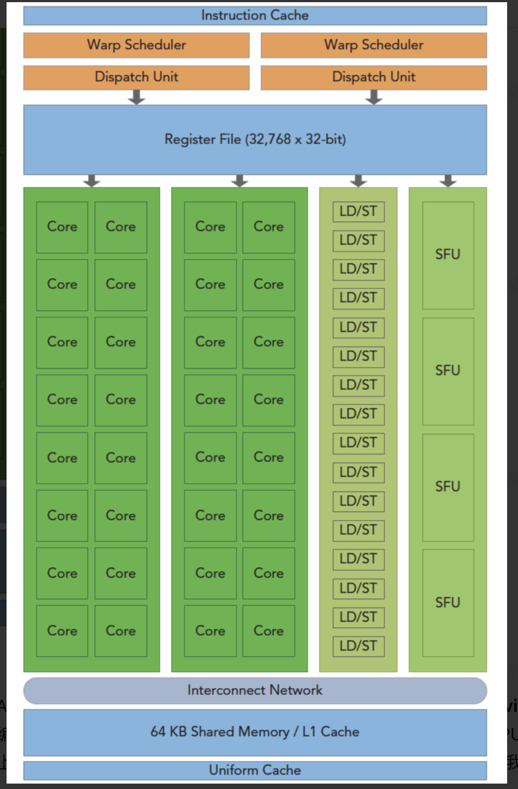
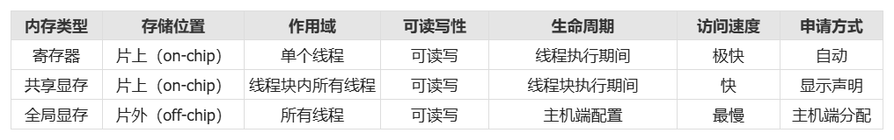

### GPU的结构

它是是围绕一个流式多处理器（SM）的扩展阵列搭建的

- **LD/ST（Load/Store）单元**：负责内存加载和存储操作，用于在寄存器和全局内存、共享内存之间传输数据。

- **SFU（Special Function Unit）**：专门执行特殊数学运算，比如三角函数、指数函数和倒数等，提升计算复杂函数的效率。

- **CUDA Core**：是NVIDIA GPU中的基本计算单元，负责执行基本的算术逻辑运算（如加法、乘法），是实现并行计算的核心组件。

- **Dispatch Unit（分发单元）**：负责将指令从线程束调度器发送到适当的执行单元（例如 CUDA Cores、LD/ST 或 SFU）。

- **Warp Scheduler（线程束调度器）**：负责管理和调度一个SM（Streaming Multiprocessor）内的warp（一组32个线程打包，线程束）；它选择准备好的warp并将它们的指令分派给相应的执行单元。(一个线程块（thread block）一旦被分配到某个 SM 上，就会在其上完成全部执行过程，不会迁移到其他 SM；每个线程束中的线程会**同时执行相同的指令**，但各自使用不同的数据。)

  线程-线程块-网格

  



```cuda
int i = threadIdx.x + blockIdx.x * blockDim.x;  
```

int i = threadIdx.x （第几个线程）+ blockIdx.x （第几个块）*blockDim.x（线程数量）;

### **L1和L2cache原理：**

- **L1 Cache / Shared Memory**：
  - 驻留在**单个 SM** 内部。
  - 同一个 SM 内的所有 Warp**共享**这个 SM 的 L1 Cache。（但是每个block独享一份共享内存）
  - Warp 只是 SM 中的调度单位，它本身不包含任何存储结构（如 Cache 或寄存器），寄存器也是 SM 的资源。
- **L2 Cache**：
  - 位于 SM 外部，是整个 GPU 芯片上的**全局共享缓存**。
  - 所有 SM（例如 GA102 芯片有 84 个 SM）共同访问同一个 L2 Cache。

- **时间局部性**：如果一个数据被访问，它很可能在短时间内再次被访问（例如循环中的变量）。缓存会将这个数据保留一段时间。

- **空间局部性**：如果一个地址被访问，其相邻的地址也很可能被访问（例如数组顺序访问）。缓存会一次读入一个**缓存行**（通常 128 字节），从而提前加载邻近数据。

  缓存内部划分为若干**缓存行**（Cache Line，也称块）。每个缓存行有一个**标签**（Tag）和状态位（有效位、脏位等）。GPU 的 SM 或核心访问一个内存地址时，执行以下步骤：

1. **地址分解**：硬件将内存地址划分为三个字段：**标签**、**组索引**、**块内偏移**。
2. **定位组**：根据**组索引**找到缓存中对应的“组”（一个组可包含多行，例如组相联结构）。
3. **比较标签**：将该组内所有行的标签与地址的**标签**字段进行并行比较。
4. **命中判断**：
   - 如果某行的标签匹配且有效位为 1，则**命中**（Hit）。
   - 如果没有任何行匹配，则**缺失**（Miss）。

**命中后**，根据块内偏移从缓存行中直接取出数据返回给 SM/核心，无需访问更慢的下一级内存（如 L2 或显存）。

- **L1 缓存**：与 Shared Memory 共享硬件资源，利用同一 SM 内线程的强空间和时间局部性（例如相邻线程访问连续地址）。命中率高时，可显著降低 L2 或显存访问延迟。
- **L2 缓存**：被所有 SM 共享，缓存来自不同 SM 的全局访问。其容量较大，利用跨 SM 的局部性（例如多个 SM 可能读取相同数据块，如常数纹理）。L2 命中可避免访问高延迟的显存（DRAM）。

**总结一句话**：L1/L2 通过**预先存储最近或邻近地址的数据块**，并在后续访问时进行**快速标签比对**，若发现所需数据已在缓存中即为“命中”。这依赖于局部性原理及组相联映射的硬件实现。


### **数据传输**

```
cudaMalloc 分配内存
cudaMemcpy 传输数据
   cudaMemcpyHostToHost
   cudaMemcpyHostToDevice
   cudaMemcpyDeviceToDevice
   cudaMemcpyDeviceToHos
cudaFree 释放显存
```

cuda的编程原则是，线程块并行，线程并行，写出一个线程的操作


