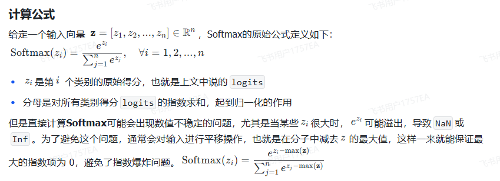
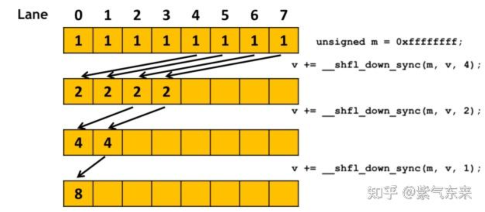

# Softmax

softmax将输入向量映射到0-1的分布之间，为预测各个输出的概率

通常减去向量最大值保证数据不会溢出



优化1：共享内存extern __shared__ float shared[];存储局部最大值与和同时进行线程块内规约

优化2：降低了数据通信延迟，warp洗牌指令进行warp内规约

```
__device__ float warpReduceMax(float val) {

 for (int offset = 16; offset > 0; offset /= 2) {

  val = fmaxf(val, __shfl_down_sync(0xFFFFFFFF, val, offset));

 }

 return val;

}
```

```C++
// 从特定的束内线程获取数值，跨线程束值的广播
T __shfl_sync(unsigned int mask, T var, int srcLane, int width = warpSize);
// 通过线程束上移获取数值
T __shfl_up_sync(unsigned int mask, T var, unsigned int delta, int width = warpSize);
// 通过线程束下移获取数值
T __shfl_down_sync(unsigned int mask, T var, unsigned int delta, int width = warpSize);
```



优化3：综合1-2，同时将warp内规约结果进行规约（取得430x的优化效果）
