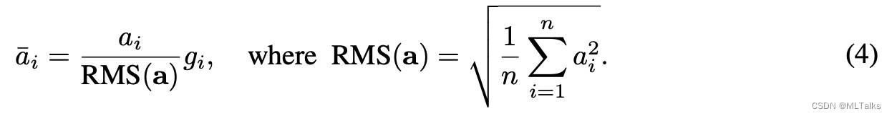

# **Reduce**

Reduce是计算一组数据的和

什么是线程束分化？（每个warp内的执行指令必须是相同的，如果执行的指令不相同，会等第一个指令执行完再执行第二个指令）

什么是存储体冲突（发生在同一个block，同一个warp内，因为是同一时钟周期的请求）：

​        本质：同一 warp 线程并发访问同一存储体的数据，导致访存串行化；

​        根源：32 个存储体的并行设计，要求线程访问不同存储体才能高效；

​        解决：对于同一 warp 内的数据交互，优先用**寄存器级的 warp shuffle 指令**替代共享内存，从根源上规避存储体冲突（甚至无需使用共享内存）

共享内存的作用域是「单个线程块（block）」，而非整个 SM（流式多处理器）

初始版本中，我们采用了线程块内的归约策略，但由于线程闲置和线程束分化，资源利用率较低；

1. 优化1：通过引入**预归约**机制，我们让每个线程处理两个全局内存元素，提高线程利用率；
2. 优化2：我们采用 tid < s 的判断方式替代取模运算，显著减少线程束内部的控制分歧并避免 bank conflict；
3. 优化3：使用 warp-level 原语 __shfl_down_sync 实现高效的 warp 内归约

比layernorm少了去均值的操作
