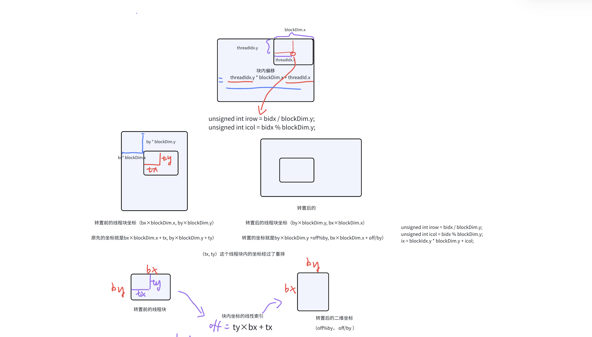

### 存储体和存储体冲突（bank冲突）

为了获得更高的内存带宽，共享显存被划分为 32 个等大小的存储单元，称为 **存储体（bank）**。这种设计使得所有线程可以并行访问不同的存储体。之所以使用 32 个存储体，是因为一个线程束（warp）恰好包含 32 个线程，每个线程可以独立地访问一个对应的存储体。

共享显存的地址会根据一定的规则映射到这 32 个存储体中。当一个 warp 中的多个线程同时访问同一个存储体中的不同数据时，就会发生所谓的 **bank 冲突（bank conflict）**，从而导致访问效率下降。

我们以一个具体示例来说明这个问题。假设每个**字**（word）为 4 字节，共享显存按照 128 字节为单位进行循环排列：

- 地址 0～3（共 4 字节）位于 bank 0
- 地址 4～7 位于 bank 1
- 地址 8～11 位于 bank 2
- ...
- 地址 128～131 又回到 bank 0

这样就形成了地址与存储体之间的一种周期性映射关系。

### 判断是否发生 bank 冲突

1. **相邻线程访问同一 bank 的不同数据会导致冲突**
2. 例如：thread 0 访问地址 0（bank 0），thread 1 访问地址 128（也属于 bank 0），thread 2 访问地址 256（同样属于 bank 0）。虽然这些线程访问的是不同位置的数据，但由于它们都落在同一个 bank 中，因此会产生 bank 冲突。
3. **计算 bank 编号的通用公式**

一个bank的宽度是4个字节，32位，一共有32个bank，所以每过32个bank就会重新绕回原来的bank

1. 存储体索引 = (字节地址 ÷ 每个 bank 的宽度) % 总 bank 数量 其中：
   1. 字节地址是相对于共享显存起始位置的偏移；
   2. **每个 bank 的宽度通常是 4 字节**，取决于硬件架构；
   3. bank 数量是 32。
2. 举例说明：
   1. 字节地址 0：(0 ÷ 4) % 32 = 0 → bank 0
   2. 字节地址 128：(128 ÷ 4) % 32 = 32 % 32 = 0 → bank 0
   3. 所以这两个地址都会映射到 bank 0，如果两个线程同时访问它们，就会产生冲突。
3. **同一地址的并发访问不构成 bank 冲突**
4. 如果多个线程访问的是**同一个 bank 中的相同地址**，比如都访问地址 0，这种情况不会造成 bank 冲突，因为硬件可以广播该数据给多个线程。只有当多个线程同时访问**同一 bank 中的不同地址**时，才会出现冲突。

```
需要注意：在处理二维数组时，若多个线程按列方向写入数据，每个线程的地址相差一个行宽（width），则会导致线程束（warp）内的访问地址分散。相比之下，在同一个线程束内，如果所有线程依次访问连续的内存地址（例如：线程 i 读取地址 `base + i * sizeof(T)`，且总跨度对齐到内存事务边界），这些访问可以被硬件**合并为一次或少数几次内存事务**，这就是所谓的**合并访问**。
为什么要进行warp up：
1. 预热（Warm-up）：首先执行 warp_up_iter 次循环，确保 GPU 已进入稳定状态，避免首次运行带来的性能抖动；
2. 正式测试：随后连续运行目标kernel函数 5 次，记录每次执行时间，并计算平均值以减少测量误差。
```

在transpose中出现bank冲突原因是，将相邻内存数据存入共享显存后，从共享显存读取数据从（y,x)变成了（x,y），相邻线程形成间隔

```c++
__global__ void transposeSmem(float *out, float *in, const int nx, const int ny) {
  __shared__ float tile[BDIMY][BDIMX+IPAD]; // 共享内存分块：BDIMY行、BDIMX列，单个block对应一块tile，+1消除存储体冲突，多出来那一列是闲置占位元素，线程永远不用读写，只用来撑大行跨度、错开 Bank。
  // ========== ① 计算原输入矩阵全局坐标，从Global Memory读数据 ==========
  unsigned int ix = blockDim.x * blockIdx.x + threadIdx.x; // ix：原矩阵【列号】(x=列)
  unsigned int iy = blockDim.y * blockIdx.y + threadIdx.y; // iy：原矩阵【行号】(y=行)
  // 原矩阵一维线性索引：行优先存储 index = 行×总列数 + 列
  unsigned int ti = iy * nx + ix;

  // ========== ② block内线程坐标重映射：实现tile内部转置（关键代码） ==========
  // bidx：把block内二维(ty,tx)平铺成一维序号：ty*块宽+tx
  unsigned int bidx = threadIdx.y * blockDim.x + threadIdx.x;
  // irow：转置后在tile里的行 = bidx / blockDim.y
  unsigned int irow = bidx / blockDim.y;
  // icol：转置后在tile里的列 = bidx % blockDim.y
  unsigned int icol = bidx % blockDim.y;
  /*
  举例：block尺寸 BDIMY=8,BDIMX=32
  原块内坐标(tx,ty) → bidx一维编号 → (irow,icol) = 块内转置坐标
  实现 tile[ty][tx] → tile[icol][irow]，完成小块内部转置
  */

  // ========== ③ 映射到输出转置矩阵的全局坐标 ==========
  ix = blockIdx.y * blockDim.y + icol; // 新ix：输出矩阵列
  iy = blockIdx.x * blockDim.x + irow; // 新iy：输出矩阵行
  // 输出矩阵一维索引：转置矩阵是nx行ny列，行×ny + 列
  unsigned int to = iy * ny + ix;z

  // ========== ④ 边界判断+读写共享内存（分块转置核心） ==========
  if (ix < nx && iy < ny) {
    tile[threadIdx.y][threadIdx.x] = in[ti]; // 第一步：全局→共享内存【按行连续读，合并访存】
    __syncthreads();                         // 同步：等待同block所有线程写完tile，防止读脏数据
    out[to] = tile[icol][irow];              // 第二步：共享→全局，从转置后的tile取数写入输出
  }
}
```



全局一维坐标，block内一维坐标+在tile转换后的坐标，转换后的一维坐标；

全局一维坐标写进tile，tile转换后的坐标写进转换后一维坐标。