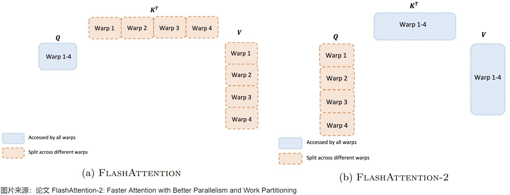

# FlashAttention 1-4 完整学习教程

> **适用场景**：AI Infra 面试准备、CUDA 算子开发、LLM 推理优化
> **作者**：基于 Tri Dao 等论文整理 | 2026 年 5 月

---

## 目录

1. [前置知识：标准 Attention 的访存瓶颈](#1-前置知识标准-attention-的访存瓶颈)
2. [理论基础：Online Softmax 与 Tiling](#2-理论基础online-softmax-与-tiling)
3. [FlashAttention-1：融合 IO-Aware 的精确注意力](#3-flashattention-1融合-io-aware-的精确注意力)
4. [FlashAttention-2：更好的并行性与工作划分](#4-flashattention-2更好的并行性与工作划分)
5. [FlashAttention-3：Hopper 架构的极致异步](#5-flashattention-3hopper-架构的极致异步)
6. [FlashAttention-4：Blackwell 时代的算法-内核联合设计](#6-flashattention-4blackwell-时代的算法-内核联合设计)
7. [各版本对比总览](#7-各版本对比总览)
8. [面试高频问题与回答要点](#8-面试高频问题与回答要点)

---

## 1. 前置知识：标准 Attention 的访存瓶颈

### 1.1 标准 Scaled Dot-Product Attention

给定查询 $\mathbf{Q} \in \mathbb{R}^{N \times d}$、键 $\mathbf{K} \in \mathbb{R}^{N \times d}$、值 $\mathbf{V} \in \mathbb{R}^{N \times d}$，注意力计算为：

$$
\mathbf{S} = \frac{\mathbf{Q}\mathbf{K}^\top}{\sqrt{d}} \in \mathbb{R}^{N \times N}
$$

$$
\mathbf{P} = \text{softmax}(\mathbf{S}) \in \mathbb{R}^{N \times N}
$$

$$
\mathbf{O} = \mathbf{P}\mathbf{V} \in \mathbb{R}^{N \times d}
$$

其中 $\text{softmax}$ 按行计算：

$$
\text{softmax}(\mathbf{x})_i = \frac{e^{x_i}}{\sum_{j=1}^{N} e^{x_j}}
$$

### 1.2 访存分析：为什么标准 Attention 慢？

在 GPU 上执行标准 Attention 时，中间矩阵 $\mathbf{S}$ 和 $\mathbf{P}$ 的大小均为 $O(N^2)$，必须完整写入/读出 HBM（高带宽显存）。

**以 GPT-3 为例**（$N = 2048, d = 128$）：

- $\mathbf{S}$ 大小：$2048 \times 2048 \times 2\text{ bytes} = 8\text{ MB}$（FP16）
- $\mathbf{P}$ 大小：同样 $8\text{ MB}$
- 前向 pass 中 $\mathbf{S}$ 被写入 HBM 后立即读回，形成 **round-trip**

**瓶颈本质**：Attention 是 **memory-bound** 操作。A100 GPU：

| 指标 | 数值 |
|------|------|
| HBM 带宽 | 2.0 TB/s（A100 80GB） |
| FP16 matmul 算力 | 312 TFLOPS |
| 非 matmul 算力 (FP32) | 19.5 TFLOPS |
| **matmul vs 非 matmul 速率比** | **16 : 1** |

当 $N = 1024, d = 64$ 时，标准 Attention 仅能达到约 **20-30 TFLOPS**（不到峰值算力的 10%），因为大部分时间在等待 HBM 数据搬运。

### 1.3 GPU 内存层次

```
┌──────────────────────────────────────────────────────┐
│  HBM (High Bandwidth Memory)                         │
│  容量: ~80 GB | 带宽: ~2 TB/s                        │
│  ┌──────────────────────────────────────────────┐    │
│  │  L2 Cache                                    │    │
│  │  容量: ~40 MB | 带宽: ~4 TB/s                │    │
│  │  ┌─────────────────────────────────────┐    │    │
│  │  │  SRAM / Shared Memory (per SM)      │    │    │
│  │  │  容量: ~228 KB | 带宽: ~19 TB/s     │    │    │
│  │  └─────────────────────────────────────┘    │    │
│  └──────────────────────────────────────────────┘    │
└──────────────────────────────────────────────────────┘
```

**核心思想**：让计算尽可能发生在 SRAM 中，减少与 HBM 之间的数据搬运。

---

## 2. 理论基础：Online Softmax 与 Tiling

在进入 FlashAttention 之前，先理解两个关键理论基础。

### 2.1 Naive Softmax 的问题

标准 softmax 需要三次遍历全序列：

```
Pass 1: max(x) → m       // 找最大值（数值稳定性）
Pass 2: sum(exp(x - m)) → l  // 求分母
Pass 3: exp(x_i - m) / l  // 归一化
```

**三次全局遍历**意味着数据必须全部驻留在内存中，无法分块。

### 2.2 Online Softmax

Online Softmax 的关键洞察：**可以在一次遍历中增量更新统计量**，每次只处理一个数据块。

设当前已处理了 $j-1$ 个块，统计量为 $(m_{\text{old}}, \ell_{\text{old}})$，新块 $\mathbf{x}^{(j)}$ 引入后：

**步骤 1：更新最大值**
$$
m_{\text{new}} = \max\left(m_{\text{old}}, \max(\mathbf{x}^{(j)})\right)
$$

**步骤 2：更新指数和（注意对旧项做缩放修正）**

$$
\ell_{\text{new}} = e^{m_{\text{old}} - m_{\text{new}}} \cdot \ell_{\text{old}} + \sum_i e^{x_i^{(j)} - m_{\text{new}}}
$$

**最终结果**（所有块处理完毕）：

$$
\text{softmax}(\mathbf{x})_i = \frac{e^{x_i - m_{\text{final}}}}{\ell_{\text{final}}}
$$

**正确性证明**：

$$
\begin{aligned}
\ell_{\text{new}} &= e^{m_{\text{old}} - m_{\text{new}}} \cdot \ell_{\text{old}} + \sum_{i \in j} e^{x_i - m_{\text{new}}} \\[6pt]
&= e^{m_{\text{old}} - m_{\text{new}}} \sum_{i < j} e^{x_i - m_{\text{old}}} + \sum_{i \in j} e^{x_i - m_{\text{new}}} \\[6pt]
&= \sum_{i < j} e^{x_i - m_{\text{new}}} + \sum_{i \in j} e^{x_i - m_{\text{new}}} \\[6pt]
&= \sum_{i \leq j} e^{x_i - m_{\text{new}}}
\end{aligned}
$$

即 $\ell_{\text{new}}$ 确为以新最大值 $m_{\text{new}}$ 为基准的全量指数和
$$
m_{\text{new}}
$$
### 2.3 Tiling 策略

将大矩阵拆分为小的 tile，每次只将一个 tile 加载到 SRAM：

```
Q: [M, d] → 分成 tile_m × d 的块
K: [N, d] → 分成 tile_n × d 的块
V: [N, d] → 分成 tile_n × d 的块
```

外层循环遍历 Q 块，内层循环遍历 K/V 块，在每个 tile 对内执行局部注意力计算。

---

## 3. FlashAttention-1：融合 IO-Aware 的精确注意力

> **论文**：FlashAttention: Fast and Memory-Efficient Exact Attention with IO-Awareness (NeurIPS 2022)
> **作者**：Tri Dao, Daniel Y. Fu, Stefano Ermon, Atri Rudra, Christopher Ré

### 3.1 核心思想

FlashAttention 的三大支柱：

1. **Tiling（分块）**：将 $\mathbf{Q}, \mathbf{K}, \mathbf{V}$ 切分为小块，每次只处理一个小块组合
2. **Recomputation（重计算）**：反向传播时不保存 $\mathbf{P}$ 矩阵，利用前向保存的 LSE 重计算
3. **IO-Awareness**：显式管理数据在 HBM ↔ SRAM 之间的流动，最小化 HBM 读写

**结果**：
- 显存占用（峰值激活）从 $O(N^2)$ 降为 $O(N)$
- HBM 访问量从 $O(Nd + N^2)$ 降为 $O(N^2 d^2 / M)$（$M$ 为 SRAM 大小）
- 相对于标准实现的加速比 **2-4×**
- **精确计算**（非近似），支持 **最长 64K** 序列长度

### 3.2 前向传播算法

#### 分块尺寸定义

设块大小分别为 $B_r$（Q 的行分块）和 $B_c$（K/V 的行分块），将 $\mathbf{Q}$ 分为 $T_r = \lceil N / B_r \rceil$ 块，$\mathbf{K}, \mathbf{V}$ 分为 $T_c = \lceil N / B_c \rceil$ 块。

#### 完整算法流程

```
算法 1：FlashAttention Forward Pass
────────────────────────────────────────
输入: Q, K, V ∈ R^{N×d}, 块大小 B_r, B_c
输出: O ∈ R^{N×d}, L ∈ R^N (log-sum-exp)

1: 将 Q 划分为 T_r = ⌈N/B_r⌉ 块: Q_1, ..., Q_{Tr}
2: 将 K, V 划分为 T_c = ⌈N/B_c⌉ 块: K_1,...,K_{Tc}, V_1,...,V_{Tc}
3: 将 O 划分为 T_r 块: O_1, ..., O_{Tr}
4: 将 L 划分为 T_r 块: L_1, ..., L_{Tr}

5: for i = 1 to T_r do                          ← 外层循环: 遍历 Q 块
6:    从 HBM 加载 Q_i 到 SRAM
7:    初始化: m_i = (-∞, ..., -∞) ∈ R^{B_r}     ← 运行最大值
8:    初始化: ℓ_i = (0, ..., 0) ∈ R^{B_r}       ← 运行指数和
9:    初始化: O_i = 0 ∈ R^{B_r×d}               ← 运行输出

10:    for j = 1 to T_c do                       ← 内层循环: 遍历 K,V 块
11:       从 HBM 加载 K_j, V_j 到 SRAM

12:       在 SRAM 中计算:
         S_{ij} = Q_i · K_j^T ∈ R^{B_r×B_c}      ← 局部注意力得分

13:       更新局部 softmax 统计量:
         m̃_{ij} = rowmax(S_{ij})                  ← 当前块的最大值
         P̃_{ij} = exp(S_{ij} - m̃_{ij})           ← 当前块的非归一化概率
         ℓ̃_{ij} = rowsum(P̃_{ij})                  ← 当前块的指数和

14:       更新全局统计量:
         m_i^{new} = max(m_i, m̃_{ij})
         ℓ_i^{new} = e^{m_i - m_i^{new}} · ℓ_i + e^{m̃_{ij} - m_i^{new}} · ℓ̃_{ij}

15:       更新输出:
         O_i = diag(e^{m_i - m_i^{new}})^{-1} · O_i + P̃_{ij} · V_j

16:       更新 m_i = m_i^{new}, ℓ_i = ℓ_i^{new}
17:    end for

18:    最终归一化:
      O_i = diag(ℓ_i)^{-1} · O_i                  ← 除以指数和
      L_i = m_i + log(ℓ_i)                        ← 保存 LSE 用于反向
19:    将 O_i 写入 HBM, 将 L_i 写入 HBM
20: end for
```

#### 关键公式详解

**步骤 14 的缩放修正**：当新的最大值 $m_i^{\text{new}}$ 出现时，需要对旧的 $\ell_i$ 和 $\mathbf{O}_i$ 进行「降权」修正。

设旧状态基于最大值 $m_i$，新状态基于 $m_i^{\text{new}}$，且 $m_i^{\text{new}} > m_i$：

- 旧指数和的"贬值"因子：$e^{m_i - m_i^{\text{new}}}$
- 旧输出的"贬值"因子同理

$$
\ell_i^{\text{new}} = \underbrace{e^{m_i - m_i^{\text{new}}} \cdot \ell_i}_{\text{旧项的贡献（缩放后）}} + \underbrace{e^{\tilde{m}_{ij} - m_i^{\text{new}}} \cdot \tilde{\ell}_{ij}}_{\text{新块的贡献}}
$$

**步骤 15 的输出更新**：同理，对输出做增量加权累加：

$$
\mathbf{O}_i^{\text{new}} = \text{diag}\left(e^{m_i - m_i^{\text{new}}}\right)^{-1} \cdot \mathbf{O}_i^{\text{old}} + \tilde{\mathbf{P}}_{ij} \cdot \mathbf{V}_j
$$

这里 $\tilde{\mathbf{P}}_{ij} = \exp(\mathbf{S}_{ij} - m_i^{\text{new}})$，已经用新最大值做了归一化。

**最终归一化**（步骤 18）：

$$
\mathbf{O}_i = \text{diag}(\ell_i)^{-1} \cdot \mathbf{O}_i
$$

### 3.3 反向传播算法

反向传播的核心思想：**不保存 $\mathbf{P}$，而是利用前向保存的 LSE 重计算**。

#### 梯度推导

已知 $\mathbf{O} = \mathbf{P}\mathbf{V}$，并收到 $\mathbf{dO}$（输出梯度）。

**$\mathbf{dV}$ 的计算**（线性变换，无需 softmax 的 $\mathbf{P}$）：

$$
\mathbf{dV} = \mathbf{P}^\top \cdot \mathbf{dO}
$$

**$\mathbf{dP}$ 的计算**（链式法则 $\mathbf{O} = \mathbf{P}\mathbf{V}$）：

$$
\mathbf{dP} = \mathbf{dO} \cdot \mathbf{V}^\top
$$

**softmax 的反向传播**（核心公式）：

定义 $D = \text{rowsum}(\mathbf{dO} \odot \mathbf{O})$，其中 $\odot$ 表示逐元素乘法。则：

$$
\mathbf{dS} = \mathbf{P} \odot \left(\mathbf{dP} - \text{rowsum}(\mathbf{dO} \odot \mathbf{O})\right) = \mathbf{P} \odot (\mathbf{dP} - D)
$$

**$\mathbf{dQ}, \mathbf{dK}$ 的计算**：

$$
\mathbf{dQ} = \mathbf{dS} \cdot \mathbf{K}, \quad \mathbf{dK} = \mathbf{dS}^\top \cdot \mathbf{Q}
$$

#### 反向传播的 Tiling

与正向类似，反向也需要分块。但在反向中需要重新计算 $\mathbf{P}$：

1. 从 HBM 加载 $\mathbf{Q}_i, \mathbf{K}_j, \mathbf{V}_j$ 和 $\mathbf{dO}_i$（已分块）
2. 在 SRAM 中重计算 $\mathbf{S}_{ij} = \mathbf{Q}_i\mathbf{K}_j^\top$
3. 利用前向保存的 LSE 计算 $\mathbf{P}_{ij} = \exp(\mathbf{S}_{ij} - m_i) / \ell_i$
4. 计算局部梯度并累加到 $\mathbf{dQ}, \mathbf{dK}, \mathbf{dV}$

### 3.4 IO 复杂度分析

| 阶段 | 标准 Attention | FlashAttention |
|------|:---:|:---:|
| 前向 | $O(Nd + N^2)$ | $O(N^2d^2M^{-1})$ |
| 反向 | $O(Nd + N^2)$ | $O(N^2d^2M^{-1})$ |
| 显存峰值 | $O(N^2)$ | $O(N)$ |

其中 $M$ 为 SRAM 大小。FlashAttention 的 HBM 访问与 $N^2$ 成正比但系数远小（被 $d^2/M$ 因子压缩）。

### 3.5 局限性

1. **并行度受限**：仅沿 batch × head 维度并行，长序列 + 小 batch 时 GPU 利用率低
2. **非 matmul FLOPs 开销大**：online softmax 的 rescaling、masking 等操作占据了可观的计算时间
3. **Forward/Backward 共享同一线程块**：资源分配不灵活

---

## 4. FlashAttention-2：更好的并行性与工作划分

> **论文**：FlashAttention-2: Faster Attention with Better Parallelism and Work Partitioning (2023)
> **作者**：Tri Dao

### 4.1 核心改进

FlashAttention-2 在 FA1 基础上做了 **三个关键优化**：

| 改进 | 具体内容 | 效果 |
|------|---------|------|
| **减少非 matmul FLOPs** | 重写 online softmax，减少 rescaling、bound-checking、causal masking 次数 | 减少 ~30% 非 matmul 计算 |
| **序列长度维度并行** | 在 batch × head 之外，增加沿 sequence length 的并行 | 长序列 + 小 batch 时显著加速 |
| **Sliced-Q 工作划分** | warp 之间沿着 Q 维度拆分，消除 warp 间通信 | 减少 shared memory 读写 |

### 4.2 减少非 matmul FLOPs

**问题**：GPU 上非矩阵乘法（exp、max、sum、mask 等）的速度仅为矩阵乘法的 1/16。

**优化**：重写 online softmax 算法，在不改变数学结果的前提下：

- **因果掩码优化**：只对下三角区域执行计算，跳过被掩码的部分
- **减少 rescaling**：当最大值未更新时，跳过 $\mathbf{O}_i$ 的缩放修正
- **消除边界检查**：通过 padding 和循环展开减少 warp divergence

数学上等价——只是减少不必要的指令执行。

### 4.3 并行策略升级

#### FA1 的并行策略（仅沿 batch × head）

```
并行维度: batch × num_heads  => 总共 batch × H 个 thread block
每个 thread block 负责: 1 个 Q 块 × 所有 KV 块
```

当 $N$ 很大但 batch 和 head 很少时（如推理场景 batch=1），无法充分利用 GPU 的 108 个 SM。

#### FA2 的改进：序列长度维度的额外并行

```
并行维度: batch × num_heads × seqlen_q_blocks
即: batch × H × T_r 个 thread block
```

前向传播：

$$
\mathbf{Q} \text{ 分成 } T_r \text{ 块},\quad \mathbf{K}, \mathbf{V} \text{ 分成 } T_c \text{ 块}
$$

每个 thread block 负责一个 $(\text{batch}, \text{head}, i)$ 组合，对 $j$ 做循环。

反向传播同理，批次外循环可扩展到更多块。



### 4.4 Sliced-Q 工作划分（核心创新）

这是 FA2 最重要的改变——改变了单个 thread block 内部 warp 之间的数据划分方式。

#### FA1 的方案：Sliced-K

```
Thread Block 内 4 个 Warp:
  Warp 0 ───→ 加载 K[0:64], V[0:64]，计算 Q×K^T 的部分
  Warp 1 ───→ 加载 K[64:128], V[64:128]，计算 Q×K^T 的部分
  Warp 2 ───→ 加载 K[128:192], V[128:192]
  Warp 3 ───→ 加载 K[192:256], V[192:256]

  所有 warp 共享 Q，各自得到部分 O
  需要: 写入 shared memory → sync → 累加 → sync
```

**问题**：必须在 shared memory 中通信和同步，造成额外延迟。

#### FA2 的方案：Sliced-Q

```
Thread Block 内 4 个 Warp:
  Warp 0 ───→ Q[0:64]    × K^T → O[0:64]
  Warp 1 ───→ Q[64:128]  × K^T → O[64:128]
  Warp 2 ───→ Q[128:192] × K^T → O[128:192]
  Warp 3 ───→ Q[192:256] × K^T → O[192:256]

  所有 warp 共享 K 和 V
  每个 warp 独立产生自己的输出块
  无需 warp 间通信！
```

**为什么高效**：
- 每个 warp 的 Q 块与 K^T 相乘，自然地产生对应的 O 块
- **零 warp 间通信**，无需 shared memory 中转
- 减少 shared memory 读写，降低延迟

### 4.5 前向传播算法（改进版）

与 FA1 前向的差异主要体现在 warp 内部的数据分配。算法框架不变：

```
for i = 1 to T_r:      ← 外层: Q 块（可并行到不同 block）
  for j = 1 to T_c:    ← 内层: KV 块（串行，但用 sliced-Q 在 warp 内并行）
    S_ij = Q_i × K_j^T
    online_softmax_update(S_ij)
    O_i += P_ij × V_j
```

- FA1: 外层 `i` 是 thread block 维度，内层 `j` 串行，K/V 在 warp 间拆分
- FA2: 外层 `i` 是 thread block 维度（可扩展嵌套并行），内层 `j` 串行，**Q 在 warp 间拆分**

### 4.6 支持的新特性

| 特性 | FA1 | FA2 |
|------|:---:|:---:|
| 最大 head 维度 | 128 | **256** |
| Multi-Query Attention (MQA) | ❌ | ✅ |
| Grouped-Query Attention (GQA) | ❌ | ✅ |
| ALiBi 位置编码 | ❌ | ✅ |

### 4.7 性能表现（A100 80GB SXM4, BF16）

| 模型配置 | FA1 | FA2 | 加速比 |
|---------|:---:|:---:|:---:|
| GPT3-1.3B, 2K ctx | 189 TFLOPS | 196 TFLOPS | 1.04× |
| GPT3-1.3B, **8K ctx** | 170 TFLOPS | **220 TFLOPS** | 1.29× |
| GPT3-2.7B, 2K ctx | 189 TFLOPS | 205 TFLOPS | 1.08× |
| GPT3-2.7B, **8K ctx** | 175 TFLOPS | **225 TFLOPS** | 1.29× |

**端到端模型 FLOP 利用率**：最高 72%。

---

## 5. FlashAttention-3：Hopper 架构的极致异步

> **论文**：FlashAttention-3: Fast and Accurate Attention with Asynchrony and Low-Precision (2024)
> **作者**：Jay Shah, Ganesh Bikshandi, Ying Zhang, Vijay Thakkar, Pradeep Ramani, Tri Dao

### 5.1 背景：Hopper (H100) 的新硬件特性

FlashAttention-3 专门针对 H100 设计，利用了三项关键新硬件能力：

| 硬件特性 | 功能 | 对 Attention 的影响 |
|---------|------|-------------------|
| **TMA** (Tensor Memory Accelerator) | 专用的异步数据搬运单元（HBM ↔ SMEM） | 数据加载不占 CUDA Core 算力 |
| **WGMMA** (Warp Group MMA) | 异步 Tensor Core 矩阵乘法 | 发射后不阻塞，可继续执行其他指令 |
| **FP8 Tensor Core** | 低精度矩阵乘法（2× 吞吐量 vs FP16） | 理论峰值 2× |

**关键约束**：FP8 WGMMA 要求输入为 **k-major** 布局，而 FP32 累加器的默认布局与之不兼容。

### 5.2 三大核心技术

#### 技术一：Warp Specialization + Pingpong 调度

将 CTA（Cooperative Thread Array）内的 warp 分为两组：

```
┌────────────────────────────────────────────────────────┐
│  Producer Warpgroup (少量 warp)                         │
│  职责: 通过 TMA 异步加载数据 (HBM → SMEM)                  │
│  使用 setmaxnreg 释放寄存器给 Consumer                    │
├────────────────────────────────────────────────────────┤
│  Consumer Warpgroup (多数 warp)                         │
│  职责: 执行 WGMMA + Softmax 计算                         │
│  获得 Producer 释放的寄存器                               │
└────────────────────────────────────────────────────────┘ 
```

**Pingpong 调度**：两个 warpgroup 交替执行 GEMM 和 Softmax，隐藏延迟。

```
时序:
Warpgroup 1: [GEMM₀] ─── [Softmax₀] ─── [GEMM₂] ─── [Softmax₂] ─── ...
Warpgroup 2:         [GEMM₁] ─── [Softmax₁] ─── [GEMM₃] ─── ...

效果: Softmax 的延迟被 GEMM 的计算时间完全隐藏
```

**性能提升**：FP16 Forward 从 570 TFLOPS → 620-640 TFLOPS（约 **12%**）。

#### 技术二：2-Stage WGMMA-Softmax 流水线

将 Softmax 与 GEMM 在同一个 Consumer Warpgroup 内流水线化。

```
Algorithm: 2-Stage WGMMA-Softmax Pipeline (Consumer 视角)
─────────────────────────────────────────────────────────

for j = 1 to T_c - 1:
    1. 发射 S_next = Q_i × K_j^T     ← WGMMA (异步)
    2. 发射 O_i += P_cur × V_{j-1}   ← WGMMA (异步，上一轮的 P)
    3. 等待 S_next 完成
    4. 计算 m_i, P_next, ℓ_i from S_next  ← Softmax
    5. 等待 P_cur × V_{j-1} 完成，重缩放 O_i
    6. 交换: S_cur ← S_next, P_cur ← P_next
```

**为什么有效**：

- FP16 下，指数运算吞吐量仅为 matmul 的 $1/256$
- 但 Attention 中 exp() FLOPs 约为 matmul FLOPs 的 $1/512$
- 尽管如此，exp() 仍然可能占据 50% 的周期时间
- **将 exp() 隐藏在 WGMMA 之后，实现时间上重叠**

**三级流水线（可选）**：可将第二级 WGMMA 也流水线化，进一步隐藏延迟，但会增大寄存器压力。

#### 技术三：FP8 低精度支持

**挑战**：FP8 WGMMA 要求 k-major 布局，与自然的数据布局冲突。

**解决方案**：

**(a) 布局转换**：
- Producer Warp 中使用 `LDSM`/`STSM` 指令对 $\mathbf{V}$ 矩阵做 tile 级转置
- 使用 byte permute 指令将第一个 WGMMA 的累加器格式转换为第二个 WGMMA 需要的格式

**(b) 块量化 (Block Quantization)**：

传统方法使用一个全局标量缩放整个张量。FA3 利用 tiling 天然结构，**每个块独立缩放**：

$$
\mathbf{S}_{ij} = (\mathbf{Q}_i \odot \text{scale}_{Q_i}) \cdot (\mathbf{K}_j \odot \text{scale}_{K_j})^\top
$$

缩放因子可融入 $\mathbf{S}$ 的计算中，零额外开销。

**(c) 非相干处理 (Incoherent Processing)**：

$$
(\mathbf{Q}\mathbf{M})(\mathbf{K}\mathbf{M})^\top = \mathbf{Q}\mathbf{M}\mathbf{M}^\top\mathbf{K}^\top = \mathbf{Q}\mathbf{K}^\top
$$

$\mathbf{M}$ 为随机正交矩阵（±1 对角矩阵 × Hadamard 矩阵）：

- 使 $\mathbf{Q}$ 和 $\mathbf{K}$ 各行在数值上「去相干」，减少量化误差
- 计算复杂度 $O(d \log d)$（Hadamard 变换），远小于矩阵乘法的 $O(d^2)$
- 可与 Rotary Embedding 融合，零额外计算

**效果**：FP8 FA3 数值误差比基线 FP8 Attention 低 **2.6×**。

### 5.3 算法核心公式

与 FA2 保持相同的数学形式，区别在于执行方式：

**前向的核心增量更新**：

$$
m_i^{\text{new}} = \max(m_i^{\text{old}}, \text{rowmax}(\mathbf{S}_{ij}))
$$

$$
\ell_i^{\text{new}} = \exp(m_i^{\text{old}} - m_i^{\text{new}}) \cdot \ell_i^{\text{old}} + \text{rowsum}\big(\exp(\mathbf{S}_{ij} - m_i^{\text{new}})\big)
$$

$$
\mathbf{O}_i^{\text{new}} = \text{diag}\big(\exp(m_i^{\text{old}} - m_i^{\text{new}})\big)^{-1} \cdot \mathbf{O}_i^{\text{old}} + \exp(\mathbf{S}_{ij} - m_i^{\text{new}}) \cdot \mathbf{V}_j
$$

最终归一化：

$$
\mathbf{O}_i = \text{diag}(\ell_i)^{-1} \cdot \mathbf{O}_i, \quad L_i = m_i + \log(\ell_i)
$$

**前向 FLOPs**：

$$
\text{FLOPs}_{\text{forward}} = 4 \cdot N^2 \cdot d \cdot H
$$

带 causal mask 时除以 2。

### 5.4 性能（H100 SXM5）

| 精度 | FA3 TFLOPS | H100 理论峰值 | 利用率 |
|------|:---:|:---:|:---:|
| FP16 Forward | 740 | 989 TFLOPS | **75%** |
| FP16 Forward + Backward | - | - | - |
| FP8 Forward | ~1200 | 1979 TFLOPS | ~61% |

**消融实验**（FP16 Forward）：

| 配置 | 时间 | TFLOPS/s |
|------|:---:|:---:|
| 完整 FA3 | 3.538 ms | **661** |
| 无 GEMM-Softmax 流水线 | 4.021 ms | 582 |
| 无 Warp Specialization | 4.105 ms | 570 |

---

## 6. FlashAttention-4：Blackwell 时代的算法-内核联合设计

> **论文**：FlashAttention-4: Algorithm and Kernel Pipelining Co-design for Asymmetric Hardware Scaling (2026)
> **作者**：Ted Zadouri, Jay Shah, Markus Hohnerbach, Timmy Liu, Vijay Thakkar, Tri Dao

### 6.1 背景：Blackwell (B200) 的非对称扩展

Blackwell 架构的关键变化：

| 硬件单元 | H100 每 SM | B200 每 SM | 变化 |
|---------|:---:|:---:|:---:|
| Tensor Core 吞吐 (FP16) | 1 PFLOPS | 2.25 PFLOPS | **2.25×** |
| Shared Memory 带宽 | 128 B/clock | 128 B/clock | **不变** |
| MUFU 指数单元 | 16 ops/clock | 16 ops/clock | **不变** |
| MMA Tile 尺寸 | 64×128 | 128×128 | 更大 |
| 新增 TMEM | 无 | 256 KB/SM | **新** |

**关键发现——瓶颈转移**：

在 H100 上，Tensor Core 是瓶颈。在 B200 上，Tensor Core 翻倍但 SMEM 带宽和指数单元没有同步扩展，导致：

- **Shared Memory 流量成为新瓶颈**：超出 MMA 计算时间 25-60%
- **指数运算成为新瓶颈**：MUFU 未扩展

FA4 的 Roofline 分析公式（Forward）：

$$
T_{\text{MMA}} = \frac{4MNd}{8192} \text{ cycles}, \quad
T_{\text{smem}} = \frac{2\lceil M/128\rceil\lceil N/128\rceil \cdot 256d + 2\lceil M/128\rceil\lceil d/128\rceil \cdot 128N}{128} \text{ cycles}
$$

$$
T_{\text{exp}} = \frac{MN}{16} \text{ cycles}
$$

### 6.2 五项核心技术创新

#### 创新一：重新设计的异步流水线

**Forward 中的 Pingpong 升级**：

- 每个 thread block 计算**两个输出 tile**（而非 FA3 的一个）
- 使用 **4 个 warpgroup**：2 个处理 softmax，1 个修正 warpgroup（rescaling），1 个驱动 Tensor Core 和 TMA
- 利用 **TMEM** 存储累加器（而非寄存器），解耦 rescaling 操作

**Backward 中的跨迭代重叠**：

- 将当前迭代的 $\mathbf{dQ}, \mathbf{dK}$ 计算与**前一次迭代的 softmax** 计算重叠
- 需要两个并发 MMA 操作来隐藏 softmax 延迟

#### 创新二：软件模拟指数函数

**动机**：B200 的 MUFU 指数单元没有扩展，但 FMA 单元随 Tensor Core 一起翻倍了。

**方法**——用多项式近似替代硬件 `exp2`：

$$
2^x = 2^{\lfloor x \rfloor} \cdot 2^{x - \lfloor x \rfloor}
$$

其中：
- $2^{\lfloor x \rfloor}$：通过 IEEE 754 浮点位操作高效实现
- $2^{x_{\text{frac}}}$：用多项式近似

$$
2^{x_{\text{frac}}} \approx \sum_{i=0}^{n} p_i \cdot x_{\text{frac}}^i
$$

使用 Horner 方法 + FMA 指令高效求值。

**精度分析**：

| 方法 | FP32 最大相对误差 | BF16 最大相对误差 |
|------|:---:|:---:|
| 硬件 MUFU.EX2 | $1.41 \times 10^{-7}$ | $3.89 \times 10^{-3}$ |
| Degree 3 多项式 | $8.77 \times 10^{-5}$ | $3.90 \times 10^{-3}$ |
| Degree 5 多项式 | $1.44 \times 10^{-7}$ | $3.89 \times 10^{-3}$ |

**核心洞察**：BF16 的量化误差（$3.9 \times 10^{-3}$）主导了所有 $\text{degree} \ge 3$ 的多项式近似误差！因此在实际使用中，**degree 3 多项式与硬件 exp2 在 BF16 下几乎无法区分**。

**部分模拟策略**：仅对每行 10-25% 的元素使用多项式模拟（最大值附近的敏感区域），其余仍用硬件 exp2，平衡吞吐量和寄存器压力。

#### 创新三：条件 Softmax 重缩放

当最大值只有微小变化时，可以**跳过**昂贵的 rescaling 操作：

$$
\mathbf{O}_j = \begin{cases}
e^{m_{j-1} - m_j} \cdot \mathbf{O}_{j-1} + e^{\mathbf{S}_j - m_j} \cdot \mathbf{V}_j, & \text{if } m_j - m_{j-1} > \tau \\[6pt]
\mathbf{O}_{j-1} + e^{\mathbf{S}_j - m_{j-1}} \cdot \mathbf{V}_j, & \text{otherwise}
\end{cases}
$$

其中 $\tau = \log_2(256) = 8.0$，对应缩放因子 256.0。

最终通过 $m_{\text{final}}$ 和 $\ell_{\text{final}}$ 的全局归一化保证正确性。

**Why it works**：当最大值不变或仅微小变化时，当前块的元素对整体 softmax 贡献极小（被旧的最大值压制），无需立即 rescaling。

#### 创新四：2-CTA MMA 模式减少 SMEM 流量

Blackwell 引入的 **2-CTA 协作 MMA**：

- 同一 thread block cluster 内的两个 CTA **协作执行单个 MMA**
- MMA tile：$M=256, N=K=128$
- 每个 CTA 只加载和分阶段处理**一半的 operand B**，SMEM 流量减半

**Roofline 对比**（$M=N=d=128$）：

| 模式 | SMEM 周期 |
|------|:---:|
| 1-CTA ($M=128$) | 3328 |
| 2-CTA ($M=256$) | **2688**（↓19%） |

**$\mathbf{dQ}$ 的特化优化**：

- 使用分布式共享内存 (DSMEM) 交换半个 $\mathbf{dS}$
- 每个 CTA 写出**一半的 $\mathbf{dQ}$ tile**，全局原子加法减半

#### 创新五：改进的 LPT（最长处理时间优先）调度

**Causal Mask 场景**：

- 按**反向 mblock 顺序**遍历 grid
- 调度顺序：$\text{heads per section} \to \text{mblocks (reverse)} \to \text{sections} \to \text{batches}$
- MHA 提升 **4-8%** FLOPS，MQA 提升 **7-14%**

**变长序列 (Varlen) 场景**：

- 预处理 kernel 按每 worktile 最大执行时间排序
- 生成虚拟 → 实际批次索引映射表
- 元数据可缓存，零排序开销

#### 确定性与非确定性模式

FA4 提供两种模式：

- **非确定性模式**（默认）：GPU 全局原子加法，速度最快
- **确定性模式**：使用**信号量锁**序列化全局归约，按 SPT（最短处理时间优先）顺序调度，达到非确定性的 **75% 速度**

### 6.3 CuTe-DSL：编译速度的革命

| 指标 | FA3 (C++ 模板) | FA4 (CuTe-DSL) |
|------|:---:|:---:|
| Forward 编译时间 | 55s | **2.5s** (22×) |
| Backward 编译时间 | 45s | **1.4s** (32×) |
| 表达性 | 完全底层控制 | **同构于 CUTLASS C++** |
| 编译方式 | 预编译数百个变体 | **JIT 编译**，按需生成 |
| PTX 逃生舱 | — | 支持自定义 PTX |

CuTe-DSL 是嵌入 Python 的 DSL，与 CUTLASS C++ 同构，但编译速度提升 20-30×。这意味着研究者可以在几分钟内迭代新算法，而非数小时。

### 6.4 性能表现（B200, BF16）

| 指标 | 数值 |
|------|------|
| 最高 TFLOPS | **1613 TFLOPS/s** |
| 理论峰值利用率 | **71%** |
| vs cuDNN 9.13 | 最高 **1.3×** |
| vs Triton | 最高 **2.7×** |

---

## 7. 各版本对比总览

### 7.1 核心改进对比

| 维度 | FA1 (2022) | FA2 (2023) | FA3 (2024) | FA4 (2025/26) |
|------|:---:|:---:|:---:|:---:|
| **目标 GPU** | A100 | A100/H100 | H100 | B200 (Blackwell) |
| **核心思想** | Tiling + Recomputation | 改进并行 + 减少非 matmul | 异步执行 + FP8 | 算法-内核联合设计 |
| **IO 复杂度** | $O(N^2d^2/M)$ | 同 FA1 | 同 FA1 | 同 FA1 |
| **并行维度** | batch × heads | batch × heads × **seqlen** | 同 FA2 | 同 FA2 + LPT 调度 |
| **Warp 划分** | Sliced-K | **Sliced-Q** | Warp Specialization | 4-Warpgroup Pingpong |
| **非 matmul 优化** | 较少 | 减少 rescaling/masking | GEMM-Softmax 流水线 | 软件 exp + 条件 rescaling |
| **低精度** | — | — | FP8 + 非相干处理 | BF16 (软件 exp) |
| **SMEM 优化** | — | 减少读写 | TMA 异步搬运 | 2-CTA MMA 分流 |
| **编译方式** | CUDA C++ | CUDA C++ | C++ 模板 | **CuTe-DSL** |
| **确定性模式** | ❌ | ❌ | ❌ | ✅ |
| **峰值利用率** | ~50% | ~72% (A100) | ~75% (H100) | ~71% (B200) |

### 7.2 时间复杂度统一框架

所有版本共享同一 IO 复杂度分析框架。HBM 访问量：

$$
\Theta\left(\frac{N^2 d^2}{M}\right)
$$

其中 $M$ 是 SRAM 大小。理论上随着 $M$ 增大（更新的 GPU），tile 可以更大，HBM 访问进一步减少。

### 7.3 技术演进路线图

```
FA1 (2022)               FA2 (2023)               FA3 (2024)               FA4 (2025/26)
┌──────────┐           ┌──────────┐           ┌──────────┐           ┌──────────────┐
│ Tiling   │──延续──→  │ 保持     │──延续──→  │ 保持     │──延续──→  │ 保持         │
│ Recomp   │           │          │           │          │           │              │
│ IO-Aware │           │          │           │          │           │              │
├──────────┤           ├──────────┤           ├──────────┤           ├──────────────┤
│          │           │ Seqlen   │           │ Warp     │           │ 4-Warpgroup  │
│          │           │ Parallel │           │ Special. │           │ Pipeline     │
│          │           ├──────────┤           ├──────────┤           ├──────────────┤
│          │           │ Sliced-Q │           │ WGMMA    │           │ 2-CTA MMA    │
│          │           │          │           │ Pipeline │           │              │
│          │           │          │           ├──────────┤           ├──────────────┤
│          │           │          │           │ FP8 +    │           │ Software     │
│          │           │          │           │ Incohere │           │ Exp          │
│          │           │          │           │          │           ├──────────────┤
│          │           │          │           │          │           │ Conditional  │
│          │           │          │           │          │           │ Rescale      │
│          │           │          │           │          │           ├──────────────┤
│          │           │          │           │          │           │ CuTe-DSL     │
│          │           │          │           │          │           │ (22× compile)│
└──────────┘           └──────────┘           └──────────┘           └──────────────┘
      ↓                      ↓                      ↓                      ↓
   A100                   A100/H100               H100                   B200
```

---

## 8. 面试高频问题与回答要点

### Q1：FlashAttention 最核心的创新是什么？为什么要分块计算？

**回答要点**：

1. **问题**：标准 Attention 中 $S$ 和 $P$ 都是 $O(N^2)$ 大小，必须写入 HBM。由于 Attention 是 memory-bound，GPU 的大部时间在等待数据搬运，FLOP 利用率极低（<10%）。

2. **创新**：通过 **Tiling**（分块）将 $Q,K,V$ 拆分成小块，每次只将一个 tile 加载到 SRAM 计算，避免了 $S$ 和 $P$ 整体进出 HBM。

3. **关键难点**：Softmax 本身是全局操作（需要全序列的 max 和 sum）。通过 **Online Softmax** 技巧，可以在分块遍历的同时，增量更新运行最大值 $m$ 和指数和 $\ell$，最终得到精确结果。

4. **额外收益**：反向传播时利用保存的 LSE 重计算 $P$，避免存储 $O(N^2)$ 的中间激活，将显存从二次降为线性。

### Q2：Online Softmax 的数学原理是什么？如何保证精确性？

**回答要点**：

增量更新分为三步，每处理一个新块 $j$：

**(1) 更新最大值**：$m_{\text{new}} = \max(m_{\text{old}}, \max(S_j))$

**(2) 更新分母（指数和）**：

$$
\ell_{\text{new}} = e^{m_{\text{old}} - m_{\text{new}}} \cdot \ell_{\text{old}} + \sum_{i \in j} e^{S_i - m_{\text{new}}}
$$

**(3) 更新输出（类比加权平均）**：

$$
O_{\text{new}} = e^{m_{\text{old}} - m_{\text{new}}} \cdot O_{\text{old}} + \sum_{i \in j} e^{S_i - m_{\text{new}}} \cdot V_i
$$

**正确性证明**：第二项展开可知 $e^{m_{\text{old}} - m_{\text{new}}} \ell_{\text{old}} = \sum_{i<j} e^{S_i - m_{\text{new}}}$，恰好是把旧项「降权」到与新最大值对齐。因此最终得到的即精确 softmax。

### Q3：FlashAttention-2 相比 FA1 有哪些改进？最重要的一个是什么？

**回答要点**：

三个关键改进：

1. **减少非 matmul FLOPs**：优化 online softmax 的 rescaling 和 masking 操作（约 30% 非 matmul 减少）
2. **序列长度维度并行**：在 batch × head 之外增加 seqlen 维度并行，使长序列 + 小 batch 场景 GPU 利用率大幅提升
3. **Sliced-Q 工作划分**（最重要）：将 Q 沿 warp 维度拆分，每个 warp 独立计算自己的输出块，**消除 warp 间通信和 shared memory 读写**，是性能提升的主要来源

FA1 采用 Sliced-K 方案（K/V 在 warp 间拆分），需要写 shared memory → 同步 → 累加。FA2 改为 Sliced-Q 后，每个 warp 的 $Q$ 块与 $K$ 相乘直接得到对应的 $O$ 块，天然无依赖。


### Q4：FlashAttention-3 为什么需要 Warp Specialization？H100 提供了哪些新能力？

**回答要点**：

**为什么需要**：标准 CUDA 编程中，同一个 warp 既要加载数据又要计算。但加载数据和计算依赖不同的硬件单元（Load/Store Unit vs Tensor Core/CUDA Core）。Warp Specialization 让不同 warp **专职化**，利用 H100 的异步能力重叠执行。

**H100 的新能力**：
- **TMA**：专用的异步数据搬运引擎，从 HBM 到 SMEM 不占用 CUDA Core
- **异步 WGMMA**：Tensor Core 指令发射后不阻塞，warp 可以继续执行其他指令
- **setmaxnreg**：允许 warp 间动态重分配寄存器

这三个能力结合，使得 Producer Warp（TMA 搬运）和 Consumer Warp（WGMMA 计算 + Softmax）可以真正并行执行。

### Q5：FA3 如何支持 FP8？精度如何保证？

**回答要点**：

FP8 面临两个问题：(1) 精度不足；(2) 布局约束（FP8 WGMMA 需要 k-major）。

**解决方案**：

- **块量化**：利用 tiling 的天然结构，每个块独立量化，缩放因子融入 $S$ 计算中零开销
- **非相干处理**：通过随机正交矩阵 $M$（Hadamard 矩阵）变换 $Q$ 和 $K$，使各行数值「去相干」，减少量化误差。因 $M M^\top = I$，数学上等价。复杂度 $O(d \log d)$
- **布局转换**：Producer Warp 中用 LDSM/STSM 指令做 tile 级转置

FP8 FA3 的数值误差比基线 FP8 Attention 低 **2.6×**。

### Q6：FlashAttention-4 面临的核心挑战是什么？如何解决的？

**回答要点**：

**核心挑战**：Blackwell (B200) 上 Tensor Core 翻倍（2.25×），但 SMEM 带宽和指数单元没有同步扩展，导致瓶颈从 MMA 计算**转移**到 SMEM 流量和指数运算。

**解决方案**（五项创新）：

1. **软件模拟指数**：用 FMA 单元的多项式近似替代 MUFU，degree 3 在 BF16 下与硬件 exp2 几乎无差别
2. **条件重缩放**：当最大值变化小于阈值时跳过 O 的 rescaling
3. **2-CTA MMA 模式**：两 CTA 协作执行 MMA，SMEM 流量减半
4. **4-Warpgroup 流水线**：专门的修正 warpgroup 解耦 rescaling
5. **LPT 调度 + CuTe-DSL**：编译器加速 20-30×

这是一种**算法-内核联合设计**的范式：先分析硬件 roofline 找到瓶颈，再从算法层面创新缓解瓶颈。

### Q7：FlashAttention 的反向传播如何节省内存？

**回答要点**：

**核心**：不保存注意力权重矩阵 $P \in \mathbb{R}^{N \times N}$，而是利用前向保存的 **LSE（Log-Sum-Exp）** 重计算。

**具体流程**：

1. 前向保存：每行最终的 $m$ 和 $\ell$（LSE），大小 $O(N)$
2. 反向重计算：对每对 $(Q_i, K_j)$ 块，加载 LSE，重算 $S_{ij}$ 和 $P_{ij}$
3. 链式法则计算梯度 $dP \to dS \to dQ, dK, dV$

**代价**：额外的 $O(N^2)$ 的 $S$ 计算（但仍在 SRAM 中完成），换取 $O(N^2)$ 的 HBM 写节省。

### Q8：IO-Awareness 的本质是什么？如何在硬件层面理解？

**回答要点**：

IO-Awareness 是 **显式管理数据在内存层次间的流动** 以最小化慢速存储（HBM）的访问。

**量化理解**（A100）：

| 操作 | 耗时（以 1 次 HBM 读为基准） |
|------|:---:|
| 1 次 HBM 读 | 1× |
| 1 次 SRAM 读 | ~0.1× |
| 1 次 FP16 FMA | ~0.01× |

换句话说，做一次 HBM 读取的时间可以做约 100 次计算。因此 **减少 HBM 访问是第一优先**，即使需要额外计算（如重计算 $S$）也是划算的。

**FlashAttention 的量化收益**：将 $O(N^2)$ 的 HBM 读写量压缩为 $O(N^2 d^2 / M)$（$M$ 是 SRAM 大小，$d$ 是 head 维度）。当 $d=128$ 时，HBM 访问量降低了约 10-100×。

### Q9：Causal Attention (因果掩码) 在各版本中如何处理？

**回答要点**：

**标准 Causal Mask**：$\mathbf{S}$ 的下三角有效，上三角为 $-\infty$。

**各版本处理方式**：

- **FA1**：在 $S_{ij}$ 计算后施加 mask，跳过上三角块的 softmax，但仍有分支开销
- **FA2**：优化 masking 计算，减少 bound-checking，将 causal masking 融入 tile 循环的条件判断
- **FA3**：与 FA2 类似，但在 warp 层面做 warp divergence 管理
- **FA4**：**LPT 调度**——按反向 mblock 顺序遍历，使大块先执行（计算负载均衡），配合 2-CTA 模式

**Causal mask 的 FLOPs**：约为 full attention 的一半（因为只计算下三角）。

### Q10：如果你来设计 FlashAttention-5，你会关注什么方向？

**回答要点**（开放题，展示思考深度）：

1. **更激进的稀疏性**：块稀疏注意力（Block-Sparse） + 结构化稀疏与硬件更紧密结合
2. **多模态长序列**：视频/音频的极端长序列（$N > 10^6$），需要层次化分块或线性注意力与 FlashAttention 的混合方案
3. **AMD/国产 GPU 适配**：不同架构的 SMEM 大小和指令差异，需要硬件抽象层
4. **Attention 与其他 kernel 的融合**：将 Attention 与前面的 LayerNorm、后面的 MLP 做成 Fused Kernel
5. **动态形状支持**：推理时 batch 内序列长度变化（continuous batching），更好的 varlen 支持

---

## 附录：关键数学符号表

| 符号 | 含义 | 维度 |
|------|------|------|
| $\mathbf{Q}$ | 查询矩阵 | $N \times d$ |
| $\mathbf{K}$ | 键矩阵 | $N \times d$ |
| $\mathbf{V}$ | 值矩阵 | $N \times d$ |
| $\mathbf{S}$ | 注意力得分矩阵 | $N \times N$ |
| $\mathbf{P}$ | Softmax 概率矩阵 | $N \times N$ |
| $\mathbf{O}$ | 输出矩阵 | $N \times d$ |
| $N$ | 序列长度 | 标量 |
| $d$ | Head 维度 | 标量 |
| $B_r$ | Q 的行分块大小 | 标量 |
| $B_c$ | K/V 的行分块大小 | 标量 |
| $T_r$ | Q 的分块数 | $T_r = \lceil N/B_r \rceil$ |
| $T_c$ | K/V 的分块数 | $T_c = \lceil N/B_c \rceil$ |
| $m$ | 运行最大值 | $B_r$ 维向量 |
| $\ell$ | 运行指数和 | $B_r$ 维向量 |
| $M$ | SRAM 大小 | 标量 |

---


```
Grid 全局视图
Block_0  (Batch0, Head0)   ──┐
Block_1  (Batch0, Head1)   ──┼── 🔵 全并行
Block_2  (Batch0, Head2)   ──┘
Block_3  (Batch1, Head0)
Block_4  (Batch1, Head1)
1单个 Thread Block 内部
初始化：O, m, l 存放于 HBM

# 第一层：外循环 KV 块 🟡 严格串行（数学依赖：后序KV必须复用前序结果）
┌──────────────────────────────────────────────────────┐
│ 阶段1：处理 KV₁                                       │
│ 1. HBM → SRAM：加载 KV₁                               │
│ 2. 第二层：内循环 Q 块 🟡 串行遍历 Q₁/Q₂/Q₃            │
│    ├──────────────────────────────────────────────┐  │
│    │ 子步骤：处理 Q₁                               │  │
│    │ HBM → SRAM：读取 Q₁ + 历史 O₁/m₁/l₁           │  │
│    │ ┌──────────────────────────────────────────┐ │  │
│    │ │ 🔵 多Warp并行：矩阵乘 + 在线Softmax更新  │ │  │
│    │ │ 划分线程组，多行同时计算             │ │  │
│    │ └──────────────────────────────────────────┘ │  │
│    │ SRAM → HBM：写回更新后的 O₁/m₁/l₁             │  │
│    └──────────────────────────────────────────────┘  │
│
│    ├──────────────────────────────────────────────┐  │
│    │ 子步骤：处理 Q₂  🟡 串行（等待Q₁完成）       │  │
│    │ 逻辑同上：读HBM → Warp并行计算 → 写回HBM     │  │
│    └──────────────────────────────────────────────┘  │
│
│    ├──────────────────────────────────────────────┐  │
│    │ 子步骤：处理 Q₃  🟡 串行（等待Q₂完成）       │  │
│    │ 逻辑同上：读HBM → Warp并行计算 → 写回HBM     │  │
│    └──────────────────────────────────────────────┘  │
└──────────────────────────────────────────────────────┘
          ↓ 🟡 串行依赖（必须等 KV₁ 全部完成）
┌──────────────────────────────────────────────────────┐
│ 阶段2：处理 KV₂                                       │
│ 重复流程：加载KV₂ → 串行遍历所有Q块 → 读写HBM中间态   │
└──────────────────────────────────────────────────────┘
          ↓ 🟡 串行依赖
┌──────────────────────────────────────────────────────┐
│ 阶段3：处理 KV₃ （流程同上）                           │
└──────────────────────────────────────────────────────┘

# Block 执行收尾
仅将当前Head最终输出O写回HBM，**无跨Block规约/同步**

中间态为何需要写回：硬件约束：SRAM 容量不足，无法常驻所有 Q 块中间态GPU 的 SM 片上 SRAM / 寄存器 空间很小：
当前迭代只加载了一个 KV 块到 SRAM；
内循环是逐个处理 \(Q_1、Q_2、Q_3\)，同一时刻只在处理单个 \(Q_i\)；
处理完 \(Q_1\) 后，马上要切换去算 \(Q_2\)，SRAM 要腾空间给新的 \(Q_i\)；
等本轮 KV 块的所有 Q 块都处理完毕，进入下一个 KV 块时，SRAM 里只保留了当前 KV 数据，所有 Q 块的中间态早已被清空。
所以：
更新后的 \(O_i/m_i/l_i\) 不能留在片上存储，只能先写回 HBM 兜底，等待下一轮 KV 迭代再来读取复用。
```

```
Grid 全局视图
Block_0  (负责 Q₁)   ──┐
Block_1  (负责 Q₂)   ──┼── 🔵 全并行
Block_2  (负责 Q₃)   ──┘
2单个 Thread Block 内部
# 初始化（仅执行一次）
1. HBM → SRAM：加载 Q₁
2. SRAM 内初始化 O₁/m₁/l₁ 【全程驻留SRAM，不落地HBM】

# 第一层：内循环 KV 块 🟡 严格串行（同一Q块，后序KV依赖前序结果）
┌──────────────────────────────────────────────────────┐
│ 阶段1：处理 KV₁                                       │
│ 1. HBM → SRAM：加载 KV₁                               │
│ 2. ┌──────────────────────────────────────────────┐  │
│    │ 🔵 多Warp并行：矩阵乘 + 在线Softmax更新      │  │
│    │ 中间态 O₁/m₁/l₁ 仅在SRAM内更新              │  │
│    └──────────────────────────────────────────────┘  │
│ 3. 释放KV₁数据，中间态保留在SRAM                      │
└──────────────────────────────────────────────────────┘
          ↓ 🟡 串行依赖
┌──────────────────────────────────────────────────────┐
│ 阶段2：处理 KV₂                                       │
│ 加载KV₂ → 🔵 Warp并行计算 → SRAM内更新中间态          │
└──────────────────────────────────────────────────────┘
          ↓ 🟡 串行依赖
┌──────────────────────────────────────────────────────┐
│ 阶段3：处理 KV₃ （流程同上）                           │
└──────────────────────────────────────────────────────┘

# Block 执行收尾
所有KV块计算完成后，**仅一次** SRAM → HBM 写出最终 O₁
# 无跨Block同步、无规约
```

## 参考资料

1. Dao, T., et al. "FlashAttention: Fast and Memory-Efficient Exact Attention with IO-Awareness." *NeurIPS 2022*.
2. Dao, T. "FlashAttention-2: Faster Attention with Better Parallelism and Work Partitioning." *2023*.
3. Shah, J., et al. "FlashAttention-3: Fast and Accurate Attention with Asynchrony and Low-Precision." *2024*.
4. Zadouri, T., Shah, J., et al. "FlashAttention-4: Algorithm and Kernel Pipelining Co-design for Asymmetric Hardware Scaling." *2026*.
5. 官方仓库：https://github.com/Dao-AILab/flash-attention
