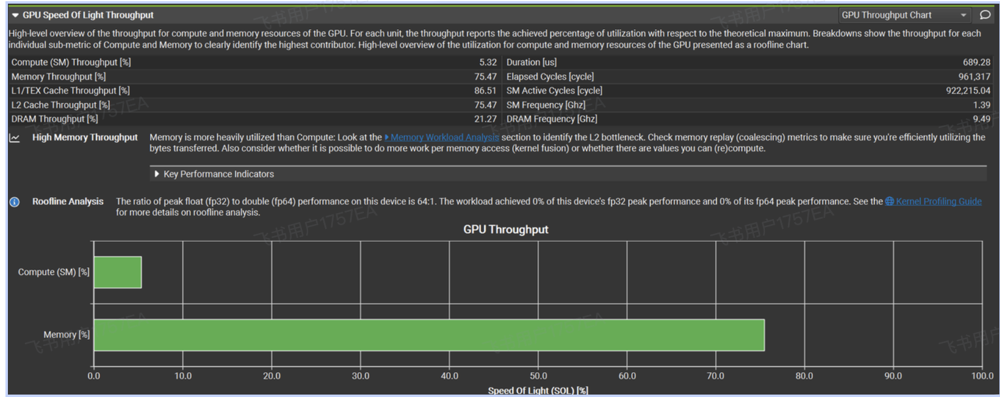
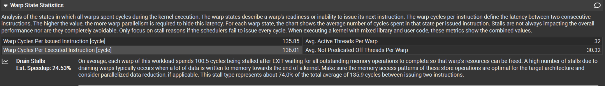
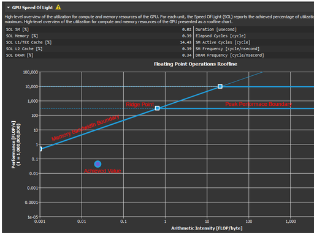
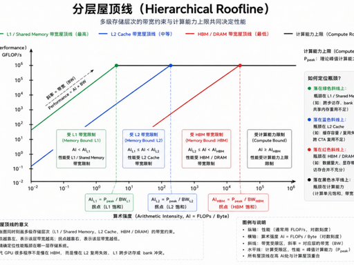

从Nsight-Compute中可以看出，这个kernel的计算效率非常低，只有10%不到，结合来看，它的性能瓶颈主要来源于kernel末尾对全局内存的大规模**非合并写入操作**。



从Nsight-Compute中，我们也可以看到warp未就绪的原因Drain Stalls，也就是说内核快结束的时候，所有线程集中进行全局内存写入，另外这些写入操作是非合并的，GPU 调度器允许 warp **逻辑上退出**，但物理上必须等待这些 store 提交到 L2 或 DRAM。



屋顶线roofline





### 1. 坐标轴（**双对数 log-log 刻度**，所有 Nsight 屋顶线都是对数轴）

- **横轴 X：Arithmetic Intensity 算术强度 AI，单位 FLOPs/Byte**

  含义：每读写 1 字节数据，能做多少次浮点运算

  AI 越小：读写多、计算少（向量加法 AXPY）；AI 越大：数据复用高、计算密集（GEMM 矩阵乘）

- **纵轴 Y：Achieved Performance 实际性能，单位 GFLOP/s/ TFLOP/s**

  含义：Kernel 每秒完成浮点运算总量

  - **横轴**：**算术强度** (Arithmetic Intensity, AI)，单位是 FLOPs/Byte。它表示**每读取1字节数据，能进行多少次浮点运算**。值越大，说明计算越密集（数据复用好）。
  - **纵轴**：**实际性能** (Performance)，单位通常是 GFLOPS/s 或 TFLOPS/s。
  - **屋顶线**：由**一条斜线**和**一条水平线**组成。
    - **斜线（带宽坡）**：代表**内存带宽上限**。性能 = 峰值带宽 × 算术强度。在这条线上，性能受限于你能从显存中读数据的速度。
    - **水平线（计算坪）**：代表**GPU 的峰值计算性能**（单精度/双精度等）。在这条线上，性能受限于 GPU 核心的计算速度。
    - **拐点**：斜线与水平线的交点，即**平衡点**。对应的算术强度 = 峰值性能 ÷ 峰值带宽。

### 2. 两条 “屋顶” 约束线（图像名字来源）

1. **蓝色斜直线：Memory Bandwidth Roof 带宽屋顶**

   公式：

   ```
   性能 = 显存峰值带宽 × AI
   ```

   代表

   数据搬运上限

   ：数据读写速度跟不上计算，性能被带宽锁死。

2. **红色水平直线：Peak Compute Roof 算力屋顶**

   代表

   GPU SM 浮点算力上限

   ：算力单元已经跑满，再增加数据复用也无法提速。

3. **拐点 Ridge Point（斜线与横线交点）**

   拐点 AI = 峰值算力 / 峰值带宽

   - AI < 拐点：带宽是瓶颈区
   - AI > 拐点：算力是瓶颈区

4. **蓝色圆点：你的 Kernel 实际工作点**

   Nsight 会自动统计该 Kernel 总 FLOPs、总访存字节，算出 AI 与实际性能，绘成单点。

### 3. 分层屋顶（Hierarchical Roofline，进阶）

Nsight 还会画出**L2、L1 / 共享内存**多层斜线：

- 最陡斜线：寄存器 / Shared Memory（带宽极高）

- 中间斜线：L2 缓存

- 最平缓斜线：HBM / 全局显存（全局内存带宽最低，最容易成为瓶颈）

  可以直接看出 Kernel 被哪一层存储带宽限制。



- **情况 A：点落在屋顶线上（理想状态）**
  - **含义**：程序已将该 GPU 的某项能力“跑满”。要么用满了计算单元，要么用满了内存带宽。
  - **判断**：这是一个高度优化的程序，但还能更好吗？需要看它落在哪一段。
- **情况 B：点落在“带宽坡”附近（** **内存受限** **）**
  - **判断依据**：程序点的**算术强度小于拐点处的算术强度**，且点的纵坐标接近那条斜线。
  - **瓶颈**：**内存带宽**是瓶颈。GPU 的计算单元经常处于等待数据从显存传输过来的状态。
  - **优化方向**：减少数据搬运量（数据复用、使用共享内存/缓存）、提高数据局部性、使用更紧凑的数据格式。
- **情况 C：点落在“计算坪”附近（** **计算受限** **）**
  - **判断依据**：程序点的**算术强度大于拐点处的算术强度**，且点的纵坐标接近那条水平线。
  - **瓶颈**：**计算能力**是瓶颈。GPU 的计算单元一直很忙，显存带宽有富余。
  - **优化方向**：优化计算本身（使用更快的数学函数、降低精度、调整线程块大小以增加并行度）。
- **情况 D：点远低于屋顶线（严重欠优化）**
  - **判断依据**：点离**任意一条边界线**都有很大距离。
  - **瓶颈**：既非计算也非带宽的**“延迟”或“开销”瓶颈**。典型原因包括：
    - **核函数启动开销**（传输非常小的数据块）。
    - **线程束发散**（Warp Divergence）导致并行度下降。
    - **未合并的全局内存访问**（内存请求碎片化，实际有效带宽极低）。
    - **同步开销过大**。
  - **优化方向**：先用 Nsight Compute 等分析工具检查**访存合并**、**占用率**、**线程束发散**等基础问题，而不是先调算术强度。