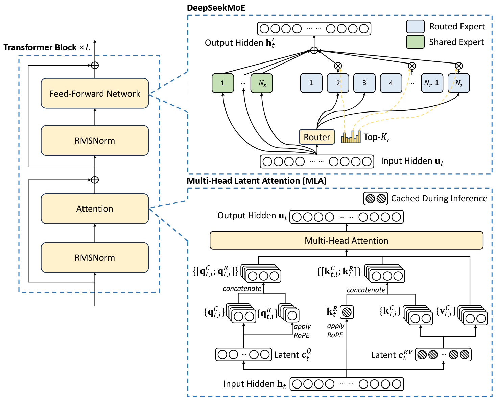
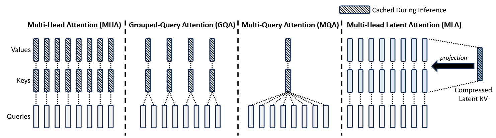
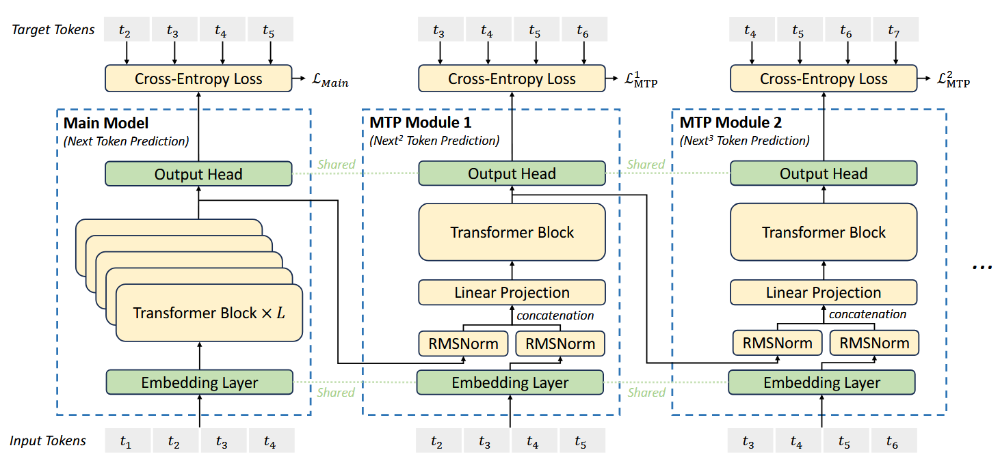

# Deepseekv3结构

模型总体结构如下：

各自注意力的区别：

## 1.MLA

## 2.MOE

## 3.MTP

​        MTP基于主模型（Main Model）和多个MTP模块（MTP Module）的组合，主模型负责基础的下一个token预测，而MTP模块则用于预测多个未来token。这样能够按顺序预测额外的token，并保留完整的因果链（causal chain）。

​       MTP模块在投机解码中扮演了**草稿模型**（Draft Model）的角色，用于快速生成多个候选token。**目标模型**（Target Model，也就是主模型）对这些候选token进行验证，通过的token被接受，未通过的token被修正。

[【手撕系列】手撕DeepSeek-V3 - WKQ](https://wkq9411.github.io/2026-01-01/Code-DeepSeek-V3.html)
