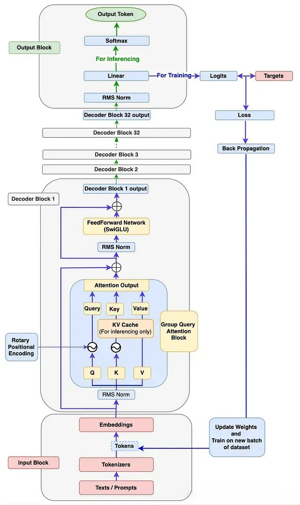
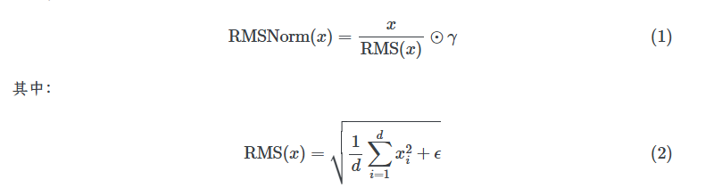
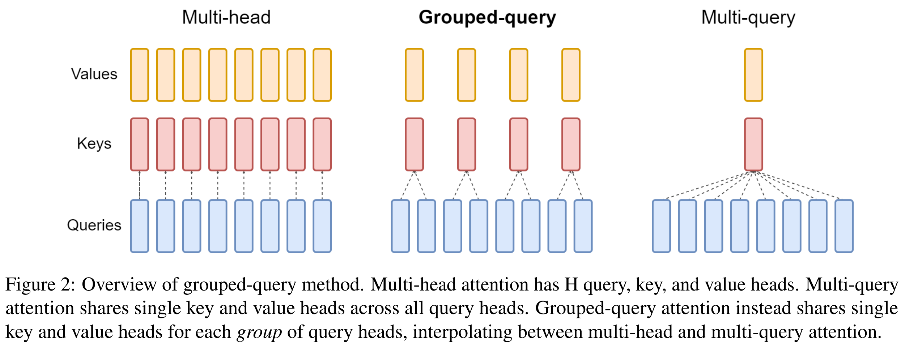
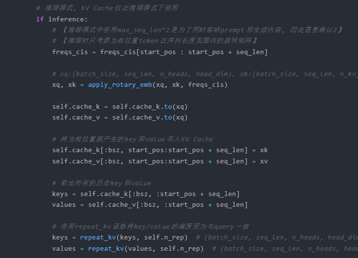
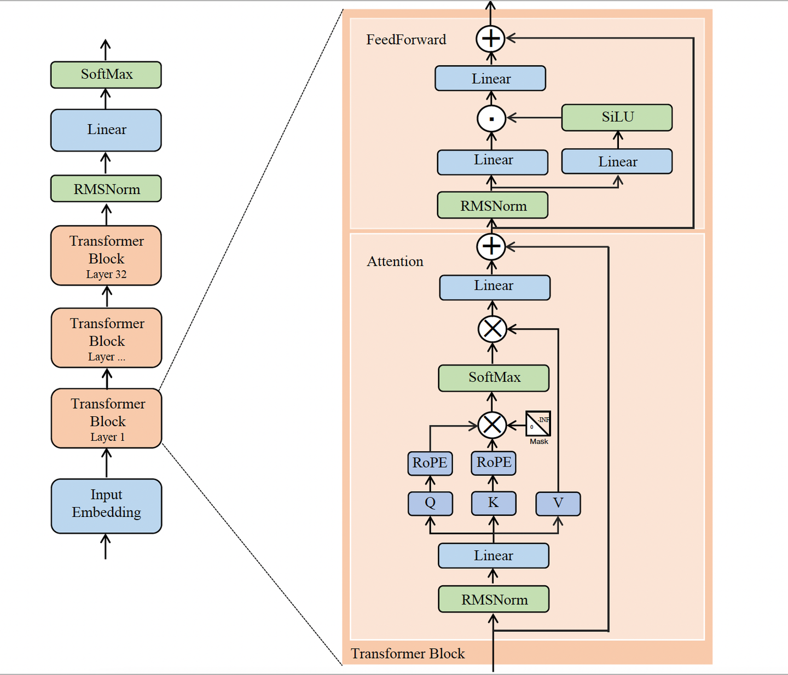

# Llama3结构



## 1.归一化


- BatchNorm是对整个 batch 样本内的每个特征做归一化，这消除了不同特征之间的大小关系，但是保留了不同样本间的大小关系。

- LayerNorm是对每个样本的所有特征做归一化，这消除了不同样本间的大小关系，但是保留了一个样本内不同特征之间的大小关系。在语言模型中，就是对一个token的所有维度做归一化。（在残差后进行norm梯度容易在深层消失，训练不稳定）

- 大语言模型采用LayerNorm而非BatchNorm，主要因为LayerNorm不依赖批次统计，能天然适应变长序列、自回归生成和小batch训练，避免了BatchNorm因padding和序列长度变化导致的统计偏差与训练推理不一致问题。

- RMSNorm不需要计算均值和方差，减少了计算量

  




```
class RMSNorm(nn.Module):

​    def __init__(self,d_model, eps=1e-8):
​       super().__init__()
​       self.weight = torch.ones(d_model)
​       self.weight = nn.Parameter(self.weight)#会被优化器更新训练
​       self.eps = eps
​    def norm(self, x):
​       return x * torch.rsqrt(x.pow(2).mean(-1, keepdim=True) + self.eps)
​    #x.pow(2)是对x的每个元素进行平方,这个操作会保持原来的形状。
​    #mean(-1,keepdim=True)是对最后一个维度每个元素进行均值计算，这个操作会保持原来的形状，没有keepdim（2，3，1）会变成（2，3）。
​    def forward(self,x):
​       return self.weight * self.norm(x)
```

## 2.位置编码

位置编码主要有两种类型：**绝对位置编码** 和 **相对位置编码**。

- 学习型绝对位置编码（Learnable Absolute Positional Encoding）通过参数化直接学习每个位置的嵌入向量。只能处理训练时见过的序列长度，无法外推到未见位置，因为超出范围的位置没有定义的编码。

- 正弦-余弦位置编码（Sinusoidal Positional Encoding） 是绝对位置编码，理论上也具有一定的外推能力，但 **对过长序列的效果有限**。

- 相对位置编码（Relative Positional Encoding）相对位置编码基于位置差值来表示位置关系，而不是绝对位置。天然具有外推能力，因为相对差值的计算方式不会依赖具体的序列长度。

- 混合型位置编码（例如 Rotary Position Embedding, RoPE）RoPE位置编码通过将一个向量旋转某个角度，为其赋予位置信息。**通过绝对位置编码的方式实现相对位置编码**。

  **为什么只对Q和K进行位置编码？**

- **Q和K**：决定"关注哪里"。它们的点积计算相似度得分，位置信息直接影响"哪个位置关注哪个位置"。

- **V**：代表"内容是什么"。它只是被聚合的值，本身不需要位置信息。

```
# 预先计算旋转矩阵的各个角度

def precompute_freqs_cis(dim: int, end: int, theta: float = 10000.0):
    """计算频率矩阵, 并将其表示为复数的极坐标表示, 函数名中的cis指cos(θ)+i·sin(θ), 表示一个复数位于单位圆上的位置
​    Args:
​        dim (int): Embedding的维度
​        end (int): 序列长度
​        theta (float, optional): 计算θ的底数值【θ=10000^(-2i/d)】. Defaults to 10000.0.

​    Returns:
​        代表各个位置m旋转角度的复数矩阵, 形状为(end, dim//2), 每两个维度对应一个旋转角度
​    """

    # 计算旋转矩阵中的θ值, 原文中θ=10000^(-2i/d)

​    freqs = 1.0 / (theta ** (torch.arange(0, dim, 2).float() / dim))

    # 计算位置信息m的序列

​    t = torch.arange(0, end,1)

    # torch.outer用于计算外积, 就得到不同位置m和不同θ值的所有组合m*θ

    # 得到的freqs矩阵形状为(end, dim//2), 索引含义为freqs[mi][θi]=mi*θi

​    freqs = torch.outer(t, freqs)

    # 生成一个模长为1, 幅角为freqs的复数矩阵

​    freqs_cis = torch.polar(torch.ones_like(freqs), freqs)  # complex64
​    return freqs_cis
   #torch.polar(1.0, θ) = cos(θ) + i·sin(θ) = e^(iθ)

# 调整freqs_cis以方便其与x进行广播计算

def reshape_for_broadcast(freqs_cis: torch.Tensor, x: torch.Tensor):
    """调整freqs_cis以方便其与x进行广播计算

​    Args:
​        freqs_cis (torch.Tensor): 旋转矩阵, 初始形状为(end, head_dim//2)
​        x (torch.Tensor): query, 初始形状为(batch_size, seq_len, n_heads, head_dim//2)

​    Returns:
​        调整形状后的旋转矩阵, 形状为(1, seq_len, 1, head_dim//2)
​    """
​    ndim = x.ndim  # 获取x的维度数
​    assert 0 <= 1 < ndim  # 确保x至少为2维【这里0<=1似乎也是冗余】

    # x形状一般为(batch_size, seq_len, n_heads, head_dim//2)

    # 这里确保freqs_cis与x的seq_len, head_dim//2维度一致, RoPE是对每个头分别进行的

​    assert freqs_cis.shape == (x.shape[1], x.shape[-1])

    # 将第二维度和最后一维度分别变为seq_len和head_dim//2, 其余维度均为1，即(1, seq_len, 1, head_dim//2)


​    return freqs_cis.reshape(1,x.shape[1],1,x.shape[-1])


# 应用RoPE

def apply_rotary_emb(xq, xk, freqs_cis):
    """应用RoPE, llama3是通过转换成复数形式来旋转角度的

​    Args:
​        xq (torch.Tensor): query
​        xk (torch.Tensor): key
​        freqs_cis (torch.Tensor): 旋转矩阵

​    Returns:
​        Tuple[torch.Tensor, torch.Tensor]: query和key的旋转结果
​    """

    # 将xq和xk由(batch_size, seq_len, n_(kv)_heads, head_dim)转换为(batch_size, seq_len, n_(kv)_heads, head_dim//2, 2)

    # 即每个头的维度两两一组, 以此作为复数的实部和虚部, 转换为复数

    # xq_和xk_的形状为(batch_size, seq_len, n_(kv)_heads, head_dim//2), 里面保存的是复数, 这样转换后最后一维就与freqs_cis的最后一维一致了

​    xq_ = torch.view_as_complex(xq.float().reshape(*xq.shape[:-1], -1, 2))  # (batch_size, seq_len, n_heads, head_dim//2,2)相邻配对
​    xk_ = torch.view_as_complex(xk.float().reshape(*xk.shape[:-1], -1, 2))  # (batch_size, seq_len, n_kv_heads, head_dim//2,2)

    # 按照xq_将freqs_cis的维度变为(1, seq_len, 1, head_dim//2)

​    freqs_cis = reshape_for_broadcast(freqs_cis, xq_)

    # 通过复数乘法实现角度旋转

    # 复数张量转换为实数张量后, 通常为(..., 2)的形状, 即最后一维代表实部与虚部

    # 因此使用flatten将索引为3的维度展平, 形状由(batch_size, seq_len, n_(kv)_heads, head_dim//2, 2)变为(batch_size, seq_len, n_(kv)_heads, head_dim)

​    xq_out = torch.view_as_real(xq_ * freqs_cis).flatten(3)  # (batch_size, seq_len, n_heads, head_dim)
​    xk_out = torch.view_as_real(xk_ * freqs_cis).flatten(3)  # (batch_size, seq_len, n_kv_heads, head_dim)
​    return xq_out, xk_out
```

Rope的分组方式（一个token的多各维度作为实和虚部）主要有两种：

1. **相邻分组（Adjacent Pairing / Interleaved Grouping）****GPT-J 风格**
   对应“奇偶索引配对”：将相邻的两个维度（如 `(0,1)`, `(2,3)` …）视为一个复数，偶数维为实部、奇数维为虚部。这是原始论文中理论推导使用的形式。
2. **半区分组（Half‑Half Pairing / Split Grouping / Blockwise Grouping）**NeoX 风格（主流）
   对应“前一半维度为实部、后一半维度为虚部”：将特征向量平分为前后两半，分别视为实部和虚部。这种实现常见于 LLaMA、GPT‑NeoX 等高效推理代码中，便于向量化运算。
3. rope_interleave表示的是THW的排布方式，多模态中的维度（时间，高度，长度）是否交错排布


## 3.GQA和KV Cache

Transformer中的 **多头注意力（MHA）** 在解码阶段来说是一个性能瓶颈。**多查询注意力（MQA）** 通过共享单个key和value头，同时不减少query头来提升性能，多查询注意力可能导致质量下降和训练不稳定。因此常用的是 **分组查询注意力（GQA）**，它介于MHA和MQA之间，获得了与MHA相近的性能和与MQA相近的速度。




```

\# 定义配置
cfg = cfg()
cfg.MODEL = cfg()
cfg.MODEL.D_MODEL = 512
cfg.MODEL.N_HEADS = 8
cfg.MODEL.D_FF = 2048
cfg.TRAIN.LR = 0.0001
cfg.TRAIN.EPOCHS = 100
class GQAttention(nn.Module):
​    def __init__(self,args:cfg):
​       super().__init__()
​       self.args = args
​       self.d_model = args.MODEL.D_MODEL
​       self.n_heads = args.MODEL.N_HEADS
​       self.kv_heads = args.MODEL.KV_HEADS
​       self.head_dim = self.d_model // self.n_heads
​       self.n_rep = self.n_heads // self.kv_heads     
​       self.wq = nn.Linear(self.d_model, self.n_heads * self.head_dim,bias=False)
​       self.wk = nn.Linear(self.d_model, self.head_dim * self.kv_heads,bias=False)
​       self.wv = nn.Linear(self.d_model, self.head_dim * self.kv_heads,bias=False)
​       self.wo = nn.Linear(self.n_heads * self.head_dim, self.d_model,bias=False)
​       self.cache_k = None
​       self.cache_v = None
​    def forward(self, x, mask=None):
​       bsz, seq_len, _ = x.shape
​       xq = self.wq(x)
​       xk = self.wk(x)
​       xv = self.wv(x)
​       mask = torch.full((seq_len, seq_len), float('-inf'))
​       mask = torch.triu(mask,diagonal=1)#diagonal=1表示从主对角线开始向上偏移一行，生成一个上三角矩阵
​       xq = xq.view(bsz,seq_len,self.n_heads,self.head_dim).transpose(1,2)
​       xk = xk.view(bsz,seq_len,self.kv_heads,self.head_dim)
​       xk[:,:,:,None,:].expand(-1,-1,-1, self.n_rep, -1).reshape(bsz,seq_len,self.n_heads,self.head_dim)# 扩展到n_heads个头
​       xv = xv.view(bsz,seq_len,self.kv_heads,self.head_dim)
​       xv[:,:,:,None,:].expand(-1,-1,-1, self.n_rep, -1).reshape(bsz,seq_len,self.n_heads,self.head_dim)
​       xk = xk.transpose(1,2)
​       xv = xv.transpose(1,2)#batch,n_heads,seq_len,head_dim
​       scores = torch.matmul(xq,xk.transpose(-2,-1)) / math.sqrt(self.head_dim)
​       if mask is not None:
​         scores = scores + mask
​       scores = F.softmax(scores,dim=-1)
​       out = torch.matmul(scores,xv) #batch,n_heads,seq_len,head_dim
​       out = out.transpose(1,2).reshape(bsz,seq_len,self.n_heads*self.head_dim)
​       return self.wo(out)
```

​       kvche的本质是以空间换时间，它 **将历史输入token的KV缓存下来**，避免每步生成都重新计算历史的KV值。一个典型的带有 KV cache 优化的生成大模型的推理过程包含了两个阶段：

1. **预填充阶段**：输入一个prompt序列，为每个transformer层生成 key cache 和 value cache（KV cache），此步骤为并行同时计算序列的KV值

2. **解码阶段**：使用之前的KV cache并计算当前的KV值，并将当前的KV值保存到cache中，然后生成token，**仅需使用当前最后一个Q来计算，而无需将前面所有的Q拼接起来再计算**。

   

   

3. ```
   # 实现KV Cache, 用于存储KV矩阵, 包括prompt部分和生成部分的KV, 因此形状为(max_batch_size, max_seq_len*2, n_kv_heads, head_dim)
           self.cache_k = torch.zeros(args.TRAIN.BATCH_SIZE, args.MODEL.MAX_SEQ_LEN*2, self.n_kv_heads, self.head_dim)
           self.cache_v = torch.zeros(args.TRAIN.BATCH_SIZE, args.MODEL.MAX_SEQ_LEN*2, self.n_kv_heads, self.head_dim)
   ```

## 4.FFN与激活函数



大模型参数量巨大，梯度流动至关重要。GELU/SiLU的平滑性减少了梯度突变，避免训练震荡。

- **Swish**：由Google于2017年提出，公式为 Swish(x)=x⋅σ(βx)，其中 σ* 是sigmoid函数，β* 是一个可学习参数（通常初始化为1）。
- **SiLU（Sigmoid Linear Unit）**：通常指 β=1 时的Swish，即 SiLU(x)=x⋅σ(x)SiLU(*x*)=*x*⋅*σ*(*x*)。在许多文献和框架（如Hugging Face Transformers）中，SiLU被用作Swish的特例或同义词。
- **ReLU（修正线性单元）**
  - 特点：简单高效，但存在“死亡神经元”问题（当某个神经元的权重更新后，其输入始终为负数，导致ReLU的输出恒为0。此后，该神经元在后续训练中无法再被激活（输出永远为0），梯度也始终为0，从而“死亡”。），在早期模型中广泛使用，现在更多被GELU等替代。
- **GELU（高斯误差线性单元）**
  - 特点：平滑近似ReLU，结合了随机正态分布的特性，常用于BERT、GPT等模型。
  - 公式：GELU(x)=x⋅Φ(x)，其中 Φ(*x*) 是标准正态分布的累积分布函数。

```
class FeedForward(nn.Module):

​    def __init__(self,d_model,hidden_model,dropout=0.1):
​      super().__init__()
​      self.d_model = d_model
​      self.hidden_model = hidden_model
​      self.w1 = nn.Linear(d_model,hidden_model,bias=False)
​      self.w2 = nn.Linear(hidden_model,d_model,bias=False)
​      self.w3 = nn.Linear(d_model,hidden_model,bias=False)
​    def forward(self,x):
​      x = self.w2(F.relu(self.w1(x))*self.w3(x))#*是点乘，逐元素相乘，F.relu是激活函数，增加非线性
​      return x
```


参考：

[【手撕系列】手撕Llama3 - WKQ](https://wkq9411.github.io/2026-01-01/Code-Llama3.html#一rmsnorm归一化)

