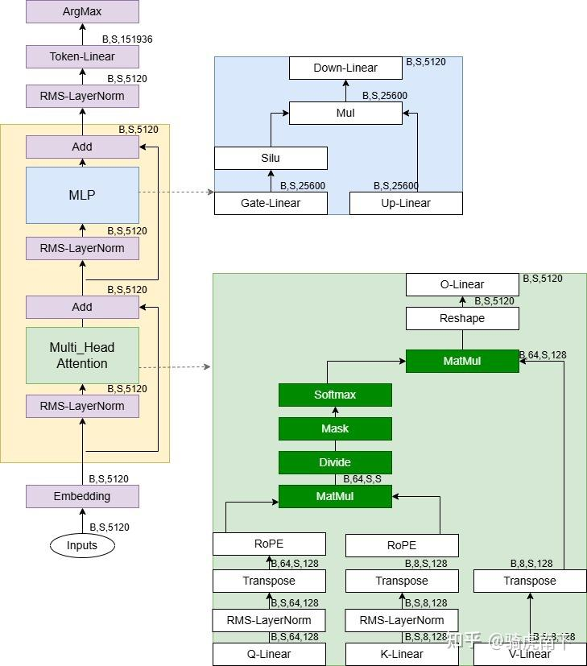

# qwen系列模型

1.qwen3（GQA），与qwen2.5不同，qlinear后加入layernorm



2.qwen3-next


```
混合架构：Gated DeltaNet + Gated Attention
线性注意力打破了标准注意力的二次复杂度，在处理长上下文时有着更高的效率。我们发现，单纯使用线性注意力或标准注意力均存在局限：前者在长序列建模上效率高但召回能力弱，后者计算开销大、推理不友好。通过系统实验，我们发现 Gated DeltaNet [1] 相比常用的滑动窗口注意力（Sliding Window Attention）和 Mamba2 有更强的上下文学习（in-context learning）能力，并在 3:1 的混合比例（即 75% 层使用 Gated DeltaNet，25% 层保留标准注意力）下能一致超过超越单一架构，实现性能与效率的双重优化。
在保留的标准注意力中，我们进一步引入多项增强设计：（1）沿用我们先前工作 [2] 中的输出门控机制，缓解注意力中的低秩问题。（2）将单个注意力头维度从 128 扩展至 256。（3）仅对注意力头前 25% 的位置维度添加旋转位置编码，提高长度外推效果。
```

