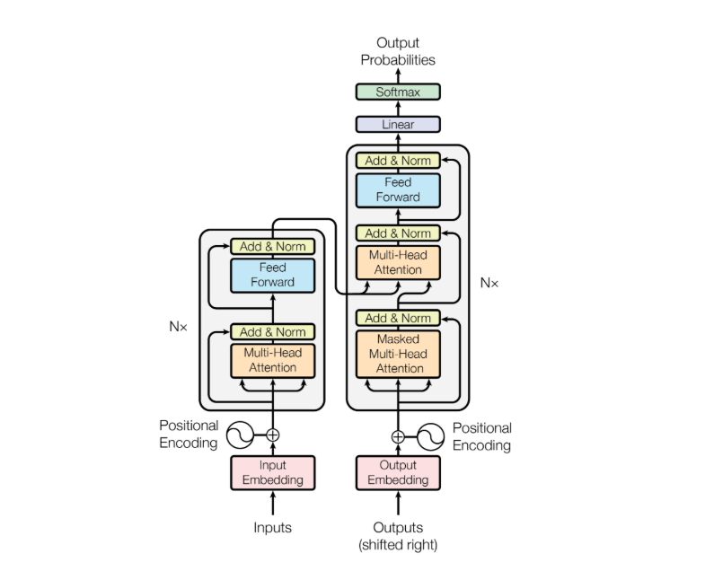
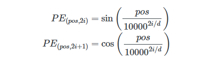
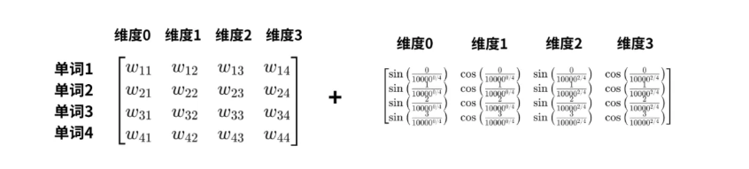
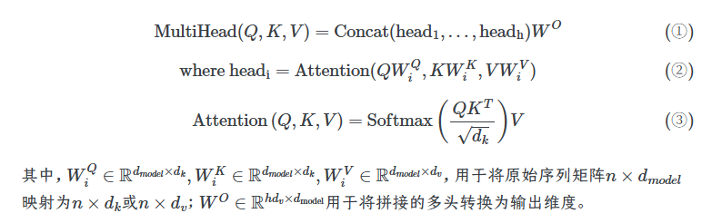
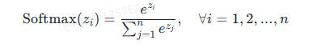
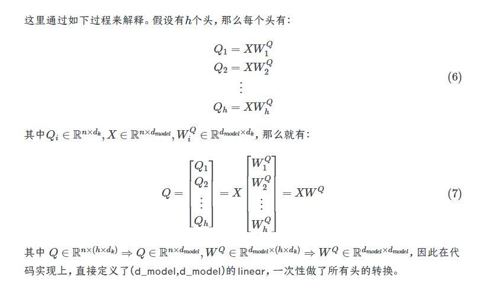

1.位置编码：





```
x = torch.randn(2, 3)  # shape: (2, 3)

x.unsqueeze(0)  # → (1, 2, 3)  在最前面加
x.unsqueeze(1)  # → (2, 1, 3)  在中间加
x.unsqueeze(2)  # → (2, 3, 1)  在最后面加

x = torch.randn(1, 2, 1, 3)
x.squeeze(0)  # → (2, 1, 3)   删掉第 0 维
x.squeeze(2)  # → (1, 2, 3)   删掉第 2 维
x.squeeze()   # → (2, 3)      删掉所有大小为 1 的维度
```

2.多头注意力







3.前馈网络与层归一化

4.mask

mask分为paddingmask与causalmask

分别对应填充seqlen和防止看到未来token

因果掩码是一个上三角矩阵

数学实现是创建一个矩阵，左下角为0，右上角为inf负无穷，与注意力得分相加，做softmax后，inf的位置概率为0

combined_mask = pad_mask & causal_mask

```
#padmask
mask = (seq == pad_id)  # (batch, seq_len), 在<PAD>的位置上生成True, 真实序列的位置为False
 mask = ~mask#1表示true，0表示false，需要反转，mask==0，的位置填充负无穷值
```

参考内容：

[【手撕系列】手撕Transformer - WKQ](https://wkq9411.github.io/2026-01-01/Code-Transformer.html#一模型的输入和输出)