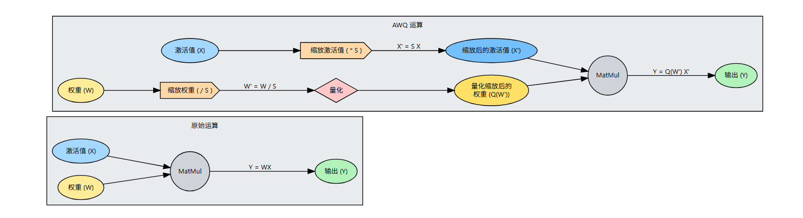

## 一.量化基础

| 格式              | 总位数 | 符号位     | 指数位 | 尾数位 | 指数偏移 | 表示范围（近似）                                             | 精度 / 最小步长                      | 典型用途与关键特点                                           |
| :---------------- | :----- | :--------- | :----- | :----- | :------- | :----------------------------------------------------------- | :----------------------------------- | :----------------------------------------------------------- |
| **INT4**          | 4      | 1 (有符号) | 0      | 0      | 无       | -8 ～ 7                                                      | 步长固定为 1，绝对精确整数           | **极限模型压缩**：权重存储极省，常结合非对称量化；推理时需反量化到浮点计算。硬件支持尚不普遍，通常用于离线压缩或特定 NPU。 |
| **INT8**          | 8      | 1 (有符号) | 0      | 0      | 无       | -128 ～ 127                                                  | 步长 1，精确整数                     | **标准整数量化**：推理加速的核心格式，几乎所有推理芯片（CPU、GPU、NPU）都有原生 INT8 计算单元。配合 scale/zero_point 实现低精度高速计算，精度损失可控。 |
| **FP8 (E4M3)**    | 8      | 1          | 4      | 3      | 7        | 最大正规数约 ±240，最小正规数约 ±0.0156                      | 约 2～3 位十进制有效数字             | **兼顾精度的 FP8 训练/推理**：指数位少，尾数精度相对高，适合前向传播的权重、激活量化。被 NVIDIA H100、Intel Gaudi 等支持，可混合精度训练。 |
| **FP8 (E5M2)**    | 8      | 1          | 5      | 2      | 15       | 最大约 ±57344，最小正规数约 ±6.1e-5                          | 约 1～2 位十进制有效数字             | **宽动态范围的 FP8**：指数位多，能表示更大/更小的值，不易溢出，适合梯度等数值范围大的张量。常与 E4M3 配对使用（E4M3 前向，E5M2 反向）。 |
| **FP16 (半精度)** | 16     | 1          | 5      | 10     | 15       | 最大 ±65504，最小正规数 ±6.10e-5                             | 约 3～4 位十进制有效数字             | **传统混合精度训练主力**：存储和计算开销为 FP32 的一半，很多 GPU 有 FP16 高吞吐单元。但动态范围有限，训练时易梯度下溢，需配合 loss scaling。 |
| **BF16 (脑浮点)** | 16     | 1          | 8      | 7      | 127      | **与 FP32 相同**：最大约 ±3.39×10³⁸，最小正规数约 ±1.18×10⁻³⁸ | 约 2～3 位十进制有效数字（尾数较少） | **训练稳定、无需 loss scaling**：指数位数与 FP32 一样，动态范围极宽；只需简单截断 FP32 尾数即可得到 BF16，格式转换极快。广泛用于 Google TPU、Intel AMX、NVIDIA A100 等。 |
| **FP32 (单精度)** | 32     | 1          | 8      | 23     | 127      | 最大约 ±3.39×10³⁸，最小正规数约 ±1.18×10⁻³⁸                  | 约 7 位十进制有效数字                | **通用浮点标准**：高精度训练、推理的基准。几乎所有浮点运算的默认格式，用作量化 scale 等参数的存储与计算精度。 |

- **整数格式 (INT4/8)**：本身无小数，必须配合外部 scale（浮点缩放因子）才能表示浮点值范围。量化计算时，scale 常用 FP32。
- **FP8 变体**：目前由 *OCP Microscaling Formats (MX)* 联盟与行业标准推动，E4M3 和 E5M2 是最常见的两种，不同硬件可能支持子集。
- **精度的直观感受**：尾数位数越多，能表示的相邻值越密，精度越高；指数位数越多，动态范围越大，越不容易溢出。
- **BF16 vs FP16**：BF16 保范围、牺牲小数精度；FP16 保一定精度、牺牲范围。训练大模型时 BF16 更受欢迎，因为其动态范围与 FP32 一致，梯度不会轻易下溢。
  - INT8是1Byte（B）（8bit）,FP16是2B
  - 1 KB = \(2^{10}\) = 1024 B
  - 1 MB = \(2^{20}\) = 1024 KB
  - 1 GB = \(2^{30}\) = 1024 MB

## 二.量化技术

### 1.量化类型

- 对称量化：量化后分布关于0对称，主要针对权重
- 非对称量化：引入偏移量，根据实际数据的分布确定最小与最大值，不关于0点对称，主要针对激活函数

### 2.量化粒度

- Per-tensor:整个张量共享一个缩放因子
- Per-channel:每个通道独立一个缩放因子(对于大模型来说，就说权重的每一列，对于卷积就是每个输出通道（输入通道是RGB，不可以混为一谈,输出通道等于卷积核数量)
- Per-token:每个token独立一个缩放因子（主要是对于激活）
- 分组量化：几组数据（一个张量内部）共享一个缩放因子

### 3.量化技术

- 训练后量化PTQ：训练完成后对权重或激活值进行量化
- 量化感知训练QAT：在模型训练时进行模拟的量化过程，比如加入模拟量化误差的数据，让模型适应量化带来的精度损失

### 4.量化对象

- 权重
- 激活
- KV cache

### 5.量化算法

- AWQ:属于PTQ。仅仅选择0.1-1%的重要权重保持FP16格式，对于其他的权重进行量化。主要两种方法：一种是根据权重分布，选择绝对值最大的一部分权重保持FP16；另一种是使用Y=AW的A，也就是输入值。选择激活值绝对值最大的一部分权重。对输入的列做平均值，选择平均值最大的一列对应的权重矩阵的行进行保留FP16。对显著权重进行放大可以降低量化误差，引入一个s>1,减小了误差。最终，还是对所有权重进行量化，但是，对于显著权重乘较大的s，降低其误差。那么如何确定完整的缩放因子,注意这个缩放因子不是量化缩放因子，是对整体权重和激活的一个缩放（1.使用校准数据采集激活数据，计算基础缩放因子，及每个激活列的数据绝对值的平均值；引入一个可调节的超参数，Sj = 1 + α × (Sx[j] / max(Sx))，确保sj大于1，对sj进行归一化处理）一旦确定了S值，就执行等效变换：对显著通道的权重乘以Sj，对相应的输入激活除以Sj。对于显著通道，S > 1的特殊缩放 + per-channel量化；非显著通道，S = 1 + per-channel量化。通过top-k确定显著与非显著通道

  

- SmoothQuant:

## 引用文章来源

1.2w字解析量化技术，全网最全的大模型量化技术解析（[(8 封私信 / 64 条消息) 2w字解析量化技术，全网最全的大模型量化技术解析 - 知乎](https://zhuanlan.zhihu.com/p/20869179493)）

2.大模型量化技术：主流方法解析与代码实践（[(8 封私信 / 64 条消息) 大模型量化技术：主流方法解析与代码实践 - 知乎](https://zhuanlan.zhihu.com/p/30624587312)）

3.大模型量化概述([(9 封私信 / 64 条消息) 大模型量化概述 - 知乎](https://zhuanlan.zhihu.com/p/662881352))
