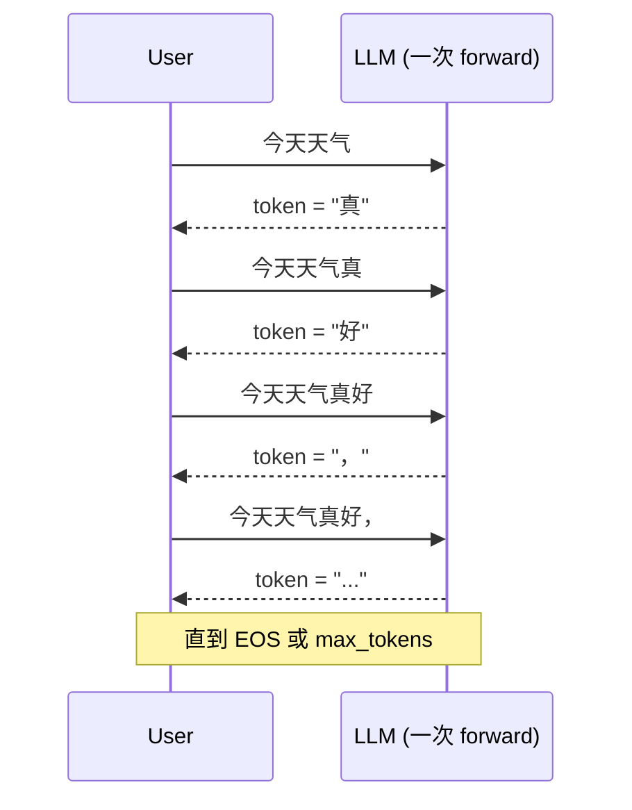
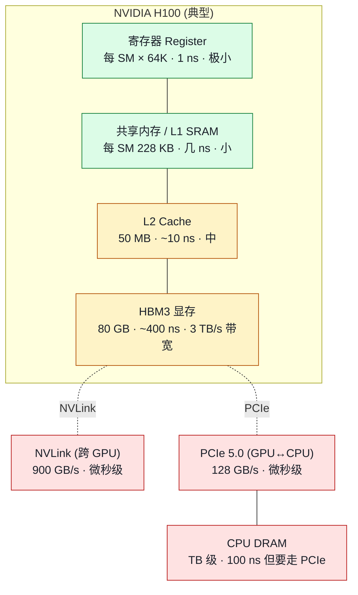
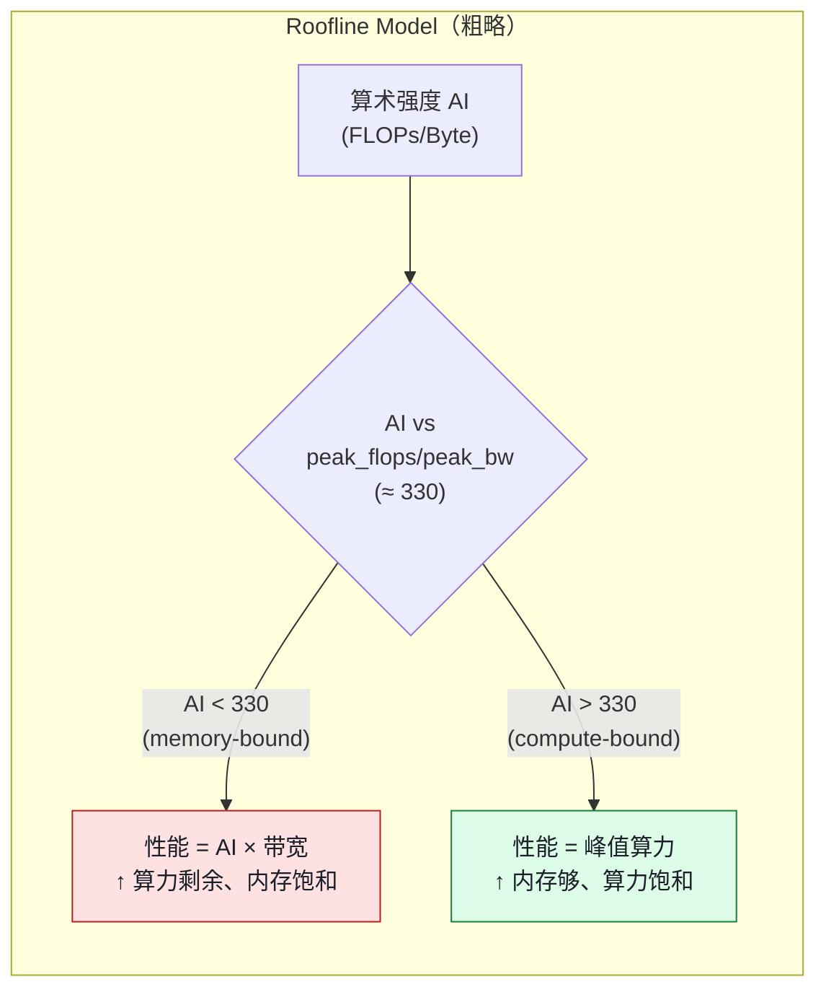
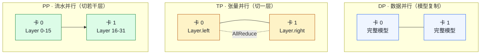

# 00. 前置知识：进入 vLLM 之前要懂的概念

> **谁该读这一篇？** 第一次接触 LLM 推理工程的同学（比如刚学完 Transformer 论文的本科生）；或对 KV cache / batching / TP 等概念心里没底的工程师。后面 40 多章默认这里每个术语你都熟。
>
> **前置阅读：** 无（起点章节）。
>
> **耗时：** 约 30 分钟。每节末尾的"在 vLLM 里"指出该概念后续章节会怎么用到。
>
> **学完能：**
> 1. 解释 LLM 自回归生成、KV cache 必要性、prefill vs decode 的根本差异。
> 2. 用 roofline 模型说清 decode 阶段为什么是 memory-bound、batching 为什么能拉吞吐。
> 3. 区分 DP / TP / PP，并指出哪种通信强依赖 NVLink。
> 4. 用 TTFT / TPOT / 吞吐三个指标解释推理服务"卡不卡"和"赚不赚"。

---

## 0. 给读者的心智地图

vLLM 解决的是这样一类问题：

> **一个训练好的大语言模型（如 Llama-3-70B），怎么在一台 / 一组 GPU 上同时服务尽可能多的用户、把每个用户的等待时间压到最低？**

要看懂 vLLM 在做什么，先要把"训练好的模型如何生成下一个 token"这条链路里每一步的瓶颈都摸清楚。本章从 token 开始，一路推到为什么需要 PagedAttention。

学习路径图：

```mermaid
flowchart LR
    A["1. Token<br/>& Tokenizer"] --> B["2. Transformer<br/>Attention 回顾"]
    B --> C["3. 自回归生成"]
    C --> D["4. KV Cache<br/>必须存在的原因"]
    D --> E["5. Prefill vs Decode"]
    E --> F["6. GPU 内存层级<br/>HBM / SRAM"]
    F --> G["7. Memory-bound<br/>vs Compute-bound"]
    G --> H["8. Batching"]
    H --> I["9. 分布式并行<br/>TP / PP / DP"]
    I --> J["10. 推理服务指标<br/>TTFT / TPOT / 吞吐"]
    J --> K["11. vLLM<br/>登场"]

    classDef base fill:#eff5ff,stroke:#2563eb,color:#1a1f29;
    classDef perf fill:#fef3c7,stroke:#b45309,color:#1a1f29;
    classDef sys  fill:#dcfce7,stroke:#15803d,color:#1a1f29;
    class A,B,C,D,E base;
    class F,G,H perf;
    class I,J,K sys;
```



---

## 1. Token 与 Tokenizer

**什么是 token？** LLM 不直接处理字符串。它把文本切成离散的"小块"——*token*。一个 token 可能是：

- 一个常见单词："the"、"machine"
- 一个子词："learn" + "ing"、"un" + "happy"
- 一个 Unicode 字符（中文 / emoji 常见）

切分由 **tokenizer** 完成，背后通常是 BPE（Byte Pair Encoding）或 SentencePiece 算法。把文本拍成 token 序列后，每个 token 对应一个**整数 id**：

```
"Hello, world"
  ↓ tokenizer (Llama-3)
[15043, 11, 1917]     # 3 个 token id
```

**词表大小（vocab size）** 是 tokenizer 认识的全部 token 数。常见值：

| 模型 | vocab size |
| --- | --- |
| GPT-2 | 50,257 |
| Llama-3 | 128,256 |
| Qwen3 | 151,936 |
| DeepSeek-V3 | 129,280 |

一句话长度从字符数变成 token 数——这是 LLM 推理里所有"长度"指标的实际单位。**1 个英文单词 ≈ 1.3 token，1 个汉字 ≈ 2 token**（粗略经验值）。

**在 vLLM 里**：

- API 请求里的 prompt 会在进入引擎前被 tokenize 成 `prompt_token_ids: list[int]`
- 后续所有 batch 处理都在 token id 层面进行
- 用户的 `max_tokens` 参数限制生成的 token 数

---

## 2. Transformer 与 Attention 回顾

LLM 99% 是 **decoder-only Transformer**（GPT 家族）。一层 Transformer 干两件事：

1. **Self-Attention**：让当前 token 看到序列里的其他 token，决定"应该参考谁"
2. **MLP（前馈网络）**：对每个 token 单独做非线性变换

### 2.1 Attention 公式（背下来）

$$\text{Attention}(Q, K, V) = \text{softmax}\!\left(\frac{Q K^{\top}}{\sqrt{d_k}}\right) V$$

直观理解：

- **Q（Query）**：当前 token "我想找谁"
- **K（Key）**：每个 token "我能被找到的特征"
- **V（Value）**：每个 token "我的具体内容"
- $Q K^{\top}$ → 每个 token 与所有 token 的相似度矩阵
- softmax 把相似度变成概率（注意力权重）
- 权重乘 $V$ → 加权求和的结果

每个 token 算自己的 Q、K、V：

$$Q_i = x_i W_Q, \quad K_i = x_i W_K, \quad V_i = x_i W_V$$

其中 $x_i$ 是第 $i$ 个 token 的输入向量。$W_Q, W_K, W_V$ 是模型权重，**对所有 token 共享**。

### 2.2 多头注意力

把 Q、K、V 在维度上切成 `n_heads` 份并行算（每份称为一个 head），结果拼回去。每个 head 关注不同的"语义子空间"。

```
hidden_size = 4096
n_heads     = 32
head_size   = 4096 / 32 = 128
```

### 2.3 因果 mask

LLM 是 **自回归** 模型——第 i 个 token 只能看到 0..i 这些 token，不能"看到未来"。实现上就是在 `Q·K^T` 后加一个上三角负无穷 mask：

```
mask[i, j] = 0       if j ≤ i  (允许)
             -inf    if j > i  (屏蔽)
```

softmax 后未来位置权重为 0。

**在 vLLM 里**：

- 每层 Attention 走 PagedAttention（详见 `02-core-concepts/01-paged-attention.md`）
- 因果 mask 是 attention backend 的默认行为，不用每次手动构造

---

## 3. 自回归生成：从输入到输出

LLM 生成是**逐 token** 的串行过程：

```
输入 prompt: "今天天气"
   ↓ tokenize → [今天, 天气]
模型 forward → 预测下一个 token 的概率分布
   ↓ 采样（greedy / top-k / top-p）
得到 token: "真"
   ↓ 把 "真" 拼到输入末尾
新输入: "今天天气真"
   ↓ 再 forward
预测下一个 token: "好"
   ↓ ...

直到生成 <EOS>（结束符）或达到 max_tokens
```

这里有个核心观察：**每生成 1 个新 token，整个模型要 forward 一次**。如果生成 100 个 token，模型要跑 100 次。



**在 vLLM 里**：

- 这条循环在 `EngineCore.run_busy_loop()` 里
- 每生成 1 个 token = 1 个 **step**（也叫 1 个 iteration）

---

## 4. KV Cache：必须存在的原因

朴素实现的灾难：每生成一个新 token，前面所有 token 的 K、V 都要**重新计算一遍**。

```
生成第 5 个 token：
  输入 = [tok_0, tok_1, tok_2, tok_3, tok_4]
  对每个位置算 Q_i, K_i, V_i  ← 重新算了 5 遍
  attention(Q_4, K_0..4, V_0..4)
  采样 → tok_5

生成第 6 个 token：
  输入 = [tok_0, tok_1, tok_2, tok_3, tok_4, tok_5]
  对每个位置算 Q_i, K_i, V_i  ← 又重新算了 6 遍！前 5 个之前已算过
  attention(Q_5, K_0..5, V_0..5)
```

**关键观察**：K_i、V_i 只依赖 token i 的输入，**算一次就固定了**。所以——把它们**缓存起来**，下次直接读。这就是 **KV cache**（Key-Value cache）。

```mermaid
flowchart LR
    subgraph Step5["生成第 5 个 token"]
        T5["tokens 0..4"] --> KV5["算 K_0..4, V_0..4<br/>(全新)"]
        KV5 --> Cache5[("KV Cache")]
        KV5 --> A5["Attention"]
    end
    subgraph Step6["生成第 6 个 token"]
        T6["tokens 0..5"]
        T6 --> K6["只算 K_5, V_5<br/>(新增 1 个)"]
        Cache5 -.读取 K_0..4, V_0..4.-> A6["Attention"]
        K6 --> Cache6[("KV Cache (扩 1 行)")]
        K6 --> A6
    end
    classDef step fill:#eff5ff,stroke:#2563eb,color:#1a1f29;
    classDef cache fill:#fef3c7,stroke:#b45309,color:#1a1f29;
    class T5,T6,KV5,K6,A5,A6 step;
    class Cache5,Cache6 cache;
```

### 4.1 KV cache 多大？

一个 token 在一个 attention 层占的 KV 大小（每 token 都要存 K 和 V 两份）：

$$\text{per\_token\_layer\_bytes} = 2 \times \text{hidden\_size} \times \text{dtype\_bytes}$$

整个模型 $N$ 层累加：

$$\text{per\_token\_total} = N \times 2 \times \text{hidden\_size} \times \text{dtype\_bytes}$$

Llama-3-70B 实例：$N = 80$、hidden = 8192、BF16（2 字节）：

$$\text{per\_token} = 80 \times 2 \times 8192 \times 2 = 2{,}621{,}440 \text{ 字节} \approx 2.5 \text{ MB}$$

一个 4K token 的请求 → 10 GB KV！一张 80GB H100 也装不下几个并发请求。

**这就是 vLLM 要解决的核心矛盾**：KV cache 太大、太碎，怎么用得起来。

**在 vLLM 里**：

- KV cache 由 `BlockPool`（`vllm/v1/core/block_pool.py`）管
- 每个请求一张 `BlockTable` 把逻辑序列映射到物理 block
- 详见 `02-core-concepts/01-paged-attention.md`

> ⚠️ **GQA / MQA**：现代模型常做"分组查询注意力"——多个 query head 共享一组 KV head。Llama-3 8 KV head + 32 Q head，KV cache 占用 = 普通的 1/4。**MLA**（DeepSeek-V2/V3）更激进，把 KV 压到低秩 latent，占用 ≈ 1/10。

---

## 5. Prefill vs Decode：LLM 推理的两个阶段

一个请求的生命周期分两段，性能特性完全不同：

### Prefill（填充）
处理用户输入的 prompt：

```
prompt = [t_0, t_1, ..., t_{n-1}]      # n 个 token
            ↓ 一次性 forward
对 prompt 里每个 token 算 Q/K/V → 写 KV cache
对最后一个 token 采样 → 第一个生成 token
```

- **一次 forward 处理整个 prompt**（N 个 token 并行）
- 算力密集：Q、K、V 投影 + N×N attention + MLP，都是大矩阵乘
- **算术强度高** → compute-bound

### Decode（解码）
逐个生成新 token：

```
[t_0, ..., t_{n-1}, t_n_new]   每步只新增 1 个 token
                       ↓ forward
对新 token 算 Q/K/V
attention(Q_new, K_0..n, V_0..n)   ← 读全部 KV cache
采样 → 下一个 token
```

- **每步 forward 只处理 1 个 token**
- 但仍要把整个模型的权重读一遍
- **算术强度低** → memory-bound（详见第 7 节）

| 维度 | Prefill | Decode |
| --- | --- | --- |
| 一次输入 token 数 | N（prompt 长度） | 1 |
| FLOPs | 大（O(N) 或 O(N²) for attention） | 小（O(1) per token） |
| 内存读 | 模型权重 + 写 N 个 KV | 模型权重 + 读 N 个 KV |
| 主导瓶颈 | 算力（compute-bound） | 带宽（memory-bound） |
| 一个请求里有几次 | 1 次 | output_tokens 次 |

**在 vLLM 里**：

- V1 把这两个阶段**混在同一个 forward** 里跑（continuous batching + chunked prefill），详见 `02-core-concepts/02,05`
- 一个 step 内可能既有几个请求在 prefill、又有十几个请求在 decode

---

## 6. GPU 内存层级速览



关键数字（H100 量级）：

| 存储 | 容量 | 带宽 | 延迟 |
| --- | --- | --- | --- |
| 寄存器 | KB 量级 / SM | 极快 | ~1 ns |
| L1 SRAM | 228 KB / SM | ~30 TB/s | ~5 ns |
| L2 | 50 MB | ~5 TB/s | ~50 ns |
| **HBM 显存** | **80 GB** | **3 TB/s** | **~400 ns** |
| NVLink | — | 900 GB/s（卡间） | μs |
| PCIe | — | 128 GB/s（CPU↔GPU） | μs |
| CPU DRAM | TB 级 | 100 GB/s（CPU 内部） | 100 ns 但要绕 PCIe |

**两条规律**：

1. **越靠近计算单元（寄存器）越快但越小**——这是所有 GPU 优化的物理基础
2. **HBM 带宽是 LLM 推理 decode 阶段的核心瓶颈**——3 TB/s 看似很大，但读一遍 70B 权重（140 GB FP16）就要 47 ms。所以每生成 1 token 的硬件极限就是 ~47 ms

**在 vLLM 里**：

- `--gpu-memory-utilization 0.9` 指 HBM 用 90%
- KV cache 占的就是这 90% 里扣掉模型权重和 activation 的剩余空间
- `--kv-cache-dtype fp8` 让 KV 用一半 HBM，相当于翻倍并发量

---

## 7. Memory-bound vs Compute-bound（roofline 模型）

衡量一个计算的**算术强度（Arithmetic Intensity）**：

```
AI = FLOPs / Bytes
       ↑       ↑
   总浮点运算  从 HBM 读 / 写的字节数
```

GPU 有两条硬上限：

- **峰值算力**：H100 FP16 ~1000 TFLOPS
- **峰值带宽**：H100 HBM3 ~3 TB/s



应用到 LLM：

| 阶段 | 算术强度 | 主瓶颈 | 加速思路 |
| --- | --- | --- | --- |
| Prefill（N 个 token 并行） | 高（~N） | 算力 | 不容易再加速，已经接近 100% 算力 |
| Decode（1 个 token） | 低（~1） | HBM 带宽 | 减少要读的数据：**batching**（多个请求共享模型权重读取）、**量化**（FP8 / INT4）、**KV cache 压缩**（MLA） |

**为什么 batching 能让 decode 大幅提速？** 因为权重只读一次就服务整批请求。batch=1 vs batch=32 时，HBM 读权重的开销是同一份，但 GPU 算力被 32 倍利用。

**在 vLLM 里**：这是 continuous batching 之所以能把吞吐拉 24× 的物理基础。

---

## 8. Batching：把多个请求挤进一次 forward

**串行处理**：

```
请求 A: [forward][forward][forward]...     ← 单个请求每步只用 1/N 的 GPU
请求 B:                                ...
请求 C:                                ...
```

**批处理**：

```
一次 forward 同时处理多个请求的 1 个 token：
batched_input = [A_tok, B_tok, C_tok, D_tok, ...]   shape [batch, hidden]
```

**直觉**：每生成 1 个 token 都要把整个模型从 HBM 读一遍（~140 GB）。

- 串行 1 个请求：读 140 GB → 算 1 个 token
- batch=32：读 140 GB → 算 32 个 token

吞吐 32×，延迟几乎不变（因为是 memory-bound）。这是 LLM 推理服务能做的最重要的事。

但批处理有两个变种：

### 8.1 Static Batching（朴素）
一批请求**一起进、一起出**。最慢的决定整组——参考 `02-core-concepts/02-continuous-batching.md` 的 gantt 图。

### 8.2 Continuous Batching（vLLM 默认）
每生成 1 个 token 都重新组 batch：完成的请求立刻退出，新请求立刻进入。GPU 永远满载。

**关键词**：

- **Throughput（吞吐）**：单位时间服务的总 token 数（tokens/s）
- **Latency（延迟）**：单个用户感受到的等待时间

Batching 提高吞吐，**但单请求延迟可能略增**（要等 batch 凑够）。这是所有推理服务设计的核心 trade-off。

---

## 9. 分布式并行速览

一个模型一张 GPU 装不下，或者算太慢，怎么办？三种切法：

### 9.1 数据并行（Data Parallel, DP）
**复制模型到多卡**，每卡服务不同请求。简单粗暴。

- 训练里也叫 DP；推理里就是"多副本"。

### 9.2 张量并行（Tensor Parallel, TP）
**把一层的权重切到多卡**，每步合并：

- MLP 列切 → 行切，每层末尾一次 AllReduce
- Attention QKV 列切 → output 行切

特点：通信极频繁（每层 2 次），强依赖 NVLink。

### 9.3 流水并行（Pipeline Parallel, PP）
**不同层放不同卡**，前一段算完把 hidden 传给下一段。

- 适合跨机器（通信少，每段边界一次）
- 有 bubble（流水启动期的空闲）



**实际配置**：同机器 8 卡几乎都用 TP=8；跨机器再叠 PP。详见 `05-distributed/01-tp-pp-ep.md`。

---

## 10. 推理服务的核心指标

LLM 推理服务的"性能"不只是一个数字。至少 4 个：

### TTFT — Time To First Token
从请求发出到**第一个 token 返回**的时间。用户感受"卡不卡"主要看这个。

- 主要被 prefill 时长决定
- 服务于"我点了发送按钮，多久看到第一个字"

### TPOT — Time Per Output Token
首 token 出来后，**每个后续 token** 的平均间隔。决定"打字速度感"。

- 主要被 decode 时长决定
- 也叫 ITL（Inter-Token Latency）

### TTLT — Time To Last Token
总响应时间 ≈ TTFT + (output_tokens − 1) × TPOT。SLA 的总时长指标。

### Throughput — 吞吐
- **每秒生成 token 数**（tokens/s）
- **每秒处理请求数**（req/s）

```mermaid
gantt
    title 单请求时间线
    dateFormat X
    axisFormat %s ms
    section 请求
    TTFT (等首 token) :a, 0, 200
    第 1 token        :milestone, after a, 0
    TPOT × (N−1)      :b, after a, 1500
    最后 token        :milestone, after b, 0
```



**指标 vs 关注的人**：

| 指标 | 谁关心 |
| --- | --- |
| TTFT | 用户体验 / 产品 |
| TPOT | 用户体验 / 产品 |
| 吞吐（tokens/s） | 平台容量规划 |
| 并发数（in-flight 请求） | 平台容量 |
| GPU util | 工程师 / 老板（花的钱有没有用满） |

更详细：`08-production-deployment/05-slo-and-observability.md`。

---

## 11. vLLM 登场：把上面拼起来

到这里你应该看清楚问题的形状了：

- LLM 生成是**自回归**的（一次 forward = 1 token）
- 每次 forward 要读整个模型权重（**memory-bound**）
- 单请求 GPU 用不满 → 必须 **batching**
- 每请求要存 **KV cache** → 想 batching 必须把 KV 管好
- 朴素 KV cache 分配（每请求预留 max_len 连续显存）→ 浪费 60-80%
- 模型大了一张卡装不下 → **TP / PP**

vLLM 的回答：

| 问题 | vLLM 的解 |
| --- | --- |
| KV cache 浪费 | **PagedAttention** —— 像 OS 虚拟内存一样分页管理 |
| 静态 batching 让 GPU 空转 | **Continuous batching** —— iteration-level 调度 |
| 长 prefill 卡死短 decode | **Chunked prefill** —— 把长 prefill 切片、与 decode 混跑 |
| 相同前缀重复算 | **Prefix caching** —— 跨请求 / 跨 step 复用 KV block |
| 训练栈不够快 | 自己写 / 集成 **FlashAttention、CUDA Graph、torch.compile** |
| 单卡装不下 | 模型并行（**TP / PP / EP**），架构上把 Scheduler 与 Worker 解耦 |

后面的章节就是把这张表里的每个解法**展开到代码层面**。

---

## 12. 常见术语速查（A-Z）

读后面章节遇到不熟的词回这里查。

| 术语 | 含义 |
| --- | --- |
| **AllReduce** | 集合通信原语，把多卡的某张量求和后广播回所有卡。TP 每层用 1-2 次。 |
| **AllToAll** | 集合通信，每卡把不同片段发给不同卡。EP（专家并行）下 dispatch / combine 用。 |
| **Attention backend** | vLLM 中"具体怎么算注意力"的可插拔后端：FlashAttention / FlashInfer / Triton / MLA / ... |
| **BF16 / FP16 / FP8 / INT8 / INT4** | 浮点 / 整数精度。BF16 ≈ FP16 但动态范围更大；FP8 是 H100+ 的新格式，约一半显存与算力。 |
| **Block / KV block** | PagedAttention 把 KV cache 切成固定大小的小块。默认 16 token / block。 |
| **Block table** | 每个请求一张表，把"第几个 block"映射到"物理 block id"。类比 OS 页表。 |
| **Continuous batching** | iteration-level 动态批处理。每生成一个 token 就重新组 batch。 |
| **CUDA Graph** | 把一系列 CUDA kernel 调用录制成静态图，runtime 一次性提交，省 launch 开销。 |
| **Decode** | 自回归生成阶段，每步只算 1 个新 token。memory-bound。 |
| **DP / TP / PP / EP / CP** | 数据 / 张量 / 流水 / 专家 / context parallel。详见 `05-distributed/`。 |
| **EAGLE / MTP / Medusa / Ngram** | 几种投机解码（speculative decoding）方法。 |
| **EngineCore** | vLLM V1 里的调度引擎进程。运行 Scheduler + Executor。 |
| **Executor** | EngineCore 与 Worker 之间的中间层。有 multiproc / Ray / uniproc 三种实现。 |
| **EP（Expert Parallel）** | MoE 模型里把不同 expert 分到不同卡。 |
| **EPP（Endpoint Picker）** | Gateway API Inference Extension 的接口，由 ExtProc 调用。Smart router 用。 |
| **Flash Attention** | Tri Dao 的高效 attention kernel（SRAM tiling + fused softmax）。vLLM 默认 backend。 |
| **GQA / MQA** | Grouped / Multi-Query Attention。多个 Q head 共享一组 KV head，省 KV cache。 |
| **HBM** | High-Bandwidth Memory。GPU 显存的主体（80 GB on H100），带宽 ~3 TB/s。 |
| **InputBatch** | V1 持久化的 batch 状态。每步只增删 diff，不重建。 |
| **KV cache** | 缓存历史 token 的 K / V 矩阵，避免重算。LLM 推理内存占用主体。 |
| **LMCache** | 把 KV cache 跨进程 / 跨节点持久化的项目。 |
| **LoRA / PEFT** | Low-Rank Adaptation 微调。只新增两个小矩阵 B、A 而不动 base 权重。 |
| **Marlin** | INT4 weight × FP16 activation 的高速 GEMM kernel。 |
| **memory-bound** | 性能上限被内存带宽决定（算力闲着）。decode 阶段是典型。 |
| **MLA** | Multi-head Latent Attention（DeepSeek-V2/V3）。把 KV 压到低秩 latent，省 ~10× 显存。 |
| **MoE** | Mixture of Experts。每层多个 FFN（experts），router 选 top-k。 |
| **NCCL** | NVIDIA Collective Communication Library。跨 GPU 集合通信底层。 |
| **NIXL** | NVIDIA InfiniBand eXchange Library。跨节点 GPU-Direct RDMA 传 KV。 |
| **NVLink** | NVIDIA 卡间高速互联（H100 900 GB/s）。 |
| **PagedAttention** | vLLM 核心创新。把 KV cache 分页管理。详见 `02-core-concepts/01`。 |
| **Prefill** | 处理 prompt 的阶段，一次 forward 处理整个 prompt。compute-bound。 |
| **Prefix caching** | 跨请求复用相同前缀的 KV block。chatbot 场景命中率极高。 |
| **Preemption** | KV 不够时把某请求踢回 waiting。V1 默认 recompute（重算而非 swap）。 |
| **RoPE** | Rotary Position Embedding。给 Q、K 加旋转编码注入位置信息。 |
| **Sampler** | 把 logits 转成 token id 的模块。含 top-k / top-p / temperature 等。 |
| **Scheduler** | EngineCore 内的调度核心。每步决定哪些请求跑多少 token。 |
| **Speculative decoding** | 投机解码。draft 小模型提议 N 个，target 大模型一次验证。详见 `04-optimizations/02`。 |
| **TTFT / TPOT / TTLT** | 推理服务三大延迟指标。详见第 10 节。 |
| **Tokenizer** | 文本 ↔ token id 双向转换器。 |
| **TP（Tensor Parallel）** | 把一层权重切到多卡。详见 `05-distributed/01`。 |
| **vLLM Production Stack / AIBrix / llm-d** | 三套主流的 vLLM 生产部署参考栈。详见 `08-production-deployment/01`。 |
| **Worker** | 每张 GPU 一个 Worker 进程。持有模型分片 + KV 显存，执行 forward。 |
| **ZMQ** | ZeroMQ。API Server ↔ EngineCore 之间的轻量消息队列。 |

---

## 小结

- LLM 推理是**自回归**的：每一步 forward 只产出 1 个 token，且要把整个模型权重重新读一遍——这是 decode 阶段 memory-bound 的根因。
- **KV cache** 把历史 token 的 K/V 缓存下来，是把"重算 N²"降到"重读 N"的关键，但也是显存占用的大头。
- **Prefill 是 compute-bound、Decode 是 memory-bound**；要用 batching 把权重读取摊薄到多个并发请求上。
- 工程指标分两层：用户侧看 **TTFT / TPOT**，平台侧看**吞吐 / GPU util / 并发数**——这是后面所有优化要回去对照的"靶子"。

## 自检

> 答案不必照搬，能讲到关键点即可。

**1. 画出"用户输入 → token → forward → 采样"这条循环，并标出哪一步会读 / 写 KV cache。**

```
[用户输入文本]
    ↓ tokenize
[input_ids: [n] 个 token]
    ↓ embed (W_embed)
[hidden: [n, H]]
    ↓ 每个 attention 层：
       ① Q/K/V 投影  → 写 KV cache（把这步新算的 K/V 存入 cache）
       ② attention：Q · K^T，K 来自 cache → 读 KV cache
       ③ FFN
    ↓ × num_layers
[hidden: [n, H]]
    ↓ lm_head → logits: [n, V]
    ↓ sample → next_token_id (单个 int)
    ↓ append 到序列
    ↓ 回到 "embed" 这步（只 embed 这 1 个新 token，n=1）
[循环直到 EOS / max_tokens]
```

**关键点**：

- 第一次（prefill）n 个 token 一起算，K/V 写入 cache；之后每次 decode 只算 1 个 token，但 attention 还要读**全部历史的 K/V cache**——这就是 decode memory-bound 的根因。
- **写 cache**：每层 attention 算完 K/V 投影后立刻写。
- **读 cache**：每层 attention 做 Q·K^T 和 attention·V 时读。
- LayerNorm / FFN / embed / lm_head 都不碰 cache。

---

**2. Llama-3-70B（80 层、hidden=8192、BF16）一个 token 在 KV cache 里占多少字节，1 个 4K-token 请求需要多少 GB？**

**注意 Llama-3-70B 用了 GQA：64 query head + 8 KV head + head_dim=128**，所以 KV 实际维度是 `8 × 128 = 1024`，**不是** 8192。

```
单层单 token 的 KV 字节数：
  2 (K+V) × num_kv_heads × head_dim × dtype_bytes
= 2 × 8 × 128 × 2
= 4,096 字节 (4 KB)

80 层一个 token：
  4 KB × 80 = 320 KB

4096 token 请求：
  320 KB × 4096 = 1,310,720 KB ≈ 1.28 GB
```

**如果没开 GQA、按 hidden=8192 算（错误算法但常见误区）**：

```
2 × 8192 × 2 × 80 × 4096 = 10.7 GB  ← 8× 大！
```

→ 80GB H100 装一个 4K 请求只占 1.6% 显存（GQA），不开 GQA 就要 13%。这就是为什么现代模型必须做 GQA / MQA / MLA。

---

**3. 为什么 batch=32 的吞吐能接近 batch=1 的 32 倍，但 batch=1 的延迟和 batch=32 的延迟相差不大？**

**核心**：decode 是 memory-bound，每步要把所有模型权重（70B × 2 byte = 140 GB）从 HBM 读一遍，**算力远远没用完**。

- batch=1：读 140 GB 权重，算 1 个 token 的活。一步时间 ≈ 权重读取时间 ≈ `140 GB / 3 TB/s ≈ 47 ms`。
- batch=32：还是读 140 GB 权重（**只读一次**），算 32 个 token 的活（算力够用，因为之前富余）。一步时间 ≈ 50-60 ms（略增因算力开始紧）。

→ 时延几乎没变（47 → 55 ms），但同时间内输出 32× 个 token，吞吐 ≈ 32×。这就是 continuous batching 的全部魅力来源。

**类比**：你去快递点取件，自己一个人取 = 一个人路上时间 = 半小时；32 个人一起去取 = 还是半小时，但取回 32 个件。

---

**4. 给真实场景，TTFT / TPOT / 吞吐 优先级？**

| 场景 | TTFT | TPOT | 吞吐 | 理由 |
| --- | --- | --- | --- | --- |
| **Chatbot（在线对话）** | **关键** | 关键 | 中 | 用户点了发送后等响应：TTFT < 500ms 才不卡顿；TPOT 决定打字速度，> 50ms 就感觉慢 |
| **离线 batch 评估** | 无所谓 | 无所谓 | **关键** | 一次跑几万 prompt，总时长是 KPI；TTFT 大几秒也无所谓 |
| **RAG（短上下文）** | **关键** | 中 | 中 | 用户问问题等答案，TTFT 是核心；输出一般几百 token，TPOT 影响小 |
| **RAG（长文档）** | 关键 | **关键** | 中 | 长 prompt 的 TTFT 容易爆（chunked prefill 救），输出也长 → TPOT 累积影响明显 |
| **Code completion** | **极关键** | 关键 | 低 | TTFT > 100ms 用户就会觉得 IDE 卡；输出短 |
| **Agent / 工具调用** | 关键 | 关键 | 中 | 多轮交互，每轮 TTFT/TPOT 都累积 |

→ **优化时只挑 1-2 个指标作为靶子**，不能"全部都要"。不同指标的优化方向往往冲突（如大 batch 提吞吐但损失 TPOT）。

---

**5. 用 OS / 体系结构 / 分布式 课里学过的一个概念，对应 vLLM 后面要讲的某项设计。**

| 课程概念 | vLLM 对应 |
| --- | --- |
| **OS 虚拟内存 / 分页 / 页表** | PagedAttention：KV 切成定长 block + block table 间接寻址。详见 `02-core-concepts/01-paged-attention.md` |
| **OS 进程调度 / 时间片** | Scheduler 每步决定哪些请求跑、跑几个 token（token budget 类比时间片）。详见 `03-code-walkthrough/02-scheduler.md` |
| **OS COW（写时复制）** | Beam search 共享前缀 block，分歧时才 COW 新 block |
| **OS LRU 缓存** | Prefix cache 用 LRU 淘汰冷 block。详见 `02-core-concepts/04-prefix-caching.md` |
| **体系结构：流水线 / bubble** | Pipeline Parallel 的流水填充 / 排空。详见 `05-distributed/01-tp-pp-ep.md` §3 |
| **体系结构：算术强度 / roofline** | Prefill compute-bound vs decode memory-bound 的根本原因 |
| **CPU cache 局部性 / cache line** | PagedAttention block_size 选 16 而不是 1 或 128：太小 indirection 多、太大内部碎片 |
| **分布式：Merkle tree** | Prefix cache 用链式 hash（每个 block 的 hash 依赖前一个 block 的 hash）|
| **分布式：心跳 / consensus** | DP Coordinator 监控 rank 状态、协调 sleep/wake |
| **分布式：AllReduce / AllGather** | TP 末尾 AllReduce、SP MoE Pass 把 AllReduce 转 ReduceScatter |
| **OS 共享内存 IPC** | vLLM EngineCore ↔ Worker 用共享内存 ring buffer 传 SchedulerOutput |

→ vLLM 大量"工程创新"实质上是把成熟系统设计搬到 LLM 推理场景。读源码时如果觉得某个设计奇怪，先想想"这像 OS / 数据库 / 网络里的哪个老朋友"，通常都能对上号。

## 下一步

- 下一节：[`01-what-is-vllm.md`](01-what-is-vllm.md)（把这里所有"在 vLLM 里"的伏笔串成 vLLM 的三大武器）。
- 想跳到核心创新：[`02-core-concepts/01-paged-attention.md`](../02-core-concepts/01-paged-attention.md)（KV 碎片是怎么解决的）。
- 想动手：[`07-hands-on/01-setup.md`](../07-hands-on/01-setup.md)（先把环境跑起来，再看后面就有实物对照）。
- 如果只有 1 天，按 `README.md` 第 1 节的"最短路径"读。
