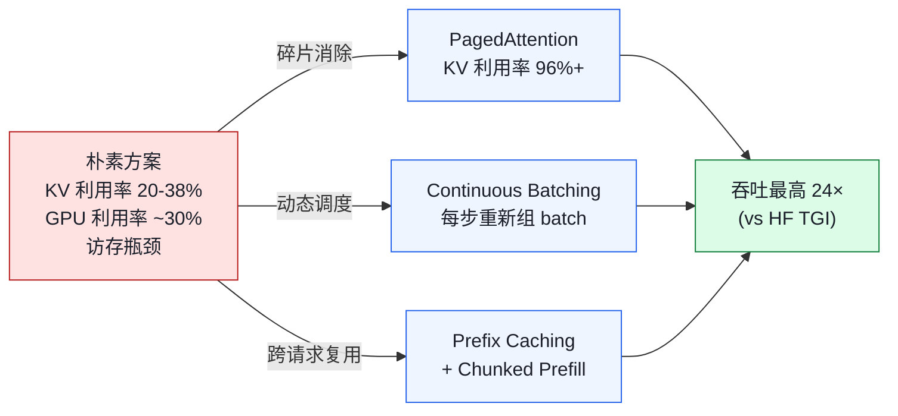

# 01. vLLM 是什么？为什么快？

> **谁该读这一篇？** 想用三句话讲清"vLLM 是干嘛的、解决什么瓶颈、相比 HF/TGI/TRT-LLM 凭什么快"的同学；面试前要把 vLLM 的定位与三大武器装进脑子的候选人。
>
> **前置阅读：** [`00-prerequisites.md`](00-prerequisites.md)（至少 §4 KV cache、§7 roofline、§8 batching 这三节）。
>
> **耗时：** 约 12 分钟。
>
> **学完能：**
> 1. 用一句话说出 vLLM 的定位，并复述 PagedAttention 论文里 KV 利用率 20-38% → 96% 的关键数字。
> 2. 列出 vLLM 的三大武器（PagedAttention / Continuous Batching / Prefix Caching + Chunked Prefill）并对应它们解决的具体瓶颈。
> 3. 在面试中区分 vLLM 与 TGI / TensorRT-LLM / SGLang / LMDeploy 的定位差异。
> 4. 指出哪些场景**不**适合用 vLLM，避免"为了 vLLM 而 vLLM"。

---

## 1. 一句话定义

vLLM 是为大语言模型推理与服务设计的**高吞吐、低延迟引擎**。由 UC Berkeley Sky Computing Lab 在 2023 年开源，核心论文是 SOSP'23 的 PagedAttention。

它要解决的问题：**让一张 GPU（或一组 GPU）在单位时间内服务尽可能多的并发请求，同时把每个用户感知到的延迟压到最低。**

---

## 2. 朴素方案的三个瓶颈

直接用 HuggingFace Transformers 部署 Llama-7B 推理服务，会立刻撞到三堵墙：

### 2.1 KV cache 内存碎片

LLM 自回归生成的每一步都需要把已生成 token 的 Key/Value 缓存下来，否则下一个 token 的 attention 没法回看历史。这就是 KV cache。

朴素做法：给每个请求预分配一段**连续显存**，长度按 `max_seq_len`（如 2048）顶格。

- 实际只生成 100 token → 浪费 95% 的预留
- 多请求长度不一 → **内部碎片**（reserved 但未用）+ **外部碎片**（小空闲块凑不出大请求需要的连续段）

PagedAttention 论文实测：KV cache 的有效利用率只有 **20.4% ~ 38.2%**。一张 80 GB 的 H100，60 GB 在浪费。

### 2.2 静态 batching 让 GPU 空转

朴素批处理（static batching）：一批请求一起进、一起出。最慢的那个决定整组的延迟。

```mermaid
gantt
    title Static Batching：长请求把整组拖死
    dateFormat X
    axisFormat %s

    section Slot 0 (A 短)
    A 生成 10 token : a, 0, 10
    空闲           :crit, after a, 90

    section Slot 1 (B 中)
    B 生成 60 token : b, 0, 60
    空闲           :crit, after b, 40

    section Slot 2 (C 长)
    C 生成 100 token : c, 0, 100

    section Slot 3 (D 中)
    D 生成 80 token : d, 0, 80
    空闲           :crit, after d, 20
```

A 早早做完，但槽位释放不了——下一个 batch 必须等 C 跑完。GPU 平均利用率往往不到 30%。

### 2.3 decode 阶段的访存瓶颈

decode（自回归生成）是 memory-bound 的：每生成一个 token，要把整个 KV cache 从 HBM 拉到 SRAM 才能做 attention。算术强度（FLOPs/Bytes）≈ 1，远低于 GPU 算力提供的 100+。算力大头闲着。

---

## 3. vLLM 的三大武器

### 3.1 PagedAttention — 解决 KV 碎片

借鉴 OS 虚拟内存：

- KV cache 切成定长 **block**（默认 16 token/block）
- 每个请求一张**块表（block table）**，把逻辑 block 索引映射到物理 block
- 物理 block 池统一管理、按需分配
- 内存利用率 > **96%**

详见 `02-core-concepts/01-paged-attention.md`。

### 3.2 Continuous Batching — 解决空转

**每一步**（每生成一个 token）都重新调度：

- 完成的请求立刻退出，腾出 KV 空间
- 等待队列里的新请求立刻进 batch
- 不同请求的 prefill / decode 可以混在同一个 forward step

实测吞吐 vs HuggingFace：最高 **24×**。详见 `02-core-concepts/02-continuous-batching.md`。

### 3.3 Prefix Caching + Chunked Prefill — 再上一台阶

- **Prefix Caching**：相同前缀（system prompt、few-shot 示例）的 KV block 只算一次，跨请求共享
- **Chunked Prefill**：长 prompt 的 prefill 切成多 chunk，与 decode 混跑，避免长 prefill 把 decode 卡住

---

## 4. 设计哲学

读代码前先建立这几条直觉，能省很多迷路时间：

| 原则 | 体现 |
| --- | --- |
| **内存即一等公民** | 调度的第一问是"还有 KV block 吗"，不是"队列有请求吗" |
| **请求是异步事件，不是同步循环** | EngineCore 异步轮询；Scheduler 每步独立决策，没有"等一个 batch 跑完"的概念 |
| **任何长操作都要可中断** | 长请求被 preempt（KV 释放或 swap），新请求立即进入 |
| **Worker 是纯执行器** | Scheduler 决定"做什么"，Worker 只负责"做"。分布式扩展时这个边界很重要 |
| **后端是可插拔的** | Attention 有 7+ 个后端，量化 10+ 种，平台 CUDA / ROCm / CPU / TPU |
| **正确性 > 性能，但两者都要** | Chunked prefill 的 attention mask 必须严格等价于完整 prefill 的结果 |

---

## 5. 性能数据（面试可引用）

> 数据来自 PagedAttention 论文与官方 README，不同硬件/模型会有差异。

| 对比对象 | vLLM 提升 | 备注 |
| --- | --- | --- |
| HuggingFace TGI（朴素 batching） | 24×（吞吐） | OPT-13B 论文数据 |
| FasterTransformer（NVIDIA） | 2.2× ~ 3.5× | 主要靠 PagedAttention |
| Triton + 静态 batch | 8×+ | 同模型同卡 |

- KV cache 利用率：20-38% → **96%+**
- TTFT：与朴素方案接近，但**吞吐高一个量级**

---

## 6. 不适合 vLLM 的场景

面试常被反问，提前准备：

- **极低延迟（< 10 ms TTFT）的单请求场景**：vLLM 为吞吐设计，单请求会被 batching overhead 拖累。这种场景用 TensorRT-LLM + CUDA Graph 重度优化更合适。
- **超大模型 + 极少并发**：405B 模型只服务 2 个用户，PagedAttention 的内存收益体现不出来。
- **训练**：vLLM 是纯推理引擎，没有反向传播。

---

## 7. vLLM 与生态

面试可能问到的"近邻"：

| 系统 | 定位 | 对比 vLLM |
| --- | --- | --- |
| **TensorRT-LLM** | NVIDIA 官方推理优化 | 单请求延迟更低，但灵活性差、新模型支持慢 |
| **SGLang** | 结构化生成 + RadixAttention | RadixAttention 是 PagedAttention 的 trie 变体，前缀复用更强 |
| **TGI** | HuggingFace 官方 | 简单易用，性能弱于 vLLM |
| **Llama.cpp** | CPU / Edge | 量化生态好，吞吐场景非对手 |
| **DeepSpeed-Inference** | 微软 | 从训练栈衍生，迭代慢 |
| **LMDeploy** | 上海 AI Lab | Turbomind 后端性能强，灵活性不如 vLLM |

---

## 小结

- 朴素 LLM 服务有三堵墙：**KV cache 碎片**（利用率 20-38%）、**静态 batching 让 GPU 空转**、**decode 阶段算力闲置**——vLLM 的每一项创新都对应消解其中一堵。
- 三大武器：**PagedAttention** 把 KV 切块管理，利用率拉到 96%+；**Continuous Batching** 每步重组 batch；**Prefix Caching + Chunked Prefill** 再榨干跨请求复用与长 prompt 的间隙。
- vLLM 是为**吞吐**优化的工程系统；极低单请求延迟、超大模型 + 极少并发、训练这三类场景不是它的主战场。
- 同生态对比：TGI 简单但慢、TensorRT-LLM 单请求延迟更低但灵活性差、SGLang 用 RadixAttention 在前缀复用上更激进、LMDeploy Turbomind 后端性能强但生态弱。

## 自检

> 答案不必照搬，能讲到关键点即可。

**1. 不查资料说出 PagedAttention 借鉴的 OS 概念、3 条对应关系（页 / 页表 / COW）。**

| OS 概念 | PagedAttention 对应 | 共同动机 |
| --- | --- | --- |
| **物理页（Page）** | KV block（默认 16 个 token 的 K+V）| 把大空间切成定长小块，统一管理，消除外部碎片 |
| **页表（Page Table）** | Block Table（每个请求一张）| 把"逻辑连续"的视图映射到"物理离散"的存储；indirection 一层换灵活性 |
| **COW（写时复制）** | Beam search / prefix caching 的 block 共享 | 多请求共享只读 block（ref_cnt++），分歧时才复制 |

加分点：还能讲**LRU 淘汰**（OS swap 选 victim ↔ Prefix cache evict 冷 block）、**虚拟地址翻译开销** ↔ block_table 间接寻址带来约 20% attention 慢，但整体吞吐 24× 净赚。

---

**2. 给客户介绍 vLLM 为什么比 HF 快 24×，90 秒三大武器各讲一句话。**

> "朴素方案有三堵墙——KV 浪费 60%、GPU 空转 70%、decode 卡内存。
>
> **武器一：PagedAttention**。把 KV cache 像 OS 分页一样切成小块，块表间接映射。利用率从 20-38% 拉到 96%，相当于同一张 H100 多塞 2-3 倍并发。
>
> **武器二：Continuous Batching**。每生成 1 个 token 就重新组 batch，做完的退出、等待的进来。再没人陪跑，GPU 利用率从 30% 拉到 80%+。
>
> **武器三：Prefix Caching + Chunked Prefill**。相同 prompt 前缀的 KV 跨请求复用，TTFT 直降 95%；长 prompt 切块跟 decode 混跑，杜绝长请求把别人卡死。
>
> 综合起来对比 HF Transformers，吞吐 24×。"

---

**3. 老板说"给单个 VIP 用户做极低延迟 chatbot，QPS 个位数"——用 vLLM 吗？**

**不建议（或至少不要为它而设计）**，给三点理由：

1. **vLLM 是为吞吐设计**：PagedAttention / Continuous Batching 在低并发下几乎没有收益（没有"其他请求"可以摊薄权重读取）。
2. **batching overhead 反而拖累延迟**：vLLM 每步有 scheduler decision、block allocation、metadata 同步等固定开销。单请求场景下这些是纯成本。
3. **TensorRT-LLM + CUDA Graph 是更好的选择**：NVIDIA 把单请求路径优化到了 metal——CUDA Graph capture 单 batch、kernel fusion 重度做、无 PagedAttention overhead。

**反建议**：如果"VIP + 低延迟" 实际上是"少量 VIP + 中等并发 + 严苛 SLO"，vLLM 还是值得用，但要：

- 关 `--enforce-eager` 走 CUDA Graph
- 把 `max-num-batched-tokens` 调小以减 step 时长方差
- 用 `--scheduling-policy priority` 给 VIP 优先级
- 多实例 + 路由层做物理隔离更稳

---

**4. `scheduler.py` vs `block_pool.py`，哪份实现 PagedAttention、哪份实现 Continuous Batching？**

- **`vllm/v1/core/block_pool.py`** 实现 **PagedAttention 的内存层**：定义 `KVCacheBlock` 数据结构、free queue（LRU 双链表）、allocate / free / ref_cnt 管理。这是"物理页分配器"。
- **`vllm/v1/core/sched/scheduler.py`** 实现 **Continuous Batching 的调度层**：每步决定哪些请求跑、跑几个 token、token budget 怎么分。这是"调度器主循环"。

两者通过 `kv_cache_manager.py` 衔接：scheduler 说"这个请求要 K 个新 block"，kv_cache_manager 调 block_pool 分配。**没有 block_pool，scheduler 无法做内存决策；没有 scheduler，block_pool 只是个空闲块池。**

加分：再讲清 `kv_cache_utils.py:hash_block_tokens` 是 **prefix caching** 的入口（链式 hash，详见 `02-core-concepts/04-prefix-caching.md`）。这是第四件"次要武器"，跟 block_pool 配合做跨请求 KV 复用。

## 下一步

- 下一节：[`02-architecture.md`](02-architecture.md)（把上面三大武器落到 API Server / EngineCore / Worker 三层进程结构里）。
- 想看源码：`vllm/v1/core/block_pool.py`（PagedAttention 的物理 block 池）、`vllm/v1/core/sched/scheduler.py`（Continuous Batching 的调度循环）。
- 想动手：[`07-hands-on/02-trace-a-request.md`](../07-hands-on/02-trace-a-request.md)（跑通第一个 vLLM 请求，把吞吐对比"算给自己看"）。
- 想从生产视角理解：[`08-production-deployment/01-deployment-architectures.md`](../08-production-deployment/01-deployment-architectures.md)（这三大武器在 K8s 与生产网关里如何被组合）。
