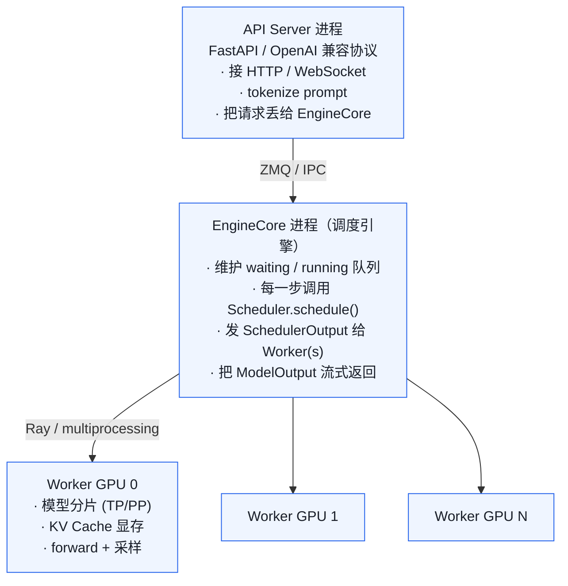
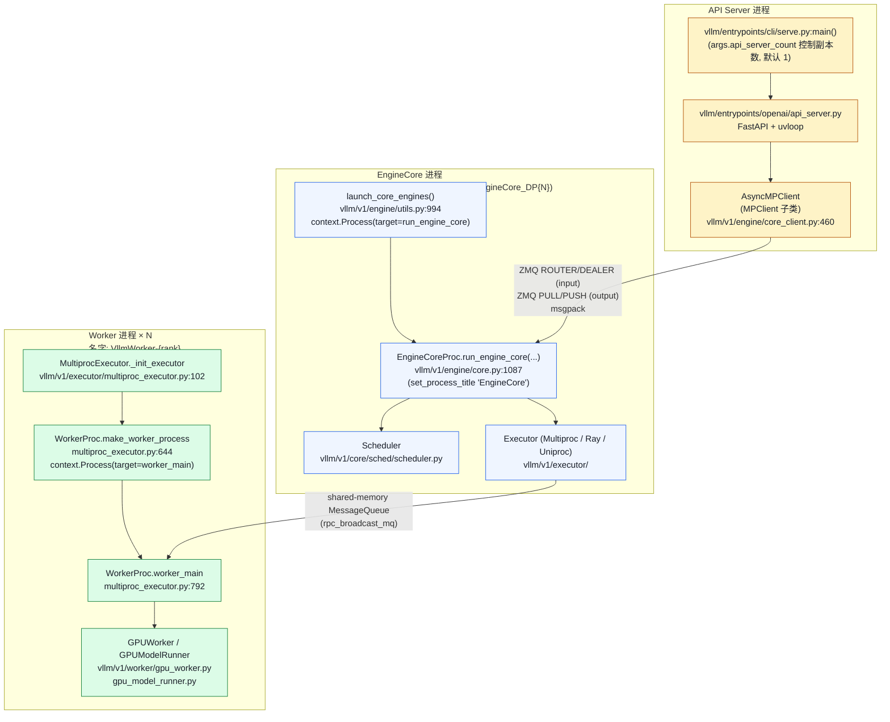
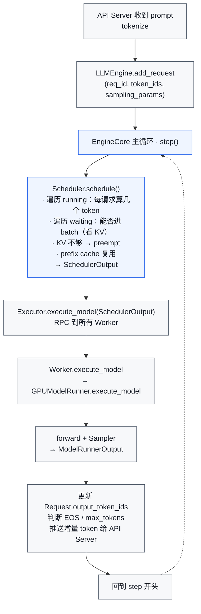
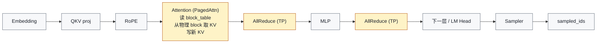
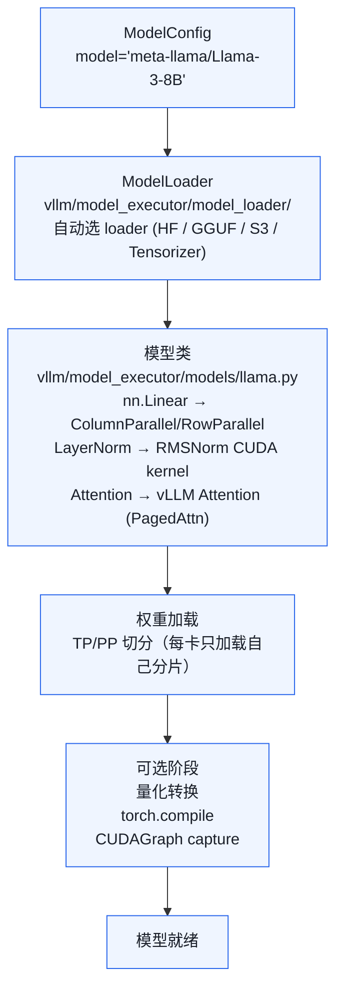
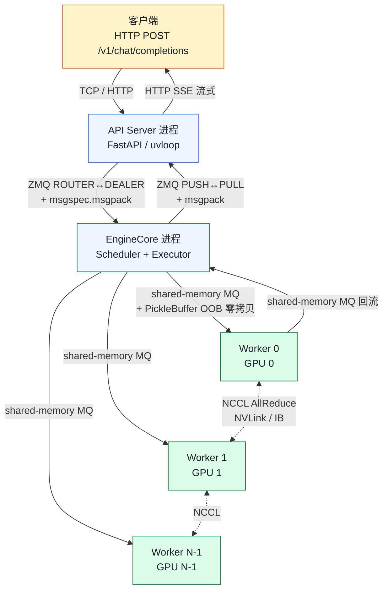

# 02. vLLM 整体架构

> **谁该读这一篇？** 想在脑子里建立一张"一个请求从 HTTP 到 GPU 再到流式返回"的全景图的同学；后面所有源码走读都靠这张图定位"自己读到了哪一层"。
>
> **前置阅读：** [`01-what-is-vllm.md`](01-what-is-vllm.md)（知道 vLLM 在解决什么问题）；最好扫一眼 [`00-prerequisites.md`](00-prerequisites.md) §8-10 的 batching / 分布式 / 指标。
>
> **耗时：** 约 20 分钟（含两张 Mermaid 仔细看）。
>
> **学完能：**
> 1. 不看代码描述一个请求从 HTTP 进来到 token 流式返回的所有进程跳转。
> 2. 列出 `SchedulerOutput`、`Request`、`KVCacheBlock`、`ModelRunnerOutput` 四个数据契约的关键字段。
> 3. 在脑子里展开单次 step 的执行链：Scheduler → Executor → Worker → forward → Sampler → 输出。
> 4. 把 vLLM 的每一项设计映射回操作系统 / 网络 / 分布式系统课里学过的对应概念。

目标是脑子里有一张清晰的图——一个请求从 HTTP 到 GPU 再到流式返回的完整路径。这张图刻进脑子，后面所有源码走读都能定位到它的某一层。

---

## 1. 进程视角：三层分工

vLLM 不是单进程程序。生产部署时它由多个进程协作：



源码定位：

| 组件 | 文件 |
| --- | --- |
| API Server | `vllm/entrypoints/openai/api_server.py` |
| LLM 类（offline 入口） | `vllm/entrypoints/llm.py` |
| EngineCore | `vllm/v1/engine/core.py` |
| LLMEngine | `vllm/v1/engine/llm_engine.py` |
| Worker | `vllm/v1/worker/gpu_worker.py` |
| ModelRunner | `vllm/v1/worker/gpu_model_runner.py` |

---

## 1.5 进程模型 · 简版（深入见 `05-process-and-ipc-internals.md`）

逻辑三层背后的真实进程长这样（每个 Worker 进程绑一张 GPU）：



> **简版到此为止**——以上 Mermaid 已展示三层进程结构。
>
> 要看 **进程怎么 spawn（fork vs spawn、入口函数、PID 树）、ZMQ 控制平面、shared-memory 数据平面、PEP 574 零拷贝、三种部署形态、真实 ps -ef 进程清单**，请进入下一篇 **`05-process-and-ipc-internals.md`**。本节不在架构总览里展开，让这一篇保持"全景"定位。


## 2. 数据契约：四个核心数据结构

读源码之前先认这四个结构。后面所有调用都在围着它们转。

### 2.1 `Request`（请求）
- 位置：`vllm/v1/request.py`
- 字段：`request_id`、`prompt_token_ids`、`sampling_params`、`status`、`output_token_ids`、`num_computed_tokens`
- 状态机：`WAITING` → `RUNNING` → `FINISHED` / `PREEMPTED`

### 2.2 `SchedulerOutput`（调度器一步的决策）
- 位置：`vllm/v1/core/sched/output.py`
- 关键字段：
  - `scheduled_new_reqs` — 本步新进入 batch 的请求
  - `scheduled_cached_reqs` — 本步继续执行的请求
  - `num_scheduled_tokens` — 每个请求本步要算几个 token（prefill 可能 > 1，decode = 1）
  - `total_num_scheduled_tokens` — 所有请求加起来的本步总 token 数
  - `preempted_req_ids` — 本步被踢出去的请求
  - `finished_req_ids` — 本步完成的请求
  - `kv_connector_metadata` — 跨 worker 传输 KV 的元数据（多机用）

### 2.3 `KVCacheBlock` / `BlockTable`
- `KVCacheBlock`：一个物理 block（一段固定显存），含 `block_id`、`ref_cnt`
- `BlockTable`：每个请求的逻辑 block 序列（`list[block_id]`）
- 位置：`vllm/v1/core/kv_cache_utils.py`、`vllm/v1/core/block_pool.py`

### 2.4 `ModelRunnerOutput`（Worker 跑完的结果）
- 字段：`sampled_token_ids`、`logprobs`、`prompt_logprobs`
- Worker 返回给 EngineCore 的"答卷"

---

## 3. 单次推理 step 的完整流程

整个推理过程的核心 step 循环：



forward 内部进一步展开（一层 Transformer 的执行链）：



这张链路图刻在脑子里之后，面试时绝大多数问题都能往这张图上靠——问 attention 在哪一步、问 TP 通信在哪一步、问 KV 写在哪一步，都能直接指出位置。

---

## 4. 同步 vs 异步：V1 的 async scheduler

`vllm/v1/core/sched/async_scheduler.py` 让**调度与前向 overlap**：

```mermaid
gantt
    title 普通模式 vs Async Scheduler
    dateFormat X
    axisFormat %s

    section 普通
    step 1 schedule    :s1, 0, 1
    step 1 forward     :f1, after s1, 4
    step 1 output      :o1, after f1, 1
    step 2 schedule    :s2, after o1, 1
    step 2 forward     :f2, after s2, 4
    step 2 output      :o2, after f2, 1

    section Async
    step 1 schedule    :as1, 0, 1
    step 1 forward     :af1, after as1, 4
    step 2 schedule    :as2, after as1, 1
    step 1 output      :ao1, after af1, 1
    step 2 forward     :af2, after as2, 4
    step 2 output      :ao2, after af2, 1
```



Scheduler 是纯 CPU 操作，与 GPU forward 在不同执行单元上跑。让 step N+1 的 schedule 在 step N 的 forward 还在跑时启动，大 batch 下可省 5-10% 端到端时间（Python 调度开销在大 batch 下不可忽略）。

---

## 5. 模型加载：从 HuggingFace 到 GPU



源码入口：`vllm/v1/worker/gpu_worker.py:load_model()`。

---

## 6. 一个具体例子：单 prompt 生成 10 tokens

设 prompt 32 tokens、`block_size=16`、`max_tokens=10`：

| Step | 阶段 | Scheduler | Worker | 输出 |
| --- | --- | --- | --- | --- |
| 1 | Prefill | 分配 `ceil(32/16)=2` 个 block | 计算 32 token 的 QKV，写入 2 个 block，采样第 33 个 token | 1 token |
| 2..11 | Decode | 检查 `33+i` 落在第几个 block，跨边界则新分配 1 个 block | 算 1 个新 token 的 QKV，读全部历史 KV 做 attention，采样下一个 token | 1 token / step |
| 12 | 结束 | 达到 `max_tokens`，标记 FINISHED，free 所有 block（`ref_cnt -= 1`）；prefix caching 开启时 block 进 free queue 但不删 hash | — | — |

注意几个非显然的点：

1. **Prefill 与 decode 是同一段代码**，区别只是 `num_scheduled_tokens > 1` vs `== 1`。源码里没有"prefill 阶段"和"decode 阶段"的分支。
2. **第 33 个 token 写在第几个 block？** 写在 block 1 的位置 0（因为 0-15 在 block 0，16-31 在 block 1，32 才落到 block 2 第一格——但 prompt 只到 31，第 33 个 token 是采样出来的）。
3. **第 32 个 token 后采样出来的第 33 个 token 不算 prefill 输入**——下一步它才会被算 attention。

---

## 7. vLLM 与系统课的对应关系（给本科生的桥）

vLLM 几乎每一个设计决定都能在本科系统课里找到原型。把这层映射建立起来，能让你**用已经熟悉的概念**去理解陌生的代码，而不是把每个名词都当新东西硬背。

### 7.1 操作系统课

| 课上学过的 | vLLM 里的体现 | 详见 |
| --- | --- | --- |
| 进程 vs 线程 | Worker 用进程不用线程（避开 Python GIL；每进程独立 CUDA context） | `05-process-and-ipc-internals.md` §2 |
| 虚拟内存 / 页表 | **PagedAttention** —— KV block 是物理页，每请求一张 block table | `02-core-concepts/01-paged-attention.md` |
| 页错误 → 抢占 | KV 不够时的 `preempt`（释放或 swap） | `02-core-concepts/03-kv-cache-management.md` |
| 写时复制（COW） | beam search / parallel sampling 多候选共享前缀 block，分歧时再 fork | 同上 |
| 引用计数（refcount） | `KVCacheBlock.ref_cnt` | 同上 |
| LRU 缓存替换 | `BlockPool` 的 `free_block_queue` 是 LRU 双向链表 | `03-code-walkthrough/03-kv-cache-manager.md` |
| 进程间通信（socket / shm / pipe） | API↔Engine 用 ZMQ；Engine↔Worker 用 `multiprocessing.shared_memory` | `05-process-and-ipc-internals.md` §4-5 |
| fork vs spawn | `get_mp_context()`；Linux fork、macOS spawn | `05-process-and-ipc-internals.md` §2.2 |
| 信号 / 优雅退出 | `SIGTERM` → `EngineShutdownState.REQUESTED` → drain → shutdown | `vllm/v1/engine/core.py:1145` |
| 生产者-消费者 | `Scheduler.waiting` / `running` 队列 | `03-code-walkthrough/02-scheduler.md` |
| 发布-订阅（pubsub） | `MessageQueue` 是一写多读的共享内存广播器 | `05-process-and-ipc-internals.md` §5 |
| 自旋锁 / 条件变量 | `SpinCondition`（`shm_broadcast.py:97`）等共享内存就绪信号 | 同上 |
| 调度策略（FCFS / 优先级） | `Scheduler` 默认 FCFS，可切 priority | `vllm/v1/core/sched/scheduler.py` |
| 资源隔离（namespace / cgroup） | K8s Pod + NUMA binding + `nvidia.com/gpu` device plugin | `08-production-deployment/01-deployment-architectures.md` |
| 文件描述符传递 | `make_worker_process` 用 `Pipe` 把就绪/死亡信号传给子进程 | `vllm/v1/executor/multiproc_executor.py:656` |
| Memory-mapped I/O | 模型权重加载常用 `mmap`（safetensors 默认走 mmap 加载） | `vllm/model_executor/model_loader/` |

### 7.2 计算机网络课

| 课上学过的 | vLLM 里的体现 | 详见 |
| --- | --- | --- |
| TCP / Unix domain socket | API↔Engine 默认 `ipc://`（UDS），跨机退化 `tcp://` | `05-process-and-ipc-internals.md` §4.2 |
| HTTP/2 + Server-Sent Events | OpenAI 兼容的流式 token 输出 | `vllm/entrypoints/openai/api_server.py` |
| RPC / 消息序列化 | msgspec.msgpack 替代 pickle 做控制平面消息 | `05-process-and-ipc-internals.md` §4.3 |
| 集合通信（MPI 风格 AllReduce） | NCCL 在 TP 内每层做 AllReduce、AllGather | `05-distributed/01-tp-pp-ep.md` |
| 网络拓扑分层 | NVLink（卡间，900 GB/s）> InfiniBand / RoCE（机间，400 Gbps）> Ethernet | `00-prerequisites.md` §6 |
| 控制平面 vs 数据平面分离 | API ↔ Engine 控制平面 + Engine ↔ Worker 数据平面分离 | `05-process-and-ipc-internals.md` §7 |
| 一致性哈希 | API Gateway session sticky 路由（conversation_id → 固定 Pod） | `08-production-deployment/02-smart-routing-and-load-balancing.md` |
| 反向代理 / Service Mesh | Envoy AI Gateway + Istio Inference Extension（ExtProc → EPP） | `08-production-deployment/03-gateway-and-service-mesh.md` |
| RDMA / DMA 直传 | NIXL 跨节点 GPU-Direct，绕过 CPU 转发 KV | `08-production-deployment/02-disaggregated.md` |
| 拥塞控制 / 限流 | Gateway 的 token-level / RPS-level ratelimit、admission control | `08-production-deployment/03-gateway-and-service-mesh.md` §5 |
| 重试 / 熔断 | Envoy outlier detection + 客户端指数退避 + jitter | `08-production-deployment/06-reliability-and-failure-modes.md` |

### 7.3 计算机体系结构 / GPU 编程

| 课上学过的 | vLLM 里的体现 | 详见 |
| --- | --- | --- |
| 存储层级（寄存器→cache→DRAM） | GPU 是寄存器 → SRAM → L2 → HBM → NVLink → PCIe → DRAM 七级 | `00-prerequisites.md` §6 |
| 算术强度 / Roofline | LLM prefill 是 compute-bound，decode 是 memory-bound | `00-prerequisites.md` §7 |
| SIMT / Warp | CUDA kernel 设计基础（FlashAttention tiling 都基于此） | `03-code-walkthrough/06-cuda-kernels.md` |
| 流水线 ILP / 双 buffer | CUDA Graph + 异步 Scheduler，schedule 与 forward overlap | `03-cudagraph-and-compile.md` §1 / 本篇 §4 |
| 多级缓存 | KV cache 的 L1（GPU HBM）/ L2（CPU DRAM）/ L3（远端 LMCache） | `08-production-deployment/01-deployment-architectures.md` |
| 数据 vs 指令 cache | 量化 weight 缓存 + KV cache 是数据；CUDA Graph 是 "instruction cache" 类比 | `04-optimizations/03-cudagraph-and-compile.md` |
| 字节序 / endian | shared-memory ring 内 `to_bytes_big` 大端打包 | `shm_broadcast.py:752,780` |
| 引用 vs 拷贝 | PEP 574 PickleBuffer + OOB 实现零拷贝 IPC | `05-process-and-ipc-internals.md` §5.3 |

### 7.4 分布式系统课

| 课上学过的 | vLLM 里的体现 | 详见 |
| --- | --- | --- |
| 主从模型（leader/follower） | rank 0 是 driver worker，广播 SchedulerOutput 给其他 worker | `03-code-walkthrough/04-model-runner.md` |
| 共识 / 协调 | DP 模式下 `DPCoordinator` 协调多个 EngineCore 的全局状态 | `vllm/v1/engine/coordinator.py` |
| 故障恢复 | KV preempt = "断点重续"（recompute）vs swap（持久化） | `02-core-concepts/02-continuous-batching.md` §7 |
| 心跳 / liveness | `EngineCore` 监控 Worker 健康，崩了整组重启 | `08-production-deployment/06-reliability-and-failure-modes.md` |
| 一致性视图 | AIBrix 的 KV Event Sync 让所有 Pod 看到一致的 cache 状态 | `08-production-deployment/02-smart-routing-and-load-balancing.md` §4.2 |
| 水平扩展 vs 垂直扩展 | API Server 多副本（水平）vs Worker 加 TP（垂直） | 本篇 §1 |
| 数据本地性 | session sticky 路由让 prefix cache 在同一 Pod 里命中 | `08-production-deployment/02-smart-routing-and-load-balancing.md` §3 |
| 异步流水线 | Async Scheduler 让本 step 的 `schedule()` 与上 step 的 forward 并行 | 本篇 §4 |
| 服务发现 / 负载均衡 | Smart Router（llm-d EPP / AIBrix Gateway）按 cache/load/LoRA 打分 | `08-production-deployment/02-smart-routing-and-load-balancing.md` |

### 7.5 一句话总结

vLLM 不是凭空发明新概念，而是把**操作系统的虚拟内存 + 分布式系统的生产者-消费者 + GPU 编程的内存层级感知 + 网络的控制/数据平面分离** 这四套成熟思路，针对"自回归 LLM 推理"这个工作负载重新组合。**每读到一个看起来高深的设计，先问自己"这在系统课里叫什么？"**——80% 的情况你能立刻找到对应原型，剩下 20% 才是 vLLM 真正的新东西（主要是 PagedAttention 论文那一套）。

---

## 8. 延伸阅读

按主题展开本篇覆盖的高层概念：

- **进程模型 + IPC 内部机制** → `05-process-and-ipc-internals.md`（ZMQ socket 类型、msgpack、shared-memory MessageQueue、PEP 574 OOB 零拷贝、`ps -ef` 真实进程清单）
- **PagedAttention（虚拟内存类比）** → `02-core-concepts/01-paged-attention.md`
- **KV cache 抽象** → `02-core-concepts/03-kv-cache-management.md`
- **Scheduler 调度策略** → `03-code-walkthrough/02-scheduler.md`
- **TP / PP / EP 通信** → `05-distributed/01-tp-pp-ep.md`
- **生产部署形态** → `08-production-deployment/01-deployment-architectures.md`

---

## 小结

- vLLM 进程拓扑分三层：**API Server**（HTTP / tokenize）→ **EngineCore**（调度 + KV 管理）→ **Worker**（每 GPU 一个进程，跑 forward）。控制平面 ZMQ + msgpack，数据平面 shared-memory MessageQueue。
- 四个核心数据契约：`Request`（请求状态机）、`SchedulerOutput`（调度器一步的决策）、`KVCacheBlock` + `BlockTable`（KV 的物理 / 逻辑表示）、`ModelRunnerOutput`（Worker 答卷）——所有调用都围着它们转。
- 单 step 的执行链：`schedule()` → 广播 `SchedulerOutput` → Worker forward → Sampler → 回收 token → 进入下一 step；prefill 与 decode 共用同一条链，区别只是 `num_scheduled_tokens` 是否大于 1。
- V1 的 **AsyncScheduler** 让"本 step 的 CPU 调度"与"上 step 的 GPU forward" overlap，大 batch 下省 5-10% 端到端时间。
- vLLM 80% 的设计在 OS / 网络 / 分布式系统课里都有原型（虚拟内存 / COW / refcount / 控制 vs 数据平面 / 主从模型）——遇到陌生设计先去课本里找原型。

## 自检

> 答案不必照搬，能讲到关键点即可。

**1. 画出完整请求路径，标 IPC 机制。**



**三层 IPC 的关键区别**：

- **API ↔ EngineCore**：ZMQ + msgpack。低频（每请求 1-2 次），跨机器友好，μs 级序列化。
- **EngineCore ↔ Worker**：共享内存 ring + OOB 零拷贝。高频（每 step 1 次，100+ Hz），KB-MB 级消息，序列化几乎免费。
- **Worker ↔ Worker**：NCCL。每层 forward 1-2 次 AllReduce，必须最高带宽。

详见 [`05-process-and-ipc-internals.md`](05-process-and-ipc-internals.md)。

---

**2. 列 `SchedulerOutput` 至少 5 个字段，说出谁在哪侧用。**

源码：`vllm/v1/core/sched/output.py`

| 字段 | Scheduler 写入 | Worker 消费 |
| --- | --- | --- |
| `scheduled_new_reqs : list[NewRequestData]` | 本步新进入的请求（含 prompt token、采样参数） | Worker 把 prompt 转 tensor、分配 KV slot |
| `scheduled_cached_reqs : CachedRequestData` | 已 running 请求的 block_ids / num_computed_tokens | Worker 构造 input_batch / attention metadata |
| `num_scheduled_tokens : dict[req_id, int]` | 每个本步要算的 token 数（prefill chunk / decode = 1）| Worker 据此组装 packed batch |
| `total_num_scheduled_tokens : int` | 全步 token 总数 | Worker 据此 pad / 选 CUDA Graph capture 尺寸 |
| `scheduled_spec_decode_tokens : dict[req_id, list[int]]` | 投机解码的草稿 token | Worker 一起塞进 forward，验证后采纳/拒绝 |
| `preempted_req_ids : set[str]` | 本步被抢占的请求 | Worker 释放 KV（recompute）或拷出 CPU（swap） |
| `finished_req_ids : set[str]` | 本步完成的请求 | Worker 释放 KV、清理 sampling 状态 |
| `kv_connector_metadata` | P/D 分离 / KV offload 元数据 | Worker 据此触发 KV transfer |
| `grammar_bitmask` | 结构化输出的 token mask | Worker 在 sampler 里 apply |

**口诀**：SchedulerOutput 是"做什么"的契约——Scheduler 决定，Worker 执行。字段越多，Worker 越被动——这是 V1 的核心哲学。

---

**3. 在 `EngineCoreProc` 里指出 schedule / execute / 回写大约哪几行。**

源码：`vllm/v1/engine/core.py::EngineCoreProc.run_engine_core`（约 line 1087+）。一个 step 大致：

```python
# 伪代码，实际行号随版本变动
def step(self):
    # ① schedule（CPU 上算，~3 ms）
    scheduler_output = self.scheduler.schedule()           # vllm/v1/core/sched/scheduler.py

    # ② execute_model（GPU forward + sample，~30 ms）
    model_runner_output = self.executor.execute_model(
        scheduler_output
    )                                                       # vllm/v1/executor/multiproc_executor.py
                                                            # 内部调 Worker 的 gpu_model_runner.py

    # ③ 把输出（token_ids / logprobs / finished）写回 Scheduler 状态
    self.scheduler.update_from_output(
        scheduler_output, model_runner_output
    )                                                       # vllm/v1/core/sched/scheduler.py::_update_request_with_output

    # ④ finished 请求结果通过 ZMQ 推回 API Server
    for output in self.collect_finished_outputs():
        self.output_socket.send(...)
```

定位方法：在 `vllm/v1/engine/core.py` 里 grep `def step`、`schedule`、`execute_model`、`update_from_output`。

---

**4. V1 为什么多进程而不是多线程？至少 3 条理由。**

| 理由 | 解释 |
| --- | --- |
| **Python GIL** | 多线程下 schedule / sampler / detokenizer 等 Python 逻辑还是串行；多进程让每个 Worker 有独立 GIL，真正并发 |
| **CUDA context 隔离** | 每个 CUDA context 绑一个进程；多进程让每张 GPU 有独立 context，崩溃互不牵连 |
| **故障域隔离** | Worker OOM / segfault 不会拖垮 EngineCore；可以重启单个 Worker（NCCL 重建除外） |
| **NCCL 习惯** | 业界标准是 one-rank-per-process；多线程跑 NCCL 历史上有死锁 bug |
| **CUDA Graph 兼容** | 每张 GPU 一个 stream + capture context，多进程天然契合 |
| **资源会计清晰** | `ps` / `top` / `nvidia-smi` 直接看每 Worker 的 CPU/GPU 占用 |

代价：进程间通信比线程贵——这就是为什么数据平面（EngineCore ↔ Worker）用**共享内存 + 零拷贝**而不是 ZMQ。

---

**5. async scheduler 节省多少 ms？**

前提：单 step forward = 30 ms（GPU），schedule = 3 ms（CPU）。

**同步**（V0）：

```
step n:   [sched 3ms][forward 30ms][sched 3ms][forward 30ms]...
单 step = 3 + 30 = 33 ms
```

**async**（V1）：

```
step n:   CPU [sched 3ms]
              ↓ 启动 forward 后立即返回
          CPU [sched next 3ms]              ← 与 GPU forward 并行
          GPU [forward 30ms          ]
单 step = max(30, 3) = 30 ms
```

CPU schedule 完全藏在 GPU forward 内（3 ms < 30 ms）。**每步省 3 ms**，相对 33 ms = **9.1%**。

收益与 schedule / forward 比值有关：

- schedule 重（大 batch + 复杂调度，可能 5-10 ms）→ async 收益最大
- schedule 轻（小 batch + FCFS，1 ms）→ async 几乎看不到收益

## 下一步

- 下一节：[`03-v0-vs-v1.md`](03-v0-vs-v1.md)（讲清 V0 → V1 重构的 5 大动机，避免你读错代码）。
- 想深挖进程模型：[`05-process-and-ipc-internals.md`](05-process-and-ipc-internals.md)（ZMQ socket 类型、shared-memory MessageQueue、零拷贝 trick、`ps -ef` 真实进程清单）。
- 想看源码：`vllm/v1/engine/core.py`（EngineCore 主体）、`vllm/v1/core/sched/scheduler.py`（调度入口）、`vllm/v1/worker/gpu_model_runner.py`（forward 主体）。
- 想动手：[`07-hands-on/04-profiling-and-debugging.md`](../07-hands-on/04-profiling-and-debugging.md)（用 NVTX / py-spy 验证本节讲的执行链是否真的在跑）。
- 想从生产视角理解：[`08-production-deployment/01-deployment-architectures.md`](../08-production-deployment/01-deployment-architectures.md)（三层进程在 K8s LeaderWorkerSet 里如何映射成 Pod / 容器）。
