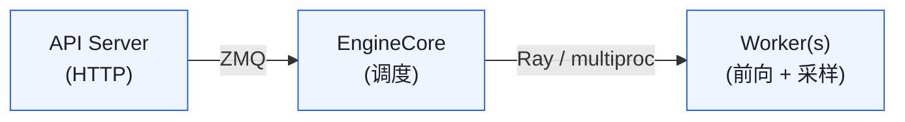

# 03. V0 → V1：vLLM 的架构重构

> **谁该读这一篇？** 打开 vLLM 源码看到 `vllm/engine/` 和 `vllm/v1/` 两个目录犹豫"该读哪个"的同学；面试被追问 "V0 和 V1 有什么区别"想给出结构化答案的候选人。
>
> **前置阅读：** [`02-architecture.md`](02-architecture.md)（先建立三层架构与单 step 执行链的脑图，再来看哪些地方被 V1 重写）。
>
> **耗时：** 约 10 分钟。
>
> **学完能：**
> 1. 看到 `vllm/v1/...` 就知道是当前主路径，看到 `vllm/engine/...` 就知道是兼容层（少数 CPU 后端还在）。
> 2. 用 5 条变化（统一调度 / 持久 InputBatch / KV 解耦 / AsyncScheduler / 进程结构）讲清 V1 重构动机。
> 3. 对照伪代码说出 V0 "两阶段调度" 与 V1 "token budget" 的本质差异。
> 4. 在源码目录里快速找到 V0 → V1 的对应文件迁移路径。

---

## 1. 现在的 vLLM 是 V1

`vllm/v1/` 是当前主路径（2024 年中重构，2024 年底基本完成）。
`vllm/engine/` 是 V0 兼容层，未来会移除。

**学习时只读 V1。** 本笔记所有"Engine"、"Scheduler"指的都是 V1 版本。

---

## 2. V0 的痛点

V0 是 PagedAttention 论文那一版的实现。两年迭代下来积累了几个结构性问题：

| V0 痛点 | 后果 |
| --- | --- |
| Scheduler 把 prefill 与 decode 分两段调度 | 长 prefill 阻塞短 decode，TTFT/TPOT 矛盾 |
| KV cache 管理与 `Sequence` 紧耦合 | Prefix caching / 多模态 / MLA 接入困难 |
| GPUModelRunner 嵌大量 "是不是 prefill" 的分支 | Chunked prefill 实现极其复杂 |
| 单 EngineLoop 同步 schedule + 前向 | Python 调度开销难以隐藏 |
| 每步重建输入 batch tensor | 大 batch 下 CPU overhead > 10 ms |
| 多模态、spec decoding、disaggregated 都靠 hack | 代码越来越烂 |

---

## 3. V1 的五大改变（面试高频）

记住这五条，能覆盖 80% 的 "V0 vs V1" 提问。

### 3.1 统一调度：prefill 与 decode 不再分两阶段
V0：先把所有能 prefill 的请求跑完，再做 decode。结果是长 prompt 卡住所有 decode。
V1：每一步混合调度。每个请求带 `num_scheduled_tokens`，prefill = 多 token、decode = 1 token，全部混在同一个 forward。

Chunked prefill 在 V1 是**默认行为**（V0 是 opt-in）。

### 3.2 持久化输入 Batch（InputBatch）
V0 每步重建 tensor，伴随大量 CPU→GPU 小张量拷贝。
V1 引入 `InputBatch`（`vllm/v1/worker/gpu_input_batch.py`），把请求 ID → 行索引的映射稳定下来，每步只更新 diff（新增/删除的行）。

效果：大 batch 下 CPU overhead 降低一个数量级。

### 3.3 KV cache 抽象与 `Sequence` 解耦
V0 的 `Sequence` 同时管 token、KV 索引、metadata，臃肿且难扩展。
V1 把 KV 管理彻底独立到 `vllm/v1/core/kv_cache_manager.py` + `block_pool.py`：

- Request 只持有 `token_ids` 和 `sampling_params`
- `KVCacheManager` 单独管 block 分配 / 释放 / 复用

副作用：

- Prefix caching 在 manager 内部就能闭环
- MLA（DeepSeek 的注意力变体）只需换一种 manager
- 多种 KV 类型（普通 paged KV + Mamba state）可以共存

### 3.4 异步调度（AsyncScheduler）
让 `schedule()`（纯 CPU）与上一步的 forward（GPU）overlap，挤出 5-10% 端到端时间。
文件：`vllm/v1/core/sched/async_scheduler.py`。

### 3.5 进程结构清晰化
V0 进程边界混乱，API server / engine / worker 经常融合。
V1 严格分三层，进程间走 ZMQ + Ray，无共享状态，方便横向扩展：



---

## 4. 调度循环对比

V0 的伪代码（示意）：

```python
def step():
    # 阶段 1：尽可能多地 prefill
    while waiting_queue and have_kv_space():
        req = waiting_queue.pop()
        run_prefill(req)        # 一次跑完整 prompt

    # 阶段 2：所有 running 做 decode
    for req in running:
        run_decode(req)         # 每个跑 1 token
```

V1 的伪代码：

```python
def step():
    # 一次性决定每个请求本步算几个 token
    scheduled = {}
    token_budget = max_batched_tokens  # 比如 8192

    # 先保 running（已经在跑的优先）
    for req in running:
        n = min(req.remaining_prompt + req.decode_steps, token_budget)
        scheduled[req] = n
        token_budget -= n

    # 再看 waiting 能不能塞进来
    for req in waiting:
        if can_allocate_kv(req) and token_budget > 0:
            n = min(req.prompt_len, token_budget)
            scheduled[req] = n
            token_budget -= n
            running.append(req)

    # 一次 forward 跑完所有 scheduled[req] 个 token
    run_forward(scheduled)
```

V1 没有 "prefill 阶段" 与 "decode 阶段" 的概念，只有"这一步算多少 token"。这是设计层面的本质差异。

---

## 5. 代码地图对照

| 功能 | V0 路径 | V1 路径 |
| --- | --- | --- |
| Engine | `vllm/engine/llm_engine.py` | `vllm/v1/engine/llm_engine.py` |
| Scheduler | `vllm/core/scheduler.py`（已删） | `vllm/v1/core/sched/scheduler.py` |
| Block Mgr | `vllm/core/block_manager.py`（已删） | `vllm/v1/core/kv_cache_manager.py` |
| Worker | `vllm/worker/`（部分留作 CPU 后端） | `vllm/v1/worker/` |

V0 的目录已经被渐进式删除得很精简——这是迁移的痕迹。

---

## 6. 实践建议

1. **不要读 V0 代码**，除非考古或解决特定历史问题。
2. PagedAttention 论文（SOSP'23）讲的是 V0 思想，但实现细节已变。**思想不变，代码全换**。
3. 面试被问 "V0/V1 区别"，按上面 5 点框架展开，最后落一句话："本质是把*调度策略*与*执行机制*彻底解耦"。

---

## 小结

- **现在的 vLLM 是 V1**：`vllm/v1/` 是主路径，`vllm/engine/` 只是兼容层；学习时只读 V1。
- 五大重构动机：①统一调度（chunked prefill 默认开）②持久 InputBatch（增量更新）③KV 与 Sequence 解耦（KVCacheManager 独立）④AsyncScheduler（CPU 调度与 GPU forward overlap）⑤进程结构清晰化（API / Engine / Worker 严格分层）。
- V1 没有"prefill 阶段 / decode 阶段"的概念，只有"这一步 token budget 内算多少 token"——这是与 V0 最根本的设计差异，也是 chunked prefill 自然落地的前提。
- 一句话答面试：**"V1 把*调度策略*与*执行机制*彻底解耦"**。

## 自检

> 答案不必照搬，能讲到关键点即可。

**1. `vllm/v1/core/sched/scheduler.py` vs `vllm/core/scheduler.py`，哪个是主路径？**

`vllm/v1/core/sched/scheduler.py` 是当前主路径（V1 实现，~2300 行）。`vllm/core/scheduler.py` **已被删除**——V0 调度器已不存在。判断方法：

- 文件存在与否：`ls vllm/core/scheduler.py` 大概率 404
- 看 `vllm/v1/engine/core.py` 里 import 的是 `vllm.v1.core.sched.scheduler.Scheduler`
- `vllm/engine/llm_engine.py` 现在只是 V1 LLMEngine 的兼容包装

→ **判断"V0 vs V1"的最简启发**：路径里有没有 `/v1/`。

---

**2. V0 vs V1 `step()` 伪代码对比。**

**V0**（两阶段循环）：

```python
def step():
    if waiting and current_phase == "decode":
        # 切换到 prefill phase，吃掉一批新请求
        for req in waiting[:batch_size]:
            prefill_forward(req)              # 整段 prefill 一次跑完
            running.append(req)
        current_phase = "decode"
    else:
        # 全员 decode 一步
        for req in running:
            decode_forward(req, 1_token)      # decode 时 prefill 阻塞
```

**问题**：长 prefill 来一个就把所有 running 的 decode 卡几百 ms。

**V1**（token budget 单阶段）：

```python
def step():
    budget = MAX_NUM_BATCHED_TOKENS                 # 比如 8192
    work = {}                                        # req_id -> num_tokens_this_step

    # 先给所有 running 各 1 个 decode token
    for req in running:
        if budget > 0:
            work[req.id] = 1
            budget -= 1

    # 剩余 budget 给 prefill（新请求或老请求未完 prefill 段）
    for req in waiting + still_prefilling:
        n = min(req.remaining_prefill_tokens, budget)
        if n > 0:
            work[req.id] = n
            budget -= n

    # 一次 forward 跑完所有 work
    forward(work)                                   # prefill + decode 混在同一个 packed batch
```

→ 因为 attention metadata（`query_start_loc` / `seq_start_loc` / `block_table` 等）能描述每个请求各算几个 token，**同一次 forward 自然支持 prefill chunk + decode token 混合**。这就是 chunked prefill 默认开的物理基础。

---

**3. `KVCacheManager` 解耦后，哪些新特性各从哪个点获益？**

| 特性 | 受益的解耦点 |
| --- | --- |
| **Prefix caching** | KV manager 知道"block 内容用 hash 标识"，与"请求归属"解耦。可以多请求共享同一物理 block（ref_cnt++） |
| **MLA**（DeepSeek 多头潜在）| KV manager 不假设 KV 形状是 `[2, num_blocks, ...]`；MLA 的 latent KV 形状是 `[num_blocks, latent_dim]`，照样能 plugin 进 KVCacheSpec |
| **Mamba state** | Mamba 不存"K/V"而是 SSM hidden state（每层一个固定大小张量）；KV manager 把它建模为另一种 `KVCacheSpec` 即可，scheduler 不用改 |
| **Hybrid（Jamba 类）** | 同一个模型既有 attention KV 又有 Mamba state，KV manager 用 `KVCacheGroup` 同时管多种 spec |
| **P/D 分离 / KV offload** | KV manager 内部有 `KVConnectorMetadata` 接口，物理 block 可以在远端，不影响 scheduler 决策 |

**抽象的好处**：scheduler 完全不知道 KV 物理形状是什么——它只问"能不能给我 K 个 block"。这让上层调度策略和底层存储格式独立演进。

---

**4. AsyncScheduler 优化谁？省百分之几？**

优化的是 **CPU**（调度逻辑）。本质是让本步的 CPU schedule 与上一步的 GPU forward 重叠。

```
同步：CPU [sched 3ms] GPU [forward 30ms] CPU [sched 3ms] GPU [forward 30ms]...
          ←  33 ms per step  →

异步：CPU [sched 3ms→] GPU [forward 30ms        ]
                       CPU [sched 3ms→ next]    GPU [forward 30ms        ]
          ←  30 ms per step  →
```

**收益 = schedule 时长 / (schedule + forward)**。3 / 33 ≈ **9.1%**。

大 batch（schedule 5-10 ms）下能到 **15-25%**；小 batch（schedule 1 ms）几乎无收益。

详见 [`02-architecture.md`](02-architecture.md) §6 与本节自检题 5。

---

**5. V0 fork 升 V1，至少要重写哪 4 个文件？**

| 文件 | 改动方向 |
| --- | --- |
| `vllm/engine/llm_engine.py` → `vllm/v1/engine/llm_engine.py` | 重写为 V1 风格的 engine wrapper（调用 EngineCore 进程而非内嵌） |
| `vllm/core/scheduler.py` → `vllm/v1/core/sched/scheduler.py` | token budget 单阶段调度，废弃 phase 概念 |
| `vllm/core/block_manager.py` → `vllm/v1/core/kv_cache_manager.py` + `block_pool.py` | 抽象 KVCacheSpec，分离 block 物理池与请求逻辑 |
| `vllm/worker/worker.py` → `vllm/v1/worker/gpu_worker.py` + `gpu_model_runner.py` | 进程化 Worker，消费 SchedulerOutput 而非自己组装 batch |

加分题：**还要改的隐藏文件**：

- `vllm/sequence.py` / `vllm/v1/request.py`：Request 状态机重写（V0 的 SequenceGroup 被简化）
- `vllm/attention/*` → `vllm/v1/attention/backends/*`：attention metadata 需要支持 packed batch + chunked prefill
- 各 attention backend（FlashAttention / FlashInfer / Triton / MLA）的 metadata 构造逻辑全部要重写

→ 实际上 vLLM 团队走的不是 fork rewrite，是**在主仓库做 V0 → V1 渐进式迁移**，旧代码删除而非保留，这是为什么 `vllm/core/` 现在基本是空目录。

## 下一步

- 下一节：[`04-project-structure.md`](04-project-structure.md)（V1 代码在仓库里到底分布在哪——读源码前的最后一张地图）。
- 跳到核心实现：[`02-core-concepts/01-paged-attention.md`](../02-core-concepts/01-paged-attention.md)（架构铺垫完，正式进入 vLLM 的心脏）。
- 想看源码：`vllm/v1/engine/core.py`（V1 EngineCore）、`vllm/v1/core/sched/scheduler.py`（V1 调度核心）、`vllm/v1/core/sched/async_scheduler.py`（async 优化）。
- 想从生产视角理解：[`08-production-deployment/06-reliability-and-failure-modes.md`](../08-production-deployment/06-reliability-and-failure-modes.md)（V0 → V1 升级带来的故障模式变化，以及上线前需要验证的回归项）。
