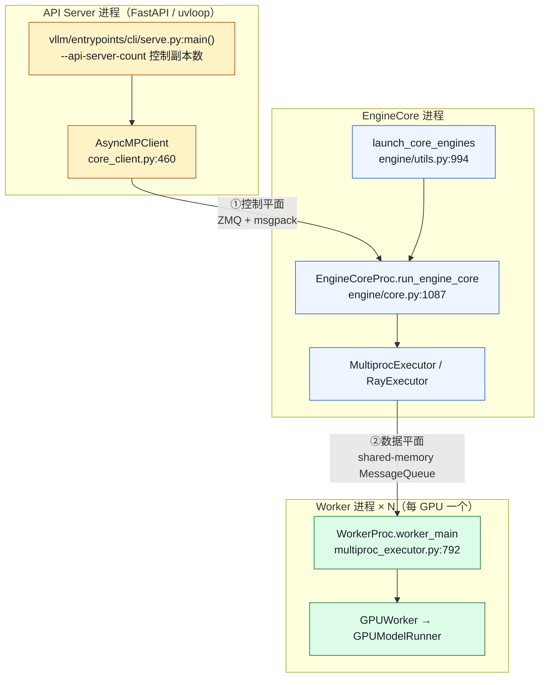
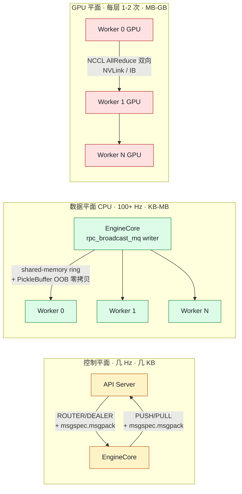

# 05. 进程模型与进程间通信内部机制

> **谁该读这一篇？** 想读 vLLM 源码 / 做生产部署调优 / 面试被追问"vLLM 进程间怎么通信"时能讲到 socket 类型与零拷贝 trick 的同学。
>
> **前置阅读：** [`02-architecture.md`](02-architecture.md) §1-2（三层进程拓扑与核心数据契约）；最好顺手扫一眼 [`04-project-structure.md`](04-project-structure.md) §3.1 / §3.4，知道 `vllm/v1/engine/` 与 `vllm/v1/executor/` 各放什么。
>
> **耗时：** 约 25 分钟（含 §2-5 几个细节追源码）。
>
> **学完能：**
> 1. 在白板上画出"shell → API Server → EngineCore → Worker × N"的进程生成顺序，并说出每跳是 fork 还是 spawn、为什么。
> 2. 区分**控制平面**（ZMQ ROUTER/DEALER + PULL/PUSH + msgpack）与**数据平面**（shared-memory MessageQueue + PEP 574 OOB 零拷贝）的分界点。
> 3. 解释 vLLM Worker 为什么必须用进程、而不是线程；fork vs spawn 在 CUDA 上下文初始化顺序上的坑。
> 4. 把三种部署形态（Inproc / MPClient / Ray Distributed）与"单机 offline / 单机 serve / 跨机 serve"三种工作模式对上号。

这一篇是 [`02-architecture.md`](02-architecture.md) 的**深度续篇**。读完 `02` 知道 vLLM 有三层进程后，本篇回答"它们到底怎么生出来、怎么交换数据、为什么这么设计"。

---

## 1. 一图重温：进程拓扑



下面三件事：① **进程怎么 spawn 出来的**；② **控制平面**（ZMQ）；③ **数据平面**（共享内存）。

---

## 2. 进程是怎么"生"出来的

按时间顺序追：

| 顺序 | 谁来 spawn | 用什么方式 | 目标进程 | 关键代码位置 |
| --- | --- | --- | --- | --- |
| ① | shell 启动 `vllm serve <model>` | OS 直接 exec | **API Server 主进程** | `vllm/entrypoints/cli/serve.py:main` → `api_server.py:run_server` |
| ② | API Server 进程内的 client 构造 | `multiprocessing.Process(target=EngineCoreProc.run_engine_core)` | **EngineCore 子进程** | `vllm/v1/engine/utils.py:144` 起 `context.Process(...)`、line 189 `proc.start()` |
| ③ | EngineCore 进程内 `Executor._init_executor` | `multiprocessing.Process(target=WorkerProc.worker_main, daemon=True)` × N | **Worker 子进程** × N | `vllm/v1/executor/multiproc_executor.py:676`、line 687 `proc.start()` |

每个 Worker 进程在自己进程里 `torch.cuda.set_device(local_rank)` 绑一张 GPU，然后通过 NCCL 加入 TP 通信组。换句话说：

- **每张 GPU = 1 个 Worker 进程**（不是线程，更不是 CUDA stream）
- **EngineCore 进程只有 1 个**（DP 模式下每个 DP rank 一个）
- **API Server 进程可以多个**（`--api-server-count`，DP 时默认与 DP rank 数对齐做前端 LB）

### 2.1 为什么用进程而不是线程？

三条硬约束：

1. **Python GIL**：CPython 单进程同一时刻只能有一个线程在跑 Python bytecode。Scheduler、Sampler 这些 CPU heavy 的 Python 代码用多线程并行不了。
2. **CUDA context 隔离**：每个进程独立持有 CUDA context、显存池、stream。多线程共享 context 容易踩 OOM 重入或同步原语 bug。
3. **故障域**：Worker 进程崩了不污染 EngineCore，进程级清理远比线程级稳妥。

### 2.2 fork 还是 spawn？

由 `get_mp_context()` 决定（`vllm/utils/system_utils.py`）：

- **Linux 默认 fork**：快，子进程共享父进程内存视图（COW）。坑：CUDA 上下文不能在父进程初始化后再 fork
- **macOS / Windows / spawn**：起一个干净的 Python，重新加载所有模块。慢但安全

vLLM 启动顺序刻意安排成"先 fork 进程，再 init CUDA"，正是为兼容 fork。

---

## 3. 三种部署形态对照

```mermaid
flowchart TB
    subgraph A["形态 A · Inproc（离线 LLM, 默认）"]
        A1["Python 主进程<br/>LLM(...) → InprocClient<br/>core_client.py:274"]
        A2["EngineCore 同进程内嵌"]
        A3["Worker 子进程 × N<br/>(MultiprocExecutor 仍 fork)"]
        A1 --- A2 --> A3
    end
    subgraph B["形态 B · MPClient（vllm serve, 默认）"]
        B1["API Server 进程"]
        B2["EngineCore 子进程<br/>(launch_core_engines 拉起)"]
        B3["Worker 子进程 × N"]
        B1 -- ZMQ --> B2 -- 共享内存 --> B3
    end
    subgraph C["形态 C · Ray Distributed（跨机器）"]
        C1["API Server 进程"]
        C2["EngineCore 子进程"]
        C3["Ray Worker actor × N<br/>(可跨节点)"]
        C1 -- ZMQ --> C2 -- Ray RPC --> C3
    end

    classDef a fill:#fef3c7,stroke:#b45309,color:#1a1f29;
    classDef b fill:#eff5ff,stroke:#2563eb,color:#1a1f29;
    classDef c fill:#dcfce7,stroke:#15803d,color:#1a1f29;
    class A1,A2,A3 a;
    class B1,B2,B3 b;
    class C1,C2,C3 c;
```



| 形态 | client 类 | EngineCore | Worker |
| --- | --- | --- | --- |
| A · Inproc | `InprocClient`（`core_client.py:274`） | 不 fork，跟 LLM 同进程 | 仍 fork（除非 TP=1 单卡） |
| B · MPClient | `AsyncMPClient` / `SyncMPClient` | 由 `launch_core_engines` fork | `MultiprocExecutor` fork |
| C · Ray | 同 B，但 Executor 换成 `RayDistributedExecutor` | 同 B | Ray actor，可跨机器 |

`LLM("model").generate(...)` 默认进入形态 A；`vllm serve ...` 默认形态 B；显式 `--distributed-executor-backend=ray` 或 PP 跨机才进入形态 C。

---

## 4. 控制平面：API Server ↔ EngineCore（ZMQ + msgpack）

**频率**：每个 HTTP 请求触发 1 次 enqueue + 流式回传若干 token。控制平面节奏，吞吐够用即可。

### 4.1 Socket 类型

`vllm/v1/engine/core_client.py:511` 起，`MPClient.__init__` 同时建两条 socket：

```python
# client（API Server）侧
self.input_socket  = make_zmq_socket(self.ctx, input_address,  zmq.ROUTER, bind=True)  # line 511
self.output_socket = make_zmq_socket(self.ctx, output_address, zmq.PULL)               # line 519
```

| 方向 | client（API）侧 | engine 侧 | 为什么这样配 |
| --- | --- | --- | --- |
| API → Engine（请求下发） | `ROUTER`（bind） | `DEALER`（connect） | 多 API server 副本时 ROUTER 能区分对端 |
| Engine → API（输出回传） | `PULL`（connect） | `PUSH`（bind） | 多个 Engine（DP）可以 push 给同一个 PULL，天然多路收单 |

### 4.2 Socket 端点：IPC 还是 TCP

`vllm/utils/network_utils.py` 统一封装：

| 行号 | 内容 |
| --- | --- |
| `network_utils.py:143` | `return f"ipc://{base_rpc_path}/{uuid4()}"` —— 单机默认 Unix domain socket |
| `network_utils.py:136-138` | `return f"tcp://{ip}:{port}"` —— 跨机退化到 TCP |
| `network_utils.py:284` | `def make_zmq_socket(...)` —— 统一工厂 |

IPC 省一次内核协议栈，单机延迟亚毫秒级。

### 4.3 序列化：msgspec.msgpack

```python
# vllm/v1/engine/core_client.py:18
import msgspec.msgpack

# line 673：启动握手
response = msgspec.msgpack.decode(payload, type=EngineCoreReadyResponse)

# line 1217 / 1249 / 1261 / 1306 / 1625 / 1683：各种控制消息
decoded   = msgspec.msgpack.decode(buf)
scale_msg = msgspec.msgpack.encode(...)
```

更完整的请求 / 输出编解码用 `vllm/v1/serial_utils.py:136 MsgpackEncoder`：

```python
class MsgpackEncoder:
    def __init__(self, ...):
        self.encoder = msgpack.Encoder(enc_hook=self.enc_hook)   # line 156
    def encode(self, obj) -> Sequence[bytestr]:
        bufs[0] = self.encoder.encode(obj)                       # line 171
        ...
```

**为什么 msgspec 而不是 pickle / protobuf？**

- 比 pickle **快 5-10 ×、安全**（不能反序列化任意代码）
- 比 protobuf **零 schema**（不用维护 `.proto`）
- msgspec 的 C 实现对 `dataclass` 几乎零成本
- 对几 KB 的控制消息完全够用

---

## 5. 数据平面：EngineCore ↔ Worker（shared-memory MessageQueue）

**频率**：每个推理 step 走一次（大 batch 下 100+ Hz）。完全不能用 ZMQ。

### 5.1 核心类：MessageQueue + ShmRingBuffer

`vllm/distributed/device_communicators/shm_broadcast.py:358` 的 `MessageQueue` 底层是基于 `multiprocessing.shared_memory.SharedMemory` 的环形缓冲区：

| 行号 | 角色 |
| --- | --- |
| `shm_broadcast.py:209` | `class ShmRingBuffer` —— 共享内存环形缓冲区 |
| `shm_broadcast.py:279` | `self.shared_memory = shared_memory.SharedMemory(...)` —— writer 端创建段 |
| `shm_broadcast.py:297` | worker 端 `shared_memory.SharedMemory(name=name)` —— attach 同一段 |
| `shm_broadcast.py:358` | `class MessageQueue` —— 一写多读的发布订阅封装 |

### 5.2 EngineCore 端 / Worker 端 attach

EngineCore 端（`vllm/v1/executor/multiproc_executor.py:150`）：

```python
self.rpc_broadcast_mq = MessageQueue(           # line 150
    self.world_size, self.local_world_size,
    max_chunk_bytes=max_chunk_bytes,
    connect_ip=mq_connect_ip,
)
scheduler_output_handle = self.rpc_broadcast_mq.export_handle()  # line 156
```

Worker 端（`multiproc_executor.py:551`）：

```python
self.rpc_broadcast_mq = MessageQueue.create_from_handle(  # line 551
    rpc_broadcast_mq_handle, rank
)
```

每步 forward 前广播：

```python
# multiproc_executor.py:373
self.rpc_broadcast_mq.enqueue((send_method, args, kwargs, output_rank))
```

各 worker 在 busy loop 里 `mq.dequeue(...)`，跑完通过 `response_mqs[rank].enqueue(...)` 回结果（`:386` 反向 dequeue）。

### 5.3 关键 trick：PEP 574 OOB 零拷贝

`shm_broadcast.py:720 enqueue`：

```python
def enqueue(self, obj, timeout=None):
    ...
    def oob_callback(buf: PickleBuffer) -> bool:
        raw_buf = buf.raw()
        if len(raw_buf) < 1024 * 1024:     # < 1 MiB 内联
            return True                     # line 730
        all_buffers.append(raw_buf)         # ≥ 1 MiB 走 OOB
        return False                        # line 734

    all_buffers[0] = pickle.dumps(
        obj, protocol=pickle.HIGHEST_PROTOCOL,
        buffer_callback=oob_callback,       # line 737
    )
    with self.acquire_write(timeout) as buf:           # line 749
        for buffer in all_buffers:
            buf[offset:...] = buffer                   # line 758 直接写共享内存
    self._spin_condition.notify()                      # line 760
```

配合 `pickle.HIGHEST_PROTOCOL` 的 **PickleBuffer**（[PEP 574](https://peps.python.org/pep-0574/)）特性——大 tensor / numpy 数组**不被 pickle 复制**，指针塞进 OOB buffer 列表，**零拷贝**写入共享内存。dequeue 端 `pickle.loads(buffers=...)`（`shm_broadcast.py:783`）直接拿到内存视图，同样零拷贝。

---

## 6. GPU 间通信：Worker ↔ Worker（NCCL）

Worker 内部跑 TP forward 时需要每层 AllReduce、AllGather 等集合通信。这不走 IPC，而是 GPU-to-GPU 的硬件层：

| 拓扑 | 协议 | 带宽（H100 量级） |
| --- | --- | --- |
| 同机 NVLink | NCCL over NVSwitch | 900 GB/s |
| 跨机 InfiniBand / RoCE | NCCL over IB Verbs | 400 Gbps |
| 跨机 Ethernet | NCCL over Sockets | 25-100 Gbps（慢一个量级） |

NCCL 通信组初始化：`vllm/distributed/parallel_state.py`。具体 AllReduce 怎么插入到每层 forward 见 `05-distributed/01-tp-pp-ep.md`。

---

## 7. 一图总结：三条通信路径的取舍



**关键数字对照**：

| 维度 | 控制平面（ZMQ + msgpack） | 数据平面（shared-memory） | GPU 平面（NCCL） |
| --- | --- | --- | --- |
| 频率 | 每请求 1-N 次（API 节奏） | 每 step 1 次（100+ Hz） | 每层 forward 1-2 次（kHz） |
| 消息大小 | 几 KB | 10s KB ~ MB | MB ~ GB |
| 序列化代价 | μs 级（msgpack） | 几乎零（指针 + memcpy） | 零（已在 GPU 显存） |
| 跨机器 | 自动退化到 TCP | 跨机不可用 | NCCL over IB / Ethernet |
| 容错 | client 重连即可 | writer 崩 = 整组阻塞 | 任一卡崩 = 整组崩 |

如果数据平面也用 ZMQ：每秒上百次 KB-MB 级 IPC + msgpack 编解码会吃 5-15% CPU；大 batch 下 SchedulerOutput 含的 GPU tensor 还要序列化。shared-memory + OOB 零拷贝完全规避这两条。

---

## 8. 一个具体例子：`vllm serve Llama-3-70B --tensor-parallel-size 8`

跑起来后 `ps -ef | grep vllm` 看到的进程：

```
1 主进程       vllm serve  ...                   ← API Server (FastAPI/uvloop)
└─ 1 子进程    EngineCore                          ← Scheduler + MultiprocExecutor
   ├─ 1 子进程  VllmWorker-0  (CUDA_VISIBLE_DEVICES=0)
   ├─ 1 子进程  VllmWorker-1  (CUDA_VISIBLE_DEVICES=1)
   ├─ ...
   └─ 1 子进程  VllmWorker-7  (CUDA_VISIBLE_DEVICES=7)
```

共 **1 + 1 + 8 = 10 个进程**。8 个 worker 用 NCCL 形成同一个 TP=8 通信组。

开 DP=2 时进程数翻倍 + 多一个 coordinator：

```
1 主进程       vllm serve  ...
├─ 1 子进程    EngineCore_DP0
│   └─ × 8 Worker
├─ 1 子进程    EngineCore_DP1
│   └─ × 8 Worker
└─ 1 子进程    DPCoordinator                       ← 跨 DP 协调
```

---

## 9. 非显然的工程结论

- **API Server 是无状态的**——本质是 ZMQ client，崩了只丢正在排队的 HTTP 连接，不影响 EngineCore 里的 KV cache。生产用 `--api-server-count > 1` 多副本 + LB 即可水平扩。
- **EngineCore 是有状态单点**——`Scheduler.running`、`BlockPool` 都活在它进程内。崩了等同于该实例所有 in-flight 请求丢失。K8s 里 `EngineCore + Worker` 必须用 `LeaderWorkerSet` 整组重启。
- **Worker 之间对等，但只有 rank 0 是 driver**——`is_driver_worker=True`（`multiproc_executor.py:644` 参数）的那个负责收 Scheduler 输出并广播给其余 worker，其余是 NCCL 同步执行者。
- **进程粒度的资源隔离**：每个 Worker 进程独立持有显存、CUDA stream、CUDA Graph capture buffer。这就是为什么 LLM 部署要避免 sidecar、避免共卡——一旦同卡再起别的 GPU 进程，Worker 的显存测量与 Graph 都可能错乱。
- **shared-memory 不能跨机器**——所以跨节点 PP / EP 必须改走 Ray actor（形态 C）或 NCCL。控制平面的 ZMQ 跨机自动降 TCP，但数据平面没这条退路。

---

## 10. 代码索引（贴墙速查）

| 用途 | 文件 : 行 |
| --- | --- |
| **进程 spawn** | |
| API Server 入口 | `vllm/entrypoints/cli/serve.py:main` → `entrypoints/openai/api_server.py:run_server` |
| EngineCore 入口（子进程） | `vllm/v1/engine/core.py:1087 run_engine_core` |
| EngineCore spawn 点 | `vllm/v1/engine/utils.py:144,189` |
| Worker 入口（子进程） | `vllm/v1/executor/multiproc_executor.py:792 worker_main` |
| Worker spawn 点 | `multiproc_executor.py:644,676,687` |
| Inproc 客户端 | `vllm/v1/engine/core_client.py:274 InprocClient` |
| MP 客户端基类 | `vllm/v1/engine/core_client.py:460 MPClient` |
| **控制平面（ZMQ + msgpack）** | |
| ROUTER socket（API 入站） | `vllm/v1/engine/core_client.py:511` |
| PULL socket（API 出站） | `vllm/v1/engine/core_client.py:519` |
| `make_zmq_socket` 工厂 | `vllm/utils/network_utils.py:284` |
| IPC vs TCP endpoint 选 | `vllm/utils/network_utils.py:136-147` |
| msgspec 引入 | `vllm/v1/engine/core_client.py:18` |
| `MsgpackEncoder` | `vllm/v1/serial_utils.py:136,156,171` |
| 控制消息 encode 实例 | `core_client.py:1249,1261,1306,1625,1683` |
| **数据平面（共享内存）** | |
| `MessageQueue` 类 | `vllm/distributed/device_communicators/shm_broadcast.py:358` |
| `ShmRingBuffer` | `shm_broadcast.py:209` |
| `SharedMemory` 创建 | `shm_broadcast.py:279` |
| `SharedMemory` attach（worker 端） | `shm_broadcast.py:297` |
| `MessageQueue.enqueue` | `shm_broadcast.py:720` |
| `MessageQueue.dequeue` | `shm_broadcast.py:765` |
| OOB 零拷贝 callback | `shm_broadcast.py:726-734` |
| `rpc_broadcast_mq` 创建 | `multiproc_executor.py:150` |
| `export_handle` 传子进程 | `multiproc_executor.py:156` |
| Worker 端 `create_from_handle` | `multiproc_executor.py:551` |
| `enqueue` SchedulerOutput | `multiproc_executor.py:373` |
| `dequeue` Worker response | `multiproc_executor.py:386` |
| **GPU 平面（NCCL）** | |
| 进程组初始化 | `vllm/distributed/parallel_state.py` |
| Worker TP forward 的 AllReduce | `vllm/distributed/communication_op.py` |

---

## 小结

- vLLM 的三层进程都由**显式 spawn** 出来：shell 起 API Server，API Server 起 EngineCore，EngineCore 的 Executor 再起 N 个 Worker。每张 GPU 对应一个独立 Worker 进程（不是线程、不是 stream）。
- 用进程的三条硬约束：**Python GIL**、**CUDA context 隔离**、**故障域**。fork vs spawn 由 `get_mp_context()` 决定，启动顺序刻意安排成"先 fork 再 init CUDA"以兼容 fork。
- 控制平面 = **ZMQ ROUTER/DEALER + PULL/PUSH + msgpack**；数据平面 = **shared-memory MessageQueue + PEP 574 OOB 零拷贝**。控制小、可跨机；数据大、必须同机。
- 三种部署形态：**Inproc**（离线 LLM 默认）/ **MPClient**（`vllm serve` 默认）/ **Ray Distributed**（跨机器）；后两种共用同一套 ZMQ 控制平面。
- 工程结论："API Server 无状态、EngineCore 有状态、Worker 对等但 rank 0 是 driver"——决定了 K8s 上 EngineCore + Worker 必须 `LeaderWorkerSet` 整组重启。

## 自检

> 答案不必照搬，能讲到关键点即可。

**1. `vllm serve <model> --tensor-parallel-size 4` 启动后有几个进程？父子关系？**

```
1. vllm serve (主进程, API Server)                       ← shell exec 启动
   └── 2. EngineCore 子进程                              ← multiprocessing.Process
       ├── 3. Worker-0 子进程 (CUDA_VISIBLE_DEVICES=0)
       ├── 4. Worker-1 子进程 (CUDA_VISIBLE_DEVICES=1)
       ├── 5. Worker-2 子进程 (CUDA_VISIBLE_DEVICES=2)
       └── 6. Worker-3 子进程 (CUDA_VISIBLE_DEVICES=3)
```

总共 **6 个进程**：1 API Server + 1 EngineCore + 4 Worker。

加分点：

- 若 `--api-server-count N`，API Server 进程会有 N 个
- 若 `--data-parallel-size D`，EngineCore + Workers 整组 ×D
- 若用 Ray executor，Worker 是 Ray actor 而非本地子进程

---

**2. `multiprocessing.Process(daemon=True)` 与 CUDA fork 冲突，vLLM 怎么绕？**

**冲突原因**：

- `daemon=True` 进程会随父进程退出强制 kill，不允许有子进程
- `fork` 启动方式在子进程里复制父进程的 CUDA context，**CUDA context 不支持 fork after init**——父进程已经 `torch.cuda.init()`、子进程一摸 GPU 就 crash 或死锁
- 三者撞在一起：daemon Worker 不能再 fork 出 helper、CUDA 又禁 fork

**vLLM 的解法**：

1. **强制 spawn 启动方式**：`multiprocessing.get_context("spawn")`，spawn 不复制 CUDA context，子进程从干净状态启动后自己 `cuda.init()`
2. **顺序控制**：API Server 进程**绝不**触 CUDA（只做 HTTP / tokenize / ZMQ）；EngineCore 进程在 spawn 出 Worker 后才允许触 GPU；Worker 进程一启动立即绑 device
3. **Worker 用 `daemon=False`**：Worker 内部还要起辅助线程（NCCL watchdog 等），不能 daemon

源码：`vllm/utils/__init__.py` 里的 `get_mp_context()`、`vllm/v1/executor/multiproc_executor.py` 起 Worker 时的 spawn 配置。

---

**3. SchedulerOutput 从 EngineCore 到 Worker 完整链路。**

```python
# EngineCore 进程（writer 端）
scheduler_output = scheduler.schedule()
# ① Python 对象 → msgpack bytes（msgspec 编码）
serialized = msgspec.msgpack.encode(scheduler_output)
# ② 同时把 tensor / numpy array 用 PickleBuffer 包成 OOB
#    OOB buffer 不进 msgpack 主流，单独走 shared memory
oob_buffers = [PickleBuffer(t.numpy()) for t in scheduler_output.tensors]
# ③ 写入共享内存 ring
shm_message_queue.put(serialized, oob_buffers=oob_buffers)
       ↓
[共享内存 ring buffer（mmap 文件 + spinlock）]
       ↓
# 每个 Worker 进程（reader 端）
serialized, oob_buffers = shm_message_queue.get()
# ④ 用同一个 msgspec schema 反序列化
scheduler_output = msgspec.msgpack.decode(serialized, type=SchedulerOutput)
# ⑤ OOB buffer 内存是共享的（mmap 同一段），不需要拷贝
#    直接 torch.from_numpy(np.frombuffer(oob_buffer)) 包成 tensor
```

**关键点**：

- 编码器 / 解码器：`msgspec.msgpack` —— 用 schema 加速，比 vanilla pickle 快 5-10×
- 主流序列化（控制字段）：~ μs 级
- OOB（大 tensor）：**零拷贝**——writer 写 mmap 段，reader 直接读，物理上同一份内存

---

**4. PEP 574 PickleBuffer + OOB 是什么？省多少次拷贝？**

**PEP 574** 是 Python 3.8 引入的 pickle 协议 5：支持"out-of-band buffer"——大对象（如 numpy / tensor）的内存不嵌入 pickle 主流，而是作为旁路 buffer 单独传输。

**常规 pickle 链路**（4 次拷贝）：

```
tensor.numpy() → bytes (拷贝 1)
                 → 嵌入 pickle byte stream (拷贝 2)
                 → 写入 socket / pipe (拷贝 3)
reader 读出  → 反序列化拷贝出来 (拷贝 4)
```

**PickleBuffer + OOB 链路**（0 次拷贝）：

```
tensor.numpy() 的底层 buffer 直接被 PickleBuffer 引用
writer 写共享内存 mmap 段（OOB 通过 mmap 共享，不 memcpy）
reader 直接对 mmap 段做 np.frombuffer + torch.from_numpy（不 memcpy）
```

**实际节省**：每个 SchedulerOutput 含的 `input_token_ids` / `positions` / `block_tables` 等 tensor 加起来 KB-MB 级，每 step 100+ Hz，**省的不是拷贝时间而是 CPU 带宽**。在 8 卡 TP 上 broadcast 同一个对象给所有 Worker，OOB 让"writer 一次写、N 个 reader 同时读"成本平摊到 O(1)，而不是 O(N)。

---

**5. 跨机器部署时 ZMQ 与共享内存怎么变？**

**控制平面 ZMQ endpoint**：

- 单机：`ipc:///tmp/vllm_xxx`（Unix domain socket，最快）
- 跨机：`tcp://<host>:<port>`（TCP，会经网卡但 ZMQ 协议透明切换）

→ 应用层代码无需改，只是 endpoint 字符串换形式。

**数据平面共享内存**：

- 跨机器**不能用**（mmap 是单机文件系统的概念）
- 替换方案：
  1. **RPC over TCP**（Ray executor 走这条路，性能损失 5-10%）
  2. **RDMA**（高性能集群）
  3. **NCCL P2P**（Worker 之间已有的 NCCL 通信可以借用）

跨机部署的现实做法：**API Server 与 EngineCore 同机 / 不同机都可（走 ZMQ TCP）；EngineCore 与 Worker 必须同机 / 同一 NUMA node**——shared memory 强约束。

跨节点的多 Worker 通过 NCCL（不是 shared memory）通信，这就是为什么 TP > 单机卡数 + 多机部署强烈推荐改用 PP（PP 只需 P2P send/recv，跨机器友好）。

---

**6. 一张 GPU OOM，整组进程怎么级联？K8s 怎么配？**

**级联反应**：

1. Worker N OOM → 该 Worker 进程崩溃
2. 其他 Worker 在下一次 NCCL collective（AllReduce）时**永远 hang**——NCCL 是 collective，缺一个 rank 就死锁
3. EngineCore 检测到 Worker 进程死了 → 主动 abort 整组 Worker
4. EngineCore 进程退出
5. API Server 进程的 ZMQ 检测到 EngineCore 断了 → 拒绝新请求 + 退出
6. 全组 1+1+N 个进程**全死**

→ 这就是 §9 说的 **"故障域 = 整组"**。无法只重启一个 Worker（NCCL 通信组无法 dynamic add member）。

**K8s 配置**：

- **`LeaderWorkerSet`**（KubeRay 等提供的 CRD）：把 API+Engine+Workers 当成一个 atomic unit，任一进程退出就重启整组
- 不能用 `Deployment` + 单 pod 部署（默认行为是按 pod 重启，无法保证整组同步）
- 不能用 `StatefulSet` 分 pod（NCCL group 需要进程同时启动）

具体配置：见 [`08-production-deployment/06-reliability-and-failure-modes.md`](../08-production-deployment/06-reliability-and-failure-modes.md) §3。

## 下一步

- 回到 [`02-architecture.md`](02-architecture.md)（带着进程细节再看一遍高层架构，会发现很多之前没看懂的字段都有了归属）。
- 进入源码深读：[`03-code-walkthrough/01-entry-points.md`](../03-code-walkthrough/01-entry-points.md)（`LLMEngine.add_request` → `step()` 的完整调用链）。
- 想看 GPU 平面通信：[`05-distributed/01-tp-pp-ep.md`](../05-distributed/01-tp-pp-ep.md)（本节只涵盖 CPU 进程间，TP/PP 的 NCCL AllReduce 在这里）。
- 想从生产视角理解：[`08-production-deployment/01-deployment-architectures.md`](../08-production-deployment/01-deployment-architectures.md)（这套进程模型在 K8s 上的 Pod 划分与 LWS 部署形态）。
- 想看源码：`vllm/v1/engine/core_client.py:460` (`MPClient`)、`vllm/distributed/device_communicators/shm_broadcast.py:358` (`MessageQueue`)、`vllm/v1/executor/multiproc_executor.py:792` (`worker_main`)。
