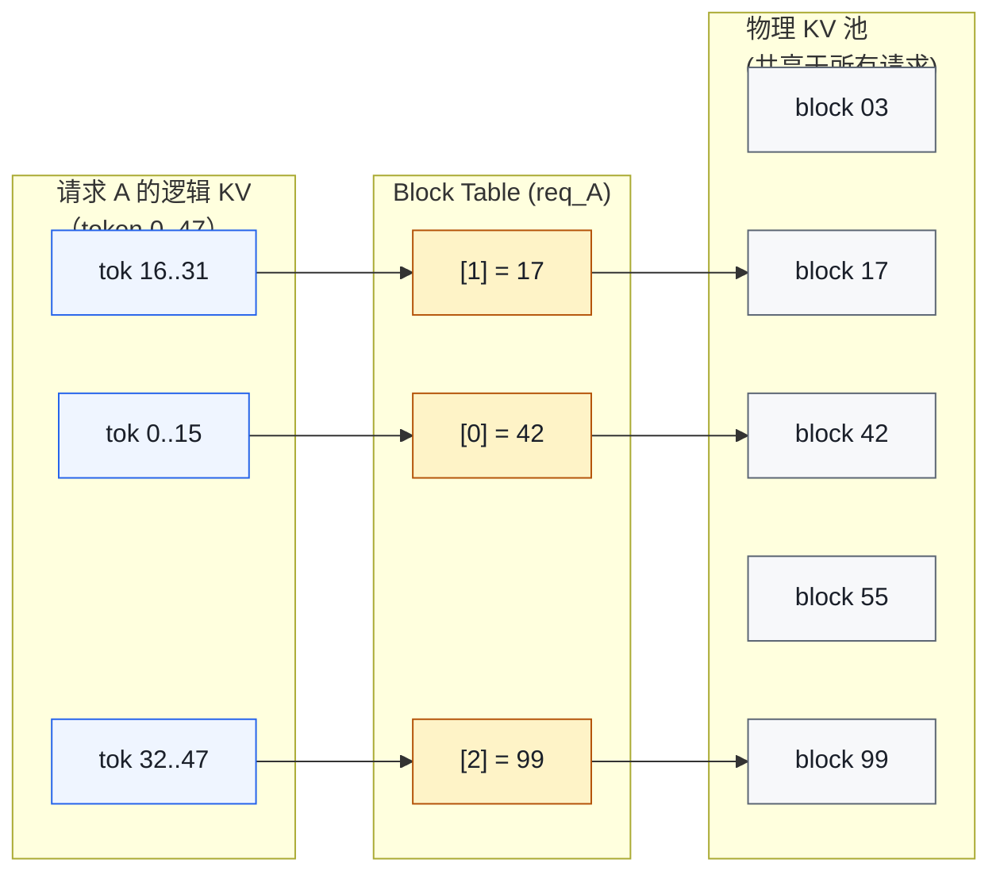
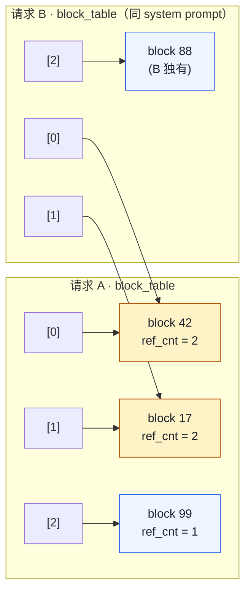

# 01. PagedAttention 详解

> **谁该读这一篇？** 想用一个概念把 vLLM 的核心创新讲透的同学；面试前必须把 PagedAttention 与 OS 虚拟内存类比建得起来的候选人。
>
> **前置阅读：** [`01-overview/00-prerequisites.md`](../01-overview/00-prerequisites.md) §4 KV cache、§6 GPU 内存层级；以及 [`01-overview/01-what-is-vllm.md`](../01-overview/01-what-is-vllm.md)（三大瓶颈的第一条）。
>
> **耗时：** 约 18 分钟。
>
> **学完能：**
> 1. 在白板画出"OS 虚拟内存 ↔ PagedAttention"对照表（页 / 页表 / COW / 缺页）。
> 2. 算清 `block_size=16` 的取舍，并能解释为什么不取 1 或 128。
> 3. 描述一个请求从 prefill 到 decode 在 BlockPool / BlockTable 上的 KV 分配序列。
> 4. 给面试官讲清"PagedAttention 跟 FlashAttention 是什么关系" / "PagedAttention vs RadixAttention 的区别"。

vLLM 的心脏。如果只能讲清一个概念，必须是它。面试 90% 的概率会被问到。

---

## 1. 类比：从操作系统虚拟内存说起

OS 解决进程内存碎片的办法：

- 物理内存切成 page（页，比如 4 KB 一个）
- 进程看到的是虚拟地址空间，连续
- 通过页表把虚拟页映射到物理页
- 物理页可以不连续
- 进程之间可以共享同一物理页（如 fork 后的 copy-on-write）

PagedAttention 完整复刻这套：

| OS 概念 | PagedAttention 对应 |
| --- | --- |
| 物理页 (Page) | KV block（默认 16 个 token 的 K+V） |
| 虚拟地址空间 | 请求看到的"逻辑 KV cache" |
| 页表 | Block Table（每个请求一张） |
| 页错误 | 没有 block 可分时触发抢占（preempt） |
| 共享页 (CoW) | Prefix caching（共享前缀的 block） |
| 页大小 | `block_size`（默认 16，可调） |

---

## 2. 朴素 KV cache 的问题

设：模型 hidden_size=4096、num_layers=32、FP16。
一个 token 的 KV 占用：`2 (K,V) × 4096 × 2 (FP16) × 32 = 524 KB`。

服务一个 `max_seq_len=4096` 的请求 → 预留 **2 GB**。

10 个并发请求、每个实际只用 200 token：

| 项目 | 大小 |
| --- | --- |
| 预留 | 10 × 2 GB = **20 GB** |
| 实际用量 | 10 × 200 × 524 KB ≈ **1 GB** |
| 浪费 | **19 GB** |

PagedAttention 论文图 4 报告的有效利用率只有 20-38%——剩下的全在内/外部碎片里耗掉。

---

## 3. 存储布局：物理 block + Block Table

物理 KV cache 在显存里是一个大张量。每种 attention 后端布局略不同；FlashAttention 后端的形状是：

```
key_cache:   [num_blocks, block_size, num_kv_heads, head_size]
value_cache: [num_blocks, block_size, num_kv_heads, head_size]
```

`num_blocks` 是显存能装下的最大物理 block 数。每个请求持有一张 block table 把逻辑位置映射到物理 block：



关键性质：

- 物理 block 无需相邻 → **外部碎片 = 0**
- 同一个物理 block 可以挂在多个请求的 block table 下 → **跨请求共享**
- 增长一个 block 是 O(1)（追加一个 entry），不需要搬数据

---

## 4. 计算流程

数学公式还是经典的：

$$\text{out} = \text{softmax}\!\left(\frac{Q K^{\top}}{\sqrt{d}}\right) V$$

K、V 不再是连续张量，要通过 block table 间接访问。

**Prefill 阶段**（一次喂 N 个 token，N > 1）：

1. 算 N 个 token 的 Q、K、V
2. 按顺序把 K、V 写入 block_table 指向的物理 block
3. 跑标准 attention（FlashAttention 或 paged kernel）

**Decode 阶段**（每步只 1 个新 token）：

1. 算这个新 token 的 q、k、v
2. 追加写到最后一个 block 的下一格
3. 算 `q · K^T` 时，按 block_table 逐 block 加载历史 K 做 dot product

decode kernel 的循环骨架（伪代码）：

```cuda
// PagedAttention decode kernel
for block_idx in block_table[req_id]:
    K_block = key_cache[block_idx]           // 一次 indirect read
    partial = softmax(q @ K_block.T) @ value_cache[block_idx]
    accumulate(partial)
```

实际代码：`csrc/attention/paged_attention_v1.cu`、`paged_attention_v2.cu`（v2 用 split-K 并行长序列）。

---

## 5. block_size 为什么默认 16

- 太小：每个 block 一次 indirection，block_table 变长，访存开销线性放大
- 太大：内部碎片回归（每个请求最多浪费 `block_size - 1` 个 token 的槽位）

16 是工程经验：

- 配合 FlashAttention 的 tile size 友好
- 配合 RoPE / GQA 的 head_dim 友好
- 内部碎片影响 < 2%

可通过 `--block-size 8/16/32` 调整。

---

## 6. 共享：Copy-on-Write 的应用

PagedAttention 的另一个能力是**跨请求 / 跨候选共享 block**。



三种用法：

| 场景 | 行为 |
| --- | --- |
| **Prefix caching** | 两个请求同 system prompt，前缀 block `ref_cnt = 2`，最后一个引用消失才回收 |
| **Beam search**（beam=4） | 4 条候选可能共享前缀，到分歧点 fork：共享时 `ref_cnt++`，分歧时 copy-on-write |
| **Parallel sampling**（n=4） | prompt 段 4 个候选共享 block，generation 段各自独立 |

---

## 7. 代码地标

| 概念 | 文件 | 关键类 / 函数 |
| --- | --- | --- |
| KV cache 张量分配 | `vllm/v1/worker/gpu_worker.py` | `initialize_cache` |
| Block Pool（空闲池） | `vllm/v1/core/block_pool.py` | `BlockPool` |
| Block hash（前缀复用） | `vllm/v1/core/kv_cache_utils.py` | `hash_request_tokens` |
| KVCacheManager | `vllm/v1/core/kv_cache_manager.py` | `allocate_slots()` |
| Block Table（GPU 侧） | `vllm/v1/worker/block_table.py` | `BlockTable` |
| PagedAttn Python API | `vllm/v1/attention/backends/flash_attn.py` 等 | — |
| PagedAttn CUDA | `csrc/attention/` | `paged_attention_v1/v2_kernel` |

---

## 8. 推荐的源码阅读路径

吃透 PagedAttention 的顺序：

1. **`vllm/v1/core/block_pool.py`**
   - `BlockPool.__init__`：物理 block 池怎么初始化
   - `get_new_blocks` / `free_blocks`：分配 / 释放
2. **`vllm/v1/core/kv_cache_manager.py`**
   - `allocate_slots(request, num_new_tokens)`：核心逻辑（算需要几个 block、查 prefix cache、不够就 preempt）
3. **`vllm/v1/worker/block_table.py`**
   - `BlockTable`：在 GPU 上维护 block_id 序列；调度器算好的逻辑 → GPU tensor
4. **`vllm/v1/attention/backends/flash_attn.py`**
   - 实际 attention 调用；看它怎么把 block_table 传给 CUDA kernel
5. **`csrc/attention/paged_attention_v1.cu`**
   - 真正的 GPU 内核（想看 CUDA 实现的话）

---

## 9. 论文 vs 当前实现

读 PagedAttention 论文容易以为 vLLM 自己写了 attention kernel。实际现状：

- 2023 论文版：vLLM 自己的 `paged_attention_v1/v2.cu`
- 2024 之后：默认走 **FlashAttention v2/v3** 或 **FlashInfer**，它们原生支持 paged KV（接受 `block_table` 参数）
- vLLM 自己的 paged kernel 只在没有 FlashAttn 时 fallback

被问"vLLM 的 attention kernel 你看过吗"，可以这样答：

> "vLLM 现在主用 FlashAttention 和 FlashInfer 的 paged 版本，它们都接受 `block_table` 作为参数。vLLM 自己也写了 `paged_attention_v1/v2.cu` 作为 fallback，v2 用 split-K 来并行长序列。"

---

## 10. 面试常见追问

**Q: PagedAttention 会不会比连续 KV 慢？**
A: 会，但很少。每个 block 一次 indirect lookup，`block_size=16` 摊薄了开销。论文实测 attention 慢 ~20%，但整体吞吐提升 24×，总账净赚。

**Q: block_table 怎么传到 GPU？**
A: Scheduler 在 CPU 维护逻辑 block_id 列表；每步开始时 `InputBatch` 把所有 active 请求的 block_table 打包成一个 GPU tensor 一次性 copy，避免逐请求小拷贝。

**Q: 100k token 的请求 block_table 不会很长吗？**
A: `100000 / 16 = 6250` entries × int32 ≈ 25 KB，完全可控。访问 block_table 本身不是瓶颈。

**Q: PagedAttention 与 RadixAttention（SGLang）的区别？**
A: PagedAttention 是**线性 block 序列**，每个请求一张表。RadixAttention 把所有请求的前缀组织成 **trie/radix tree**，前缀复用更激进（任意公共前缀都能自动发现，不只是 system prompt）。代价是树维护更复杂、写时拷贝更频繁。

---

## 小结

- PagedAttention = **把 KV cache 当 OS 物理页管**：定长 block + 每请求一张 BlockTable + 物理 block 池 + refcount + COW + LRU 复用。每条性质都能在 OS 教材里找到原型。
- 默认 `block_size=16` 是工程取舍——太小 indirection 多、太大内部碎片回归；可通过 `--block-size 8/16/32` 调。
- "PagedAttention 论文"讲的是思想，**当前代码主要走 FlashAttention v2/v3 / FlashInfer 的 paged 版本**，自家 `paged_attention_v1/v2.cu` 只是 fallback。
- 共享语义有三种用法：跨请求 prefix caching、beam search、parallel sampling——本质都是 `ref_cnt` 的加减游戏。
- 它跟 RadixAttention 是"线性 block 序列" vs "trie / radix 树"的区别——前者实现简单稳定，后者前缀复用更激进。

## 自检

> 答案不必照搬，能讲到关键点即可。

**1. OS 虚拟内存 vs PagedAttention 6 行对照表。**

| OS | PagedAttention | vLLM 类 / 字段 |
| --- | --- | --- |
| 物理页 (Page) | KV block（默认 16 token 的 K+V） | `KVCacheBlock`（`block_pool.py`）|
| 页表 (Page Table) | Block Table | `block_table : list[int]` 每请求一份 |
| 进程地址空间 | 请求的逻辑 token 序列 | `Request.token_ids` |
| 物理内存池 | GPU HBM 上预分配的 block 池 | `BlockPool` 的 free queue（LRU 双链表）|
| 缺页（请求新页）| `get_new_blocks` 时 ref_cnt++ | `KVCacheManager.allocate_slots` |
| 释放 / swap | 请求完成 / preempt 时 ref_cnt 归零 → 回 free queue | `_free_request_blocks` / preempt 流程 |
| COW（写时复制）| Beam search / prefix 共享 → 分歧时 copy | block ref_cnt > 1 时 split |

加分：再讲清 **LRU 淘汰**（OS swap victim ↔ prefix cache evict 冷 block）。

---

**2. block_size=16, hidden=4096, num_layers=32, FP16, 100k token 请求的 BlockTable / KV 占多少？**

**BlockTable**（每请求一张）：

- 需要的 block 数 = ⌈100000 / 16⌉ = 6250 个
- 每条 entry 是个 int32（physical_block_id）= 4 字节
- BlockTable 大小 = 6250 × 4 = **25 KB**

**物理 KV**：

- 单 token 单层 KV = 2 (K+V) × hidden × dtype_bytes = 2 × 4096 × 2 = 16 KB
- 32 层一个 token = 16 KB × 32 = 512 KB
- 100k token = 512 KB × 100000 = **48.8 GB**

→ BlockTable 比 KV 小 200 万倍。BlockTable indirection 的内存开销可以忽略，**真正的内存大头是物理 KV**。

**敏感性**：如果开 GQA（8 KV head 而非 32），KV 缩到 12.2 GB（1/4）；MLA 进一步缩到 ~6 GB（约 1/8）。

---

**3. `get_new_blocks` 与 `free_blocks` 各做什么 ref_cnt 修改？**

源码：`vllm/v1/core/block_pool.py`

- **`get_new_blocks(num_blocks)`**：
  ```python
  for _ in range(num_blocks):
      block = free_queue.popleft()      # 从 free queue 头取（LRU 顺序）
      block.ref_cnt = 1                 # 新分配的归属新请求，ref_cnt = 1
      yield block
  ```
- **`free_blocks(blocks)`**（请求结束 / preempt）：
  ```python
  for block in blocks:
      block.ref_cnt -= 1
      if block.ref_cnt == 0:
          free_queue.append(block)      # 回到 free queue 尾（LRU 尾，最近释放的最后被复用）
  ```

**ref_cnt > 1 的情况**：prefix caching 命中时 `_get_cached_block()` 给 hash 命中的 block ref_cnt++（多请求共享）。Beam search / parallel sampling 同理。这就是为什么不是 ref_cnt = 0 就立即归还——共享 block 还在被用。

---

**4. PagedAttention 单步慢 ~20%，端到端为什么还能 24× 吞吐？**

**慢的来源**：每个 KV 访问要先查 block_table（间接寻址），多一层指针 chase，attention kernel 比连续 KV 的版本慢约 20%。

**赚回来的更多**：

1. **KV 利用率 20% → 96%**：同一张 H100 装下 5× 的并发请求
2. **GPU 利用率 30% → 80%+**：continuous batching 让 GPU 不空转
3. **prefix caching 净赚**：相同前缀直接复用，跳过 prefill，省的不只是 20% 而是 95%+

**算术**：单步慢 20%（× 0.8 throughput）× 并发 5×（× 5）× GPU 利用 2.5×（× 2.5）= **× 10 起步**，加上 prefix caching 等其他优化，论文给的 24× 来自 OPT-13B benchmark，realistic。

**类比**：超市收银台从"一个客人一个收银员"变成"虚拟收银号 + 任意收银台"——单笔结账可能慢 1 秒（要看号），但整个超市同时间能处理的人数翻了几倍。

---

**5. 用一段话答"vLLM 自家 paged kernel 现状"。**

> "PagedAttention **思想**是 vLLM 的核心论文贡献，但**实现**已经走过两代演化。早期（2023-2024）vLLM 自己写了 `paged_attention_v1.cu` 和 `paged_attention_v2.cu`，论文里报的 24× 主要来自这套自家 kernel。
>
> 但 FlashAttention v2/v3 / FlashInfer 后来都原生支持了 **paged + varlen** 模式——同样的 block_table 间接寻址，他们的 kernel 比 vLLM 自家版本快得多（更激进的 tiling、async memcpy、CTA scheduling）。
>
> 现在的 vLLM：**默认走 FlashAttention 或 FlashInfer 的 paged 版本**，自家 `paged_attention_v1/v2.cu` 只是在某些 GPU 不支持 FlashAttention 时 fallback。MLA 模型走 FlashMLA（DeepSeek 自家 kernel），Mamba 模型走专门的 state-space kernel。
>
> 所以面试讲 PagedAttention 时，**思想引用论文，实现要说 FlashAttention paged 版本**——不然会显得知识停留在 2023。"

## 下一步

- 下一节：[`02-continuous-batching.md`](02-continuous-batching.md)（PagedAttention 让 KV 不必连续后，调度才能做"每步重组 batch"）。
- 想看 KV 管理细节：[`03-kv-cache-management.md`](03-kv-cache-management.md)（启动时 num_blocks 怎么算、BlockPool 的 LRU 怎么工作）。
- 想看源码：`vllm/v1/core/block_pool.py`（物理 block 中央仓库）、`vllm/v1/core/kv_cache_manager.py`（Scheduler 看到的接口）、`csrc/attention/paged_attention_v1.cu`（自家 CUDA kernel）。
- 想动手：[`07-hands-on/03-mini-experiments.md`](../07-hands-on/03-mini-experiments.md)（亲手观察 BlockTable 在 prefill / decode 时的变化）。
- 想从生产视角理解：[`08-production-deployment/01-deployment-architectures.md`](../08-production-deployment/01-deployment-architectures.md)（block_size、kv-cache-dtype 在不同生产形态下怎么调）。
