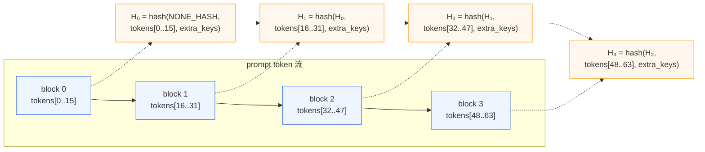

# 04. Prefix Caching 专题

> **谁该读这一篇？** 想搞清"为什么同样的 system prompt 第二次发请求会快很多"、"怎么调命中率"、"分布式 / 多模态 / LoRA 场景下 hash 怎么算"的读者。
>
> **前置阅读：** [`03-kv-cache-management.md`](03-kv-cache-management.md)（block pool + ref_cnt）；最好先扫一眼 [`01-paged-attention.md`](01-paged-attention.md)。
>
> **耗时：** 约 15 分钟。
>
> **学完能：**
> 1. 说清 vLLM block hash 是怎么算出来的（hash 函数、parent chain、extra_keys）。
> 2. 解释为什么 LoRA / 多模态 / prompt_embeds 不能直接复用纯文本的 hash。
> 3. 调出一个低命中率场景的 root cause（block_size 不对齐 / cache 容量不够 / hash 函数选错）。
> 4. 知道分布式 KV cache（CPU offload、远端 LMCache、P/D KV transfer）在哪里接入。

---

## 1. 解决什么问题

LLM 应用中存在大量"前缀重复"：

| 场景       | 重复的部分                        | 占比         |
| -------- | ---------------------------- | ---------- |
| Chatbot  | system prompt + 历史对话         | 60-90% 输入  |
| Few-shot | few-shot 示例                   | 50-95%     |
| RAG      | 多个查询用相同的 retrieval 结果模板  | 30-70%     |
| Tool use | 工具描述（function calling）        | 40-80%     |
| Batch eval | 同 prompt 不同输入             | 几乎全部     |

如果每个请求都重新算这些前缀的 KV，是巨大的浪费。

---

## 2. 直观对比：开与不开

假设 system prompt 长 1000 tokens，用户每次问 50 tokens，生成 100 tokens。

**关闭 prefix caching**：

- 每次 prefill = 1050 token
- 总 token = 1050 (prefill) + 100 (decode) = 1150
- 实际算力 ≈ prefill dominates

**开启 prefix caching**（第二次开始）：

- 每次 prefill = 50 token（前 1000 命中）
- TTFT 直接降 95%
- 吞吐提升对应倍数

---

## 3. 启用方式

V1 中 prefix caching **默认开启**。命令行：

```
vllm serve <model> [--no-enable-prefix-caching]   # 关闭
```

参数：`--block-size`（影响命中粒度）、`--num-gpu-blocks-override`。

---

## 4. Hash 算法详解（V1）

源码：`vllm/v1/core/kv_cache_utils.py:541` 的 `hash_block_tokens()`。

### 4.1 Merkle 链式哈希

vLLM 的 block hash **不是孤立算一个 block**，而是把"上一个 block 的 hash"作为输入，形成一条链：



代码对应：

```python
# vllm/v1/core/kv_cache_utils.py:541
def hash_block_tokens(hash_function, parent_block_hash,
                     curr_block_token_ids, extra_keys=None):
    if not parent_block_hash:
        parent_block_hash = NONE_HASH
    curr_block_token_ids_tuple = tuple(curr_block_token_ids)
    return BlockHash(
        hash_function((parent_block_hash, curr_block_token_ids_tuple, extra_keys))
    )
```

**为什么要链式？** 防止"前缀不同、但碰巧某个中间 block 内容相同"的错误命中。`H₂` 蕴含了 `tokens[0..47]` 的全部信息——只有当**整段历史都相同**时 hash 才会撞上。本质上是 Merkle tree 的退化形式（一条链）。

### 4.2 Hash 函数选择

V1 提供两种 cbor-encoded hash（`vllm/utils/hashing.py`）：

| 函数 | 速度 | 抗碰撞 | 默认场景 |
| --- | --- | --- | --- |
| `sha256_cbor` | 慢（密码学级别）| 几乎不可能碰撞 | 多租户、跨进程共享 cache、远端 KV |
| `xxhash_cbor` | 快（数倍）| 弱（足够 in-process）| 单进程默认（speed-first） |

通过 `cache_config.prefix_caching_hash_algo` 切换。**跨进程/跨机共享 cache 时必须用 sha256**——否则攻击者可以构造碰撞污染他人的 KV。

> **PYTHONHASHSEED 注意：** Python 内置 `hash()` 每次启动会随机化。`init_none_hash()`（同文件 line 97）会对此做检查，并强制建议用上述 cbor hash。

### 4.3 extra_keys：把"上下文"塞进 hash

光有 token id 不够。两个不同 LoRA 适配器跑同一段 prompt，KV 输出**完全不同**，但 token 一样——直接命中会污染。`extra_keys` 把这些"决定 KV 内容的额外信息"也拌进 hash：

| 来源 | 函数 | 包含什么 |
| --- | --- | --- |
| LoRA | `_gen_lora_extra_hash_keys` | LoRA 适配器名/路径 |
| 多模态 | `_gen_mm_extra_hash_keys` | 每个 multi-modal feature 的 identifier + token 偏移 |
| Prompt embeds | `_gen_prompt_embeds_extra_hash_keys` | embed tensor 的 `sha256(tensor_data)` |
| Cache salt | request 层 | 用户传入的隔离标记（防跨用户命中）|

入口：`generate_block_hash_extra_keys()`（line 503）按 block 区间合并这些 key。

**实战含义：**

- 多模态：图像内容变了 hash 就变（不会错误命中）。但**完全相同的图像**仍能命中——这是优势。
- LoRA：同 token + 同 LoRA 才命中。多 LoRA 服务下命中率自然分摊。
- 端到端加密场景：传 `cache_salt`，每用户独立 cache。

---

## 5. 命中的几个边界

### 5.1 block 边界对齐

hash 是按 block 算的。如果 system prompt 是 1003 token（block_size=16），那么：

- block 0..61：完全相同 → 命中
- block 62：第 62 个 block 有 11 个 prompt token + 5 个 user 输入 → **不命中**（user 输入不同）

所以**前缀越能 block 对齐越好**。一种实现技巧是在 system prompt 末尾加 padding 或 separator 使长度成为 block_size 的倍数。`block_size` 调大命中粒度变粗（节省 hash 算量但容易丢命中），调小相反。常见值 16/32。

### 5.2 sampling_params 不影响命中

hash 只包含 token_ids 和上下文，不包含 temperature / top_p。这是对的：sampling 只影响输出，不影响 KV 内容。

### 5.3 hybrid KV cache 的两套 block_size

V1 引入了 Mamba / 滑窗等混合 KV cache，scheduler 和 hash 用的 block_size 可能不同（`resolve_kv_cache_block_sizes()`，line 571）：

- `scheduler_block_size`：调度对齐的粒度（受 DCP/PCP 影响）
- `hash_block_size`：prefix caching 用的粒度（多组时取各组 GCD）

普通 Llama 类模型两者相等；混合架构（如 Jamba）下 hash_block_size 通常更小。

---

## 6. 与 chunked prefill 的配合

prefix cache 命中后，剩余未命中的 token 还需要 prefill。如果剩余很长，会被 chunked prefill 进一步切。

逻辑顺序（在 KVCacheManager 里）：

```
1. 算请求 prompt 每个 block 的 hash（链式，O(num_blocks)）
2. 顺序匹配 cached_hash，找到第一个 miss 的位置 K
3. block_table[0..K-1] 用现有 block，ref_cnt++
4. 剩余 (prompt_len - K*block_size) 个 token 走 chunked prefill
```

详见 [`05-chunked-prefill.md`](05-chunked-prefill.md)。

---

## 7. 多卡 / 多机 prefix caching

### 7.1 TP 内部

每张 TP rank 各自维护自己的 KV cache 和 BlockPool，但：

- **hash 计算在 driver rank（rank 0）完成**：因为 hash 只依赖 token + extra_keys，不依赖 KV 数值
- **结果广播给所有 rank**：scheduler 把"哪些 block 命中、用哪些物理 block id"塞进 `SchedulerOutput`
- 所有 rank 拿到相同的 block table，独立从自己的 KV cache 取数据

这保证了"同一 hash 在所有 rank 同步命中或同步 miss"的不变量。

### 7.2 PP / EP

PP rank 各自管自己那几层的 KV，因此 prefix caching 也是各 PP rank 独立维护。但**调度入口仍是单一 scheduler**，所以 block table 仍统一。

EP（专家并行）只影响 MoE 层的 expert 选择，对 KV 不产生新维度——prefix caching 行为同 TP。

### 7.3 跨实例共享（高级）

vLLM 通过 KV connector 接口（`vllm/distributed/kv_transfer/`、`vllm/v1/kv_offload/`）支持把 cache 卸载/转移：

| 层 | 介质 | 时延 | 容量 |
| --- | --- | --- | --- |
| L1 | GPU HBM | 微秒 | 数十 GB |
| L2 | CPU DRAM | 数十 µs | TB |
| L3 | NVMe / RDMA / Object Store | ms 级 | 无限（按成本）|

实际项目：

- **LMCache**：开源 L2/L3 prefix cache 库，与 vLLM 通过 connector 集成
- **NIXL**：NVIDIA 的高性能 KV 传输库，P/D 分离常用（见 [`05-distributed/02-disaggregated.md`](../05-distributed/02-disaggregated.md)）

跨实例共享时**必须用 sha256_cbor**（参见 4.2）。

---

## 8. 容量与逐出策略

prefix cache 不是无限的。当 BlockPool 用尽时：

- 现有的某个 `ref_cnt=0` 的 block 会被覆盖
- 从 free queue **头部**取（LRU，最久未用）
- 一旦被覆盖，这个 hash 在 `cached_block_hash_to_block` 表中删除

这意味着：**冷的 cached block 会被淘汰**，新请求要重算。

监控指标：`vllm:prefix_cache_hit_rate`（Prometheus 暴露），命中率低说明配置需要调（见下节）。

---

## 9. 命中率低？troubleshooting checklist

| 症状 | 可能原因 | 排查命令 |
| --- | --- | --- |
| 同 prompt 多次发，第二次还慢 | 第一次还没填完 cache，或 block_size 太大导致末尾 block 不命中 | 看 `vllm:cache_hit_rate` 趋势；try `--block-size 16` |
| 改了 LoRA 后命中率清零 | extra_keys 变了，hash 全不一样（**这是对的**）| 这是 by design |
| TP 多卡命中不一致 | hash 函数 race（用了 builtin `hash()`）| `--prefix-caching-hash-algo sha256` |
| 多模态请求几乎不命中 | 图像内容每次不同 → mm extra_key 变 → hash 变 | 多模态本就难命中；只有"同图反复问"才命中 |
| 容量频繁逐出 | `num_gpu_blocks` 太小、并发太大 | 调小 `max_num_seqs` 或加 GPU memory |
| 跨重启后命中清零 | KV 在 HBM，进程死了就没了 | 需要 L2/L3 cache（LMCache 等） |

---

## 10. 面试常见追问

**Q: 如果两个请求 prompt 完全相同，但 sampling 不同，会发生什么？**
A: prefill KV 全部命中 → 跳过 prefill。decode 阶段各自独立采样（因为 sampling 有 RNG 状态）。两个请求生成可能完全不同的输出。

**Q: prefix cache 在多卡 TP 下怎么工作？**
A: 每张卡独立维护各自的 KV cache 和 hash 表，但 hash 算法一致，所以同一个 block hash 在所有 rank 上同步命中或同步 miss。Scheduler 在 driver rank 上算 hash，广播给 worker（见 §7.1）。

**Q: 为什么 vLLM 默认不用 SHA-256？**
A: 单进程内 xxhash 已经足够（碰撞概率极低且非对抗场景），但比 SHA-256 快数倍。**跨进程/跨机共享**（如 LMCache、P/D）时必须切到 SHA-256_cbor 防恶意碰撞。

**Q: hash 链长了后还能 O(1) 查吗？**
A: 能。`cached_block_hash_to_block` 是个普通 dict——拿到当前 block 的 hash 直接查。链式只影响"算 hash"的过程（顺序计算），不影响查询。

**Q: 怎么测 prefix caching 的效果？**
A:

1. 跑 `benchmarks/benchmark_prefix_caching.py`
2. 自定义 workload：同 system prompt + 不同 user query，对比开关 prefix caching 的 TTFT / throughput
3. 看 Prometheus 的 `vllm:prefix_cache_hit_rate` 和 `vllm:prefix_cache_queries_total`

**Q: prefix cache 会不会占用太多 KV cache 让新请求挤不进去？**
A: 不会。cached 但 ref_cnt=0 的 block 仍在 free queue 里，可以被新请求**透明地复用**（覆写）。代价是失去 cache 内容。

---

## 小结

- vLLM prefix caching 的核心是**链式 block hash + extra_keys**：前者保证前缀完整匹配才命中，后者把 LoRA / 多模态 / embed 等"决定 KV 内容的非 token 因素"也纳入 hash。
- 默认用 `xxhash_cbor`（快）。跨进程/远端共享场景一定要切 `sha256_cbor`。
- 命中粒度由 `block_size` 决定。LRU 逐出在 `ref_cnt=0` 时透明进行。
- 分布式扩展通过 KV connector 接 L2/L3（CPU/远端），常见于 P/D 分离与 LMCache 集成。

## 自检

1. 写出 `H₃ = ?` 的表达式（参考 §4.1 图）。如果 `tokens[16..31]` 改一个 byte，`H₃` 会变吗？
2. 同 prompt 同 token、A 用 LoRA-α、B 用 LoRA-β，能 hit 同一个 block 吗？为什么？
3. 想跨 vLLM 实例共享 prefix cache，至少要改哪两项配置？
4. `vllm:prefix_cache_hit_rate` 从 70% 掉到 5%。给出 3 个可能的 root cause 并说怎么验证。

## 下一步

- 下一节 [`05-chunked-prefill.md`](05-chunked-prefill.md)：理解 prefix cache 命中后"剩余 prefill"是怎么切的。
- 想看源码：`vllm/v1/core/kv_cache_utils.py:541` (`hash_block_tokens`) 和 `vllm/v1/core/kv_cache_manager.py`（allocate / free）。
- 想做实验：[`07-hands-on/03-mini-experiments.md`](../07-hands-on/03-mini-experiments.md) 第 3 个实验"prefix hit"。
- 想看 L2/L3 cache：`vllm/v1/kv_offload/` + LMCache 项目。
