# 05. Chunked Prefill

> **谁该读这一篇？** 想理解"为什么一个长 prompt 进来不会让其他人卡死"、"prefill 和 decode 怎么混在同一步算"、"`max-num-batched-tokens` 调多大合适"的读者。
>
> **前置阅读：** [`02-continuous-batching.md`](02-continuous-batching.md)（先理解 continuous batching 才能讲 chunk）；最好读过 [`04-prefix-caching.md`](04-prefix-caching.md)（prefix cache 命中后剩余 token 会走 chunked prefill）。
>
> **耗时：** 约 12 分钟。
>
> **学完能：**
> 1. 画出"开 / 不开 chunked prefill"两种 step 时长对比图。
> 2. 解释 chunk 内 attention 的 mask 怎么保证 causal 正确。
> 3. 按业务（低 TTFT vs 低 TPOT）选 `max-num-batched-tokens`。
> 4. 在 metrics 上识别"该开 chunked 但没开"的症状（TPOT p99 长尾、iteration token 方差大）。

---

## 1. 问题：长 prefill 会"占据"整个 step

朴素 continuous batching 的 step：

```
running: [A decode 1tok][B decode 1tok][C prefill 8192tok]   ← 一步算 8194 token
```

C 的 prefill 极大（8192 tokens 一次 forward），导致这一步的 GPU 时间可能 200ms+。其他用户感受到的 **TPOT（每 token 延迟）** 突然飙高 → 卡顿。

```mermaid
gantt
    title 不开 chunked prefill 时的 step 时长
    dateFormat X
    axisFormat %s

    section 不开
    step n-1 (decode 全员)         :a1, 0, 30
    step n (含 8192-tok prefill)   :a2, 30, 230
    step n+1 (decode 全员)         :a3, 230, 260

    section 开 chunked
    step n-1                       :b1, 0, 30
    step n (decode + 2048 chunk)   :b2, 30, 80
    step n+1 (decode + 2048 chunk) :b3, 80, 130
    step n+2 (decode + 2048 chunk) :b4, 130, 180
    step n+3 (decode + 2048 chunk) :b5, 180, 230
```



不开 chunked 时单个长 step **200 ms 全员卡**；开了之后均摊到 4 个 step，每步 50 ms，其他请求每步都能拿到 decode token——TPOT 平稳。

---

## 2. 解决：把 prefill 切块

chunked prefill：把 C 的 8192 token 切成 4 个 2048-token 的 chunk，每个 step 只跑一个 chunk：

```
step 1: [A decode][B decode][C prefill chunk 0..2048]
step 2: [A decode][B decode][C prefill chunk 2048..4096]
step 3: [A decode][B decode][C prefill chunk 4096..6144]
step 4: [A decode][B decode][C prefill chunk 6144..8192][C decode 第1个 token]
```

好处：

1. 单 step 时长平稳 → TPOT 抖动小
2. decode 和 prefill **同框** → GPU 利用率高
3. 长 prompt 不再阻塞所有人

代价：

1. C 的 TTFT 略增（多了几次 step 的 schedule overhead）
2. attention 计算要支持 chunk（注意 mask）

---

## 3. 关键技术挑战：chunked attention 的正确性

prefill 的 attention 是 **causal mask**（位置 i 只能看 0..i）。

切 chunk 后，第 N 个 chunk 的 attention 必须同时：

- 看到所有**前面 chunk 的 K/V**（已经在 KV cache 里）
- 看到**当前 chunk 内** token 的 causal mask

实现上：

- prefill chunk 调用的 attention 把 query 限定为当前 chunk 的 token
- 把 key/value 视野扩展到 KV cache 中已有的所有 token（包括之前 chunk 写入的）
- mask：当前 chunk 内 causal + 跨 chunk 全可见

FlashAttention v2/v3、FlashInfer 都原生支持这种 "varlen + paged + chunked" 模式。

---

## 4. 与 decode 混跑的实现

V1 调度器把 prefill chunk 和 decode 都视作"算几个 token"，统一处理：

```
SchedulerOutput.num_scheduled_tokens = {
    "A": 1,       # decode
    "B": 1,       # decode
    "C": 2048,    # prefill chunk
}
total = 2050
```

Model runner 把所有请求的 input token 拼成一个 1D 序列长度 2050 的张量，attention 通过 `seq_lens` / `query_start_loc` / `seq_start_loc` 等元数据区分。

输入打平（packed batch）是 vLLM 的核心技巧之一——避免 padding。

---

## 5. 调度策略：先 decode 还是先 prefill？

每个 step 的 token budget B（默认 8192）需要在 prefill 和 decode 之间分配。两种策略：

### 5.1 Prefill-first
优先把 budget 给新进的 prefill 请求。

- 优点：TTFT 低
- 缺点：决定到达的请求被服务前，老请求 TPOT 增大

### 5.2 Decode-first（V1 默认）
优先保证 running 请求 decode 1 个 token，剩余 budget 给 prefill。

- 优点：TPOT 稳定
- 缺点：TTFT 可能变长

实际 V1 是 **混合策略**：

1. 先给所有 running 请求各 1 个 decode token（占 |running| 个 budget）
2. 剩余 budget = B - |running|，用于 prefill（新请求或 chunked 续接）
3. 单步的总 prefill 不能超过 `--max-num-batched-tokens`

---

## 6. 参数旋钮

| 参数                          | 作用                            | 默认            |
| --------------------------- | ----------------------------- | ------------- |
| `--enable-chunked-prefill`  | 开关（V1 默认开）                    | True          |
| `--max-num-batched-tokens`  | 单步总 token 上限（决定 chunk 大小）     | 与模型相关，常见 8192 |
| `--long-prefill-token-threshold` | 超过此长度强制 chunk            | 与上面相关         |

调优经验：

- 追求低 TTFT → 大 `max-num-batched-tokens`（弱化 chunk）
- 追求低 TPOT → 小 `max-num-batched-tokens`（强 chunk）
- 默认 8192 是 90 分通用值

### 6.1 按业务场景的推荐值

| 场景 | `max-num-batched-tokens` | 理由 |
| --- | --- | --- |
| 代码补全（短输入、ITL 敏感） | 2048 | TPOT 抖动直接影响打字节奏 |
| 聊天 chatbot | 4096–8192 | 默认通用值 |
| RAG 长上下文（输入 16K+）| 8192–16384 | prefill 太多次会拖 TTFT；适度大 chunk |
| 离线 batch 摘要 | 16384+ | TTFT/TPOT 都不敏感，最大化 GPU 利用 |
| Agent 工具调用（多轮短交互） | 4096 | 平衡新轮次 TTFT 与老轮次 TPOT |

调参流程：

1. 先按上表选初值，跑 `benchmarks/benchmark_serving.py` 测当前 SLO（TTFT/TPOT p99）。
2. TPOT p99 高于目标 → 把值减半。
3. TTFT p99 高于目标且 GPU 利用率没到 90% → 把值加 2×，直到 GPU 利用率打满或 TPOT 退化。
4. 上线后看 `vllm:iteration_tokens_total` 的分布——理想是窄 + 集中在目标值附近。

---

## 7. 代码定位

| 行为             | 文件 : 函数                                                              |
| -------------- | -------------------------------------------------------------------- |
| 决定一个请求本步算几个 token | `Scheduler._schedule_running` / `_schedule_waiting`                  |
| 算 budget        | `Scheduler.schedule()` 内的 `token_budget` 计算                         |
| Attention 处理 chunk | `vllm/v1/attention/backends/flash_attn.py` 等的 `FlashAttentionMetadata` |
| 把 batch 打平        | `vllm/v1/worker/gpu_input_batch.py`                                  |

---

## 8. 面试常见追问

**Q: chunked prefill 为什么要默认开？老的实现不开也能跑啊？**
A: 不开的话长 prompt 会阻塞 decode，生产场景必然遇到长 prompt（document QA、长上下文 chat），TPOT 抖动用户体验不可接受。V0 时代 opt-in 是因为正确性还在验证、attention kernel 还不全支持。V1 已经全栈支持，自然 default on。

**Q: chunk 大小有没有最优解？**
A: 没有 universal 最优。经验法则：让 prefill 和 decode 的算力大致平衡。比如 8 个 decode 请求 + 一个 8192-token chunk 大致占 GPU 的同等时间。监控 `vllm:iteration_tokens_total` 调整。

**Q: chunk 内的 attention 怎么算？**
A: query 是当前 chunk 的 N 个 token，K/V 是 KV cache 里 cache 的所有历史（包括之前 chunk 写入的 + 当前 chunk 新写的）。FlashAttention 通过 `varlen + paged` 模式原生支持。

**Q: 没开 prefix caching 时 chunked prefill 还有用吗？**
A: 有。chunked prefill 的核心收益不依赖 cache，它是 schedule 层面的优化（避免 step 时长方差）。prefix caching 是另一维度的优化（减少计算）。两者正交。

---

## 小结

- chunked prefill 把长 prefill 切成多个 step，与 decode 同框运行，**把 step 时长方差压下来**——TPOT p99 直接受益。
- 正确性靠 "varlen + paged" attention：query 限定当前 chunk，K/V 可见全部历史。FlashAttention/FlashInfer 原生支持。
- V1 默认混合策略：先保证所有 running 各 1 个 decode token，剩余 budget 给 prefill。
- 调参主旋钮是 `max-num-batched-tokens`：大值偏 TTFT、小值偏 TPOT；按业务场景查上面的表。

## 自检

1. 画出"开 / 不开 chunked prefill"两种 step 时长对比图（参考 §1 mermaid）。
2. C 的 prefill 在第 4 个 chunk 完成后立刻 decode 第一个 token——为什么调度器会这样安排？
3. 业务 SLO 是 TPOT p99 ≤ 30ms，你把 `max-num-batched-tokens` 从 8192 改成多少？
4. chunked prefill 没开会让 `vllm:iteration_tokens_total` 直方图变什么样？

## 下一步

- 至此 `02-core-concepts/` 全部读完。下一步进入 [`03-code-walkthrough/01-entry-points.md`](../03-code-walkthrough/01-entry-points.md)，从源码角度走一遍调用链。
- 想从 metrics 角度看 chunked prefill 的健康度：[`08-production-deployment/05-slo-and-observability.md`](../08-production-deployment/05-slo-and-observability.md)。
- 想看 attention 怎么处理 chunk：[`03-code-walkthrough/05-attention-backends.md`](../03-code-walkthrough/05-attention-backends.md)。
- 想动手验证 chunk size 对 TPOT 的影响：[`07-hands-on/03-mini-experiments.md`](../07-hands-on/03-mini-experiments.md)。
