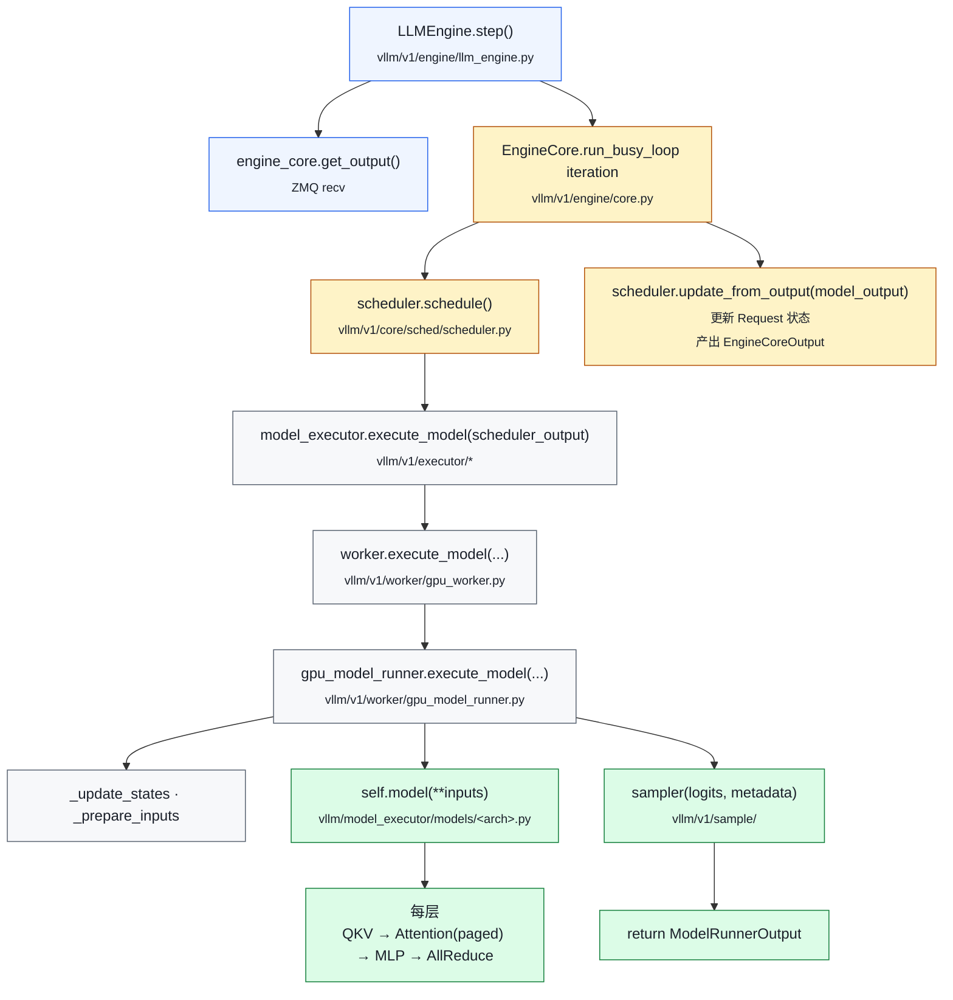

# 01. 入口与引擎主循环

> **谁该读这一篇？** 第一次打开 vLLM 源码、想知道"该从哪个文件开始读、调用链怎么串"的工程师。
>
> **前置阅读：** [`02-architecture.md`](../01-overview/02-architecture.md)、[`03-v0-vs-v1.md`](../01-overview/03-v0-vs-v1.md)、[`04-project-structure.md`](../01-overview/04-project-structure.md)
>
> **耗时：** 约 15 分钟
>
> **学完能：**
> 1. 复述一条请求从用户代码到 GPU forward 的完整文件级路径
> 2. 区分 `LLMEngine`（门面）与 `EngineCore`（心脏）的职责
> 3. 在源码里准确定位 9 个核心文件并知道每个文件的关键方法
> 4. 在面试白板上画出 step() 一次调用的 mermaid 调用链

一个请求是怎么从用户代码（或 HTTP）走到 GPU 的？本节回答"我打开 vllm 仓库，从哪里开始读"。

---

## 1. 两种使用方式 → 两个入口

```
方式 A：离线批推理（offline）
  from vllm import LLM, SamplingParams
  llm = LLM(model="meta-llama/Llama-3-8B")
  outputs = llm.generate(prompts, SamplingParams(...))
  
  入口：vllm/entrypoints/llm.py : LLM

方式 B：在线服务（online，OpenAI 兼容）
  $ vllm serve meta-llama/Llama-3-8B --port 8000
  $ curl -X POST localhost:8000/v1/completions ...
  
  入口：vllm/entrypoints/openai/api_server.py
       脚本：vllm/scripts.py 里 `vllm serve` 子命令
```

两条路最终都汇聚到同一个 **`LLMEngine`**（V1）。

---

## 2. 从 `LLM.__init__` 看一遍

`vllm/entrypoints/llm.py` 里的 `LLM` 类是离线入口。简化的初始化逻辑：

```python
class LLM:
    def __init__(self, model, **kwargs):
        # 1. 把所有参数打包成 EngineArgs
        engine_args = EngineArgs(model=model, **kwargs)
        # 2. 解析成多个具体 config
        vllm_config = engine_args.create_engine_config()
        #    包括: ModelConfig / ParallelConfig / SchedulerConfig /
        #          CacheConfig / DeviceConfig / LoRAConfig / ...
        # 3. 创建引擎
        self.llm_engine = LLMEngine.from_vllm_config(vllm_config)
```

`generate()` 流程：

```python
def generate(self, prompts, sampling_params):
    for prompt in prompts:
        # tokenize（在 main 进程里）
        token_ids = self.tokenizer.encode(prompt)
        # 入队
        self.llm_engine.add_request(req_id, token_ids, sampling_params)
    
    outputs = []
    while self.llm_engine.has_unfinished_requests():
        step_outputs = self.llm_engine.step()
        outputs.extend(step_outputs)
    return outputs
```

---

## 3. OpenAI API Server

`vllm/entrypoints/openai/api_server.py` 用 FastAPI 实现：

- `/v1/completions`：legacy completion
- `/v1/chat/completions`：chat completion（支持 tool_use、structured output）
- `/v1/embeddings`：嵌入向量
- `/v1/models`：列出已加载模型
- `/metrics`：Prometheus 监控

每条请求路径：

```
HTTP → FastAPI handler → AsyncLLMEngine.add_request()
                       → 异步 yield 流式 token
                       → SSE 输出给客户端
```

`AsyncLLMEngine`（`vllm/v1/engine/async_llm.py`）是 `LLMEngine` 的 async 包装，每个请求维护一个 asyncio queue，每步从 engine 拿增量 token 推到 queue。

---

## 4. LLMEngine 在 V1 的真实角色

`vllm/v1/engine/llm_engine.py`（约 400 行）

注意：V1 的 `LLMEngine` 比 V0 轻得多——它是**门面（Facade）**，真正干活的是另一个进程里的 `EngineCore`。

```python
class LLMEngine:
    def __init__(...):
        self.engine_core: EngineCoreClient = ...   # ZMQ 客户端
        self.tokenizer = ...
        self.output_processor = OutputProcessor(...)

    def add_request(self, req_id, prompt, sampling_params):
        # tokenize, 多模态预处理
        engine_request = self._make_engine_core_request(...)
        # 通过 ZMQ 把请求扔给 EngineCore 进程
        self.engine_core.add_request_async(engine_request)

    def step(self):
        # 从 ZMQ 拉本步 output
        outputs = self.engine_core.get_output()
        # 解 token id → text
        return self.output_processor.process(outputs)
```

---

## 5. EngineCore：调度引擎本体

`vllm/v1/engine/core.py`

这是 vLLM 的"心脏"进程。每个 instance 一个 EngineCore 进程。

```python
class EngineCore:
    def __init__(self, vllm_config):
        self.scheduler = Scheduler(...)
        self.model_executor = Executor(...)    # Worker 的代理
        self.request_map: dict[str, Request] = {}

    def run_busy_loop(self):
        while True:
            # 从 ZMQ 收新请求
            for req in self.input_queue.drain():
                self._add_request(req)
            
            # 一步调度 + 执行
            scheduler_output = self.scheduler.schedule()
            if scheduler_output.total_num_scheduled_tokens > 0:
                model_output = self.model_executor.execute_model(scheduler_output)
                engine_core_output = self.scheduler.update_from_output(scheduler_output, model_output)
                # 把结果发回 LLMEngine（也是通过 ZMQ）
                self.output_queue.put(engine_core_output)
            else:
                # 没活干，sleep 一会
                time.sleep(...)
```

**`scheduler.schedule() → execute_model() → update_from_output()`** 这三步是一次 step 的全部，看懂这三步你就懂了主流程。

---

## 6. Executor：把 SchedulerOutput 扔给 Worker

`vllm/v1/executor/` 下有多种实现：

| 实现                      | 用途                          |
| ----------------------- | --------------------------- |
| `uniproc_executor.py`    | 单卡，直接调用 Worker（同一进程）        |
| `multiproc_executor.py`  | 单机多卡，多进程 + shared memory IPC |
| `ray_distributed_executor.py` | 多机多卡，Ray actor             |
| `abstract.py`            | 接口定义                        |

接口大致是：

```python
class Executor:
    def execute_model(self, scheduler_output) -> ModelRunnerOutput:
        # 把 scheduler_output 分发给所有 worker（TP/PP rank）
        # 收集 driver worker 的输出
        ...
```

---

## 7. Worker：每张 GPU 一个

`vllm/v1/worker/gpu_worker.py`

```python
class Worker:
    def __init__(self, vllm_config, rank, local_rank):
        # 设置当前 GPU
        torch.cuda.set_device(local_rank)
        # 初始化分布式（NCCL）
        init_distributed(...)
        # 加载模型分片
        self.model_runner = GPUModelRunner(vllm_config, ...)

    def load_model(self):
        self.model_runner.load_model()
        
    def initialize_cache(self, num_gpu_blocks):
        # 真正分配 KV cache 显存
        ...

    def execute_model(self, scheduler_output):
        return self.model_runner.execute_model(scheduler_output)
```

---

## 8. GPUModelRunner：每步前向的本体

`vllm/v1/worker/gpu_model_runner.py`（这个文件很大，3000+ 行）

```python
class GPUModelRunner:
    def execute_model(self, scheduler_output):
        # 1. 更新 InputBatch（增删请求行）
        self._update_states(scheduler_output)
        # 2. 准备输入 tensor（token_ids, positions, block_tables, ...）
        model_input = self._prepare_model_input()
        # 3. 跑前向（可能 CUDAGraph）
        hidden_states = self.model(**model_input)
        # 4. LM head + sample
        logits = self.model.compute_logits(hidden_states, ...)
        sampled = self.sampler(logits, sampling_metadata)
        # 5. 返回
        return ModelRunnerOutput(sampled_token_ids=sampled, ...)
```

---

## 9. 一次 step 的完整调用链



把这条链路背下来，面试问"vLLM 怎么处理一个请求"就能按 9 步讲清，并随时指出对应文件路径。

---

## 10. 推荐阅读顺序（针对面试准备）

按顺序读，每个文件挑核心方法看 + 加 print 跑一遍：

1. `vllm/entrypoints/llm.py` → 看 `generate`
2. `vllm/v1/engine/llm_engine.py` → 看 `add_request`、`step`
3. `vllm/v1/engine/core.py` → 看 `run_busy_loop`
4. `vllm/v1/core/sched/scheduler.py` → **重点**，看 `schedule`、`_schedule_running`、`_schedule_waiting`、`update_from_output`
5. `vllm/v1/core/kv_cache_manager.py` → 看 `allocate_slots`
6. `vllm/v1/worker/gpu_worker.py` → 看 `execute_model`、`load_model`、`initialize_cache`
7. `vllm/v1/worker/gpu_model_runner.py` → 看 `execute_model`、`_prepare_inputs`
8. `vllm/model_executor/models/llama.py` → 看 `LlamaForCausalLM.forward`
9. `vllm/v1/attention/backends/flash_attn.py` → 看 `FlashAttentionImpl.forward`

通读这 9 个文件，对 vLLM 的运行流就有了完整心智模型，源码层面再深入哪一层都不会迷路。

---

## 小结

- vLLM 的两个入口（`LLM` 离线类、`api_server` 在线服务）最终都汇聚到同一个 `LLMEngine`，再通过 ZMQ 把请求转给独立进程里的 `EngineCore`。
- 一次 step 的核心三步是 `scheduler.schedule() → executor.execute_model() → scheduler.update_from_output()`，背下这三步就抓住了主流程。
- Worker 进程里 `GPUModelRunner.execute_model` 是 forward + 采样的实际本体，所有 GPU 上的活都在这里。
- V1 的 `LLMEngine` 是个轻量门面（约 400 行），真活在 EngineCore 进程；这点跟 V0 不同，是 V1 性能与可维护性的关键设计。

## 自检

> 答案不必照搬，能讲到关键点即可。

**1. `add_request` 和 `step` 各对应哪条 ZMQ 通道？发还是收？**

- **`add_request`**：API Server / LLMEngine 端→ **发**到 EngineCore 的 **ROUTER 入口 socket**（`ROUTER↔DEALER` 模式）。EngineCore 端从同一 socket **收**。
- **`step`**：EngineCore 端把生成的 token / finished 状态 → **发**到 API Server 的 **PUSH 出口 socket**（`PUSH↔PULL` 模式）。API Server 从 PULL socket **收**。

两条通道**方向相反**：请求路径用 ROUTER/DEALER（请求-响应耦合），输出路径用 PUSH/PULL（单向流）。

源码：`vllm/v1/engine/core_client.py` 里 AsyncMPClient 维护这两个 socket。

---

**2. 进程树里有几个进程？谁是 EngineCore / Worker？**

```
$ ps -ef --forest | grep vllm
1234  vllm serve ...                          ← API Server (主进程)
 └ 1235  EngineCore                            ← EngineCore (子进程)
    └ 1236  VllmWorker-0 (CUDA_VISIBLE_DEVICES=0)
    └ 1237  VllmWorker-1 (CUDA_VISIBLE_DEVICES=1)
    └ 1238  VllmWorker-2 (CUDA_VISIBLE_DEVICES=2)
    └ 1239  VllmWorker-3 (CUDA_VISIBLE_DEVICES=3)
```

TP=4 时共 **6 个进程**：1 API + 1 EngineCore + 4 Worker。

辨识方法：

- API Server：`vllm serve` 命令名，跑 FastAPI/uvloop
- EngineCore：进程名通常含 `EngineCore` 或 `_run_engine_core`，CPU 占用高
- Worker：进程名含 `VllmWorker`，绑定某张 GPU（`nvidia-smi` 能看到 PID）

---

**3. 9 步调用链 `LLM.generate(["hi"])` → `FlashAttentionImpl.forward`。**

```
1. LLM.generate(["hi"])                              vllm/entrypoints/llm.py
2.   → LLMEngine.add_request(req)                    vllm/v1/engine/llm_engine.py
3.     → core_client.add_request_async()             vllm/v1/engine/core_client.py
4.       → ZMQ ROUTER socket 发请求                   (跨进程)
5.   → LLMEngine.step()                              同上
6.     → EngineCoreProc.run() 主循环                  vllm/v1/engine/core.py
7.       → Scheduler.schedule()                      vllm/v1/core/sched/scheduler.py
8.       → Executor.execute_model(scheduler_output)  vllm/v1/executor/multiproc_executor.py
9.         → Worker.execute_model()                  vllm/v1/worker/gpu_worker.py
10.          → GPUModelRunner.execute_model()        vllm/v1/worker/gpu_model_runner.py
11.            → model.forward()                     vllm/model_executor/models/llama.py
12.              → Attention.forward()               vllm/model_executor/layers/attention.py
13.                → FlashAttentionImpl.forward()    vllm/v1/attention/backends/flash_attn.py
```

实际是 13 步而非 9（早期教学时合并了几步）。**关键三跳**：① 用户 → LLMEngine（同进程）② LLMEngine → EngineCore（ZMQ）③ EngineCore → Worker（共享内存 + RPC）。

---

**4. `step()` 加日志统计本步 token 数：改 LLMEngine 还是 EngineCore？**

**改 EngineCore**（`vllm/v1/engine/core.py` 的 `EngineCoreProc.step()` 内）。

**理由**：

- `LLMEngine.step()` 只是个**客户端 wrapper**——把请求扔给 EngineCore，再从 ZMQ 收回结果。它根本不知道 EngineCore 内部 schedule 了多少 token
- `EngineCoreProc.step()` 是真正的"step"——它持有 `scheduler_output.total_num_scheduled_tokens` 字段，直接 log 即可
- 加在 LLMEngine 端只能拿到"完成的请求数"，拿不到"本步 token 数"——粒度不对

**实际代码**（伪）：

```python
# vllm/v1/engine/core.py
def step(self):
    so = self.scheduler.schedule()
    logger.info(f"step token count: {so.total_num_scheduled_tokens}")  # ← 加在这里
    output = self.executor.execute_model(so)
    self.scheduler.update_from_output(so, output)
    return output
```

加分点：vLLM 已经在 `vllm/v1/metrics/loggers.py` 把这个 metric 暴露成 Prometheus `vllm:iteration_tokens_total`（histogram），不需要手 log；要看就 `curl /metrics`。

## 下一步

- 下一节：[`02-scheduler.md`](02-scheduler.md)（深入 2300 行的 Scheduler，看 token budget、preempt、chunked prefill 怎么实现）
- 想看源码：`vllm/v1/engine/core.py`、`vllm/v1/worker/gpu_model_runner.py`（最推荐用 IDE 跟一遍 step 调用栈）
- 想动手：[`07-hands-on/02-trace-a-request.md`](../07-hands-on/02-trace-a-request.md)（加 print 实际追一条请求）
- 想从生产视角理解：[`08-production-deployment/01-deployment-architectures.md`](../08-production-deployment/01-deployment-architectures.md)（看进程拓扑怎么映射到真实部署）

