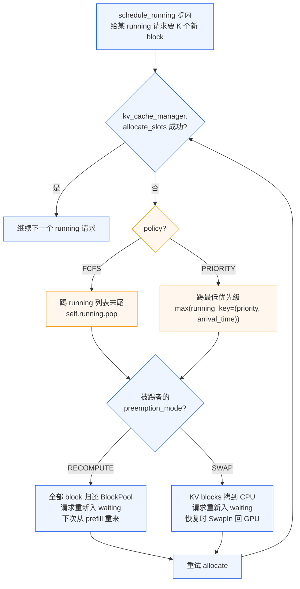

# 02b. 调度策略：FCFS vs PRIORITY、优先级反演与抢占代价

> **谁该读这一篇？** 想理解"vLLM 当前其实只有 2 种调度策略"、"PRIORITY 模式真的会优先级反演吗"、"应该把 SLA-敏感的请求标 priority 还是分独立 LLM 实例"的工程师；做平台调度路由的同学。
>
> **前置阅读：** [`02-scheduler.md`](02-scheduler.md)（必须先读完 `schedule()` 主流程，本节专攻其中策略 / 队列层）；[`02-core-concepts/03-kv-cache-management.md`](../02-core-concepts/03-kv-cache-management.md)（抢占代价来自 KV 重算或换出）。
>
> **耗时：** 约 14 分钟。
>
> **学完能：**
> 1. 说清 vLLM V1 仅有的 2 种官方策略：FCFS（deque）/ PRIORITY（min-heap），数据结构、复杂度、各自的 add/pop 行为。
> 2. 推导 PRIORITY 模式下"抢占—释放—重排"的发生顺序，并解释为什么会出现"实质上的优先级反演"。
> 3. 量化算抢占代价（recompute 模式下损失多少 prefill token、swap 模式下走多少 PCIe）。
> 4. 给定 SLA 描述（多租户 / 优先级请求 / 长尾），选择"用 PRIORITY"、"上多实例"、"加路由层"中的哪个方案。

Scheduler 文章讲了"一步内怎么决定跑谁"，本节是其中**队列层**的专题：vLLM 真正提供的调度策略只有两种，但里面藏了几个坑。

---

## 1. 仅有的 2 种官方策略

源码：`vllm/v1/core/sched/request_queue.py:13`

```python
class SchedulingPolicy(Enum):
    FCFS = "fcfs"
    PRIORITY = "priority"
```

**没有 SJF（最短作业优先）、没有 EDF（最早 deadline）、没有 weighted fair queueing。** 想要这些都得自己在 routing 层做，或者通过 `--scheduling-policy=priority` + 自定义 `request.priority` 字段间接表达。

策略在启动时定，**全局生效**（`scheduler.py:158`），运行中不能切。

---

## 2. 数据结构对比

| 维度 | FCFS | PRIORITY |
| --- | --- | --- |
| 底层 | `collections.deque[Request]` | `heapq` min-heap `list[Request]` |
| 顺序键 | 入队顺序（append） | `(request.priority, request.arrival_time)` — 小者先 |
| `add_request` | O(1) | O(log n) |
| `pop_request` | O(1) `popleft` | O(log n) `heappop` |
| `remove_request`（中途踢一个） | O(n) | O(n) + O(n) heapify |
| `prepend_request`（preempt 回插） | O(1) `appendleft` | **无意义** — 仍按 priority 重排（见 §170） |
| 适用 | 公平、低 overhead | 多租户/优先级分级、可控 TTFT 倾斜 |

`PriorityRequestQueue.prepend_request()` 注释直接说："In a priority queue, there is no concept of prepending"——就是 add 的别名。这点是 PRIORITY 模式坑的源头（见 §5）。

---

## 3. 多个队列：`waiting` 与 `skipped_waiting`

`scheduler.py:164-166` 创建两个：

```python
self.waiting = create_request_queue(self.policy)
self.skipped_waiting = create_request_queue(self.policy)
```

`skipped_waiting` 是个"被本步跳过"的旁置队列。常见跳过原因（`scheduler.py:430-440` 区段）：

- 请求超 `max_model_len`
- encoder budget 耗尽
- encoder cache 耗尽
- 混合模型（含 Mamba）block 不对齐

注释里有句关键话：

> "Here, by doing `continue` instead of `break`, we do not strictly follow the FCFS scheduling policy and allow the lower-priority requests to be scheduled."

即：**FCFS 模式下，如果队头请求暂时不能跑（如等 encoder cache），后面的小请求会被先跑——FCFS 不严格守"先来先服务"**。这通常是好事（throughput +），但生产中调试"为什么我的请求被晚到的请求挤了"时要记住。

到下一步 `_select_waiting_queue_for_scheduling()`（`scheduler.py:1620`）会决定先消费哪个：

- FCFS：先消费 `skipped_waiting`，腾完再 `waiting`
- PRIORITY：比较两队头，选更小的 `(priority, arrival_time)`

---

## 4. 抢占（preempt）：什么时候触发，谁被踢

抢占只在**给 running 请求 allocate KV 失败**时触发（`scheduler.py:448-475`）：



**关键点：**

- **FCFS** 踢 `running` 末尾（最近被加入 batch 的）——简单粗暴，靠"近来的最易被踢"近似公平。
- **PRIORITY** 用 `max(self.running, key=lambda r: (r.priority, r.arrival_time))` 选最低优先级（最大 priority 值）。
- 被踢请求重新入 `waiting`，本步剩余 budget / 已分配 block 全部退还。
- 整个过程**单步内可发生多次**（while 循环），直到 allocate 成功或 running 空。

### 4.1 V1 默认 RECOMPUTE

V0 默认 SWAP，V1 改成 RECOMPUTE。原因：

- SWAP 需要 PCIe 拷贝 KV：H100 ↔ host ~50 GB/s，70B 模型一个长上下文请求 KV 可达数 GB——拷贝几十到几百 ms。
- RECOMPUTE 只需在重新调度时跑一次 prefill；现代 GPU FLOPS 充足，且 chunked prefill 可分摊。
- prefix caching 命中时 RECOMPUTE 大部分免费——前面 cached 的块复用，只重算 miss 段。
- 综合 RECOMPUTE 通常**更快且实现更简单**。

切回 SWAP：`--preemption-mode swap`（仅在 KV 极大、prefill 极贵的窄场景下值得考虑）。

---

## 5. PRIORITY 模式的 3 个坑

### 5.1 "事实上的优先级反演"

场景：低优先级请求 A 已经跑了 80% 的 decode，KV 占 100 个 block。高优先级请求 B 到达，KV 不够，preempt 触发。

vLLM 会踢 A（因为它优先级最低）→ A 的 100 个 block 全释放 → B 进入。**A 之前消耗的 forward 算力 + 已生成的 token 全部白费**（RECOMPUTE 下要重新 prefill）。

这不是 vLLM 的 bug，是 priority preemption 的本质代价。**生产应用要意识到："标 priority=high" 是有外部性的——它会让 priority=low 的工作被丢弃。**

### 5.2 priority 是 add-only，不能动态改

`request.priority` 在 `add_request` 时就定下。运行中**没有 API 重新排队**。想给某个长尾请求"加速"必须重建请求。

### 5.3 `prepend_request` 在 PRIORITY 下退化

preempt 后请求要"放回 waiting 头"——FCFS 下是 O(1) appendleft，**保证它下次第一个被试**。
PRIORITY 下退化为 add → 重新按 (priority, arrival_time) 排——它若 priority 高自然还在前，若 priority 低就**可能再次排到后面**，造成抖动。

---

## 6. 抢占代价的实际计算

### 6.1 RECOMPUTE 模式

被踢请求损失：

- 已生成 N 个 decode token 全丢
- prefill 算力 = prompt_len × hidden_size² × layers × 2 （粗算）
- 加上重新调度的 schedule overhead

**示例**：Llama-70B + prompt=2000 + 已 decode 500 → 损失约 2500 token 的 forward。在 H100 上约 100-150 ms 算力 + 4 GB 显存短暂占用。

但若 prefix cache 命中率高（如 system prompt 长 + cache 未 evict），实际重算只是 miss 段——可能仅几十 ms。

### 6.2 SWAP 模式

被踢请求 KV 拷出 CPU + 恢复时拷回。Llama-70B 长 2500 token KV ≈ 2.5 GB（BF16 GQA）。

- H100 PCIe Gen5 ×16 单向理论 ~64 GB/s → 一次 ~40 ms
- 恢复时再 40 ms
- 占 host 内存

**与 RECOMPUTE 对比**：

- KV 极大、prefix cache 命中率低 → SWAP 偏好
- KV 中等、prefix cache 命中高 → RECOMPUTE 偏好

### 6.3 监控

抢占次数：`vllm:num_preemptions`（Counter）。生产突然 spike 通常意味着：

1. 大批高优先级请求涌入；
2. KV cache 容量配置过小（`--num-gpu-blocks-override` 不足）；
3. 长上下文请求集中到达。

---

## 7. 选型决策表

| 场景 | 建议 | 理由 |
| --- | --- | --- |
| 公平单租户（聊天 chatbot 各用户平等） | **FCFS** | 简单、低 overhead、避免优先级反演损耗 |
| 多租户但优先级层级少（最多 3-5 档） | **PRIORITY** + 设计良好的 priority 映射 | 业务侧定义清楚 high/medium/low |
| 多租户且 SLA 严苛 | **多实例 + 路由层 weighted** | priority 抢占代价不可控，物理隔离更安全 |
| 想做 SJF（短请求先） | 自己路由：output_tokens<N 的去专门实例 | vLLM 本身不支持 |
| Realtime（agent 中工具回调） | **PRIORITY** + 高 priority 给 callback request | 用 priority 表达"必须插队"语义 |
| 长 batch 离线推理 | **FCFS** | 不需要打断，吞吐最大化 |

**总原则**：在 vLLM 内调度只能调到"队列"粒度。需要更细的策略（公平份额、严格 SLA、token-rate quota）必须**前置到路由层**——参考 [`08-production-deployment/02-smart-routing-and-load-balancing.md`](../08-production-deployment/02-smart-routing-and-load-balancing.md)。

---

## 8. 自定义策略：能不能加？

理论上能：实现一个 `RequestQueue` 子类 + 把 `SchedulingPolicy` 加一项 + 修 `scheduler.py` 中 `if self.policy == ...` 的分支。

但实际**不建议**：

- vLLM 主线只有 FCFS / PRIORITY，每次主线升级你要重新 rebase。
- 复杂策略放路由层更合适——你能拿到全局视野（多实例、跨用户配额）。
- 调度复杂度 vs. 多卡 batching 的吞吐增益经常不成正比。

如果一定要做，从 `request_queue.py` 抽接口开始——它的 ABC 设计就是为扩展留的。

---

## 小结

- vLLM V1 官方只有 **FCFS（deque）** 和 **PRIORITY（heap）**两种策略，启动时固定。
- FCFS 并不严格"先来先服务"——`skipped_waiting` 队列允许小请求绕过卡住的大请求（throughput +）。
- PRIORITY 模式下抢占踢 `max((priority, arrival_time))`，会**等效优先级反演**：低优请求做的工作可能被高优请求到达完全废弃。
- V1 默认 RECOMPUTE 而非 SWAP——KV 拷贝太贵，prefix cache 命中下重算其实更快。
- 复杂策略（SJF / EDF / weighted fair）请放路由层做，不要在 scheduler 里加。

## 自检

> 答案不必照搬，能讲到关键点即可。

**1. PRIORITY 模式 `num_preemptions` 持续走高，3 个 root cause + 验证方法。**

| 假设 root cause | 验证方法 |
| --- | --- |
| **高优先级请求暴涨** | `vllm:request_success` 按 priority 标签分桶（如果有），看 high 优先级的 QPS 是否突然涨 |
| **KV cache 容量不足** | `vllm:kv_cache_usage_perc` 是否长时间 > 0.9；如是，扩 `--gpu-memory-utilization` 或减 `max_num_seqs` |
| **优先级反演**（低优 victim 反复被踢、又重进 waiting 又被踢）| 看 `num_preemptions` 与 `request_success{finished_reason="length"}` 的比值；高优请求 prompt 很短的话会反复挤掉长任务的 KV |
| **PRIORITY queue + 长尾请求**（已运行的低优请求被新进的高优请求踢飞）| `request_queue_time_seconds` p99 异常高；说明请求在 waiting 长时间排队 |

排查命令：

```bash
curl :8000/metrics | grep -E "preempt|kv_cache_usage|queue_time"
```

---

**2. FCFS 与 PRIORITY 各操作复杂度。**

| 操作 | FCFS（deque）| PRIORITY（heap）|
| --- | --- | --- |
| `add_request` | O(1) `append` | O(log n) `heappush` |
| `pop_request` | O(1) `popleft` | O(log n) `heappop` |
| `peek_request` | O(1) | O(1)（heap[0]）|
| `prepend_request`（preempt 回插）| **O(1)** `appendleft`，立即排回头 | **退化为 add_request** — O(log n) + 按 priority 排序，可能再次落到中间或末尾 |
| `remove_request`（中途踢一个）| O(n) 线性搜索 + 移除 | O(n) 找位置 + O(n) heapify 修复 |

**关键差异**：`prepend_request` 在 FCFS 下"保证下次最先尝试"，在 PRIORITY 下**无保证**——这是 PRIORITY 模式抖动的源头（参见正文 §5.3）。

---

**3. 7B 模型, prompt=4000, 已 decode 1000, preempt 后 RECOMPUTE 浪费多少 token？**

被踢请求损失：

- 已 decode 的 1000 个 token 全部丢弃（重新进 waiting 后从 prompt 重新 prefill）
- 加上**重新 prefill 4000 token**

**总浪费的算力 ≈ 4000 + 1000 = 5000 token 的 forward**。

如果 prefix cache 命中 0%（题目假设），这 4000 prompt prefill 全部重算。Llama-7B forward 在 H100 上单 token ~0.05 ms，5000 token 重算约 **250 ms 算力**。

如果 prefix cache 命中（典型场景命中 50-80%），只需重算 cache miss 段 + 那 1000 decode → 实际浪费约 60-100 ms。

**额外代价**：被踢请求要重新进 waiting → 等到再次被调度可能又过几个 step → 用户感知到的 latency 在原本 TTLT 上至少多 200-500 ms。

---

**4. 多租户 A 付费 10× B 付费 1×，能不能用 PRIORITY 实现"A 拿 10× 吞吐"？**

**不能**，至少不能精确控制到 10×。理由：

1. **PRIORITY 只是排序不是配额**：A 的请求总是先被调度。如果 A 请求数 ≤ B，A 实际只占用 ≤ 50% 资源；如果 A 远多于 B，A 会**完全饿死** B，比例 ∞:0 而不是 10:1。
2. **vLLM 不支持加权 fair queueing**：FCFS 和 PRIORITY 都不能实现"按比例分配 token / step"。`SchedulingPolicy` 只有这两选。
3. **预算粒度太粗**：token budget 按步分配，无法做 inter-request weighted 切分。

**正确做法**（放路由层）：

- **Weighted round-robin**：路由器按 10:1 比例 dispatch 请求到 vLLM 实例
- **多实例物理隔离**：A 用 10 个 vLLM pod，B 用 1 个，K8s HPA 各自扩缩容
- **Token rate limiting**：在 API gateway 用 leaky bucket，A 限 10000 token/s，B 限 1000 token/s

→ vLLM 内的 PRIORITY 只解决"严格优先级"问题（如插入系统调用 / 紧急 callback），不解决配额公平。详见 [`08-production-deployment/02-smart-routing-and-load-balancing.md`](../08-production-deployment/02-smart-routing-and-load-balancing.md)。

## 下一步

- 下一节：[`03-kv-cache-manager.md`](03-kv-cache-manager.md)（理解 preempt 时 KV 是怎么 allocate / free 的）。
- 想看源码：`vllm/v1/core/sched/request_queue.py`、`vllm/v1/core/sched/scheduler.py:430-475` 的 preempt 段。
- 想做实验：[`07-hands-on/03-mini-experiments.md`](../07-hands-on/03-mini-experiments.md) 第 4 个实验"batching 极限"中可手工触发 preempt 观察 `num_preemptions` 增长。
- 想从生产视角理解：[`08-production-deployment/02-smart-routing-and-load-balancing.md`](../08-production-deployment/02-smart-routing-and-load-balancing.md)（路由层是 vLLM 调度策略的真正延伸）。
