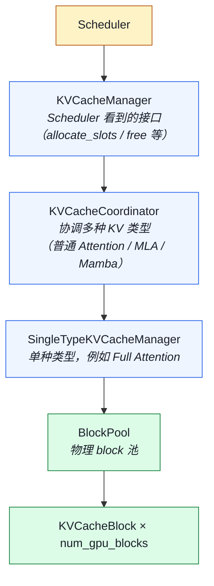
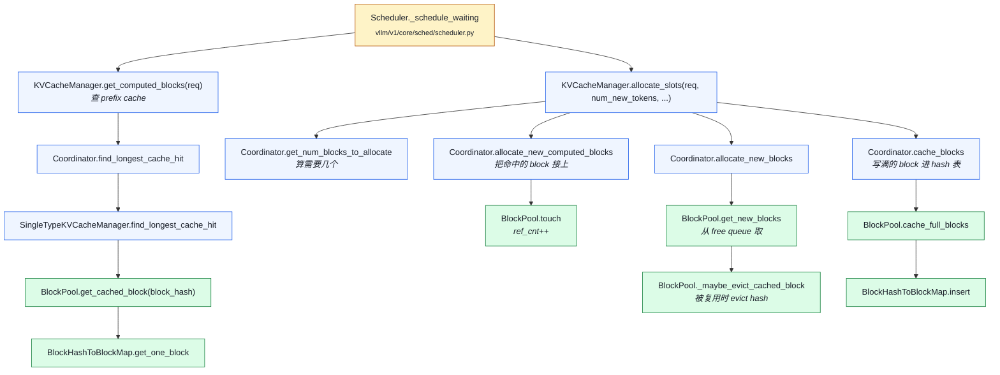

# 03. KVCacheManager 与 BlockPool 源码深读

> **谁该读这一篇？** 已经看过 Scheduler 的 `allocate_slots` 调用，想搞懂"一个 block 在 vLLM 内部经历什么生命周期、prefix cache 命中是怎么实现"的工程师。
>
> **前置阅读：** [`01-paged-attention.md`](../02-core-concepts/01-paged-attention.md)、[`03-kv-cache-management.md`](../02-core-concepts/03-kv-cache-management.md)、[`04-prefix-caching.md`](../02-core-concepts/04-prefix-caching.md)、[`02-scheduler.md`](02-scheduler.md)
>
> **耗时：** 约 22 分钟
>
> **学完能：**
> 1. 画出 `Scheduler → KVCacheManager → Coordinator → SingleType → BlockPool` 的三层抽象关系
> 2. 在白板上画出 BlockPool 的内部数据结构（blocks 数组、free queue 双向链表、hash 表）
> 3. 解释 `KVCacheBlock.ref_cnt` 的 5 个变化时机，以及"free 时为何要 reverse"
> 4. 读懂 `allocate_slots` 的 9 个参数和那张五段 layout 图

文件：`vllm/v1/core/kv_cache_manager.py`（570 行）、`vllm/v1/core/block_pool.py`（509 行）。这是 PagedAttention 的工程心脏。本节按真实代码顺序拆解。

---

## 1. 类的关系：三层抽象



设计意图：**让一个模型可以同时含多种"KV 类似物"**（Transformer KV + Mamba state + sparse attention），每种走自己的 manager，但对 Scheduler 暴露统一的 `allocate_slots` 接口。

学习时可以**先只看 Full Attention 那一条线**，忽略 coordinator 的多类型分支。

---

## 2. KVCacheBlock：一个物理 block 的元数据

`vllm/v1/core/kv_cache_utils.py`：

```python
@dataclass
class KVCacheBlock:
    block_id: int                        # 物理 block 在 KV 张量里的索引
    ref_cnt: int = 0                     # 引用计数
    _block_hash: BlockHashWithGroupId | None = None
    prev_free_block: KVCacheBlock | None = None  # free queue 前驱
    next_free_block: KVCacheBlock | None = None  # free queue 后继
    is_null: bool = False                # null block 占位
```

不变式：

- `ref_cnt == 0` ⟺ 在 free queue 里
- `ref_cnt > 0` ⟺ 至少一个 Request 的 block_table 引用了它
- `_block_hash != None` ⟺ block 已写满且参与 prefix caching

---

## 3. BlockPool：物理 block 的中央仓库

`vllm/v1/core/block_pool.py:130` — `class BlockPool`

### 3.1 初始化（line 149-182）

```python
def __init__(self, num_gpu_blocks, enable_caching, hash_block_size, ...):
    # 创建所有物理 block 的元数据
    self.blocks: list[KVCacheBlock] = [
        KVCacheBlock(idx) for idx in range(num_gpu_blocks)
    ]
    # 双向链表的 free queue（LRU 顺序）
    self.free_block_queue = FreeKVCacheBlockQueue(self.blocks)
    # hash → block 索引（prefix caching 的核心数据结构）
    self.cached_block_hash_to_block: BlockHashToBlockMap = BlockHashToBlockMap()
    # block_id=0 永远留作占位（null block），不参与分配
    self.null_block = self.free_block_queue.popleft()
    self.null_block.is_null = True
```

**关键设计**：

1. `blocks` 是预分配的**元数据数组**，长度固定为 `num_gpu_blocks`。物理 KV 显存张量在 Worker 那里持有；BlockPool 只管"哪个 id 现在被谁占"。
2. `free_block_queue` 是双向链表而非栈：`append_n` 放尾部，`popleft` 取头部 → **LRU 复用**。
3. `null_block` 是个占位 trick，避免 block_id=0 被误用。

### 3.2 分配新 block（line 322-352）

```python
def get_new_blocks(self, num_blocks: int) -> list[KVCacheBlock]:
    if num_blocks > self.get_num_free_blocks():
        raise ValueError(f"Cannot get {num_blocks} free blocks from the pool")

    ret: list[KVCacheBlock] = self.free_block_queue.popleft_n(num_blocks)

    if self.enable_caching:
        for block in ret:
            self._maybe_evict_cached_block(block)   # 如果是 cached block，先 evict
            assert block.ref_cnt == 0
            block.ref_cnt += 1                       # ref_cnt 1
    else:
        for block in ret:
            block.ref_cnt += 1
    return ret
```

注意两件事：

- 从 free queue **头部**取（LRU 中最早 free 的）→ 配合 prefix caching，最旧的 cached block 才会被覆盖。
- 若取出的 block 仍带 hash（曾被 cache 过），先把它从 `cached_block_hash_to_block` 里移除（`_maybe_evict_cached_block`），才能给新请求用。

### 3.3 命中已 cache 的 block（line 391-406）

```python
def touch(self, blocks: Sequence[KVCacheBlock]) -> None:
    """Touch a block increases its reference count by 1, and may remove
    the block from the free queue."""
    for block in blocks:
        if block.ref_cnt == 0 and not block.is_null:
            self.free_block_queue.remove(block)   # 从 free queue 拿出
        block.ref_cnt += 1
```

这是 prefix cache 命中时调用的：block 之前可能 `ref_cnt=0`（在 free queue 里待回收），命中后 `ref_cnt=1`、并从 free queue 里抽出。

### 3.4 释放 block（line 408-422）

```python
def free_blocks(self, ordered_blocks: Iterable[KVCacheBlock]) -> None:
    """Free a list of blocks. The blocks should be ordered by their
    eviction priority, where the first block will be evicted first."""
    blocks_list = list(ordered_blocks)
    for block in blocks_list:
        block.ref_cnt -= 1
    self.free_block_queue.append_n(
        [block for block in blocks_list if block.ref_cnt == 0 and not block.is_null]
    )
```

**两个细节**：

- 调用方负责把 blocks 按"优先回收顺序"传入（通常是 **逆序**：tail 先 free）。KVCacheManager.free 就是 `reversed(...)`。这样回收时 free queue 里 tail 排前面，会被先 evict（保留更可能复用的 head block）。
- 只有 `ref_cnt → 0` 的才真正放回 free queue。

### 3.5 把"满 block"挂到 hash 表（line 211-320）

```python
def cache_full_blocks(self, request, blocks, num_cached_blocks, num_full_blocks, block_size, kv_cache_group_id):
    ...
    new_full_blocks = blocks[num_cached_blocks:num_full_blocks]
    new_block_hashes = block_hashes[num_cached_blocks:]
    for i, blk in enumerate(new_full_blocks):
        if blk.is_null:
            continue
        assert blk.block_hash is None
        block_hash = new_block_hashes[i]
        block_hash_with_group_id = make_block_hash_with_group_id(block_hash, kv_cache_group_id)
        blk.block_hash = block_hash_with_group_id
        self.cached_block_hash_to_block.insert(block_hash_with_group_id, blk)
```

**这是 prefix caching 写入端**：一个 block 写满了之后（比如 16 token 都填好），把它的 hash 注册到 `cached_block_hash_to_block`，之后其他请求 hash 查到同样的内容就能复用。

注意 hash 必须含 `kv_cache_group_id`——一个模型如果有多种 KV（如 sliding window + full），不同 group 的 hash 表分开。

---

## 4. KVCacheManager：Scheduler 看到的接口

`vllm/v1/core/kv_cache_manager.py:111` — `class KVCacheManager`

### 4.1 数据契约：KVCacheBlocks（line 19-103）

Scheduler 拿到的不是 `list[KVCacheBlock]` 而是 `KVCacheBlocks`：

```python
@dataclass
class KVCacheBlocks:
    blocks: tuple[Sequence[KVCacheBlock], ...]
    # 外层 tuple = kv_cache_groups
    # 内层 list = 该 group 的 block 序列
```

意图：Scheduler **完全不知道**内部有几种 KV group。它只管"给这个请求的所有 KV 加了 N 个 block"。

### 4.2 prefix 命中（line 194-234）

```python
def get_computed_blocks(self, request: Request) -> tuple[KVCacheBlocks, int]:
    if not self.enable_caching or request.skip_reading_prefix_cache:
        return self.empty_kv_cache_blocks, 0

    # NOTE: When all tokens hit the cache, we must recompute the last token
    # to obtain logits. Thus, set max_cache_hit_length to prompt_length - 1.
    max_cache_hit_length = request.num_tokens - 1

    computed_blocks, num_new_computed_tokens = (
        self.coordinator.find_longest_cache_hit(
            request.block_hashes, max_cache_hit_length
        )
    )

    if self.log_stats:
        self.prefix_cache_stats.record(
            num_tokens=request.num_tokens,
            num_hits=num_new_computed_tokens,
            preempted=request.num_preemptions > 0,
        )
    return self.create_kv_cache_blocks(computed_blocks), num_new_computed_tokens
```

关键点：

- **最后一个 token 必须重算**：因为 vLLM 需要它的 logits 来采样下一个 token；如果命中了它，反而没有 logits 可用。
- `find_longest_cache_hit` 按 `block_hashes` 链式查找——**第一个 miss 后停下**（前缀性质，文档里讲过）。

### 4.3 allocate_slots：最核心的 200 行（line 236-427）

完整签名：

```python
def allocate_slots(
    self,
    request: Request,
    num_new_tokens: int,
    num_new_computed_tokens: int = 0,
    new_computed_blocks: KVCacheBlocks | None = None,
    num_lookahead_tokens: int = 0,
    num_external_computed_tokens: int = 0,
    delay_cache_blocks: bool = False,
    num_encoder_tokens: int = 0,
    full_sequence_must_fit: bool = False,
) -> KVCacheBlocks | None:
```

参数语义（**面试可能详细问**）：

| 参数                       | 含义                                                                  |
| ------------------------ | ------------------------------------------------------------------- |
| num_new_tokens           | 本步要算的 token 数（含未验证的 draft 投机 token）                                  |
| num_new_computed_tokens  | 本次 prefix caching 新命中的 token 数（vLLM 本地 cache）                       |
| new_computed_blocks      | 上面对应的 block 列表（已经按 group 分好）                                         |
| num_lookahead_tokens     | spec decoding 的 lookahead 数（要为这些**未来 token** 预留 slot）              |
| num_external_computed_tokens | KV connector（如 LMCache）传来的预计算 token 数                              |
| delay_cache_blocks       | P/D disaggregated 时，传输还没完成不立刻 cache                                  |
| num_encoder_tokens       | encoder-decoder 模型（如 Whisper）跨注意力的 encoder token                    |
| full_sequence_must_fit   | 入场准入控制：必须能装下整个请求才接收（避免长请求陷入循环 chunk）                                  |

文档头部画了 layout 示意（line 273-294），核心是这张图：

```mermaid
flowchart LR
    A["comp<br/>request.num_computed_tokens"]
    B["new_comp<br/>新命中的本地 prefix"]
    C["ext_comp<br/>connector 预计算"]
    D["new<br/>num_new_tokens"]
    E["lookahead<br/>spec decode 预留"]

    A --- B --- C --- D --- E

    B -. to be allocated .-> C
    C -. to be allocated .-> D
    D -. to be computed .-> E

    classDef done    fill:#dcfce7,stroke:#15803d,color:#1a1f29;
    classDef hit     fill:#eff5ff,stroke:#2563eb,color:#1a1f29;
    classDef todo    fill:#fef3c7,stroke:#b45309,color:#1a1f29;
    classDef spec    fill:#f7f8fa,stroke:#5b6573,color:#1a1f29;
    class A done;
    class B,C hit;
    class D todo;
    class E spec;
```



简化逻辑（去掉 corner case）：

```python
# 1. 算这个请求一共需要多少个 block 槽位
num_tokens_main_model = total_computed_tokens + num_new_tokens
num_tokens_need_slot = min(num_tokens_main_model + num_lookahead_tokens, max_model_len)

# 2. 算实际要新分多少 block
num_blocks_to_allocate = self.coordinator.get_num_blocks_to_allocate(...)

# 3. 不够就返回 None（让 Scheduler preempt）
if num_blocks_to_allocate > self.block_pool.get_num_free_blocks():
    return None

# 4. 把 prefix cache 命中的 block 挂到请求上（ref_cnt++）
if new_computed_block_list is not empty:
    self.coordinator.allocate_new_computed_blocks(...)

# 5. 真正分配新 block
new_blocks = self.coordinator.allocate_new_blocks(...)

# 6. 把已经写满的 block 注册到 hash 表（除非 disaggregated 还在传输）
if not delay_cache_blocks:
    self.coordinator.cache_blocks(request, num_tokens_to_cache)

return self.create_kv_cache_blocks(new_blocks)
```

返回值约定：`None` = "无法分配，请 preempt"；非 None = "已分配的新 block 列表"。

### 4.4 free（line 429-437）

```python
def free(self, request: Request) -> None:
    """Free the blocks allocated for the request.
    We free the blocks in reverse order so that the tail blocks are evicted
    first when caching is enabled."""
    self.coordinator.free(request.request_id)
```

为什么 reverse？因为 free queue 是 FIFO 出（LRU），先放进去的先被覆盖。把 tail block 先 free，head block 后 free → 后续 head block 排在 free queue 后面 → 不容易被立刻 evict → **保留前缀**。

### 4.5 reset_prefix_cache（line 460-475）

```python
def reset_prefix_cache(self) -> bool:
    """清空 prefix cache，但保留正在 use 的 block。"""
```

用途：测试、workload 切换、内存压力大时。可以通过 API endpoint 触发。

---

## 5. 一次 allocate 的完整调用栈（追代码用）



---

## 6. 推荐阅读顺序

精读建议（带 2-3 小时计划）：

1. `vllm/v1/core/kv_cache_utils.py`：先认清 `KVCacheBlock`、`BlockHash*`、`hash_request_tokens`
2. `vllm/v1/core/block_pool.py`：从 `__init__` 一路读到 `free_blocks`
3. `vllm/v1/core/kv_cache_manager.py`：重点 `get_computed_blocks` + `allocate_slots` + `free`
4. `vllm/v1/core/single_type_kv_cache_manager.py`：看一种具体的 manager 怎么实现
5. （可选）`vllm/v1/core/kv_cache_coordinator.py`：多 group 协调

读完你应该能：

- 在白板上画 BlockPool 的内部数据结构
- 解释为什么 free 时要 reverse
- 描述一个请求 prefix 命中后 KV manager 内部发生的 5 个动作

---

## 小结

- KVCacheManager 之下分三层：Coordinator 协调多种 KV 类型、SingleTypeKVCacheManager 处理一种类型、BlockPool 真正持有物理 block 的元数据。
- BlockPool 的两个关键数据结构：`blocks` 数组按 id 索引、`free_block_queue` 是 LRU 双向链表，配合 `cached_block_hash_to_block` 支撑 prefix cache 复用。
- `allocate_slots` 返回 `None` 是约定"请 preempt"的信号；它会在一次调用里完成 hash 命中接管、新分配、写入 hash 表三件事。
- free 时按 reverse 顺序入队，让 head block 排在队尾，更不易被覆盖，从而最大化前缀复用。
- 最后一个 token 永远不命中 prefix cache（`max_cache_hit_length = num_tokens - 1`），否则没有 logits 可采样。

## 自检

> 答案不必照搬，能讲到关键点即可。

**1. `block_pool.py` 里所有改 `ref_cnt` 的函数 + ++ 还是 --。**

至少 5 处（具体行号会变动，按函数名定位）：

| 函数 | 操作 | 触发时机 |
| --- | --- | --- |
| `get_new_blocks` | **++**（从 free queue 取出，0→1）| 新请求 / 增加 token 需要 new block |
| `_get_cached_block` | **++**（hash 命中已 cached block）| Prefix caching 命中时复用 |
| `_free_block` | **--**（请求 finish 或 preempt）| ref_cnt 到 0 时回 free queue |
| `free_blocks` 批量 | **--** | 同上，遍历多个 block |
| `touch` / `_increment_ref_count` | **++** | beam search / parallel sampling 共享时 |

加分点：`ref_cnt > 1` 意味着多请求共享，这 block 不能写（COW 保护）；某些代码路径会 `_split_block`（分裂出新 block 给 writer），原 block ref_cnt--。

---

**2. `cached_block_hash_to_block` 里的 block 是 `ref_cnt == 0` 还是 `> 0`？为什么两种都允许？**

**两种都有。**

- `ref_cnt > 0` 的 cached block：正在被至少一个 active 请求使用（hash 表 + 持有引用）
- `ref_cnt == 0` 的 cached block：曾被使用、现在没人用了，但**还没被覆盖**——hash 表保留它的 entry，是 prefix cache 的"冷库存"

**为什么两种都允许？**

- 只允许 `> 0` → 请求结束就立刻丢失 cache，多轮对话第二轮命中率 = 0
- 只允许 `== 0` → cache 内容随时被人改写，不可信

→ "**ref_cnt == 0 但仍在 free queue + hash 表**"是 vLLM 的关键设计：等待被覆盖前可以被任何新请求 ref_cnt++ "捡回来"。一旦 free queue 取了这个 block 给新请求做不同内容，hash 表 entry 才被删除。

---

**3. `max_cache_hit_length = num_tokens - 1`，设成 `num_tokens` 会怎样？**

**`num_tokens - 1` 的原因**：必须留至少 1 个 token 让模型实际算 forward 才能产生 logits 采样下一个 token。

**如果设成 `num_tokens`**（全部命中）：

- prefill 完全跳过，进入 decode 直接...采样什么？
- decode 需要 logits = lm_head(hidden_state)，而 hidden_state 来自最后一个 forward
- 没 forward 就**没 logits**，sampler 直接 crash 或返回垃圾

**实际语义**：即使 cache 全命中，**最后一个 token 必须重算 forward**——但只算 1 token，prefill 时长几乎归零（这也是 prefix cache 命中后 TTFT 直降 95% 的根本机制）。

类比：你预订了一桌菜全部端上来（cache hit），但你还得自己拿起筷子吃下第一口（forward）才能知道下一口想吃什么（sample）。

---

**4. prefix 命中 10 block + 新算 3 token, `allocate_slots` 内部调哪些函数？**

按顺序：

```
allocate_slots(request, num_new_tokens=3)
│
├─ ① 先看 prefix 命中（如果还没做过）：
│     get_computed_blocks(request)
│       → 算 block_hashes (chain hash)
│       → 查 cached_block_hash_to_block，找到前 10 个 hit
│       → 给这 10 个 block ref_cnt++（_touch / _get_cached_block）
│       → request.block_ids[0..9] 填入这些 cached block id
│
├─ ② 算还需要几个新 block：
│     num_existing_blocks = ⌈(10 × 16 已 cached) / 16⌉ = 10
│     num_total_blocks = ⌈(10 × 16 + 3) / 16⌉ = ⌈163/16⌉ = 11
│     num_new_blocks = 11 - 10 = 1
│
├─ ③ 分配 1 个 new block：
│     block_pool.get_new_blocks(1)
│       → free_queue.popleft() → 拿到一个 ref_cnt=0 的 block
│       → 如果它之前 cached，从 cached_block_hash_to_block 移除 entry
│       → 设 ref_cnt = 1
│
├─ ④ 添加到 request.block_ids：
│     request.block_ids[10] = new_block.id
│
└─ ⑤ 返回新分配的 KVCacheBlocks 列表给 scheduler
```

整个过程中 KV manager **只更新 metadata（block_table / ref_cnt / hash 表）**，**没有任何 KV 数据拷贝**——KV 内容由 attention kernel 在 forward 时写入物理 block。这是 PagedAttention 设计上让 schedule 与 KV 写入完全解耦的关键。

## 下一步

- 下一节：[`04-model-runner.md`](04-model-runner.md)（KV manager 分到的 block 在 Worker 那侧怎么被 attention kernel 读写）
- 想看源码：`vllm/v1/core/kv_cache_manager.py`、`vllm/v1/core/block_pool.py`、`vllm/v1/core/single_type_kv_cache_manager.py`
- 想动手：[`07-hands-on/03-mini-experiments.md`](../07-hands-on/03-mini-experiments.md)（自己构造 prefix 命中、观察 free queue 长度变化）
- 想从生产视角理解：[`08-production-deployment/04-autoscaling-and-capacity.md`](../08-production-deployment/04-autoscaling-and-capacity.md)（gpu-memory-utilization 与 num_gpu_blocks 的容量规划）

