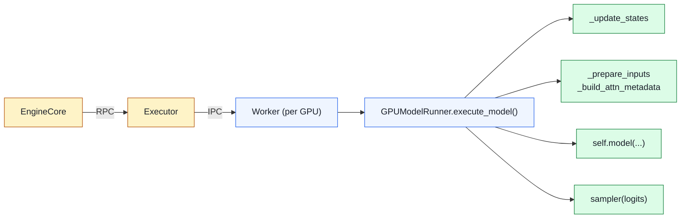

# 04. GPUModelRunner 源码深读

> **谁该读这一篇？** 已经搞清调度和 KV 管理，准备啃 vLLM 最长文件（3000+ 行）的 forward 工程实现的工程师；想答清"packed batch、slot_mapping、forward_context"等性能 trick 的同学。
>
> **前置阅读：** [`01-entry-points.md`](01-entry-points.md)、[`03-kv-cache-manager.md`](03-kv-cache-manager.md)、[`02-continuous-batching.md`](../02-core-concepts/02-continuous-batching.md)
>
> **耗时：** 约 22 分钟
>
> **学完能：**
> 1. 复述 `execute_model` 的 5 大阶段（update_states → prepare_inputs → mm encoder → forward → sample），每阶段干了什么
> 2. 解释 packed batch + `query_start_loc` 的设计为什么不需要 padding
> 3. 默写 `slot_mapping` 的计算公式与 PagedAttention 写入端的关系
> 4. 说明 InputBatch 持久化为何是 CUDA Graph 的前提条件
> 5. 看懂 `forward_context` 如何把 attention metadata 注入到无侵入式 nn.Module

文件：`vllm/v1/worker/gpu_model_runner.py`（3000+ 行，vLLM 最长的文件）。这是 Worker 进程里"每步前向 + 采样"的本体。看懂它就懂了 forward pass 的工程实现。

---

## 1. 角色定位



GPUModelRunner 不直接接触 HTTP / 调度，它只接受 `SchedulerOutput`，跑一遍 forward + sample，吐 `ModelRunnerOutput`。

---

## 2. 类的结构（line 411 起）

```python
class GPUModelRunner(KVConnectorModelRunnerMixin, LoraModelRunnerMixin):
    def __init__(self, vllm_config, device):
        # 持久化输入 batch：行索引稳定的请求 → buffer 映射
        self.input_batch = ...    # vllm/v1/worker/gpu_input_batch.py
        # 各种持久 GPU buffer（避免每步分配）
        self.input_ids_cpu = ...       # CPU 端 staging
        self.input_ids_gpu = ...       # GPU 端
        self.positions_gpu = ...
        self.slot_mapping_gpu = ...
        # 模型本体
        self.model: nn.Module          # Llama / Qwen / ...
        # 采样器
        self.sampler = ...             # vllm/v1/sample/sampler.py
        # 注意力 metadata builder（每种 backend 一个）
        self.attn_metadata_builders = ...
```

### 2.1 持久化 buffer：避免每步分配

vLLM 性能秘诀之一：所有"形状最大可能"的 tensor 在 init 时预分配，每步只填一部分。例如：

```python
self.input_ids_cpu = torch.zeros(max_num_tokens, dtype=torch.int32)
self.input_ids_gpu = torch.zeros(max_num_tokens, dtype=torch.int32, device="cuda")
```

每步：填前 `total_num_scheduled_tokens` 个槽位，剩余的不动。

为什么这样？**因为 CUDA Graph 要求 tensor 地址固定**。每步重新分配的话 graph 拒绝。

---

## 3. execute_model 的主循环（伪代码版）

`GPUModelRunner.execute_model(scheduler_output)`（实际函数比这复杂得多，先看骨架）：

```python
def execute_model(self, scheduler_output):
    # ===== Stage A: 更新内部状态 =====
    # 新请求加入 input_batch、旧请求移除、状态行重排序
    self._update_states(scheduler_output)

    # ===== Stage B: 准备 forward 输入 =====
    # 拷 token_ids 到 GPU、算 positions、组 block_table、算 slot_mapping
    model_input = self._prepare_inputs(scheduler_output)
    attn_metadata = self._build_attention_metadata(...)

    # ===== Stage C: 多模态 embedding（如果有图像/音频）=====
    multimodal_embeds = self._execute_mm_encoder(...)

    # ===== Stage D: 模型 forward =====
    # 走 CUDA Graph 或 eager；attn_metadata 通过 forward_context 传给每层
    with set_forward_context(attn_metadata, ...):
        hidden_states = self.model(
            input_ids=model_input.input_ids,
            positions=model_input.positions,
            intermediate_tensors=...,    # PP 用
            inputs_embeds=multimodal_embeds,
        )

    # ===== Stage E: 采样 =====
    # 只算 "需要 logits 的位置"（每个请求的最后一个 token）
    logits = self.model.compute_logits(hidden_states, sampling_metadata)
    sampler_output = self.sampler(logits, sampling_metadata)

    # ===== Stage F: 投机解码验证（如开启）=====
    if self.spec_decode:
        sampled = self._verify_and_accept(...)
    else:
        sampled = sampler_output.sampled_token_ids

    return ModelRunnerOutput(sampled_token_ids=sampled, ...)
```

---

## 4. _update_states：维护 InputBatch（line 1099）

这一段是 V1 的招牌优化——**不重建 batch，只更新 diff**。

```python
def _update_states(self, scheduler_output):
    # 1. 移除完成的请求（释放对应行）
    for req_id in scheduler_output.finished_req_ids:
        self.input_batch.remove_request(req_id)

    # 2. 应用 preempt（行先标 inactive）
    for req_id in scheduler_output.preempted_req_ids:
        ...

    # 3. 新请求加入：找一个空行索引塞进去
    for new_req in scheduler_output.scheduled_new_reqs:
        row = self.input_batch.add_request(new_req)
        # 持久 buffer 的对应行写入 prompt_token_ids、sampling_params 等

    # 4. 现有请求增量更新：block_table 加 block_id、num_computed_tokens++
    for cached_req in scheduler_output.scheduled_cached_reqs:
        self.input_batch.update_request(cached_req)
```

效果：100 个并发请求每步只更新几行（新增/删除/增量），不是重建 100 行。**CPU overhead 从 ms 级降到 μs 级**。

参考：`vllm/v1/worker/gpu_input_batch.py` 里 `InputBatch` 的实现。

---

## 5. _prepare_inputs：组 forward 输入（line 1835）

这一步把 InputBatch 里的逻辑数据搬到 GPU forward 需要的 tensor 形态。核心要产出：

```
input_ids:        [total_num_scheduled_tokens]       int32
positions:        [total_num_scheduled_tokens]       int64（RoPE 位置）
slot_mapping:     [total_num_scheduled_tokens]       int64（写入 KV cache 的位置）
block_table:      [num_reqs, max_blocks_per_req]     int32（读 KV cache）
query_start_loc:  [num_reqs + 1]                     int32
seq_lens:         [num_reqs]                         int32
```

### 5.1 slot_mapping：把新 token 的 KV 写哪？

对每个本步要计算的 token，slot_mapping 告诉 attention kernel：**"把这个 token 的 K、V 写到 KV cache 的哪个位置"**。

```
slot = block_table[req][token_idx // block_size] * block_size + (token_idx % block_size)
```

这是 PagedAttention "写入端" 的 indirection。Attention kernel 拿到 slot_mapping 后，直接按物理位置存。

### 5.2 batch 打平（packed batch）

所有请求的 token 拼成 **1D** 长 tensor：

```
请求 A (decode):  [a]
请求 B (decode):  [b]
请求 C (prefill 2048 token):  [c0, c1, ..., c2047]

input_ids = [a, b, c0, c1, ..., c2047]           # 长度 2050
query_start_loc = [0, 1, 2, 2050]                # A 在 [0,1)，B 在 [1,2)，C 在 [2,2050)
seq_lens = [N_A, N_B, N_C]                       # 含 KV cache 里的历史
```

FlashAttention 的 varlen 模式就吃这种打平输入。

---

## 6. _build_attention_metadata（line 2146）

每种 attention backend 有自己的 metadata。GPU runner 在 init 时给每个 attention 层创建一个 builder，每步调一次：

```python
def _build_attention_metadata(self, ...):
    metadata_per_layer = {}
    for layer_name, builder in self.attn_metadata_builders.items():
        metadata_per_layer[layer_name] = builder.build(
            num_actual_tokens=total_tokens,
            max_query_len=...,
            query_start_loc=...,
            seq_lens=...,
            block_table=...,
            slot_mapping=...,
        )
    return metadata_per_layer
```

`FlashAttentionMetadataBuilder` 等可以做 backend 特定的优化（如 FA3 的 scheduler_metadata 提前算好分片）。

---

## 7. forward 的"上下文注入"

forward 本身不能直接吃 metadata，因为模型代码（`vllm/model_executor/models/llama.py` 等）是普通 PyTorch nn.Module，签名固定。

vLLM 用 **forward_context** 这个 contextvars 把 attention metadata 注入：

```python
with set_forward_context(attn_metadata, vllm_config):
    hidden_states = self.model(input_ids, positions)
```

每个 `Attention layer.forward()` 内部从 forward_context 拿对应 layer 的 metadata，再调 backend。

代码：`vllm/forward_context.py`

---

## 8. 多模态：在 forward 前算 embedding

`vllm/v1/worker/gpu_model_runner.py` 的 `_execute_mm_encoder`（line 2813）和 `_gather_mm_embeddings`（line 3024）：

```python
# 1. 把图像/视频/音频喂给 vision encoder（如 CLIP / SigLIP）
mm_embeds = self.model.get_multimodal_embeddings(images, ...)
# 2. 把 token_ids 中的 placeholder（如 <image>）替换成对应 embed
input_embeds = self.model.get_input_embeddings(input_ids)
input_embeds = scatter_mm_embeds_into(input_embeds, mm_embeds, mm_positions)
# 3. forward 接受 inputs_embeds 而非 input_ids
hidden_states = self.model(inputs_embeds=input_embeds, ...)
```

vision encoder 也用 `encoder_cache_manager` 管 embed 复用（同一图片不重算）。

---

## 9. 采样：只算需要的 logits

`vllm/v1/sample/`

注意：不是每个 token 都需要 logits！

- prefill chunk 中间的 token：只是为了写 KV cache，不需要 logits
- 一个请求的最后一个 scheduled token：需要 logits 来采样下一个 token

ModelRunner 算 logits 时只对这些位置算：

```python
# compute_logits 的 indices_to_sample 参数告诉它哪些行需要
logits = self.model.compute_logits(hidden_states, sampling_metadata)
# logits.shape = [num_reqs_to_sample, vocab_size]
```

这是巨大节省：每个 prefill 请求只算 1 行 logits，不是 N 行。

---

## 10. CUDA Graph 集成

GPUModelRunner 在启动时 `capture_model()` 录制多个 batch_size 的 graph：

```python
def capture_model(self):
    for size in self.cudagraph_capture_sizes:  # [1, 2, 4, 8, ..., max]
        # 用 dummy 输入跑一遍 forward，CUDA 录制到 graph
        ...
```

runtime 时：

```python
if total_num_scheduled_tokens in self.cudagraph_sizes:
    # 用对应 graph replay
    graph = self.graphs[total_num_scheduled_tokens]
    graph.replay()
else:
    # 找最近的 capture size，pad 然后 replay
    ...
```

代码：`vllm/v1/cudagraph_dispatcher.py`

---

## 11. 推荐阅读顺序

读 3000 行的文件需要策略：

1. **先读类成员**（line 411-880）：知道有哪些 buffer 和 sub-component
2. **跳过初始化细节**（init 各种 buffer），直奔 `execute_model`
3. **拆五大阶段**：每个阶段单独读一遍
   - `_update_states`（line 1099）
   - `_prepare_inputs`（line 1835）
   - `_build_attention_metadata`（line 2146）
   - 然后是 mm encoder、forward、采样
4. **配合**：打开 `vllm/forward_context.py`、`vllm/v1/sample/sampler.py` 一起看

---

## 12. 面试常见追问

**Q: vLLM 一次 forward 为什么不用 padding？**
A: 用 packed batch（打平）+ `query_start_loc` 描述每个请求的范围。FlashAttention varlen 模式直接吃这种输入。比 padding 节省算力（不算无效位置）。

**Q: `slot_mapping` 是干嘛的？**
A: 每个本步要算的 token 的 KV 要写到 KV cache 张量的哪个位置（物理地址）。是 PagedAttention 写入端的 indirection 表。

**Q: 为什么不是每个 token 都算 logits？**
A: 只有"要采样下一个 token 的位置"需要 logits。一个 N token 的 prefill 只对最后一个 token 算 logits，节省 99% 的 LM head 计算（vocab_size 通常 32k-256k，是大头）。

**Q: InputBatch 持久化的核心好处？**
A: ①避免每步重新分配 GPU tensor；②满足 CUDA Graph 对固定地址的要求；③Python overhead 从 ms 降到 μs（不必重排列 100 行）。

---

## 小结

- `execute_model` 五阶段：`_update_states` 增量改 InputBatch、`_prepare_inputs` 组 GPU tensor、`_build_attention_metadata` 按 backend 生成元数据、forward 跑模型、sample 算 logits 并采样。
- packed batch + `query_start_loc` 让 vLLM 无需 padding，所有请求拼成一条 1D 序列喂给 FlashAttention varlen。
- `slot_mapping` 是 PagedAttention 写入端的 indirection：`block_table[req][i // bs] * bs + i % bs`，决定本步每个新 token 的 KV 写到哪里。
- 所有"形状最大"的 GPU buffer 在 init 时预分配，每步只覆盖前 N 行——既是性能优化，又是 CUDA Graph 要求 tensor 地址固定的前提。
- `forward_context` 用 contextvars 把 attention metadata 透传给 nn.Module，让模型代码保持普通 PyTorch 风格。

## 自检

> 答案不必照搬，能讲到关键点即可。

**1. 新请求加入 InputBatch 的 row 分配规则？是否复用 free row？**

**规则**：维护一个 `free_rows` 集合（位图或 list）。新请求来时优先从 `free_rows.pop()` 取**最小空闲 row index**；没有空闲时往 `next_row` 扩。请求结束 / preempt 时把 row 加回 `free_rows`。

**关键**：**复用 free row 而不重新分配**。原因：

- InputBatch 是预分配的固定大 buffer（`[max_num_seqs, max_model_len]`）
- 复用 row 意味着 GPU tensor 地址不变 → CUDA Graph 可以跨 step 复用
- 紧致填充（取 min index）→ 实际跑的 batch 是 `input_batch[:num_active_rows]`，省去对未用 row 的计算

源码定位：`gpu_model_runner.py` 找 `_update_states` 或 `_add_request_to_input_batch`，关键变量是 `self.free_rows`。

---

**2. prefill 1024 token, 最终算多少 logits？为什么省 99%？**

**只算 1 条 logits**（最后一个 token 的 hidden_state → lm_head）。

**为什么？**

- Prefill 的目的是把 prompt 的 KV 写入 cache，**不需要中间每个 token 的 logits**——这些 token 是用户给的，已知
- 只有最后一个 token 的 logits 用来采样**第一个新 token**

**节省**：lm_head 是 `[H, V]` 矩阵乘（hidden × vocab_size），V 通常 128K，**单次 lm_head 计算 ≈ 8192 × 128000 × 2 bytes ≈ 2 GB 显存读取**。1024 token 全算 = 2 TB 读取；只算 1 个 = 2 GB。**省了 99.9%**。

实现：`gpu_model_runner.py` 里 `_select_last_token_indices` / `_compute_logits_for_last_token`——只把每个序列的最后一个 token 的 hidden state 喂 lm_head。

加分点：spec decode 例外——草稿 token 要 logits 验证，所以 prefill+decode 算多条 logits。

---

**3. `query_start_loc` / `seq_lens` / `max_query_len` 语义 + 为什么 varlen 需要 `query_start_loc`？**

假设 3 个请求 packed batch：req A 跑 100 token (prefill chunk), req B 跑 1 token (decode), req C 跑 50 token (prefill chunk)：

| 字段 | 形状 | 内容 | 含义 |
| --- | --- | --- | --- |
| `query_start_loc` | `[num_seqs+1]` = `[4]` | `[0, 100, 101, 151]` | 每个请求在 packed batch 中的起始位置（前缀和）|
| `seq_lens` | `[num_seqs]` = `[3]` | `[5000, 200, 1050]` | 每个请求**完整的 K/V 序列长度**（含已 cached 的 prefix）|
| `max_query_len` | scalar | `100` | 本步最长 query（max over A/B/C 的 query 长度）|

**为什么 varlen 需要 `query_start_loc`？**

FlashAttention varlen kernel 把所有 query 拼成 1D `[total_query_tokens, num_heads, head_dim]` 张量。kernel 需要知道**第 i 个 token 属于哪个序列**才能：

1. 用正确的 `block_table[seq_id]` 找它的历史 K/V
2. 用正确的 `seq_lens[seq_id]` 算 attention mask

`query_start_loc` 让 kernel O(log n) 二分找到 seq_id（或者通过 CTA 调度时静态指派）。**没有它，varlen 退化为 padded batch**——每个序列 pad 到 `max_query_len`，浪费 75%+ 算力。

---

**4. 加一个全新 attention backend, `gpu_model_runner.py` 之外要改哪些文件？**

| 文件 | 改什么 |
| --- | --- |
| `vllm/v1/attention/backends/<new_backend>.py` | 实现 `AttentionBackend` 接口：`get_metadata_class()`、`get_impl_class()`、`get_kv_cache_shape()` |
| 同一文件里 | 实现 `AttentionMetadataBuilder`：从 SchedulerOutput 构造 metadata；以及 `AttentionImpl.forward` 调底层 kernel |
| `vllm/v1/attention/selector.py`（或 backend selector）| 在 `_Backend` enum 加新条目；加 `supports_*` 检查逻辑；在 `get_attn_backend()` 中添加选择路径 |
| `vllm/platforms/<platform>.py` | 在 platform 默认 backend 决策树中加新分支 |
| `vllm/v1/attention/backends/utils.py` | 如果新 backend 用通用 metadata 字段，加 helper |
| `tests/v1/attention/test_<new_backend>.py` | 单测 + 与 FlashAttention 数值一致性测试 |

可选：

- `csrc/<new_backend>/`：如果需要新 CUDA kernel
- `vllm/_custom_ops.py`：注册 PyTorch op

**最重要的事**：保证新 backend 与 PagedAttention 接口兼容，`get_kv_cache_shape()` 返回的 shape 要让 KV manager 正确分配。

---

**5. CUDA Graph 为什么需要 InputBatch 持久化？每步重分配会怎样？**

**CUDA Graph 录制时**："把 `kernel A(input_ids_ptr_0x1234)` 这条指令录下来"。input_ids 的**GPU 内存地址** `0x1234` 被编码到 graph 里。

如果每步 `input_ids = torch.zeros(...)` 重新分配：

- 新 tensor 地址是 `0x5678`，与 graph 录制的 `0x1234` 不符
- replay graph 会读 `0x1234` 那块内存——里面是上一步的旧值（如果还没释放）或随机数据
- **结果错误，不报错**——CUDA Graph 不验证地址内容，沉默崩坏最难查

**InputBatch 持久化**：`self.input_ids_buf = torch.zeros(max_size, ...)` 在 init 时分配一次，每步往 buf[:n] copy 新内容。地址 `0x1234` 永远是这个 buf 的起始 → graph 录制有效。

加分点：实际还要把 batch_size pad 到 capture 过的尺寸之一（如 [1,2,4,8,16,...,max_num_seqs]）。这就是为什么 vLLM 启动时要 capture 多个 graph（`cudagraph_capture_sizes`）。

## 下一步

- 下一节：[`05-attention-backends.md`](05-attention-backends.md)（ModelRunner 调用的 attention backend 是怎样的接口，FlashAttention 实现长什么样）
- 想看源码：`vllm/v1/worker/gpu_model_runner.py`、`vllm/v1/worker/gpu_input_batch.py`、`vllm/forward_context.py`
- 想动手：[`07-hands-on/04-profiling-and-debugging.md`](../07-hands-on/04-profiling-and-debugging.md)（用 nsys 看 `_prepare_inputs`、forward、sample 各自占比）
- 想从生产视角理解：[`08-production-deployment/04-autoscaling-and-capacity.md`](../08-production-deployment/04-autoscaling-and-capacity.md)（CUDA Graph 的 capture size 列表对吞吐/延迟的影响）

