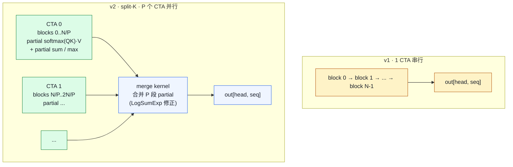

# 06. CUDA Kernels：从 paged_attention 到自定义算子

> **谁该读这一篇？** 想看一眼 `csrc/` 真实 kernel、能在面试中聊一聊 CUDA 细节加分的工程师；以及未来打算改 / 写 vLLM 自定义算子的人。
>
> **前置阅读：** [`05-attention-backends.md`](05-attention-backends.md)、[`01-paged-attention.md`](../02-core-concepts/01-paged-attention.md)、[`00-prerequisites.md`](../01-overview/00-prerequisites.md)
>
> **耗时：** 约 18 分钟
>
> **学完能：**
> 1. 在 `csrc/` 里准确定位 5 个以上重要 kernel 文件并说出用途
> 2. 解释 paged_attention v1 的 grid/block 设计（per head × per seq 一个 CTA）
> 3. 描述 v2 的 split-K 解决的问题（decode 小 batch 填不满 SM）
> 4. 说明 attention kernel 怎么用 `block_tables` 间接读 KV cache
> 5. 说出 vLLM 现在主用 FlashAttention/FlashInfer、自家 kernel 作为 fallback 的工程取舍

目录：`csrc/`。这是 vLLM 的 C++ / CUDA 部分。本节带你穿过最重要的几个文件，看 PagedAttention v1/v2 的真实 kernel 实现。面试不一定会问 CUDA 细节，但你能聊一聊会有加分。

---

## 1. csrc/ 总览

```
csrc/
├── attention/                       ← PagedAttention 内核（核心！）
│   ├── attention_kernels.cuh        - 核心 kernel 模板
│   ├── attention_utils.cuh          - dot product / softmax 辅助
│   ├── paged_attention_v1.cu        - launcher v1（单 split）
│   ├── paged_attention_v2.cu        - launcher v2（split-K，长序列加速）
│   ├── merge_attn_states.cu         - v2 的归并阶段
│   └── dtype_*.cuh                  - FP16 / BF16 / FP8 类型支持
├── cache_kernels.cu                 ← KV reshape / copy 等辅助
├── activation_kernels.cu            ← SiLU / GeLU 等
├── layernorm_kernels.cu             ← RMSNorm / fused RMSNorm + add
├── pos_encoding_kernels.cu          ← RoPE
├── moe/                             ← MoE 路由 + 分组 GEMM
├── quantization/                    ← FP8 / GPTQ / AWQ / Marlin / Machete
├── custom_all_reduce.cu             ← 自定义 AllReduce（小消息 NVLink 优化）
├── cumem_allocator.cpp              ← CUDA 内存池
├── sampler.cu                       ← top-k/top-p sampling
└── torch_bindings.cpp               ← pybind11/torch.ops 注册入口
```

`torch_bindings.cpp` 是 Python 端 `torch.ops.vllm_C.*` 的入口；其他 .cu 文件实现具体 kernel。

---

## 2. PagedAttention v1：单 block 一线程组

`csrc/attention/paged_attention_v1.cu`

### 2.1 launcher（line 46-）

```cpp
template <typename T, typename CACHE_T, int BLOCK_SIZE,
          vllm::Fp8KVCacheDataType KV_DTYPE, bool IS_BLOCK_SPARSE,
          int NUM_THREADS = 128>
void paged_attention_v1_launcher(
    torch::Tensor& out, torch::Tensor& query, torch::Tensor& key_cache,
    torch::Tensor& value_cache, int num_kv_heads, float scale,
    torch::Tensor& block_tables, torch::Tensor& seq_lens, int max_seq_len,
    ...) {
    int num_seqs = query.size(0);
    int num_heads = query.size(1);
    int head_size = query.size(2);
    int max_num_blocks_per_seq = block_tables.size(1);
    int q_stride = query.stride(0);
    int kv_block_stride = key_cache.stride(0);
    int kv_head_stride = key_cache.stride(1);
    ...

    dim3 grid(num_heads, num_seqs, 1);     // 每个 head × 每个 sequence 一个 CTA
    dim3 block(NUM_THREADS);               // 128 threads / CTA

    vllm::paged_attention_v1_kernel<T, CACHE_T, HEAD_SIZE, BLOCK_SIZE, ...>
        <<<grid, block, shared_mem_size, stream>>>(...);
}
```

**线程组织**：

- grid：`(num_heads, num_seqs)` —— 每个 (head, seq) 一个 CTA（thread block）
- block：128 threads 协作处理一个 (head, seq) 的 attention
- shared memory：存 partial logits 和归约结果

这是 decode 阶段的 layout（query 长度 = 1）。

### 2.2 kernel 主体（concept）

实际 kernel 在 `attention_kernels.cuh`，简化思路如下：

```cuda
__global__ void paged_attention_v1_kernel(
    out, query, key_cache, value_cache,
    block_tables, seq_lens, ...
) {
    int seq_idx = blockIdx.y;
    int head_idx = blockIdx.x;
    int seq_len = seq_lens[seq_idx];
    int num_blocks = (seq_len + BLOCK_SIZE - 1) / BLOCK_SIZE;

    // 1. 把这个 head 的 query 加载到寄存器
    T q[head_size / threads];

    // 2. 遍历所有 KV block，算 QK^T / sqrt(d)
    for (int b = 0; b < num_blocks; b++) {
        int phys_block = block_tables[seq_idx * max_blocks + b];   // ← 间接寻址！
        T k_block[BLOCK_SIZE][head_size_per_thread];
        // 从 key_cache 加载 phys_block 那段
        load_K(k_block, key_cache + phys_block * kv_block_stride);

        // 算这一 block 的 logits（写到 shared memory）
        for (int t = 0; t < BLOCK_SIZE; t++)
            logits[b * BLOCK_SIZE + t] = dot(q, k_block[t]) * scale;
    }

    // 3. softmax（在 shared memory 上 reduce）
    softmax(logits, seq_len);

    // 4. 第二遍遍历 block，算 logits @ V
    T acc = 0;
    for (int b = 0; b < num_blocks; b++) {
        int phys_block = block_tables[seq_idx * max_blocks + b];
        T v_block[BLOCK_SIZE][head_size_per_thread];
        load_V(v_block, value_cache + phys_block * kv_block_stride);
        for (int t = 0; t < BLOCK_SIZE; t++)
            acc += logits[b * BLOCK_SIZE + t] * v_block[t];
    }

    // 5. 写回 out
    out[seq_idx, head_idx] = acc;
}
```

**核心 trick 是 `block_tables[seq_idx * max_blocks + b]` 这一行**——把 paged 寻址完全在 kernel 内部用 indirection 完成，对调用者透明。

---

## 3. PagedAttention v2：split-K 并行

长序列（几千 token）时，v1 一个 CTA 串行算所有 block，性能不好。v2 用 **split-K**：

`csrc/attention/paged_attention_v2.cu`



`merge_attn_states.cu` 负责"合并 partial softmax"——用 LogSumExp trick 把多段 partial softmax 拼成正确的全段 softmax。

**为什么 split-K 有用？**

- decode 一个请求只有 1 个 query token，一个 head 一个 CTA → CTA 数 = head 数 × seq 数
- 假设 num_heads = 32, batch = 1，只有 32 个 CTA，跑不满 H100 的 132 个 SM
- split-K 把每个 (head, seq) 拆 P 份，CTA 数 = 32 × P，能填满 SM

---

## 4. 现代实现：FlashAttention v3 + FlashInfer 接管

如本课程前面提到的，vLLM 现在主用：

- `vllm-flash-attn`（vllm 维护的 fork，FA2/FA3）
- `flashinfer`

它们都通过 Python 包提供，**不在 csrc/ 里**。vLLM 自己的 `paged_attention_v1/v2.cu` 现在主要作为 fallback。

但学习目的上看 v1/v2 仍很值：你能搞懂 paged 寻址、shared memory 用法、split-K reduction，这些是 attention kernel 的通用思想。

---

## 5. 其他重要 kernel

### 5.1 layernorm_kernels.cu

实现：

- `rms_norm` —— 标准 RMSNorm
- `fused_add_rms_norm` —— x + residual → RMSNorm，省一次 launch
- `fused_rms_norm_quant` —— RMSNorm + 输出 FP8 量化

为什么 fused？因为 RMSNorm 是 memory-bound，融合后只读一次 input。

### 5.2 pos_encoding_kernels.cu

RoPE（旋转位置编码）的高效实现。对 Q、K 同时做 cos/sin 旋转。

### 5.3 activation_kernels.cu

SiLU、GeLU、SwiGLU（Llama MLP 用）。

```cuda
__global__ void silu_and_mul_kernel(out, input) {
    // input = [gate, up]（concat），out = silu(gate) * up
    // Llama MLP 的核心非线性
}
```

注意 `silu_and_mul` 是融合的 op：把 SwiGLU 的两个分量同时算 + 相乘 + 写出。

### 5.4 cache_kernels.cu

KV cache 辅助：reshape、copy（用于 swap in/out、KV connector）、scaled store。

### 5.5 sampler.cu

top-k / top-p sampling 的 GPU 实现。decode 的最后一步。

### 5.6 quantization/

各种量化 GEMM kernel：

- `fp8/` —— FP8 matmul
- `gptq_marlin/` —— GPTQ INT4 W × FP16 A 的 Marlin kernel（INT4 推理性能秘诀）
- `awq/` —— AWQ INT4
- `machete/` —— H100+ 上更快的 mixed-precision GEMM

---

## 6. 怎么把 C++ kernel 暴露给 Python？

`csrc/torch_bindings.cpp` 用 `TORCH_LIBRARY_FRAGMENT` 注册：

```cpp
TORCH_LIBRARY_FRAGMENT(_C, ops) {
    ops.def(
        "paged_attention_v1("
        "  Tensor! out, Tensor query, Tensor key_cache, Tensor value_cache,"
        "  int num_kv_heads, float scale, Tensor block_tables, Tensor seq_lens, ..."
        ") -> ()"
    );
    ops.impl("paged_attention_v1", torch::kCUDA, &paged_attention_v1);
}
```

Python 调用：`torch.ops._C.paged_attention_v1(out, query, ...)`

这种方式让 op 能参与 `torch.compile` 的图融合。

---

## 7. 自己改 CUDA kernel 的工作流

万一面试官真问"如果让你优化某个 kernel 你会怎么做"，给个标准答案：

1. **profile**：用 Nsight Compute 看当前 kernel 的瓶颈
   - memory-bound? compute-bound? launch overhead?
2. **shared memory layout**：避免 bank conflict
3. **vectorize**：用 `float4` / `__half2` 把多个元素一次读写
4. **register tile**：把热数据放寄存器，减少 shared memory 访问
5. **CUDA Graph**：消 launch overhead（已默认）
6. **tensor core**：让 GEMM 走 WMMA / MMA 指令
7. **fusion**：减少 kernel 数（RMSNorm + 后续 op）

vLLM 的 kernel 都是按这套优化的。

---

## 8. 推荐阅读顺序

如果你想真正读 CUDA：

1. `csrc/torch_bindings.cpp` —— 入口
2. `csrc/attention/paged_attention_v1.cu` —— launcher，理解 grid/block 怎么组
3. `csrc/attention/attention_kernels.cuh` —— 真正的 kernel 模板（高难度）
4. `csrc/layernorm_kernels.cu` —— 简单点的，看 reduce 怎么写
5. `csrc/activation_kernels.cu` —— 最简单，热身用
6. （进阶）`csrc/quantization/gptq_marlin/` —— Marlin 是 SOTA 的 INT4 GEMM

---

## 9. 面试常见追问

**Q: PagedAttention 的 CUDA kernel 跟普通 attention 有什么区别？**
A: 核心区别是 KV 读取走 `block_tables[seq_idx * max_blocks + b]` 间接寻址，物理 block 不连续。其他（softmax、reduction）一样。代价是多一层指针 chase，但 block_size=16 摊薄了开销。

**Q: split-K 在 attention 里是什么？**
A: 把同一个 query 的 KV 序列拆成 P 段，P 个 CTA 各算部分 softmax(QK)·V，最后一个 merge kernel 用 LogSumExp 合并。在长 seq、小 batch 时让 CTA 数 ×P 填满 SM。

**Q: 你看过 FlashAttention 的 kernel 吗？**
A: 老实说"我读过 paged_attention_v1，比较通俗；FlashAttention 我读过论文但 kernel 没读，因为它用了 TMA 和 WGMMA 指令，门槛很高。"——这是诚实又有 hook 的答法。

**Q: vLLM 为什么放弃自己的 kernel 用 FlashAttention？**
A: 性能。FlashAttention v2/v3 由 Tri Dao 团队持续优化，针对最新硬件（TMA、WGMMA、async copy）做了极致优化；vLLM 自己写跟不上。把精力放在调度和内存管理这些高 ROI 的层。

---

## 小结

- `csrc/attention/paged_attention_v1/v2.cu` 是 PagedAttention 自家 kernel；现在主用 vllm-flash-attn / FlashInfer，自家 kernel 作为 fallback。
- v1 的 grid 是 `(num_heads, num_seqs)`，每个 (head, seq) 一个 CTA，128 threads；适合普通 batch。
- v2 用 split-K 把每个 (head, seq) 拆 P 段并行算，再用 `merge_attn_states.cu` 按 LogSumExp 合并；解决"decode 小 batch 时 CTA 数填不满 SM"。
- 间接寻址 `block_tables[seq_idx * max_blocks + b]` 是 paged 寻址的核心，所有 paged attention kernel 共享这个思想。
- 其他重要 kernel：layernorm（fused RMSNorm）、pos_encoding（RoPE）、activation（silu_and_mul）、quantization（Marlin/Machete）、moe（topk_softmax / align_block_size）。

## 自检

> 答案不必照搬，能讲到关键点即可。

**1. v1 的 grid 维度 `(num_heads, num_seqs)` 为什么不反过来？**

`dim3 grid(num_heads, num_seqs)` → 总共 `num_heads × num_seqs` 个 CTA。每个 CTA 算 `(head_i, seq_j)` 这一对的完整 attention。

**为什么 `num_heads` 在前？**

- CUDA grid 第一维 `gridDim.x` 是 32-bit 上限大（约 2^31），第二维 `gridDim.y` 上限 65535
- `num_heads` 可能很大（多头 attention，64 头 + 多层即可达上千）→ 放第一维更安全
- `num_seqs` 通常 < 256（batch size 受 KV 容量限制）→ 65535 足够

**反过来会怎样？** `dim3 grid(num_seqs, num_heads)` 行为上一致，但如果 `num_heads > 65535`（不太可能但理论上）就 launch 失败。属于工程防御性设计。

加分点：grid 形状不影响 GPU 调度（GPU 实际是按 block id 线性派发，二维只是程序员视角）。重要的是**总 CTA 数 ≥ SM 数 × 每 SM 容量**才能填满 GPU。

---

**2. v2 split-K 划分粒度由哪个参数控制？P 大 vs 小权衡？**

参数：`partition_size`（一般 256 或 512 token）。

```
num_partitions = ⌈seq_len / partition_size⌉ = P
grid = (num_heads, num_seqs, P)
```

**P 大（细粒度切）的优势 / 代价**：

- ✓ CTA 数翻 P 倍，小 batch 下也能填满 SM
- ✗ merge kernel 工作量翻 P 倍
- ✗ 每个 partition 太短的话，attention 计算量摊到 partition 启动开销上

**P 小**：相反——长 seq + 大 batch 时 P=1 即可（每 CTA 算完全 seq）。

**自适应选择**：vLLM 启发式：`if num_seqs × num_heads < SM_count: 增大 P 填满 GPU`。代码在 `paged_attention_v2_launcher` 入口处。

→ 典型用例：单请求 decode（num_seqs=1, num_heads=64）+ seq_len=10K，P=20 让 64×20 个 CTA 跑满 132 SM。

---

**3. `silu_and_mul_kernel` 为什么 fusion？分开写损失在哪？**

公式：`y = silu(a) * b`，其中 a 和 b 是同形 tensor。

**Fused kernel**：

```cuda
y[i] = silu(a[i]) * b[i]   // 一次 load a + load b, 一次 store y
```

**分开两个 kernel**：

```cuda
// kernel 1: tmp = silu(a)
tmp[i] = silu(a[i])         // load a, store tmp
// kernel 2: y = tmp * b
y[i] = tmp[i] * b[i]        // load tmp, load b, store y
```

**性能损失**：

- 多一次 store + load `tmp`：tmp 是 `[B, I_local]` 大小，FP16 下数 MB 级，进出 HBM
- 多一次 kernel launch：~5 μs overhead
- 这两个 op 都是 element-wise，**纯 memory-bound**——多走一次 HBM 就慢一倍

**实测**：Llama SwiGLU MLP 每层有 silu_and_mul，80 层一次 forward → fusion 省 80 × (一次 HBM 多余读写) ≈ 几个 ms。decode 时占总时长 1-3%。

→ 所有 element-wise + element-wise 的相邻 op 都该 fusion。这是 PyTorch torch.compile 自动 fusion 的核心 use case；手写 CUDA 是它的下限。

---

**4. `torch_bindings.cpp` 注册的 op 怎么被 Python 调用？**

```cpp
// csrc/torch_bindings.cpp（简化）
TORCH_LIBRARY_EXPAND(vllm_C, m) {
    m.def(
        "paged_attention_v1(Tensor! out, Tensor query, Tensor key_cache, "
        "Tensor value_cache, Tensor block_tables, ...) -> ()",
        paged_attention_v1
    );
}
```

**Python 端调用**：

```python
import torch

out = torch.empty_like(query)
torch.ops.vllm_C.paged_attention_v1(
    out,                # 输出（in-place 写）
    query,              # [num_tokens, num_heads, head_size]
    key_cache,          # [num_blocks, ...]
    value_cache,        # [num_blocks, ...]
    block_tables,       # [num_seqs, max_num_blocks_per_seq]
    seq_lens,
    block_size,
    max_seq_len,
    alibi_slopes,       # 可选
    kv_cache_dtype,
    k_scale,
    v_scale,
)
```

vLLM 通常通过 `vllm/_custom_ops.py` 的 wrapper 调用：

```python
# vllm/_custom_ops.py
def paged_attention_v1(out, query, ...):
    torch.ops.vllm_C.paged_attention_v1(out, query, ...)
```

**好处**：`torch.ops.*` 是 PyTorch 已知 op，torch.compile 不会 graph break（fusion 跨越它）。如果直接 ctypes 调 CUDA，torch.compile 会被打断。

---

**5. 给 paged_attention 加 sliding window 支持，从哪个 .cuh 开始？**

入口：**`csrc/attention/attention_generic.cuh`** 或者 **`csrc/attention/attention_kernels.cuh`**——这里定义了 attention 的内层循环（遍历 token、算 softmax）。

修改思路：

1. 在 inner loop 加 mask：`if (token_idx < seq_len - window_size) continue;`——跳过滑窗外的 K/V
2. 修 reduction：sliding window 模式下不需要全 seq softmax，只需要窗口内
3. attention metadata 加 `window_size` 字段从 Python 传进来
4. `paged_attention_v1_launcher` 接收新参数并传给 kernel template

**注意点**：

- sliding window 与 prefix caching 不太兼容（窗口滑过的部分被覆盖）——要么单独存窗口外的 KV，要么 Mistral 那种纯 sliding window 模型直接丢掉历史
- 想看现成实现：FlashAttention 已有 `window_size` 参数，vLLM 的 `vllm/v1/attention/backends/flash_attn.py` 把它传下去就行——**别自己手写 CUDA**，直接复用 FlashAttention

→ 这道题其实是个 trap：现代实现都不动自家 CUDA kernel，统一用 FlashAttention paged 版本。"先复用现有"是正确答案。

## 下一步

- 下一节：[`07-model-architectures.md`](07-model-architectures.md)（MLA / Mamba / MoE 三类非标准架构在 vLLM 里的源码挂载点）
- 想看源码：`csrc/attention/`、`csrc/torch_bindings.cpp`、`csrc/quantization/gptq_marlin/`
- 想动手：[`07-hands-on/04-profiling-and-debugging.md`](../07-hands-on/04-profiling-and-debugging.md)（用 Nsight Compute 看一个 kernel 的 SM 利用率）
- 想从生产视角理解：[`08-production-deployment/06-reliability-and-failure-modes.md`](../08-production-deployment/06-reliability-and-failure-modes.md)（kernel 升级 / fallback 引入的稳定性风险）

