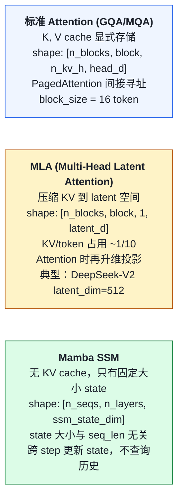
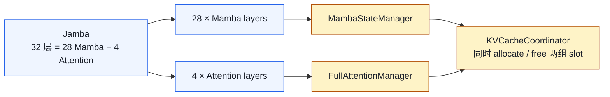
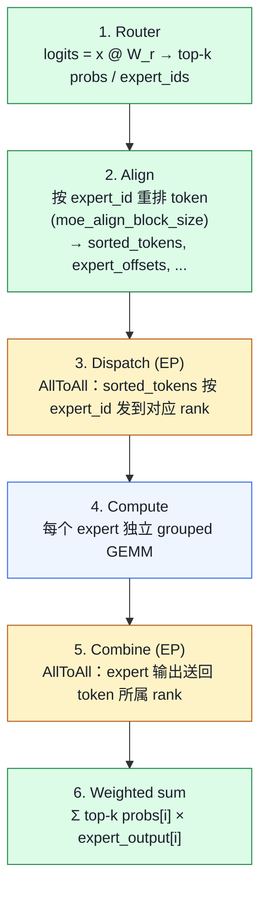

# 07. 模型架构特异：MLA / Mamba / MoE 在 vLLM 源码层

> **谁该读这一篇？** 已经掌握标准 Llama 路径，想了解 DeepSeek MLA / Mamba SSM / Mixtral MoE 这三类"非标准"模型如何挂载到 vLLM 通用机制上的工程师。
>
> **前置阅读：** [`04-model-runner.md`](04-model-runner.md)、[`05-attention-backends.md`](05-attention-backends.md)、[`03-kv-cache-management.md`](../02-core-concepts/03-kv-cache-management.md)
>
> **耗时：** 约 22 分钟
>
> **学完能：**
> 1. 解释 MLA 怎么让 KV 占用降到约 1/8，以及代价是什么
> 2. 描述 Mamba state 与 KV block 的本质差异，以及 vLLM 怎么通过 SingleType 抽象统一管理
> 3. 画出 MoE 一层 forward 的 Router → Align → Dispatch → Compute → Combine → Weighted sum 流程
> 4. 说出 EPLB 解决什么问题、控制平面如何动作
> 5. 在 vLLM 源码里定位 MLA / Mamba / MoE 各自的 backend / layer / kernel 文件

Llama / Qwen / GPT 都是"标准 transformer + GQA"。但生产里你会遇到 DeepSeek-V2/V3 的 MLA（latent KV）、Mamba / Mamba2 / Jamba 的 SSM 状态（非 KV）、Mixtral / DeepSeek MoE 的 Top-k expert routing。这三类把 vLLM 通用机制"拉扯"得最厉害，本节把每种的源码挂载点讲清。

---

## 1. 标准注意力 vs MLA vs SSM 一图对比



---

## 2. MLA（DeepSeek-V2 / V3）

### 2.1 算法核心
标准 GQA：每层每头存 `K, V`（high-rank、大）。
MLA：把 K、V 压到 `latent_kv`（low-rank、~1/10）。Attention 时**临时**升维：

```
# 训练 / 推理时：
c_kv = x @ W_dkv       # [N, latent_d]
W_uk, W_uv 是 layer-fixed
K = c_kv @ W_uk        # 临时升维
V = c_kv @ W_uv

# Cache 只存 c_kv（小）
```

KV 占用从 `2 × n_kv_h × head_d` 降到 `latent_d`。Llama-70B 标准 ~256 byte/token，DeepSeek-V3 MLA ~30 byte/token（约 1/8）。

### 2.2 vLLM 源码挂载点

`vllm/v1/attention/backends/mla/`：

```
__init__.py
cutlass_mla.py          ← H100 CUTLASS 高性能实现
flashattn_mla.py        ← FlashAttention 的 MLA 变体
flashmla.py             ← FlashMLA（DeepSeek 开源 kernel）
flashinfer_mla.py       ← FlashInfer 实现
triton_mla.py           ← Triton fallback
rocm_aiter_mla.py       ← AMD ROCm
flashmla_sparse.py      ← MLA + sparse attention（DSv4）
indexer.py              ← MLA 特定的 indexer
```

主入口（包装层）：`vllm/model_executor/layers/mla.py:34`：

```python
class MultiHeadLatentAttentionWrapper(PluggableLayer):    # line 34
    """包装一个 MLA 层，给上层（attention layer base）统一接口。"""

    def __init__(self, config, ...):
        self.mla_modules = MLAModules(...)
        # 内部：down_proj (W_dkv)、up_proj (W_uk, W_uv)、RoPE 处理

    def forward(self, hidden_states, positions, kv_cache, attn_metadata, ...):
        # 1. down_proj → c_kv
        # 2. RoPE 加位置（注意：MLA 用 decoupled RoPE）
        # 3. 写 c_kv 到 KV cache（按 slot_mapping）
        # 4. attention：内部完成 c_kv → K/V 升维 + softmax(QK)V
        return output
```

### 2.3 与 KV manager 的接缝

`vllm/v1/core/kv_cache_coordinator.py` 协调多 KV 类型。MLA 模型的 KV cache shape 不同：

```
# 普通 GQA：(2, n_blocks, block, n_kv_h, head_d)
# MLA：    (n_blocks, block, 1, latent_d + rope_d)
```

KVCacheManager 通过 `KVCacheSpec` 区分类型，单 manager 不混合，多类型用 coordinator 统一。

### 2.4 Decoupled RoPE
MLA 的 RoPE 不能简单作用于 latent，因为升维后位置信息失真。
DeepSeek 的解决：把 head 拆成"含 RoPE"和"不含 RoPE"两部分，各自处理。
代码体现：MLAModules 内部 W_dkv 也拆 rope / nope 两段。

---

## 3. Mamba SSM

### 3.1 算法核心
Mamba 是 State Space Model，**不算 attention**。每个 token：

```
y_t, state_t = SSM(x_t, state_{t-1})
```

state 大小固定（与 seq_len 无关），是个 `[d_state, d_inner]` 的 tensor。比 transformer attention 在长序列上**算力线性**而非二次。

### 3.2 vLLM 源码挂载点

```
vllm/model_executor/layers/mamba/
├── abstract.py
├── mamba_mixer.py         ← Mamba v1
├── mamba_mixer2.py        ← Mamba v2（更高效）
├── gdn_linear_attn.py     ← GDN（Gated Delta Net，Qwen3 系列用）
├── linear_attn.py         ← Linear Attention 系列
├── short_conv.py          ← Mamba 前置 1D conv
├── lamport_workspace.py   ← Mamba 跨 step state 持久化
└── ops/                   ← Triton kernel（selective_scan）
```

### 3.3 KV 之外的"状态管理"

Mamba state 不是 KV，不能用 BlockPool 管。但 vLLM V1 把它统一抽象到：

```
vllm/v1/core/single_type_kv_cache_manager.py
   ├── FullAttentionManager
   ├── SlidingWindowManager
   ├── MambaStateManager       ← 这里
   └── ...
```

每种 manager 实现 KVCacheManager 的接口（allocate_slots / free / cache_blocks），但内部物理布局完全不同：

- Full attention：paged blocks
- Mamba：连续的 `[n_running, n_layers, ssm_state]` tensor，每个 slot 一行

### 3.4 Hybrid 模型（Jamba / Granite-MoE / Zamba）
混合 Mamba 层 + Attention 层。每层用对应的 manager。`KVCacheCoordinator` 协调两种 group：



---

## 4. MoE（Mixtral / DeepSeek / Qwen3-MoE）

### 4.1 算法回顾
每层有 N 个 FFN（experts）。router 算 `[batch, N]` 的概率，选 top-k expert per token，加权求和它们的输出。

### 4.2 vLLM 源码挂载点

```
vllm/model_executor/layers/fused_moe/
├── layer.py              ← FusedMoE 主层（用户 model 调用入口）
├── fused_moe.py          ← 核心 grouped GEMM kernel 调度
├── fused_moe_method_base.py
├── fused_moe_modular_method.py
├── moe_align_block_size.py  ← token → expert 的对齐
├── activation.py         ← MoE 内 SiLU / SwiGLU
├── experts/              ← 每种 expert 实现（FP8, AWQ, GPTQ MoE）
├── all2all_utils.py      ← EP 用的 AllToAll
├── expert_map_manager.py ← EP 下 expert ↔ rank 映射
└── deep_gemm_utils.py    ← H100+ 上的 deep GEMM（小 batch 高吞吐）
```

CUDA 层：`csrc/moe/`，含：

- `topk_softmax`：router 输出 top-k 选择
- `moe_align_block_size`：把 token 按 expert 分组（核心 perf 关键）
- `fused_moe_kernel`：批量 grouped matmul

### 4.3 Routing → Dispatch → Compute → Combine



### 4.4 EPLB（Expert Parallel Load Balancer）

`vllm/distributed/eplb/`：处理 expert 流量不均：

- 监控每 expert 的活跃 token 数
- 把热门 expert 复制到多 rank（rebalance）
- 配合 AllToAll 路由表更新

代码：`vllm/distributed/eplb/eplb_state.py` 主入口，状态在 EngineCore 维护。

### 4.5 与 LoRA + MoE 的组合
`vllm/lora/layers/fused_moe.py` 是 LoRA × MoE 的特殊版本：

- 每个 expert 可以有自己的 LoRA delta
- punica wrapper 在 expert 维度也分组

DeepSeek-V3 等大 MoE + LoRA 微调是这条路。

---

## 5. 模型实现位置

每个具体模型的实现在 `vllm/model_executor/models/`：

```
llama.py              ← 经典 GQA
qwen2.py / qwen3.py
deepseek_v2.py        ← MLA + MoE
deepseek_v3.py        ← MLA + MoE + MTP
mixtral.py            ← 标准 attention + MoE
jamba.py              ← Mamba + Attention hybrid
granite_moe.py        ← Granite MoE
mamba.py / mamba2.py  ← Pure Mamba
zamba2.py             ← Zamba hybrid
qwen2_vl.py           ← Vision + LLM
```

每个文件按 HuggingFace transformers 同名类组织，里面把 nn.Linear 替换为 vLLM 的 `ColumnParallelLinear`、attention 层用 vLLM 的 `Attention`、MoE 用 `FusedMoE`。

---

## 6. 看一个例子：DeepSeek-V3 forward 怎么编排

`vllm/model_executor/models/deepseek_v3.py`（简化）：

```python
class DeepseekV3DecoderLayer(nn.Module):
    def __init__(self, config, layer_idx):
        self.input_layernorm = RMSNorm(...)
        self.self_attn = DeepseekV3Attention(...)          # MLA
        self.post_attention_layernorm = RMSNorm(...)
        if layer_idx < config.first_k_dense_replace:
            self.mlp = DeepseekV3MLP(...)                  # 前几层用普通 MLP
        else:
            self.mlp = DeepseekV3MoE(...)                  # 后面层用 MoE

    def forward(self, hidden_states, positions, ...):
        residual = hidden_states
        hidden_states = self.input_layernorm(hidden_states)
        hidden_states = self.self_attn(positions, hidden_states, ...)
        hidden_states = residual + hidden_states

        residual = hidden_states
        hidden_states = self.post_attention_layernorm(hidden_states)
        hidden_states = self.mlp(hidden_states)            # MoE 走 FusedMoE
        return residual + hidden_states
```

注意：

- self_attn 内部走 MLA backend，KV 写 latent
- mlp 在浅层 dense、深层 MoE（DeepSeek 特定配置）
- 整体 forward 与 Llama 一致，只是子层不同

V3 还有 MTP head（multi-token predict），是投机解码的 in-built 实现，见 `04-optimizations/02-speculative-decoding.md`。

---

## 7. 面试常见追问

**Q: MLA 为什么能比 GQA 省那么多 KV？**
A: 把 K、V 投影到一个 `latent_dim` 远小于 `n_kv_heads × head_dim` 的空间存储；attention 时按需升维。Llama-70B 每 token 320 byte → DeepSeek-V3 ~40 byte，约 1/8。代价是 attention 计算多两次 matmul（升维）。

**Q: Mamba 没有 KV，怎么做长 context？**
A: 它本来就是为长 context 设计的：state 大小固定，与 seq_len 无关。算量线性而非二次。代价：state 容量有限，长 context 上召回能力弱于 attention（实测略弱）。

**Q: vLLM 怎么同时支持 GQA + MLA + Mamba？**
A: `KVCacheManager` 内部有 `KVCacheCoordinator`，每种 kv-type 一个 `SingleTypeKVCacheManager`。allocate_slots 时按 layer kv_cache_group 分别 allocate。Scheduler 看到的还是统一接口（一个请求要几个 block），但底层物理布局不同。

**Q: MoE 的 token dispatch 为啥需要 AllToAll？**
A: token 在原 rank 上算出 router 概率，但选中的 expert 可能在另一个 rank 上（EP 模式）。AllToAll 把 token 物理搬运到 expert 所在 rank，算完再 AllToAll 回来。这两次 AllToAll 是 EP 的主要通信开销。

**Q: EPLB 怎么动态做负载均衡？**
A: ①每 N step 统计 expert 命中频率；②热门 expert 复制到多 rank；③更新 expert→rank 路由表；④Worker 重新打开 AllToAll plan。整套是 control plane 操作，不阻塞推理 forward。

---

## 小结

- MLA 把 K/V 压到 latent，cache 只存 latent + decoupled RoPE 分量；KV/token 占用降到约 1/8，代价是 attention 多两次升维 matmul。
- Mamba state 大小固定（与 seq_len 无关），不用 BlockPool，但通过 SingleTypeKVCacheManager 与 KVCacheCoordinator 统一到 Scheduler 接口。
- MoE 一层 = router + align + (EP 时 AllToAll) + grouped GEMM + (EP 时 AllToAll) + 加权求和；`moe_align_block_size` 是性能关键。
- Jamba 这类 hybrid 模型同时持有两种 KV 类型，Coordinator 是协调器；EPLB 通过 expert 复制和路由表更新做控制平面级负载均衡，不阻塞 forward。

## 自检

> 答案不必照搬，能讲到关键点即可。

**1. W_dkv 为什么拆 rope / nope 两段？**

MLA 的 K/V 实际是从 latent 维度 `c_KV` 投影出来的：

```
c_KV = x · W_dkv               # [B, kv_lora_rank]，低秩 latent
K = (c_KV) · W_uk_nope          # nope 部分
K_rope = x · W_kr               # rope 部分（直接从 x 投影，不经 latent）
K_full = concat(K_nope, K_rope) # 完整 K
```

**为什么拆？**

- RoPE（旋转位置编码）需要对 K 的某些维度做位置变换；如果先压到 latent 再展开，**位置信息丢失**（latent 维度太低，丢失高频）
- 解法：把 K 拆成两段——`K_nope` 走 latent 压缩节省 KV cache；`K_rope` 维持原维度独立存，专门承载位置信息
- 形状：`K_nope` 维度 = `qk_nope_head_dim`（128），`K_rope` 维度 = `qk_rope_head_dim`（64）

**KV cache 存什么**：只存 `c_KV`（512 维）+ `K_rope`（64 维），不存完整 K/V。运行时按需展开（W_uk / W_uv 投影回 head_dim）。这就是 MLA 比 GQA 省 4-8× KV 的原因。

源码：`vllm/model_executor/layers/mla.py` 的 `MLAModules`，注意 W_dkv 实际是 `W_dkv_nope` + `W_uk` + `W_uv` + `W_kr` 几个矩阵的组合。

---

**2. Jamba 一层 Mamba + 一层 Attention, `KVCacheCoordinator.allocate_new_blocks` 调几个 SingleType manager？**

Jamba 是 hybrid 架构：部分层是 Mamba（SSM state），部分层是 Attention（K/V）。

`KVCacheCoordinator` 持有多个 `SingleTypeKVCacheManager`，每个管理一种 KV 格式：

- `group_id=0`: AttentionKVCacheManager → 管 attention 层的 K/V block
- `group_id=1`: MambaKVCacheManager → 管 Mamba 层的 SSM state

一次 `allocate_new_blocks(request, num_new_tokens)` 调用：

1. 遍历 `self.managers` (group_id 0 → 1)
2. 每个 manager 单独算它管的那种 KV 需要多少 block
3. 都成功才整体成功；任一失败回滚

**group_id 与 block_table 关系**：

- request 的 `block_ids` 是 `dict[group_id, list[int]]`
- `block_ids[0]` 是 attention block 序列，`block_ids[1]` 是 Mamba state block 序列
- 两组长度不同：attention 按 token 累积，Mamba 通常每层一个固定大小的 state（不按 token 增长）

源码：`vllm/v1/core/kv_cache_coordinator.py`、`vllm/v1/core/single_type_kv_cache_manager.py`。

---

**3. `moe_align_block_size` 输出什么？排序/对齐为什么加速 grouped GEMM？**

源码：`csrc/moe/moe_align_block_size_kernels.cu`

**输入**：每个 token 的 expert id（top-k 选出来的）`[B × k]`，比如 `[3, 1, 7, 3, 1, 5, ...]`

**输出**：

- `sorted_token_ids`：按 expert id 排序后的 token id 列表
- `expert_ids`：每个 group 对应哪个 expert
- `num_tokens_post_padded`：padding 后总 token 数（pad 到 `block_size` 倍数）

**为什么加速**：

1. **按 expert 分组**：原本 token 散落（用户角度），排序后**同一 expert 的 token 连续**
2. **Grouped GEMM 友好**：CUDA grouped gemm 接口要求"每个 group 是一段连续 batch"，排序后正好满足
3. **CTA 分配清晰**：每个 expert 一个 CTA 块，处理它那段连续 token，wave 数减少
4. **避免 atomic / 索引混乱**：未排序时每个 token 要 atomicAdd 到 expert 的输出区，排序后直接连续 write

**性能影响**：排序 / padding 本身只占整 MoE 时长 < 5%，但能让后续 grouped GEMM 快 2-3×。是经典的"花点 setup 时间，省更大计算时间"。

---

**4. EPLB 把 expert 从 rank A 复制到 rank B, 路由表何时生效？正在跑的 step 会被打断吗？**

**不会打断正在跑的 step**。EPLB 走 **rolling update** 模式：

```
T=0: 当前 router 表：expert_5 → rank A (单 owner)
T=1..N: forward 正常跑，统计 expert_5 是 hot expert
T=N+1: EPLB 决策：复制 expert_5 到 rank B
T=N+2..M: 后台异步把 W_gate_5 / W_up_5 / W_down_5 weights 从 rank A → rank B（NCCL broadcast）
T=M: 等所有 rank 同步到新 weights → 全局原子切换 router 表：expert_5 → {rank A, rank B}
T=M+1: 下一 step forward 开始用新表，dispatch 时 token 在 A/B 间负载均衡
```

**关键点**：

- weights 复制期间 router 表**未变**，forward 仍 dispatch 到 rank A——正确性不破坏
- 切换是**整步边界**进行（同步点）——不在 forward 中途切
- 切换后旧 weights 不立刻 free（要等所有还在 fly 的 token 处理完）

**控制 plane vs 数据 plane**：EPLB 改控制 plane（router 表），forward 仍跑数据 plane——两者解耦，所以不阻塞推理。

源码：`vllm/distributed/eplb/eplb_state.py`、`vllm/model_executor/layers/fused_moe/expert_map_manager.py`。

---

**5. DeepSeek-V3 `first_k_dense_replace` 之前 dense / 之后 MoE 的分裂有副作用吗？**

DeepSeek-V3 前 `first_k_dense_replace = 3` 层是普通 DeepseekV3MLP（dense FFN），第 4 层开始才是 DeepseekV3MoE。

**对 vLLM 调度 / KV 的副作用**：

| 维度 | 影响 |
| --- | --- |
| **KV cache** | **无影响**——MLA attention 跟 dense/MoE 无关，前 3 层和后续都用同一种 KV 格式 |
| **forward 时长** | 前 3 层无 AllToAll，后续层有 → forward 内"延迟前段、密集后段"。可观察 NVTX profiling 时前 3 层与后续节奏不同 |
| **TP 通信** | dense 层走 standard TP（AllReduce），MoE 层走 EP（AllToAll）。混在同一 forward 里没冲突，但**通信组拓扑必须前期就配好**（既支持 TP AllReduce 又支持 EP AllToAll） |
| **EPLB** | 只统计 MoE 层的 expert 负载，前 3 dense 层不参与 |
| **量化** | dense 层和 MoE 层可以用不同量化（如 dense BF16 + MoE FP8）——`first_k_dense_replace` 把它们分开就是为这个 |
| **forward 总参数读取** | 第一次 forward 时前 3 层权重一次读完（小，~GB 级），后续 MoE 层每步 dispatch 后只读 top-k expert 的权重（大模型但稀疏访问）|

**没坑**：vLLM 的 forward 主要看每层的 `forward()` 调用，不论是 Dense 还是 MoE 都是 `nn.Module`——继承自同一 `DecoderLayer`，对调度透明。

加分点：DeepSeek 这个设计的动机是**前几层学的是低层 lexical 特征，不需要 expert routing**（学习率不稳定）；MoE 从中层开始介入后效率更高。这是模型架构选择，不是 vLLM 限制。

## 下一步

- 下一章：[`04-optimizations/01-quantization.md`](../04-optimizations/01-quantization.md)（量化对 MLA / MoE 的特殊处理：FP8 KV、experts 量化）
- 想看源码：`vllm/v1/attention/backends/mla/`、`vllm/model_executor/layers/mamba/`、`vllm/model_executor/layers/fused_moe/`
- 想动手：[`07-hands-on/03-mini-experiments.md`](../07-hands-on/03-mini-experiments.md)（同硬件跑 Llama vs DeepSeek-V2 看 KV 占用差异）
- 想从生产视角理解：[`05-distributed/01-tp-pp-ep.md`](../05-distributed/01-tp-pp-ep.md)（EP / AllToAll 的分布式细节）

---

## Sources

- `vllm/v1/attention/backends/mla/*`（flashmla.py、cutlass_mla.py、flashattn_mla.py、indexer.py 等）
- `vllm/model_executor/layers/mla.py:14,34,53,119`（MLAModules / MultiHeadLatentAttentionWrapper）
- `vllm/model_executor/layers/mamba/{mamba_mixer,mamba_mixer2,gdn_linear_attn,short_conv}.py`
- `vllm/v1/core/single_type_kv_cache_manager.py`（多 KV 类型分支）
- `vllm/v1/core/kv_cache_coordinator.py`
- `vllm/model_executor/layers/fused_moe/{layer,fused_moe,modular_kernel,moe_align_block_size}.py`
- `vllm/distributed/eplb/eplb_state.py`
- `csrc/moe/`、`csrc/attention/`（MLA / MoE CUDA kernel）
- 范例模型：`vllm/model_executor/models/{deepseek_v3,mixtral,jamba,mamba2,llama}.py`

---

## See also

- `02-core-concepts/03-kv-cache-management.md` —— 多 KV 类型协调
- `05-distributed/01-tp-pp-ep.md` —— EP / AllToAll
- `04-optimizations/02-speculative-decoding.md` —— DeepSeek-V3 MTP
