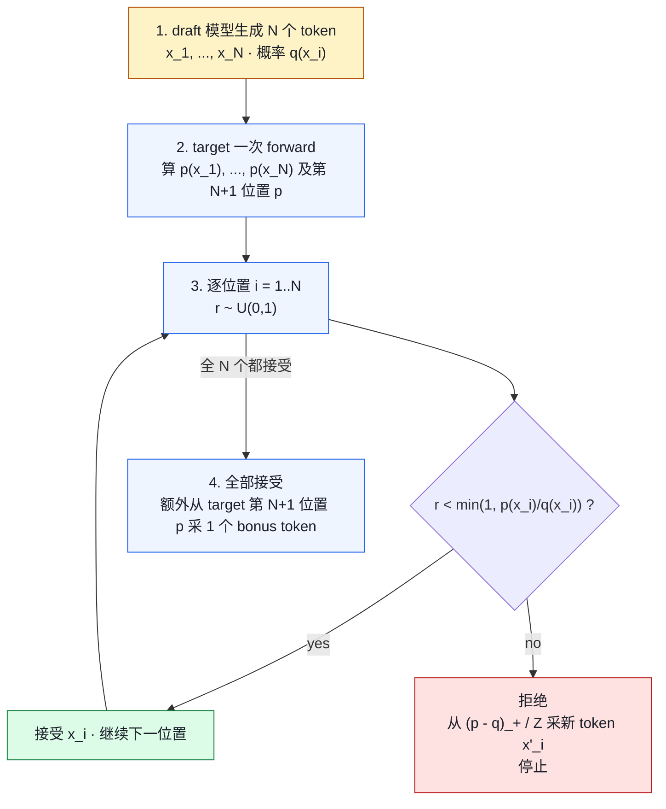

# 02. Speculative Decoding（投机解码）

> **谁该读这一篇？** 想加速单请求 / 小 batch decode 的工程师；准备答清"投机为什么不改变分布、为什么大 batch 不赚"的面试同学；要给 DeepSeek-V3 这类自带 MTP 的模型做推理调优的人。
>
> **前置阅读：** [`02-scheduler.md`](../03-code-walkthrough/02-scheduler.md)、[`04-model-runner.md`](../03-code-walkthrough/04-model-runner.md)、[`01-quantization.md`](01-quantization.md)
>
> **耗时：** 约 10 分钟
>
> **学完能：**
> 1. 写出拒绝采样公式并解释为什么投机解码输出分布与直接采样等价
> 2. 列出 vLLM 支持的至少 3 种投机方法（Ngram / Draft Model / EAGLE / MTP / Medusa）及其差异
> 3. 解释为什么大 batch 下投机解码反而可能慢
> 4. 知道接受率怎么测、N（lookahead）怎么选
> 5. 在源码里定位投机解码与 Scheduler / ModelRunner / Sampler 的三个集成点

用小模型 N 个 token 一起提议、大模型一次性验证。接受率高时吞吐 1.5-3×。是当下最热的推理优化方向。

---

## 1. 直觉：为什么能加速？

decode 阶段瓶颈是 **大模型的访存**：每生成 1 token，要把整个模型权重读一遍。

如果能让大模型**一次 forward 验证 N 个候选 token**，且大部分被接受，那么生成 N 个 token 只花了 1 次 forward 的成本。

类比：

- 朴素：你打字，每个字按一下 Enter 确认（慢）
- 投机：输入法预测整句，你看一眼按 Enter 整句确认（快）

---

## 2. 算法（Leviathan 2023）

记 target 模型概率分布 `p(x)`，draft 模型 `q(x)`。



**关键性质**：得到的 token 序列分布**完全等价于直接从 p 采样**！（这是数学证明的，等价采样）。

---

## 3. 接受率怎么算？

`acceptance_rate = E[接受 token 数 / 提议 token 数]`

理论上限：当 q ≡ p 时接受率 = 1。
实际：

- N-gram draft：30-50%
- 小 LM draft（如 Llama-7B drafts Llama-70B）：50-70%
- EAGLE：~ 80%
- MTP (Medusa-like)：60-80%

**吞吐增益**约为 `acceptance_rate × N` 倍（粗略）。

---

## 4. vLLM 支持的投机方法

| 方法     | 实现                                            | 优点                       |
| ------ | --------------------------------------------- | ------------------------ |
| Ngram  | 历史 token 上找 ngram 匹配做 draft                | 零开销，prompt 复用场景好         |
| Draft Model | 跑一个 1-3B 的小模型做 draft（同架构同 tokenizer）          | 通用                       |
| EAGLE  | 学一个轻量"draft head"，重用 target 的 hidden states  | 接受率最高                    |
| MTP    | 模型自带 multi-token predict 头（DeepSeek-V3）       | 内置，无额外模型                 |
| Medusa | 多个并行 head 同时预测 N 个位置                          | 经典方法，被 EAGLE 替代          |

代码：`vllm/v1/spec_decode/`

---

## 5. 在 Scheduler 里怎么集成？

```python
# Scheduler 给一个请求每步分配 num_new_tokens
def _get_num_new_tokens_for_req(self, req, token_budget):
    if req.in_prefill():
        return min(remaining_prompt, token_budget, max_chunk)
    else:
        # decode 阶段，投机解码一次提议多个
        return min(1 + self.num_lookahead_tokens, token_budget)
```

然后 Worker 跑 forward 时：

1. draft 阶段：跑 draft 模型生成 N 个候选
2. target 阶段：把 N 候选喂给 target 一次 forward，得 N+1 个 logits
3. 接受/拒绝采样
4. 返回 1 到 N+1 个 token

KV cache 处理：

- target 一次性写入 N+1 个 KV
- 如果只接受了 k 个，最后 N+1-k 个 KV 要 "rollback"（实际是把 block table 长度截短）

---

## 6. EAGLE：当下 SOTA

EAGLE 的核心思想：draft 模型重用 target 的 hidden state 作为输入，而不是从 token 开始重新算。

```
target 跑到第 i 层 → 得到 hidden_i
EAGLE draft head 输入 hidden_i + 已生成 token → 预测下一个 token
```

接受率高（target hidden 信息丰富）、参数少（只一个 head）、速度快。
vLLM 通过 `vllm/v1/spec_decode/eagle.py` 等实现。

---

## 7. MTP：DeepSeek-V3 的做法

DeepSeek-V3 训练时就让模型预测多个未来 token（Multi-Token Predict）。推理时：

- 主 forward 出 token T+1
- MTP head 额外出 token T+2、T+3
- target 一次 forward 验证 T+1、T+2、T+3

优点：无需独立 draft 模型，训练时联合优化，接受率高。

---

## 8. 投机解码的负面情况

不是所有场景都赚：

1. **接受率低**（< 20%）：拒绝时浪费 draft 算力 + target 多算 N 个 token，反而慢
2. **大 batch**：batch 大时 target 本来就 compute-bound，多算 N 个 token 接近线性增成本，投机收益小
3. **draft 模型本身慢**：draft 时间不可忽略

经验法则：**单请求 / 小 batch，投机赚；大 batch 慎用**。

---

## 9. 代码定位

```
vllm/v1/spec_decode/
├── __init__.py
├── eagle.py           - EAGLE
├── medusa.py          - Medusa
├── ngram_proposer.py  - N-gram 提议
├── metadata.py        - 共享数据结构
└── utils.py
```

集成点：

- Scheduler：`num_lookahead_tokens`
- ModelRunner：`vllm/v1/worker/gpu_model_runner.py` 内的 spec 分支
- 采样：`vllm/v1/sample/` 中的 rejection sampler

---

## 10. 面试常见追问

**Q: 投机解码会改变输出分布吗？**
A: 不会。数学上等价于直接从 target 采样（Leviathan 2023 证明）。这是它的关键卖点——加速无精度损失。

**Q: 投机解码和 prefix caching 冲突吗？**
A: 不冲突，正交。prefix caching 加速 prefill，spec decode 加速 decode。

**Q: 怎么选 N（lookahead 数）？**
A: 接受率高、draft 便宜时选大（5-10）；否则小（2-3）。EAGLE 经验值 4-5。

**Q: 大 batch 下投机解码反而慢，怎么办？**
A: 动态开关：bs < threshold 开 spec，bs > threshold 关。或者用 MTP 这种近乎零开销的方式。

---

## 小结

- 投机解码 = draft 提议 N + target 一次 forward 验证 + 拒绝采样；数学上输出分布与直接从 target 采样等价（Leviathan 2023）。
- 收益约为 `acceptance_rate × N`，EAGLE/MTP 接受率最高（70-80%），ngram 几乎零开销但接受率低。
- vLLM 集成点三处：Scheduler 的 `num_lookahead_tokens`、GPUModelRunner 内的 spec 分支、`vllm/v1/sample/` 的 rejection sampler。
- 大 batch 下 target 本就 compute-bound，多算 N 个 token 接近线性增成本，投机收益小甚至变负。生产里常做动态开关。

## 自检

> 答案不必照搬，能讲到关键点即可。

**1. eagle.py vs ngram_proposer.py 的 `propose` 签名差异。**

```python
# vllm/v1/spec_decode/eagle.py (简化)
class EagleProposer:
    def propose(
        self,
        target_hidden_states: torch.Tensor,    # 关键差别：需要 target 的 hidden state
        next_token_ids: list[int],
        num_lookahead: int,
    ) -> list[list[int]]:                       # 返回每个 seq 的 N 个 draft tokens
        # 走一遍 draft 模型 N 步
        ...

# vllm/v1/spec_decode/ngram_proposer.py (简化)
class NgramProposer:
    def propose(
        self,
        token_ids: list[int],                   # 不需要 hidden state，只看 token 序列
        num_lookahead: int,
    ) -> list[int]:
        # 在历史 token 里匹配 n-gram，返回紧跟的 token
        ...
```

**核心差别**：

- EAGLE 需要 **target 模型的中间 hidden state** —— 因为 draft 模型 reuse target 的 hidden 来减少自己的 forward 开销
- NgramProposer **纯文本统计** —— 只看 token id 序列，做 n-gram 查找，零模型开销

**速度对比**：EAGLE 一次 propose ~1 ms（小模型 forward N 次）；Ngram ~10 μs（纯查表）。但 EAGLE 接受率 70-80%，Ngram 接受率 20-40%（取决于 workload）。

---

**2. "全部接受"时为什么还能多采 1 个 bonus token？**

**拒绝采样的概率论**：当前位置 i，draft 给的 token x，target 概率 p(x)，draft 概率 q(x)：

- 若 `p(x) ≥ q(x)`：直接接受
- 若 `p(x) < q(x)`：以概率 `1 - p(x)/q(x)` 拒绝。拒绝后从 **"剩余分布" `max(0, p - q) / Z`** 重新采样

**全部接受时 bonus token 的来源**：

target 一次 forward 跑了 `N+1` 个 token 的 logits：

- 前 N 个 logits 用于 verify draft 的 N 个提议
- 第 **N+1 个 logits** 是 "假设前 N 个都对的话, 第 N+1 个 token 的分布"——这个分布**已经在 forward 里算出来了**

如果前 N 个全部接受 → 第 N+1 个分布有效 → **直接从这个 target 分布采一个 token 加进去**。

**数学上**：第 N+1 个 token 来自 target 自己的分布 → 与"如果没有 spec decoding 直接 decode N+1 步"等价。没有任何作弊。

**收益**：在最理想（全接受）case 下，一次 verify forward 净赚 **N+1 个 token**（不是 N 个）。这就是为什么"高接受率 + 长 lookahead"组合极有价值。

---

**3. 只接受 k 个时 KV cache block_table 怎么截短？**

被分配 `1 + N` 个 slot（draft 1 + lookahead N），实际接受 `k ≤ N+1` 个。后面 `N+1-k` 个 slot 的 KV 是"算了但用不到"——必须撤销。

**涉及的函数（按顺序）**：

```python
# vllm/v1/sample/rejection_sampler.py
accepted_tokens, num_accepted = rejection_sample(draft_logits, target_logits)

# vllm/v1/core/sched/scheduler.py
self.scheduler.update_from_output(scheduler_output, model_runner_output)
  → 内部：_update_request_with_output(req, accepted_tokens)
    → req.num_tokens += k  (只 commit k 个 token)
    → req.num_computed_tokens 也只前进 k 个

# vllm/v1/core/kv_cache_manager.py
self.kv_cache_manager.free_extra_blocks_for_request(req, ...)
  → 计算应保留的 block 数 = ⌈(num_tokens + k) / block_size⌉
  → 把 block_table 末尾多余的 block 释放回 free queue
    → BlockPool.free(extra_blocks)
```

**关键点**：被 free 的 block 已经写入了 KV 数据，但**没人再引用**——下次有新 token 写到这个 block 时直接覆盖。不需要"擦除"操作。

**special case**：rejection 后从"剩余分布"重新采的 1 个 token 仍要写入 KV（成为下一步的历史）。这个 token 是 sample 出来的，本步 forward 算的 KV 不能直接用（因为它是基于 draft token 算的，不是这个 resampled token）——所以**下一步 forward 时这个新 token 会被当成 1-token prefill 重算 KV**。这就是"额外 1 步 prefill 开销"的来源。

---

**4. 测量接受率最简单的方法 + counter 加在哪？**

vLLM 已有 metric：**`vllm:spec_decode_accept_rate`** 或类似（V1 spec decode metrics 在 `vllm/v1/spec_decode/metrics.py`）。

如果没有 / 想自己加：

```python
# vllm/v1/sample/rejection_sampler.py
class RejectionSampler:
    def forward(self, draft_tokens, target_logits, ...):
        accepted_count = ...   # 已知
        proposed_count = num_lookahead

        # 加 counter（Prometheus 风格）
        self.spec_accepted_total.inc(accepted_count)
        self.spec_proposed_total.inc(proposed_count)
        # 比值就是 acceptance_rate
```

**测量在哪**：rejection sampler 内部最自然（信息齐全）。Scheduler 端也可以加，但要在 `update_from_output` 时统计。

**Prometheus 查询**：

```promql
rate(vllm:spec_accepted_total[5m]) / rate(vllm:spec_proposed_total[5m])
```

→ 这就是接受率。理想值随方法不同：n-gram 20-40%、Medusa 40-60%、EAGLE/MTP 70-80%。

---

**5. EAGLE 在 bs=1 vs bs=64 吞吐变化趋势 + 原因。**

| 指标 | bs=1 | bs=64 |
| --- | --- | --- |
| target forward 时长 | 短（小 batch，memory-bound）| 长（大 batch，接近 compute-bound）|
| target 算 N+1 tokens 的额外算力代价 | 几乎免费（GPU 闲着） | 显著（算力本就饱和）|
| draft propose 开销 | 大（占比 30-50%） | 小（占比 5-10%）|
| 接受率 | 与 bs 无关，~70% | 与 bs 无关，~70% |
| **整体加速比** | **2-3×**（明显赢）| **0.8-1.2×**（可能亏）|

**为什么 bs=64 时反而可能亏**：

1. **target compute-bound**：大 batch 下 GPU 算力被打满，多算 N+1 token 是真实代价（不再是"反正闲着不如算"）
2. **scheduler overhead**：每步要管理 64 × (1+N) 个 token slot 的状态，CPU 开销上升
3. **rejection rebatch 复杂**：每个 seq 接受不同数量的 token，下一步要重新组 batch，input 不再齐整
4. **接受率乘子失效**：在 memory-bound 区域，"算 N 个 token 跟算 1 个一样快"成立；在 compute-bound 区域，时长正比于 token 数

**生产解法**：动态开关——监控 `vllm:num_requests_running`，超过阈值（如 32）自动关 spec decode；或者改用 MTP（开销最小，可一直开）。

加分：DeepSeek-V3 内置 MTP（Multi-Token Prediction）—— draft 头与 target 共享 backbone，几乎零开销，是 EAGLE 思路的"模型自带"版本。

## 下一步

- 下一节：[`03-cudagraph-and-compile.md`](03-cudagraph-and-compile.md)（再一类正交优化：CUDA Graph 与 torch.compile）
- 想看源码：`vllm/v1/spec_decode/eagle.py`、`vllm/v1/spec_decode/ngram_proposer.py`、`vllm/v1/sample/`
- 想动手：[`07-hands-on/03-mini-experiments.md`](../07-hands-on/03-mini-experiments.md)（开 / 关投机解码，对比小 batch 与大 batch 的吞吐变化）
- 想从生产视角理解：[`08-production-deployment/05-slo-and-observability.md`](../08-production-deployment/05-slo-and-observability.md)（接受率作为投机解码的核心可观测指标）

