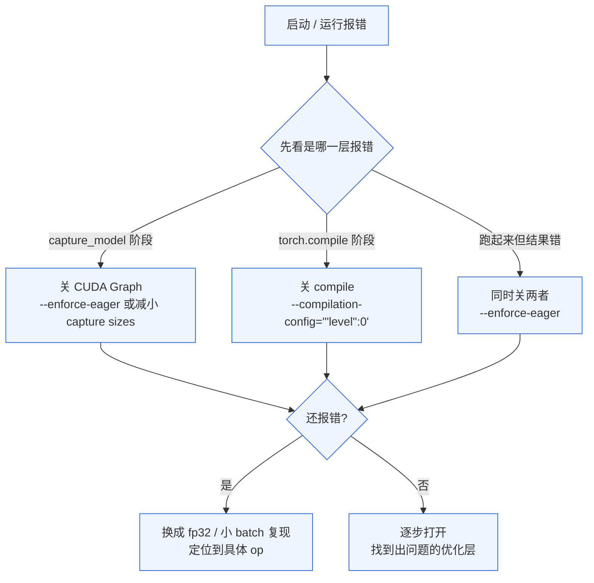

># 03. CUDA Graph 与 torch.compile

> **谁该读这一篇？** 启动慢得离谱、改了模型出现奇怪错误、想自己改 attention kernel、或者想搞清"默认开 / 什么时候要关 / 怎么诊断"的读者。
>
> **前置阅读：** [`02-architecture.md`](../01-overview/02-architecture.md)（明白 model runner 在哪一层）。如果想看更深的编译器细节，本节读完接 [`04-compilation-internals.md`](04-compilation-internals.md)。
>
> **耗时：** 约 12 分钟。
>
> **学完能：**
> 1. 解释 CUDA Graph 和 torch.compile 各自消除的是哪类 overhead，能不能叠加。
> 2. 判断"我这个改动要不要 `--enforce-eager`"——给出 3 个该关的典型场景。
> 3. 在启动失败 / 运行结果异常时，按降级路径定位到根因。
> 4. 配 compile cache 让重启避免重复编译。

---

## 1. CUDA Graph：消除 kernel launch overhead

### 1.1 问题
一个 Transformer 层有几十个 CUDA kernel（matmul、softmax、layernorm、activation、attention…）。每个 kernel launch overhead 约 5-10 μs。一个 80 层 Llama-70B 一次 forward 可能 launch 1000+ 个 kernel，总开销 5-10 ms。

decode 阶段 forward 本身可能只 20 ms，launch overhead 占比 25-50%。

### 1.2 解决
CUDA Graph：把一系列 kernel 调用录制成静态图（DAG），runtime 一次性提交给 GPU 调度器，省去 launch overhead。

```python
# 录制阶段（一次性）
g = cuda.CUDAGraph()
with cuda.graph(g):
    model(dummy_input)

# 运行阶段（每步）
dummy_input.copy_(real_input)  # 输入复制到固定 tensor
g.replay()                      # 一次性提交
```

### 1.3 限制
- 输入 tensor 地址、shape 必须固定
- kernel 序列必须确定（不能有依赖运行时数据的 if）
- 显存分配不能在 graph 内

### 1.4 vLLM 的做法
- 启动时 capture 多个 batch_size（如 1, 2, 4, 8, ..., max）的 graph
- runtime 把当前 batch pad 到最近的 captured size（如 batch=5 用 size=8 的 graph，多出来的 3 行不算）
- InputBatch 用持久化 buffer + 索引切片实现"固定地址"

参数：

- `--enforce-eager`：禁用 CUDA Graph（启动快但跑慢）
- `--cudagraph-capture-sizes`：自定义要 capture 的尺寸
- 启动日志可见 "Capturing CUDA Graphs..."

代码：`vllm/v1/cudagraph_dispatcher.py`、`vllm/v1/worker/gpu_model_runner.py` 内 `capture_model()`。

---

## 2. torch.compile：图编译

### 2.1 问题
PyTorch eager mode 每个 op 是独立 Python 调用。即使 GPU 计算被 stream 化，Python 端的调度还是有可观开销，且 op 之间无法融合（一个 RMSNorm + 一个 Linear 本可融合，但 eager 不会）。

### 2.2 解决
`torch.compile` 用 Inductor 后端：

1. 用 Dynamo 把 PyTorch 代码 trace 成 FX graph
2. Inductor 把 graph 转成 Triton kernel（融合多个 op 到一个 GPU kernel）
3. 缓存编译结果

效果：

- 减少 Python overhead
- op fusion（RMSNorm + linear、SiLU + multiply 等）
- 比 eager 快 10-30%

### 2.3 vLLM 的集成
vLLM 编译范围可配：

- 完整模型 compile（最激进）
- 只 compile 每个 layer（默认）
- 只 compile 选定 op（保守）

自定义 op（如 paged attention）通过 `torch.library` 注册，让 compile 能识别。

代码：`vllm/compilation/`

参数：

- `--compilation-config`：JSON 字符串配置
- `--enforce-eager`：完全关闭 compile + CUDA Graph

### 2.4 与 CUDA Graph 的关系
两者可以叠加：

- torch.compile 先把 op 融合成更少更大的 kernel
- 再 CUDA Graph capture 把这些 kernel 录制成静态图
- 双重收益

---

## 3. 启动慢的代价

启动时 vLLM 要做：

1. 加载权重（几秒到几分钟）
2. Profile run（测显存，~10 秒）
3. torch.compile（每个 size 一次，几十秒到几分钟）
4. CUDA Graph capture（几秒）

总共可能 1-5 分钟。Production 服务部署时这是个问题。

加速方法：

- 使用 `--enforce-eager` 跳过 CG + compile（debug 用）
- 使用 `--compilation-config={"level": 0}` 关 compile（保留 CG）
- 缓存 compile 结果到磁盘（`VLLM_TORCH_COMPILE_CACHE_DIR`）
- 热 swap 模型时复用 compile cache

---

## 4. 调试 CUDA Graph 问题

CUDA Graph 出错通常表现为：

- 启动时 "RuntimeError during graph capture"
- 运行结果错误但不报错（最难查）
- OOM during capture

排查：

1. `--enforce-eager` 先确认是不是 CG 问题
2. 看 vllm 的 capture_model 日志
3. 检查是否 add 了不支持 CG 的 op（dynamic shape、host-device sync 等）
4. 减小 capture batch size 范围

---

## 4.5 什么时候不要开（要 `--enforce-eager`）

CUDA Graph + compile **不是免费午餐**，下面这些场景应该考虑关闭：

| 场景 | 为什么关 | 替代方案 |
| --- | --- | --- |
| 调试模型正确性 | CG 录制的 op 序列固定，不能加 print/breakpoint；compile 后 trace 难读 | `--enforce-eager`，调好再开 |
| 新模型架构刚上线 vLLM | torch.compile 对新 op 容易 trace 失败 / 数值不一致 | 先 `--enforce-eager` 跑通正确性 |
| 严重 OOM 边缘 | capture 多档 batch + compile 缓存都占显存 | `--enforce-eager` 释放几百 MB |
| 启动延迟敏感（serverless 冷启动）| compile 几十秒到几分钟 | `--enforce-eager` + `--compilation-config={"level":0}` |
| 动态 shape 非常稀疏 | 每来一个新 shape 重 trace 一次，compile 比省的多 | 关 compile，保留 CG |
| 自定义 op 未注册 | compile 看到不认识的 op 会 fallback 到 eager 区段，可能没收益还更慢 | 注册 op 或 `--enforce-eager` |

### 4.6 失败降级路径

按这个顺序逐级关，直到能跑：



**判断技巧：**

- 错误信息里有 `cudaGraphExec*` / `graphExec*` → CG 问题
- 错误里有 `inductor` / `dynamo` / FX trace 栈 → compile 问题
- 数值无声错位（perplexity 异常但不报错）→ 优先怀疑 compile 数值精度，先 `--enforce-eager` 复现

---

## 5. 面试常见追问

**Q: CUDA Graph 为什么不能完全替代 compile？**
A: CG 只优化 launch overhead，不优化 op 本身。compile 做 op fusion 是另一维度。两者叠加最佳。

**Q: 为什么 capture 多个 batch_size 而不是只 capture 一个？**
A: 实际请求的 batch 在变（continuous batching）。pad 到固定 size 浪费算力。所以 capture 多档（如 1,2,4,8,16,32,...,max），runtime 选最近的。

**Q: prefill 阶段也用 CUDA Graph 吗？**
A: prefill 的输入长度 variable 且大，不适合 CG。vLLM 主要在 decode（input 长度都是 1，可固定）用 CG。chunked prefill 的 chunk size 也固定，可以 capture。

**Q: torch.compile 第一次很慢，怎么办？**
A: warmup（启动后跑几个 dummy 请求触发编译）。开 `VLLM_TORCH_COMPILE_CACHE_DIR` 让下次直接读缓存。

---

## 小结

- CUDA Graph 消 **kernel launch overhead**（decode 主要受益），torch.compile 消 **Python overhead + op fusion**，两者叠加最佳。
- 默认开。但调试、新模型、严重 OOM、冷启动敏感、动态 shape 多 → 用 `--enforce-eager` 关掉。
- 失败按 §4.6 流程从 CG → compile → 两者都关 逐级降级。
- 启动慢的解药：`VLLM_TORCH_COMPILE_CACHE_DIR` 缓存到磁盘。

## 自检

1. 一个 decode 步 forward 20ms 里假定 launch overhead 5ms，开 CUDA Graph 能优化到多少？
2. 你给项目加了一个自定义 attention 变体，没注册到 `torch.library`。compile 默认会怎么处理？性能会更好还是更差？
3. 启动时报错 `cudaGraphInstantiate failed`，先动哪个 flag？
4. 同样模型 batch 改变时 vLLM 为什么不重 capture 而是 pad？

## 下一步

- 深入编译器实现：[`04-compilation-internals.md`](04-compilation-internals.md)（CompilerManager / VllmBackend / 自定义 pass）。
- 想看 attention 在 CG 模式下怎么跑：[`03-code-walkthrough/05-attention-backends.md`](../03-code-walkthrough/05-attention-backends.md)。
- 想配 compile cache 加速重启：`vllm/envs.py` 搜 `VLLM_TORCH_COMPILE_CACHE_DIR`。
- 想看 CG capture 源码：`vllm/v1/cudagraph_dispatcher.py`、`vllm/v1/worker/gpu_model_runner.py::capture_model`。
