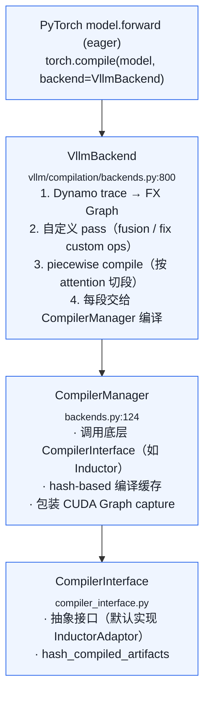
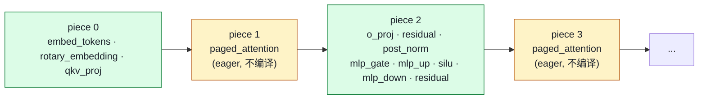

# 04. Compilation Internals：CompilerManager / VllmBackend / 自定义 pass

> **谁该读这一篇？** 想深入理解 vLLM 启动慢在哪、torch.compile 如何与 paged attention 共存的进阶读者；准备面试时被追问"为什么不直接用 torch.compile"的候选人。
>
> **前置阅读：** [`04-optimizations/03-cudagraph-and-compile.md`](03-cudagraph-and-compile.md)（CUDA Graph 与 torch.compile 入门），[`03-code-walkthrough/04-model-runner.md`](../03-code-walkthrough/04-model-runner.md)（capture_model 入口）。
>
> **耗时：** 约 35 分钟。
>
> **学完能：**
> 1. 解释 vLLM 为何自写 backend 而不直接 `torch.compile(model)`
> 2. 画出 VllmBackend → CompilerManager → CompilerInterface 的 4 层抽象
> 3. 描述 piecewise split 的切点策略与每段的编译/CUDA Graph 处理
> 4. 知道 CompilationConfig 哪些旋钮在生产里要调

`03-cudagraph-and-compile.md` 讲了 "torch.compile + CUDA Graph 是什么"。本节深入 `vllm/compilation/`，看 vLLM 怎么**自己包装一层 backend**，把 paged attention 这种自定义 op 也纳入图编译。

---

## 1. 全景：4 层抽象



---

## 2. 为什么需要 vLLM 自己的 backend？

直接 `torch.compile(model)` 在 vLLM 下有几个问题：

1. **PagedAttention 是自定义 op**，Dynamo 不认得 → 整图 fallback eager
2. **Attention 内有 dynamic shape**（block_table 长度可变）→ 编译图爆炸
3. **CUDA Graph 要求固定 shape**，但不同 step 的 num_tokens 变化
4. **整图编译太大**，编译时间 minutes 级

vLLM 的 `VllmBackend` 解决：

- 把 attention 当 **"图断点"**：图被切成多个 piecewise 子图
- 每个子图小、shape 稳定，可单独编译 + 单独 CUDA Graph
- 自定义 op 通过 `torch.library` 注册成可见 op，参与图融合

---

## 3. VllmBackend：编排者

`vllm/compilation/backends.py:800` 起：

```python
class VllmBackend:
    """vLLM 的 torch.compile backend。"""

    def __init__(self, vllm_config, prefix=""):
        self.compilation_config: CompilationConfig = vllm_config.compilation_config
        self.compiler_manager = CompilerManager(self.compilation_config)
        # 编译 caches
        self.compiled_codes: list[Callable] = []
        # 自定义 pass
        self.post_grad_passes = ...

    def __call__(self, graph: fx.GraphModule, example_inputs):
        """Dynamo 拿到 trace 后的 FX graph 调用这里。"""

        # 1. 跑自定义 pass：fusion / shape simplification / 修复 custom op
        graph = run_passes(graph, self.post_grad_passes)

        # 2. 按 attention layer 切 piecewise
        items: list[SplitItem] = split_graph(graph)

        # 3. 每个 piece 单独编译 + 包 CUDA Graph
        for item in items:
            compiled = self.compiler_manager.compile(item.subgraph, item.example_inputs)
            wrapped = wrap_with_cudagraph_if_needed(compiled, ...)
            self.compiled_codes.append(wrapped)

        # 4. 返回一个 dispatcher：runtime 时按 piece 顺序串起来调用
        return self._make_dispatcher()
```

---

## 4. Piecewise split：图怎么被切

`vllm/compilation/backends.py:548 (split_graph)`：

策略：**遇到 attention op 就切**。

- attention 输入有 `block_table`、`slot_mapping`（dynamic shape）→ 不能 CUDA Graph
- 其余部分（QKV proj、MLP、norm、residual）shape 固定 → 适合 CUDA Graph

切出来的 piece 大致这样：



奇数 piece（attention）走 eager，偶数 piece 编译 + CUDA Graph。

`PiecewiseCompileInterpreter`（line 682）是个 `torch.fx.Interpreter` 子类，运行时按 piece 顺序 dispatch。

---

## 5. CompilerManager：编译缓存

`backends.py:124`：

```python
class CompilerManager:
    def __init__(self, compilation_config):
        self.compiler = make_compiler(compilation_config)   # 返回 InductorAdaptor
        self.cache: dict[Hash, CompiledArtifact] = {}

    def compile(self, subgraph, example_inputs):
        key = self.compiler.hash_artifact(subgraph, example_inputs, compile_config)

        # 看磁盘缓存
        if key in self.cache:
            return self.cache[key]

        # 编译（昂贵）
        compiled = self.compiler.compile(subgraph, example_inputs)
        self.cache[key] = compiled

        # 持久化到磁盘（VLLM_TORCH_COMPILE_CACHE_DIR）
        save_to_disk(key, compiled)
        return compiled
```

**hash key**：基于 graph 结构 + 输入 shape + dtype + compile config 的 stable hash。同样的子图同样的输入 → 直接读缓存。

设 `VLLM_TORCH_COMPILE_CACHE_DIR=/data/vllm_cache`，重启不需要重编译。

---

## 6. Custom op：把 paged attention 注册成"知名 op"

`vllm/compilation/decorators.py` + `torch.library`：

```python
@torch.library.custom_op("vllm::paged_attention_v1", mutates_args=("out",))
def paged_attention_v1(out, query, key_cache, value_cache, ...):
    ...

@paged_attention_v1.register_fake
def _(out, query, ...):
    """fake (meta) impl: 描述输出 shape，不实际跑。Dynamo trace 用这个。"""
    return None
```

注册后 Dynamo 能识别这个 op：

- 不会 fallback eager
- 可以参与图变换（move / fuse）
- 可以放进 CUDA Graph（如果它的 shape 是 graph-friendly 的）

---

## 7. 自定义 pass：让图融合更狠

`vllm/compilation/passes/`：

```
passes/
├── fusion/
│   ├── allreduce_fusion.py        ← AllReduce + add 融合
│   ├── attention_fusion.py        ← attention 前后 op 融合
│   ├── activation_quant_fusion.py ← SiLU + quantize 融合
│   └── ...
├── fx_utils.py
├── inductor_pass.py               ← Inductor pass 接口
├── pass_manager.py                ← pass 串联
├── vllm_inductor_pass.py          ← vLLM 主 pass 集合
└── utility/
```

例如 `allreduce_fusion`：把 TP 的 AllReduce 与之后的 add / norm 融合，减少一次内存往返。

`pass_manager.py` 决定 pass 顺序，在 Inductor 自带 pass 之后跑。

---

## 8. CompilationConfig：调优旋钮

`vllm/config/compilation.py`：

```python
@dataclass
class CompilationConfig:
    level: CompilationLevel        # NO_COMPILATION / DYNAMO_AS_IS / PIECEWISE / FULL_COMPILE
    backend: str = "inductor"
    custom_ops: list[str]          # 启用哪些自定义 op
    splitting_ops: list[str]       # 切图的 op 名（默认 attention）
    use_cudagraph: bool = True
    cudagraph_capture_sizes: list[int] | None
    cudagraph_num_of_warmups: int
    cudagraph_copy_inputs: bool
    use_inductor: bool = True
    compile_sizes: list[int] | None
    inductor_compile_config: dict
    pass_config: PassConfig        # 哪些自定义 pass 开
    debug_dump_path: str | None
```

启动命令传 JSON：

```bash
vllm serve <model> \
  --compilation-config '{"level": 3, "use_cudagraph": true, "cudagraph_capture_sizes": [1,2,4,8,16,32,64]}'
```

### CompilationLevel
- **0 NO_COMPILATION**：纯 eager（debug / 兼容性兜底）
- **1 DYNAMO_AS_IS**：Dynamo trace 但不优化
- **2 PIECEWISE**：默认。按 attention 切段编译
- **3 FULL_COMPILE**：（实验）整图 compile

---

## 9. CUDA Graph 包装

`backends.py:628 (wrap_with_cudagraph_if_needed)`：

```python
def wrap_with_cudagraph_if_needed(compiled_fn, ...):
    if not should_use_cudagraph(...):
        return compiled_fn

    # 给每个 capture size 录一个 graph
    captured_graphs = {}
    for size in cudagraph_capture_sizes:
        with cuda.graph(...) as g:
            compiled_fn(dummy_input(size))
        captured_graphs[size] = g

    def dispatcher(*args):
        size = current_batch_size(args)
        # 找最近的 captured size，pad 输入
        graph_size = next_capture_size(size)
        copy_inputs_into_buffer(args, graph_size)
        captured_graphs[graph_size].replay()

    return dispatcher
```

`vllm/v1/cudagraph_dispatcher.py` 在 runtime 维护"current size → captured graph"映射。

---

## 10. CompilerInterface 与多后端

`vllm/compilation/compiler_interface.py:782` 起：

```python
class CompilerInterface(ABC):
    @abstractmethod
    def compile(self, graph, example_inputs, ...): ...

    @abstractmethod
    def hash_artifact(self, graph, inputs, config) -> str:
        """决定缓存 key。"""

    def save_to_file(self, artifact, path): ...
    def load_from_file(self, path) -> CompiledArtifact: ...
```

实现：

- `InductorAdaptor`（默认）→ torch.compile inductor backend
- 其他 backend（试验性）：eager、aot_eager 等

---

## 11. 编译时间在哪？

启动慢主要是这部分：

| 阶段 | 耗时 |
| --- | --- |
| Profile run + KV alloc | ~ 10-30 s |
| torch.compile（每 capture size 一次，第一次冷编） | 30-180 s / size |
| CUDA Graph capture | ~ 5-15 s |
| **合计** | **30 s ～ 8 min** |

加速：

1. `VLLM_TORCH_COMPILE_CACHE_DIR` 命中缓存
2. 减少 `cudagraph_capture_sizes`（如只留 1,4,16,64,256）
3. `compile_sizes`：只编译特定 batch size 的优化版本
4. `--enforce-eager`：完全跳过编译

---

## 12. 真实坑

### 12.1 自定义 op 的 fake impl 必须准确
fake impl 返回 shape 错了 → 编译图错 → runtime crash 或结果错。新增 op 一定要写好 `register_fake`。

### 12.2 CUDA Graph + dynamic shape 冲突
某个 op 输出 shape 依赖 runtime tensor 值 → CUDA Graph 拒绝 capture。需要在 splitting_ops 加进它，强制切到 eager piece。

### 12.3 pass 冲突
某些 fusion pass 重排了 op 顺序，可能破坏 vLLM 假设（如 KV write 顺序）。生产前用 `debug_dump_path` 看融合后图。

### 12.4 Cache key 不稳定
graph hash 偶尔不稳定（Python 对象 id、内存地址混入）→ 缓存命中率低。如果发现每次重启都重新编译，开 debug log 看 hash 漂移。

---

## 13. 面试常见追问

**Q: vLLM 为什么不直接 torch.compile(model)？**
A: ①PagedAttention 是 custom op，Dynamo fallback eager；②dynamic shape 让整图编译爆炸；③CUDA Graph 要 static shape，整图不可能。vLLM 自己写 backend，按 attention 切 piecewise，每段单独优化。

**Q: piecewise 切图的依据是什么？**
A: `splitting_ops` 列表里的 op（默认 attention）作为切点。attention 前后是 static shape 段（QKV proj + MLP），可以编译 + CUDA Graph；attention 自己 eager 跑。

**Q: 怎么验证 vLLM compile 真在工作？**
A: ①看启动日志的 "Compiling..."；②运行时 GPU util 比 enforce-eager 高；③开 `debug_dump_path` 看融合后的 graph；④比 throughput benchmark。

**Q: 升级 vLLM 后编译 cache 还能用吗？**
A: 不能。cache key 含 vLLM 版本、torch 版本、CUDA 版本。任一变化都失效。生产升级必须预留重编译时间窗口。

**Q: 自定义 pass 能让 throughput 提升多少？**
A: 视情况。AllReduce fusion + activation+quantize fusion 在 H100 上累积 5-15% 吞吐。单 pass 单卡的收益不大，但叠加多 pass + 高并发后明显。

---

## 小结

- vLLM 的 `VllmBackend` 在 torch.compile 之上包了一层：按 attention 切 piecewise，每段独立编译 + CUDA Graph，避开 dynamic shape 与 custom op 的两大坑。
- 4 层抽象：`VllmBackend`（编排）→ `CompilerManager`（缓存）→ `CompilerInterface`（后端抽象）→ `InductorAdaptor`（默认实现）。
- 自定义 op 通过 `torch.library.custom_op` + `register_fake` 让 Dynamo 认识，参与图融合而不 fallback eager。
- 编译耗时主要来自每个 capture size 的冷编译，靠 `VLLM_TORCH_COMPILE_CACHE_DIR` 与精简 `cudagraph_capture_sizes` 缓解。

## 自检

> 答案不必照搬，能讲到关键点即可。

**1. 直接 `torch.compile(model)` 在 vLLM 下的 3 个问题 + 规避方法。**

| 问题 | 表现 | vLLM 规避方法 |
| --- | --- | --- |
| **自定义 CUDA op 不可见** | `torch.ops.vllm.paged_attention_v1` 是手写注册的 op，Dynamo trace 会 graph break（不识别 → 标 unsupported → 切段） | `vllm/_custom_ops.py` 通过 `torch.library.define` 给每个 custom op 注册抽象 schema 和 fake tensor 实现，让 Dynamo 把它当成已知 op 跨过 |
| **dynamic shape 反复重编译** | `num_tokens` 是 SymInt（symbolic），shape 一变 torch.compile 触发 recompile → 每次 5-30s | `vllm/compilation/backends.py` 内的 `VllmBackend` 给关键 axis 标记 dynamic，让编译产物对 shape 维度 generic；同时 capture 少数代表 size 做 CUDA Graph |
| **整图编译太大无法分段优化** | 80 层 Llama 整图编译 + capture 占 5-10 分钟，且编译失败时整图 fallback | `split_graph()` 把 forward 切成 piecewise（按 attention op 边界），每段独立编译；某段失败也不影响其他段 |

加分：还有第 4 个隐性问题——CUDA Graph 录制要求输入地址固定，Dynamo 默认会跨步重分配，vLLM 通过 `wrap_with_cudagraph` 在持久 buffer 上 capture。

---

**2. `split_graph` 切点依据 + 默认 op 列表。**

源码：`vllm/compilation/backends.py:548` 的 `split_graph`。切点由 `CompilationConfig.splitting_ops` 控制。

**默认 `splitting_ops`** 通常包含：

- `vllm.unified_attention`（或具体 attention backend op）
- `vllm.silu_and_mul`（如果作为分段标记）
- 部分通信 op（`vllm.all_reduce`、`vllm.reduce_scatter`）—— 因为通信 op torch.compile 无法 fuse

**切点意义**：把整 forward 切成 N+1 段（N 个 attention op → N+1 piecewise），每段是纯 PyTorch op（没有自定义 CUDA），可以放心交给 Inductor 编译 + fusion。

**配置例**：

```python
compilation_config = {
    "mode": 3,  # VLLM_COMPILE
    "splitting_ops": ["vllm.unified_attention"],
    "use_inductor_graph_partition": False,
}
```

若想完全不切（整图 compile），传 `splitting_ops=[]`——但通常 CUDA Graph 会爆 / op 不识别。

---

**3. `CompilerManager` 的 cache key 组件 + 为什么升级 vLLM 必失效。**

cache key 由以下组件 hash 而成（源码 `vllm/compilation/compiler_interface.py`）：

```python
hash_components = {
    "model_class": model.__class__.__qualname__,        # 模型类名
    "model_config_hash": ...,                            # hidden_size / num_layers / ... 等结构参数
    "graph_hash": hash(fx_graph.code),                   # FX graph 的代码字符串
    "compilation_config": compilation_config_hash,       # mode / splitting_ops / etc
    "torch_version": torch.__version__,                  # PyTorch 版本
    "cuda_version": torch.version.cuda,                  # CUDA 版本
    "vllm_version": vllm.__version__,                    # vLLM 版本（关键）
    "gpu_arch": "sm_90",                                 # GPU 计算能力
    "dtype": "bfloat16",
}
cache_key = sha256(json.dumps(hash_components, sort_keys=True))
```

**升级 vLLM 后必然失效的原因**：

1. **`vllm_version`** 直接进 hash → 版本号变 hash 变
2. 升级带来代码变动 → FX graph 序列化字符串变 → `graph_hash` 变
3. 可能伴随 PyTorch 升级 → `torch_version` / `cuda_version` 变

→ 这是**故意**的：vLLM 不保证 Pickle 化的 Inductor 产物跨版本兼容；若复用旧产物可能产生静默错误。每次升级冷启动一次的代价 < 静默错误的成本。

**缓解**：生产部署在每个版本固化 compile cache 到 PV / S3，pod 启动时拉一次，省去重编译。

---

**4. 注册 `vllm::my_custom_op` 让 Dynamo trace 不破坏 piecewise 编译的最小例子。**

```python
import torch
from torch.library import Library

# 1. 创建 library 命名空间
my_lib = Library("vllm", "FRAGMENT")

# 2. 定义 op schema（关键：Tensor! 表示 in-place 输出）
my_lib.define(
    "my_custom_op(Tensor input, float scale) -> Tensor"
)

# 3. 实现 CUDA 版本（实际的 kernel 调用）
@torch.library.impl("vllm::my_custom_op", "CUDA")
def my_custom_op_cuda(input: torch.Tensor, scale: float) -> torch.Tensor:
    output = torch.empty_like(input)
    # 调你自己的 CUDA kernel
    torch.ops.my_extension.actual_kernel(output, input, scale)
    return output

# 4. ⚠️ 关键：注册 fake tensor 实现给 Dynamo
@torch.library.register_fake("vllm::my_custom_op")
def my_custom_op_fake(input: torch.Tensor, scale: float) -> torch.Tensor:
    # 不算真实结果，只返回形状/dtype 一致的 empty tensor
    # 让 Dynamo 知道 "这个 op 输入什么形状、输出什么形状"
    return torch.empty_like(input)

# 5. 使用
def model_forward(x):
    y = torch.relu(x)
    z = torch.ops.vllm.my_custom_op(y, 0.5)   # ← Dynamo 现在能 trace
    return z + 1
```

**为什么 fake 注册是关键**：

- Dynamo 在 trace 时遇到 unknown op 会**整段 graph break**（切回 eager 跑这一段）
- 注册 fake → Dynamo 知道这个 op 的 abstract（fake）输出形状 → 能继续 trace 后续 op
- piecewise 编译时，这个 op 仍是 `splitting_ops` 之一（如果你想它当切点）或被透明跨过（如果不切）

**进一步**：如果 op 是 splitting op（attention 这种），还要在 `vllm/compilation/backends.py` 的 `splitting_ops` 列表里加上 `vllm.my_custom_op`，让 `split_graph` 在它附近切。

参考 vLLM 自己的注册：`vllm/_custom_ops.py` 给 `paged_attention_v1` 等做了上述完整链路。

## 下一步

- 下一节：[`05-distributed/01-tp-pp-ep.md`](../05-distributed/01-tp-pp-ep.md)（从单卡优化跨入分布式并行策略）
- 想看源码：`vllm/compilation/backends.py`、`vllm/compilation/compiler_interface.py`、`vllm/compilation/passes/`
- 想动手：[`07-hands-on/04-profiling-and-debugging.md`](../07-hands-on/04-profiling-and-debugging.md)（用 nsys / torch.profiler 验证 piecewise 是否真在工作）
- 想从生产视角理解：[`08-production-deployment/04-autoscaling-and-capacity.md`](../08-production-deployment/04-autoscaling-and-capacity.md)（编译缓存命中率对扩容速度的影响）

---

## Sources

- `vllm/compilation/backends.py:124 (CompilerManager)`, `:548 (split_graph)`, `:628 (wrap_with_cudagraph)`, `:682 (PiecewiseCompileInterpreter)`, `:800 (VllmBackend)`
- `vllm/compilation/compiler_interface.py`（CompilerInterface / InductorAdaptor / hash）
- `vllm/compilation/passes/{vllm_inductor_pass,pass_manager,fusion/*}.py`
- `vllm/compilation/decorators.py`（custom op 注册装饰器）
- `vllm/compilation/cuda_graph.py`
- `vllm/v1/cudagraph_dispatcher.py`（runtime size dispatch）
- `vllm/config/compilation.py`（CompilationConfig）

---

## See also

- `04-optimizations/03-cudagraph-and-compile.md` —— 入门概念
- `03-code-walkthrough/04-model-runner.md` —— capture_model 入口
- `06-interview/01-common-questions.md` —— Q25 CUDA Graph / Q26 torch.compile
