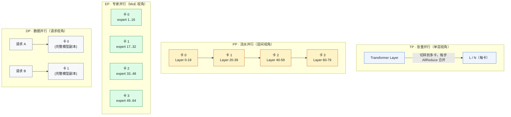
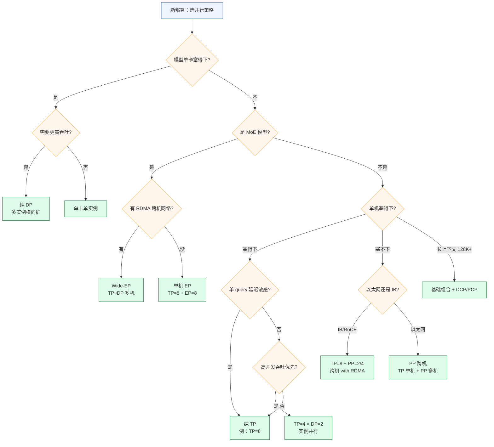
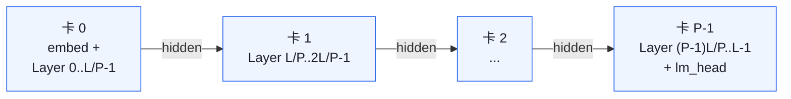
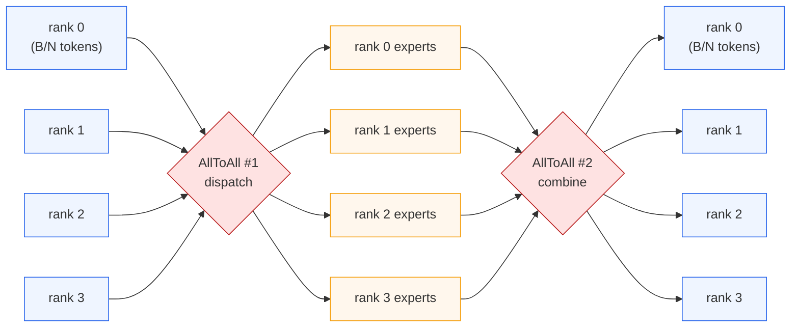
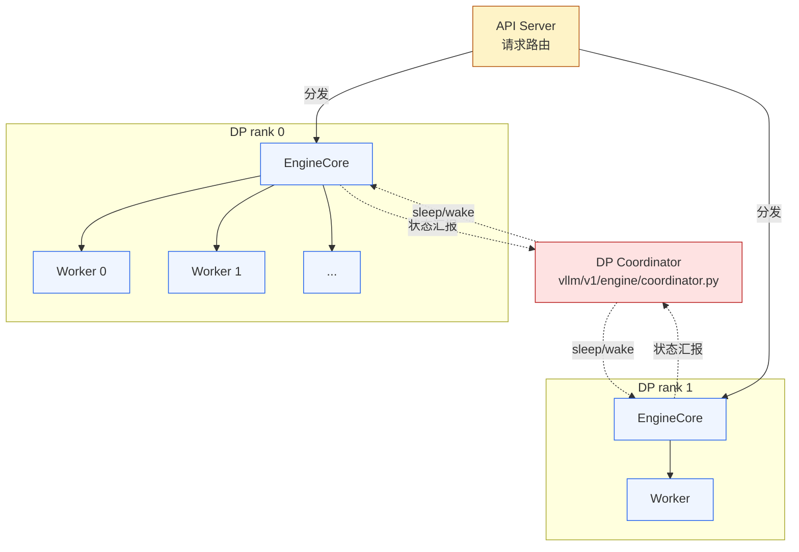
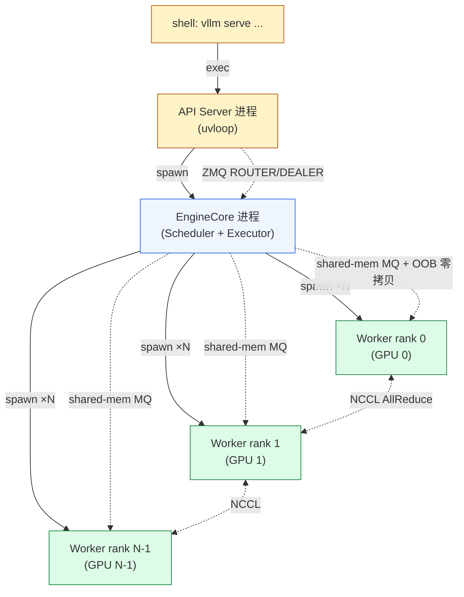

# 01. 分布式推理：TP / PP / EP / DP

> **谁该读这一篇？** 即将部署 70B+ 大模型、MoE 模型，或需要在面试中清晰回答"8 卡怎么切 Llama-70B"的工程师。
>
> **前置阅读：** [`01-overview/02-architecture.md`](../01-overview/02-architecture.md)（vLLM 整体架构），[`02-core-concepts/03-kv-cache-management.md`](../02-core-concepts/03-kv-cache-management.md)（理解 KV 在 TP 下怎么切）。
>
> **耗时：** 约 25 分钟。
>
> **学完能：**
> 1. 在白板画出 MLP 的 column → row parallel 切分，说出每层 2 次 AllReduce 的来源
> 2. 解释 PP 的 bubble 是怎么产生的、推理为何不需要训练里的 1F1B 调度
> 3. 描述 MoE 的 EP 通信（两次 AllToAll）和 EPLB 解决的负载问题
> 4. 对一台 8×H100，能给出 Llama-70B / Mixtral / DeepSeek-V3 的推荐并行组合

一个模型一张卡装不下，怎么切？这一节讲三种主流并行 + Data Parallel 共 4 种，以及它们在 vLLM 里的进程模型与代码入口。

---

## 1. 三种切法直觉



实际生产组合：TP × PP × EP × DP × (PCP/DCP)（5 维并行）。

### 1.1 四个维度一句话区分

| 维度 | 切什么 | 主要通信 | 适用 | 典型 size |
| --- | --- | --- | --- | --- |
| **TP** | 单层权重（hidden/intermediate 维）| AllReduce（每层 2 次）| 模型单卡塞不下；单 query 延迟敏感 | 2 / 4 / 8 |
| **PP** | 按层切（layer 序列）| P2P send/recv（边界）| 模型超大跨机；高并发吞吐优先 | 2 / 4 / 8 |
| **EP** | MoE expert（个体粒度）| AllToAll（每 MoE 层 2 次）| MoE 模型必加（Mixtral / DeepSeek / Qwen-MoE）| 4 / 8 / 16 / 32 |
| **DP** | 请求 batch（副本级）| 无（纯副本）/ AllToAll（DP+EP）| 高 QPS 横向扩展 | 任意 |

**配套维度**（不增 world size 或仅在某阶段使用）：

| 维度 | 切什么 | 何时用 |
| --- | --- | --- |
| **DCP** | decode 阶段 KV cache 的 seq 维（复用 TP GPU） | 长上下文 decode；MLA 模型用 `a2a` backend 省 NCCL |
| **PCP** | prefill 阶段的 seq 维（增 GPU） | 超长上下文 prefill 塞不下激活 |
| **SP** | 单层内"激活的 sequence 维"（附属于 TP） | 默认搭配 TP 使用，减 LayerNorm/residual 的冗余 |

详见 [`04-context-parallel.md`](04-context-parallel.md)（DCP/PCP）和本节 §6（SP）。

### 1.2 决策树：我该用哪种并行？



**5 句话口诀**：

- 单卡塞不下 → **TP**（同机）/ **PP**（跨机）
- MoE 模型 → **必加 EP**
- 高 QPS → **DP** 横向
- 长上下文 → **DCP/PCP** 加维度
- 凡跨机 → 看网络：**RDMA 上 TP+PP，以太网上纯 PP**

---

## 2. Tensor Parallel（TP）

### 2.1 怎么切

#### 符号约定

| 符号 | 含义 |
| --- | --- |
| `B` | 一步内 token 总数（batch × seq_len 打平后）|
| `H` | hidden size（模型维度） |
| `I` | intermediate size（MLP 中间维度，约 2.6× ~ 5× H，见 §2.1 末尾） |
| `h` | num attention heads（注意力头数）|
| `k` | num KV heads（GQA 下 k ≤ h）|
| `d` | head dim（每头维度，`H = h × d`）|
| `N` | TP world size（参与切分的 GPU 数）|

下文所有矩阵都按 PyTorch 习惯写 `[输入维度, 输出维度]`，张量按 `[B, ...]` 写。

#### MLP 层：完整张量流（以 Llama SwiGLU 为例）

公式：`y = (silu(x · W_gate) * (x · W_up)) · W_down`

**未切分（单卡）的形状流：**

```
x          : [B, H]
W_gate     : [H, I]                  ← 投影 1（gate）
W_up       : [H, I]                  ← 投影 2（up）
x · W_gate : [B, I]
x · W_up   : [B, I]
silu(...) * (...) → mid : [B, I]    ← 逐元素，仍是 I 维
W_down     : [I, H]                  ← 下投影
mid · W_down → y : [B, H]
```

**TP=N 切分后**：

```
─── Column Parallel：W_gate / W_up 沿 I 轴切 ──────────────────────────
  每卡持有：
    W_gate_local : [H, I/N]          ← 列切：保留所有输入维 H，输出维分给 N 卡
    W_up_local   : [H, I/N]
  输入 x : [B, H]（每卡都有完整的一份）
  每卡算：
    out_gate_local : [B, I/N]        ← 仍是 partial 输出（沿 I 轴的一段）
    out_up_local   : [B, I/N]
    mid_local      : [B, I/N]        ← silu * 仍是逐元素，I/N 不变
  ⚠️ 此时不需要任何通信：因为 mid 在下一步要进的 W_down 是按行切的，
     它要的就是 [B, I/N] 这个分片的输入。

─── Row Parallel：W_down 沿 I 轴切 ────────────────────────────────────
  每卡持有：
    W_down_local : [I/N, H]          ← 行切：输入维分给 N 卡，每卡保留完整输出维 H
  每卡输入：
    mid_local : [B, I/N]             ← 上一步的输出，刚好对得上
  每卡算：
    partial_y_local : [B, H]
       = mid_local · W_down_local
  ⚠️ 但 partial_y_local 只是真实结果的「一部分」，不是完整的 y！
     原因见下面 §「AllReduce 到底在干嘛」。
  通信：
    AllReduce(partial_y_local) → y : [B, H]   ← 一次 AllReduce
```

#### AllReduce 到底在干嘛

数学上，row-parallel 算出来的 `partial_y_local` 是真实 `y` 的**沿 I 轴的部分和**。回到矩阵乘的定义：

$$y_{b,h} = \sum_{i=0}^{I-1} \text{mid}_{b,i} \cdot W_{\text{down}}[i, h]$$

把求和 $\sum_{i=0}^{I-1}$ 拆成 N 段：

$$y_{b,h} = \underbrace{\sum_{i=0}^{I/N-1} \dots}_{\text{rank 0 的 partial}} + \underbrace{\sum_{i=I/N}^{2I/N-1} \dots}_{\text{rank 1 的 partial}} + \dots + \underbrace{\sum_{i=(N-1)I/N}^{I-1} \dots}_{\text{rank N-1 的 partial}}$$

每张卡只算其中一段，得到 `partial_y_local : [B, H]`。**N 张卡的 partial_y_local 形状相同，值不同；要把它们逐元素相加才是真正的 `y`**。这件事就叫 **AllReduce-SUM**：

```
rank 0: partial_y_local = [B, H]   ┐
rank 1: partial_y_local = [B, H]   │
   ...                              │  逐元素 sum 后广播给所有 rank
rank N-1: partial_y_local = [B, H] ┘

→ 每张 rank 拿到相同的 y : [B, H]
```

NCCL 在 NVLink / IB 上有高效的 ring-allreduce / tree-allreduce 实现，**每张卡发送+接收的数据量约 `2 × (N-1)/N × |[B,H]|` 字节**——`B × H × 2 × (N-1)/N × dtype_bytes`。

> **关键观察**：column-parallel 完后**不通信**就把分片直接喂给 row-parallel，row-parallel 完后**才通信**。这就是 Megatron 论文的核心 trick：**两次切分配合，把 4 次潜在通信压成 1 次 AllReduce**。如果把顺序反过来（row 在前 column 在后），每个 Linear 后都要通信，开销翻倍。

#### Attention 层：完整张量流

公式（以 GQA / MHA 为例）：

```
Q = x · W_Q              # column parallel
K = x · W_K              # column parallel
V = x · W_V              # column parallel
attn_out = Attention(Q, K, V)
y = attn_out · W_O       # row parallel
```

**未切分形状：**

```
x   : [B, H]
W_Q : [H, h × d]         h 个 query head，每个 d 维 → 等价 [H, H]
W_K : [H, k × d]         k 个 KV head（GQA：k ≤ h）
W_V : [H, k × d]
Q   : [B, h, d]          重整 reshape
K   : [B, k, d]
V   : [B, k, d]
attn_out : [B, h × d] = [B, H]
W_O : [H, H]
y   : [B, H]
```

**TP=N 切分后**（要求 `h % N == 0` 且 `k % N == 0`，否则报错）：

```
─── Column Parallel：W_Q / W_K / W_V 按头数切 ────────────────────────
  每卡持有：
    W_Q_local : [H, (h/N) × d]       ← 每卡负责 h/N 个 query head
    W_K_local : [H, (k/N) × d]       ← 每卡负责 k/N 个 KV head
    W_V_local : [H, (k/N) × d]
  输入 x : [B, H]（每卡都有完整一份）
  每卡算：
    Q_local : [B, h/N, d]
    K_local : [B, k/N, d]
    V_local : [B, k/N, d]
  ⚠️ 注意力计算是 head-wise 独立，所以每张卡只用本卡的 K_local / V_local
     算自己负责的 h/N 个 query head 的 attention：
    attn_out_local : [B, h/N × d] = [B, H/N]
  ⚠️ 此时不通信：attn_out_local 直接喂给 row-parallel 的 W_O。

─── Row Parallel：W_O 按输入维切 ─────────────────────────────────────
  每卡持有：
    W_O_local : [H/N, H]
  每卡输入：
    attn_out_local : [B, H/N]        ← 跟 W_O_local 的 H/N 对得上
  每卡算：
    partial_y_local : [B, H]         ← 又是「部分和」
  通信：
    AllReduce(partial_y_local) → y : [B, H]   ← 一次 AllReduce
```

数学上和 MLP 完全是同一招：column-parallel 切「输出维」、row-parallel 切「输入维」、partial 自动衔接、最后一次 sum-AllReduce 收尾。

**KV cache 的副作用**：因为 K / V 是 column-parallel 切的，每张卡也**只存 k/N 个 KV head 的 cache**。所以 PagedAttention 的 KV block 形状 `[2, num_blocks, block_size, k/N, d]`（这里 k 就是源码里的 `num_kv_heads`，已经是 per-rank 的值）。

#### 每层共 2 次 AllReduce

```
attention:  ... → AllReduce → 残差连接 → LayerNorm
mlp:        ... → AllReduce → 残差连接 → LayerNorm
                  ↑                            ↑
              1 次 AllReduce              1 次 AllReduce
```

Llama-3-70B 有 80 层，所以一次 forward 一共 **160 次 AllReduce**。这正是 §2.2 通信代价分析的起点。

> **关于 `intermediate` 这个数**：原始 Transformer / GPT-3 用 `intermediate = 4 × hidden` 是行业惯例；但 Llama 之后用 SwiGLU（多一个 `W_gate` 投影），为控制参数量改成 `≈ 8/3 × hidden`，所以各家模型 ratio 差异大：Llama-2-7B 是 2.69×、Llama-3-70B 是 3.5×、Qwen2.5-7B 是 5.3×、DeepSeek-V3 dense 层 2.57×。TP 切法本身与该数值无关，唯一硬性约束是 `intermediate % N == 0` 和 `num_heads % N == 0`、`num_kv_heads % N == 0`。

#### 一张表带走：Llama-3-70B TP=4 的所有形状

| 张量 | 全局形状 | 每卡形状（TP=4）|
| --- | --- | --- |
| `W_Q` | `[8192, 8192]` | `[8192, 2048]` |
| `W_K` | `[8192, 1024]` (8 KV heads × 128 dim) | `[8192, 256]` (2 KV heads/卡) |
| `W_V` | `[8192, 1024]` | `[8192, 256]` |
| `W_O` | `[8192, 8192]` | `[2048, 8192]` |
| `W_gate` | `[8192, 28672]` | `[8192, 7168]` |
| `W_up` | `[8192, 28672]` | `[8192, 7168]` |
| `W_down` | `[28672, 8192]` | `[7168, 8192]` |
| Attention AllReduce 通信量 / token | — | `8192 × 2 bytes = 16 KB` |
| MLP AllReduce 通信量 / token | — | `8192 × 2 bytes = 16 KB` |
| 整个 forward 通信量 / token | — | `16 KB × 80 层 × 2 = 2.56 MB` |

### 2.2 通信代价

每个 token 每层 AllReduce 数据量 = `hidden_size * dtype_bytes`。
Llama-70B：hidden=8192，BF16 → 16KB / token / 层 / AllReduce × 80 层 × 2 → 2.5MB / token。

8 卡 NVLink (600GB/s) 通信时间约 ms 级；PCIe 慢 10×。

→ **TP 强依赖高带宽互联**。跨机器 TP 通常不可行。

### 2.3 代码

```
vllm/distributed/parallel_state.py     - 进程组初始化
vllm/model_executor/layers/linear.py   - ColumnParallelLinear / RowParallelLinear
vllm/distributed/communication_op.py   - AllReduce / AllGather wrapper
```

启用：`--tensor-parallel-size 8`。

---

## 3. Pipeline Parallel（PP）

延用 §2.1 符号，再加 `L` = 总层数、`P` = PP world size、`M` = micro-batch 个数。

### 3.1 怎么切

按层切。`L` 层均匀分到 `P` 张卡，每张卡持有 `L/P` 层（要求 `L % P == 0`，或自定义 partition）。



**注意 embedding 与 LM head 的归属**：

- **rank 0** 额外持有 token embedding（`[V, H]`，V 是词表大小，BF16 下 Llama-3 的 128K × 8192 × 2 ≈ 2 GB）
- **rank P-1** 额外持有 LM head（同样 `[H, V]` 或与 embedding tied）
- 中间 rank 只有 transformer 层 + 其 KV cache

### 3.2 单 micro-batch 的张量流（推理，无反向）

```
rank 0:
  input_ids : [B]          ← B = token 数
  embed    : [B, H]         ← 走 W_embed [V, H]
  layer 0..L/P-1 forward → hidden : [B, H]
                                       ↓ NCCL send

rank 1:
  hidden : [B, H]  ← recv
  layer L/P..2L/P-1 → hidden : [B, H]
                                       ↓ send

  ...

rank P-1:
  hidden : [B, H]  ← recv
  layer (P-1)L/P..L-1 → hidden : [B, H]
  hidden · W_LM_head → logits : [B, V]
  sample → next_token : [B]
```

**通信原语：NCCL P2P send/recv**（不是 collective）。每个段边界传一个 `[B, H]` 张量给下一段。

> **形状细节**：`B` 在 vLLM V1 里其实是"打平后的 token 数"（packed batch，详见 [`02-core-concepts/02-continuous-batching.md`](../02-core-concepts/02-continuous-batching.md)）。Prefill 阶段 B 很大（几百到几千），decode 阶段 B = batch 内 running 请求数。

### 3.3 流水填充：bubble 怎么来的、怎么算

#### 直觉：把 PP 想成汽车装配线

想象一条汽车装配线，4 个工位：① 装底盘 → ② 装引擎 → ③ 装内饰 → ④ 喷漆。每辆车必须按 ①→②→③→④ 顺序过完 4 个工位才算造完。

- **刚开机时**：第一辆车在工位 ① 装底盘，工位 ②③④ 还没车可干，**空着**。
- **过一段时间**：第一辆车被推到工位 ②，第二辆车进工位 ①，工位 ③④ 还在空。
- **再过一段**：四个工位全部有车，**满负荷**。
- **最后一辆车进了工位 ①**：之后再没新车进来，工位 ① 先空下来，然后 ②③，最后只有工位 ④ 在喷最后一辆车。

工位"空着"的时间就是 **bubble**。PP 完全一样：每张 GPU 是一个工位，每个 micro-batch 是一辆车。

#### 时间步表格（最直观的画法）

设 `P=4`（4 张卡）、`M=4`（4 个 micro-batch），每个 micro-batch 在每张卡跑 1 个时间步。整条流水共需要 `M + P - 1 = 7` 步：

| 时间 → | T=0 | T=1 | T=2 | T=3 | T=4 | T=5 | T=6 |
| :--- | :---: | :---: | :---: | :---: | :---: | :---: | :---: |
| **卡 0**（layer 0-19） | mb1 | mb2 | mb3 | mb4 |  ─  |  ─  |  ─  |
| **卡 1**（layer 20-39） |  ─  | mb1 | mb2 | mb3 | mb4 |  ─  |  ─  |
| **卡 2**（layer 40-59） |  ─  |  ─  | mb1 | mb2 | mb3 | mb4 |  ─  |
| **卡 3**（layer 60-79） |  ─  |  ─  |  ─  | mb1 | mb2 | mb3 | mb4 |
| 阶段 | Fill | Fill | Fill | **Steady** | Drain | Drain | Drain |

格子里的 `mb1`..`mb4` 表示"那个时刻那张卡正在跑哪个 micro-batch"；`─` 是 bubble（空闲）。

**怎么读这张表**：

- **横着读一行** = 这张卡的时间线。卡 0 从 T=0 一直忙到 T=3，之后闲了 3 步。卡 3 反之，前 3 步全闲。
- **竖着读一列** = 这个时刻全集群在干嘛。T=3 是唯一全员满载的时刻。
- **斜着读对角线** = 同一个 micro-batch 的旅程。mb1 从 T=0 卡 0 → T=1 卡 1 → T=2 卡 2 → T=3 卡 3，逐段往下传 hidden state。

#### 三阶段的步数 + bubble 数

| 阶段 | 步数 | 这几步里有几张卡在 bubble | 累计 bubble 格 |
| --- | :---: | :---: | :---: |
| **Fill**（流水填充） | `P - 1 = 3` | T=0:3, T=1:2, T=2:1 | 6 |
| **Steady**（满载） | `M - (P - 1) = 1` | T=3:0 | 0 |
| **Drain**（流水排空） | `P - 1 = 3` | T=4:1, T=5:2, T=6:3 | 6 |
| **总计** | `M + P - 1 = 7` | — | **12** |

总格子数 = 7 步 × 4 卡 = 28。其中 bubble 格 = 12。

#### Bubble 占比公式（直接从表格读出来）

$$\text{bubble ratio} = \frac{\text{bubble 格数}}{\text{总格数}} = \frac{2 \times P \times (P-1) / 2}{P \times (M + P - 1)} = \frac{P - 1}{M + P - 1}$$

（分子是上下两个三角形 bubble 区，各 `P×(P-1)/2` 格，合起来 `P(P-1)` 格。）

代不同的 `M` 验证一下：

| `P` | `M` | bubble 格 | 总格 | bubble 比 |
| :---: | :---: | :---: | :---: | :---: |
| 4 | 4 | 12 | 28 | **43%** |
| 4 | 16 | 12 | 76 | 16% |
| 4 | 64 | 12 | 268 | 4.5% |
| 8 | 8 | 56 | 120 | 47% |
| 8 | 64 | 56 | 568 | 9.9% |

**两个观察：**

1. **bubble 格数只跟 P 有关，跟 M 无关**（永远是 `P×(P-1)`，因为左上和右下两个三角形）。所以**减小 bubble 唯一的办法是把 M 做大**——分子摊薄到大分母。
2. **PP=4 + M=4 时 43% 算力被浪费**。这就是为什么生产里 PP 必须配合 `max_num_seqs ≥ 32-64`：让 M 远大于 P，bubble 才能压到 10% 以下。

→ **PP 强烈受 batch 大小制约**：低并发场景 bubble 巨大，PP 反而比纯 TP 慢。Agent / code completion 这种"低并发 + 延迟敏感"工作负载请走纯 TP，不要 PP。

### 3.4 通信代价

每段边界一次 P2P，传一个 `[B, H]` tensor：

```
per-boundary bytes = B × H × dtype_bytes
total bytes / forward = (P - 1) × B × H × dtype_bytes
```

vs TP 的通信量：`2L × B × H × dtype_bytes`（每层 2 次 AllReduce）。

**Llama-3-70B PP=4 vs TP=4 通信对比（每个 forward）：**

| 维度 | TP=4 | PP=4 |
| --- | --- | --- |
| 通信原语 | AllReduce（每层 2 次）| P2P send/recv（每边界 1 次）|
| 总次数 | 80 × 2 = 160 | 3 |
| 单次数据 / token | `8192 × 2 = 16 KB` | `8192 × 2 = 16 KB` |
| 总数据 / token | 2.56 MB | 48 KB |
| 带宽要求 | 必须 NVLink/IB（高频小包） | 普通以太网够（低频中包） |

→ **PP 的核心优势：通信稀疏，能跨机**。这是它在多机推理里不可替代的原因。

### 3.5 vLLM 里 PP 的实现

- **每个 PP rank 一个 Worker 进程**（同 TP rank 一样的多进程模型）
- **KV cache 按层归属**：rank i 只为它负责的 `L/P` 层分配 BlockPool。Block 总数随每个 rank 持有的层数缩放
- **Scheduler 还是单实例**（在 PP rank 0 上跑），通过广播 `SchedulerOutput` 给所有 rank
- **`get_pp_group()` / `get_world_group()`** 提供进程组抽象（`vllm/distributed/parallel_state.py`）
- **send/recv 的实现** 在 `vllm/v1/worker/gpu_model_runner.py` 的 `execute_model` 段边界

**启用**：`--pipeline-parallel-size 4`，可与 `--tensor-parallel-size` 组合（如 `TP=4, PP=2` 用 8 卡跨 2 机）。

### 3.6 适用场景

| 场景 | 推荐 |
| --- | --- |
| 单机 8 卡塞得下 + 单 query 延迟敏感（agent / code completion）| **纯 TP**（PP 会引入 bubble + send/recv 串行延迟） |
| 单机塞不下，但有 IB / RoCE 多机 | **TP=单机卡数 × PP=机器数**（典型 TP=8, PP=2/4）|
| 单机塞不下，机器间只有以太网 | **PP 跨机**（TP 跨以太网会被通信打死，PP 还能跑）|
| 离线高吞吐 batch 推理 | **大 M（高并发请求）+ PP** — bubble 摊薄 |

---

## 4. Expert Parallel（EP）：MoE 专用

本节是 EP 概览。**完整的 6 个 AllToAll backend 对比、EPLB 在线自适应、wide-EP 部署模式**详见 [`03-expert-parallel-deep-dive.md`](03-expert-parallel-deep-dive.md)。

### 4.1 MoE 是什么

Mixture of Experts 把 dense FFN（一个大的 `[H, I]` 投影）换成 **E 个独立的 expert FFN + router**。每个 token 经 router 选 top-k 个 expert，加权求和。

| 模型 | num_experts (E) | top-k | 形态 |
| --- | --- | --- | --- |
| Mixtral 8x7B | 8 | 2 | 每 token 激活 2/8 |
| Qwen2-MoE | 64 | 8 | 64 expert + 4 shared |
| DeepSeek-V3 | 256 routed + 1 shared | 8 | wide expert pool |
| GPT-OSS | 32 | 4 | NVIDIA 风格 |

参数量随 E 线性增长，但激活算力只按 k 收费（"参数大 + 算力省"）。

### 4.2 张量形状与单层公式

未切分（单卡）：

```
x           : [B, H]           ← B 是 packed token 数
W_router    : [H, E]
router_logits : [B, E] = x · W_router
top_k_indices : [B, k]         ← argmax_k(softmax(router_logits))
top_k_weights : [B, k]         ← 对应权重，已归一化

对每个 token t，它选中的 k 个 expert 各自跑一遍 SwiGLU MLP：
  expert_e(x_t) = (silu(x_t · W_gate_e) * (x_t · W_up_e)) · W_down_e
  其中 W_gate_e, W_up_e : [H, I_expert],  W_down_e : [I_expert, H]

最终：
  y[t] = Σ_{e ∈ topk(t)} weight_e · expert_e(x_t)    形状 [B, H]
```

注意：每个 expert 有自己一套 `W_gate/W_up/W_down`，所以**全部 expert 的权重 = E × 单 expert 权重**。DeepSeek-V3 256 个 expert × 28 MB ≈ 7 GB 仅 MoE 层（每层！）。

### 4.3 EP=N 切分：每卡持有 E/N 个 expert

每张卡只放它负责的那部分 expert 的完整权重，**不切单个 expert 内部**。

```
─── Dispatch（AllToAll #1）─────────────────────────────────────────────
  每卡持有：
    本卡的 x_local : [B/N, H]            ← 假定 token 在 rank 间均匀分布
    本卡的 expert 子集（E/N 个）的所有 weight
  router 算 top-k 后，每个 token 标记 "我要去 expert_e0, expert_e1, ..., expert_ek-1"
  对应的 owner_rank = e_id // (E/N)
  AllToAll 把每个 token 飞到它的 top-k expert 所在的 rank：
  
  rank r 收到的 tokens : [n_r, H]         ← n_r 由 router 决定，不均匀！
                                            理想 n_r ≈ B · k / N，实际偏离
                                            （hot expert 让某些 rank 拥堵）

─── Compute（每卡独立跑自己的 expert）─────────────────────────────────
  rank r 上：
    对收到的每个 token、每个 owned expert e，跑 expert_e(x) → 输出 [n_r, H]

─── Combine（AllToAll #2）─────────────────────────────────────────────
  每张卡上 expert 算完的结果按"这个 token 来自哪个 rank"飞回去：
    rank r 收回 : [B/N, k, H]            ← 同一个 token 的 k 个 expert 结果
  本地加权求和：
    y_local : [B/N, H] = Σ_{i=0}^{k-1} weight_i · expert_output_i
```

**关键：AllToAll vs AllReduce**。AllReduce 把所有 rank 的同形 tensor 逐元素 sum；AllToAll 是**所有 rank 之间互相交换分片**——rank r 把它的第 r' 片发给 rank r'，同时从所有 r' 拿回它们的第 r 片。两次 AllToAll 围住 expert compute 是 EP 的核心 pattern。



### 4.4 通信代价

**每层每次 forward：2 次 AllToAll**。

AllToAll 数据量比 AllReduce 大得多（每对 rank 都要传数据）。Llama-3 dense 层每层 2 次 AllReduce = `2 × B × H × dtype_bytes`；MoE 层每层 2 次 AllToAll 单次传输近似 `B × k × H × dtype_bytes`（带 hot expert 失衡时更高）。

80 层 MoE 模型一次 forward = **160 次 AllToAll**。这就是 DeepSeek 必须写自家 DeepEP kernel 的原因——通用 NCCL AllToAll 在大 MoE 上是真实瓶颈。

详细 backend 选型（DeepEP HT/LL、FlashInfer、Mori、NIXL EP 等 6 种）见 [`03-expert-parallel-deep-dive.md`](03-expert-parallel-deep-dive.md) §4。

### 4.5 Load imbalance：hot expert 与 EPLB

理论上 router 均匀分配，实际**5-10 个 hot expert 吃掉 30-50% token**。表现：

- `nvidia-smi`：某些 GPU 100%，另一些 30-50%
- `vllm:iteration_tokens_total` 方差大

**EPLB（Expert Parallel Load Balancer）**：把 hot expert **复制到多 rank**（一 expert 多 owner），让 router 在多个副本里选。代价是显存（多副本）+ 路由复杂度。

DeepSeek-V3 用 256 logical → 288 physical（加 32 副本）。配 `--enable-eplb`。源码：`vllm/distributed/eplb/`。

### 4.6 关键约束

- `E % N == 0`（expert 数得能被 EP rank 数整除；否则 EPLB padding 凑齐）
- EP 需配合 expert parallel 启用：`--enable-expert-parallel`
- EP 与 TP 可共存：`ep_size = TP × DP × PCP`（详见 deep-dive）

---

## 5. Data Parallel（DP）

DP 概念最简单：模型权重复制 N 份，每份独立处理一批请求。但 vLLM 里 DP 有**两种截然不同的语义**，搞混会出问题。

### 5.1 两种 DP 语义

**模式 A · 纯副本 DP（Pure Replica）**

```
DP rank 0: 完整模型权重一份 + 独立 KV cache + 独立 Scheduler
DP rank 1: 完整模型权重一份 + 独立 KV cache + 独立 Scheduler
...
DP rank N-1: 同上
```

每个 rank（含它内部的 TP 组）持有**完整模型副本**。请求维度（batch）在 rank 之间分配。**rank 之间不通信**（forward 阶段）。吞吐近似线性扩展。

适合 dense 模型（Llama / Qwen-dense）做高并发服务。

**模式 B · DP for MoE（DP 维度参与 EP 切分）**

EP 启用时，`ep_size = TP × DP × PCP`。这种"DP+EP"组合让 expert 分布更细粒度——典型的"wide-EP"部署。

```
TP=8, DP=4 → ep_size=32
DeepSeek-V3 (256 expert) → 每张卡 8 expert
```

这种模式下 DP rank 之间**必须通信**（MoE 的 AllToAll 跨 DP），因为 expert 分布跨 DP 维度。

→ **怎么区分自己在哪种模式**：看是否加了 `--enable-expert-parallel`。加了就是 B，没加就是 A。

### 5.2 纯副本 DP 的张量形状

完全没有跨 rank 通信，每个 rank 等价于一个独立 vLLM 实例：

```
rank 0:
  batch_0 = [request_0, request_1, ...]    ← 分给 rank 0 的请求
  完整 forward 在 rank 0 内部完成（含其 TP 组）

rank 1:
  batch_1 = [request_N, ...]
  完整 forward 独立完成

...

跨 rank 通信：0   ← 真的零
跨 rank 共享：除了模型权重（各 rank 都有一份），其他全独立
```

**关键副作用**：prefix cache 不跨 rank 共享。同 prompt 打到 rank 0 和 rank 1 会各自全量 prefill。需要在**外部 router 层做 cache-aware 路由**让相同 prefix 的请求打到同一 rank（详见 [`08-production-deployment/02-smart-routing-and-load-balancing.md`](../08-production-deployment/02-smart-routing-and-load-balancing.md)）。

### 5.3 vLLM 里 DP 的实现

每个 DP rank 一个 **独立的 EngineCore 进程**，外加一个 **Coordinator 进程**协调全局状态：



**Coordinator 的职责**（**不做 forward 协同**）：

- 监控每个 DP rank 的负载（running / waiting 请求数）
- 协调全局 sleep/wake（elastic EP 场景下空闲 rank 可挂起）
- 处理 EP 启用时跨 DP rank 的 group 初始化

源码：`vllm/v1/engine/coordinator.py`。

### 5.4 External LB 模式（DP+K8s 的典型部署）

`--data-parallel-external-lb`：每个 DP rank 一个独立 K8s pod，**前面靠外部 LB（Istio/Envoy）分发请求**，不依赖 vLLM 内置 Coordinator。

适合 wide-EP 场景：

- 一 pod 一 rank → 扩缩容粒度细
- pod 间通过 IB/RoCE 跑 EP AllToAll
- 外部 LB 做 cache-aware / lora-aware routing

**仅 MoE 模型推荐**。dense 模型用纯多实例（每个 vLLM 进程独立）就够了，不必拉 external LB 那一套。

### 5.5 world_size 与组合公式

```
world_size = TP × PP × DP × PCP
（PCP = prefill context parallel，见后续章节）

EP 启用时额外约束：
ep_size = TP × DP × PCP
（PP 不计入 EP，因为 PP 各段持有独立 expert 集合）

DCP（decode context parallel）复用 TP GPU，不增 world_size。
```

### 5.6 8 卡 H100 的真实组合矩阵

以 DeepSeek-V3 为例：

| 配置 | world_size | ep_size | 单 query 延迟 | 吞吐 | 备注 |
| --- | --- | --- | --- | --- | --- |
| TP=8, DP=1 | 8 | 8 | 中 | 中 | 经典单实例 |
| TP=1, DP=8 | 8 | 8 | 高（无 TP 加速）| 高 | 每张卡一副本，但 DeepSeek-V3 模型大放不下 |
| TP=4, DP=2 | 8 | 8 | 中 | 中-高 | 折中：2 副本 × 每副本 4 卡 TP |
| TP=8, PP=1, DP=1 | 8 | 8 | 低（TP 加速）| 低 | 单 query 最快 |
| 跨机 TP=8, PP=2 | 16 | 8 | 中 | 高 | 模型横跨 2 机 |
| 跨机 TP=8, DP=2 | 16 | 16 | 中 | 极高 | wide-EP，2 机各一副本 |

启用参数对应：

```
--tensor-parallel-size 8
--pipeline-parallel-size 2
--data-parallel-size 2
--enable-expert-parallel
--data-parallel-external-lb
```

---

## 6. Sequence Parallelism（SP）：TP 的"半免费"伴侣

SP 是个常被忽略但默认就开的优化。它**附属于 TP**，不增 world size，但能省下一部分冗余计算。

### 6.1 SP 在哪里发挥作用

TP 切 Linear 层，但**没切 LayerNorm / Dropout / Residual** 这些 element-wise 的 op。这些 op 在每张 TP rank 上都跑了**完整的 `[B, H]`**——但每张 rank 都算一样的，浪费 TP-1 份算力。

SP 把这些 element-wise op 也按 seq 维切到不同 rank：

```
TP-only:
  rank 0: x [B, H] → LN [B, H] → Linear(切了的)
  rank 1: x [B, H] → LN [B, H] → Linear(切了的)  ← 重复算 LN
  ...
  rank N: x [B, H] → LN [B, H] → Linear(切了的)  ← 重复算 LN

TP + SP:
  rank 0: x [B/N, H] → LN [B/N, H] → AllGather → Linear(切了的)
  rank 1: x [B/N, H] → LN [B/N, H] → AllGather → Linear(切了的)
  ...
  AllGather + ReduceScatter 总通信量与原 AllReduce 等价（NCCL 性质）
```

**收益**：

- LayerNorm / Dropout / residual add 各省 (N-1)/N 份算力
- LN 在大 seq 时占 5-15%（不算大但白省）
- 中间激活 [B, H] 在 rank 上变成 [B/N, H] → **显存省 ~33%**

**代价**：

- 引入 AllGather + ReduceScatter 替代 AllReduce（总通信量近似相等）
- 实现复杂度↑

### 6.2 vLLM 里的 SP

- 默认**自动开启** when TP > 1（V1 大部分模型已经做了 SP 改造）
- 实现入口：`vllm/compilation/passes/fusion/sequence_parallelism.py`（torch.compile pass）+ 模型代码里的 `SequenceParallel*` 层
- 关掉：`compilation_config={"pass_config": {"enable_sp": false}}`

详细 PR：vllm-project/vllm#24134（DeepSeek SP）和 #24982（推广到其他模型）。

### 6.3 与 AsyncTP / SP-MoE 的关系

- **AsyncTP**（async tensor parallel）：让 AllGather 与下一个 GEMM overlap，能再省 5-10%
- **SP-MoE**（sequence parallel + MoE）：当 MoE 与 SP 共存时，需要专门的 compile pass 处理 RMSNorm + AllReduce + chunk 的 fusion；vllm-project/vllm#29139 在做（详见 [`02b-scheduling-policies.md`](../03-code-walkthrough/02b-scheduling-policies.md) 引用）

---

## 7. 集合通信原语速查

vLLM 在不同并行场景调用 5 种 NCCL 原语。一张表对完：

| 原语 | 语义 | 数据量 / rank | vLLM 用在哪 | 通信成本 |
| --- | --- | --- | --- | --- |
| **AllReduce** | 所有 rank 同形 tensor 逐元素聚合（默认 SUM），结果广播给所有 | `2(N-1)/N × \|tensor\|` | TP 的 Row Parallel 末尾（每层 2 次）；DP 训练时梯度同步（推理无）| 中 |
| **AllGather** | 所有 rank 各持有 1 段 tensor，拼成完整后广播给所有 | `(N-1)/N × \|拼后 tensor\|` | SP 的 LN→Linear 边界；EP dispatch 的一种实现（AgRs）| 中 |
| **ReduceScatter** | AllReduce 的"前半"：聚合后只把第 r 段给 rank r | 同 AllGather | SP 的 Linear→LN 边界；与 AllGather 配对替代 AllReduce | 中 |
| **AllToAll** | 所有 rank 互相交换分片：rank r 把第 r' 段发给 rank r'，同时收 | `(N-1)/N × \|tensor\|`，但拓扑全连接 | EP 的 dispatch 和 combine（每 MoE 层 2 次）| 重（全连接）|
| **Broadcast** | rank 0 的 tensor 广播给所有 rank | `\|tensor\|` | scheduler 把 SchedulerOutput 元数据广播给所有 worker；KV cache hash 命中结果广播 | 轻 |
| **P2P Send/Recv** | 一对一传输 | `\|tensor\|` | PP 的段边界传 hidden state | 极轻 |

**通信量关系**：

- AllReduce ≡ ReduceScatter + AllGather（NCCL ring 算法的实际实现就是这样）
- AllToAll 数据量与 AllReduce 同，但**实现复杂度更高**（每对 rank 都要建独立通道），所以 DeepEP / FlashInfer 才有用武之地

**vLLM 调用入口**：

- AllReduce / AllGather / ReduceScatter：`vllm/distributed/communication_op.py`
- AllToAll：`vllm/distributed/device_communicators/all2all.py`（6 个后端）
- Broadcast：`vllm/distributed/parallel_state.py::broadcast_tensor_dict`
- P2P：`vllm/distributed/p2p_communicator.py`

---

## 8. 组合策略：按模型/场景的真实配置

### 8.1 单维度配置矩阵（8 卡 H100）

| 模型 | 模型大小 | 推荐配置 | 启动命令 | 备注 |
| --- | --- | --- | --- | --- |
| Llama-7B / 8B | 16 GB | **DP=8（独立 8 实例）** | 8 个 `vllm serve ... --port N` | 模型小，并发优先 |
| Llama-13B | 26 GB | DP=4 (TP=2 × 4 副本) | `--tp 2`（×4） | 看 KV 大小决定切几份 |
| Llama-70B (BF16) | 140 GB | **TP=8** | `vllm serve ... --tp 8` | 单机内 TP 极致 |
| Llama-70B (AWQ INT4) | 35 GB | TP=4 + DP=2 | `--tp 4` ×2 实例 | 量化省显存 → 多副本提吞吐 |
| Llama-405B | 800 GB | TP=8 + PP=2（跨机）| 2 机 × `--tp 8 --pp 2` | 单机塞不下，跨机 PP |
| Mixtral 8×7B | 90 GB | TP=2 + EP=4 + DP=2 | `--tp 2 --enable-ep` | TP 减 MLP 通信，EP 切 expert |
| DeepSeek-V3 (671B) | 1.3 TB | TP=8 + EP=32 + DP=4（多机）| 4 机 × `--tp 8 --enable-ep --dp 4` | wide-EP，必须 IB/RoCE |
| Qwen2-VL 72B | 145 GB | TP=4 + DP=2 + 加 encoder_cache | `--tp 4 --max-mm-embeds 100` | 多模态 KV ≈ 文本 KV ×2 |
| Llama-3-70B 长上下文 128K | 140 GB | TP=8 + DCP=2 | `--tp 8 --dcp 2` | DCP 减 KV，复用 TP GPU |

### 8.2 启动命令对照（单维度 → 5 维）

```bash
# 单实例单卡（最简）
vllm serve meta-llama/Llama-3-8B

# 纯 TP（同机 8 卡）
vllm serve meta-llama/Llama-3-70B \
    --tensor-parallel-size 8

# TP + PP（跨机）
# 机 1 (rank 0-7)
vllm serve meta-llama/Llama-3-405B \
    --tensor-parallel-size 8 \
    --pipeline-parallel-size 2 \
    --distributed-executor-backend ray \
    --node-rank 0
# 机 2 (rank 8-15)
vllm serve ... --node-rank 1

# TP + EP（MoE）
vllm serve deepseek-ai/DeepSeek-V3 \
    --tensor-parallel-size 8 \
    --enable-expert-parallel \
    --all2all-backend deepep_high_throughput

# TP + DP + EP（wide-EP, K8s 外部 LB）
vllm serve deepseek-ai/DeepSeek-V3 \
    --tensor-parallel-size 8 \
    --data-parallel-size 4 \
    --enable-expert-parallel \
    --data-parallel-external-lb \
    --all2all-backend deepep_low_latency

# 长上下文 + DCP（复用 TP）
vllm serve meta-llama/Llama-3-70B \
    --tensor-parallel-size 8 \
    --decode-context-parallel-size 2 \
    --dcp-comm-backend a2a   # MLA 模型用 a2a，普通模型用 ag_rs

# 5 维全开（理论最极端）
vllm serve big-moe-model \
    --tensor-parallel-size 8 \
    --pipeline-parallel-size 2 \
    --data-parallel-size 2 \
    --enable-expert-parallel \
    --decode-context-parallel-size 2 \
    --prefill-context-parallel-size 2
# world_size = 8 × 2 × 2 × 2 = 64 卡
# ep_size = 8 × 2 × 2 = 32
```

### 8.3 配置取舍的 5 条经验法则

1. **同机优先 TP**：NVLink 内 AllReduce ~10 μs，跨机 IB 100+ μs，差 10×
2. **跨机优先 PP**：通信稀疏（每边界 1 次 P2P）+ 数据小（B × H 字节）
3. **MoE 必加 EP**：纯 TP 跑 MoE 会让 router 成瓶颈 + 算力浪费在不被激活的 expert 切片
4. **吞吐优先 DP**：DP 几乎线性扩展，DP=N 翻 N 倍吞吐（除了 prefix cache 命中率分散）
5. **长上下文加 DCP**：DCP 不增 GPU 但减 KV 占用，能装下更长 prompt

### 8.4 反模式（避免）

| ❌ 别这样 | 为什么 | 改成 |
| --- | --- | --- |
| 跨机 TP（如 TP=16 跨 2 机）| IB 100+ μs × 160 次 AllReduce = forward 加几十 ms | TP=8 单机 + PP=2 跨机 |
| 纯 TP 跑 MoE | router 算力浪费 + 每张卡都加载所有 expert 切片 | TP + EP 组合 |
| 极大 PP（PP=16）+ 低并发 | bubble = 15/(M+15)，M<10 时几乎全 bubble | 减小 PP，加 TP 或 DP |
| DCP 跑 Mamba 模型 | Mamba 的 SSM state 不能按 seq 切 | Mamba 不支持 CP，硬要长上下文得换模型 |
| `--data-parallel-size N` 不配 `--enable-expert-parallel` 的 dense 模型 | 不如直接起 N 个独立 vLLM 进程（更简单、故障域更小）| 起 N 实例 + 路由层 |

---

## 9. 进程模型与启动流程

### 9.1 单机多卡进程结构



进程数关系：

- 单机 TP=N：**2 + N** 进程（API + EngineCore + N Worker）
- DP=D：每个 DP rank 一组上述结构，总 **D × (2 + N) + 1** 进程（多一个 Coordinator）
- PP=P：每 PP rank 一个 Worker（同机），跨机时每机一组上述结构

### 9.2 NCCL 进程组初始化

源码：`vllm/distributed/parallel_state.py::initialize_model_parallel`

```python
# 总 world: world_size = TP × PP × DP × PCP
torch.distributed.init_process_group(backend="nccl", ...)

# 给每个 rank 算 (tp_rank, pp_rank, dp_rank, pcp_rank) 4 维坐标
# 然后建多个 ProcessGroup：
tp_group = dist.new_group(ranks=[...])     # 同 pp/dp/pcp 的所有 TP rank
pp_group = dist.new_group(ranks=[...])     # 同 tp/dp/pcp 的所有 PP rank
dp_group = dist.new_group(ranks=[...])     # 同 tp/pp/pcp 的所有 DP rank
ep_group = dist.new_group(ranks=[...])     # ep_size = tp × dp × pcp 的所有 rank
world_group = ...                           # 所有 rank
```

每个 ProcessGroup 内独立调 AllReduce / AllGather / AllToAll 等 collective，不互相干扰。

**启动顺序的关键**（多机部署常踩坑）：

1. 所有机器上的 EngineCore + Worker 必须**同时启动**（NCCL handshake 要求）
2. rank 0（driver）先发"我是 master，监听 port X"
3. 其他 rank 用 master 的 IP:port 加入
4. 任一 rank 启动失败 → 全组 hang（必须 K8s LeaderWorkerSet）

### 9.3 Driver Worker vs 普通 Worker 职责

| 职责 | Driver (rank 0) | 普通 Worker |
| --- | --- | --- |
| 接收 SchedulerOutput | ✓（独占）| ✗（被 broadcast 给）|
| 算 prefix cache hash | ✓（不依赖 KV 数值）| ✗ |
| 采样 next_token | ✓（避免不同 rank RNG 差异）| ✗（参与 forward 但不 sample） |
| forward 执行 | ✓ | ✓ |
| AllReduce 参与 | ✓ | ✓ |
| 输出回传 EngineCore | ✓ | ✗ |

判断代码：grep `is_driver_worker` 或 `tp_rank == 0`。

### 9.4 跨机器：Ray Distributed Executor

`vllm/v1/executor/ray_executor_v2.py` 用 Ray 替代 multiprocessing。差异：

- Worker 是 Ray actor（跨机器调度由 Ray 管）
- 跨机器 IPC 走 Ray object store（gRPC），不再是 shared memory
- Ray 自带健康监控，但 vLLM 还是要 LeaderWorkerSet 整组重启的逻辑

启动：`--distributed-executor-backend ray`。

---

## 10. NCCL 拓扑感知与硬件要求

### 10.1 单机内 NVLink 拓扑

H100 8 卡机典型拓扑（NVLink 4 + NVSwitch）：

```
        ┌─── NVSwitch ────┐
        │                 │
   GPU0 ─ GPU1 ─ GPU2 ─ GPU3
        │                 │
   GPU4 ─ GPU5 ─ GPU6 ─ GPU7
        │                 │
        └─── NVSwitch ────┘
```

NVLink 4.0 速度：**单方向 900 GB/s** per GPU 对（H100），所有 GPU 互连。

**关键**：用 `nvidia-smi topo -m` 看实际拓扑：

```
        GPU0  GPU1  GPU2  GPU3  GPU4  GPU5  GPU6  GPU7
GPU0     X   NV18  NV18  NV18  NV18  NV18  NV18  NV18
GPU1   NV18    X   NV18  NV18  NV18  NV18  NV18  NV18
...
```

`NV18` 表示有 NVLink 直连，理想情况所有 GPU 对都是 `NV18`。如果出现 `SYS`（走 CPU/PCIe）→ NVLink 没正确连，TP 性能会糟糕。

### 10.2 跨机器：IB / RoCE / 以太网

| 网络 | 单向带宽 | 时延 | 适合 |
| --- | --- | --- | --- |
| **InfiniBand HDR (400G)** | 50 GB/s | < 2 μs | TP+PP 跨机首选；NCCL 原生支持 |
| **RoCE v2 (400G)** | 50 GB/s | 3-5 μs | RDMA over Ethernet，比 IB 便宜，需要 lossless 网络 |
| **100Gbps 以太网** | 12.5 GB/s | 50-100 μs | 只能跑 PP，TP 跨机会被打死 |
| **10Gbps 以太网** | 1.25 GB/s | 100+ μs | 不可用（即使 PP 也卡） |

**NCCL 关键环境变量**：

```bash
# IB 配置
export NCCL_IB_HCA=mlx5_0:1,mlx5_1:1   # 指定使用的 IB 卡
export NCCL_IB_GID_INDEX=3              # RoCE v2 需要
export NCCL_IB_TC=106                    # IB 流量类别

# 调试 / 性能
export NCCL_DEBUG=INFO                   # 打印 NCCL 详细 log
export NCCL_DEBUG_SUBSYS=ALL             # 包括拓扑、连接细节
export NCCL_TOPO_DUMP_FILE=/tmp/topo.xml # dump 拓扑
export NCCL_ASYNC_ERROR_HANDLING=1       # async 模式下错误处理

# 安全（K8s mTLS 场景）
export NCCL_SOCKET_IFNAME=^lo,docker0    # 排除 loopback / docker
```

### 10.3 多 NUMA 节点

CPU 双路服务器（多 NUMA）下，每张 GPU 通过 PCIe 挂到某一颗 CPU。Worker 进程跑在哪颗 CPU 上影响 H2D / D2H 性能：

```bash
# 启动 Worker 时绑核
numactl --cpunodebind=0 --membind=0 vllm_worker_for_gpu_0
```

vLLM 已经支持 `--numa-bind` 参数自动绑核（V1+）。

---

## 11. 故障模式与恢复

### 11.1 各并行维度的故障传染

| 维度 | 一张卡挂了影响范围 | 恢复方式 |
| --- | --- | --- |
| **TP** | **整个 TP 组全挂**（NCCL collective 死锁）| 整组重启（LeaderWorkerSet）|
| **PP** | **整个 PP 链全挂**（中间段死 → 前后传送 hang）| 整组重启 |
| **EP** | **整个 EP 组全挂**（AllToAll 死锁）| 整组重启 |
| **DP**（纯副本）| **只挂这一个 DP rank**，其他 rank 正常 | 单独重启该 rank pod |
| **DP+EP** | 当作 EP 处理 → 整 EP 组挂 | 整组重启 |
| **DCP** | 复用 TP GPU，与 TP 共命运 | 同 TP |

→ **DP 是唯一故障域不传染的维度**（仅纯副本场景）。高可用要求高的部署偏好 DP 多实例。

### 11.2 K8s 配套

| 部署模式 | K8s 抽象 |
| --- | --- |
| 单机 TP=8 | LeaderWorkerSet（1 组）|
| 跨机 TP=8 + PP=2 | LeaderWorkerSet（1 组，跨 2 机）|
| DP=4 × TP=8 | 4 个 LeaderWorkerSet（独立故障域）|
| DP+EP wide-EP | 全部当 EP 组：1 个超大 LeaderWorkerSet |

### 11.3 常见故障 + 对应 metric

| 故障 | 症状 | metric / 命令 |
| --- | --- | --- |
| NCCL hang | GPU util 0, num_requests_running > 0 | `py-spy dump --pid`，看是否卡在 `c10d.work.wait()` |
| 单卡 ECC error | 该 rank forward 突然慢 / 出错 | `nvidia-smi -q -d ECC` |
| NVLink 错误 | TP 突然慢 5-10× | `nvidia-smi nvlink -e` |
| IB 链路抖 | 跨机 PP/TP 性能波动 | `ibstat`、`ibv_devinfo` |
| OOM during forward | Worker 进程 OOMKilled | `dmesg \| grep oom` |
| Preempt 风暴 | TPOT 抖到 1s+ | `rate(vllm:num_preemptions_total[5m])` |

详见 [`08-production-deployment/07-incident-playbook.md`](../08-production-deployment/07-incident-playbook.md)。

---

## 12. 面试常见追问

**Q: TP 通信比 PP 重，为什么不全用 PP？**
A: PP 有 bubble，推理 batch 通常不够大（M < 32），bubble 占 30%+。TP 在 NVLink 内 AllReduce 仅 10 μs，单机 8 卡就是 TP 主场。跨机才是 PP 主场。

**Q: 跨机器 TP 行不行？**
A: 极不推荐。AllReduce 频繁（每层 2 次 × 80 层 = 160 次）且每次 KB 级数据，IB 也比 NVLink 慢 5-10×，单 token forward 多 10-15 ms，延迟敏感场景不可接受。

**Q: KV cache 在 TP 下怎么分？**
A: KV head 按 TP rank 切（每卡负责 `num_kv_heads / TP` 个 head）。每卡的 KV cache 是 `total_kv / TP`。Block table 形状一致，但内容是各卡自己的物理 block id。

**Q: 怎么算一个模型的最优 TP/PP/EP？**
A: 启发式 5 步：

1. 显存够不够：模型 / 8 + KV 估算
2. 同机优先 TP（NVLink 带宽好）
3. 跨机用 PP（通信少）
4. MoE 必加 EP（不然 router 是瓶颈）
5. benchmark 验证

**Q: DP=8（独立 8 实例）vs TP=8（单实例）哪个吞吐高？**
A: 多数 dense 场景 DP=8 高（线性扩展，无通信开销）。但有两个例外：

1. **prefix cache 命中率高**的 workload：TP=8 集中 cache，命中率显著高于 DP=8；可能反超
2. **单 query 延迟敏感**：DP 单 query 在一卡上跑 = 慢；TP 单 query 8 卡并行 = 快

**Q: EP=8 + AllToAll 比 TP=8 + AllReduce 通信多吗？**
A: 数据量类似（理论 `2(N-1)/N × |tensor|`），但 **AllToAll 拓扑全连接**（每对 rank 都要建通道，setup 开销高），实际比 AllReduce 慢 1.5-2×。这就是为什么 DeepSeek 写 DeepEP——通用 NCCL AllToAll 在大 MoE 上是真瓶颈。

**Q: PCP 和 chunked prefill 是不是互替关系？**
A: 互补，不互替。

- chunked prefill：**时间维度**切（一次 forward 跑一段，多次完成）
- PCP：**空间维度**切（一次 forward 多卡并行，每卡一段）
- 超长上下文 prefill 塞不下时上 PCP；正常场景 chunked prefill 即可

**Q: 为什么 vLLM 推理不需要 1F1B 这种 PP 调度？**
A: 1F1B 是为了让训练 backward 与下一个 micro-batch forward overlap，缓解 bubble。推理只有 forward，自然 "just forward all"——朴素流水线就够。简单 forward fill schedule 已足够。

**Q: vLLM 在 DP+EP 下怎么协调多 DP rank 的 schedule？**
A: 每个 DP rank 一个独立 EngineCore + 独立 Scheduler，**不互相同步 schedule**。但 EP 的 AllToAll 跨 DP rank → 要求所有 DP rank 在每 step 的 forward 时长接近一致。Coordinator 监控偏差，必要时让快的 rank 等慢的（barrier）。源码：`vllm/v1/engine/coordinator.py`。

**Q: 跨机部署如果一台机器突然失联，vLLM 怎么处理？**
A: NCCL collective 阻塞 → forward hang → liveness probe 失败 → K8s LeaderWorkerSet 整组重启 → 新 pod 加入 NCCL group → 服务恢复。MTTR 通常 1-3 分钟。期间客户端请求 5xx，retry policy 重试到健康集群。详见 [§11.2](#112-k8s-配套)。

---

## 13. 小结

- **四个核心维度 + 三个附属维度**：TP / PP / EP / DP（主），SP / DCP / PCP（辅，不增 world size 或仅在某阶段用）
- **TP 切单层**（column→row），每层 2 次 AllReduce，通信重 → **强依赖 NVLink，单机内主战场**
- **PP 切层**，只在段边界传 hidden state，通信轻 → **适合跨机**，代价是 bubble（M < 10 时 30%+ 浪费）
- **EP 把 MoE 的 experts 分卡**，靠两次 AllToAll 路由 token，EPLB 解决热门 expert 负载不均
- **DP 是唯一故障域不传染的维度**（纯副本场景），高可用部署偏好
- **SP 默认开**：附属于 TP，省 LayerNorm / Dropout / residual 的冗余算力，几乎免费
- **5 种集合通信原语**：AllReduce、AllGather、ReduceScatter、AllToAll、Broadcast + P2P；vLLM 全部都用
- **NCCL 拓扑敏感**：`nvidia-smi topo -m` 看 NVLink 拓扑、`NCCL_DEBUG=INFO` 排查问题
- **生产部署口诀**：单机优先 TP，跨机用 PP，MoE 必加 EP，DP 做实例级扩展，长上下文加 DCP，超长上下文加 PCP
- **故障恢复**：TP/PP/EP 一卡挂全组挂；必须 K8s LeaderWorkerSet 整组重启；DP 多副本是唯一容错友好方案

## 自检

> 答案不必照搬，能讲到关键点即可。

**1. Llama-70B, TP=8, 一个 token 一次 forward 通信多少字节？PCIe vs NVLink 多慢？**

每层 2 次 AllReduce，80 层 = 160 次。每次传 `[1, H]` tensor：

```
单次 AllReduce 数据 / token = H × dtype_bytes = 8192 × 2 = 16,384 字节 = 16 KB
总通信 / token / forward    = 160 × 16 KB = 2.56 MB
```

**NVLink 4.0**（H100 内连）= 900 GB/s，传 2.56 MB 需要 ~2.8 μs（基础延迟）+ NCCL ring 算法常数开销。一次 decode 总通信时长约 ms 级。

**PCIe Gen5 ×16** = 单向 64 GB/s（双向 128 GB/s）。同样数据需 ~20 μs/次，慢 ~10×。

**还有更糟的**：NCCL ring-allreduce 实际有 `2(N-1)/N` 倍数据流过链路，并且每次 AllReduce 有约 10 μs 的 launch + barrier overhead。160 次 forward overhead 累积 ~1.6 ms（NVLink）vs 16 ms（PCIe）。

→ **TP 跨 PCIe 单 token 多 10-15 ms**，决策 / agent / code completion 等延迟敏感场景不可接受。结论：**TP 强依赖 NVLink，跨机不可行**。

---

**2. PP=4, M=4 时 bubble 占比？降到 5% 以下 M 至少多大？**

bubble ratio = `(P-1) / (M + P-1)` = `3 / 7` ≈ **42.86%**。

要 < 5%：

```
3 / (M + 3) < 0.05
M + 3 > 60
M > 57
```

→ M 至少 **58**。

实际 vLLM 推理里 M = "本批 batch 中的不同请求 / chunk 个数"。要 M ≥ 58 意味着 `max_num_seqs ≥ 58`，且实际 running batch 经常满。生产 chatbot QPS 高时容易达到，agent 类低 QPS 场景达不到——所以 agent 不适合 PP。

加分点：可以通过把 prefill chunk 切更细人为增大 M，但增加 schedule overhead。Megatron 训练时还有 1F1B / Interleaved schedule 进一步降 bubble，但推理只 forward 用不上。

---

**3. parallel_state.py 里 TP/PP/DP ProcessGroup 怎么初始化？driver vs 普通 worker 职责？**

源码：`vllm/distributed/parallel_state.py` 入口 `init_distributed_environment` + `initialize_model_parallel`。

```python
# 总体思路：每个 rank 是 (tp_rank, pp_rank, dp_rank) 的三维坐标
# world_size = TP × PP × DP

# ① 全局 ProcessGroup（NCCL world）
torch.distributed.init_process_group(backend="nccl", ...)

# ② TP group：同 pp_rank, dp_rank 的 ranks 一组
tp_group = dist.new_group(ranks=[r for r in range(world_size)
                                  if r // tp_size == my_pp_dp_id])

# ③ PP group：同 tp_rank, dp_rank 的 ranks 一组
pp_group = dist.new_group(...)

# ④ DP group：同 tp_rank, pp_rank 的 ranks 一组（通常 DP 不通信，仅记录）
dp_group = dist.new_group(...)
```

**driver vs 普通 worker 的差异**：

- **Driver worker**：TP group 内 rank 0（local_rank=0）。承担额外职责：
  - 从 EngineCore 收 SchedulerOutput（broadcast 给其他 TP rank）
  - 收集所有 TP rank 的输出，聚合后发回 EngineCore（结果就 1 份）
  - prefix cache hash 计算（不依赖 KV 数值，只算 token，driver 一份就够）
  - 采样后的 next_token 由 driver 决定（避免不同 rank 的 RNG 差异）
- **普通 worker**：被动收 SchedulerOutput、执行自己分片的 forward、AllReduce 时参与通信

判断：grep `is_driver_worker` 或 `local_rank == 0` 的代码路径都是 driver 专属逻辑。

---

**4. Mixtral 8×7B 在 4×H100, TP=2+EP=4 vs TP=4+EP=2，哪个通信代价低？**

Mixtral：8 expert，top-2，dense hidden ≈ 4096。

**TP=2 + EP=4**：

- ep_size = 2 × 4 / dp = 8 → 不对，需要 dp 调整。实际配置可能是 TP=2, DP=2, EP=4。
- 简化：TP=2（每层 2 次 AllReduce，dense 部分通信小，hidden 4096 → 8 KB/token/AR）
- EP=4：每张卡 2 expert，每 MoE 层 2 次 AllToAll
- AllToAll 数据 = token × top_k × hidden = ... × 2 × 4096 × 2 = 16 KB/token/AT

**TP=4 + EP=2**：

- TP=4：每 dense 层 2 次 AllReduce，hidden 4096，每次 AR 数据 8 KB/token，但**走 4 卡 ring 比 2 卡 ring 慢约 1.5×**
- EP=2：每张卡 4 expert，每 MoE 层 2 次 AllToAll（在 EP-2 时也就是 2 个 rank 互发，本质是 AllToAll over P2P）
- AllToAll 数据相对小（仅 2 卡间）

**取舍**：

- TP 数据小但频繁（每层 AR），TP=4 比 TP=2 通信总量大约 1.5× **per layer**
- EP 数据大但稀疏（仅 MoE 层），EP=4 vs EP=2 通信量类似（同样的 token 数量飞）

**实测**：Mixtral 在 4×H100 上 **TP=2 + EP=4（带 DP=2 平衡）通常更优**——因为 dense 部分 TP=2 通信少，MoE 部分 EP=4 让 expert 切得更细，单 expert 跑得更快。

但具体取决于：

- NVLink 拓扑（4-card hyper cube vs ring）
- 是否启用 DeepEP / FlashInfer 加速 backend
- workload 是 prefill-heavy 还是 decode-heavy

**实战建议**：两种配置都跑 `benchmark_serving.py` 测一遍，看哪个 throughput 高。理论分析做参考，benchmark 是 ground truth。

## 下一步

- 下一节：[`05-distributed/02-disaggregated.md`](02-disaggregated.md)（把 prefill / decode 拆到不同集群，针对长上下文与高并发）
- 想看源码：`vllm/distributed/parallel_state.py`、`vllm/model_executor/layers/linear.py`、`vllm/v1/executor/multiproc_executor.py`、`vllm/distributed/eplb/`
- 想动手：[`07-hands-on/03-mini-experiments.md`](../07-hands-on/03-mini-experiments.md)（实验 5 提到的 TP scaling 进阶实验）
- 想从生产视角理解：[`08-production-deployment/01-deployment-architectures.md`](../08-production-deployment/01-deployment-architectures.md)（多实例 vs 大实例的取舍）
