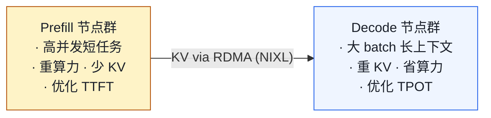
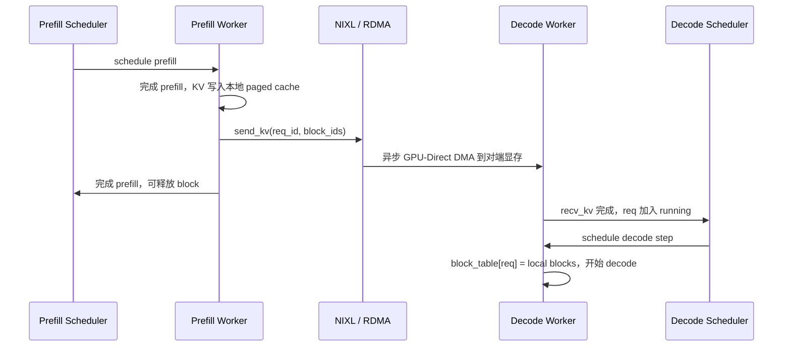

# 02. Disaggregated Prefill / Decode

> **谁该读这一篇？** 想理解"为什么大厂愿意花两倍机器把 prefill / decode 拆开"、"vLLM 通过哪个接口接 NIXL / LMCache / Mooncake"、"什么规模才划算"的读者。
>
> **前置阅读：** [`01-tp-pp-ep.md`](01-tp-pp-ep.md)（先掌握同机的多卡并行才能讲跨集群）；最好读过 [`02-core-concepts/05-chunked-prefill.md`](../02-core-concepts/05-chunked-prefill.md)（理解同卡上 prefill/decode 互相干扰的根源）。
>
> **耗时：** 约 12 分钟。
>
> **学完能：**
> 1. 解释为什么 prefill 和 decode 适合不同硬件配置（算术强度差）。
> 2. 画出 disaggregated 的数据流（含 KV 转移触发点）。
> 3. 列出 KV connector 接口的 3 个核心方法，知道 NIXL / LMCache / Mooncake 在该接口下怎么接入。
> 4. 判断"我这场景值不值得搞 disaggregated"（并发、SLO、网络成本）。

---

## 1. 为什么要拆？

prefill 和 decode 的硬件特性完全不同：

| 特性             | Prefill                | Decode               |
| -------------- | ---------------------- | -------------------- |
| 算法复杂度          | O(seq_len²)            | O(seq_len)           |
| 算术强度（FLOP/Byte） | 高（compute-bound）       | 极低（memory-bound）     |
| 单请求 token 量    | 几百到几万                  | 1                    |
| 适合的 batch     | 小 batch 也能打满 GPU      | 大 batch 才能打满带宽       |
| 适合的硬件         | 算力强的卡（H100、B200）       | 带宽强的卡（同上 + 大 KV）     |

把它们混在同一卡：

- 长 prefill 阻塞 decode（被 chunked prefill 缓解但没根治）
- decode 的 sampling/调度开销在 prefill 时浪费
- 难以同时优化 TTFT 和 TPOT

---

## 2. 解决方案



流程：

1. 请求到达 Router
2. Router 派给某个 Prefill 节点跑 prefill
3. Prefill 完成，把 KV 写到该请求的 block，通过 RDMA 传到 Decode 节点
4. Decode 节点接 KV，把请求放入自己的 batch，开始 decode
5. Decode 节点生成 token 流式返回

---

## 3. vLLM 的实现：KV Connector

`vllm/distributed/kv_transfer/` 提供 KV connector 抽象，每种传输后端实现接口：

| Backend | 协议            | 适用              |
| ------- | ------------- | --------------- |
| NIXL    | NVIDIA 的 GPU-Direct RDMA | InfiniBand / RoCE 集群 |
| LMCache | 缓存 + 转发        | 已有 LMCache 部署     |
| Mooncake | 月之暗面的方案         | 大规模分布式 KV       |
| Custom  | 自己写            | 实验/特殊场景         |

接口要点：

- `send_kv(req_id, blocks)`：prefill 节点调用
- `recv_kv(req_id) -> blocks`：decode 节点调用
- 异步：传输与计算 overlap

---

## 4. 数据流详解



关键点：

- 传输的是 **KV cache 内容**（block 数据），不是模型权重
- 不是 SwapOut/SwapIn 那种"换出再换入"，而是 source 节点的 KV 永久转移
- 用 RDMA 才有意义（PCIe 慢得多）

---

## 5. 为什么 NIXL 重要

NIXL 是 NVIDIA 开发的库，封装 GPUDirect RDMA：

- 从一卡的显存直接 DMA 到另一台机器上的卡显存
- 不经 CPU、不经主机内存（不像 vanilla MPI）
- 延迟 < 10 μs，带宽接近 NIC 上限

vLLM 通过 NIXL 让 disaggregated 在 ms 级 KV 转移上可行。

---

## 6. Scheduler 协调

两端都有自己的 Scheduler。挑战：

- Prefill 端要知道"KV 传过去了"才能 free 自己的 block
- Decode 端要知道"KV 收到了"才能开始 decode

vLLM 通过 KV connector 的回调 + Scheduler 的 metadata 字段（`kv_connector_metadata`）协调。这部分是 V1 时代的新设计。

---

## 7. 实际部署案例

- **Moonshot (Kimi)**：声称用 disaggregated 后 TTFT/TPOT 分别比同卡部署优 30%/40%
- **DeepSeek**：开源了 EPLB + disaggregated 工具链
- **NVIDIA Dynamo**：基于 vLLM/TRT-LLM 的 Disaggregated Serving Framework

---

## 8. 局限与挑战

1. **小并发不划算**：KV 传输有最小开销，请求少时不如同卡
2. **运维复杂**：两个集群、路由、故障切换
3. **prefix caching 难做**：缓存散布在多个 prefill 节点
4. **长上下文**：100k+ token 的 KV 转移本身可能 100ms+

---

## 9. 面试常见追问

**Q: 为什么 prefill 和 decode 适合的卡不同？**
A: prefill 是 compute-bound，要 FLOPs；decode 是 memory-bound，要 HBM 带宽。理论上 prefill 可用算力强的小显存卡，decode 用大显存高带宽卡。实际多用同型号卡但跑不同配置。

**Q: KV 转移是不是会被 prefill 节点的 free 阻塞？**
A: 是异步的，prefill 节点提交完转移就可以 free 本地 block，转移由 NIC + 接收端 buffer 接住。

**Q: 一个请求生成中途想接更多 token 怎么办？还是只在 prefill 节点？**
A: 不会回到 prefill。请求一旦进 decode 节点就一直留在那。如果生成中插入新 token（如 tool calling 返回），是新一轮的 prefill 续接，可以在原节点或新 prefill 节点跑。

**Q: vs chunked prefill？**
A: 互补。chunked prefill 是同卡上把长 prefill 切片，缓解阻塞但不消除。disaggregated 是物理隔离，根治。

---

## 10. 什么场景值得搞 disaggregated？

不是所有场景都值得搞。下面这张决策表给你判据：

| 场景 | 建议 | 理由 |
| --- | --- | --- |
| QPS < 50 / 单机即可承载 | **不搞** | KV 传输固定开销摊不掉，运维成本 >> 收益 |
| TTFT 与 TPOT 都已达 SLO | **不搞** | 没需求 |
| TTFT 严重不达标但 TPOT OK | **可搞**（多 prefill 节点）| 但先试 chunked prefill / prefix caching 是否能解决 |
| 同机一开 chunked 就 TPOT 抖 | **强烈考虑** | 这就是 disaggregated 解决的核心矛盾 |
| 长上下文（≥ 100K token）| **看情况** | KV 转移本身可能 100ms+，得算清楚 |
| RDMA 网络不具备（只有以太网） | **不搞** | 走 PCIe / TCP 的 KV 转移会让 TPOT 雪崩 |
| 多模型 / LoRA 切换频繁 | **不搞** | prefill 节点重启/换模型很贵 |
| 高 prefix cache 命中率（70%+）| 谨慎 | cache 散布到多 prefill 节点，命中率会下降，需要 cache-aware routing 抵消 |

业界报告的收益（参考量级，不要当真实数字）：

- Moonshot Kimi：TTFT -30% / TPOT -40%（混合长短 prompt workload）
- llm-d 论文：高 QPS 长上下文下吞吐 +38.9%
- 大部分公开数据来自高并发 + 异构 workload。低并发 / 同构 workload 收益不明显或为负。

---

## 小结

- Disaggregated 通过物理隔离 prefill / decode，根治"长 prefill 阻塞 decode"和"硬件特性不匹配"两个矛盾。
- vLLM 用 **KV connector 抽象**屏蔽传输细节，NIXL / LMCache / Mooncake 都通过它接入。
- 数据流核心是异步 KV 转移 + 双端 Scheduler 协调；prefill 完成可立即 free，decode 端按 `kv_connector_metadata` 知道 KV 何时就绪。
- 不是银弹：小并发、无 RDMA、模型频繁切换的场景反而吃亏。

## 自检

> 答案不必照搬，能讲到关键点即可。

**1. KV connector 的 3 个核心方法 + 接入新 transport 要实现什么？**

源码：`vllm/distributed/kv_transfer/` 的 `KVConnectorBase` 抽象接口。

```python
class KVConnectorBase(ABC):
    @abstractmethod
    def send_kv_caches_and_hidden_states(
        self,
        request_id: str,
        kv_blocks: list[KVCacheBlock],
        hidden_states: torch.Tensor,
    ) -> None:
        """prefill 节点：把这个请求的 KV + 最后 hidden state 发出去"""

    @abstractmethod
    def recv_kv_caches_and_hidden_states(
        self,
        request_id: str,
    ) -> tuple[list[KVCacheBlock], torch.Tensor]:
        """decode 节点：等收到对应请求的 KV + hidden state"""

    @abstractmethod
    def close(self) -> None:
        """清理资源（关闭 RDMA queue pair、释放 buffer 等）"""
```

**接入新 transport 要做的事**：

1. 继承 `KVConnectorBase`，实现上面 3 个方法
2. 把传输细节封装在内部（建立连接、序列化 KV、流控）
3. 通常需要异步（`send` 返回 Future）—— scheduler 不能阻塞等
4. 在 `vllm/distributed/kv_transfer/factory.py` 或类似注册表里加 `"my_transport": MyConnector`
5. 配套测试：单元测（mock 一对发收）+ 集成测（两个 vLLM 实例对发）

**关键挑战**：metadata 一致性。两端要约定 KV 块的 token 边界、layer 顺序、dtype 等——通常通过元数据 header（msgpack）+ 内容 buffer 分开传，header 走 ZMQ，内容走 RDMA。

---

**2. prefill 节点跑到 80% 时崩了，请求会怎样？**

**默认 vLLM 行为**：

1. **检测**：decode 节点等 KV 超时（默认 30-60s timeout）→ 标该请求 failed
2. **响应**：API Server 收到 abort，返回 5xx 错误给客户端
3. **重试**：取决于客户端策略，vLLM 自己不重试

**进阶（部分平台如 llm-d 实现）**：

1. **重新调度**：把请求送回 prefill 节点池（新选一个健康节点），从头开始 prefill
2. **代价**：80% 的 prefill 算力全部白费
3. **复杂度**：需要 router 层记得请求原始 prompt（API Server 端的状态），prefill 输出尚未到 decode 时算丢失

**生产建议**：

- prefill 集群冗余度高于 decode（prefill 重做代价更高）
- 设置合理的 prefill 超时（不能太短让正常长 prompt 误杀，也不能太长拖累恢复）
- 监控 `prefill_node_failure_total` metric，超阈值告警

---

**3. 为什么用 InfiniBand / RoCE 而不是以太网？100K token KV 转多少 MB？**

**Llama-70B KV 计算**（GQA：8 KV head × 128 head_dim × 80 layer）：

- 单 token KV = 2 (K+V) × 8 × 128 × 80 × 2 (BF16) = **327,680 字节 ≈ 320 KB**
- 100K token = 320 KB × 100,000 = **32 GB**（确实大）

**网络选择**：

| 网络 | 带宽 | 转 32GB 时长 |
| --- | --- | --- |
| 1Gbps 以太网 | 125 MB/s | **256 秒** —— 不可能 |
| 10Gbps 以太网 | 1.25 GB/s | 25 秒 —— 不可接受 |
| 100Gbps 以太网（RoCE）| 12.5 GB/s | 2.5 秒 —— 还是太长 |
| **400G InfiniBand HDR** | 50 GB/s | **640 ms** —— 接近可用 |
| **NVLink 跨机（NVL72 等）** | 900 GB/s | 35 ms —— 理想 |

→ 对 100K token 这种极端长上下文，连 IB 都吃力，需要做**层级 streaming**（不等整请求 KV 全到，按 layer 分批发送，decode 节点收到第 N 层就开始算第 N 层），或 **prefix-aware routing**（让相似 prefix 的请求路由到同一组节点，复用 cache 减少传输）。

**常见上下文长度（4-16K token）**: 1-5 GB，10Gbps 以太网 800 ms 可接受，IB 100 ms 流畅。这是 disaggregated 的主战场。

---

**4. prefix cache 在 disaggregated 下命中率怎么变？怎么补救？**

**变差**。原因：

1. **prefill 集群分片**：原本同 prompt 命中同一 vLLM 实例的 cache，disaggregated 后分散到多个 prefill 节点，每个节点的 cache 独立 → 命中率 ÷ prefill_node_count
2. **decode 节点 cache 失效**：decode 节点收到的 KV 是"传过来的"，不算 cache 命中（每次都重传等价于重算）

**补救**：

| 方案 | 怎么做 | 代价 |
| --- | --- | --- |
| **Cache-aware routing** | router 维护 "请求 prompt hash → 之前打到的 prefill 节点" 映射，让同 prefix 请求落同一节点 | router 层复杂度 + 节点负载可能不均 |
| **L2 共享 cache（CPU DRAM）** | prefill 节点把 cache spill 到共享 CPU 内存池（LMCache 等），所有 prefill 节点可查 | L2 命中比 L1 慢 10×，需 RDMA |
| **L3 共享 cache（远端）** | 把 cache 放到 NVMe / 对象存储，跨集群 cluster 共享 | L3 慢 100×，仅适合超长冷 prompt |
| **prefix-pinned 部署** | 已知热门 system prompt 在所有 prefill 节点 pre-warm | 需要业务知识，pin 列表手工维护 |
| **不做 disaggregated** | 如果 prefix cache 命中率是核心 KPI，重新考虑架构 | 见 §10 决策表 |

实战：**80% 的 disaggregated 部署都配 cache-aware routing**，否则 disaggregated 的收益（latency / TPOT 改善）会被 prefix cache 命中率下降抵消，得不偿失。详见 [`08-production-deployment/02-smart-routing-and-load-balancing.md`](../08-production-deployment/02-smart-routing-and-load-balancing.md)。

## 下一步

- 想看 KV connector 源码：`vllm/distributed/kv_transfer/` 与 `vllm/v1/kv_offload/`。
- 想看智能路由怎么帮 disaggregated 降低 KV 传输：[`08-production-deployment/02-smart-routing-and-load-balancing.md`](../08-production-deployment/02-smart-routing-and-load-balancing.md)。
- 想理解部署平台怎么管两个集群（llm-d / Dynamo / AIBrix）：[`08-production-deployment/01-deployment-architectures.md`](../08-production-deployment/01-deployment-architectures.md)。
- 想做生产化故障预案：[`08-production-deployment/06-reliability-and-failure-modes.md`](../08-production-deployment/06-reliability-and-failure-modes.md)。
