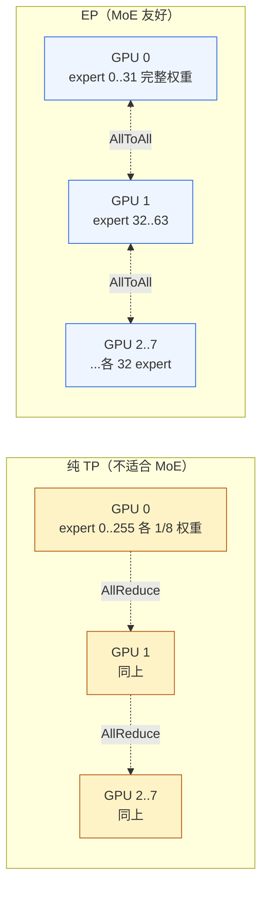
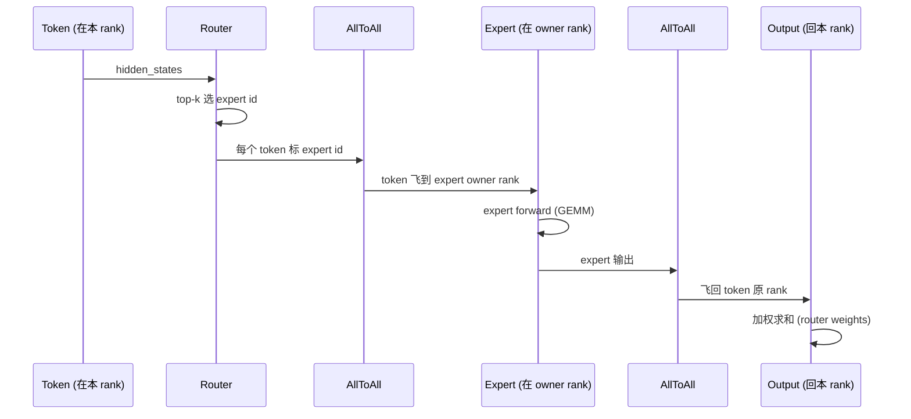

# 03. Expert Parallel 深度：AllToAll、6 个后端、负载均衡

> **谁该读这一篇？** 部署 DeepSeek-V3 / Qwen3-MoE / Mixtral / GPT-OSS 这类 MoE 模型的工程师；想理解"为什么大 MoE 模型常配 DP + EP 不只是 TP"、"vLLM 提供哪些 all2all 后端、怎么选"的同学；做容量规划要算 expert 负载不均的人。
>
> **前置阅读：** [`01-tp-pp-ep.md`](01-tp-pp-ep.md)（先了解 EP 的基本概念再来看实现细节）；最好读过 [`03-code-walkthrough/07-model-architectures.md`](../03-code-walkthrough/07-model-architectures.md)（MoE 层的整体结构）。
>
> **耗时：** 约 18 分钟。
>
> **学完能：**
> 1. 画出 MoE 一层的 dispatch → expert → combine 数据流，标出 AllToAll 的两个发生点。
> 2. 区分 vLLM 的 6 个 all2all 后端的适用场景：AgRs / DeepEP-HT / DeepEP-LL / FlashInfer NVLink (2-sided / 1-sided) / Mori / NIXL-EP。
> 3. 解释 "EP + DP" 组合为什么比纯 EP 更常见，以及 `tp_size * dp_size * pcp_size` 怎么决定 expert 切片数。
> 4. 判断什么时候需要 EPLB（Expert Parallel Load Balancing）；说出 vLLM 监控负载不均要看哪个 metric。

---

## 1. 为什么 MoE 一定要 EP？

DeepSeek-V3 这种 MoE 模型有 256 个 expert，每层 router 只激活 8 个（top-k=8）。如果用纯 TP 把模型切到 8 卡：

- 每张卡都加载全部 256 expert 的 1/8（按权重切）
- 每个 token 路由到 8 个 expert，**每张卡都被涉及**
- TP-style AllReduce 频繁，且**算力浪费在不被激活的 expert 切片上**

EP 的思路：**每个 expert 整块**放在一张卡上（不切权重），token 按 router 决定**飞到对应卡**。代价是引入 all-to-all 通信。



EP 的核心通信是 **AllToAll**，不是 AllReduce。

---

## 2. MoE 一层的数据流（含通信点）



**两次 AllToAll**：dispatch 和 combine 各一次。每层每次 forward 都来一遍——MoE 通信开销主要在这里。

源码层关键类（`vllm/model_executor/layers/fused_moe/modular_kernel.py`）：

- `FusedMoEPrepareAndFinalizeModular` — 抽象 dispatch + combine 流程
- `FusedMoEExpertsModular` — 抽象 expert 计算
- `FusedMoEModularKernel` — 组合二者

---

## 3. EP 配置：tp_size / dp_size / ep_size / pcp_size 怎么咬合

源码：`vllm/model_executor/layers/fused_moe/config.py:1007` 的 `FusedMoEParallelConfig`：

```python
@dataclass
class FusedMoEParallelConfig:
    tp_size: int
    pcp_size: int       # prefill context parallel
    dp_size: int
    ep_size: int
    use_ep: bool        # 是否启用 EP
    all2all_backend: str
    enable_eplb: bool
```

**关键关系**（参考 `flatten_tp_across_dp_and_pcp` 方法）：

- 纯 TP 模型：`ep_size = 1`，`dp_size = 1`。MoE 权重像普通权重那样按 TP 切。
- EP 启用时：`ep_size = tp_size × dp_size × pcp_size`。Expert 数被均分到这么多个 rank。

**为什么常常 EP + DP 一起用？**

DeepSeek-V3 有 256 expert。如果只 EP-8：每张卡放 32 expert。但 hidden_size=7168、moe_intermediate=2048，一个 expert 权重约 28 MB（BF16），32 个 = 896 MB——加上 base model 还能塞下 H100。
若要 EP-32（每卡 8 expert，更细粒度负载均衡）：需要 32 张卡，但 dense 部分用不了 32-way TP（hidden_size 不够分），所以做 TP-8 + DP-4 → ep_size=32。

这就是**"宽 EP"**部署模式（wide-EP），DeepSeek / Qwen3-MoE 常用。

---

## 4. AllToAll 的 6 个后端

vLLM 在 `vllm/distributed/device_communicators/all2all.py` 提供多种实现，通过 `--all2all-backend` 选：

| 后端 (`all2all_backend`) | 实现类 | 协议 | 适用 | 限制 |
| --- | --- | --- | --- | --- |
| `allgather_reducescatter` | `AgRsAll2AllManager` | NCCL AllGather + ReduceScatter | **默认通用**，无第三方依赖 | 通信量 = `world_size × token_per_rank`，大集群偏贵 |
| `deepep_high_throughput` | DeepEP HT | DeepSeek 出的 NVLink/IB 优化 AllToAll | **大 batch、prefill 重负载** | 需装 deep_ep 库；NVLink 集群最优 |
| `deepep_low_latency` | DeepEP LL | DeepEP 的低延迟变体 | **decode 阶段、小 batch** | 同上；LL 牺牲吞吐换 latency |
| `flashinfer_nvlink_two_sided` 或 `flashinfer_all2allv` | FlashInfer 2-sided | NVLink 多节点（MNNVL） | 节点内大集群 NVLink fabric | 需 flashinfer + NVLink 拓扑 |
| `flashinfer_nvlink_one_sided` | FlashInfer 1-sided | NVLink 单向 RDMA | 同上，部分场景延迟更优 | 同上 |
| `mori` | Mori | 阿里出的优化方案 | 阿里集群 / 特定环境 | 需装 mori |
| `nixl_ep` | NIXL EP | NVIDIA NIXL EP 模式 | Disaggregated + EP 混合 | 需 NIXL 配套 |

**选型决策**：

```
NVLink + DeepSeek 风格大 MoE → 优先 DeepEP（HT for prefill, LL for decode）
NVLink-only 单机 8 卡 → AgRs 够用，编译简单
跨节点 RDMA → FlashInfer 系列
不确定 → AgRs（默认即可），生产化再换
```

源码中通过 `FusedMoEParallelConfig.use_deepep_ht_kernels` 等 properties 判断当前用哪个。

---

## 5. AllToAll 的延迟成本

每层两次 AllToAll，80 层模型 = 160 次/forward。

**示意量级**（NVLink 集群，H100，EP-8）：

| backend | 单次 AllToAll latency (ms) | 全模型 160 次 (ms) | 占 forward 比 |
| --- | --- | --- | --- |
| AgRs | 0.5 - 2.0 | 80 - 320 | 30-60%（瓶颈！） |
| DeepEP HT | 0.2 - 0.8 | 32 - 128 | 15-30% |
| DeepEP LL | 0.1 - 0.4 | 16 - 64 | 5-15% |

这就是为什么 DeepSeek 必须自己写 DeepEP——通用 NCCL AllToAll 在大 MoE 上是真瓶颈。

跨节点（多机）成本：再 ×3-5（RoCE）或 ×2（IB）。所以 wide-EP（多机）务必上 RDMA + 优化 backend。

---

## 6. Expert 负载不均：原因与监控

理论上 router 均匀分配，但实际：

- 训练数据有偏，某些 expert 被偏好（"hot experts"）
- 长尾分布：5-10 个 expert 吃掉 30-50% 的 token
- 不均会让"忙 expert 所在 rank"成为瓶颈，闲 rank 空转

**vLLM 的应对：**

### 6.1 ExpertMapManager
`vllm/model_executor/layers/fused_moe/expert_map_manager.py:152` 管理 logical_expert_id → physical_rank 的映射。

### 6.2 RoutedExpertsCapturer
`vllm/model_executor/layers/fused_moe/routed_experts_capturer.py:58` 在 forward 时统计每个 expert 收到多少 token，把数据回吐给 scheduler。

### 6.3 EPLB（Expert Parallel Load Balancing）
启用：`enable_eplb=True`（`FusedMoEParallelConfig.enable_eplb`）。

EPLB 的思路：

- 热 expert **复制到多 rank**（一个 expert 多个 owner）
- 冷 expert 多个**合并到同 rank**
- 物理 expert 数 > 逻辑 expert 数

DeepSeek-V3 论文给的方案：256 logical → 288 physical（多 32 个副本）。

代价：

- 显存（多副本占 GPU）
- 路由复杂度上升
- 副本同步问题（推理时一般 stateless，影响小）

### 6.4 何时该开 EPLB？

| 信号 | 是否开 EPLB |
| --- | --- |
| 同一模型某些 GPU `nvidia-smi` 持续 100%，另一些 30-50% | **开** |
| `vllm:iteration_tokens_total` 方差大 | **可能** |
| 离线 batch 跑稳定的某个 workload | **开**（按 workload 调副本） |
| 在线服务请求模式多变 | 谨慎（profile 后再决定） |
| 单机 EP-8 小模型 | 不开（不均也不严重） |

---

## 7. EP + Prefix Caching、EP + Disaggregated

### 7.1 EP 对 prefix caching 的影响

prefix caching 在 attention 层做（不在 MoE 层）。EP 只影响 MoE 层，**对 prefix caching 行为无直接影响**。但 EP 通常配合 DP 用，DP 各 rank 独立维护 cache——总 cache 容量 ×dp_size 但**互不共享**。

可以通过 cache-aware routing 让相同 prefix 的请求打到同一 DP rank，缓解。

### 7.2 EP + Disaggregated

理论可叠加：prefill 集群和 decode 集群各自做 EP 部署。`nixl_ep` backend 就是为此设计。

实践细节：

- prefill 集群 expert 分布 vs decode 集群可以不同（不同 workload 偏好不同 expert）
- KV transfer 量与 EP 无关（KV 仍按 token + layer 维度切）

---

## 8. 故障与降级

**症状 → 原因 → 处理：**

| 症状 | 可能原因 | 处理 |
| --- | --- | --- |
| 启动 `expected DeepEP installed` | 选了 deepep_* 但没装 | `pip install deep_ep` 或换 backend |
| AllToAll hang | NCCL 死锁 / expert 分布不一致 | `NCCL_DEBUG=INFO`、检查 expert_map 同步 |
| 某 rank OOM 但其他 rank 空闲 | 严重 expert 负载不均 | 开 EPLB 或调整 expert 分布 |
| forward 慢 + 网络利用率高 | AllToAll 是瓶颈 | 换 DeepEP / FlashInfer，或减少 ep_size |
| forward 慢 + 网络利用率低 | expert GEMM 是瓶颈 | 减 dp_size、减小 batch、看是否量化能加速 |

---

## 小结

- MoE 模型必须用 EP 而非 TP——expert 整块放一张卡，token 飞到对应卡，通信是 **AllToAll** 而不是 AllReduce。
- 一层 MoE 有 2 次 AllToAll（dispatch + combine），80 层模型一次 forward 共 160 次——这是 MoE 推理的核心瓶颈，因此有 6+ 个后端可选。
- **TP × DP × PCP = EP 切片数**。大 MoE 模型常用"宽 EP"：TP-8 × DP-N → ep_size=8N，专家分布更细粒度。
- DeepEP HT/LL 是 DeepSeek 自家优化，NVLink 集群下比 AgRs 快 2-5×；跨节点用 FlashInfer。
- expert 负载不均是常见问题；vLLM 通过 `RoutedExpertsCapturer` 统计 + `ExpertMapManager` 重映射 + EPLB（多副本）应对。

## 自检

> 答案不必照搬，能讲到关键点即可。

**1. 256 expert, top-k=8, TP-8 + DP-4, ep_size 和每卡几个 expert？**

公式：`ep_size = TP × DP × PCP` （PCP 默认 1）

```
ep_size = 8 × 4 × 1 = 32
每卡 expert 数 = 256 / 32 = 8
```

总 GPU 数 = TP × DP × PP = 8 × 4 × 1 = 32 卡。

**实际部署**：DeepSeek-V3 256 expert + TP-8 + DP-4 = 32 卡集群，每卡 8 个 expert，每层 forward 跑 2 次 32-rank AllToAll。常配 IB/NVLink Switch System（GH200 NVL32 / GB200 NVL72）。

加分点：如果 expert 数不整除 ep_size（如 250 个 expert + ep_size=32），需要 EPLB 加 padding（凑到 256 → 每卡 8）或者整除约束失败启动报错。

---

**2. AgRs 跑 DeepSeek-V3 慢，先改什么？观察什么 metric？**

**改什么**：把 `--all2all-backend` 从默认的 `allgather_reducescatter` 改成 **`deepep_high_throughput`**（NVLink 集群）或 `deepep_low_latency`（追求 decode latency）。

```bash
vllm serve deepseek-ai/DeepSeek-V3 \
    --enable-expert-parallel \
    --all2all-backend deepep_high_throughput
```

**前提**：装 `deep_ep` 库（`pip install deep_ep`）+ NVLink 集群。

**观察 metric**：

1. **`vllm:time_to_first_token_seconds` p99** —— prefill TTFT 应明显下降（AllToAll 占 prefill 不小）
2. **`vllm:request_time_per_output_token_seconds`** —— decode TPOT 看是否抖动减小
3. **`nvidia-smi dmon`** 或 NCCL profile —— 每层 AllToAll 时长（AgRs 1-2 ms，DeepEP HT 0.2-0.8 ms，5× 提速）
4. **`vllm:iteration_tokens_total`** 分布 —— step 时长更平稳

若 DeepEP HT 仍不够（跨多节点）→ 尝试 `flashinfer_nvlink_two_sided`（FlashInfer + NVLink fabric）。

---

**3. EPLB 256→288 physical, top-k=8, 每 token 发到几个 rank？**

仍然是 **top-8 个 expert**——EPLB 不改 top-k 值，只改 logical→physical 映射。

但每个 logical expert 可能对应多个 physical expert（副本），router 选 top-8 logical 后，**还要决定具体打哪个副本**：

```
logical_expert_id  →  [physical_replica_0, physical_replica_1, ...]
                       住在 rank A             住在 rank B (副本)
```

具体 dispatch：

- 副本数为 1 的 expert：必定打到唯一 rank
- 副本数 > 1 的 expert：按负载均衡策略选副本（round-robin / 按本步 owner rank 当前 load / 随机）

**每 token 实际涉及多少 rank**：最多 8 个（top-k），最少更少（如果 8 个选中的 expert 都恰好在同 rank）。**期望 ≈ min(8, ep_size)**——即 8（因为 ep_size=32 远大于 8）。

→ 复制副本主要让 hot expert 不挤——同一个 hot logical expert，原来所有打它的 token 都飞到 rank A，现在分散到 A 和 B。

---

**4. `use_deepep_ll_kernels` 的具体条件 + 为什么 dp_size=1 不启用 deepep？**

源码：`vllm/model_executor/layers/fused_moe/config.py`

```python
@property
def use_all2all_kernels(self):
    return self.dp_size > 1 and self.use_ep

@property
def use_deepep_ll_kernels(self):
    return self.use_all2all_kernels and self.all2all_backend == "deepep_low_latency"
```

**两个条件**：

1. `use_all2all_kernels`：需要 `dp_size > 1` **且** `use_ep == True`
2. `all2all_backend == "deepep_low_latency"`

**为什么 `dp_size = 1` 不启用？**

当 `dp_size = 1` 时：

- 整个 EP 退化为"单 DP 实例内部的 EP"——即 ep_size = TP（仅靠 TP 维度切 expert）
- 这种场景下 expert 切分粒度有限（TP 通常 ≤ 8），AllToAll 也只在 TP 组内进行
- **完全可以用 TP 组的常规 NCCL collective 处理**——AllReduce / AllGather 等
- 走 DeepEP 这种"跨 DP rank 通信"的专用 kernel 是 overkill，反而引入 setup 开销

只有当 `dp_size > 1`（典型 wide-EP 配置：TP=8, DP=4, EP=32）时：

- expert 跨 DP 维度分布，需要真正的"非 TP 组的 AllToAll"
- DeepEP / FlashInfer NVLink kernel 才有用武之地

→ 设计上把"小集群单 DP"和"大集群多 DP"两种场景分流，避免 wide-EP kernel 在小场景下成为负担。

## 下一步

- 下一节：[`04-context-parallel.md`](04-context-parallel.md)（PCP / DCP——长上下文场景下另一种切分维度）。
- 想看源码：`vllm/model_executor/layers/fused_moe/config.py:1007`（ParallelConfig）、`vllm/distributed/device_communicators/all2all.py`（6 个后端）、`vllm/model_executor/layers/fused_moe/expert_map_manager.py`（EPLB 核心）。
- 想从生产视角理解：[`08-production-deployment/04-autoscaling-and-capacity.md`](../08-production-deployment/04-autoscaling-and-capacity.md)（MoE 的容量规划要把 EP 维度算进去）。
- 想看 DeepEP 论文与实现：DeepSeek GitHub deep-ep 仓库。
