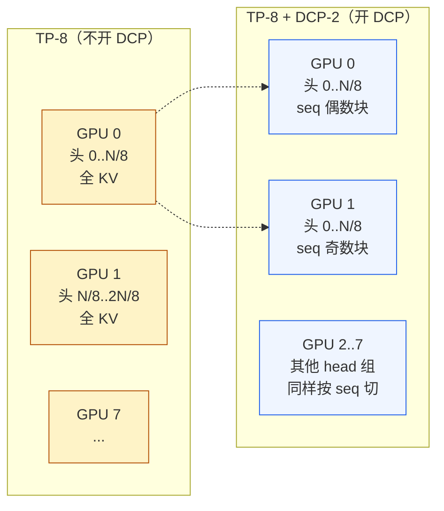
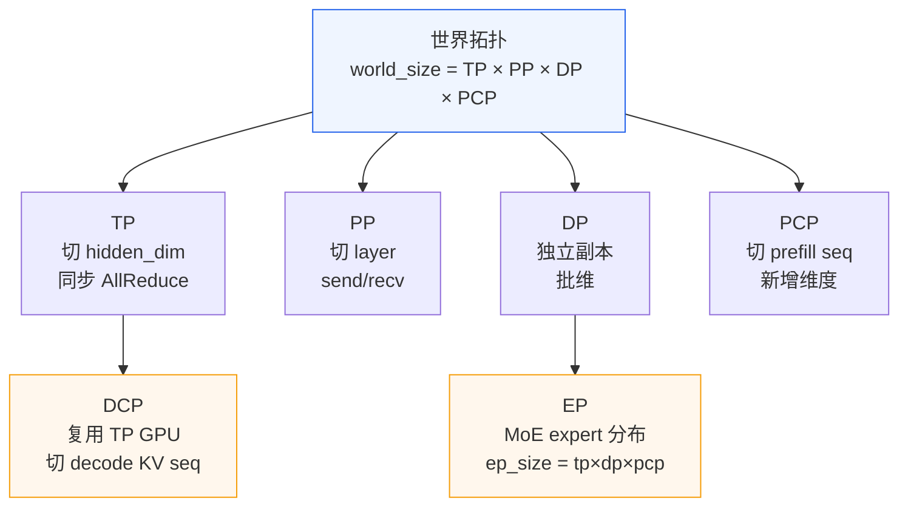

# 04. Context Parallel：PCP / DCP 与长上下文切分

> **谁该读这一篇？** 部署 128K / 1M token 长上下文场景的工程师；想理解"为什么 TP 切不动长 prompt、CP 怎么补位"、"PCP 和 DCP 是两个独立维度"的同学；做 MLA 模型（DeepSeek 类）分布式部署的人。
>
> **前置阅读：** [`01-tp-pp-ep.md`](01-tp-pp-ep.md)（先掌握 TP/PP/EP）；最好读过 [`02-core-concepts/05-chunked-prefill.md`](../02-core-concepts/05-chunked-prefill.md)（理解 prefill 的切分思路）。
>
> **耗时：** 约 14 分钟。
>
> **学完能：**
> 1. 区分 PCP（Prefill CP）和 DCP（Decode CP）——它们是**两个独立**的并行维度。
> 2. 解释 DCP 为什么"不增加 world_size"——它复用 TP 组的 GPU，本质是 attention 的另一种切法。
> 3. 选 DCP 的通信后端：`ag_rs` vs `a2a`，以及为什么 MLA 模型用 `a2a` 能省 1/3 NCCL 调用。
> 4. 计算 `cp_kv_cache_interleave_size` 对 KV 物理分布的影响。

---

## 1. 为什么需要 Context Parallel

TP 把权重切到多卡，每张卡 hidden_dim 减少；但**每张卡仍要处理完整的 seq_len**。Llama-70B prompt=128K tokens：

- attention 中间矩阵 `Q @ K^T` 形状 `[batch, num_heads, seq_len, seq_len]`
- seq_len² = 128K² = 16 G 元素，半精度 32 GB——远超单卡

FlashAttention 把这个常驻矩阵 fuse 掉，但**激活仍是 O(seq_len)**。长上下文下 activation memory + KV cache 才是真瓶颈。

CP 的思路：**把 seq 维度切到多卡**，每卡只持有 seq_len/cp_size 个 token 的 K/V/激活。代价是 attention 跨卡时要通信。

---

## 2. vLLM 的两个 CP：PCP 和 DCP

vLLM 把 CP 分成了两个独立的并行维度，源码：`vllm/config/parallel.py:115, 310`。

| 维度 | 字段 | 作用 | 是否增加 GPU |
| --- | --- | --- | --- |
| **PCP** | `prefill_context_parallel_size` | **prefill 阶段**切 seq | 是 — 与 TP/PP/DP 正交 |
| **DCP** | `decode_context_parallel_size` | **decode 阶段**切 KV cache 的 seq 维 | **否** — 复用 TP 组 GPU |

**为什么要分开？**

- Prefill 是 compute-bound，长 seq 算力压力大，PCP 真的需要更多 GPU 参与同一次 forward。
- Decode 每步只产 1 个新 token，算力不大，但 **KV cache 沿 seq 维堆得越来越长**——DCP 把 KV 切到多个 attention head 组（实质 reuse TP），不需要额外 GPU。

source: `decode_context_parallel_size` 注释明确写：

> "the world size does not change by dcp, it simply reuse the GPUs of TP group, and tp_size needs to be divisible by dcp_size"

---

## 3. DCP 的工作原理（最常用的 CP）



DCP-2 时：原 TP-8 的 head 0 那张卡，**变成 2 张卡**，每张持有一半 seq。Attention 完成后通过通信合并。

**约束**：`tp_size % dcp_size == 0`（`parallel.py:474-477`）。常用：TP-8 + DCP-2 或 TP-8 + DCP-4。

---

## 4. DCP 的通信后端：`ag_rs` vs `a2a`

源码：`parallel.py:323-329` 的 `dcp_comm_backend` 配置：

| Backend | 通信模式 | 每层 NCCL 调用数 | 适用 |
| --- | --- | --- | --- |
| `ag_rs`（默认） | AllGather + ReduceScatter | 3 (AG of K, AG of V, RS of out) | 通用 |
| `a2a` | AllToAll 交换 partial output + LSE，Triton kernel 合并 | 2 | **MLA 模型**专用 |

为什么 `a2a` 对 MLA 友好？MLA（DeepSeek 用的 Multi-head Latent Attention）的 K/V 实际是从 latent 投影出来的小张量——AllGather 拉全 K/V 浪费带宽。AllToAll 各卡只交换"partial output（已 attended）+ LogSumExp 标量"，比 K/V 张量小得多。然后 Triton kernel 拿 partial + LSE 合并出全局正确的 output。

**注意约束**：`a2a` 需 `dcp_size > 1`（line 480-482），否则报错。

```python
# parallel.py:480-482
if self.dcp_comm_backend == "a2a" and self.decode_context_parallel_size <= 1:
    raise ValueError(
        "dcp_comm_backend='a2a' requires decode_context_parallel_size > 1."
    )
```

---

## 5. KV cache 的 interleave 切分

DCP / PCP 把 KV 切到多卡后，要决定**怎么按 seq 切**：

源码：`cp_kv_cache_interleave_size`（`parallel.py:335`）：

```
total_cp_rank = pcp_rank * dcp_world_size + dcp_rank
total_cp_world_size = pcp_world_size * dcp_world_size

store interleave_size tokens on total_cp_rank i,
then store next interleave_size tokens on total_cp_rank i+1.
```

例：`interleave_size=1`、`total_cp_world_size=4`：

- token 0 → rank 0, token 1 → rank 1, token 2 → rank 2, token 3 → rank 3
- token 4 → rank 0, token 5 → rank 1, ...（轮询）

`interleave_size=16`、`total_cp_world_size=4`：

- token 0..15 → rank 0, token 16..31 → rank 1, ...

**为什么不只用 1 或 chunk-of-block_size？**

- `=1` 最均匀但每个 rank 都要存"散乱"的 token，cache 局部性差。
- `=block_size`（如 16）按块切，物理连续，与 PagedAttention block 友好。
- 默认 1（最均匀），生产可调。

**注意**：`dcp_kv_cache_interleave_size` 已被 `cp_kv_cache_interleave_size` 替代（向后兼容，将逐步 deprecate）。

---

## 6. PCP（Prefill CP）：更复杂、更新

PCP 是较新的功能（注释提到"will be deprecated when PCP is fully supported"，说明仍在路上）。

**思路**：prefill 长 seq 切到多卡，每卡算一段，attention 时跨卡组合。

**典型用法**：长上下文（128K+）prefill。例如 prompt 长 200K，TP-8 + PCP-4：

- 每张卡 hidden_dim ÷ 8
- 每张卡 seq_len ÷ 4 = 50K
- attention 跨 4 卡组合（环形 KV 传递，类似 Ring Attention）

**与 chunked prefill 的关系**：互补。

- chunked prefill：**时间维度**切（一次 forward 跑一段，多次 forward 完成全 prefill）
- PCP：**空间维度**切（一次 forward 多卡并行，每卡一段）

**适用判据**：

- chunked prefill 已能用 → 单机够用，简单可靠
- 单机塞不下 prefill 中间激活 → 上 PCP（需要 RDMA 网络）

---

## 7. 与其他并行组合



**关键约束总结：**

| 关系 | 约束 |
| --- | --- |
| world_size | `tp × pp × dp × pcp` |
| ep_size | `tp × dp × pcp`（EP 启用时） |
| DCP | `tp % dcp == 0`，不影响 world_size |
| 混合 KV cache（Mamba + attention） | 当前**不支持 CP**（`kv_cache_utils.py:599-602` 报错） |

---

## 8. 实际选择决策表

| 场景 | 建议 |
| --- | --- |
| 短上下文（< 8K） | 不开 CP，TP/PP/DP 即可 |
| 中长上下文（8K-32K）+ MLA 模型 | DCP-2 with `a2a` backend |
| 中长上下文 + 非 MLA | DCP-2 with `ag_rs`（默认）或不开 |
| 长上下文（32K-128K） | DCP-2 或 DCP-4，按 KV 显存压力定 |
| 超长上下文（128K+） prefill 阶段塞不下 | PCP-2 或更多 + chunked prefill |
| Mamba 类模型 | **不能**用 CP（vLLM 限制） |

---

## 9. 监控与调试

CP 不像 TP/PP 有专门 metric，主要观察：

- `vllm:kv_cache_usage_perc`：DCP 开启后整体 cache 利用率应更均匀
- `vllm:time_to_first_token_seconds` p99：PCP 开启长 prefill 应更平稳
- `nvidia-smi`：DCP 不增 GPU 数，但每张卡负载应平衡（之前 head 0 那卡的活分给 dcp_size 张）

常见错误：

- `ValueError: dcp_comm_backend='a2a' requires decode_context_parallel_size > 1` — 没开 DCP 却选了 a2a
- `RuntimeError: Hybrid KV cache groups ... do not support context parallelism` — Mamba 模型不能用 CP

---

## 小结

- vLLM 的 CP 是**两个独立维度**：PCP 给 prefill 切 seq + 加 GPU；DCP 给 decode 切 KV seq + **复用** TP GPU。
- DCP 是最常用的，约束 `tp % dcp == 0`；backend 有 `ag_rs`（默认 3 NCCL/层）和 `a2a`（2 NCCL/层，**MLA 专用**）。
- `cp_kv_cache_interleave_size` 控制 KV 在 CP rank 间的分配粒度——大值物理连续，小值更均匀。
- PCP 与 chunked prefill 互补：chunk 是时间维，PCP 是空间维；超长上下文塞不下时上 PCP。
- 当前限制：Mamba / 混合 KV cache 不支持 CP。

## 自检

> 答案不必照搬，能讲到关键点即可。

**1. TP-8 + DCP-2 用几张 GPU？为什么 DCP 不增 GPU？**

总 GPU = **8 张**（仅 TP 的 8 张）。

**为什么 DCP 不增 GPU**：DCP 是"复用 TP 组的 GPU 切分 KV seq 维"，**约束 `tp_size % dcp_size == 0`**：

```
原 TP-8 配置：
  rank 0..7 各持有 head 集合 H_0..H_7，每张卡有完整 seq 的 K/V

TP-8 + DCP-2：
  把 TP 组拆成"head 组 × DCP 组"：
    rank 0: head_0 + seq 偶数块 (DCP rank 0)
    rank 1: head_0 + seq 奇数块 (DCP rank 1)
    rank 2: head_1 + seq 偶数块 (DCP rank 0)
    rank 3: head_1 + seq 奇数块 (DCP rank 1)
    ...
```

**等价于**：原 8 个 head（每卡 1 个）变成 4 个 head 组（每组 2 卡共享，按 seq 切）。world_size 不变，但 **KV cache 占用 / 卡 ≈ 减半**——长上下文场景可装下更多 token。

加分点：DCP 实质是"用 head 维度换 seq 维度"的资源重分配；前提是 head 数足够多（tp_size 不被 head 数撑死）。

---

**2. MLA 模型 DCP-4, `a2a` 比 `ag_rs` 省多少 NCCL 调用（80 层）？**

每层 attention 的 DCP 通信：

- **`ag_rs`**：3 次 NCCL —— AllGather K, AllGather V, ReduceScatter output
- **`a2a`**：2 次 NCCL —— AllToAll (partial output + LSE), Triton kernel 合并 (本地)

**每层节省**：3 - 2 = **1 次 NCCL**

**80 层一次 forward 节省**：80 × 1 = **80 次 NCCL**

如果每次 NCCL 调用 overhead 约 20-50 μs（含 GPU sync），单 forward 节省 1.6-4 ms。对 decode（forward 总 20-30 ms）来说 5-15% 的速度提升。

**为什么 a2a 对 MLA 友好**：MLA 的 K/V 实际是从 latent 投影来的小张量（kv_lora_rank=512 + qk_rope_head_dim=64，远小于普通 GQA 的 8 × 128 = 1024）。AllGather K/V 拉全张量浪费带宽；AllToAll 各卡只交换"partial output（已 attended）+ LogSumExp 标量"——数据量小很多。

代价：需要专门的 Triton kernel 合并 partial outputs。对 GQA 模型这个 kernel 复杂度高于直接 AG，所以 GQA 不选 `a2a`。

---

**3. `cp_kv_cache_interleave_size=1` vs `=16` 对 prefix caching 影响？**

**有影响**，主要在"哪些 token 在同一 rank 上"。

**`interleave_size=1`**（最均匀）：

- token 0 → rank 0, token 1 → rank 1, ..., 轮询
- 一个 16-token block 的 K/V **散布在所有 CP rank**
- prefix cache hash 是按 block 算的，**block 内部 token 跨 rank 无所谓**——hash 仍能命中（因为 hash 用的是 token id，不是物理位置）

**`interleave_size=16`** (= block_size)：

- token 0..15 → rank 0, token 16..31 → rank 1, ...
- 一个 16-token block 的 K/V **全在同一 rank**
- prefix cache 命中行为**相同**——hash 一样命中

**所以 prefix cache 命中率本身不变**。但有间接影响：

- `interleave_size=1` 时，命中 block 后实际 K/V 数据要跨 rank 收集 → DCP 通信路径变长
- `interleave_size=16` 时，命中 block 后 K/V 都在本地 → 更高效

→ **prefix cache 命中率不变，但每次命中后的 attention 计算效率不同**。生产推荐 `interleave_size = block_size`（默认通常 16），平衡均匀分布与本地性。

---

**4. 200K prompt + 单机 8 卡塞不下激活，两种配置 + 利弊。**

**配置 A（不带 PCP）**：纯 TP + chunked prefill

```
--tensor-parallel-size 8
--max-num-batched-tokens 4096   # 切小 chunk
```

- 200K prompt 被 chunked prefill 切成 50 个 4K chunk
- 每 chunk 一步 forward，激活只 [4096, H] 大小——单机 8 卡能装
- TTFT ≈ 50 步 × 单步时长 ≈ 几秒
- **利**：实现简单，无需特殊硬件
- **弊**：TTFT 慢；50 次 schedule 开销累积；每步要 reload 已 cached 部分的 KV（重算 attention）

**配置 B（带 PCP）**：TP-8 + PCP-2，跨 2 机

```
--tensor-parallel-size 8
--prefill-context-parallel-size 2
```

- 200K prompt 按 seq 维度切 2 段，每段 100K，分别在 2 机 8 卡上
- 一次 forward 完成 prefill（PCP 间 ring attention 跨机交换 K/V）
- TTFT 接近"单卡跑 100K"的时长
- **利**：TTFT 显著快
- **弊**：需要 2 机 + 高速互联（IB / RoCE），ring attention 跨机有通信开销；vLLM 的 PCP 还在路上，部分 attention backend 不完善

**何时选哪个**：

- 偶发长 prompt + 没有 RDMA 集群 → 配置 A
- 长上下文是核心 KPI + 有 RDMA → 配置 B
- 多数请求 ≤ 32K，只有 1% 是 200K → 配置 A 简单

加分点：还可以混合用——长 prompt 走 PCP 集群，短 prompt 走 TP 集群，前端 router 按 prompt 长度路由。

## 下一步

- 想看源码：`vllm/config/parallel.py:115,310,323,335`（CP 配置）、`vllm/v1/worker/cp_utils.py`（CP 工具函数）、`vllm/v1/attention/backends/`（attention 后端怎么消费 CP metadata）。
- 想理解 KV cache 在 CP 下怎么寻址：`vllm/v1/core/kv_cache_utils.py:571` (`resolve_kv_cache_block_sizes`)。
- 想从生产视角理解：[`08-production-deployment/04-autoscaling-and-capacity.md`](../08-production-deployment/04-autoscaling-and-capacity.md)（长上下文容量算法）。
- 想看 Ring Attention 论文（PCP 的理论基础）：Liu et al., 2023, *Ring Attention with Blockwise Transformers*。
