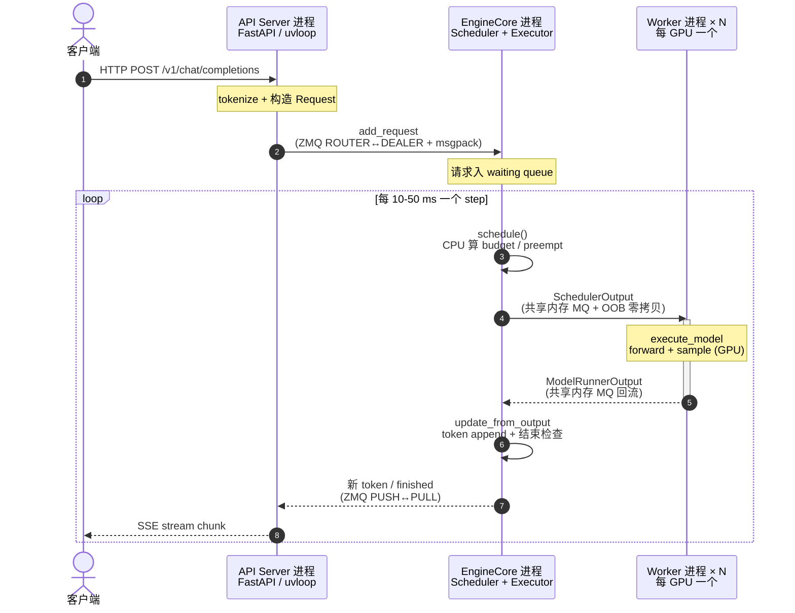

# 大模型推理岗高频面试题（vLLM 主题）

> **谁该读这一篇？** 正在准备大模型推理 / 高性能后端 / 平台工程岗位面试的候选人；想给团队成员做模拟面试的 tech lead。
>
> **前置阅读：** [`01-overview/`](../01-overview/)（基础概念），[`02-core-concepts/`](../02-core-concepts/)（PagedAttention / continuous batching / KV / prefix），[`03-code-walkthrough/02-scheduler.md`](../03-code-walkthrough/02-scheduler.md)（调度细节），[`04-optimizations/`](../04-optimizations/)（量化 / 投机 / CUDA Graph），[`05-distributed/01-tp-pp-ep.md`](../05-distributed/01-tp-pp-ep.md)（并行策略）。
>
> **耗时：** 约 50 分钟（建议两次刷完——先盖答案自测，再对照修补）。
>
> **学完能：**
> 1. 用 3-4 句标准答案应对 30 道高频题
> 2. 在每个答案后留 1 个能引面试官追问的 hook
> 3. 引用具体文件路径（如 `vllm/v1/core/sched/scheduler.py`）证明读过源码
> 4. 区分"基础题、KV、调度、Kernel、分布式、优化、工程"7 个题目象限，便于查漏

30 道题。每道都给：**问题 → 答题骨架（3-4 句标准答案）→ 加分项**。建议：先盖住答案自己讲一遍，再对照修补。

---

## A. 基础概念（必会，每场都问）

### Q1. 简单介绍一下 vLLM？
**骨架**：vLLM 是 UC Berkeley 在 2023 年开源的高吞吐 LLM 推理引擎，核心是 PagedAttention（KV cache 分页管理）和 continuous batching（迭代级动态批处理），相比 HuggingFace TGI 吞吐提升最高 24×。它的目标是高吞吐 + 高 GPU 利用率，是当前开源推理事实标准。
**加分**：提一句"V1 重构后调度统一、KV 与 sequence 解耦，支持 chunked prefill / spec decoding / disaggregated prefill。"

### Q2. PagedAttention 解决了什么问题？
**骨架**：朴素 KV cache 预分配连续显存导致严重碎片（内部 + 外部），论文实测利用率只有 20-38%。PagedAttention 借鉴 OS 虚拟内存，把 KV 切成固定大小 block（默认 16 token），用 block table 把请求的逻辑视图映射到物理 block，物理 block 可以不连续，利用率提升到 96%+。
**加分**：能讲出 block_size 的取舍（小 → indirection 开销大；大 → 内部碎片回归），并能说"现在主用 FlashAttention/FlashInfer 的 paged 版本，vLLM 自己的 kernel 是 fallback"。

### Q3. Continuous batching 跟 static batching 的区别？
**骨架**：static 是所有请求一起进 batch、最慢的决定整体延迟，GPU 严重空转；continuous 是 iteration-level，每生成一个 token 都重新调度，完成的立即退出，等待的立即加入，GPU 利用率接近 100%。
**加分**：能讲"token-level 而非 sequence-level"——同一个 forward step 内可以混跑不同请求的 prefill 和 decode，配合 chunked prefill 让长 prompt 不阻塞 decode。

### Q4. 一个请求在 vLLM 里的完整生命周期？
**骨架**：① HTTP/Python 入口 → tokenize → add_request；② 进入 Scheduler waiting 队列；③ Scheduler 每步调度，分配 KV block，进 running；④ Worker 跑 forward + sampling；⑤ update_from_output 拼接 token 并判定完成；⑥ 完成时释放 block（ref_cnt--），EOS 通过 SSE 推给用户。
**加分**：能讲 V1 的进程边界（API Server / EngineCore / Worker）和它们之间的 ZMQ/Ray 通信。

---

## B. KV Cache & 内存管理

### Q5. vLLM 怎么决定能开多少 KV block？
**骨架**：启动时做 profile run——加载权重 + 跑一次最大 batch / 最大 seq_len 的 dummy forward，记录峰值显存 P；可用 KV 空间 = `gpu_memory_utilization * total_mem - P`；num_blocks = `KV_avail / (block_size * per_token_kv_bytes * num_layers)`。
**加分**：能讲 `--gpu-memory-utilization` 默认 0.9，0.95 会有 activation 临时高峰风险；能讲 `--kv-cache-dtype fp8` 让 KV 占用减半。

### Q6. ref_cnt 在什么时候 ++、什么时候 --？
**骨架**：++ 发生在请求分配 block 时（`get_new_blocks` 或 prefix cache 命中复用）；-- 发生在请求完成或 preempt 释放时。归零的 block 进 free queue 尾部（LRU），但 hash 仍保留以便未来 prefix 命中。
**加分**：beam search 和 parallel sampling 的 copy-on-write 也是 ref_cnt 的典型应用场景。

### Q7. Prefix caching 的 hash 怎么算？为什么要 chain？
**骨架**：每个 block hash 输入是 `(prev_block_hash, tuple(token_ids), extra_keys)`，链式哈希保证位置敏感——同样的 token 在不同前缀下 hash 不同，从而 KV 内容也不同。extra_keys 包含 LoRA / 多模态等上下文，避免错误命中。
**加分**：第一个 miss 之后后面全部 miss，所以 prefix 是"最长前缀匹配"，不是任意子串。SGLang 的 RadixAttention 是 trie 结构，能复用任意公共前缀，但维护成本高。

### Q8. KV 不够时怎么办？
**骨架**：触发 preemption。V1 默认 recompute（直接 free block，把请求设回 WAITING，未来重 prefill），swap 模式可选但默认不用——PCIe 慢，且 prefix caching 让重算可以部分命中。被踢的是 running 队尾（FCFS 倒序），priority 模式选最低优先级。
**加分**：踢到自己头上时 break 出去，保证至少一个请求能进。被踢请求会被 appendleft 回 waiting 队列，下次最先恢复。

### Q9. block_size 为什么默认 16？
**骨架**：太小则每个 block 的 indirection 开销大、block_table 变长；太大则内部碎片回归（最多浪费 block_size - 1 个 slot）。16 是工程经验值，对 FlashAttention 的 tile size 和 head dim 友好，内部碎片 < 2%。可调 8/32。

---

## C. 调度与 Batching

### Q10. token budget 是什么？为什么重要？
**骨架**：每步所有请求加起来最多算多少 token，由 `--max-num-batched-tokens` 控制（默认 ~8192）。它决定了单 step GPU 时长上限，从而决定 TPOT 稳定性。大 → 吞吐高但抖动大；小 → 反之。

### Q11. Chunked prefill 解决什么？怎么实现？
**骨架**：解决长 prompt 阻塞 decode。把超长 prefill 切成多 chunk，每步只跑一个 chunk，跟 decode 混在同一 forward。FlashAttention 的 varlen + paged 模式原生支持："当前 chunk 内 causal + 跨 chunk 全可见"的 mask。
**加分**：V1 默认开启；调度上 decode-first，剩余 budget 给 prefill。

### Q12. Scheduler 怎么避免饥饿？
**骨架**：FCFS 模式下，waiting 队列严格按到达顺序，只要 KV 不够或 budget 用完就 break，不会跳过队首去服务后面的小请求。priority 模式下需要单独检测高优先级请求是否长期被低优先级占用 KV，必要时主动 preempt。

### Q13. Async Scheduler 优化的是什么？
**骨架**：让 `schedule()`（CPU 操作）与上一步的 forward（GPU 操作）overlap。普通模式是串行 schedule → forward → schedule → forward；async 模式 step N+1 的 schedule 在 step N 的 forward 还在跑时就启动。大 batch 下能省 5-10% 端到端时间。

---

## D. Attention 与 Kernel

### Q14. vLLM 用的 attention 后端有哪些？怎么选？
**骨架**：FlashAttention v2/v3、FlashInfer、Triton attn、ROCm AITER、TritonAttn for AMD、CPU attn、MLA（DeepSeek）专用、Mamba 专用等。选择由 `vllm/v1/attention/backends/registry.py` 根据硬件、模型、dtype、是否 sliding window 等决定。FlashAttention 是 NVIDIA H100/A100 上的默认。
**加分**：FlashInfer 在 decode 阶段的小 batch 上比 FlashAttention 略快，适合低延迟场景。

### Q15. PagedAttention 的 CUDA kernel 大致怎么实现？
**骨架**：核心思路是按 block_table 间接寻址。kernel 接受 `block_table[req_id]` 作为 list，遍历每个 block_id 加载对应 K/V tile 做 softmax(q·K^T) · V 累加。v2 版本用 split-K 并行长序列，提升长 context 性能。
**加分**：现代实现已经集成在 FlashAttention v2/v3，vLLM 自己的 `csrc/attention/paged_attention_v1/v2.cu` 主要作为 fallback。

### Q16. GQA / MQA 在 vLLM 怎么处理？
**骨架**：KV head 数比 Q head 数少（如 Llama-3 8B 是 8 KV head / 32 Q head）。存 KV 时按 KV head 数存（省显存），attention kernel 内部把同一个 KV head 的 K 广播给 4 个 Q head 算。FlashAttention 原生支持。

### Q17. MLA（Multi-Head Latent Attention，DeepSeek）有啥特别？
**骨架**：DeepSeek-V2/V3 用 MLA 压缩 KV cache——把 KV 投影到一个低秩 latent 空间存储，attention 时再升维。KV 占用降到 ~1/10。vLLM 通过 `vllm/v1/attention/backends/mla/` 单独支持，需要不同的 block 布局和 kernel。

---

## E. 分布式

### Q18. Tensor Parallel 怎么切？通信在哪？
**骨架**：把每个 layer 的权重在 attention head / hidden dim 维度切到 N 张卡。MLP 是 column-parallel（gate/up）→ row-parallel（down），最后 AllReduce 合并；Attention 是 QKV column-parallel → 各卡算自己 head → output projection row-parallel → AllReduce。每层 2 次 AllReduce。
**加分**：每个 token 每层每次 AllReduce 通信量 = `hidden_size * dtype_bytes`，要求 NVLink/InfiniBand。

### Q19. Pipeline Parallel 是怎么回事？
**骨架**：把不同 layer 分到不同卡（如 32 层切 4 段，每段 8 层在一张卡）。一个 batch 切 micro-batch 在卡间流水。优点：通信少（只在段边界）；缺点：有 bubble（流水启动/结束的空闲）。
**加分**：vLLM 的 PP 比训练简单——推理只前向、没反向，所以 1F1B 等复杂调度不需要。

### Q20. Expert Parallel（EP）？
**骨架**：MoE 模型把 experts 分到不同卡，每个 token 通过 router 选 top-k expert，跨卡通信（AllToAll）把 token 送到 expert 所在的卡。vLLM 通过 `vllm/distributed/eplb/` 支持，配合 DeepSeek / Mixtral 等。
**加分**：EP 通信比 TP 重，需要更好的 NIC。EPLB（expert parallel load balancer）做 expert 负载均衡。

### Q21. 一台 8 卡的 Llama-70B 怎么配并行策略？
**骨架**：典型 TP=8。70B FP16 ≈ 140GB，8 卡 H100 (80GB) 每卡 17.5GB 权重 + 几十 GB KV。也可 TP=4 + PP=2，TP=4 减少 AllReduce 通信压力，PP=2 切层。具体看延迟/吞吐要求。

### Q22. Disaggregated prefill / decode 是什么？
**骨架**：把 prefill（compute-bound）和 decode（memory-bound）拆到不同节点。prefill 节点专注高算力小并发，decode 节点专注大 batch 高吞吐。中间 KV 通过 NIXL / RDMA 传输。vLLM 通过 KV connector 接口实现。
**加分**：能讲为什么需要——同卡跑两种 workload 互相干扰，TPOT/TTFT 难以同时优化。

---

## F. 优化

### Q23. 量化都有哪些？怎么选？
**骨架**：FP8（H100+，无精度损失约 1%）、INT8 / INT4 weight-only（AWQ / GPTQ，2-4× 加速）、KV cache FP8 / INT8。Marlin 是 INT4 weight-only 的高性能 kernel。一般推荐：H100+ 用 FP8，A100 用 AWQ/GPTQ INT4。
**加分**：量化主要损失在异常值（outlier），AWQ 用 activation-aware 选关键 weight 保留高精度；GPTQ 用二阶信息逐层校正。

### Q24. Speculative Decoding 怎么工作？
**骨架**：用小模型（draft）提议 N 个 token，大模型（target）一次 forward 验证，按概率 ratio 接受或拒绝。每步至少接受 1 个（拒绝时重采当前位置）。如果接受率高，大模型 N 个 token 只跑一次 forward，吞吐提升 1.5-3×。
**加分**：能讲拒绝采样公式 `acceptance prob = min(1, p_target / p_draft)`；能讲 EAGLE（重用 hidden state 做 draft）和 MTP（DeepSeek-V3 多 token predict）的优势。

### Q25. CUDA Graph 是什么？vLLM 怎么用？
**骨架**：CUDA Graph 把一系列 CUDA kernel 调用录制成静态图，runtime 一次性提交，省 launch overhead（每个 kernel 几 μs，几百个 kernel 加起来 ms 级）。vLLM 在多个常用 batch_size 各 capture 一份 graph，runtime 按当前 batch_size pad 到最近的 captured 大小。
**加分**：CUDA Graph 要求输入 tensor 地址、shape 不变，所以 vLLM 用 InputBatch 持久化 + padding 实现。`--enforce-eager` 关 graph 加速启动但跑慢。

### Q26. torch.compile 在 vLLM 里？
**骨架**：vLLM 用 torch.compile（Inductor 后端）对模型做编译，融合 op、消除 Python overhead。配合自定义 op 注册（custom op）让 paged attention 等可以参与图融合。`compilation_config` 控制级别。

---

## G. 工程实践

### Q27. vLLM 启动很慢，为什么？怎么加速？
**骨架**：① 加载权重；② profile run 测显存；③ CUDA Graph capture 多个 batch_size；④ torch.compile。加起来几十秒到几分钟。加速：`--enforce-eager`（跳过 CG）、`--load-format dummy`（不真加载，仅 benchmark 用）、提前 warmup。

### Q28. 怎么 benchmark vLLM 的性能？
**骨架**：仓库自带 `benchmarks/benchmark_serving.py`、`benchmark_throughput.py`、`benchmark_latency.py`、`benchmark_prefix_caching.py`。指标：TTFT、TPOT、ITL、throughput (tokens/s, requests/s)、p50/p99。生产监控用 Prometheus 暴露的 `vllm:*` 指标。

### Q29. 一个用户报告"延迟突然变高"，你怎么排查？
**骨架**：

1. 看 Prometheus：是 TTFT 高（prefill 阻塞）还是 TPOT 高（KV 压力 / decode batch 过大）
2. `vllm:num_preemptions_total` 涨 → KV 不够，扩 cache 或降 max_num_seqs
3. `vllm:prefix_cache_hit_rate` 跌 → workload 模式变了或 cache 太小
4. `vllm:iteration_tokens_total` 单 step 飙升 → 来了大 prompt，开/调 chunked prefill
5. GPU util 低 → 调度 overhead，开 async scheduler
6. 单 GPU vs 多 GPU 对比，是否 AllReduce 慢

### Q30. vLLM vs SGLang vs TensorRT-LLM 怎么选？
**骨架**：

- vLLM：通用、迭代快、模型支持广、社区大 → 生产首选
- SGLang：RadixAttention 前缀复用更激进、结构化生成强 → agent / chain / 结构化输出
- TensorRT-LLM：NVIDIA 官方、单请求延迟最低、CUDA Graph 优化极致 → 极低延迟要求 + 固定模型

---

## 答题策略

1. **不知道时大方说不知道**，但要表达"这个我没深挖，但我猜思路是..."（基于第一性原理推一下）
2. **每个答案先 1 句概括，再 2-3 句展开**，最后留一个 hook 给面试官追问。
3. **能引用具体代码文件路径加分**，比如"`vllm/v1/core/sched/scheduler.py` 的 `_schedule_running`"。
4. **能 benchmarking 思维**：被问"哪个更好"，永远先反问"workload 是什么样的"。
5. **画图**：白板优先画图（PagedAttention block table、调度时间线、TP MLP 切分）。

---

## 小结

- 30 道题覆盖 7 个象限：基础概念、KV/内存、调度/Batching、Attention/Kernel、分布式、优化、工程实践。
- 每道答案都有"骨架 + 加分项"结构：先 1 句概括给出能听懂的答案，再 2-3 句技术展开抢分。
- 引用具体文件路径（如 `vllm/v1/core/sched/scheduler.py`）和数字（吞吐 ×N、命中率 %）是与普通候选人最大的差异化。
- 答题策略 5 条：诚实承认未知 → 概括先行 → 引代码 → 反问 workload → 白板画图。

## 自检

> 答案不必照搬，能讲到关键点即可。

**1. 自测 Q1-Q30：合格线 25/30。**

自我评估方法：盖住答案，给自己 1-2 分钟讲清楚每道题。**"讲清楚"标准**：

- 能讲完核心概念（如 PagedAttention 借鉴 OS 分页）
- 能引一个具体文件或数字（如 `vllm/v1/core/sched/scheduler.py` 或 "命中率 96%+"）
- 能在听众反问时不卡顿（说明真懂）

不到 25：先重读对应章节，再自测。常见盲点：

- **架构题**（Q3-Q5）：去读 [`01-overview/02-architecture.md`](../01-overview/02-architecture.md)
- **算法题**（Q12-Q15）：去读 [`02-core-concepts/`](../02-core-concepts/) 全部
- **分布式题**（Q19-Q22）：去读 [`05-distributed/`](../05-distributed/) 全部
- **运维题**（Q25-Q30）：去读 [`08-production-deployment/`](../08-production-deployment/) 全部

**强化建议**：找朋友 / 同事做面试官，让他随机抽 5 题问你，模拟真实面试压力。

---

**2. Q4（请求生命周期）时序图，标进程归属。**



**进程归属总结**：

- `add_request`：API Server 进程接收（tokenize），ZMQ 发到 EngineCore
- `schedule`：EngineCore 进程内（CPU 跑）
- `execute_model`：EngineCore 进程发起，Worker 进程接收并跑（GPU 跑）
- `update_from_output`：EngineCore 进程内（Worker 把结果传回 EngineCore 后处理）
- `SSE stream`：API Server 流式回客户端，每 step 一次

---

**3. "TPOT p99 从 30ms 涨到 200ms" 用 Q29 排查流程模拟回答。**

> "首先我会按 Q29 的根因决策树走（[`08-production-deployment/05-slo-and-observability.md`](../08-production-deployment/05-slo-and-observability.md) §5）。
>
> **Step 1 · 看是不是 KV cache 满了导致 preempt**：
> ```promql
> rate(vllm:num_preemptions_total[5m])    # 应接近 0
> vllm:kv_cache_usage_perc                  # 应 < 0.9
> ```
> 如果两个都飙了 → KV 不够，扩容或减 `max_num_seqs`。
>
> **Step 2 · 看 step token 数是不是抖动**：
> ```promql
> histogram_quantile(0.99, rate(vllm:iteration_tokens_total_bucket[5m]))
> ```
> 如果分布尾部很重 → 有长 prefill 没切 chunk。把 `--max-num-batched-tokens` 调小。
>
> **Step 3 · 看是不是 prefix cache 命中率掉了导致重算多**：
> ```promql
> rate(vllm:prefix_cache_hits[5m]) / rate(vllm:prefix_cache_queries[5m])
> ```
> 如果从 70% 掉到 20% → workload 模式变了（prompt 不再有共同前缀），或 cache 被 evict。考虑 cache-aware routing。
>
> **Step 4 · 看是不是 NCCL 慢了**：
> ```promql
> # 如果有 OTel trace
> p99(span.duration{name="allreduce"})
> ```
> 或 `nvidia-smi nvlink -gt nbf`。如果 NVLink 错误率高 → 硬件问题，drain 这台节点。
>
> **Step 5 · 看流量本身**：
> ```promql
> rate(vllm:num_requests_running[5m])
> ```
> 如果 running 翻倍 → 流量涨了，扩 pod 数（HPA）或放 token rate limit。
>
> 关键是**先看监控、不靠猜**——TPOT 飙升的 root cause 通常是上面 5 个之一，metric 看完 5 分钟内就能定位。"

---

**4. 找最不熟的题翻源码，引用具体文件 + 行级位置。**

示例（以 Q19 TP AllReduce 为例）：

> "我之前对 'TP 在 vLLM 里怎么注入 AllReduce' 不太清楚。我翻了：
>
> - `vllm/distributed/parallel_state.py` line 100+：`initialize_model_parallel()` 创建 TP / PP / DP process group
> - `vllm/distributed/communication_op.py`：定义 `tensor_model_parallel_all_reduce()` 包装 `dist.all_reduce(tensor, group=get_tp_group())`
> - `vllm/model_executor/layers/linear.py`：`RowParallelLinear.forward` 末尾调 `tensor_model_parallel_all_reduce(output)` —— **这就是 MLP 每层 1 次 AllReduce 的具体注入点**
> - `vllm/model_executor/layers/attention.py`：`Attention.forward` 末尾的 `o_proj` 也是 RowParallelLinear，所以 attention 末尾也是同一处 1 次 AllReduce
>
> 每层 forward 的 2 次 AllReduce（attention + MLP 末尾）都在这两个 `RowParallelLinear` 的 forward 里。"

→ **关键技巧**：

- 用 grep 找：`grep -rn "tensor_model_parallel_all_reduce" vllm/`
- 不要凭印象写行号，直接 `grep -n` 查
- 哪怕只能引到文件名（不带行号）也比泛泛而谈强

如果哪一题真翻不到——诚实承认"我没查过这部分代码"，比编造答案强。面试官最讨厌的是编代码细节。

## 下一步

- 下一节：[`06-interview/02-system-design.md`](02-system-design.md)（面试中后段必出的开放设计题）
- 想看源码：每道题答案末尾引的路径都建议跳进去通读 30 行上下文
- 想动手：[`07-hands-on/03-mini-experiments.md`](../07-hands-on/03-mini-experiments.md)（把概念变成"我跑过 X，看到 Y"的实战素材）
- 想从生产视角理解：[`08-production-deployment/07-incident-playbook.md`](../08-production-deployment/07-incident-playbook.md)（Q29 的真实故障 case 集）

### 章节到题目的对照

不能就回头读相应章节。

- Q1-Q4：`01-overview/`
- Q5-Q9：`02-core-concepts/03,04`
- Q10-Q13：`02-core-concepts/02,05` + `03-code-walkthrough/02`
- Q14-Q17：`02-core-concepts/01` + `03-code-walkthrough/05,06`
- Q18-Q22：`05-distributed/`
- Q23-Q26：`04-optimizations/`
- Q27-Q30：`07-hands-on/`
