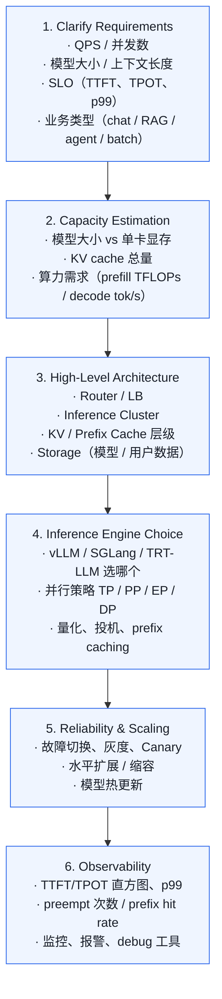
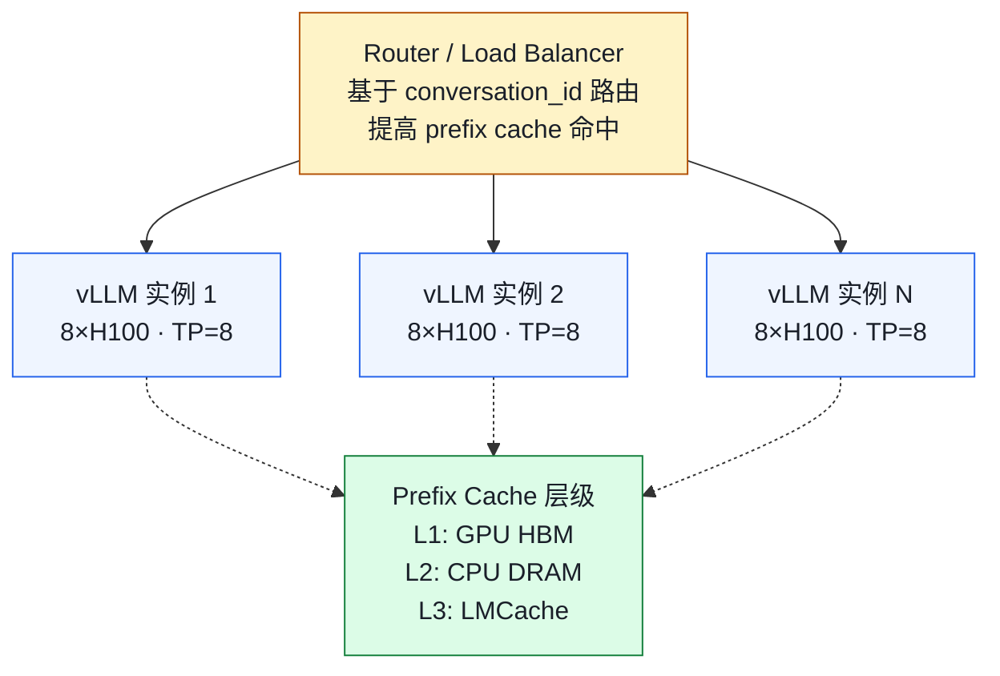

# 系统设计题：设计一个 LLM 推理服务

> **谁该读这一篇？** 准备资深 / staff 级岗位面试、需要展示"从 0 设计大模型服务"能力的候选人；技术 leader 与架构师做 capacity planning 的参考。
>
> **前置阅读：** [`06-interview/01-common-questions.md`](01-common-questions.md)（30 道基础题打底），[`05-distributed/01-tp-pp-ep.md`](../05-distributed/01-tp-pp-ep.md)（并行策略），[`05-distributed/02-disaggregated.md`](../05-distributed/02-disaggregated.md)（prefill/decode 拆分），[`02-core-concepts/04-prefix-caching.md`](../02-core-concepts/04-prefix-caching.md)（prefix cache 是高分点）。
>
> **耗时：** 约 30 分钟。
>
> **学完能：**
> 1. 背出 6 步通用答题框架，任何 LLM 推理设计题都能套
> 2. 给出 4 类典型 workload（chatbot / 长上下文 RAG / agent / 突发流量）的标准答案
> 3. 在 capacity estimation 阶段给出"模型大小 / KV per token / 并发上限"的口算
> 4. 知道 7 个"加分点"和 5 个"减分雷区"

面试中后段必出"开放题"。本节给你框架 + 5 道典型题的标准答法。答题原则：**先问 requirements，再分层设计，最后讨论 tradeoff 与 metric**。

---

## 通用答题框架（背下来）

任何"设计一个 LLM 推理系统"的问题，按这 6 步答：



---

## 题 1：设计一个 ChatGPT-like 服务，10k 并发 in-flight 用户

### 阶段 1：Clarify
反问面试官：

- 模型多大？（假设 Llama-3 70B）
- 输入长度 / 输出长度分布？（假设 prompt 1k、output 500 tokens）
- TTFT 目标？（假设 < 500ms）
- TPOT 目标？（假设 < 50ms）
- 是否需要多轮对话历史？（是 → 大量 prefix 复用）

### 阶段 2：Capacity
- 70B FP16 = 140GB
- 单 H100 80GB 装不下 → TP=2 起步
- KV per token：约 320KB（70B 配置）
- 单用户上下文 (1k+500)×320KB ≈ 480MB
- 10k 并发 → 4.8 TB KV！显然不能全在 GPU
- 实际"in-flight"瞬时活跃约 200-1000 个，其他在 prefix cache 里

→ **结论**：单实例 8×H100 TP=8，配合 prefix cache + 多实例。

### 阶段 3：架构



### 阶段 4：Engine 选择
**vLLM 是首选**：

- 模型支持广（70B 一键跑）
- continuous batching 成熟
- prefix caching 默认开（chatbot 收益大）
- chunked prefill 默认开（长 prompt 不卡 decode）

并行：

- TP=8 单实例（一台 8 卡 H100）
- 模型实例间 DP（每实例独立模型副本）

量化：H100 用 **FP8**（精度损失 < 1%，吞吐 ×1.5）。
投机解码：开 **EAGLE**，对 chat 接受率 75-85%，吞吐再 ×1.5-2。

### 阶段 5：可靠性
- **路由**：基于 `conversation_id` 哈希到固定实例，保证同一用户的 prefix cache 命中
- **故障切换**：实例死了，路由到其他实例（cache miss 一次，重 prefill）
- **金丝雀部署**：新模型先 5% 流量
- **模型热更新**：vLLM 的 `sleep + wake_up`（卸载权重 → 加载新版本）

### 阶段 6：监控
关键面板：

- TTFT p50/p99
- TPOT p50/p99
- `vllm:gpu_cache_usage_perc`
- `vllm:prefix_cache_hit_rate`（目标 > 60%）
- `vllm:num_preemptions_total`（目标接近 0）
- GPU util、NVLink 带宽

---

## 题 2：长上下文（200k tokens）的 RAG 服务

### 关键挑战
- 200k 上下文 → 单请求 KV 占用极大
- prefill 极慢（200k×200k attention 二次方）
- decode 单步要读所有 KV，访存巨大

### 设计要点

1. **Chunked prefill 默认开**，避免 200k prefill 阻塞所有人
2. **KV cache FP8**：让 num_blocks ×2
3. **prefix caching**：RAG 模板部分（system + 检索文档头）共享
4. **Disaggregated prefill/decode**：
   - prefill 集群：用算力强的卡（H200 / B200）
   - decode 集群：用 HBM 大的卡（更多 KV 容量）
   - NIXL RDMA 传 KV
5. **模型选 GQA/MLA**：KV 占用降一个数量级
   - DeepSeek MLA：KV/token 约 1/10 普通 Transformer
   - Llama-3 GQA（KV head 8 vs Q head 32）：KV/token 约 1/4
6. **限流**：单实例同时只跑 N 个 200k 请求（防 KV 爆掉）

---

## 题 3：Agent 框架（工具调用 + 结构化输出）

### 特点
- 每轮 prompt 包含工具描述（重复）→ 强 prefix caching
- 输出需要 JSON / function call 格式 → structured output
- 一次会话多次 prefill+decode（工具返回后续接）

### 设计要点

1. **Structured Output**：vLLM 用 `xgrammar` / `outlines`，按 schema mask logits
2. **Prefix Caching**：工具描述是大头（5k tokens 常见）
3. **保证 prefix 对齐**：tool description block_size 对齐
4. **会话 stickiness**：同一会话路由到同一实例
5. **Speculative Decoding**：function call 格式高度可预测，draft 模型接受率 80%+
6. **响应 schema 校验**：客户端二次验证，避免 LLM 输出非法 JSON（即使 structured output 也偶尔异常）

---

## 题 4：怎么处理"突发流量"？

### 思路

1. **入场准入控制**：超过 max_num_seqs → 401 / 排队
2. **优先级队列**：付费用户高优先级，必要时 preempt 免费用户
3. **自动扩缩容**：HPA 基于 `num_requests_waiting` 触发
4. **降级策略**：
   - 流量过高 → 强制 max_tokens 上限
   - 进一步过高 → 关投机解码（吞吐有限收益但稳定性 up）
   - 极端 → 拒绝部分请求
5. **缓存兜底**：对热门 prompt 完全缓存 response（不进推理）

---

## 题 5：单实例 vs 多实例的取舍

**单实例（一个大实例）**：

- 优点：prefix cache 集中命中率高、TP 内通信快
- 缺点：故障域大、扩容粒度粗

**多实例（多个小实例）**：

- 优点：故障域小、能精细扩缩、水平扩展
- 缺点：prefix cache 分散（除非路由 sticky）

**生产推荐**：多实例 + sticky routing。每实例 4-8 GPU，靠模型实例级 DP 扩展。

---

## 一些"高分"加分点

面试中能引用以下细节会显得专业：

1. **"基于 conversation_id sticky"** —— 不是随便 LB
2. **"启动时 profile run 确定 num_blocks"** —— 知道 vLLM 内部
3. **"GPU memory utilization 0.9 + 缓冲"** —— 知道为什么不能 0.95
4. **"chunked prefill 让单 step 时长稳定"** —— 知道 TPOT 抖动来源
5. **"H100 用 FP8 比 A100 用 INT4 好"** —— 量化与硬件匹配
6. **"NIXL RDMA disaggregated"** —— 跟得上当下前沿
7. **"用 vLLM 的 Prometheus metric 监控 preempt"** —— 工程实践

---

## 一些"减分"的雷区

避免说：

1. "我会自己实现 PagedAttention" —— 已是开源标准，重造没意义
2. "我会用 HF Transformers 部署" —— 暴露不懂行
3. "用 Redis 缓存所有结果" —— LLM 输出几乎不重复
4. 跳过 capacity estimation 直奔架构 —— 没数字就是空谈
5. 一上来就讲技术细节 —— 不问 requirements 是大忌

---

## 自己练习的方式

设计 3 个不同 workload，每个写一份 1-2 页的设计：

- "服务 1k 并发的客服 chatbot"
- "服务 100 个 50k-token RAG 请求"
- "批量处理 10M 条文档摘要"

对比三种 workload 下你的设计差异——这就是 system design 的真正能力。

---

## 小结

- 6 步通用框架：Clarify → Capacity → Architecture → Engine 选择 → 可靠性 → 可观测，少一步都会被压分。
- 4 类典型题各有套路：chatbot 重 prefix cache 与 sticky 路由、长上下文 RAG 必拆 prefill/decode、agent 强 structured output、突发流量靠准入控制 + HPA + 降级。
- 高分关键：capacity estimation 出数字、引用 vLLM 内部细节（profile run / chunked prefill / NIXL）、用 Prometheus metric 名讨论监控。
- 雷区清单：跳过 requirements、自造 PagedAttention、用 HF 部署、Redis 缓存 LLM 输出、不问 workload 就上架构。

## 自检

> 答案不必照搬，能讲到关键点即可。

**1. 10k 并发 chatbot + 200B 模型 + 2k 输入 / 1k 输出 + 单卡 80GB，capacity 怎么算？**

**Step 1 · 模型显存**：

- 200B × 2 (BF16) = 400 GB → 单卡 80GB **塞不下，必须 TP ≥ 8**
- TP=8（单机 H100×8 = 640GB）：每卡装 50GB 模型 + KV 预算
- 若用 FP8 量化：200B × 1 = 200GB → TP=4 即可

**Step 2 · KV cache 容量**：

- 假设 200B GQA: hidden=12288, num_kv_heads=16, head_dim=128（推测）, layers=80
- 单 token KV = 2 × 16 × 128 × 80 × 2 = **655 KB**（远大于 70B 的 320 KB）
- 单请求 (2K+1K)=3K token → 1.9 GB / 请求

**Step 3 · 单实例并发能力**：

- TP=8 BF16：每卡剩余 30GB KV → 8 × 30 / 1.9 ≈ **126 个并发请求 / 实例**
- 但实际有 active vs total batch 区别——running 通常占 max_num_seqs 50%。安全估 **64 active**

**Step 4 · 实例数**：

- 10000 并发 / 64 = **157 个实例**，每个 8 卡 H100 → **1256 张 H100**！

**Step 5 · 优化建议**（这数太大）：

- **量化**：FP8 减半显存 → 80 实例 × 4 卡 = **320 张 H100**（仍多但可行）
- **disaggregated**：prefill 集群 32 节点 + decode 集群 80 节点
- **prefix caching**：若 system prompt 长（如 1K token）且共享，命中率 70% → 等效减少 70% prefill 算力
- **重新讨论 SLO**：能不能放宽 TTFT 到 2s？支持 5k 并发就够了？

并行策略：**TP=8 + FP8 + EP（若 200B 是 MoE）**。

→ 实战面试时给出**第一个数（1256 H100）+ 减法路径（FP8 → 320）**，比直接说"用 FP8 + TP=8"更显功力——展示你能算 capacity。

---

**2. 自出题："500 并发多模态助手"按 6 步框架。**

**Step 1 · Requirements**：

- 500 并发，图像 + 文本
- 文本 prompt 1K token + 图像 1024×1024（≈1024 image tokens）+ 输出 500 token
- TTFT < 800ms（用户上传图后等回答）, TPOT < 100ms

**Step 2 · 模型选型**：Qwen2-VL 72B 或 Llama-3-VL 90B

**Step 3 · Capacity**：

- 72B BF16 = 144GB → TP=2 (H100×2=160GB)
- 每个请求 KV = (1024 + 1024 + 500) × ~256KB = 650 MB
- 图像 encoder 输出（mm_embeddings）= 1024 × 4096 × 2 = 8 MB / image，需要 encoder cache
- 80GB H100 单卡剩 50GB → 单实例 (TP=2) 并发约 80 个
- 500 并发 → 7 实例 × 2 卡 = **14 张 H100**

**Step 4 · 路由层**：

- **图像 hash 路由**：相同图像打到同一实例（encoder cache 共享，省 8MB embed 重算）
- prefix cache aware：相同 system prompt 打同一实例

**Step 5 · SLO 与监控**：

- TTFT p99 < 800ms，单独监控 mm_encoder time
- `vllm:mm_cache_hits / vllm:mm_cache_queries` 命中率 > 60%
- `vllm:kv_cache_usage_perc` < 0.85

**Step 6 · 失效模式**：

- Encoder OOM：限制 `--mm-encoder-cache-size`
- 大图爆 token：限制图像分辨率（API 层 resize 到 1024×1024）
- 文本长 prefill 卡死：开 chunked prefill

→ 完整答案约 5 分钟，配 1 张架构图。

---

**3. 题 5（单实例 vs 多实例）细化判断 + 引用 metric 与故障域。**

| 维度 | 单实例（大 TP）| 多实例（小 TP × N） |
| --- | --- | --- |
| **`vllm:prefix_cache_hit_rate`** | 高（cache 集中）| **低**（N 个独立 cache）| 单实例胜：高 system prompt 共享 workload |
| **延迟（TTFT）** | 单 query 低（大 TP 提速）| 单 query 中（小 TP）| 单实例胜：code completion / agent |
| **吞吐峰值** | 受限（单卡 KV 容量）| 高（独立并发）| 多实例胜：高 QPS workload |
| **故障域** | 大（一挂全挂）| 小（一实例挂只影响 1/N）| 多实例胜：高可用要求 |
| **运维复杂度** | 低（一个 deployment）| 高（N 个 + LB）| 单实例胜：小团队 |
| **冷启动恢复** | 慢（NCCL 重建 + 大模型加载）| 快（小模型 + 部分降级）| 多实例胜 |

**判断条件**：

- **prefix cache 命中率 > 50% + 单 query 延迟敏感 → 单实例**（例：chatbot 长 system prompt、agent 工具调用）
- **prefix cache 命中率 < 20% + 高 QPS + 强可用要求 → 多实例**（例：RAG 每问不同、batch 推理）
- **平衡区**：多实例 + cache-aware routing（路由层做 prefix awareness 弥补命中率，又保留多实例的故障域优势）

→ 看 `vllm:prefix_cache_hit_rate` 一个 metric 就能拍板。这是面试答这种"系统设计选型"题的杀手锏。

---

**4. 题 1（10k 并发 chatbot）架构图。**

```
                         ┌────────────────────────────┐
                         │     Prometheus + Grafana    │  ← 监控面板
                         │  - TTFT p99 / TPOT p99      │     · 4 大金信号
                         │  - kv_cache_usage_perc      │     · alert 规则
                         │  - prefix_cache_hit_rate    │
                         └──────────────▲──────────────┘
                                        │ scrape /metrics
                                        │
                    ┌───────────────────┴────────────────────┐
                    │                                        │
                    ▼                                        ▼
    ┌─────────────────────┐  cache-aware routing   ┌─────────────────────┐
    │    Sticky LB        │ ─────────────────────► │    Sticky LB        │
    │  (Envoy + ExtProc)  │  (按 session_id hash)   │  (备份)              │
    │                     │                        │                     │
    │ - hash(session_id)  │                        └─────────────────────┘
    │ - prefix-aware fall │
    │ - failure detect    │
    └─────┬───────────────┘
          │
          │ 路由到 vLLM pod
          ▼
   ┌──────────────────────────────────────────────────┐
   │            vLLM 实例池（TP=8 × N pods）          │
   │  ┌──────────────┐  ┌──────────────┐  ┌────────┐ │
   │  │ Pod 1 (TP=8) │  │ Pod 2 (TP=8) │  │ ...    │ │
   │  │ L1: GPU HBM  │  │ L1: GPU HBM  │  │        │ │
   │  │ prefix cache │  │ prefix cache │  │        │ │
   │  └─────┬────────┘  └─────┬────────┘  └────────┘ │
   │        │                  │                     │
   └────────┼──────────────────┼─────────────────────┘
            │                  │ KV connector
            ▼                  ▼
   ┌──────────────────────────────────────────────────┐
   │     L2: 共享 CPU DRAM Cache (LMCache)            │  ← Prefix Cache 层级
   │     (跨 pod 共享冷 prefix)                         │
   └──────────┬───────────────────────────────────────┘
              │
              ▼
   ┌──────────────────────────────────────────────────┐
   │     L3: NVMe / S3 Object Store                    │
   │     (超长 system prompt、历史多轮对话 cache)        │
   └──────────────────────────────────────────────────┘
```

**4 部分要点**：

1. **Sticky LB**：用 session_id hash 让同用户落同 pod（L1 cache 命中）；prefix-aware fallback（即使首次访问，按 prompt prefix hash 路由）
2. **vLLM 实例**：TP=8 单机部署，每实例独立 L1 cache
3. **Prefix Cache 层级**：L1 GPU HBM（每 pod 本地）、L2 CPU DRAM（LMCache 跨 pod 共享）、L3 NVMe（超长冷 cache）
4. **监控面板**：Prometheus scrape 所有 pod 的 `/metrics`，Grafana 显示 4 大金信号 + 告警规则触发 PagerDuty

加分：图上额外标注 KV connector 走 RDMA（pod ↔ LMCache），HPA 按 `vllm:num_requests_running` 扩缩容。

## 下一步

- 下一节：[`07-hands-on/01-setup.md`](../07-hands-on/01-setup.md)（把面试讲的概念真跑一遍，攒"我跑过 X"的实战素材）
- 想看源码：`vllm/v1/core/sched/scheduler.py`、`vllm/v1/core/kv_cache_manager.py`、`vllm/entrypoints/openai/api_server.py`
- 想动手：[`07-hands-on/03-mini-experiments.md`](../07-hands-on/03-mini-experiments.md)（5 个实验配出数字给设计题加分）
- 想从生产视角理解：[`08-production-deployment/01-deployment-architectures.md`](../08-production-deployment/01-deployment-architectures.md)、[`08-production-deployment/04-autoscaling-and-capacity.md`](../08-production-deployment/04-autoscaling-and-capacity.md)、[`08-production-deployment/07-incident-playbook.md`](../08-production-deployment/07-incident-playbook.md)（突发流量与故障真实 case）
