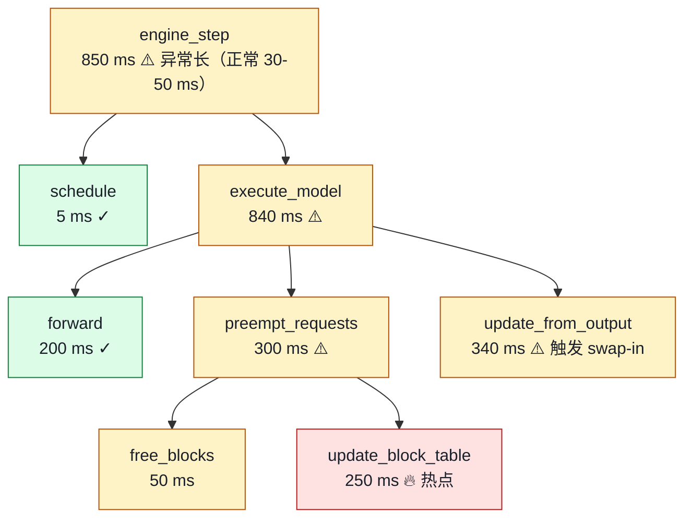

# 04. Profiling 与调试：怎么定位 vLLM 性能 / 正确性问题

> **谁该读这一篇？** 已经能跑 vLLM、需要在生产 / 压测中定位"为什么慢、为什么 hang、为什么结果错"的工程师；on-call 期间想 5 分钟内定位 incident 的 SRE。
>
> **前置阅读：** [`07-hands-on/02-trace-a-request.md`](02-trace-a-request.md)（会用 stat logger 和 metric），[`07-hands-on/03-mini-experiments.md`](03-mini-experiments.md)（能跑 benchmark 出基线数字），[`04-optimizations/03-cudagraph-and-compile.md`](../04-optimizations/03-cudagraph-and-compile.md)（解释为何 enforce-eager 是 debug 第一步）。
>
> **耗时：** 约 30 分钟。
>
> **学完能：**
> 1. 写出 NCCL hang / 慢请求 / 结果异常三类问题的排查命令
> 2. 区分 torch.profiler 与 nsys 各自的最佳使用场景
> 3. 列出 6 个生产里最重要的调试环境变量
> 4. 用"宏观 metric → trace → profiler → kernel"的标准流程定位 TPOT p99 抖动

知道概念 + 看过代码还不够。出问题时怎么快速定位？本节列 6 套实战工具与场景：torch.profiler、Nsight Systems、py-spy、layerwise profiler、stat logger、benchmark 对比。

---

## 1. 工具速查表

| 场景                              | 工具                                | 入口                                  |
| ------------------------------- | --------------------------------- | ----------------------------------- |
| 哪个 CUDA kernel 慢                | Nsight Systems (`nsys`)            | `nsys profile vllm serve ...`       |
| 哪一层 / 哪段代码慢                  | torch.profiler                    | `with profile(...)`                 |
| 进程卡死                         | py-spy / gdb                       | `py-spy dump --pid N`               |
| 单层耗时分析                      | `vllm/profiler/layerwise_profile.py` | `--otlp-traces-endpoint` + custom hook |
| 一次性快速看吞吐 / TTFT             | benchmark_serving / benchmark_throughput | `vllm bench serve` / `vllm bench throughput` |
| 整体调度时间线                    | vLLM stat logger                  | `VLLM_LOG_STATS_INTERVAL=1`         |
| 单步信息                         | OpenTelemetry trace               | `--otlp-traces-endpoint http://...` |

---

## 2. 关键环境变量

来自 `vllm/envs.py`：

```bash
VLLM_LOGGING_LEVEL=DEBUG          # 详细日志
VLLM_LOG_STATS_INTERVAL=1         # stat logger 每 1s 打一次
VLLM_LOG_BATCHSIZE_INTERVAL=1     # 单 step batch size 直方图
VLLM_TRACE_FUNCTION=1             # 打开 Python function trace（极慢，仅 debug）
VLLM_LOG_MODEL_INSPECTION=true    # 启动时打印模型结构
VLLM_TORCH_COMPILE_CACHE_DIR=/data/vllm_cache  # 编译缓存目录
VLLM_USE_V1=1                     # 强制 V1 引擎
VLLM_ATTENTION_BACKEND=FLASH_ATTN # 强制 attention 后端

# CUDA / NCCL
NCCL_DEBUG=INFO
NCCL_BLOCKING_WAIT=1              # NCCL 超时变 crash 而非 hang
NCCL_TIMEOUT=60
CUDA_LAUNCH_BLOCKING=1            # 同步执行，错误堆栈准确（极慢）
PYTORCH_NO_CUDA_MEMORY_CACHING=1  # 关 PyTorch caching alloc（debug only）
PYTORCH_CUDA_ALLOC_CONF=expandable_segments:True  # 缓解碎片
```

---

## 3. torch.profiler：定位"哪个 op 慢"

最简单的代码层 profiler。

### 3.1 离线模式

```python
from torch.profiler import profile, ProfilerActivity, record_function
from vllm import LLM, SamplingParams

llm = LLM("Qwen/Qwen2.5-0.5B-Instruct", enforce_eager=True, gpu_memory_utilization=0.5)
prompts = ["Hello"] * 8
params = SamplingParams(max_tokens=50, temperature=0)

# warmup
llm.generate(prompts, params)

# profile
with profile(
    activities=[ProfilerActivity.CPU, ProfilerActivity.CUDA],
    record_shapes=True,
    with_stack=True,
) as prof:
    llm.generate(prompts, params)

# 看汇总
print(prof.key_averages().table(sort_by="cuda_time_total", row_limit=30))

# 导出 chrome trace 文件
prof.export_chrome_trace("vllm_trace.json")
# 用 chrome://tracing 或 Perfetto 打开
```

### 3.2 实时模式（serve 内）

vLLM API server 暴露 `/start_profile` / `/stop_profile` 端点：

```bash
vllm serve <model> &

# 触发 profile
curl -X POST http://localhost:8000/start_profile
# 发几个真实请求
... your benchmark ...
curl -X POST http://localhost:8000/stop_profile

# trace 文件落在 VLLM_TORCH_PROFILER_DIR 指向的目录
```

### 3.3 看什么

打开 chrome trace，关注：

- **gap** 之间：CPU 在做什么？是 Python 调度还是真的 GPU 在跑
- **每个 kernel 时长**：matmul（GEMM）vs attention vs softmax vs allreduce
- **stream sync**：很多 `cudaStreamSynchronize` 意味着 CPU 等 GPU，可能 dispatcher 不畅
- **memcpy**：H2D / D2H 多 = 输入准备慢

---

## 4. Nsight Systems：底层最细的 timeline

适合定位 kernel-level 性能（vs 中等粒度的 torch.profiler）。

```bash
# 装 nsys（NVIDIA 自带）
nsys profile \
    --trace=cuda,nvtx,osrt \
    --capture-range=cudaProfilerApi \
    --gpu-metrics-device=all \
    --output=vllm-trace \
    vllm serve <model> --enforce-eager &

# 触发：在代码里 cudaProfilerStart / Stop（vLLM 没默认开，要自己加 hook）
# 或者直接 -c quit:30s 跑 30 秒
```

加载 `vllm-trace.nsys-rep` 到 Nsight Systems GUI。

- CUDA HW row 看每张卡的 kernel
- NVTX row 看 vLLM 标的 region（如果开了）
- OS Runtime 看 syscall（识别 IPC / NCCL 阻塞）

### 4.1 启动 vLLM 时加 NVTX 标记

vLLM 内部已有些 NVTX，可以通过自定义 hook 加更多。
开 `VLLM_NVTX_LOGGING=1`（如果可用版本）让 vLLM 自动标 step、prefill、decode 等区段。

---

## 5. py-spy：进程卡死时的救命稻草

NCCL hang、Python 死锁、长 CPU 任务时，py-spy 不停进程也能拿 Python 栈。

```bash
# 装
pip install py-spy

# 单次 dump
py-spy dump --pid $(pgrep -f "vllm serve")

# 持续监控
py-spy top --pid <pid>

# 录制 flame graph
py-spy record -o vllm-flamegraph.svg --pid <pid> --duration 60
```

### 5.1 NCCL hang 典型栈

py-spy 输出会看到：

```
Thread <main>:
  ncclAllReduce  in cupy._core.cuda_nccl
  forward        in vllm.distributed.communication_op
  forward        in vllm.model_executor.layers.linear:RowParallel
  ...
```

栈底在 `ncclAllReduce` 卡死，配合 `nvidia-smi nvlink -e` 看 NVLink 错误。

---

## 6. layerwise profiler：模型每层耗时

`vllm/profiler/layerwise_profile.py`：vLLM 自带的 layer-level profiler，按 transformer 层切分时间。

用法：

```python
from vllm.profiler import LayerwiseProfiler

prof = LayerwiseProfiler(model)
prof.start()
llm.generate(...)
prof.stop()
prof.report()  # 打印每层耗时
```

输出大致：

```
Layer 0  | attention 0.42ms  | mlp 0.31ms
Layer 1  | attention 0.41ms  | mlp 0.30ms
...
Layer 31 | attention 0.43ms  | mlp 0.31ms
Total: 25.6ms
```

适合定位"某几层异常慢"（如 LoRA 切到该层导致 perf 异常）。

---

## 7. vLLM 自带 stat logger

启动时 `VLLM_LOG_STATS_INTERVAL=1`（秒），引擎周期性打印：

```
Avg prompt throughput: 1234.5 tokens/s
Avg generation throughput: 567.8 tokens/s
Running: 12 reqs  Waiting: 0 reqs
GPU KV cache usage: 67.3%
CPU KV cache usage: 0.0%
Prefix cache hit rate: 78.4%
```

最快感知系统状态，不用 Grafana 也能 debug。

---

## 8. OpenTelemetry trace

每个请求级粒度的 trace（详见 `08-production-deployment/05-slo-and-observability.md`）：

```bash
# 启动 OTel collector
docker run -p 4317:4317 otel/opentelemetry-collector

# vLLM
vllm serve <model> --otlp-traces-endpoint http://localhost:4317
```

每个请求会产生 span：queue_wait → prefill → first_token → decode_step ×N → finish。
在 Jaeger / Tempo / Grafana 中过滤异常 trace。

---

## 9. Benchmark 工具

`benchmarks/` 下的 4 个主力：

| 脚本                                  | 用途                                  |
| ----------------------------------- | ----------------------------------- |
| `benchmark_throughput.py`           | 离线吞吐：固定输入输出长度，挑能跑多快        |
| `benchmark_latency.py`              | 单请求延迟：batch=1，看 raw decode 速度    |
| `benchmark_serving.py`              | 在线服务：发起并发请求，看 TTFT / TPOT / p99 |
| `benchmark_prefix_caching.py`       | prefix cache 效果对比                 |
| `benchmark_serving_structured_output.py` | 结构化输出 benchmark            |
| `benchmark_long_document_qa_throughput.py` | 长上下文 benchmark            |
| `benchmark_prioritization.py`       | 优先级调度 benchmark                 |

新版 vLLM 提供统一入口：`vllm bench serve`、`vllm bench throughput`。

### 9.1 典型 benchmark 流程

```bash
# 1. 起服务
vllm serve <model> --port 8000 --enforce-eager &

# 2. 跑 benchmark
python benchmarks/benchmark_serving.py \
    --backend vllm \
    --base-url http://localhost:8000 \
    --model <model> \
    --dataset-name sharegpt \
    --dataset-path /data/sharegpt.json \
    --num-prompts 1000 \
    --request-rate 50 \
    --save-result

# 3. 看输出
# - Throughput: req/s, tokens/s
# - TTFT (mean, p50, p99)
# - TPOT (mean, p50, p99)
# - Total time
```

---

## 10. 常见性能问题诊断流程

### 问题 A：吞吐低、GPU util 也低
1. stat logger 看 `num_requests_running`：是不是常 < max_num_seqs（说明请求不够，不是引擎瓶颈）
2. 看 KV usage：很低 = 请求短或并发不足
3. **结论**：负载不足，扩大压测；或者 ratelimit 太低

### 问题 B：吞吐低、GPU util 高、TPOT 慢
1. nsys 看 kernel：是不是 attention 占大头？
2. 是 → KV cache 可能不够，看 preempt 率
3. 不是 → MLP / matmul 是 compute-bound，正常状态
4. **结论**：开 fp8 / 量化、扩容 / 加 spec decode

### 问题 C：TTFT 高但 TPOT 正常
1. stat logger：`num_requests_waiting` 持续高 → 队列堵
2. trace 看 `queue_wait` span 时长
3. **结论**：扩容 + 检查路由层是否 cache-aware

### 问题 D：偶发慢请求
1. 拿到 request_id，找它的 OTel trace
2. 看是哪个 span 长（queue_wait / prefill / decode_step）
3. **结论**：可能 preempt cascade / GPU 抖动 / mesh 重试

### 问题 E：结果错（生成内容异常）
1. `--enforce-eager` 跑一遍：还错 → 不是 CUDA Graph 问题
2. 关 spec decode、关量化逐步排除
3. 同 prompt 在 HF transformers 跑一遍对比
4. **结论**：精度 / 兼容性问题，可能 attention backend / 量化 / 框架版本

---

## 11. Debug 工具组合套餐（推荐流程）

```
Step 1: stat logger 看大局
Step 2: Prometheus / Grafana 看 SLO 指标
Step 3: OTel trace 定位单请求路径
Step 4: torch.profiler 看 op 级耗时
Step 5: nsys 看 CUDA kernel 级
Step 6: py-spy 抓 Python 栈（hang 时）
Step 7: 改代码 + benchmark 验证
```

绝大多数问题在 1-3 步就能定位，深入 4-6 是少数情况。

---

## 12. 实战 case：定位"TPOT p99 突高"

某次生产 TPOT p99 从 30ms 飙到 200ms。诊断：

```
1. stat logger："Running: 60 reqs, KV usage: 92%, preempt rate: 0"
   → 不是 preempt cascade
2. OTel trace 看一个 p99 慢请求：
   - decode_step 1: 50ms
   - decode_step 2: 200ms  ← 这步慢
   - decode_step 3: 30ms
3. torch.profiler 单 step：
   - paged_attention: 180ms  ← 突然高
4. nsys：
   - 看到 attention kernel 内一次 indirect read 异常长
   - 怀疑 block_table 跨了多个 SM 的 cache line
5. 改 max_num_batched_tokens：4096 → 2048
6. benchmark 验证：TPOT p99 回落到 50ms
```

完整链路：宏观 metric → 中粒度 trace → 细粒度 profiler → kernel 分析 → 配置调优。

---

## 13. 小结

- 工具分层使用：宏观看 stat logger + Prometheus，中观看 OTel trace，微观用 torch.profiler / nsys / py-spy。
- 5 类典型问题（吞吐低、TPOT 慢、TTFT 高、偶发慢请求、结果错）都有标准排查 checklist，背下来 oncall 受益。
- 6 个常用调试环境变量记牢：`VLLM_LOGGING_LEVEL`、`VLLM_LOG_STATS_INTERVAL`、`NCCL_DEBUG`、`NCCL_BLOCKING_WAIT`、`CUDA_LAUNCH_BLOCKING`、`VLLM_TORCH_COMPILE_CACHE_DIR`。
- 调试结果异常先 `--enforce-eager`，再依次关 spec decode / 量化做二分排除——别从 kernel 层开始猜。

## 自检

> 答案不必照搬，能讲到关键点即可。

**1. NCCL hang 的完整排查命令链。**

```bash
# Step 1: 确认是真 hang 不是慢
nvidia-smi                          # 看 GPU util，应 100% 但不动
nvidia-smi pmon -c 1                # 看 PID 和 CUDA 占用

# Step 2: py-spy dump 所有相关进程
ps -ef | grep vllm                  # 找到所有 vllm 进程 PID
sudo py-spy dump --pid <engine_pid>  # 看 EngineCore 卡在哪
sudo py-spy dump --pid <worker_0_pid>
sudo py-spy dump --pid <worker_1_pid>
# 典型表现：所有 worker 都卡在 dist.all_reduce 或 c10d 的 work.wait()

# Step 3: 启用 NCCL 详细日志（如果可重启）
export NCCL_DEBUG=INFO
export NCCL_DEBUG_SUBSYS=ALL
export NCCL_BLOCKING_WAIT=1          # 让 hang 转成 timeout error
export TORCH_NCCL_BLOCKING_WAIT=1
# 重启服务，观察 NCCL log 在哪一步卡

# Step 4: 检查物理链路
nvidia-smi nvlink -e                 # 看 NVLink error counts
nvidia-smi nvlink -gt nbf            # 看带宽计数
ibstat                                # InfiniBand 状态（如果有 IB）
ibv_devinfo                           # IB device info

# Step 5: 检查 NCCL collective 一致性
# 死锁常见原因：不同 rank 调不同 collective 或参数不一致
grep "ncclCommRecv\|ncclAllReduce" /tmp/nccl_debug.log | head

# Step 6: 极端情况，dump core
sudo gcore <pid>                     # 生成 core 文件
gdb -p <pid>                          # attach gdb，看 C++ 栈
```

**典型 root cause**：

- 不同 TP rank 看到的 batch shape 不一致（scheduler 广播 bug）
- 某个 rank 慢了几百 ms（preempt 后），其他 rank timeout
- NVLink 物理故障（`nvlink -e` 显示 corrupted packet）
- NCCL 版本/驱动不匹配（升级 NCCL / CUDA driver）

详见 [`08-production-deployment/07-incident-playbook.md`](../08-production-deployment/07-incident-playbook.md) Case "NCCL hang"。

---

**2. torch.profiler vs nsys 定位 attention kernel 异常长？**

**两者都能**，但 **nsys 更适合**。

**torch.profiler 的优势**：

- Python 友好（在代码里 `with torch.profiler.profile():` 即可）
- 与 PyTorch op 名直接对应（`flash_attn_varlen_fwd`、`paged_attention_v2` 等）
- 能直接在 TensorBoard 看 timeline

**torch.profiler 的局限**：

- **kernel 内部不可见**——只显示"这个 op 花了 X ms"
- 不能区分"kernel launch 慢"还是"kernel compute 慢"
- 时间分辨率较粗（ms 级精确）

**nsys 的优势**：

- **CUDA stream + kernel 内部时序全可见**——看到每个 warp、SM 占用率
- 区分 launch overhead vs compute time vs memory transfer
- 可定位 "attention kernel 内部哪段慢"（例如 softmax 或 reduce 慢）
- μs 级分辨率

**所以**：

- 想知道"是不是 attention 慢" → torch.profiler 几分钟搞定
- 想知道"attention 为什么慢（哪一步）" → nsys（多花点时间但能挖到底）

**实际工作流**：

1. torch.profiler 先看 → 定位到"是 attention 占 60% 而不是 GEMM" → 知道方向
2. 用 nsys 再 profile 同样 workload → 看 attention kernel 内部
3. nsys 显示"split-K merge 占 attention 80%" → 你知道要去看 `merge_attn_states.cu`

---

**3. 用实验 4 制 KV 压力 + OTel trace 找最慢 decode_step span。**

复现步骤：

```bash
# Step 1: 启动 vLLM 带 OTel
vllm serve meta-llama/Llama-3.1-8B-Instruct \
  --gpu-memory-utilization 0.5 \      # 故意压缩 KV
  --max-num-seqs 256 \                  # 鼓励更多并发
  --otlp-traces-endpoint http://jaeger:4317

# Step 2: 制造高并发触发 preempt
benchmarks/benchmark_serving.py \
  --model meta-llama/Llama-3.1-8B-Instruct \
  --request-rate 200 \                  # 远超容量
  --num-prompts 1000

# Step 3: 在 Jaeger UI 查 trace
# 浏览器打开 http://jaeger:16686，搜 "vllm-engine"
# 按 latency 倒序排，找最慢的 root span
```

**在 trace 里找什么**：



**典型发现**：

- `engine_step` p99 异常时，多半是 preempt 或 swap-in
- 子 span 时长能直接指向 root cause（不是 forward 慢，是周边操作慢）
- KV 压力大时 `update_block_table` / `allocate_slots` 的 span 会拖长

**修复路径**：

- 增加 KV 容量（扩 `--gpu-memory-utilization` 或减 `--max-num-seqs`）
- 看是不是 preempt-loop（被踢请求重 prefill 又被踢，永动机）→ 改 `--scheduling-policy fcfs` 试试

详见 [`08-production-deployment/05-slo-and-observability.md`](../08-production-deployment/05-slo-and-observability.md) §7。

---

**4. Oncall 30 秒应急清单：3 个 Prometheus 指标 + root cause。**

```bash
# 收到告警，第一时间执行（30 秒内）
curl -s http://vllm-service:8000/metrics > /tmp/metrics.txt

# 看 3 个核心指标
grep -E "^vllm:(time_to_first_token_seconds|num_requests_waiting|kv_cache_usage_perc)" /tmp/metrics.txt
```

**指标 1：`vllm:time_to_first_token_seconds` (histogram)**

- 看 p99：如果 > SLO 阈值（如 800ms） → TTFT 出问题
- **root cause 决策**：
  - p99 突涨 + 队列深 → 流量超容量
  - p99 渐涨 + cache 命中率掉 → workload 模式变了
  - p99 暴涨 + corrupted_requests 涨 → KV 损坏 / NCCL 错乱

**指标 2：`vllm:num_requests_waiting` (gauge)**

- 看绝对值：如果 > 50 → 队列积压
- **root cause 决策**：
  - 持续高 + GPU util 100% → 真的超容量，需要扩容
  - 周期性峰值 → 流量 spike，HPA 滞后
  - 高 + GPU util 低 → scheduler 异常（罕见，看 EngineCore log）

**指标 3：`vllm:kv_cache_usage_perc` (gauge)**

- 看是否 > 0.9：
- **root cause 决策**：
  - > 0.9 + preempt 速率高 → KV 不够，扩 pod
  - > 0.9 + preempt 速率低 → 长上下文请求占用，但还能跑——监控但不急
  - < 0.7 但 TTFT 高 → 不是 KV 问题，看其他

**加分指标（如果时间够）**：

- `rate(vllm:request_success_total{finished_reason="abort"}[5m])` — 错误率
- `rate(vllm:num_preemptions_total[5m])` — 抢占率
- `vllm:prefix_cache_hits / vllm:prefix_cache_queries` — cache 命中率

**口诀**：**"延迟、队列、KV"三件套**。看完这 3 个 metric 在 30 秒内能定位 80% 的生产事故。

完整 oncall 流程见 [`08-production-deployment/08-monitoring-cookbook.md`](../08-production-deployment/08-monitoring-cookbook.md) §5。

## 下一步

- 下一节：[`08-production-deployment/01-deployment-architectures.md`](../08-production-deployment/01-deployment-architectures.md)（从调试单实例升级到管理多实例集群）
- 想看源码：`vllm/profiler/layerwise_profile.py`、`vllm/envs.py`、`vllm/entrypoints/openai/api_server.py`
- 想动手：把 §12 的 case 在自己机器上用 nsys 复现一遍，导出 `.nsys-rep` 截图存档
- 想从生产视角理解：[`08-production-deployment/05-slo-and-observability.md`](../08-production-deployment/05-slo-and-observability.md)（Prom/OTel 全栈搭建）、[`08-production-deployment/07-incident-playbook.md`](../08-production-deployment/07-incident-playbook.md)（8 个真实故障 playbook）

---

## Sources

- `vllm/profiler/layerwise_profile.py`、`wrapper.py`、`utils.py`
- `vllm/envs.py`（环境变量列表）
- `vllm/entrypoints/openai/api_server.py`（/start_profile / /stop_profile）
- `benchmarks/`（benchmark_serving.py / benchmark_throughput.py / benchmark_latency.py / ...）

---

## See also

- `07-hands-on/02-trace-a-request.md` —— 给请求加日志的具体方法
- `07-hands-on/03-mini-experiments.md` —— 5 个可独立运行实验
- `08-production-deployment/05-slo-and-observability.md` —— Prom / OTel
- `08-production-deployment/07-incident-playbook.md` —— 8 个故障 case
