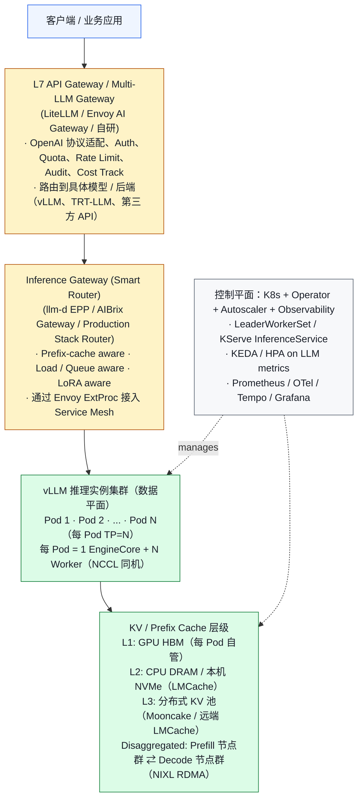
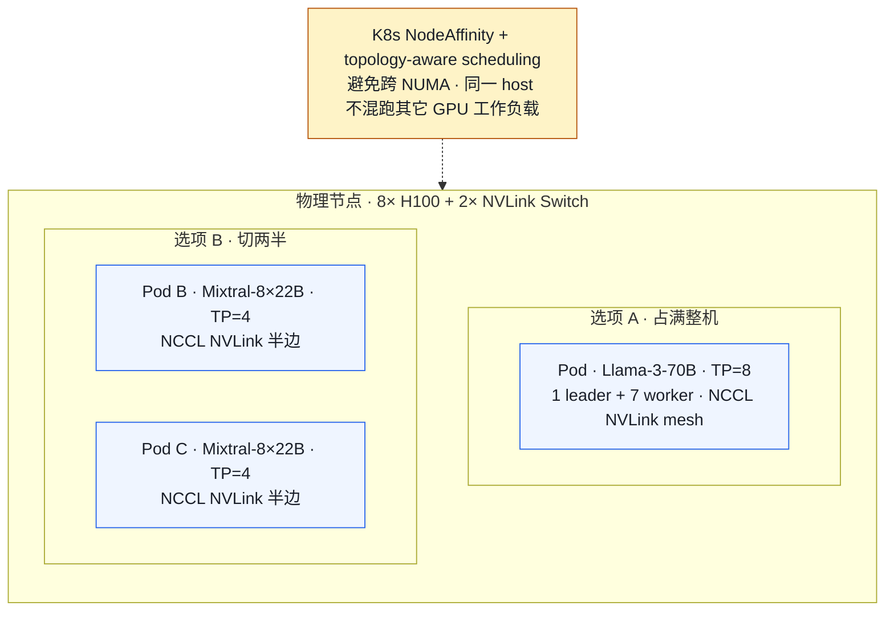
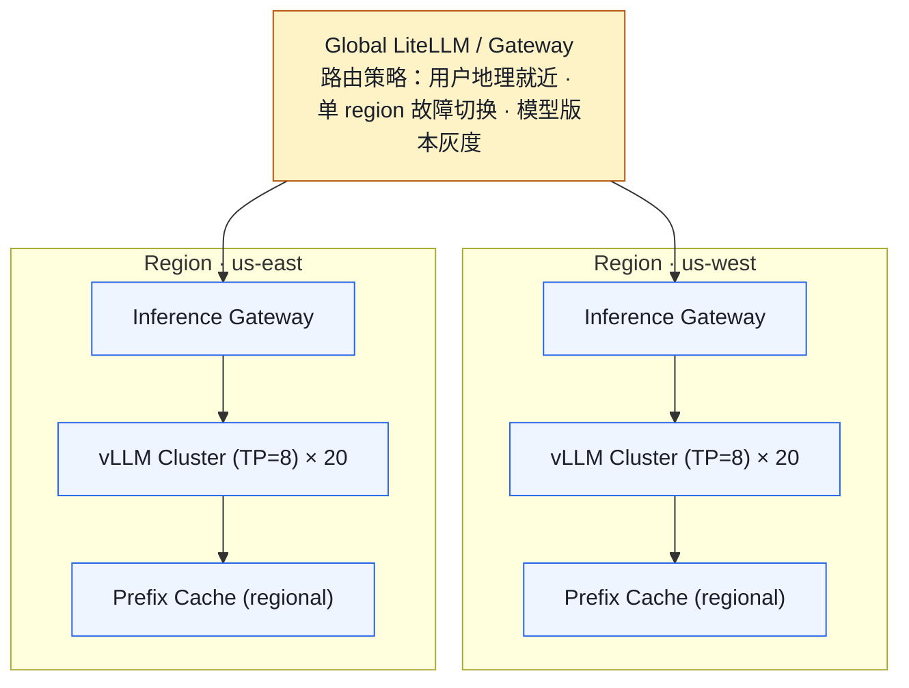

# 01. 大规模 vLLM 部署参考架构（2026 视角）

> **谁该读这一篇？** 准备搭建或评审公司 LLM 推理平台的 SRE / 平台工程师 / 推理架构师。
>
> **前置阅读：** [`02-architecture.md`](../01-overview/02-architecture.md)（理解单机 vLLM 的引擎/Worker 模型）、[`05-process-and-ipc-internals.md`](../01-overview/05-process-and-ipc-internals.md)（理解多进程 IPC）
>
> **耗时：** 约 25 分钟
>
> **学完能：**
> 1. 在白板上画出 5 层 LLM 推理平台架构（Gateway / Smart Router / vLLM 集群 / KV 层级 / 控制平面）
> 2. 区分 vLLM Production Stack、llm-d、AIBrix 三套主流栈的定位与取舍
> 3. 解释为什么 LLM Pod 必须用 LeaderWorkerSet 而不是普通 Deployment
> 4. 识别 K8s 网络层面的 NCCL/RDMA/SSE 常见坑

单机跑 `vllm serve` 是 demo。生产规模（多卡、多机、多模型、多区域、SLO 驱动）要面对的是一整套**控制平面 + 数据平面**。本节回答："如果让你给一个公司搭 LLM 推理平台，从哪开始？"

---

## 1. 从一张图开始：分层 LLM 推理平台

把整张图记住，所有面试问题都能 map 到某一层。



---

## 2. 三套主流"开箱即用"参考栈

2026 年生产部署有三套主流方案。**面试中至少要叫得出名字、说得出区别**。

### 2.1 vLLM Production Stack（vLLM 官方）

仓库：`vllm-project/production-stack`（GitHub）

- vLLM 团队官方维护
- Helm chart 一键拉起：vLLM Pod + Router + Cache + 监控
- 内置组件：`vllm-router`（基于 prefix-aware 路由）、LMCache 集成
- 2026 路线图重点：把路由收敛到 Gateway API Inference Extension、disaggregated prefill、KEDA-based 自动扩缩
- 适合：想直接照搬官方实践、不愿意自己选型的团队

### 2.2 llm-d（CNCF Sandbox）

仓库：`llm-d/llm-d`（GitHub）。由 Red Hat、Google Cloud、IBM、CoreWeave、NVIDIA 联合发起，2025 年 CNCF 孵化。

三大支柱：

1. **vLLM-aware Inference Scheduler**：基于 prefix-cache 命中和负载选 Pod
2. **Disaggregated Serving**：Prefill / Decode 物理隔离
3. **Multi-tier KV Cache**：L1 GPU、L2 CPU/SSD、L3 远端

公开数据：相比 round-robin LB，throughput +38.9%，TTFT -97%。
适合：希望深度集成 Kubernetes Gateway API、强 SLO 业务场景。

### 2.3 AIBrix（ByteDance + vLLM 社区）

仓库：`vllm-project/aibrix`。由字节跳动主导贡献，已与 vLLM 社区合并。

- Gateway + Operator + Autoscaler 全套
- 2026 年的杀手特性：**KV Cache Event Synchronization**——vLLM Pod 通过 ZMQ 向 Gateway 实时上报 cache 状态变化，Gateway 据此做近实时 cache-aware 路由
- v0.6（2026 年 3 月）支持 remote tokenizer 统一 tokenization
- 适合：大规模 chatbot 场景（cache 命中收益大）、跨 Pod 共享前缀

### 2.4 怎么选？

| 选择        | 推荐场景                                          |
| --------- | --------------------------------------------- |
| Production Stack | 中小规模、想用官方推荐配置、运维资源有限       |
| llm-d     | 已经在用 Kubernetes Gateway API，需要 disaggregated |
| AIBrix    | 大规模高并发 chat，prefix 复用极重，需要 cache 事件同步       |
| 自研        | 已有完整 ML 平台、对 K8s + Envoy 深度掌握、特定监管要求          |

也可以混着用：比如外层 LiteLLM（多 LLM 网关）+ 中层 llm-d（推理调度）+ 底层 vLLM 实例。

---

## 3. Pod 编排：为什么不能用 Deployment？

普通 `Deployment` 只能管"一个容器副本数"。LLM 推理 Pod 通常是**多容器集合**：

```
一个 vLLM 推理实例 (TP=8):
  - leader (rank 0)   ← 1 个 leader Pod
  - worker (rank 1..7) ← 7 个 worker Pod
  必须同一 NCCL 通信组、同生共死、IP 互通、同时调度。
```

普通 Deployment 做不到"原子的多 Pod 副本"。生产用：

### 3.1 LeaderWorkerSet（LWS）
K8s SIG 推出的官方 CRD（kubernetes-sigs/lws）。一个"组"包含 1 leader + N worker，**整组作为一个副本**。
扩缩、滚动更新都按组操作。vLLM Production Stack 默认用 LWS。

### 3.2 KServe InferenceService
偏推理服务抽象，封装了模型加载、自动扩缩到 0、Transformer/Predictor 分层。
LLM 场景下 KServe + llm-d 是 RedHat 推的组合。

### 3.3 Ray Serve / Anyscale
基于 Ray actor 编排 worker。优点是动态资源调度灵活；缺点是引入 Ray 这层依赖。

---

## 4. 网络：能容易翻车的几个点

LLM 推理对网络极度敏感，比一般微服务苛刻：

| 通信类型             | 要求                  | 实际坑                                              |
| ---------------- | ------------------- | ------------------------------------------------ |
| TP 内 AllReduce  | NVLink 600+ GB/s    | 跨 NUMA 走 PCIe，吞吐掉 5×。Pod 必须 `nvidia.com/gpu: 8` 整机 |
| PP 跨段           | 100+ Gbps RoCE/IB  | 用 K8s 默认 CNI（Calico）会绕 host network，掉到 GbE      |
| KV Transfer (DP) | RDMA / NIXL         | 不开 GPU-Direct 走 CPU 中转，毫秒级飙升                    |
| API 入口          | HTTP/2 + SSE         | gRPC LB 不一定流式正常，要测 SSE 长连接                       |

K8s 配置要点：

- `hostNetwork: true` 或 SR-IOV/Multus 让 RDMA 直通
- 跨 Pod 走 `RoCE` 时用 `k8s-rdma-shared-dev-plugin`
- Service Mesh sidecar 不要拦 NCCL / RDMA 端口（坑过很多人）

---

## 5. 一台 8× H100 节点的典型部署



要点：

- 用 `nvidia.com/gpu` device plugin 报告卡数
- 设置 `nvidia.com/mig-config` 或 `topology-aware-scheduling` 保证 NVLink 拓扑
- 一台机器**通常只跑一种模型**——切多个模型时 NCCL group 容易踩坑
- 共享 host 上禁止跑其他 GPU 工作负载（CUDA Graph + 量化矩阵会随机抢资源）

---

## 6. 多区域 / 多机房

到了 100+ GPU 规模，部署变成"多个相同的 region"：



跨 region 的 KV cache 几乎不可能共享（带宽不够）。每个 region 自带一份完整 prefix cache。冷启动一个 region 时 cache hit rate 会从 0 慢慢爬升。

---

## 7. 容器镜像：别让镜像把你坑死

LLM 镜像有几个坑：

1. **镜像大**：vLLM + CUDA + 各种 backend = 15-30GB。冷启动拉取要 minutes 级。
   - 解决：节点预热（DaemonSet 提前拉）、镜像分层（base + thin overlay）、ContainerD 镜像懒加载（stargz/Nydus）
2. **模型权重不要打进镜像**：70B 模型 140GB，每次部署拉镜像太慢
   - 解决：模型权重放对象存储（S3/OSS），通过 init container 或 CSI driver 挂载；hot model 用 fluid 等缓存
3. **CUDA 兼容**：driver 版本 / CUDA / torch 三者强绑定。production 用确切的 tag，不要 `:latest`
4. **Python 包冲突**：vLLM 依赖很多 native package（flashinfer、vllm-flash-attn、xformers）。建议用 uv 锁版本 + 多阶段构建

---

## 8. 推荐部署清单（公司从 0 起步）

如果让你给一家中型公司从 0 部署 LLM 推理平台：

### Day 1
- 单实例 `vllm serve`，跑通 Llama-3-8B
- Prometheus + Grafana，先看 TTFT/TPOT
- 一个最简单的 nginx 在前面

### Week 1
- K8s 化：用 LeaderWorkerSet 或 KServe
- 多副本 + 简单 round-robin LB
- 上 OpenTelemetry tracing

### Month 1
- Helm chart 化部署（vLLM Production Stack 起手）
- 加 Smart Router（cache-aware）
- 接入 Service Mesh（Istio 或 Linkerd）做 mTLS + ratelimit
- 灰度发布机制

### Quarter 1
- Multi-tenancy（quota、fair share）
- 量化、投机解码上线
- HPA / KEDA 自动扩缩
- 多区域 + 全局 LB
- 故障演练（chaos engineering）

---

## 小结

- LLM 推理平台分 5 层：API Gateway → Smart Router → vLLM 集群 → KV/Prefix Cache 层级 → 控制平面，每层职责清晰、可独立演进。
- 三套主流栈各有定位：Production Stack 开箱即用、llm-d 强 SLO + Gateway API 原生、AIBrix 大规模 chat 场景的 cache 事件同步。
- LLM Pod 是"多 Pod 同生共死"的副本单元，必须用 LeaderWorkerSet / KServe / Ray Serve，普通 Deployment 表达不了原子组。
- 网络上 NVLink/RoCE/RDMA 是命脉：Service Mesh sidecar、CNI、hostNetwork 配置不当会让吞吐塌方。
- 镜像与权重要解耦：镜像走预热 + 懒加载，模型权重走对象存储 + CSI 挂载。

## 自检

> 答案不必照搬，能讲到关键点即可。

**1. 70B TP=8 推理服务用什么 CRD？为什么不用 Deployment？**

**用 LeaderWorkerSet（LWS）**（来自 KubeRay / kueue / 自研）。原因：

- TP=8 模型要求 **8 个进程同时启动**才能初始化 NCCL group。Deployment 按 pod 独立调度，不保证同时——可能 7 个起来等第 8 个起来期间 NCCL hang
- 任一 worker 崩 → 整组必须重启（NCCL 通信组无法 dynamic add member）。Deployment 默认按 pod 重启，达不到"整组同步重启"
- LWS 把"1 leader + N-1 worker"打包成 atomic unit，整组同时起 / 同时停
- 类似 CRD：StatefulSet 也不行（顺序启动，太慢）；Job 不能长期运行

具体可选 CRD：KubeRay 的 `RayCluster` + workers、LeaderWorkerSet（K8s SIG-apps 标准化中）、kueue 的 `Workload`。

---

**2. SSE 流式请求每 30s 断开，先怀疑哪一层？**

**按怀疑度排序**：

1. **L7 LB idle timeout**：ALB/NLB/CloudFront 默认 idle timeout 60s 或 30s——SSE 长连接超时被中断。改：将 idle timeout 调到 600s+ 或开 keepalive
2. **Envoy/Istio sidecar `stream_idle_timeout`**：默认 5min 但有些 conf 是 30s。改：`stream_idle_timeout: 0`（无限）或 600s
3. **HTTP/2 PING idle**：HTTP/2 默认 keepalive 没启用 → 中间路由器 idle 后断
4. **CNI 网络（如 Cilium）的 conn track timeout**：流量小时 conn 被 GC

排查命令：

```bash
# 检查 idle 配置
kubectl get gateway -o yaml | grep -i timeout
# 看 access log
kubectl logs <envoy-pod> | grep "stream_idle"
```

---

**3. AIBrix "KV Cache Event Synchronization" 通过什么通道？**

**通过 vLLM 的 stat / metric callback + Redis pubsub**（或类似消息总线）。具体：

- vLLM 启动时注册一个 callback：每当 prefix cache hit/miss/evict 时，把事件（含 hash / pod id / token 范围）push 到 Redis stream
- AIBrix Gateway 订阅这个 stream → 维护全局"prompt hash → pod"映射
- 路由时查这个映射，决定打哪个 pod（命中已有 cache 的 pod）

**为什么这样设计**：vLLM 自身没有跨 pod cache 同步能力；外部 sidecar/agent 监听 metric 也行但延迟高；直接事件流是最快的"几乎实时"同步。

注意：这不是 vLLM 内置功能，是 AIBrix 在 vLLM 之上加的中间件。

---

**4. 跨 region 共享 prefix cache 为什么不可行？冷启动新 region cache hit rate 曲线？**

**不可行的原因**：

- KV cache 物理上在 GPU HBM，跨 region 传输延迟 100ms+
- prefix cache 命中后还要从 cache 加载 KV 数据到本地 HBM，跨 region 加载比 recompute 还慢
- 网络成本：每 GB cache 跨 region 传输 ~$0.02-0.09，prefix cache 几 GB 反复传 → 不经济

**冷启动新 region 的 cache hit rate 曲线**（典型）：

```
hit rate
  ↑
1.0│
   │
0.8│                                ╱───── 平台期
   │                          ╱───
0.5│                    ╱────
   │              ╱────
0.2│        ╱────
   │   ╱───
  0└───┴─────────────────────────→ 时间
   T=0  30min  2h    8h   24h
```

- **T=0**：cache 完全空，命中率 0%
- **0-30min**：第一批用户进来，建立 cache，命中率快速上升
- **30min-8h**：长尾用户陆续触发新 prefix，命中率缓慢上升
- **稳态**：跟原 region 类似（如果 workload 一致），8-24h 内达到 60-80%

**实战建议**：冷启动新 region 时**手动 warm up**——把已知热门 system prompt / few-shot 模板批量发一遍预热 cache，能把"达到稳态"时间从 8h 压到 30min。

## 下一步

- 下一节：[`02-smart-routing-and-load-balancing.md`](./02-smart-routing-and-load-balancing.md)（把"Smart Router"这一层拆开看）
- 想看源码：`vllm/entrypoints/` 看单机入口、`vllm/v1/engine/` 看 EngineCore/Worker 拆分
- 想动手：[`07-hands-on/01-setup.md`](../07-hands-on/01-setup.md) 先把单机 demo 跑通再上 K8s

---

## Sources

- [vLLM Production Stack 2026 Roadmap](https://github.com/vllm-project/production-stack/issues/855)
- [llm-d: Kubernetes-Native Distributed LLM Inference](https://llm-d.ai/)
- [Introducing AIBrix: Cost-Effective and Scalable Control Plane for vLLM](https://aibrix.github.io/posts/2025-02-20-vllm-control-plane/)
- [vLLM Production Deployment Architecture](https://introl.com/blog/vllm-production-deployment-inference-serving-architecture)
