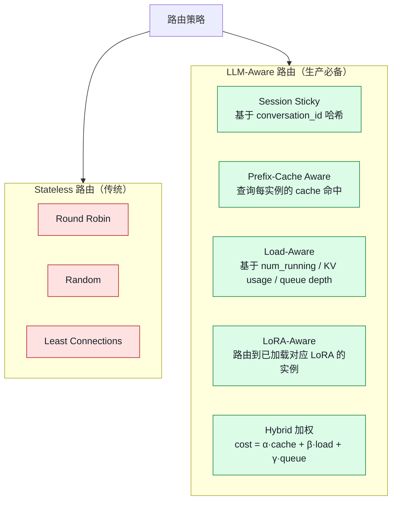
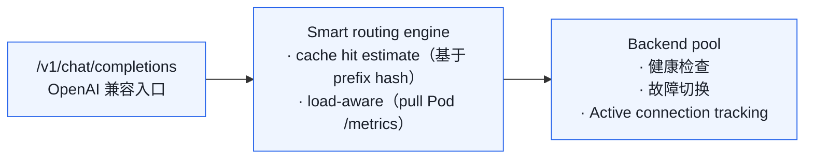
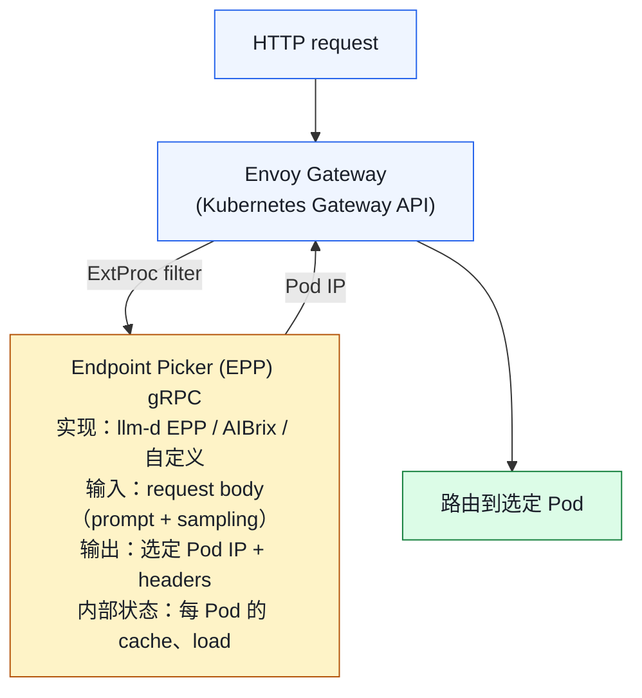
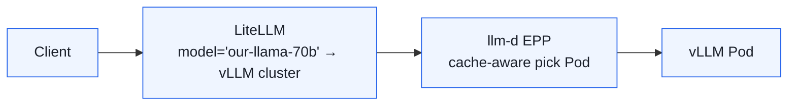
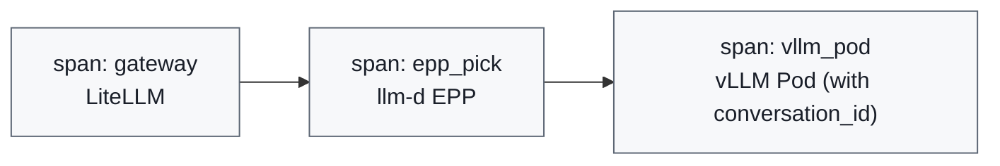

# 02. 请求调度与负载均衡：LLM 专属的"智能路由"

> **谁该读这一篇？** 负责把多副本 vLLM 接入生产流量的平台工程师 / SRE / Gateway 团队。
>
> **前置阅读：** [`01-deployment-architectures.md`](./01-deployment-architectures.md)、[`04-prefix-caching.md`](../02-core-concepts/04-prefix-caching.md)（理解 Pod 内 prefix cache）
>
> **耗时：** 约 30 分钟
>
> **学完能：**
> 1. 解释为什么传统 round-robin / least-conn 在 LLM 推理下注定失败
> 2. 列举 cache-aware / load-aware / LoRA-aware / session-sticky 四类信号
> 3. 描述 push / pull / estimate 三种 cache 状态同步方案的取舍
> 4. 画出 Envoy + ExtProc + EPP (Gateway API Inference Extension) 的请求路径

LLM 推理的负载均衡跟传统微服务**完全不同**。round-robin 在这里是灾难。本节讲清"为什么需要 smart router"、几种路由策略，以及 llm-d / AIBrix / vLLM Router 的工程实现。

---

## 1. 为什么 round-robin / least-conn 在 LLM 下失灵？

传统服务负载均衡假设：

- 每个请求处理时间相近
- 每个实例性能相近
- 实例之间无状态

LLM 推理打破**全部**这些假设：

| 假设            | LLM 现实                                                    |
| ------------- | --------------------------------------------------------- |
| 请求时间相近        | 一个 50 token 短请求 vs 一个 100k token 长请求差 1000×             |
| 实例无状态        | 每实例有自己的 **prefix cache**——命中和不命中差 50× TTFT             |
| 实例性能相近        | 不同实例的 KV usage、batch fullness 差异极大                       |
| 一来一回          | 流式输出（SSE）持续几十秒，连接长存                                      |

如果用 round-robin：

- prefix cache 命中率从 80% 跌到 10%
- 长尾长请求恰好都落同一实例 → 那实例 KV 爆 / 频繁 preempt
- decode 阶段大 batch 实例和 idle 实例并存，浪费

---

## 2. 路由策略分类



---

## 3. Session Sticky：最基础但极有效

### 思想
同一个 conversation_id 永远路由到同一个 Pod。

- 第一轮：cold start，TTFT 高
- 后续轮：完整 prefix cache 命中，TTFT 极低

### 实现
1. **客户端层**：API 调用时带 `conversation_id`，gateway 据此哈希到 Pod
2. **Header 层**：Envoy 用 `Ring Hash` LB policy（一致性哈希）
3. **K8s Service 不行**：默认基于 IP 哈希，对 NAT 客户端无效

### 一致性哈希要解决"扩缩容时少打乱"
普通哈希在 Pod 数 N → N+1 时几乎所有 key 都重映射。一致性哈希只移动 1/N 的 key。
Envoy 的 `Maglev` 或 `Ring Hash` 是事实标准。

### 代价
- 单 Pod 故障 → 该用户上下文丢失
- 热点会话：一个用户超活跃，会让那 Pod 过载（需配合"超载 fallback"）

---

## 4. Prefix-Cache Aware Routing：当下 SOTA

### 4.1 思想
Smart Router 维护一份"每 Pod 当前有什么 cached prefix"的近实时视图。新请求来时：

1. 算 prompt 的 block hashes
2. 查每个 Pod 的 cache index，找命中长度最大的
3. 路由过去

### 4.2 数据怎么同步？

**方案 A：Pull（vLLM Production Stack Router）**
Router 周期性向每个 Pod GET `/metrics` 或自定义端点，拉取 cache index 摘要。简单但有延迟（秒级），命中率次优。

**方案 B：Push (AIBrix KV Event Sync)**
vLLM 在 KV 状态变化时（block cached / evicted）通过 ZMQ 主动向 Gateway 发事件。
Gateway 实时维护全局视图。
v0.6 (2026-03) 已稳定，支持 remote tokenizer 保证不同 Pod tokenization 一致。

**方案 C：Estimate（llm-d EPP，默认）**
Router 自己用 prompt + 已知 Pod 历史路由做 trie 估计 cache 状态。
精度低于 push 但零侵入。

### 4.3 效果
llm-d 公开数据：

- Throughput +38.9%（vs round-robin）
- TTFT p95 -97%（chat workload，prefix 重复多）

Cache-aware 是**目前 LLM 路由最重要的优化**，不开就是浪费。

### 4.4 跟 vLLM 内部 prefix caching 的关系
- vLLM Pod 内部：跨请求 prefix 命中（同一 Pod 内的请求）
- Router 跨 Pod：把"可能命中同一前缀"的请求路由到同一 Pod
- 两者**协同**——前者是数据平面的优化，后者是控制平面的优化

---

## 5. Load-Aware Routing：避免热点

### 5.1 关键信号
Gateway 从每 Pod 收集这些 metric：

| 指标                                   | 含义                  |
| ------------------------------------ | ------------------- |
| `vllm:num_requests_running`         | 当前 batch 大小         |
| `vllm:num_requests_waiting`         | 队列深度                |
| `vllm:gpu_cache_usage_perc`         | KV 使用率（接近 100% 不能再进）|
| `vllm:num_preemptions_total` 增速     | 内存压力                 |
| `time_per_output_token_seconds` p99 | 用户体验代理              |

### 5.2 路由打分

```python
score(pod) = α * cache_hit_length(pod, prompt)         # 越高越好
           - β * pod.num_running                        # 越低越好
           - γ * pod.queue_depth                        # 越低越好
           - δ * pod.kv_usage                           # 越低越好
           + ε * (1 if pod has needed LoRA else 0)      # LoRA 命中加分

route_to = argmax(score)
```

α/β/γ/δ/ε 由 workload 调，**chat workload 中 α 权重最大**（cache 收益主导）。

### 5.3 admission control
某些 Pod 已经 `kv_usage > 0.9` 时，无论分数多高都**拒绝调度新请求**，避免后续 preempt cascade。

---

## 6. LoRA-Aware Routing

### 背景
LoRA 适配器（每个几十 MB）允许同一基模型服务多个微调版本。vLLM 支持动态 LoRA 加载/卸载。
但加载新 LoRA 要 100ms-1s（小但不可忽略）。

### 策略
1. **Affinity routing**：请求带 LoRA id，路由到已加载该 LoRA 的 Pod
2. **预热**：高频 LoRA 在所有 Pod 上常驻
3. **LRU 卸载**：长时间不用的 LoRA 自动卸载，腾显存

### 实现位置
- vLLM Pod 暴露 `loaded_adapter_ids` 列表（通过 /metrics 或 admin API）
- Router 在路由打分里加 LoRA 命中权重

---

## 7. vLLM 自带的 Router（Production Stack）



启动：

```bash
helm install vllm-stack vllm/vllm-stack \
  --set router.enabled=true \
  --set router.routingPolicy=prefix-aware
```

---

## 8. Envoy AI Gateway + Gateway API Inference Extension

**这是 2026 年的官方方向**。

### 架构



### 关键点
1. **ExtProc** 是 Envoy 的扩展点：外部 gRPC 服务可以在路由前修改 request、决定 backend
2. **EPP（Endpoint Picker）** 是 Gateway API Inference Extension 标准化的接口
3. Istio 1.28+ 原生支持
4. 解耦：路由策略可以单独迭代，不需要碰 Envoy 本体

### 好处
- 复用 Envoy 的 mTLS、ratelimit、observability、熔断
- 多团队可以协作（DevOps 管 Envoy，ML 平台团队管 EPP）
- 标准化：换实现（llm-d → AIBrix）只换 EPP service

---

## 9. 多 LLM 网关：LiteLLM 的位置

LiteLLM（litellm.ai）通常作为**最外层**网关：

- 统一 OpenAI 协议
- 路由到多个后端：vLLM、TRT-LLM、OpenAI API、Anthropic、Bedrock……
- API key 管理、quota、cost track
- 模型别名（"gpt-4" → 路由到自己的 Llama-70B）

它**不是替代**底层 smart router，而是上一层"哪个模型 / 哪个后端"。

典型组合：



---

## 10. 工程上的几个非显然 trick

### 10.1 Tokenization 一致性
不同 Pod 必须用**完全相同**的 tokenizer 版本。否则同一 prompt 的 block_hashes 不同，cache 命中失败。
AIBrix v0.6 的 `remote tokenizer` 就是为了这个：Gateway 统一 tokenize 后把 token_ids 传给 Pod。

### 10.2 流式 + Smart Router
SSE 的 first byte 已经出去后，不能换 Pod。

- 路由决策必须在 first byte 前完成
- 之后哪怕该 Pod 出问题也只能让请求失败（不能中途切）

### 10.3 长上下文请求的"特殊通道"
100k+ token 请求会显著影响 batch。建议：

- 单独一组 Pod 服务长上下文（高 KV 容量）
- 路由层识别 prompt 长度 → 走专门后端

### 10.4 流量染色
请求经过多层路由，在 OTel trace 里要能看到完整路径：



任何一步慢都能直接定位到对应 span。

---

## 11. 面试常见追问

**Q: 既然 vLLM 内部有 prefix caching，为什么还要 Router 层做 cache-aware？**
A: vLLM 内部 cache 只在**同一 Pod 内**生效。多 Pod 部署下，同一会话路由到不同 Pod 就完全 miss。Router 层 cache-aware 保证同前缀请求落到同一 Pod，让 Pod 内 cache 真的生效。

**Q: Push vs Pull 同步 cache 状态怎么选？**
A: Push 实时但侵入；Pull 简单但有延迟。生产追求性能选 Push（AIBrix 路径）；早期用 Pull 起步即可。

**Q: 一致性哈希在 LLM 路由够用吗？**
A: 不够。一致性哈希只解决"扩缩平稳"，不感知 cache、load、LoRA。生产用 cache-aware + load-aware 综合打分。一致性哈希是 session sticky 实现的工具，不是策略本身。

**Q: 怎么测试路由策略效果？**
A: 录制真实 workload trace（带 conversation_id），离线 replay 不同策略，对比 TTFT/throughput/cache hit rate。或者 shadow 流量在 staging。

**Q: smart router 自己会不会成为瓶颈？**
A: 会。需要确保：①ExtProc 服务本身可扩缩 ②路由决策 < 1ms ③缓存状态用近实时近似（不强求严格一致）④Gateway 层有降级到 round-robin 的能力。

---

## 小结

- LLM 请求时长、状态、性能高度异质，传统无状态 LB 必然让 cache miss 和热点同时发生。
- Cache-aware 是收益最大的路由信号（chat workload 下 TTFT p95 可降 90%+），其次是 load-aware 与 LoRA-aware。
- Cache 状态同步有 push（AIBrix ZMQ 事件）/ pull（Production Stack 周期拉 metrics）/ estimate（llm-d 本地 trie）三条路线。
- 2026 年方向是 Gateway API Inference Extension + Envoy ExtProc + EPP：路由策略与数据面解耦。
- 工程陷阱集中在 tokenizer 一致性、SSE 首字节后不能换 Pod、长上下文需要独立通道。

## 自检

> 答案不必照搬，能讲到关键点即可。

**1. Cache-aware Router 跟 vLLM 内部 prefix caching 的协同关系？**

> Router 负责**把同 prefix 的请求路由到同一 vLLM pod**，让 vLLM 内部的 prefix caching **真正命中**（而不是分散到 N 个 pod 各自重算）。

两者**互补，缺一不可**：

- 没 vLLM prefix caching：即使路由对了，pod 内部也不复用 KV
- 没 cache-aware router：N 个 pod 各自有自己的 cache，命中率 ÷ N

加分：Router 维护的是"prompt hash → pod" 映射；vLLM 维护的是"block hash → 物理 KV block"。两层 hash 协同——前者解决路由，后者解决物理存储。

---

**2. 用 `num_requests_waiting` + `gpu_cache_usage_perc` 设计 admission control 阈值。**

```python
def should_admit(request) -> bool:
    waiting = read_metric("vllm:num_requests_waiting")
    kv_usage = read_metric("vllm:gpu_cache_usage_perc")

    # 硬阈值：KV 快满 → 拒绝（避免 preempt 风暴）
    if kv_usage > 0.95:
        return False

    # 软阈值：队列深 → 拒绝（保护 TTFT SLO）
    if waiting > 100:
        return False

    # 综合：KV 紧张 + 队列也长 → 更严格
    if kv_usage > 0.85 and waiting > 50:
        return False

    return True
```

**阈值依据**：

- `kv_usage > 0.95`：留 5% 安全垫，否则下一个请求 alloc 必失败
- `waiting > 100`：假设 step 时长 50ms，100 个请求要至少 5s 才能依次进 batch，超过 TTFT SLO
- 复合规则：两个都吃紧时降低阈值，更早拒绝避免雪崩

**拒绝时返回**：HTTP 429 + `Retry-After: <估算重试时长>` header，让客户端 backoff。

加分：还可以加 `vllm:num_preemptions_total` rate 作为第三维度——如果 preempt 已经在发生，证明系统极限到了，必须拒新请求。

---

**3. 一致性哈希在 session sticky 中扮演什么角色？为什么单靠它不够？**

**角色**：把 user_id / session_id 映射到固定 pod，让同一用户的连续请求落同一 pod，复用对话 KV cache。

**算法核心**：将 pod 散列到 0~2^32 的环上，请求 hash 后顺时针找最近 pod。**pod 增删时只影响相邻段**，避免全量 rehash。

**为什么单靠它不够**：

1. **不能区分 prefix**：两个不同用户用同一个 system prompt（如同一公司的 chatbot），一致性 hash 把他们分到不同 pod，cache 不能共享
2. **负载不均**：用户 session 长短不一，hot session pod 过载、idle session pod 闲
3. **新用户 cold start**：首次访问的用户走哪个 pod 完全随机，cache 命中率 0
4. **pod failure 时重路由**：用户被切到新 pod，原 pod 的 cache 失效

**需要补充**：

- **Prefix-aware fallback**：除了 session hash，还按 prompt 前缀的 block hash 路由
- **Load-balanced 一致性 hash**：bounded load consistent hashing，每个 pod 容量上限
- **EPP routing**：根据 vLLM metric 实时调整权重

→ 实战通常 "**session sticky（主）+ prefix-aware（辅）+ load 检测（兜底）**" 三层。

---

**4. 替换 EPP 实现（llm-d → AIBrix），Envoy 这边需要改什么？**

**几乎不用改**——这是 Gateway API Inference Extension 的核心价值。

**Envoy 端只需要**：

- 配置 ExtProc filter 指向新 EPP 的 gRPC endpoint
- 改一行 endpoint URL：`llm-d-epp.svc:9002` → `aibrix-epp.svc:9002`

**EPP 端**：协议遵循 Gateway API Inference Extension 标准（ExtProc gRPC），所以新 EPP 实现只要也遵循同一协议，Envoy 就能透明替换。

**协议核心**：

```
Envoy → EPP (gRPC): request_header + body
EPP   → Envoy   : routing decision (target endpoint) + optional modifications
Envoy → backend : forward request
```

**Gateway API Inference Extension 的价值**：

1. **解耦**：路由策略（EPP）与数据面（Envoy）分离。替换策略不动数据面
2. **可插拔**：用户可以自己实现 EPP（rust / go / python 都行），只要符合协议
3. **标准化**：不同 LLM serving 平台（llm-d / AIBrix / 自研）可共用同一 Gateway 基础设施
4. **生态**：Istio / Cilium Gateway 都自动兼容

→ 这是把传统 K8s Ingress 缺乏的"应用层智能"统一抽象，让 LLM serving 不必每家造个轮子。详见 https://gateway-api-inference-extension.sigs.k8s.io/。

## 下一步

- 下一节：[`03-gateway-and-service-mesh.md`](./03-gateway-and-service-mesh.md)（Gateway / Service Mesh 与 LLM 流量的兼容细节）
- 想看源码：vLLM 自带 router 在 `vllm/entrypoints/openai/` 与 production-stack 仓库；Pod 暴露的 metrics 见 `vllm/v1/metrics/`
- 想动手：[`07-hands-on/03-mini-experiments.md`](../07-hands-on/03-mini-experiments.md) 起两个 vLLM 实例对比 round-robin vs sticky 的 TTFT 差异

---

## Sources

- [KV Cache Aware Routing — vLLM Production Stack](https://docs.vllm.ai/projects/production-stack/en/vllm-stack-0.1.8/use_cases/kv-cache-aware-routing.html)
- [KV Cache Events Synchronization - AIBrix](https://aibrix.readthedocs.io/latest/features/kv-event-sync.html)
- [Intelligent Inference Scheduling | llm-d](https://llm-d.ai/docs/guide/Installation/inference-scheduling)
- [KV-Cache Wins You Can See | llm-d](https://llm-d.ai/blog/kvcache-wins-you-can-see)
- [Zero-to-Hero with the vLLM Router](https://martinuke0.github.io/posts/2026-01-04-zero-to-hero-with-the-vllm-router-load-balancing-and-scaling-vllm-model-servers/)
