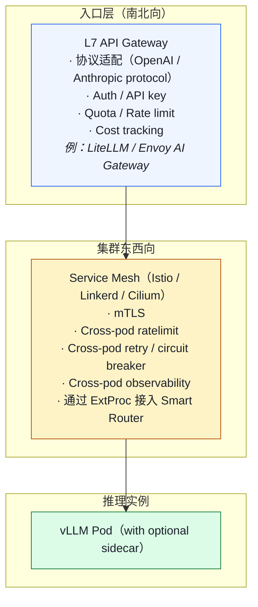
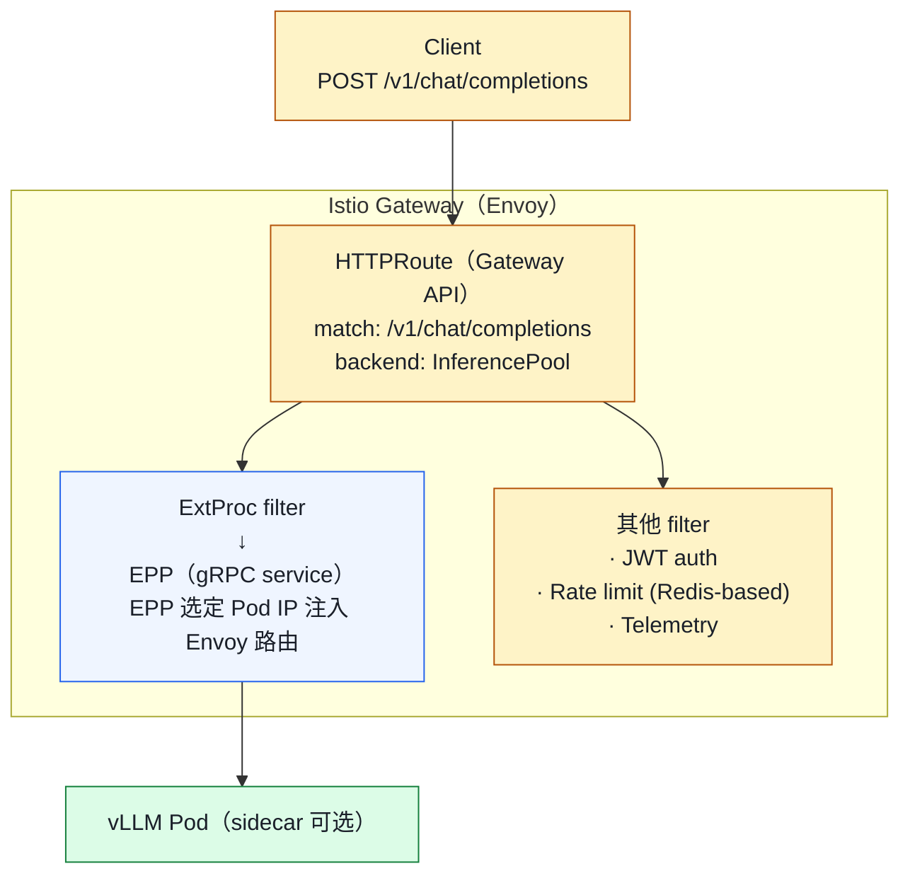
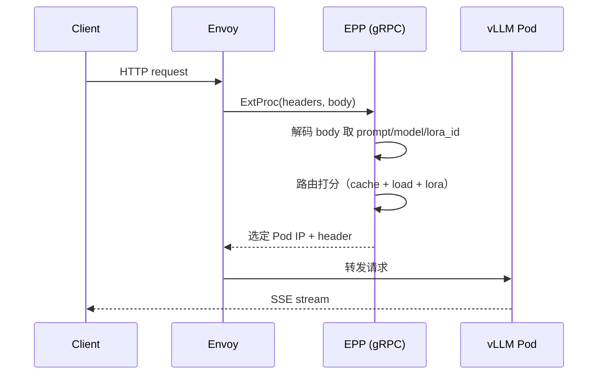

# 03. API 网关与 Service Mesh：让 LLM 流量"可治理"

> **谁该读这一篇？** 负责 Ingress / Service Mesh / 多租户治理的平台 SRE 与安全工程师。
>
> **前置阅读：** [`02-architecture.md`](../01-overview/02-architecture.md)、[`02-smart-routing-and-load-balancing.md`](./02-smart-routing-and-load-balancing.md)
>
> **耗时：** 约 30 分钟
>
> **学完能：**
> 1. 划清 API Gateway 与 Service Mesh 在 LLM 场景下的边界
> 2. 用 Gateway API Inference Extension (InferencePool / EPP) 描述请求路径
> 3. 配置 SSE / 长 body / 长超时的 Envoy 与 K8s Ingress 参数
> 4. 避开 mTLS 拦截 NCCL、sidecar 影响 RDMA 的典型陷阱

通用微服务里 Service Mesh 是为了 mTLS / Observability / Resilience。LLM 场景下，Mesh 还要扛 SSE 长连接、ExtProc 智能路由、大 Body 体的 ratelimit、token 级 cost 计费——这些点常被忽略。

---

## 1. 为什么 LLM 也要走 Service Mesh？

抛开"赶时髦"，LLM 推理对 mesh 有真实需求：

1. **零信任 mTLS**：模型权重 + 用户 prompt 都是敏感数据
2. **租户隔离 / Quota**：不同业务方共用 GPU，要按 token / RPS 限流
3. **可观测性统一**：trace 串联 Gateway → EPP → vLLM Pod
4. **熔断 / 重试 / 超时治理**：单 Pod 卡 NCCL 时不要拖死全网
5. **流量管理**：金丝雀、shadow traffic、A/B
6. **多协议**：HTTP/2 + SSE 流式、gRPC、WebSocket

但 LLM 流量有几个**特殊性**让 mesh 必须特别配置，下面逐个说。

---

## 2. 网关 vs Mesh：边界在哪里？



**网关**主要管"南北向"（用户 ↔ 集群），**Mesh** 主要管"东西向"（集群内 Pod ↔ Pod）。
现代 Gateway API 把两者统一了：Istio 1.28+ 同时是网关也是 mesh。

---

## 3. Istio + Gateway API Inference Extension：当下标准

### 3.1 整体



### 3.2 关键 CRD

Gateway API Inference Extension 引入：

- `InferenceModel`：声明一个模型（名字、版本、目标 InferencePool）
- `InferencePool`：一组 vLLM Pod + EPP 配置
- 复用 `HTTPRoute` 把请求路由到 InferencePool

```yaml
apiVersion: inference.networking.k8s.io/v1alpha2
kind: InferencePool
metadata:
  name: llama-70b-pool
spec:
  selector:
    app: vllm
    model: llama-3-70b
  endpointPickerRef:
    group: ""
    kind: Service
    name: llm-d-epp
```

### 3.3 ExtProc 流程



整个过程 < 1ms（EPP 用 Go 写，cache 状态都在内存）。

---

## 4. 流式 SSE：Mesh 最容易翻车的地方

LLM API 的 99% 流量是 **Server-Sent Events**：long-lived HTTP/2 连接，token 一个个推。Mesh 默认配置常常出问题：

### 4.1 buffer：致命的"看似工作但 batch 输出"
Envoy 默认有 response buffering。开启后 token 会被攒在 buffer 里一起送，TTFT 看起来还行但用户看到的是"卡半天再一整段刷出来"。

修复：

```yaml
# EnvoyFilter
spec:
  configPatches:
  - applyTo: NETWORK_FILTER
    match:
      context: GATEWAY
    patch:
      operation: MERGE
      value:
        typed_config:
          stream_idle_timeout: 600s  # 防止长 SSE 被砍
          # 关掉 response buffering
```

### 4.2 idle timeout
默认 60-300s。LLM 长生成（几分钟）会被砍。要调大或关闭。

### 4.3 HTTP/2 设置
- `http2_max_concurrent_streams` 默认 100，并发高时撞上限
- `initial_stream_window_size` 太小导致 token 推送慢

### 4.4 mTLS + SSE
Istio 默认 mTLS 在 ALPN 协商时偶发抖动，会让 SSE 第一帧迟到。
解决：固定走 TCP，由 `Sidecar` CRD 显式配置 outbound。

---

## 5. Rate Limit：LLM 维度跟传统不一样

传统 ratelimit：QPS、并发数。
LLM 需要的维度：

| 维度                | 用途                       |
| ----------------- | ------------------------ |
| RPS / 并发          | 防雪崩                       |
| input tokens / s   | 防大 prompt 攻击              |
| output tokens / s  | 防"max_tokens=999999"耗 GPU |
| total tokens / day | 按 quota 计费                |
| Concurrent streams | 防 SSE 连接泄漏                |

实现：

- Envoy `local_ratelimit`（单实例）
- `global_ratelimit` + Redis（跨 Pod 一致）
- 或自研：Envoy ExtAuthz → 自定义 quota 服务

**token 维度的 ratelimit 难点**：实际 token 数只有推理完才知道。两种做法：

1. 用 tokenizer 在 gateway 层先算 input tokens；预估 output（max_tokens 上限）
2. 推理完上报真实用量，超出 quota 下次拒绝

---

## 6. 重试与熔断：在 LLM 里要小心

普通服务重试很自然。LLM 推理重试要谨慎：

### 6.1 不要无脑重试 5xx
- 503 通常是 KV 压力或队列满 → 重试同样的 Pod 还是会 503
- 应该让 EPP 选另一个 Pod，且只在 first byte 前重试

### 6.2 流式开始后不能重试
SSE 第一帧已经发给客户端 → 中断只能让客户端感知错误，不能透明重试。

### 6.3 重试 budget
Envoy 的 `retry_budget` 限制全局重试比例（如 < 20%），避免 retry storm。

### 6.4 熔断
按 Pod 熔断：连续 5xx 多了暂时不路由到该 Pod。
但是要小心：cache-aware router 已经在感知 Pod 状态，熔断要和它协调，避免双重决策冲突。

---

## 7. 大 Body / 长 prompt 的特殊配置

LLM 请求 body 可能很大（multimodal 携带图片 base64、长 RAG 上下文）。常见配置默认值不够：

```yaml
# Envoy
typed_config:
  max_request_bytes: 100MB        # 默认 1MB
  max_request_headers_kb: 64      # tool_use schema 大

# K8s Ingress
nginx.ingress.kubernetes.io/proxy-body-size: 100m
nginx.ingress.kubernetes.io/proxy-read-timeout: 600s
nginx.ingress.kubernetes.io/proxy-send-timeout: 600s
```

**注意 mTLS 加密大 body 有显著 CPU 开销**。生产可以让 mTLS 终结在 Gateway，内网用普通 TCP（视安全模型）。

---

## 8. Sidecar 还是不要 Sidecar？

Istio 推 sidecar 模式（每 Pod 一个 envoy）。LLM 场景下要考虑：

### 8.1 Sidecar 的代价
- 每 Pod 多 30-100MB 内存 + 5-10% CPU
- 多一跳 latency（通常 < 1ms 但 high QPS 累积）
- 对 NCCL/RDMA 流量必须 exclude 否则破坏 GPU 通信

### 8.2 Sidecarless（Ambient mode / Cilium / Linkerd2）
Istio Ambient mode 把 sidecar 抽到节点级 proxy（ztunnel）。
对 LLM 适配更好：vLLM Pod 内不动，节点级 proxy 处理 mTLS + L7 治理。

### 8.3 推荐
- 早期：Sidecar 简单，开箱
- 规模化：迁移到 Ambient / Cilium eBPF 模式，省资源

---

## 9. 观测一体化（详见 06-slo-and-observability）

Mesh 是 trace 串联的天然位置：

```mermaid
gantt
    title trace 'req-abc-123'
    dateFormat X
    axisFormat %s ms

    section Edge
    istio-ingress.handle      :a, 0, 2
    ext-proc.epp_pick (router 决策)  :b, after a, 1
    istio-mesh.forward        :c, after b, 1
    section vLLM Pod 7
    queue (排队)              :d, after c, 46
    prefill (算 prompt)        :e, after d, 100
    first_token (TTFT)        :milestone, after e, 0
    decode_stream             :f, after e, 2850
    section Edge
    istio-ingress.last_byte   :g, after f, 1
```



Istio + OTel + Tempo + Grafana 一套下来，能在 Grafana 上看到任意一个请求的完整时间线。

---

## 10. 真实部署的"小但能省命"的配置

下面是一份精简的 Istio + vLLM 生产配置要点：

```yaml
# 1. Gateway listener：HTTP/2 + SSE 友好
- port: 443
  protocol: HTTPS
  tls:
    mode: SIMPLE  # mTLS 终结在 gateway

# 2. VirtualService：长超时
  timeout: 600s   # SSE 可能 > 5 分钟
  retries:
    attempts: 2
    perTryTimeout: 600s
    retryOn: gateway-error,connect-failure  # 不重试 5xx (LLM 没意义)

# 3. DestinationRule：连接池 + 熔断
  connectionPool:
    http:
      h2UpgradePolicy: UPGRADE
      maxRequestsPerConnection: 0      # 不要复用，每 SSE 独立
      idleTimeout: 600s
  outlierDetection:
    consecutive5xxErrors: 10           # 连续 10 次 5xx 才隔离
    interval: 30s
    baseEjectionTime: 60s

# 4. Sidecar：明确通信范围（关键！避免 NCCL 被拦）
  egress:
  - hosts:
    - "./*"
    bind: 0.0.0.0
  inboundConnectionPool:
    tcp:
      maxConnections: 1000
  workloadSelector:
    labels:
      app: vllm
  # outbound 不限制 NCCL/RDMA 端口

# 5. PeerAuthentication：mTLS 但允许 NCCL plaintext
spec:
  mtls:
    mode: STRICT
  portLevelMtls:
    51234:  # NCCL 通信端口（示例）
      mode: DISABLE
```

---

## 11. 故障实例：mTLS 把 NCCL 干挂了

真实事故：某团队上 Istio mTLS，集群所有 Pod-to-Pod 通信走 sidecar。
**症状**：vLLM TP=8 Pod 启动卡死在 NCCL init，超时 10 分钟。
**根因**：sidecar 拦截了 NCCL 走的 IB 通信端口，包被加密但 NCCL 不会解。
**解决**：用 `Sidecar` CRD 把 NCCL 端口段 exclude，或者 PeerAuth 在那些端口 DISABLE mTLS。

教训：**Mesh sidecar 必须放过 NCCL/RDMA 端口**。生产部署前用 `nccl-tests` 验证。

---

## 12. 面试常见追问

**Q: 为什么不直接用 K8s Service + Ingress？**
A: 几个原因：①K8s Service LB 只能基于 IP/conn-hash，不感知 LLM 语义；②Ingress 不支持 ExtProc 类型的扩展；③缺少跨 Pod 治理（mTLS、ratelimit、observability）。生产规模必走 Gateway API + Mesh。

**Q: Sidecar 给 LLM Pod 增加多少 latency？**
A: 单跳约 0.3-1ms，相对于 LLM TTFT（几十 ms 到几百 ms）影响小。但要确保 sidecar 不拦 NCCL 端口。

**Q: Mesh 怎么做 token-level ratelimit？**
A: Envoy 自带的 ratelimit 是 connection / request 维度。token 级需要：①gateway 层 tokenize 算 input；②output 推完后由 vLLM 上报实际 token；③异步累加到 quota 服务（Redis / 自研）。

**Q: 流式输出怎么和 mesh 配合？**
A: 关掉 response buffering、调大 stream_idle_timeout、HTTP/2 stream concurrency 调到几千、不要在 first byte 后启用重试。

**Q: 多 region 的 mesh 怎么联邦？**
A: Istio multi-cluster（mesh federation）或者 Cilium ClusterMesh。但**跨 region 的 LLM 流量通常不走 mesh 直连**——延迟太高，业务上不合理。一般是每 region 自治，外层一个全局 LB 做 region 路由。

---

## 小结

- Gateway 管南北向（协议、Auth、Quota、Cost），Mesh 管东西向（mTLS、跨 Pod 治理）；Gateway API 把两者统一。
- Gateway API Inference Extension 的 InferenceModel / InferencePool / EPP 是 2026 年的标准抽象。
- SSE 在 mesh 上至少要调 3 处：关闭 response buffering、调大 stream_idle_timeout、HTTP/2 stream 并发上限。
- LLM 维度的 ratelimit 比 QPS 复杂得多：input / output / total tokens / 并发流都要管。
- mTLS + Sidecar 必须放过 NCCL/RDMA 端口；规模化推荐 Ambient / Cilium eBPF。

## 自检

> 答案不必照搬，能讲到关键点即可。

**1. SSE 场景下 Envoy/Istio 必须改默认值的至少 3 个参数。**

| 参数 | 默认值 | 推荐值 | 原因 |
| --- | --- | --- | --- |
| `stream_idle_timeout` | 5min（Envoy 默认）| **0 或 600s** | SSE 流期间 idle 可能 30s+（用户在读），默认会被剪断 |
| `route.timeout` | 15s | **0 或 600s** | route timeout 是整个请求超时，SSE 长流必须放宽 |
| `http2_protocol_options.initial_stream_window_size` | 64 KB | **256 KB-1 MB** | window 小会让 SSE 流频繁等 WINDOW_UPDATE，影响 TPOT |
| `http_filters.buffer.max_request_bytes` | 4 MB | **保持小** 但加 streaming bypass | 长 prompt 不能被全缓存（影响 TTFT） |
| `keepalive.interval` | 不启用 | **30s ping** | 中间路由器 idle 60s 会断连，主动 keepalive 保命 |
| `circuit_breaker.max_pending_requests` | 1024 | **>10000** | LLM 请求并发高，队列要给够 |

最常踩坑的是前两个——SSE 跑几分钟就被 timeout 剪断、用户投诉。

---

**2. 按 output token 累计计费 + 对路由路径侵入最小？**

**思路**：在 **API Server 出口（vLLM 自己）** 或 **Envoy ExtProc/Lua 在响应流过滤时计数**，**不要**在中间路由层做。

**最小侵入方案**：

1. **vLLM 已经在 `metrics` 里暴露 `vllm:generation_tokens_total{model, user_id}`**——如果用户 ID 已经通过 header 传到 vLLM，直接订阅这个 metric 就有计费数据
2. **Envoy Lua filter on response_body**：解析 SSE chunk（`data: {"choices":[{"text":"..."}]}`），统计 token 数（用 tiktoken Lua 或简单字数估算），写入 Redis 用户计数

**为什么不在路由层**：

- 路由器拿到的是请求 metadata，不知道实际生成多少 token
- 复杂逻辑塞路由器影响路由本身延迟
- 路由器换实现（llm-d → AIBrix）就要重新写

**核心架构**：

```
client → Envoy (Lua: count_response_tokens) → vLLM
                  ↓
              Redis (user_token_usage hash)
                  ↑
         Billing service 周期性拉
```

---

**3. mTLS 让 NCCL 启动卡死，用哪两种 CRD/配置排除？**

**根本原因**：mTLS sidecar（Istio）拦截了 NCCL 的 P2P 流量（GPU 间 RDMA / TCP），但 NCCL 用自己的握手协议，与 mTLS 不兼容。

**排除方案**：

1. **PeerAuthentication** 设 NCCL 端口为 `DISABLE`（关闭 mTLS）：
```yaml
apiVersion: security.istio.io/v1beta1
kind: PeerAuthentication
metadata:
  name: vllm-nccl-bypass
spec:
  selector:
    matchLabels: { app: vllm }
  portLevelMtls:
    "29500": { mode: DISABLE }      # NCCL TCP discovery
    "29501": { mode: DISABLE }
    # NCCL P2P 端口（动态）也要全放
```

2. **AuthorizationPolicy / NetworkPolicy** 允许 NCCL 端口段：
```yaml
apiVersion: security.istio.io/v1beta1
kind: AuthorizationPolicy
metadata:
  name: vllm-nccl
spec:
  selector:
    matchLabels: { app: vllm }
  action: ALLOW
  rules:
  - to:
    - operation:
        ports: ["29500-29600", "60000-65535"]   # NCCL 用的范围
```

或者更简单：

3. **Pod annotation 排除部分流量出 sidecar**：
```yaml
metadata:
  annotations:
    traffic.sidecar.istio.io/excludeInboundPorts: "29500,29501,..."
    traffic.sidecar.istio.io/excludeOutboundIPRanges: "<gpu_subnet>"
```

排查命令：

```bash
# 看 NCCL 在等什么
NCCL_DEBUG=INFO  → 查 log
# 看 istio-proxy 有没有拦截
kubectl logs <pod> -c istio-proxy | grep "29500\|RST"
```

---

**4. Ambient mode 比 Sidecar 的最大好处？**

**Sidecar mode**：每个 LLM pod 多一个 envoy 容器（~100 MB 内存、几% CPU）。8 卡 TP 部署 = 8 个 sidecar = ~800 MB 浪费 + 网络多一跳。

**Ambient mode**：sidecar 被替换为**节点级共享代理（ztunnel）+ 可选的 L7 waypoint**。每节点 1 个 ztunnel 处理所有 pod 的 mTLS，pod 内不嵌任何代理。

**最大好处 for LLM**：

1. **网络路径减少一跳**：sidecar 模式下流量走 `pod → sidecar → 网络 → sidecar → pod`（双 sidecar）；ambient 是 `pod → ztunnel(节点) → 网络 → ztunnel(节点) → pod`，每端少一次进出 pod 网络栈。LLM 流量包大（KB-MB chunk），这一跳省下来对吞吐有感
2. **资源大幅节省**：8 卡 TP × N pod 不再每 pod 一个 sidecar，节点级共享，**节点上 sidecar 总成本 1 个**
3. **NCCL 兼容性更好**：ambient 默认走 L4（TCP-level mTLS），不像 sidecar 那样需要复杂的端口豁免——NCCL 跑得过去几率高
4. **升级**：升级 ztunnel 不重启 LLM pod；sidecar 升级需要每 pod 重启（NCCL group 要重建）

**生产建议**：新部署优先 Ambient（Istio 1.22+ stable）；已有 sidecar 部署可以渐进迁移。详见 https://istio.io/latest/docs/ops/ambient/。

## 下一步

- 下一节：[`04-autoscaling-and-capacity.md`](./04-autoscaling-and-capacity.md)（流量进来后怎么扩缩容）
- 想看源码：vLLM OpenAI 入口在 `vllm/entrypoints/openai/`；流式响应在 `api_server.py`
- 想动手：[`07-hands-on/02-trace-a-request.md`](../07-hands-on/02-trace-a-request.md) 用 OTel 串完整 Gateway→Pod trace

---

## Sources

- [Production-Grade LLM Inference at Scale with KServe, llm-d, and vLLM](https://llm-d.ai/blog/production-grade-llm-inference-at-scale-kserve-llm-d-vllm)
- [Serving Multiple LLMs on Kubernetes with llm-d, Istio, and LiteLLM](https://medium.com/@prasannanattuthurai/serving-multiple-llms-on-kubernetes-with-intelligent-routing-using-llm-d-istio-and-litellm-7d33760d1001)
- [Kubernetes Gateway API in 2026: Envoy, Istio, Cilium, Kong](https://dev.to/mechcloud_academy/kubernetes-gateway-api-in-2026-the-definitive-guide-to-envoy-gateway-istio-cilium-and-kong-2bkl)
- [Service Mesh Debugging: When Istio Breaks Your Inference Pipeline](https://www.kubenatives.com/p/service-mesh-debugging-when-istio)
