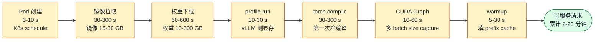

# 04. 自动扩缩与容量规划

> **谁该读这一篇？** 负责 LLM 服务容量规划、HPA/KEDA 配置、成本治理的 SRE / 平台工程师 / FinOps。
>
> **前置阅读：** [`01-deployment-architectures.md`](./01-deployment-architectures.md)、[`05-process-and-ipc-internals.md`](../01-overview/05-process-and-ipc-internals.md)（理解 Pod 启动开销）
>
> **耗时：** 约 25 分钟
>
> **学完能：**
> 1. 说出为什么 CPU/Memory HPA 在 LLM 下无效，应该用哪些 vLLM metric 驱动扩缩
> 2. 配置 KEDA ScaledObject 驱动 LeaderWorkerSet
> 3. 列出 LLM 冷启动各阶段时长及对应预热/共享策略
> 4. 用一个公式做出"加 1 倍流量需要多少 GPU"的初步容量估算

LLM 推理的 autoscaling 跟普通微服务不在一个量级：冷启动 1-10 分钟（拉镜像 + 加载权重 + capture CUDA Graph）；单实例 1-8 张 GPU，扩一个副本就是一台机器；内存（KV cache）才是常态瓶颈，而不是 CPU。本节讲清楚怎么稳健地 scale，以及怎么做容量规划。

---

## 1. 为什么 CPU/Memory 维度的 HPA 在 LLM 下没意义

K8s HPA 默认基于 CPU/memory。LLM Pod：

- CPU 利用率几乎恒定（Python 调度 + 收发请求），无论 1 RPS 还是 1000 RPS 都差不多
- Memory 不会涨（vLLM 启动就吃满 90% 显存做 KV cache）

→ **必须用 LLM 业务指标做 autoscaling**。

---

## 2. 用哪些指标？

vLLM 暴露的 Prometheus metric 里，下面这些适合驱动扩缩：

| 指标                              | 含义              | 阈值参考          |
| ------------------------------- | --------------- | ------------- |
| `vllm:num_requests_waiting`     | 等待队列长度          | > 5 持续 → scale up |
| `vllm:gpu_cache_usage_perc`     | KV 使用率          | > 0.85 → scale up |
| `vllm:num_preemptions_total` 增速 | 抢占速率            | > 0 → scale up    |
| `vllm:time_to_first_token_seconds` p95 | TTFT SLO 代理 | > SLO → scale up |
| `vllm:time_per_output_token_seconds` p95 | TPOT SLO 代理 | > SLO → scale up |
| `vllm:num_requests_running`     | batch 大小        | 很久 = 0 → scale down |

**核心思路**：扩容信号要先于 SLO 违反触发。TPOT p95 已经超的时候才扩容就晚了。

---

## 3. KEDA：LLM autoscaling 的事实标准

KEDA（Kubernetes Event-Driven Autoscaling）支持 Prometheus 触发器，比原生 HPA 灵活得多。

```yaml
apiVersion: keda.sh/v1alpha1
kind: ScaledObject
metadata:
  name: vllm-llama-70b
spec:
  scaleTargetRef:
    apiVersion: leaderworkerset.x-k8s.io/v1
    kind: LeaderWorkerSet
    name: vllm-llama-70b
  pollingInterval: 10
  cooldownPeriod: 300
  minReplicaCount: 2
  maxReplicaCount: 20
  triggers:
  - type: prometheus
    metadata:
      serverAddress: http://prometheus.monitoring:9090
      query: |
        max(rate(vllm:num_requests_waiting[1m]))
      threshold: '5'
  - type: prometheus
    metadata:
      query: |
        avg(vllm:gpu_cache_usage_perc)
      threshold: '0.85'
```

**几条规则**：

- `pollingInterval` 10s 是合理起点（不要更短，免得抖动）
- `cooldownPeriod` 必须长（5-10 分钟），LLM 缩容代价大
- `minReplicaCount` 至少 2（保证可用性）
- 多 trigger 取 OR：任一触发就扩

---

## 4. 冷启动：LLM autoscaling 的真实痛点

普通服务冷启 2-10s，LLM 是 1-10 **分钟**：



**这意味着 reactive autoscaling 不够**。等指标涨起来再扩，业务已经崩了 5 分钟。

### 应对策略

**1. 镜像预热**
节点 DaemonSet 提前拉镜像。新 Pod 启动镜像已在本地，省 minutes 级。

**2. 模型权重预热**
模型权重挂载到节点本地 SSD 或共享 PVC。Fluid 这类项目专门做这件事。

**3. Compile cache 共享**
`VLLM_TORCH_COMPILE_CACHE_DIR` 指向共享存储，新 Pod 直接读，省 minutes。

**4. Warm pool / Over-provision**
保持 N% 冗余容量，新流量来时已有可用副本。
缺点：占钱。优点：响应快、压力大时延迟稳定。

**5. Predictive scaling**
基于历史 pattern（上午 9 点高峰）提前扩容。AWS / 阿里云的 PA / KEDA Predictive Autoscaler。

**6. Scale-to-Warm，不要 Scale-to-Zero**
对 LLM 来说，scale-to-zero 几乎不可行（冷启太慢）。
保留至少 1-2 个 Pod。空闲时让 GPU 跑批量推理（offline workload）吃满。

---

## 5. 缩容更难：流式连接怎么 drain？

普通服务 K8s 缩容靠 `preStop` + `terminationGracePeriodSeconds`，几秒就行。LLM：

- 一个 SSE 可能跑 5 分钟
- 强行 SIGTERM 会丢用户上下文，体验灾难

### 优雅 drain 流程

```
1. Pod 收到 SIGTERM (或 preStop hook 触发)
2. readinessProbe 改为 unhealthy → Service / LB 不再发新流量
3. vLLM 调用 /shutdown 端点 (vllm 实现)
4. 引擎拒绝新请求，但继续完成已 running 请求
5. 等所有 running 请求 finish 或超 max_drain_time
6. 终止
```

K8s 配置：

```yaml
spec:
  terminationGracePeriodSeconds: 600  # 给够时间（10 分钟）
  containers:
  - name: vllm
    lifecycle:
      preStop:
        exec:
          command: ["/bin/sh", "-c", "curl -X POST localhost:8000/shutdown; sleep 600"]
    readinessProbe:
      httpGet:
        path: /health
        port: 8000
```

---

## 6. 怎么"决定要多少 Pod"：容量规划

最常见问题之一。给个**口算公式**：

$$\text{Pods} = \left\lceil \frac{\text{RPS}_{\text{peak}} \times \overline{\text{duration}}}{\text{capacity\_per\_pod} \times u_{\text{target}}} \right\rceil$$

其中：

- $\overline{\text{duration}} \approx \text{TTFT} + \overline{\text{output\_tokens}} \times \text{TPOT}$
- $\text{capacity\_per\_pod} \approx \dfrac{\text{kv\_capacity\_tokens}}{\overline{\text{total\_tokens\_per\_request}}}$
- $u_{\text{target}} \in [0.6, 0.7]$（留缓冲应对峰值）

### 示例：Llama-3-70B chat 服务
- 峰值 100 RPS
- 平均请求：prompt 500 + output 300 token，TTFT 200ms，TPOT 30ms
- avg duration ≈ 0.2 + 300×0.03 = 9.2s
- 单 Pod（8×H100，KV 容量约 100万 token）能装 1000000 / 800 ≈ 1250 个并发上下文
- 但 batch 大小受限于算力，实际有效并发 ~200

→ 所需 Pod 数 ≈ ceil(100 × 9.2 / 200 / 0.7) ≈ **7 个 Pod**

再加上 30% buffer 应对峰值 → **10 个 Pod**。

### Benchmark 验证
公式估算只是起点。生产前必须做 load test：

```bash
python benchmarks/benchmark_serving.py \
    --num-prompts 1000 \
    --request-rate 100 \
    --dataset sharegpt ...
```
看 p99 TTFT/TPOT 是否在 SLO 内。否则调 max_num_batched_tokens 或扩容。

---

## 7. 多模型混部的容量规划

如果一个集群跑多个模型：

- 模型 A (Llama-7B)：少量并发，低延迟要求
- 模型 B (Llama-70B)：高并发，吞吐优先
- 模型 C (Whisper)：脉冲流量

策略：

- **分池**：每个模型独立 Pod pool，独立扩缩
- **共池 + 动态加载**：vLLM 支持 LoRA 多租户，但完全不同的 base model 必须独立 Pod

资源调度上：

- 用 K8s `PriorityClass` 让关键模型优先抢资源
- GPU 节点池可以专用（如 H100 跑 70B、A100 跑 7B）
- Spot / Preemptible 实例只跑批量 workload，不放 in-flight

---

## 8. 成本与节流：autoscaling 的另一面

GPU 贵，要省也要省得精细：

### 8.1 Spot 实例
仅用于批量推理或 stateless 短请求。在线服务用 on-demand。

### 8.2 hot/cold 分层
- Hot：常驻 N 个副本，always warm
- Cold：scale-to-1，预留 1 个保底，流量大时从 0 拉起冷副本
- 极冷：完全 scale-to-zero，启动时间 = 服务等待时间

### 8.3 Off-peak 利用
夜间 GPU 闲下来跑数据集合成、评估、批量任务，不浪费。

### 8.4 量化 + 投机解码
本质是"用更少 GPU 装更多吞吐"——是 autoscaling 之外的另一个杠杆。

### 8.5 Cost 监控
用 `vllm:token_usage_total` × 单 token 成本（包含 GPU 折旧 + 电）→ 算 per-user / per-tenant 真实成本。
LiteLLM 自带这个能力。

---

## 9. 实战 checklist

把下面 checklist 印一份贴墙上：

- [ ] HPA / KEDA 基于 `num_requests_waiting` + `gpu_cache_usage_perc`
- [ ] cooldown ≥ 5 分钟，避免抖动
- [ ] preStop hook + terminationGracePeriod ≥ 600s
- [ ] readinessProbe 在 model load 完成才报 ready
- [ ] 镜像预热 DaemonSet 部署
- [ ] 模型权重共享挂载，不打镜像
- [ ] 至少 N=2 副本，scale-to-zero 慎用
- [ ] Warm pool 留 20-30% 冗余
- [ ] 容量基于 benchmark 验证，不光看公式
- [ ] 成本 dashboard 跟踪 GPU·hour / token

---

## 10. 面试常见追问

**Q: LLM 为什么不能用 scale-to-zero？**
A: 冷启 5-10 分钟，用户等不了。可以"scale to warm minimum"，比如最低保留 2 个 Pod，冷起来的成本预付。

**Q: 怎么选 KEDA trigger 阈值？**
A: 跟 SLO 反推。比如 SLO 是"queue 等待 < 100ms"，TPOT 是 50ms，那么 queue 长度阈值 ≈ 100/50 = 2。实际多次调整。

**Q: 流式连接怎么 drain？**
A: ①preStop hook 调 /shutdown；②readiness 改 false；③terminationGracePeriod 给够（600s）；④引擎拒新进、完老的；⑤超时强杀。

**Q: 多模型 quota 共享 GPU 怎么做？**
A: ①优先 Pod 级隔离（一个模型一个 Pod 池）；②做不到时用 K8s PriorityClass + ResourceQuota；③避免在同一 Pod 内多模型加载（vLLM 不支持 simultaneous serving 多 base model）。

**Q: 怎么估算"加 1 倍流量需要加多少 GPU"？**
A: 不是 1:1 线性，因为 batching 收益。如果原来 batch 已大（GPU 算力打满）→ 接近 1:1；如果 batch 小（GPU 没打满）→ 加流量 ratio 小于 1。Benchmark 看 saturation 曲线。

---

## 小结

- HPA 用 CPU/Memory 在 LLM 下无效；正确信号是 `num_requests_waiting`、`gpu_cache_usage_perc`、TTFT/TPOT p95。
- KEDA + Prometheus 是事实标准，记得 cooldown >= 5 分钟、minReplicas >= 2、避免 scale-to-zero。
- 冷启动可分 6-7 个阶段，对应 6 类预热策略：镜像 DaemonSet、权重共享存储、compile cache、warm pool、predictive、scale-to-warm。
- 优雅 drain 必须 preStop 调 /shutdown + readiness 转 false + terminationGracePeriod 给够 (600s)。
- 容量公式：`Pods ≈ ceil(RPS × duration / 每Pod并发 / utilization)`，但最终以 benchmark 为准。

## 自检

> 答案不必照搬，能讲到关键点即可。

**1. KEDA ScaledObject 至少 2 个 trigger 的 PromQL + 阈值依据。**

```yaml
apiVersion: keda.sh/v1alpha1
kind: ScaledObject
metadata:
  name: vllm-scaler
spec:
  scaleTargetRef:
    name: vllm-deployment
  minReplicaCount: 2
  maxReplicaCount: 50
  triggers:
  # Trigger 1: 队列深度
  - type: prometheus
    metadata:
      query: |
        sum(vllm:num_requests_waiting) by (model_name)
      threshold: "20"
      # 阈值依据：单 pod 容量约 32 个并发请求；队列 >20 说明开始排队
  # Trigger 2: KV 利用率
  - type: prometheus
    metadata:
      query: |
        avg(vllm:kv_cache_usage_perc) by (model_name)
      threshold: "0.75"
      # 阈值依据：0.75 时已经接近饱和；等到 0.9 才扩太晚（preempt 已发生）
  # Trigger 3: TTFT p95（leading indicator）
  - type: prometheus
    metadata:
      query: |
        histogram_quantile(0.95,
          sum by (model_name, le)(rate(vllm:time_to_first_token_seconds_bucket[2m]))
        ) * 1000
      threshold: "400"   # ms
      # 阈值依据：SLO 500ms，留 100ms 边际触发扩容
```

**取舍**：

- 用单一 trigger（如 num_requests_waiting）容易抖
- 多 trigger OR 关系：任一触发即扩，更敏感但可能过度扩容
- 调 `pollingInterval: 15s`（默认 30s）让响应更快
- `cooldownPeriod: 300s` 避免反复扩缩

---

**2. LLM 冷启动里 `torch.compile` vs `CUDA Graph capture` 占多少时间、怎么省。**

**典型时长**（Llama-3-70B BF16 TP=8 H100）：

| 阶段 | 时长 | 怎么省 |
| --- | --- | --- |
| 权重 load | 30-60s（取决于存储后端）| 用 fastsafe / 直接 mmap、并行加载、对象存储 + CSI 挂载 |
| torch.compile | **60-180s**（首次） | `VLLM_TORCH_COMPILE_CACHE_DIR=/persistent` 缓存到磁盘，二次启动 < 5s |
| profile_run（KV 估算）| 10-20s | 难省（必须实跑一次测峰值显存）|
| **CUDA Graph capture** | **30-90s**（多个 capture size 累计）| 缩小 `cudagraph_capture_sizes` 列表；或考虑 graph persist（社区在做）|
| 第一次请求（warm up） | 5-15s | 服务起来后预热脚本灌几个 dummy 请求 |
| **总冷启动** | **2-5 分钟** | 优化后 **<60s** 可达 |

**生产实战**：

- 镜像内 bake 模型权重（避免运行时下载）→ 省 30s
- compile cache 持久化（CSI volume / S3 sync）→ 省 60-180s
- 用 `--enforce-eager` 跳过 compile + CG（但 TPOT 慢 30%，仅 serverless 冷启动场景值得）
- 多 region 预热 cache（cache hit rate 曲线见 §3.4）

---

**3. SLO TTFT p95 < 500ms, TPOT p95 < 50ms，反推 queue 长度告警阈值？**

**TTFT = queue_wait + prefill_time**

假设单 pod prefill 时长平均 100ms（取决于 prompt 长度，估值），那么：

- TTFT p95 = 500ms = queue_wait + prefill
- queue_wait < 400ms（留 100ms 给 prefill）

**queue_wait 与队列长度关系**：

- 单 pod 每 step 处理 ~16-32 个请求（max_num_seqs）
- step 时长 ~50ms
- 每 50ms 推进 32 个请求 = 640 req/s 出队速度
- queue_wait_ms = (queue_depth / out_rate) × 1000 ≈ queue_depth × 1.56

**反推**：queue_wait < 400ms → **queue_depth < 256**

**告警阈值**：

- Warning：queue_depth > 100（提前预警，有时间扩容）
- Critical：queue_depth > 200（接近 SLO 边界）
- 自动扩容：queue_depth > 50（KEDA 触发扩容前留 spike 余量）

→ 具体数字要根据实际 step 时长和 max_num_seqs 调整，本题答的是**反推方法论**：从 SLO 出发倒推每层阈值，比拍脑袋设阈值靠谱。

---

**4. 100 RPS, 平均 9.2s 的 chat 服务，从公式估算到 benchmark 验证的步骤。**

**Step 1 · Little's Law 估算 in-flight 请求数**：

```
concurrent_requests = RPS × avg_duration = 100 × 9.2 = 920
```

**Step 2 · 单 pod 容量估算**：

- 假设 Llama-3-8B TP=2 + max_num_seqs=64
- 单 pod 持续并发 = 64
- 920 / 64 ≈ **15 个 pod**（粗算）

**Step 3 · 留余量**：

- Utilization 目标 70%：15 / 0.7 = **22 个 pod**
- 加 spike buffer +30%：**29 个 pod**

**Step 4 · benchmark 验证**：

```bash
# 在测试环境部署 1 个 pod，跑递增 RPS
python benchmark_serving.py \
    --request-rate 5 --num-prompts 500     # 单 pod 5 RPS
    --request-rate 10 ...
    --request-rate 20 ...                   # 找拐点

# 观察 metric：
#   - TTFT p95 是否仍 < SLO
#   - throughput 是否饱和（不再随 RPS 增长）
#   - kv_cache_usage 是否 > 0.9
```

**Step 5 · 根据 benchmark 调整估算**：

- 如果单 pod 拐点是 8 RPS（不是 6.7 RPS = 100/15），实际需要 100/8 = 13 pod
- 如果发现 prefix cache 命中率 70% → 等效降低有效 RPS → pod 数可减
- 如果 KV 提前满 → 减 max_num_seqs 或调 gpu_memory_utilization

**Step 6 · 上线**：

- 部署估算 pod 数 ×1.5（首次保守）
- HPA 配 KEDA + Prometheus query
- 观察 1 周生产数据，再调整目标 pod 数

→ 公式只是起点，**benchmark 是 ground truth**，生产是动态调整。

## 下一步

- 下一节：[`05-slo-and-observability.md`](./05-slo-and-observability.md)（先把 SLO 与观测体系搭好，才能驱动扩缩）
- 想看源码：vLLM metrics 注册在 `vllm/v1/metrics/`；`/shutdown` 与健康检查在 `vllm/entrypoints/openai/api_server.py`
- 想动手：[`07-hands-on/04-profiling-and-debugging.md`](../07-hands-on/04-profiling-and-debugging.md) 压测一台机器找出"每 Pod 并发上限"

---

