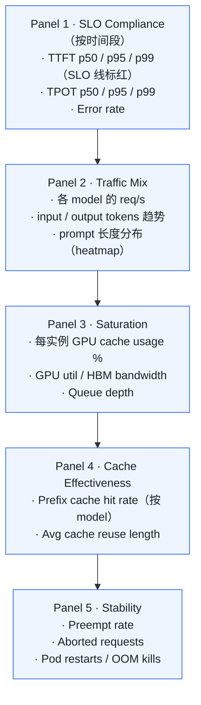

# 05. SLO 与可观测性：怎么"知道你的 LLM 服务好不好"

> **谁该读这一篇？** 负责定义 LLM 服务 SLO、搭建 metrics/log/trace 体系的 SRE / 可观测性工程师。
>
> **前置阅读：** [`02-architecture.md`](../01-overview/02-architecture.md)、[`04-autoscaling-and-capacity.md`](./04-autoscaling-and-capacity.md)
>
> **耗时：** 约 30 分钟
>
> **学完能：**
> 1. 区分 TTFT / TPOT / TTLT / Throughput 四类 SLI，并按业务场景定 p99 SLO
> 2. 把所有 vLLM metric 归到 4 大金信号（Latency/Traffic/Errors/Saturation）
> 3. 写出生产必看的 5-10 条 PromQL 与 dashboard 面板
> 4. 用 OTel trace 直接定位 TTFT/TPOT 突增的根因

一个 LLM 推理服务"挂了"不像 web 服务那样明显——常常是延迟悄悄上升、token 输出变慢、用户体验下滑。没好的 observability，你只会从用户投诉得知。本节讲清楚 LLM 的 SLO 模型、4 大金信号、metric/log/trace 实战。

---

## 1. LLM 的 4 个核心 SLI（不是 1 个！）

通用服务讲 latency / availability。LLM 至少要分 4 个：

| 指标       | 全称                          | 含义                          | 谁关心        |
| -------- | --------------------------- | --------------------------- | ---------- |
| **TTFT** | Time To First Token         | 从请求发出到第一个 token 返回         | 用户感知响应快慢   |
| **TPOT** | Time Per Output Token       | 之后每个 token 的间隔（也叫 ITL）     | 用户感知输出流畅度  |
| **TTLT** | Time To Last Token          | 总时长（= TTFT + tokens × TPOT）| API 调用方超时计 |
| **Throughput** | tokens/sec, requests/sec | 吞吐                            | 容量规划       |

记住这张图：

```mermaid
gantt
    title 单个请求的时间线
    dateFormat X
    axisFormat %s

    section 时间轴
    TTFT (Time To First Token)   :a, 0, 200
    生成第 1 token                 :milestone, after a, 0
    decode token (TPOT × N)       :b, after a, 800
    末 token                       :milestone, after b, 0
```



TTLT = TTFT + (输出 token 数 - 1) × TPOT。

---

## 2. SLO 怎么定？（按业务场景）

| 场景 | TTFT (p99) | TPOT (p99) | TTLT (p99) |
| --- | --- | --- | --- |
| e-commerce 客服 | ≤ 200 ms | ≤ 50 ms | ≤ 5 s |
| 聊天 chatbot | ≤ 500 ms | ≤ 50 ms | ≤ 30 s |
| RAG 长文档 | ≤ 300 ms | ≤ 100 ms | ≤ 3 s |
| agent 工具调用 | ≤ 800 ms | ≤ 80 ms | ≤ 20 s |
| batch 摘要 | n/a | n/a | ≤ 120 s |
| 代码补全 | ≤ 100 ms | ≤ 30 ms | ≤ 3 s |

这些只是参考。**最重要的是定 p99 / p99.9，不是 p50**。

### 为什么死磕 p99？
LLM 推理延迟是经典 "tail at scale" 问题：

- 大部分请求都不错
- 但 1% 的请求碰上 GC、preempt、KV 不够等，延迟可能 10×
- 用户对 worst case 体验最敏感

p99 是你向产品 commitable 的数字。p50 没什么用。

### 报错率 SLO
- `5xx error rate < 0.1%`
- `timeout rate < 0.5%`
- `model output empty rate < 0.01%`（结构化输出场景）

---

## 3. 4 大金信号（Google SRE 风格）

把所有 LLM metric 归类到这 4 个，不会乱：

### 3.1 Latency（延迟）
- `vllm:time_to_first_token_seconds` (histogram) → TTFT
- `vllm:time_per_output_token_seconds` (histogram) → TPOT
- `vllm:e2e_request_latency_seconds` → TTLT
- gateway 端的 HTTP request_duration_seconds（含网络）

### 3.2 Traffic（流量）
- `vllm:request_success_total` / `vllm:request_failed_total`
- `vllm:prompt_tokens_total` / `vllm:generation_tokens_total`
- `vllm:num_requests_running` / `vllm:num_requests_waiting`

### 3.3 Errors（错误）
- HTTP 5xx rate
- `vllm:num_aborted_requests_total`（客户端断开）
- timeout 比例
- `vllm:num_preemptions_total`（增速过快 = KV 压力）

### 3.4 Saturation（饱和度）
- `vllm:gpu_cache_usage_perc`（最关键的饱和度信号）
- `vllm:gpu_prefix_cache_hit_rate`
- `DCGM_FI_DEV_GPU_UTIL`（GPU util）
- `DCGM_FI_DEV_MEM_COPY_UTIL`（HBM 带宽利用）
- `node_load1`（CPU）

---

## 4. metric 实战：vLLM 暴露了什么

打 `/metrics` 你会看到几十个 `vllm:*`。挑生产必看的：

```promql
# === 业务层 SLI ===
histogram_quantile(0.99, sum(rate(vllm:time_to_first_token_seconds_bucket[5m])) by (le, model))
histogram_quantile(0.99, sum(rate(vllm:time_per_output_token_seconds_bucket[5m])) by (le, model))
histogram_quantile(0.99, sum(rate(vllm:e2e_request_latency_seconds_bucket[5m])) by (le))

# === 吞吐 ===
sum(rate(vllm:prompt_tokens_total[1m]))      # input tokens/s
sum(rate(vllm:generation_tokens_total[1m]))  # output tokens/s
sum(rate(vllm:request_success_total[1m]))    # successful req/s

# === 饱和度 ===
avg(vllm:gpu_cache_usage_perc) by (instance)
avg(vllm:gpu_prefix_cache_hit_rate) by (instance)

# === 调度健康 ===
sum(vllm:num_requests_running) by (model)
sum(vllm:num_requests_waiting) by (model)
sum(rate(vllm:num_preemptions_total[5m])) by (instance)

# === Scheduler ===
histogram_quantile(0.99, rate(vllm:iteration_tokens_total_bucket[5m]))
histogram_quantile(0.99, rate(vllm:request_queue_time_seconds_bucket[5m]))

# === 投机解码（开了才有）===
vllm:spec_decode_num_accepted_tokens_total / vllm:spec_decode_num_draft_tokens_total
   ↑ 接受率
```

---

## 5. Dashboard 必备的 5 个面板

Grafana 一打开应该看到这五个东西，其他都是补充：



---

## 6. 分布式 Tracing：OpenTelemetry 怎么用

vLLM 集成了 OpenTelemetry。启动参数：

```bash
vllm serve <model> \
    --otlp-traces-endpoint http://otel-collector:4317
```

每个请求会产生 span：

```mermaid
gantt
    title trace_id 7f3a... · 单请求 span 时间线
    dateFormat X
    axisFormat %s ms

    section Edge
    gateway.handle_request    :a, 0, 3
    gateway.auth_check        :b, 1, 1
    extproc.epp.pick_endpoint :c, 2, 1
    mesh.istio_forward        :d, 3, 1
    section vLLM Pod 7
    engine.add_request        :e, 4, 1
    scheduler.queue_wait      :f, 4, 46
    model.prefill             :g, 50, 150
    sampler.first_token (TTFT):milestone, after g, 0
    model.decode_step (×N)    :h, 200, 2850
    engine.finish             :milestone, 3050, 0
    section Edge
    gateway.response_complete :i, 3050, 5
```



**任何一个 span 异常**（queue_wait 大、prefill 慢、decode 间隔大）都能直接定位。

---

## 7. Logging：不是越多越好

LLM Pod 的 INFO log 量大（每步可能几 KB）。生产建议：

| 级别       | 内容                                | 采样率   |
| -------- | --------------------------------- | ----- |
| ERROR    | 异常、preempt、OOM、NCCL fail          | 100%  |
| WARN     | TPOT 偶发抖动、cache hit 跌、单 step 慢 | 100%  |
| INFO     | 启动信息、stat logger（每 5s 一次汇总）       | 100%  |
| DEBUG    | 调度每步、token 写入                     | 0%（生产关）|

**Per-request log 不要打全 prompt**：①隐私敏感 ②单条 log 几十 KB。
要打就脱敏 + 截断（前 100 字符）。

结构化 log 用 JSON，便于 Loki / Elasticsearch 检索。

---

## 8. 关键告警

告警宁缺勿滥。我列一份"必须有"的：

| 告警                           | 触发条件                            | 严重度 |
| ---------------------------- | ------------------------------- | --- |
| TTFT p99 超 SLO              | 持续 5 分钟                         | P1  |
| TPOT p99 超 SLO              | 持续 5 分钟                         | P1  |
| 5xx error rate > 1%          | 持续 1 分钟                         | P1  |
| Pod restart 异常             | 任一 vLLM Pod 1h 内重启 > 3 次       | P1  |
| Preempt 率突增              | rate(preemptions) > 0 持续 10 分钟  | P2  |
| Prefix cache hit rate 跌     | < 50%（chat workload），持续 30 分钟 | P3  |
| GPU memory util 不稳         | gpu_cache_usage_perc 抖动 > 0.5  | P3  |
| Inference Pod 失联          | scrape failed > 30s             | P2  |
| Queue depth 持续高          | num_requests_waiting > 10 持续 5m | P2  |

注意：**TTFT/TPOT 飙升时，先看 cache hit + preempt + queue 三件套**，多半是其中之一。

---

## 9. 生产坑：观测自己也会成为瓶颈

观测看似免费，但有坑：

### 9.1 metric 维度爆炸
按 user_id / request_id 打 metric → 高基数（high cardinality），Prometheus 内存爆。
原则：**业务标签不进 metric label**。用 log + trace 关联。

### 9.2 OTel trace 采样
高 QPS 下全量采样不现实。采样策略：

- 头部采样：random 1%
- 尾部采样：先采全，最后看是否慢/错决定丢不丢
- 关键路径采样：error / 慢请求 100% 留下，正常 1%

### 9.3 log 收集 sidecar 抢 CPU
Fluent-bit / Filebeat 在 LLM Pod 上抢 CPU 会让 Python 调度变慢。Pod 设 `cpuset` 隔离观测进程。

### 9.4 Prometheus scrape 失败
LLM Pod 启动慢，metrics endpoint 几分钟才 ready。scrape 在那期间 down，看起来像故障。
解决：用 `up` metric 区分"启动中"和"故障"。

---

## 10. SLO 仪表盘示例（PromQL）

把这套查询贴 Grafana 直接用：

```promql
# TTFT SLO compliance (期望 < 500ms)
1 - (
  rate(vllm:time_to_first_token_seconds_bucket{le="0.5"}[5m]) /
  rate(vllm:time_to_first_token_seconds_count[5m])
)
# 越接近 0 越好。1 - 0.001 = 99.9% 在 SLO 内

# Error budget burn rate (1-hour vs 30-day)
# 30-day SLO 99.9% → budget 0.1%
# 如果 1h error rate > 0.1% × 24 × 30 / 1 = 7.2x burn → 报警
(
  rate(vllm:request_failed_total[1h]) /
  rate(vllm:request_total[1h])
) > (0.001 * 24 * 30)

# Top noisy users (高 QPS 用户)
topk(10, sum by (user_id) (rate(vllm_gateway_request_total[5m])))
```

---

## 11. 模型质量监控（LLM 特有）

LLM 还有一类质量指标，传统服务没有：

- **输出长度分布**：突然变短可能模型问题
- **EOS 命中率**：突然降 = 模型迷失了
- **格式合规率**：JSON 模式下输出能不能解析
- **拒答率**：被安全策略拦截的比例
- **用户反馈**：thumbs up/down，质量 drift 早期信号

这些通常不在 vLLM metric 里，需要在 gateway 或业务层埋点。

---

## 12. 真实场景案例分析

### 案例 1：TTFT p99 突增到 5s
看 trace：

- `queue_wait` 一直 > 2s ← 队列长
- 同时 `num_preemptions_total` 上涨 ← KV 压力
**结论**：流量上来了，KV 不够，请求排队。
**动作**：HPA 阈值降低 / 立即扩容 / 临时上量化。

### 案例 2：TPOT 抖动严重
看 metric：

- `iteration_tokens_total` 单 step 偶发尖峰
**结论**：长 prefill 没切片，混进 decode。
**动作**：调小 `max_num_batched_tokens`，确认 chunked prefill 开。

### 案例 3：prefix cache hit rate 突跌
- 模型升级了？tokenizer 变了？
- 路由策略改了？session 不 sticky 了？
- 流量模式变（用户群体变化）？

需要按变更顺序排查。

---

## 小结

- LLM 的 SLI 至少 4 个：TTFT / TPOT / TTLT / Throughput，错误率和质量类指标也要进 SLO。
- 业务对外承诺用 p99 / p99.9，不要承诺 p50；tail at scale 才是用户感知的真实体验。
- vLLM 的 `gpu_cache_usage_perc`、`num_preemptions_total`、`prefix_cache_hit_rate` 是排障三件套。
- Dashboard 最少 5 个面板：SLO 合规、流量构成、饱和度、cache 效果、稳定性。
- OTel trace 把 gateway → EPP → engine → prefill → decode 串成时间线，是定位 TTFT/TPOT 异常的最快路径。

## 自检

> 答案不必照搬，能讲到关键点即可。

**1. SLO TTFT p99 < 500ms, PromQL 算 "过去 5 分钟落在 SLO 内比例"。**

利用 histogram bucket 算"≤ 500ms 的累积比例"：

```promql
# 方案 A：直接用 le="0.5" bucket（如果有这个边界）
sum(rate(vllm:time_to_first_token_seconds_bucket{le="0.5"}[5m])) by (model_name)
/
sum(rate(vllm:time_to_first_token_seconds_count[5m])) by (model_name)
```

**结果是 0-1 之间的"合规率"**。如果 SLO 是 99%（即 p99 < 500ms 等价于 ≥99% 请求 < 500ms），告警条件：

```promql
(合规率) < 0.99
```

**如果 le 没有正好 0.5 这个 bucket**，方案 B 用 `histogram_quantile` 反查：

```promql
histogram_quantile(0.99,
  sum by (le)(rate(vllm:time_to_first_token_seconds_bucket[5m]))
) < 0.5
```

但 B 不直接给"合规率"，只能判断 p99 是否 < 0.5。

**最佳实践**：启动 vLLM 时配 bucket 包含 SLO 边界（如 `--prometheus-histogram-buckets 0.05,0.1,0.2,0.5,1,2,5`），让方案 A 可用。

---

**2. TPOT 抖动，按什么顺序看 metric？分别排除什么假设？**

**根因树（按检查顺序）**：

```
TPOT p99 抖动
│
├─ 1. vllm:num_preemptions_total       ← 排除 "KV 不够导致 preempt"
│      rate > 0.5/s 表明频繁抢占；
│      抢占触发的请求重新 prefill → TPOT 抖
│
├─ 2. vllm:kv_cache_usage_perc          ← 排除 "KV 接近满"
│      持续 > 0.9 + preempt 不多 = 即将 OOM
│
├─ 3. vllm:iteration_tokens_total       ← 排除 "step token 数不稳定"
│      histogram 尾部重 = 有些 step 算几千 token（长 prefill 没切）
│      其他 step 算几十 token = step 时长方差大 = TPOT 抖
│
├─ 4. vllm:request_queue_time_seconds   ← 排除 "队列积压拖累"
│      不能直接影响 TPOT（在 batch 内的请求不在 queue），但能解释 TTFT 飙
│
├─ 5. vllm:prefix_cache_hit_rate         ← 排除 "cache 命中率下降"
│      命中率掉 = 等效更多 prefill 算力 = step 时长涨 = TPOT 抖
│
├─ 6. nvidia-smi (实时 GPU 状态)         ← 排除 "硬件层异常"
│      ECC error、GPU util 异常低、温度过高（throttling）
│
└─ 7. trace 看 forward span 内部         ← 排除 "kernel 层异常"
       某层突然慢（如某个 attention kernel 异常）
```

**实战**：90% 的 TPOT 抖动 root cause 是 1-3 之一。直接看这三个，不用全跑完。

---

**3. 为什么不能把 `user_id` 当 metric label？正确做法？**

**不能的原因**：

**Prometheus metric label = 笛卡尔积维度**。每多一个 unique label value，metric 就多一个 time series。

- 100 万用户 × 80 个 vllm metric = **8 千万 time series**
- Prometheus 内存爆（每 series ~3KB → 240 GB 内存）
- query 慢得离谱（GROUP BY 上百万 series）
- Cardinality explosion 是 Prometheus 部署最常见的事故

**正确做法**：

| 需求 | 方案 |
| --- | --- |
| 计费（按用户 token 数） | **OpenTelemetry trace** 或 **直接写日志 / Kafka**，由数据仓库（BigQuery / ClickHouse）聚合；不进 metric |
| 用户级 SLO 监控 | 选 **top user**（top 100）作为 label，其他归到 `user_id="other"` |
| 排查某用户问题 | trace 用 `user_id` 作 span attribute（trace 系统支持高基数），按需查询 |
| 用户级限流 | Redis / 内存 counter，不进 Prometheus |

**Prometheus label 选什么**：

- 低基数：`model_name`（< 10 个）、`finished_reason`（< 5 个）、`backend`（< 5 个）、`pod`（< 100 个）
- **绝对不要**：user_id、request_id、prompt（hash 也不行，hash 仍是高基数）

→ **Prometheus 用于聚合趋势，trace / log 用于个体定位**。两套互补。

---

**4. trace 中 `queue_wait` 高 `prefill` 正常，下一步看哪个 metric？**

`queue_wait` 高 = 请求在 waiting queue 里等了很久才被 schedule。下一步看：

**`vllm:num_requests_waiting`**（gauge）

**验证假设**：

- 如果 waiting 也持续高 → 真的是流量超容量，**应该扩容（HPA）**
- 如果 waiting 时高时低（spike）→ 流量突刺，需要更激进的 HPA 或 admission control
- 如果 waiting 低但 queue_wait 仍高 → **`vllm:kv_cache_usage_perc`**——KV 满了，新请求即使被 scheduler"看到"也无法 allocate slot，卡在 waiting

**进一步验证**：

- `rate(vllm:num_preemptions_total[5m])` 高 → 频繁踢人 + 重 admit，导致 queue 抖
- `vllm:num_requests_running` 是否长期低于 max_num_seqs → 如果是，说明不是 batch 满，是 KV 满

**修复路径决策**：

- 单 pod 容量够（waiting 0 spike）→ HPA 扩 pod 数
- 单 pod KV 满 → 调 `--gpu-memory-utilization` 或减 `max_num_seqs`
- workload 突刺导致 → 引入 admission control + rate limit

→ 一个 metric 看完后立刻有下一个具体动作，这是好 metric 设计的标志。

## 下一步

- 下一节：[`06-reliability-and-failure-modes.md`](./06-reliability-and-failure-modes.md)（把观测信号映射到具体故障模式）
- 想看源码：`vllm/v1/metrics/`（metric 定义与 stat logger）、`vllm/tracing.py`
- 想动手：[`07-hands-on/02-trace-a-request.md`](../07-hands-on/02-trace-a-request.md) 把 OTel collector 串到本地 vLLM

---

## Sources

- [Key metrics for LLM inference — LLM Inference Handbook (BentoML)](https://bentoml.com/llm/inference-optimization/llm-inference-metrics)
- [The P99 Problem: Designing LLM Inference for Real Users](https://agentnativedev.medium.com/the-p99-problem-designing-llm-inference-for-real-users-11deb35bb8d4)
- [LLM Observability: A Complete Guide to Monitoring Production Deployments](https://inference.net/content/llm-observability-monitoring-production-deployments/)
- [Metrics That Matter for LLM Inference — Hivenet](https://www.hivenet.com/post/llm-inference-metrics-ttft-tps)
