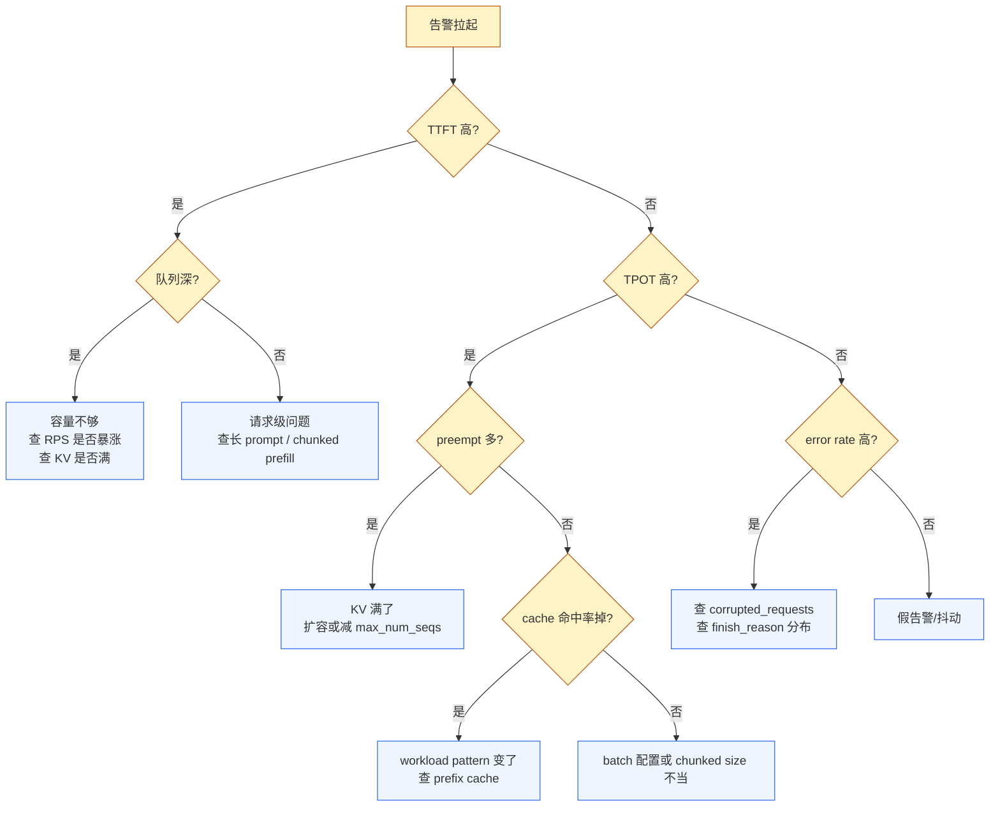

# 08. 监控菜谱：可直接复制的 Prometheus 规则、PromQL、Dashboard 面板

> **谁该读这一篇？** 准备搭 vLLM 生产监控的 SRE / 平台工程师；oncall 要预定义告警规则的同学；已经看完 SLO 章节，需要"动手版"的人。
>
> **前置阅读：** [`05-slo-and-observability.md`](05-slo-and-observability.md)（SLO 模型 + 4 大金信号——本节是它的"动手版"，假设你已经理解 TTFT/TPOT 含义）。
>
> **耗时：** 约 20 分钟。
>
> **学完能：**
> 1. 列出 vLLM 暴露的 30+ 个 Prometheus 指标，按 4 大金信号分桶。
> 2. 直接复制粘贴本节的告警规则 yaml 与 PromQL，部署到自己的 Prometheus。
> 3. 按"延迟 / 容量 / 缓存 / 故障"4 块组织 Grafana dashboard。
> 4. 在 oncall 30 秒内通过 3-5 个核心 panel 判断"系统现在到底怎么了"。

不解释为什么要监控（[`05-slo-and-observability.md`](05-slo-and-observability.md) 已讲）。这章只给**可直接用的工件**。

---

## 1. vLLM 暴露的 Prometheus 指标全表

源码：`vllm/v1/metrics/loggers.py` 的 Gauge/Counter/Histogram 注册。**指标前缀**：`vllm:`

按用途分类：

### 1.1 Latency（histogram）

| Metric | 含义 |
| --- | --- |
| `vllm:time_to_first_token_seconds` | TTFT |
| `vllm:inter_token_latency_seconds` | 相邻 token 间隔（ITL） |
| `vllm:request_time_per_output_token_seconds` | TPOT（per request 聚合） |
| `vllm:e2e_request_latency_seconds` | TTLT（不在上面 grep 出来，但 logger 里有） |
| `vllm:request_queue_time_seconds` | 请求在 WAITING 队列的时间 |
| `vllm:request_prefill_time_seconds` | prefill 阶段时长 |
| `vllm:request_decode_time_seconds` | decode 阶段时长 |
| `vllm:request_inference_time_seconds` | inference 总时长 |

### 1.2 Traffic / Throughput

| Metric | 含义 |
| --- | --- |
| `vllm:num_requests_running` (gauge) | 当前 running 请求数 |
| `vllm:num_requests_waiting` (gauge) | 当前等待请求数 |
| `vllm:num_requests_waiting_by_reason` (gauge) | 按等待原因分桶（KV/encoder/...） |
| `vllm:prompt_tokens` (counter) | 累计 prompt token 数 |
| `vllm:prompt_tokens_by_source` (counter) | 按来源（user/template 等）分 |
| `vllm:prompt_tokens_cached` (counter) | 由 prefix cache 命中的 prompt token |
| `vllm:generation_tokens` (counter) | 累计 generated token 数 |
| `vllm:iteration_tokens_total` (histogram) | 每次 engine step 处理的 token 数分布 |
| `vllm:request_success` (counter) | 按 `finish_reason` 分桶（stop/length/abort/...） |

### 1.3 Saturation（资源压力）

| Metric | 含义 |
| --- | --- |
| `vllm:kv_cache_usage_perc` (gauge) | KV cache 占用率（0-1） |
| `vllm:num_preemptions` (counter) | 累计抢占次数 |
| `vllm:engine_sleep_state` (gauge) | 引擎睡眠状态（多副本 elastic 用） |

### 1.4 Cache 命中

| Metric | 含义 |
| --- | --- |
| `vllm:prefix_cache_queries` (counter) | prefix cache 查询次数（按 block 计） |
| `vllm:prefix_cache_hits` (counter) | prefix cache 命中次数 |
| `vllm:external_prefix_cache_queries` (counter) | 外部（LMCache 等）查询次数 |
| `vllm:external_prefix_cache_hits` (counter) | 外部命中次数 |
| `vllm:mm_cache_queries` (counter) | 多模态 encoder cache 查询 |
| `vllm:mm_cache_hits` (counter) | 多模态 encoder cache 命中 |

### 1.5 KV block 生命周期（histogram，需开启 `--enable-kv-cache-events` 或相关）

| Metric | 含义 |
| --- | --- |
| `vllm:kv_block_lifetime_seconds` | block 从分配到回收的存活时间 |
| `vllm:kv_block_idle_before_evict_seconds` | block 空闲多久被踢 |
| `vllm:kv_block_reuse_gap_seconds` | 同一 hash block 两次复用间隔 |
| `vllm:request_prefill_kv_computed_tokens` | prefill 实算（未命中）的 token |

### 1.6 故障

| Metric | 含义 |
| --- | --- |
| `vllm:corrupted_requests` (counter) | 因 KV / 状态损坏被 fail 的请求 |

### 1.7 配置 / Info

| Metric | 含义 |
| --- | --- |
| `vllm:cache_config_info` (gauge) | block_size / num_blocks 等配置 |
| `vllm:lora_requests_info` (gauge) | 当前激活 LoRA 数 |
| `vllm:request_prompt_tokens` (histogram) | 单请求 prompt 长度分布 |
| `vllm:request_generation_tokens` (histogram) | 单请求 generation 长度分布 |
| `vllm:request_max_num_generation_tokens` (histogram) | 最大 generation token |
| `vllm:request_params_n` (histogram) | 请求 `n` 参数分布 |
| `vllm:request_params_max_tokens` (histogram) | 请求 `max_tokens` 分布 |

---

## 2. 必备的 PromQL 公式（直接抄走）

### 2.1 SLO 公式

```promql
# TTFT p99，按 model 维度
histogram_quantile(0.99,
  sum by (model_name, le) (
    rate(vllm:time_to_first_token_seconds_bucket[5m])
  )
)

# TPOT p99
histogram_quantile(0.99,
  sum by (model_name, le) (
    rate(vllm:request_time_per_output_token_seconds_bucket[5m])
  )
)

# 错误率（按 finish_reason）
sum by (model_name) (rate(vllm:request_success_total{finished_reason="abort"}[5m]))
/
sum by (model_name) (rate(vllm:request_success_total[5m]))
```

### 2.2 容量公式

```promql
# 队列深度 p95（waiting 数的 5min p95）
quantile_over_time(0.95, vllm:num_requests_waiting[5m])

# KV cache 利用率（瞬时）
vllm:kv_cache_usage_perc

# 抢占速率（每秒抢占次数）
rate(vllm:num_preemptions_total[5m])

# 每 step 平均 token 数（GPU 利用率代理）
histogram_quantile(0.5,
  sum by (le) (rate(vllm:iteration_tokens_total_bucket[5m]))
)

# 吞吐：generated token / 秒
sum by (model_name) (rate(vllm:generation_tokens_total[1m]))
```

### 2.3 Prefix cache 命中

```promql
# Block-level 命中率（5min 滑动）
sum by (model_name) (rate(vllm:prefix_cache_hits_total[5m]))
/
sum by (model_name) (rate(vllm:prefix_cache_queries_total[5m]))

# Token-level 节省比例
sum(rate(vllm:prompt_tokens_cached_total[5m]))
/
sum(rate(vllm:prompt_tokens_total[5m]))
```

### 2.4 多副本 / DP 健康度

```promql
# 实例间 QPS 偏差（max / min）
max(rate(vllm:request_success_total[1m])) by (model_name)
/
min(rate(vllm:request_success_total[1m])) by (model_name)

# 单实例 KV 利用率比集群中位数高 30%（routing 不均）
vllm:kv_cache_usage_perc
> on(model_name) (1.3 * quantile by(model_name)(0.5, vllm:kv_cache_usage_perc))
```

---

## 3. 告警规则（Prometheus YAML，直接复制）

```yaml
groups:
- name: vllm-slo
  interval: 30s
  rules:
  - alert: VLLMTTFTHigh
    expr: |
      histogram_quantile(0.99,
        sum by (model_name, le) (rate(vllm:time_to_first_token_seconds_bucket[5m]))
      ) > 1.0
    for: 5m
    labels:
      severity: warning
    annotations:
      summary: "TTFT p99 > 1s for {{ $labels.model_name }}"
      description: "Sustained 5 minutes. Check: queue depth, KV pressure, GPU sat."

  - alert: VLLMTPOTHigh
    expr: |
      histogram_quantile(0.99,
        sum by (model_name, le) (rate(vllm:request_time_per_output_token_seconds_bucket[5m]))
      ) > 0.1
    for: 5m
    labels:
      severity: warning
    annotations:
      summary: "TPOT p99 > 100ms for {{ $labels.model_name }}"

  - alert: VLLMAbortRateHigh
    expr: |
      sum by (model_name) (rate(vllm:request_success_total{finished_reason="abort"}[5m]))
      / sum by (model_name) (rate(vllm:request_success_total[5m]))
      > 0.01
    for: 10m
    labels:
      severity: critical
    annotations:
      summary: "Abort rate > 1% on {{ $labels.model_name }}"

- name: vllm-capacity
  interval: 30s
  rules:
  - alert: VLLMQueueDepthHigh
    expr: vllm:num_requests_waiting > 50
    for: 3m
    labels:
      severity: warning

  - alert: VLLMKVCacheNearFull
    expr: vllm:kv_cache_usage_perc > 0.9
    for: 5m
    labels:
      severity: warning
    annotations:
      summary: "KV cache > 90% on {{ $labels.instance }}"
      description: "Preemptions likely. Scale out or reduce max_num_seqs."

  - alert: VLLMPreemptionsSpiking
    expr: rate(vllm:num_preemptions_total[5m]) > 0.5
    for: 5m
    labels:
      severity: warning
    annotations:
      summary: "Preempt rate > 0.5/s on {{ $labels.instance }}"

  - alert: VLLMIdleNoTraffic
    expr: |
      rate(vllm:request_success_total[10m]) == 0
      and vllm:engine_sleep_state == 0
    for: 15m
    labels:
      severity: info
    annotations:
      summary: "{{ $labels.instance }} has had no traffic in 15min but is awake"

- name: vllm-cache
  interval: 60s
  rules:
  - alert: VLLMPrefixCacheHitDrop
    expr: |
      (
        sum by (model_name) (rate(vllm:prefix_cache_hits_total[10m]))
        / sum by (model_name) (rate(vllm:prefix_cache_queries_total[10m]))
      ) < 0.3
    for: 30m
    labels:
      severity: info
    annotations:
      summary: "Prefix cache hit < 30% for 30min on {{ $labels.model_name }}"
      description: "Workload pattern shifted? Block size? Cache evicted?"

- name: vllm-failure
  rules:
  - alert: VLLMCorruptedRequests
    expr: increase(vllm:corrupted_requests_total[10m]) > 0
    labels:
      severity: critical
    annotations:
      summary: "Corrupted requests detected on {{ $labels.instance }}"
      description: "KV cache integrity failure. Check NCCL / disaggregated path."

  - alert: VLLMScrapeDown
    expr: up{job="vllm"} == 0
    for: 2m
    labels:
      severity: critical
```

部署：保存为 `vllm-rules.yml`，引入 Prometheus 的 `rule_files`。

---

## 4. Grafana Dashboard 骨架（4 行 12 panel）

| 行 | Panel | PromQL |
| --- | --- | --- |
| **行 1 · SLO** | TTFT p50/p90/p99 多折线 | 上面 §2.1 |
|  | TPOT p50/p90/p99 多折线 | 上面 §2.1 |
|  | Error rate（堆叠面积） | abort / length / stop 分桶 |
| **行 2 · Throughput** | Generated token/s | `rate(vllm:generation_tokens_total[1m])` |
|  | RPS（按 finish_reason 堆叠） | `rate(vllm:request_success_total[1m])` |
|  | iteration tokens histogram（heatmap） | `vllm:iteration_tokens_total_bucket` |
| **行 3 · Capacity** | Running vs Waiting（双线） | gauge |
|  | KV cache 利用率（gauge / instant） | `vllm:kv_cache_usage_perc` |
|  | Preemption rate | `rate(vllm:num_preemptions_total[5m])` |
| **行 4 · Cache** | Prefix cache 命中率（block / token 两线） | §2.3 |
|  | MM cache 命中率 | hits / queries |
|  | KV block lifetime p50/p99 | `vllm:kv_block_lifetime_seconds_bucket` |

**关键设计原则：**

- 默认 5min 时间窗、按 model_name 维度 group（多模型一份 dashboard）
- 用 **Repeat by instance** 实现多 GPU pod 切换
- 颜色统一：错误红、延迟黄、容量蓝、cache 绿

---

## 5. Oncall 30 秒清单

被告警拉起后，**按顺序看这 5 个 panel**：

```
1. "TTFT p99 是不是飙了？"        → SLO 行第 1 panel
2. "TPOT p99 是不是飙了？"        → SLO 行第 2 panel
3. "队列是不是积压了？"           → Capacity 行第 1 panel
4. "KV 满了吗？preempt 多吗？"    → Capacity 行第 2/3 panel
5. "scrape 还在吗？"             → grafana 顶部 + Prometheus targets
```

按这 5 个的状态走根因树：



---

## 6. 把 metric 接到云厂商监控

vLLM 默认在 `/metrics` 暴露 Prometheus 格式：

```bash
# 标准 Prometheus scrape config
- job_name: vllm
  scrape_interval: 15s
  static_configs:
    - targets: ['vllm-pod-1:8000', 'vllm-pod-2:8000', ...]
  # 或者用 kubernetes_sd_configs 自动发现
```

**云厂商接入：**

- **AWS CloudWatch**: 通过 OTel Collector + CloudWatch exporter
- **GCP**: GCP Managed Service for Prometheus 直接 scrape
- **Datadog**: Datadog Agent 配 OpenMetrics check 抓 `/metrics`
- **阿里云 ARMS**: Prometheus 监控直接接入

**OpenTelemetry trace（更细粒度）**：

- 开启：`--otlp-traces-endpoint <collector>`
- 源码：`vllm/tracing.py` 暴露每个 request 的 span（含 prefill / decode / sampling）
- 适合追"这一个请求为什么慢"——配合 metric 看"宏观趋势"

---

## 7. 推荐的最小可用监控栈

```yaml
# docker-compose.yml（开发/测试用）
services:
  prometheus:
    image: prom/prometheus:latest
    volumes:
      - ./prometheus.yml:/etc/prometheus/prometheus.yml
      - ./vllm-rules.yml:/etc/prometheus/vllm-rules.yml
    ports: ["9090:9090"]

  grafana:
    image: grafana/grafana:latest
    ports: ["3000:3000"]
    environment:
      - GF_AUTH_ANONYMOUS_ENABLED=true
    volumes:
      - ./grafana-dashboards:/var/lib/grafana/dashboards
      - ./grafana-provisioning:/etc/grafana/provisioning

  alertmanager:
    image: prom/alertmanager:latest
    ports: ["9093:9093"]

  vllm:
    image: vllm/vllm-openai:latest
    command: --model facebook/opt-125m --port 8000
    ports: ["8000:8000"]
```

```yaml
# prometheus.yml
global:
  scrape_interval: 15s
  evaluation_interval: 30s

rule_files:
  - vllm-rules.yml

alerting:
  alertmanagers:
    - static_configs:
        - targets: ['alertmanager:9093']

scrape_configs:
  - job_name: vllm
    static_configs:
      - targets: ['vllm:8000']
```

启动：`docker-compose up -d` → Grafana http://localhost:3000，加 Prometheus 数据源 `http://prometheus:9090`，导入 §4 的 dashboard。

---

## 8. 已知陷阱

| 陷阱 | 怎么发现 | 怎么避免 |
| --- | --- | --- |
| histogram bucket 默认值不适合长尾 | TTFT p99 永远落在最高 bucket | 调 `--prometheus-histogram-buckets` |
| 标签维度爆炸（per-request labels） | Prometheus 内存 OOM | 不要给 metric 加 `request_id`、按 model_name + finish_reason 即可 |
| metric reset on restart | counter 增长突然回 0 | 用 `increase()` 而非 `rate()` 的差值，或在 PromQL 用 `resets()` |
| 多副本下 `vllm:kv_cache_usage_perc` 平均掩盖热点 | 单副本可能 100% 但平均 60% | 看 `max by (instance)` 或开 instance label |
| 没区分 model_name | 多模型部署混在一起 | 启动加 `--served-model-name <name>`，metric 自带 label |

---

## 小结

- vLLM 暴露 30+ 个 `vllm:*` 指标，分 7 类（latency / traffic / saturation / cache / kv lifecycle / failure / info）。
- 4 大 SLO 必看：TTFT p99、TPOT p99、abort rate、queue depth。
- 给出可直接复制的 8 条核心告警规则（YAML）和 12 panel 的 dashboard 骨架。
- Oncall 30 秒按 5 panel 顺序看 + 用根因树定位。
- 接云厂商监控通过 OTel 或厂商专属 Prometheus 服务。

## 自检

1. 写出"prefix cache 命中率（按 token 计）"的 PromQL，结果应是 0-1 之间的比例。
2. 一个 32-pod 集群中某个 pod `kv_cache_usage_perc=0.95`，其他 0.4 左右。哪条告警会触发？还应该查什么 metric？
3. `histogram_quantile` 算 TTFT p99 持续返回最高 bucket 值，说明什么？怎么修？
4. 给一个"oncall 早晨拿到 TTFT 飙到 3s 的告警"的场景，按 §5 根因树写出排查命令链。

## 下一步

- 想理解为什么这样定 SLO：[`05-slo-and-observability.md`](05-slo-and-observability.md)（理论层）。
- 想理解 metric 怎么从代码注入：`vllm/v1/metrics/loggers.py`（Prometheus 注册）、`vllm/v1/metrics/stats.py`（统计聚合）。
- 想做端到端 trace：`vllm/tracing.py` + OTel 全栈。
- 想看真实故障 case 怎么用监控定位：[`07-incident-playbook.md`](07-incident-playbook.md)（8 个真实事故）。
- 想做容量规划：[`04-autoscaling-and-capacity.md`](04-autoscaling-and-capacity.md)。
