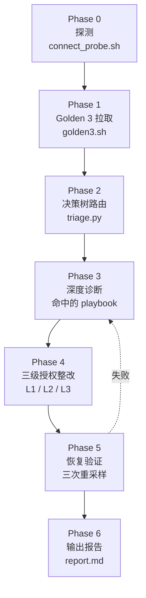

# 09. 把 playbook 编成 agent：vllm-doctor skill

> **谁该读这一篇？** SRE / 平台工程师；想把 §06-08 的人工流程交给 agent 自动跑、又不想被它误伤生产的人。
>
> **前置阅读：** [`05-slo-and-observability.md`](./05-slo-and-observability.md)、[`06-reliability-and-failure-modes.md`](./06-reliability-and-failure-modes.md)、[`07-incident-playbook.md`](./07-incident-playbook.md)、[`07-hands-on/04-profiling-and-debugging.md`](../07-hands-on/04-profiling-and-debugging.md)
>
> **耗时：** 约 30 分钟
>
> **学完能：**
> 1. 说清"为什么 runbook 要升级成 skill"以及边界在哪
> 2. 读懂 7 阶段工作流，把 §07 的 8 个 case 一一对应到 8 个 playbook
> 3. 在没有真实集群的情况下用 fixture mode 完整跑一遍
> 4. 自己往 skill 里加一条新 playbook（扩展模板）

§07-incident-playbook 给了 8 个真实案例，每个都按"症状 → 诊断 → 整改 → 长期"四段写。问题是：on-call 凌晨 3 点收到告警，理论上要照着文档敲 PromQL、跑 kubectl、改 env、滚 deployment——实操中，第 1 步往往就卡 5 分钟。`vllm-doctor` 就是为这一刻设计的：把这 8 个 playbook 编成一份 agent 可执行的 SOP，让 Claude Code 自己跑完探测、决策、整改、验证、报告。

---

## 1. 为什么把 playbook 升级为 skill

文档型 runbook 的三个老问题：

- **找得慢**：on-call 不熟某类故障时，要先翻索引才知道走哪条 case。
- **跑得慢**：每条 PromQL 都得人手粘到 Grafana 或 curl，每个 kubectl 都得想清楚参数。
- **回滚没人记**：紧急改了 env，3 小时后没人记得改回来。

skill 解决方案是三件套：

| 资产 | skill 里的对应物 | 解决的问题 |
| --- | --- | --- |
| 决策树（§07-04 第 511-551 行） | `scripts/triage.py` | 自动按 Golden 3 指标路由到 playbook |
| 命令模板（散落在 §06-§07 各处） | `scripts/golden3.sh` / `kv_pressure_diag.sh` / `nccl_diag.sh` / `remediate_*.sh` | 一键拉指标、抓证据、执行整改 |
| 上线前 checklist（§06 第 293-311 行） | `reference/checklist-prelaunch.md` | 防患于未然 |

**关键约束**：skill **不是 ChatOps bot**——它跑在你本地的 Claude Code 会话里，用你的 kubeconfig，受 Claude Code 的工具权限管理。不会主动改生产，所有 L3（高破坏性）动作都会用 `AskUserQuestion` 弹确认。

---

## 2. 7 阶段工作流总览



每个 Phase 对照表：

| Phase | skill 文件 | 对应 notebook 章节 |
| --- | --- | --- |
| 0 探测 | `scripts/connect_probe.sh` | — |
| 1 拉指标 | `scripts/golden3.sh` + `reference/promql-cheatsheet.md` | §05 (§3 4 大金信号) |
| 2 决策 | `scripts/triage.py` | §07-hands-on/04 (L511-551) |
| 3 深度诊断 | `playbooks/<id>.md` 中的 Triage Commands 节 | §07-incident-playbook |
| 4 整改 | `scripts/remediate_<id>.sh` | §06 (§7 速查表) + §07 各 case |
| 5 验证 | `triage.py --verify` | — |
| 6 报告 | agent 写 `$INCIDENT_DIR/report.md` | — |

> **触发前置条件**：vLLM Pod 已经 Running 且接好 Prometheus；本机能 `kubectl exec` 进去。如果只是想做配置审查、不是真排障，看 `reference/checklist-prelaunch.md` 即可，不用触发 skill。

---

## 3. 决策树：Golden 3 → 8 个 playbook

§07-04 已经给出 30 秒决策树原型。skill 把它写成可执行的 Python：

```
TTFT_p99 > SLO?
├ YES → queue > 50?
│       ├ YES → KV ≥ 0.95? → playbook 03 (gpu-oom)
│       │       否则        → playbook 01 (preempt-cascade)
│       └ NO  → KV ≥ 0.9? → 01 ;  否则 → 06 (cold-start)
├ NO  → throughput ≈ 0 AND running > 0 → playbook 02 (nccl-hang)
        → prefix_cache_hit < 0.5     → 05 (cache regression)
        → request_failed > 0.1/s     → 04 (retry storm)
        → format_compliance < 0.9    → 07 (output quality)
```

8 个 playbook 的命中条件速查：

| ID | 名称 | 主要触发条件 | 排除项 |
| --- | --- | --- | --- |
| 01 | preempt-cascade | KV≥0.9 + preempt≥0.5/s（或 TTFT 高+queue 高） | OOMKilled → 03；throughput=0 → 02 |
| 02 | nccl-hang | throughput≈0 AND running>0 持续 60s+ | running=0 不算（没流量） |
| 03 | gpu-oom | KV≥0.95 + queue/preempt 高，或 OOMKilled exit 137 | CPU OOM 走容器 memory limit |
| 04 | retry-storm | request_failed_rate>0.1/s 且 KV 不算高 | KV 也高 → 真过载，走 01 |
| 05 | cache-hit-regression | prefix_cache_hit<0.5 | 单 pod 重启后短暂回落属正常 |
| 06 | cold-start | TTFT 高但 KV/queue 都低，running 少 | 70B+ 模型本来就 5-10 min |
| 07 | output-quality | format_compliance<0.9 或 thumbs-down 突增 | 客户端 prompt 变了 → 不是 vLLM 问题 |
| 08 | lora-thrash | LoRA loading_seconds_count 飙升 + 切换时 TTFT 尖刺 | 单 LoRA 单租户无此问题 |

**Dry-run 验证表**（skill 自带 7 个 fixture，路由结果如下）：

| Fixture | KV | preempt | throughput | running | cache_hit | format | 命中 playbook | 备选 |
| --- | --- | --- | --- | --- | --- | --- | --- | --- |
| 1 抢占级联 | 0.95 | 0.6 | 100 | 50 | 0.8 | 1.0 | **03-gpu-oom** | 01-preempt-cascade |
| 2 NCCL hang | 0.5 | 0 | 0 | 8 | 0.8 | 1.0 | **02-nccl-hang** | — |
| 3 冷启动 | 0.3 | 0 | 5 | 2 | 0.7 | 1.0 | **06-cold-start** | — |
| 4 cache 塌方 | 0.6 | 0 | 200 | 20 | 0.3 | 1.0 | **05-cache-hit-regression** | — |
| 5 retry storm | 0.6 | 0 | 100 | 10 | 0.8 | 1.0（failed=0.5） | **04-retry-storm** | — |
| 6 输出质量 | 0.5 | 0 | 100 | 10 | 0.8 | 0.6 | **07-output-quality** | — |
| 7 健康 | 0.5 | 0 | 100 | 10 | 0.8 | 1.0 | **none** | — |

> 注意 fixture 1：KV=0.95 同时触发"高位 OOM 边缘"和"抢占级联"两条规则。`triage.py` 选信心更高的 `03-gpu-oom`，把 `01-preempt-cascade` 列为 alternative。报告里两条都会出现，给人审视。

兜底：`confidence < 0.5` → skill 不会强行进 playbook，而是把 Golden 3 截图给用户、建议人工核对客户端日志或开 OTel trace。

---

## 4. 三级整改授权（L1 / L2 / L3）

agent 不应该所有动作都问、也不应该一条都不问。`vllm-doctor` 把整改动作按破坏力分三级：

| 级别 | 例子 | 授权策略 | 必做记录 |
| --- | --- | --- | --- |
| **L1** 只读 / 旁路 | `kubectl describe`、`py-spy dump`、抓证据 | 直接做 | 输出归档到 `$INCIDENT_DIR/evidence/` |
| **L2** 受控扰动 | 改 env（`MAX_NUM_SEQS`）、调 gateway rate limit、`kubectl scale` | 直接做 | `actions.log` 落 command + **rollback command** |
| **L3** 高破坏性 | `kubectl delete pod -l <lws>`、`taint node`、`rollout undo` | 单条 `AskUserQuestion` 弹确认（含 blast radius 说明） | 同上 |

### 三个典型决策

**A · 抢占级联**：L2 是 `kubectl set env deploy/vllm MAX_NUM_SEQS=32`（直接做，记 rollback `MAX_NUM_SEQS-`）；L3 是 `kubectl rollout restart deploy/vllm`（必须问，理由"所有 replica 滚动重启，期间整体容量临时下降"）。

**B · NCCL hang**：L3 是 `kubectl delete pods -l leaderworkerset.sigs.k8s.io/group-key=<group>` —— **必须整组重启，不是单 pod**。NCCL group 跨 rank，只删一个会让剩下 N-1 个继续等死锁；而整组同时重启会重新建立 collective communicator。这是 skill 设计里和直觉相反、必须写进 playbook 的细节。

**C · 整改没有回滚**：扩 replica 是 L2，回滚是 L3（缩回去会重新引发抢占）。这种情况 `remediate_<id>.sh` 在 `rollback:` 字段直接写 `(none — 缩回去会重新引发抢占)`，agent 不会自动回退。

---

## 5. 端到端演示：以"抢占级联"为例

走一遍真实 incident 流程（用 fixture mode 模拟，所有命令在 README 安装完 skill 后都能复现）：

### Step 1 · 触发

```bash
export VLLM_NAMESPACE=vllm
export PROM_URL=http://prom.example:9090
# 在 Claude Code：/vllm-doctor
```

### Step 2 · Phase 0 探测输出

```json
{
  "ts": "2026-05-29T03:11:00Z",
  "kubectl_context": "ok",
  "namespace": "vllm",
  "pods": "ok",
  "pod_count": 6,
  "prom": "ok",
  "gpu": "ok",
  "gpu_count": 8
}
```

### Step 3 · Phase 1 Golden 3

```json
{
  "ttft_p99_ms": 9000,
  "queue": 80,
  "kv_usage": 0.95,
  "throughput": 100,
  "running": 50,
  "prefix_cache_hit_rate": 0.8,
  "preempt_rate_per_sec": 0.6,
  "request_failed_rate": 0,
  "format_compliance_rate": 1
}
```

### Step 4 · Phase 2 决策

```json
{
  "playbook": "03-gpu-oom",
  "confidence": 0.9,
  "reason": "kv=0.95 接近 OOM 边缘 + 队列/抢占同时高",
  "alternatives": [
    {"playbook": "01-preempt-cascade", "confidence": 0.85,
     "reason": "kv=0.95 preempt=0.60/s + TTFT/queue 高"}
  ]
}
```

agent 进入 `playbooks/03-gpu-oom.md`，先看是否真的出现过 OOMKilled / exit 137。日志里没有 → 把 alternative `01-preempt-cascade` 升为主线（playbook 03 的 root-cause 判定明确指引这一步）。

### Step 5 · Phase 3 深度诊断（playbook 01）

```bash
# 自动跑：
bash scripts/kv_pressure_diag.sh $INCIDENT_DIR/evidence/kv
```

输出摘要：

```json
{
  "kv_usage_now": 0.95,
  "preempt_rate_now": 0.62,
  "queue_now": 80,
  "longest_running_seconds": 142
}
```

`longest_running` 不算特别长（< 300s），所以判定不是长尾堵 batch，而是容量真不够 + `max_num_seqs` 设大了。

### Step 6 · Phase 4 整改

`remediate_01.sh` 输出（节选）：

```yaml
- level: L2
  command: kubectl set env deploy/vllm -n vllm MAX_NUM_SEQS=32
  rollback: kubectl set env deploy/vllm MAX_NUM_SEQS-
- level: L2
  command: kubectl scale lws/vllm -n vllm --replicas=$((current+2))
  rollback: kubectl scale lws/vllm -n vllm --replicas=current
- level: L3
  command: kubectl rollout restart deploy/vllm -n vllm  # 影响：所有 replica 滚动重启
  rollback: kubectl rollout undo deploy/vllm -n vllm
```

agent 自动跑前两条 L2，落 `actions.log`；L3 弹 AskUserQuestion：

> 接下来要做 L3：`kubectl rollout restart deploy/vllm -n vllm`。影响：所有 replica 滚动重启，期间整体容量临时下降。是否执行？

用户答"跳过"，因为前两条 L2 应该够了。

### Step 7 · Phase 5 验证

```bash
for i in 1 2 3; do
  sleep 60
  bash scripts/golden3.sh > $INCIDENT_DIR/verify-$i.json
done
python3 scripts/triage.py --verify verify-1.json verify-2.json verify-3.json
```

输出：

```json
{
  "status": "RESOLVED",
  "samples": [
    {"playbook": "none", ...},
    {"playbook": "none", ...},
    {"playbook": "none", ...}
  ]
}
```

### Step 8 · Phase 6 报告

`report.md` 节选：

```markdown
# Incident Report 2026-05-29T03:11

## 命中 playbook
03-gpu-oom (conf 0.9) → 切换主线为 01-preempt-cascade（alternative）

## 执行的整改
- L2  MAX_NUM_SEQS=32 (rollback: MAX_NUM_SEQS-)
- L2  scale lws +2 (rollback: 回到原值)
- L3  rollout restart  ← 跳过（用户选择）

## 恢复结果
RESOLVED （3 次重采样 Golden 3 全绿）

## 长期改进
1. KEDA 加 gpu_cache_usage_perc > 0.8 触发扩容（不只看 queue）
2. 长上下文请求走单独 pod 池
   → reference/checklist-prelaunch.md 第 4、6 条
```

---

## 6. 离线 dry-run：没有集群也能学

想动手但手头没集群？skill 内置 `VLLM_DOCTOR_FIXTURE` 环境变量，让 `golden3.sh` 直接读 JSON 文件，跳过 Prometheus。

把下面 4 个 fixture 存到 `/tmp/`：

```json
// /tmp/preempt.json
{"ttft_p99_ms":9000,"queue":80,"kv_usage":0.95,"throughput":100,"running":50,
 "prefix_cache_hit_rate":0.8,"preempt_rate_per_sec":0.6,
 "request_failed_rate":0,"format_compliance_rate":1}
```

```json
// /tmp/nccl.json
{"ttft_p99_ms":500,"queue":0,"kv_usage":0.5,"throughput":0,"running":8,
 "prefix_cache_hit_rate":0.8,"preempt_rate_per_sec":0,
 "request_failed_rate":0,"format_compliance_rate":1}
```

```json
// /tmp/cold-start.json
{"ttft_p99_ms":8000,"queue":2,"kv_usage":0.3,"throughput":5,"running":2,
 "prefix_cache_hit_rate":0.7,"preempt_rate_per_sec":0,
 "request_failed_rate":0,"format_compliance_rate":1}
```

```json
// /tmp/healthy.json
{"ttft_p99_ms":500,"queue":0,"kv_usage":0.5,"throughput":100,"running":10,
 "prefix_cache_hit_rate":0.8,"preempt_rate_per_sec":0,
 "request_failed_rate":0,"format_compliance_rate":1}
```

跑：

```bash
SKILL=~/.claude/skills/vllm-doctor
for f in /tmp/preempt.json /tmp/nccl.json /tmp/cold-start.json /tmp/healthy.json; do
  echo "=== $f ==="
  VLLM_DOCTOR_FIXTURE="$f" bash $SKILL/scripts/golden3.sh \
    | python3 $SKILL/scripts/triage.py
done
```

预期：
- `/tmp/preempt.json` → `playbook: 03-gpu-oom`（alt 01）
- `/tmp/nccl.json` → `playbook: 02-nccl-hang`
- `/tmp/cold-start.json` → `playbook: 06-cold-start`
- `/tmp/healthy.json` → `playbook: none`

**可调阈值**（决策树边界，按你的 SLO 改）：

```bash
export TTFT_SLO_MS=2000          # TTFT p99 阈值
export QUEUE_HIGH=50             # 队列高位
export KV_HIGH=0.9               # KV 高位
export KV_CRITICAL=0.95          # KV 危险
export PREEMPT_HIGH_PER_SEC=0.5  # 抢占速率高位
```

---

## 7. 怎么扩展一条新 playbook

想加一类新故障（比如"speculative decoding 命中率塌方"）？5 步：

1. **写 playbook markdown**：复制 `playbooks/05-cache-hit-regression.md` 当模板，改成 `09-spec-decode-regression.md`。统一含 Symptom Reconfirm / Triage Commands / Root Cause 判定 / Remediate (L1/L2/L3) / Verification / Long-term 六节。
2. **加 triage.py 路由分支**：在 `route()` 里加几行
   ```python
   if spec_acceptance_rate < 0.4:
       candidates.append((0.7, "09-spec-decode-regression",
                          f"spec_acceptance={spec_acceptance_rate:.2f} < 0.4"))
   ```
3. **golden3.sh 多拉一个指标**：加 `spec_acceptance_rate=$(q '...')` 进 JSON 输出。
4. **写 remediate 脚本（可选）**：`scripts/remediate_09.sh`，按 L1/L2/L3 列动作。如果整改只有"换模型"这种重操作，可省略脚本，让 agent 直接读 playbook markdown 里的命令。
5. **回头给 §07-incident-playbook 加一条对应 case**（让书面 runbook 也覆盖到）—— 但这是后续工作，本 skill 第一版不强求。

模板内容尽量短：决策逻辑写清楚就够，命令尽量复用现有脚本。

---

## 8. skill 和 notebook 的关系（防漂移）

skill 是 notebook 的"运行时投影"：

- notebook（§05-§07）讲清楚为什么、给出原理图、列出所有候选命令；
- skill 把它们裁剪成可执行的最小子集，按 Phase 编排。

两边内容有重复风险。处理方式：

- 每个 playbook markdown 末尾有 `<!-- source: ../../08-production-deployment/07-incident-playbook.md case N -->` 注释作为契约
- 后续可以写 CI 检查脚本，对比两边的关键命令是否仍一致（一期不强求，记一笔）

**永远以 notebook 为权威**——skill 是它的"自动化版本"，不是替代品。读者排障时如果 skill 给的整改建议看起来怪怪的，去查对应的 notebook 章节核对。

---

## 小结

- skill 把 §06-§08 的失效模式表 + incident playbook + Golden 3 决策树编成一份 agent 可执行的 SOP
- 7 阶段工作流：探测 → Golden 3 → 决策树 → 深度诊断 → 三级整改 → 验证 → 报告
- 三级整改授权：L1/L2 自动跑，L3 弹 `AskUserQuestion`——agent 既能"自动"又不会"自残"
- fixture mode 让没有真集群的读者也能完整跑一遍
- skill 内容自包含，但 notebook 是权威，两边通过 source 注释维持契约

## 自检

> 答案不必照搬，能讲到关键点即可。

**1. 为什么 NCCL hang 的 L3 整改必须重启整个 LWS group，不能只删一个 pod？**

NCCL 是集合通信，所有 rank 必须同时在通信器里。删一个 pod 留下 N-1 个继续等死锁。整组同时重启才能重新建立 collective communicator。skill 的 `remediate_02.sh` 用 `kubectl delete pods -l leaderworkerset.sigs.k8s.io/group-key=<group>` 而不是 `delete pod <name>`，就是这个原因。

**2. fixture 1（KV=0.95、preempt=0.6/s、queue 高）为什么命中 `03-gpu-oom` 而不是 `01-preempt-cascade`？**

`triage.py` 给"KV ≥ 0.95（critical 边缘）+ queue/preempt 高"的组合更高信心（0.9），高于"抢占级联"的 0.85。两条都报，03 是主线、01 是 alternative。agent 在 Phase 3 会先按 03 做 OOM 排查；若日志里没有 exit 137，按 playbook 03 的 root-cause 判定切换到 01。

**3. 加一条新 playbook 至少要改哪几个文件？**

至少 2 个：`playbooks/<id>.md`（新建）+ `scripts/triage.py`（加路由分支）。常配套：`scripts/golden3.sh`（多拉一个指标）+ `scripts/remediate_<id>.sh`（如果整改可自动）。

**4. 何时不应该触发 skill？**

- 初次部署 vLLM 还没起来 → 没指标可拉，用 `reference/checklist-prelaunch.md` 走人工 checklist
- Prometheus 没接 vLLM metrics → Phase 1 拉空
- 只是想做配置审查（不是排障）→ 还是用 checklist
- Golden 3 全绿 + 客户端没体感故障 → 不是真事故，不要瞎跑

## 下一步

- **装上**：`cp -r vllm-learning/.claude/skills/vllm-doctor ~/.claude/skills/`
- **离线跑一遍**：按本节 §6 的 4 个 fixture
- **想看决策细节**：[`.claude/skills/vllm-doctor/SKILL.md`](../.claude/skills/vllm-doctor/SKILL.md)
- **想看 8 个 playbook 全文**：[`.claude/skills/vllm-doctor/playbooks/`](../.claude/skills/vllm-doctor/playbooks/)
- **想看 PromQL 速查**：[`.claude/skills/vllm-doctor/reference/promql-cheatsheet.md`](../.claude/skills/vllm-doctor/reference/promql-cheatsheet.md)

---

## Sources

- [`.claude/skills/vllm-doctor/SKILL.md`](../.claude/skills/vllm-doctor/SKILL.md) —— 工作流权威定义
- [`.claude/skills/vllm-doctor/playbooks/01..08-*.md`](../.claude/skills/vllm-doctor/playbooks/) —— 8 个 playbook
- [`07-hands-on/04-profiling-and-debugging.md`](../07-hands-on/04-profiling-and-debugging.md) L511-551 —— Golden 3 决策树原型
- [`06-reliability-and-failure-modes.md`](./06-reliability-and-failure-modes.md) L204-218 失效模式速查表、L293-311 上线前 checklist
- [`07-incident-playbook.md`](./07-incident-playbook.md) —— 8 个真实 case 的原始描述
