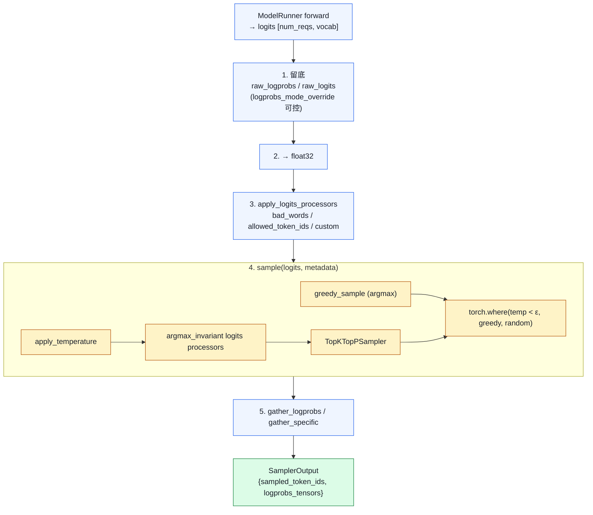

# 01. Sampling 全栈：从 logits 到 token

> **谁该读这一篇？** 想理解输出多样性 / logprobs / 投机解码正确性如何被实现的应用开发者与推理引擎贡献者。
>
> **前置阅读：** [`04-model-runner.md`](../03-code-walkthrough/04-model-runner.md)、[`02-speculative-decoding.md`](../04-optimizations/02-speculative-decoding.md)
>
> **耗时：** 约 30 分钟
>
> **学完能：**
> 1. 画出 Sampler.forward 的 5 个 Stage（raw logprobs → fp32 → processors → sample → gather）
> 2. 解释 temperature / top-k / top-p / min-p 的语义差异与组合方式
> 3. 说出 raw_logprobs 为什么用 pre-temperature 分布
> 4. 描述 RejectionSampler 在投机解码里的"验收"流程

一个 forward 算完，得到 `[batch, vocab]` 的 logits，怎么挑出下一个 token？这条流水线决定了**输出多样性 + logprobs 准确性 + spec decode 正确性**。涉及文件：`vllm/v1/sample/sampler.py`、`rejection_sampler.py`、`ops/{topk_topp_sampler,penalties,bad_words,logprobs}.py`。

---

## 1. 关系图



如果开了 spec decode，输出会再经过 `RejectionSampler.forward()`，详见第 6 节。

---

## 2. SamplingParams 的全部参数

`vllm/sampling_params.py:168` 的 `SamplingParams` 是 OpenAI API 与 vLLM 之间的桥梁，关键字段：

```python
class SamplingParams:
    n: int = 1
    best_of: int | None = None
    presence_penalty: float = 0.0
    frequency_penalty: float = 0.0
    repetition_penalty: float = 1.0
    temperature: float = 1.0
    top_p: float = 1.0
    top_k: int = -1         # -1 表示全 vocab
    min_p: float = 0.0
    seed: int | None = None
    stop: str | list[str] | None = None
    stop_token_ids: list[int] | None = None
    bad_words: list[str] | None = None
    include_stop_str_in_output: bool = False
    ignore_eos: bool = False
    max_tokens: int | None = 16
    min_tokens: int = 0
    logprobs: int | None = None           # top-N logprobs
    prompt_logprobs: int | None = None    # 对 prompt 也算
    detokenize: bool = True
    skip_special_tokens: bool = True
    spaces_between_special_tokens: bool = True
    logits_processors: list[Any] | None = None
    structured_outputs: StructuredOutputsParams | None = None
    truncate_prompt_tokens: ...
    extra_args: dict | None = None
```

`SamplingType`（line 33）有三种：

- `GREEDY`（temperature ≈ 0）
- `RANDOM`（不传 seed）
- `RANDOM_SEED`（带 seed）

---

## 3. Sampler.forward 源码节选

`vllm/v1/sample/sampler.py:68-143`，简化版：

```python
def forward(self, logits, sampling_metadata, predict_bonus_token=False, ...):
    # === Stage 1: 保留 raw logits/logprobs 供 logprobs 返回 ===
    if sampling_metadata.max_num_logprobs is not None:
        if logprobs_mode == "raw_logprobs":
            raw_logprobs = self.compute_logprobs(logits)    # log_softmax
        elif logprobs_mode == "raw_logits":
            raw_logprobs = logits.clone().float()

    # === Stage 2: 升 float32 ===
    logits = logits.to(torch.float32)

    # === Stage 3: logits processor (bad_words / allowed_token_ids / custom) ===
    logits = self.apply_logits_processors(logits, sampling_metadata, predict_bonus_token)

    # === Stage 4: 真正采样 ===
    sampled, processed_logprobs = self.sample(logits, sampling_metadata)

    # === Stage 5: 收集 logprobs ===
    sampled = sampled.long()
    if sampling_metadata.logprob_token_ids:
        # API 指定了想要 logprob 的 token 列表，用 fused Triton kernel
        logprob_token_ids_tensors = self.gather_specific_token_logprobs(...)
    if num_logprobs is None:
        logprobs_tensors = logprob_token_ids_tensors
    else:
        # 默认：返回 top-N logprobs 与采样 token 的 rank
        logprobs_tensors = self.gather_logprobs(raw_logprobs, num_logprobs, token_ids=sampled)

    return SamplerOutput(sampled_token_ids=sampled.unsqueeze(-1).to(int32),
                         logprobs_tensors=logprobs_tensors)
```

**关键设计**：

- raw_logprobs 用**没经过 temperature/penalty 的原始分布**（V0 的 sampler 不是这样，V1 修正）
- sampled 用 `int32`（节省 IPC 字节，FlashInfer kernel 返回 int32）
- greedy 与 random 用 `torch.where` 合并：同一 batch 里部分请求 temp=0 部分 temp>0 也能一次 forward

---

## 4. sample() 内部：温度 + top-k/p

`sampler.py:235-291`：

```python
def sample(self, logits, sampling_metadata, ...):
    # 4.1 greedy 路径
    if not all_random:
        greedy_sampled = self.greedy_sample(logits)   # argmax
        if all_greedy:
            return greedy_sampled, None

    # 4.2 在 float32 上应用温度
    logits = self.apply_temperature(logits, temperature, all_random)
    #         ↓ logits.div_(temp.unsqueeze(1))
    #         ↓ 对 temp < eps 的位置先替换为 1.0 避免除 0

    # 4.3 argmax-invariant 的 logits processor（按 token logit 加偏置但不改 argmax）
    for processor in sampling_metadata.logitsprocs.argmax_invariant:
        logits = processor.apply(logits)

    # 4.4 top-k / top-p 采样
    random_sampled, processed_logprobs = self.topk_topp_sampler(
        logits, generators, top_k, top_p
    )

    # 4.5 合并 greedy 与 random
    sampled = torch.where(temperature < eps, greedy_sampled, random_sampled, out=greedy_sampled)
    return sampled, processed_logprobs
```

`TopKTopPSampler`（`vllm/v1/sample/ops/topk_topp_sampler.py`）有两条路径：

- **FlashInfer**：`flashinfer.sampling.top_k_top_p_sampling_from_probs`，最快
- **Triton fallback**：`vllm/v1/sample/ops/topk_topp_triton.py`，自带 kernel

top-k 实现：把 vocab 上 sort，取前 k 个；其余位置 logit = -inf。
top-p（nucleus）：sort 后从大到小累积概率，超过 p 截断。
min-p：保留所有概率 ≥ p_max × min_p 的 token，比 top-p 抗 sampling noise。

---

## 5. Penalty / Bad words 处理

`vllm/v1/sample/ops/penalties.py`：

```python
def apply_all_penalties(logits, prompt_token_ids, output_token_ids,
                        presence_penalties, frequency_penalties, repetition_penalties):
    """
    repetition_penalty: 已出现的 token logit / penalty（>1 抑制重复）
    presence_penalty:    出现过的 token logit -= presence
    frequency_penalty:   出现次数 × frequency，logit -= count×freq
    """
```

`bad_words.py` 把 bad token sequence 在 logits 里 mask 成 -inf（不只是单 token，要看上下文 n-gram）。

这两个 op 都是**就地修改 logits**，效率优先。

---

## 6. RejectionSampler：投机解码的"验收员"

`vllm/v1/sample/rejection_sampler.py`，整体结构：

```python
class RejectionSampler(nn.Module):                          # line 37
    def forward(self, ..., draft_token_ids, target_logits, ...):
        # 给 target_logits 应用 logits processor（line 283）
        target_logits = self.apply_logits_processors(...)
        target_logits = self.apply_penalties(...)            # line 347

        # 核心：对每个 draft token 跑接受/拒绝判定（Leviathan 2023）
        accepted = rejection_sample(
            draft_token_ids,
            draft_probs,
            target_probs,
            ...
        )
        # 拒绝时从修正分布 (target - draft)_+ 采样
        # 全部接受时可以再多采 1 个 bonus token

def rejection_sample(...):                                   # line 392
    # 内部 dispatch 到两个 Triton kernel：
    #   rejection_greedy_sample_kernel  (line 708)
    #   rejection_random_sample_kernel  (line 762)
```

数学（详见 `04-optimizations/02-speculative-decoding.md`）：

```
对每个位置 i：
  r ~ U(0,1)
  if r < min(1, p_target(x_i) / p_draft(x_i)):
       接受 x_i, 继续
  else:
       拒绝, 从 (p_target - p_draft)_+ / Z 采新 token x'_i, 停止
```

vLLM 把这个公式实现成 Triton kernel（`rejection_random_sample_kernel`），整 batch 并行算。

---

## 7. Logprobs：什么时候算 / 怎么省

`vllm/v1/sample/ops/logprobs.py` + `Sampler.gather_logprobs`（line 298）。

设计原则：

- 不是每个 forward 都算 logprobs（贵）。仅当 `logprobs > 0` 或 `prompt_logprobs > 0` 时才算
- 算时只对**采样 token + top-N**做 log_softmax + gather，不是 full vocab
- 使用 fused Triton kernel `compute_token_logprobs`（line 1.4× sparse gather 性能）

返回结构 `LogprobsTensors`：

```
logprob_token_ids:  [num_tokens, num_logprobs + 1]   # +1 是 sampled token
logprobs:           [num_tokens, num_logprobs + 1]   # 对应的 log p
sampled_token_ranks:[num_tokens]                    # 采样 token 在 vocab 排第几
```

prompt_logprobs 在 prefill 时算（每个 prompt token 都要给 top-N logprobs），更贵——只在用户请求时开。

---

## 8. SamplingMetadata 的批处理打包

`vllm/v1/sample/metadata.py`：把整个 batch 的 sampling 参数打包成 GPU tensor，sampler 一次性处理。

```
SamplingMetadata fields:
  temperature        # [num_reqs]
  top_p / top_k      # [num_reqs]
  min_p
  generators         # 每个 request 一个 torch.Generator（seed 模式）
  output_token_ids   # 当前已生成的 token（penalty 用）
  prompt_token_ids   # repetition penalty 用
  all_greedy: bool   # batch 全 greedy 走快路径
  all_random: bool   # batch 全 random 走快路径
  logitsprocs: LogitsProcessorManager   # 自定义 logits processor 集合
  max_num_logprobs
  logprob_token_ids: dict[int, list[int]]  # 指定 token logprob
```

打包发生在 ModelRunner 的 `_prepare_inputs`，是 V1 性能优化的关键之一。

---

## 9. 自定义 LogitsProcessor

用户可以传 callable 改 logits。但有性能陷阱：

- **每步**对 batch 内每个有 processor 的请求都要调一次
- Python callable 不能融入 CUDA Graph
- 实际生产建议：用结构化输出（xgrammar）替代手写 processor（见下一节）

vLLM 把 processors 分两类：

- `argmax_invariant`：只改非 argmax 位置的 logit（如 bad_words mask）
- 非 invariant：可能改 argmax 结果（如 forced token）

argmax_invariant 的可以在 greedy 路径里跳过执行（line 271-272），是个微优化。

---

## 10. 面试常见追问

**Q: temperature 怎么影响输出多样性？**
A: `logits / temp` 然后 softmax。temp → 0 时分布趋向 one-hot（接近 argmax）；temp = 1 是原始分布；temp > 1 平滑分布、多样性↑。vLLM 在 temp < ε 时走 greedy 快路径。

**Q: top-p（nucleus）和 top-k 的区别？**
A: top-k 永远保留固定 k 个 candidate；top-p 保留累计概率 ≥ p 的候选（动态）。top-p 在分布平坦时保留更多、尖锐时保留少，更自然。生产常用 top-p=0.9 + top-k=50 双约束。

**Q: min-p 是什么？为啥要它？**
A: 保留概率 ≥ p_max × min_p 的 token。它对 sampling noise（少数 token 极小概率干扰）更鲁棒。Together / Anthropic 都默认开 min-p。

**Q: logprobs 为什么不默认开？**
A: 多算一次 log_softmax，整 batch 的 vocab × float 计算，开销显著。OpenAI API 也是 opt-in。vLLM 通过"只对 sampled + top-N 算"减小开销。

**Q: 采样为什么用 float32 不用 BF16？**
A: BF16 softmax 在 vocab=128k 时容易 underflow / overflow。float32 安全 + Triton kernel 友好。性能开销可接受（采样不在热路径）。

**Q: spec decode 拒绝采样为什么不改变分布？**
A: Leviathan 2023 证明：`min(1, p_t/p_d)` 接受 + `(p_t - p_d)_+ / Z` 拒绝重采，得到的分布数学等价于直接从 p_t 采。详见 `04-optimizations/02-speculative-decoding.md`。

---

## 小结

- Sampler 的 5 个 Stage 是固定流水线：保留 raw logprobs → upcast fp32 → 应用 processors → sample → gather logprobs。
- greedy 与 random 通过 `torch.where(temp<eps, ...)` 合并，让混合 batch 一次 forward 解决。
- TopKTopPSampler 优先走 FlashInfer，缺时回退 Triton；temperature/top-p/top-k/min-p 各自有不同的"截断"语义。
- RejectionSampler 把 Leviathan 2023 的接受/拒绝公式落成两个 Triton kernel，输出分布等价于直接从 target 采。
- Logprobs 是 opt-in 的：仅对 sampled + top-N 做 sparse gather，避免 full-vocab 开销。

## 自检

1. SamplingMetadata 里 `all_greedy` 和 `all_random` 两个布尔值能在性能上分别省掉哪些步骤？
2. 自定义 LogitsProcessor 为什么会破坏 CUDA Graph？有什么替代方案？
3. 拒绝采样里被拒绝时从 `(p_target - p_draft)_+ / Z` 重采，这个公式保证了什么数学性质？
4. 同一个 batch 既有 `logprobs=5` 也有不要 logprobs 的请求，sampler 如何让"不要的请求"不付出额外算力？

## 下一步

- 下一节：[`02-structured-output.md`](./02-structured-output.md)（用 grammar/JSON schema 把 logits 直接 mask 到合法集合）
- 想看源码：`vllm/v1/sample/`（sampler、rejection_sampler、ops 全套）、`vllm/sampling_params.py`
- 想动手：[`07-hands-on/03-mini-experiments.md`](../07-hands-on/03-mini-experiments.md) 对比 temperature/top-p 不同组合下的输出与 logprobs

---

## Sources

- `vllm/sampling_params.py:33,168`（SamplingType / SamplingParams）
- `vllm/v1/sample/sampler.py:21,68,235,294,360,412`
- `vllm/v1/sample/rejection_sampler.py:37,392,708,762`
- `vllm/v1/sample/ops/topk_topp_sampler.py`、`penalties.py`、`bad_words.py`、`logprobs.py`
- `vllm/v1/sample/metadata.py`（SamplingMetadata）
- `csrc/sampler.cu`（一些 fallback CUDA kernel）

---

## See also

- `04-optimizations/02-speculative-decoding.md` —— rejection sampler 的算法层
- `02-core-concepts/02-continuous-batching.md` —— sampling 在 step 中的位置
- `03-code-walkthrough/04-model-runner.md` —— `_prepare_inputs` 怎么打包 SamplingMetadata
