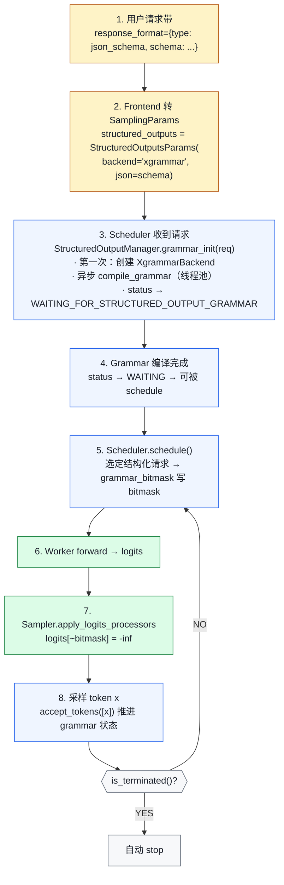

# 02. Structured Output：JSON / Regex / Grammar 约束生成

> **谁该读这一篇？** 做 Agent / Tool use / Function calling，需要 LLM 严格按 schema 输出的开发者；想理解 grammar 引擎和 sampler 接缝的引擎贡献者。
>
> **前置阅读：** [`01-sampling-and-logits.md`](./01-sampling-and-logits.md)、[`02-scheduler.md`](../03-code-walkthrough/02-scheduler.md)
>
> **耗时：** 约 25 分钟
>
> **学完能：**
> 1. 区分 xgrammar / guidance / outlines / lm-format-enforcer 四个后端的取舍
> 2. 画出 `grammar_init → grammar_bitmask → Sampler mask → accept_tokens` 的完整路径
> 3. 解释 bitmask 数据结构如何节省显存与算力
> 4. 说出结构化输出与投机解码、reasoning model 组合时的注意点

Agent / Tool use / Function calling 的底层支柱：让 LLM **只能**输出符合 schema 的 token。不是 prompt 哄它"请按 JSON 输出"，而是在 logits 层面把不合法 token 直接 mask 掉。代码目录：`vllm/v1/structured_output/`。

---

## 1. 类与文件总览

```
vllm/v1/structured_output/
├── __init__.py                   ← StructuredOutputManager（engine-level 调度）
├── backend_types.py              ← 抽象接口
│     ├─ StructuredOutputBackend  （后端基类）
│     ├─ StructuredOutputGrammar  （单请求 grammar 状态机）
│     └─ StructuredOutputOptions  （JSON / REGEX / GRAMMAR / CHOICE / ...）
├── backend_xgrammar.py           ← Cornserve xgrammar 实现（默认推荐）
├── backend_guidance.py           ← Microsoft llguidance（regex / JSON / lark）
├── backend_outlines.py           ← outlines（社区流行）
├── backend_lm_format_enforcer.py ← lm-format-enforcer
├── request.py                    ← StructuredOutputRequest（per-request 状态）
└── utils.py
```

---

## 2. 4 个后端怎么选

| 后端                | 速度 | 表达力              | 生产推荐                   |
| ----------------- | -- | ---------------- | ---------------------- |
| **xgrammar**      | 最快 | JSON Schema / Lark / Regex | ★★★ 默认                |
| guidance          | 中  | JSON Schema / Regex / lark | 复杂 lark grammar      |
| outlines          | 中  | Regex / JSON / CFG | 历史项目兼容               |
| lm-format-enforcer | 较慢 | JSON / Regex      | 旧栈兼容                  |

xgrammar 用 **C++ 写的状态机** + **预编译 token mask 表**，每步只查表，比纯 Python 的 outlines 快几个数量级。

---

## 3. 抽象接口

`vllm/v1/structured_output/backend_types.py:31,99`：

```python
class StructuredOutputGrammar(ABC):
    """一个请求一份。维护这个请求的 grammar 状态机。"""

    def accept_tokens(self, request_id, tokens) -> bool:
        """把已采样 token 喂回状态机，推进状态。"""

    def validate_tokens(self, tokens) -> list[int]:
        """检查一批 token 是否合法（spec decode 用）。"""

    def rollback(self, num_tokens) -> None:
        """spec decode 拒绝时回滚状态。"""

    def fill_bitmask(self, bitmask, batch_index) -> None:
        """关键：把"当前合法 token"写进 bitmask。"""

    def is_terminated(self) -> bool: ...
    def reset(self): ...


class StructuredOutputBackend(ABC):
    """全局一份，给所有请求编译 grammar。"""

    def compile_grammar(self, request_type, grammar_spec) -> StructuredOutputGrammar: ...
    def allocate_token_bitmask(self, max_num_seqs) -> torch.Tensor: ...
    def destroy(self): ...
```

**Bitmask 是核心数据结构**：`[max_num_seqs, ceil(vocab_size / 32)]` 的 int32 tensor，每 bit 表示一个 token 是否合法。

---

## 4. StructuredOutputManager：引擎级调度

`vllm/v1/structured_output/__init__.py:35` 一个 EngineCore 一个。关键属性：

```python
class StructuredOutputManager:
    def __init__(self, vllm_config):
        self.backend: StructuredOutputBackend | None = None
        self._use_async_grammar_compilation = (
            distributed_executor_backend != "external_launcher"
        )
        self._grammar_bitmask: torch.Tensor | None = None   # 复用 buffer
        # Grammar 编译线程池（CPU-bound）
        self.executor = ThreadPoolExecutor(max_workers=cpu_count() // 2)
        # 大 batch 时 fill_bitmask 也并行
        self.executor_for_fillmask = ThreadPoolExecutor(...)
```

### 4.1 grammar_init（请求入队时调用）

```python
def grammar_init(self, request):                            # line 114
    if self.backend is None:
        # 第一次按用户指定的后端 lazy 创建
        backend = request.sampling_params.structured_outputs._backend
        if backend == "xgrammar":
            self.backend = XgrammarBackend(...)
        elif backend == "guidance":
            self.backend = GuidanceBackend(...)
        ...

    # async 提交编译，避免 block Scheduler
    if self._use_async_grammar_compilation:
        grammar = self.executor.submit(self._create_grammar, request)
    else:
        grammar = self._create_grammar(request)

    request.structured_output_request.grammar = grammar
```

**关键设计**：grammar 编译是 CPU 重活（JSON Schema 转 DFA），异步跑在线程池。Scheduler 看到 grammar 还没 ready 时把请求挂在 `WAITING_FOR_STRUCTURED_OUTPUT_GRAMMAR` 状态。

### 4.2 grammar_bitmask（每步调用）

```python
def grammar_bitmask(self, requests, structured_output_request_ids, ...):   # line 203
    # 对每个有 grammar 的请求：
    #   - 找出当前 grammar 状态下合法 token 集合
    #   - 写入 _grammar_bitmask[index]
    # 大 batch（>128 个请求）时分块并行
    if num_reqs > self.fill_bitmask_parallel_threshold:
        batches = split into chunks of 16
        futures = [_async_submit_fill_bitmask(batch) for batch in batches]
        wait(futures)
    else:
        self._fill_bitmasks(all_requests)
```

bitmask 之后会被传到 Sampler，在 logits 阶段把非法 token mask 成 -inf。

---

## 5. 端到端流程：一次结构化输出请求



---

## 6. 与 Scheduler / Sampler 的具体接缝

### 接缝 A：Scheduler 等 grammar 编译完成
`vllm/v1/core/sched/scheduler.py` 在 `_schedule_running` 之前会检查每个 request 的 grammar future 是否 done。没 done 的请求保持 WAITING，不进 batch。

### 接缝 B：grammar_bitmask 注入 SamplerOutput
SchedulerOutput 带 `grammar_bitmask: NDArray[int32]`。Worker.execute_model 传到 GPU。Sampler 在 `apply_logits_processors` 阶段用它 mask logits。

### 接缝 C：accept_tokens 推进状态机
ModelRunner 拿到采样结果后，对每个 structured request 调 `grammar.accept_tokens([sampled_id])`。这是**严格串行**（grammar 状态有顺序），所以这步在 CPU 上做，不入 GPU。

---

## 7. 性能优化技巧

### 7.1 bitmask 复用
`_grammar_bitmask` 是个 reusable tensor，每步只刷需要的行。免去每步 alloc 大 tensor。

### 7.2 async grammar 编译
JSON Schema → DFA 可能要几十 ms。同步会卡 Scheduler。改 thread pool 异步，Scheduler 继续跑其他请求。

### 7.3 大 batch 并行 fill_bitmask
单步 batch > 128 时，把 fill_bitmask 分块多线程做（CPU-bound）。

### 7.4 bitmask 编码紧凑
不存 `[vocab_size]` bool，存 `[ceil(vocab/32)]` int32 位图。vocab 128k 时占 16KB / 请求，可接受。

---

## 8. 与 Function Calling / Tool Use 的关系

OpenAI 的 `tools` API：

- 用户传 function schema
- 模型决定调用哪个 function + 输出 JSON 参数
- 服务端解析 JSON 调实际工具

vLLM 的实现路径（`vllm/entrypoints/openai/`）：

- frontend 把 tools schema 转成 JSON Schema
- 设 `structured_outputs={"type": "json_schema", ...}`
- 用 `tool_choice` 控制是否强制调用

结构化输出 + parser（`vllm/tool_parsers/`）是 function calling 的两条腿。

---

## 9. 与投机解码的交互

结构化输出 + spec decode 是个**复杂组合**：

- target 模型采样后必须 accept_tokens 推进 grammar
- spec 一次提议多个 token，需要 `validate_tokens` 批量验
- 拒绝重采时要 `rollback` 回滚 grammar 状态

`RejectionSampler.forward` 接受 grammar 引用，按位决策。
**目前并非所有后端都完美支持 spec decode + structured output**——上生产前要 benchmark。

---

## 10. Reasoning Models（DeepSeek-R1 / o1 风格）

`structured_outputs_config.reasoning_parser` 处理 reasoning：

- 模型先输出 `<think>...</think>` 然后正式答案
- ReasoningParser 把 reasoning 段拆出来不参与 grammar 约束
- 答案段恢复 grammar 约束

代码：`vllm/reasoning/`，在 `StructuredOutputManager._get_reasoner`（line 99）里挂上。

---

## 11. 面试常见追问

**Q: structured output 为什么比 prompt 工程可靠？**
A: prompt 工程依赖模型自觉，温度高 / 长生成时易跑偏。结构化输出在 logits 层强制 mask，**数学上保证**只能产出合法 token，无法越界。

**Q: bitmask 是怎么算的？**
A: 每个 grammar 维护一个状态机（DFA / PDA）。`fill_bitmask` 调用：当前状态下哪些 token 能让状态机合法 transition？把这些位置 1，其余位置 0。xgrammar 把 DFA 预编译，每步只查表。

**Q: 一个 batch 里只有部分请求有结构化约束，怎么处理？**
A: SamplerOutput 接收 `[max_num_seqs, vocab/32]` 的 bitmask，没结构化约束的请求那一行全 1（任意合法）。同 batch 一次 apply。

**Q: 异步 grammar 编译能给多少收益？**
A: 复杂 JSON Schema 编译 30-200ms。如果在 critical path 上，会让 TTFT 飙升。异步后请求只在 grammar 没好之前不进 batch，编译期间 Scheduler 服务其他请求 → TTFT 不受影响。

**Q: xgrammar 的精度有问题吗？**
A: 标准 JSON Schema 全支持。但极端复杂的 lark grammar 偶有 corner case（如递归深度限制）。生产前 fuzzing 测一遍。

---

## 小结

- StructuredOutputManager 是 engine 级单例，懒加载 backend，并把 grammar 编译异步化避免 block scheduler。
- 每个请求一份 `StructuredOutputGrammar` 状态机，每步靠 `fill_bitmask` 写 `[max_num_seqs, ceil(vocab/32)]` 位图。
- Sampler 在 logits 阶段一次性把 bitmask 应用到整 batch，无结构化约束的请求位图全 1。
- 与 spec decode 协同需要 `validate_tokens` / `rollback`，并非所有后端完全等价。
- Reasoning models 用 ReasoningParser 把 `<think>` 段与正式答案段分离，只在答案段约束。

## 自检

1. 一个 grammar 编译要 100ms，如果不异步会怎样？异步后请求处于哪个 status？
2. bitmask 为什么用 int32 位图而不是 bool tensor？vocab 128k 时单请求占多少字节？
3. spec decode 拒绝时，grammar 状态机需要怎么处理才能保持一致？
4. function calling 的 `tools` 参数最终在 vLLM 内部转成什么？由谁解析最终 JSON？

## 下一步

- 下一节：[`03-multimodal.md`](./03-multimodal.md)（多模态输入与 token 化）
- 想看源码：`vllm/v1/structured_output/`、`vllm/tool_parsers/`、`vllm/reasoning/`
- 想动手：[`07-hands-on/03-mini-experiments.md`](../07-hands-on/03-mini-experiments.md) 拿一份 JSON Schema 对比 xgrammar vs outlines 的耗时

---

## Sources

- `vllm/v1/structured_output/__init__.py:35,114,203,301`
- `vllm/v1/structured_output/backend_types.py:31,99`
- `vllm/v1/structured_output/backend_xgrammar.py`
- `vllm/v1/structured_output/backend_guidance.py`
- `vllm/v1/structured_output/request.py`
- `vllm/sampling_params.py:41`（StructuredOutputsParams）
- `vllm/v1/sample/sampler.py:360`（apply_logits_processors 入口）
- `vllm/tool_parsers/`、`vllm/reasoning/`

---

## See also

- `09-advanced-features/01-sampling-and-logits.md` —— bitmask 怎么改 logits
- `06-interview/02-system-design.md` —— agent 框架设计里的 schema 强制
- `03-code-walkthrough/02-scheduler.md` —— grammar 等待状态如何融入 schedule
