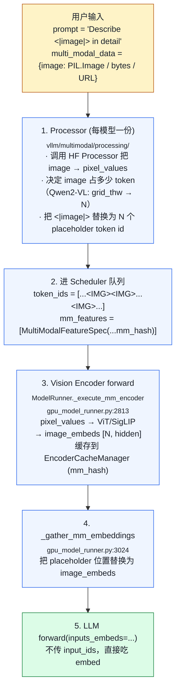

# 03. Multimodal：图像 / 视频 / 音频 一路打通

> **谁该读这一篇？** 想把视觉/语音/视频模型上线的应用开发者；想理解 vLLM 怎么把非文本模态接进 token 序列的引擎贡献者。
>
> **前置阅读：** [`04-model-runner.md`](../03-code-walkthrough/04-model-runner.md)、[`04-prefix-caching.md`](../02-core-concepts/04-prefix-caching.md)
>
> **耗时：** 约 25 分钟
>
> **学完能：**
> 1. 画出 image → placeholder token → encoder embed → LLM 的完整数据流
> 2. 解释 EncoderCacheManager 的 LRU + ref_cnt 设计与 KV BlockPool 的相似/不同
> 3. 描述 mm_hash 如何融入 prefix caching 的 block hash
> 4. 说出视频与音频在调度、内存、encoder budget 上的差异

Qwen2-VL / Llama-3.2-Vision / Phi-3.5-Vision / Whisper 等模型在 vLLM 里能跑，靠的是一整套**多模态输入处理 + 编码器缓存 + token 占位符替换**系统。涉及代码：`vllm/multimodal/`、`vllm/v1/core/encoder_cache_manager.py`、`vllm/model_executor/models/qwen2_vl.py` 等。

---

## 1. 数据流：图片如何变成 token



---

## 2. multimodal 目录结构

```
vllm/multimodal/
├── inputs.py        ← MultiModalKwargs / FieldElem / PlaceholderRange (1015 行)
├── image.py         ← image 输入解析（PIL/np/bytes/URL）
├── video.py         ← video 帧抽样 / 时序重采样（1055 行）
├── audio.py         ← waveform 加载与切片
├── hasher.py        ← mm 内容哈希（影响 prefix caching）
├── cache.py         ← 输入侧 cache（vs encoder 输出 cache）
├── processing/      ← 每模型一份 Processor
├── registry.py      ← MultiModalRegistry：模型 ↔ processor 绑定
└── parse.py         ← OpenAI message → mm_data 解析
```

---

## 3. PlaceholderRange：核心数据结构

`vllm/multimodal/inputs.py:119`：

```python
@dataclass
class PlaceholderRange:
    offset: int          # 在 token 序列里的起始位置
    length: int          # 占多少 token
    is_embed: torch.Tensor | None = None  # 哪些位置真的填 embed（部分模型有 padding）
```

例：Qwen2-VL 一张 224×224 图片占 16 个 token，prompt 长 100 token 时图片在位置 10-25：

```
PlaceholderRange(offset=10, length=16, is_embed=None)
```

这个 range 决定了：

- `_gather_mm_embeddings` 把 image_embeds 放到哪
- prefix caching 的 hash 怎么算（图片 hash 替代 placeholder token）

---

## 4. EncoderCacheManager：编码器输出缓存

`vllm/v1/core/encoder_cache_manager.py:17` 一个 EngineCore 一份。结构：

```python
class EncoderCacheManager:
    cache_size: int             # 容量（按 encoder embed token 数算）
    num_free_slots: int

    # mm_hash → 引用它的 request_id 集合
    cached: dict[str, set[str]] = {}

    # 引用计数归零的可释放项：mm_hash → 该项占的 embed 数
    freeable: OrderedDict[str, int] = {}

    # 上一轮被实际驱逐的 hash（通知给 KV manager 让 prefix cache 也跟着清）
    freed: list[str] = []
```

关键方法：

- `check_and_update_cache(req, input_id)`：命中则 ref_cnt++
- `can_allocate(req, input_id)`：还有空间放新的吗
- `allocate(req, input_id)`：占用 slot
- `free(req)`：请求结束，所有 mm input 引用 -1
- `get_freed_mm_hashes()`：返回 + 清空 freed 列表

**核心思路与 KV BlockPool 一样**：LRU + ref_cnt，只是单位从 KV block 变成 mm encoder embed 数。

---

## 5. Encoder Budget：单步算多少 vision

vision encoder forward 也耗 GPU 算力。Scheduler 给它独立 budget：

```
vllm/multimodal/encoder_budget.py
  ↓
SchedulerConfig.max_num_encoder_input_tokens   # 单 step 上限
```

每步 `_schedule_waiting` 在加入新请求前检查 encoder budget。超了就 defer。

**为什么需要独立 budget？** 一张大图可能产生几百 token 的 embed，几张图就占满 prefill 算力。隔离后 prefill 与 vision encoder 各自有上限，调度可预测。

---

## 6. mm_hash 与 Prefix Caching 的交互

参见 `02-core-concepts/04-prefix-caching.md` 第 4.3 节。要点：

```
block_hash = hash(prev_block_hash, tuple(token_ids), extra_keys)
                                                     ↑
                                              extra_keys 包含：
                                                - 对应位置上的 mm_hash（如果有图）
                                                - LoRA adapter id
                                                - cache_salt
```

这样**同一张图 hash 一致** → 跨请求 cache 命中。但**不同图 placeholder 相同** → hash 不同，正确隔离。

mm_hash 在 `vllm/multimodal/hasher.py` 里计算：图片用 `(width, height, pixel sample)`、视频用 `(frames_hash, fps)`，audio 用 `(sample_rate, waveform_hash)`。

---

## 7. 一个具体模型例子：Qwen2-VL

`vllm/model_executor/models/qwen2_vl.py`（1829 行），简化看 forward：

```python
class Qwen2VLForConditionalGeneration(nn.Module):
    def __init__(self, ...):
        self.visual = Qwen2VisionTransformer(...)   # ViT
        self.model = Qwen2VLModel(...)              # LLM
        self.lm_head = ...

    def get_multimodal_embeddings(self, pixel_values, grid_thw, ...):
        # 1. ViT forward → image_embeds [N, hidden]
        # 2. merge: rearrange via grid_thw（spatial / temporal merging）
        return image_embeds

    def get_input_embeddings(self, input_ids, multimodal_embeddings=None):
        # 普通 token: embed_tokens(input_ids)
        # placeholder 位置：替换为 multimodal_embeddings
        inputs_embeds = self.model.embed_tokens(input_ids)
        if multimodal_embeddings is not None:
            inputs_embeds = scatter_mm_embeds_into(
                inputs_embeds, multimodal_embeddings, placeholder_positions
            )
        return inputs_embeds

    def forward(self, input_ids=None, positions=None,
                inputs_embeds=None, intermediate_tensors=None, ...):
        # vLLM 调用时通常已经传 inputs_embeds（mm 模型）
        return self.model(inputs_embeds=inputs_embeds, positions=positions, ...)
```

ModelRunner 集成（`vllm/v1/worker/gpu_model_runner.py`）：

```python
def execute_model(self, scheduler_output):
    ...
    # Step C: 多模态 encoder
    multimodal_embeds = self._execute_mm_encoder(...)
    #         └─ 内部检 encoder_cache，未命中调 model.get_multimodal_embeddings

    # Step D: 把 embed 替换进 input
    input_embeds = self._gather_mm_embeddings(multimodal_embeds, ...)

    # Step E: 主 LLM forward
    hidden_states = self.model(
        input_ids=None,
        inputs_embeds=input_embeds,
        positions=positions,
        ...
    )
```

---

## 8. 视频与音频差异

### Video
- 抽帧（按 fps 或固定步长）
- 每帧过 vision encoder
- 跨帧融合：temporal pooling / merge（Qwen2-VL 用 spatial-temporal merge）
- mm_hash 含帧序列 hash

### Audio
- waveform → mel-spectrogram → audio encoder（Whisper 用 CNN + Transformer）
- 输出 audio embedding 序列
- 与 image 类似插入到 LLM input

视频是**算量最大的模态**——一个 1 分钟视频 30 fps → 1800 帧。生产配置常常限制帧数或降采样。

---

## 9. 工程要点

### 9.1 Pixel preprocessing 在哪做？
HF Processor 是 CPU bound（PIL + numpy）。
vLLM 把 preprocessing 放在**Frontend 进程**（API server），不阻塞 EngineCore。

### 9.2 多模态请求的 input batch
batch 内不同请求 mm 数量不同。`mm_features` 是 list[list]，per-request 长度不一。
ModelRunner 的 `_extract_mm_kwargs`（line 1583）把它们打平 + 标记哪个 mm 属于哪个请求。

### 9.3 内存开销
图片 embed 比 KV cache 占的还多。例：Qwen2-VL 一张 1024×1024 = 1024 token × 4096 dim × BF16 = 8MB。100 张 = 800MB。
所以 encoder_cache 容量要规划（默认按 `--mm-encoder-cache-size`）。

### 9.4 跨 Pod 复用？
encoder cache 默认 per-Pod。要跨 Pod 复用：通过 KV connector 把 mm_hash → embed 也上传到 L2/L3。不是常规配置。

---

## 10. 面试常见追问

**Q: vLLM 怎么把图片"翻译"成 LLM 输入？**
A: 三步：①Processor 把字符 placeholder 换成 N 个特殊 token id；②ViT 算 image_embeds；③在 input_embeds 里把 N 个 placeholder 位置替换为 image_embeds。LLM forward 吃 inputs_embeds（不传 input_ids）。

**Q: 同一张图给两个请求，怎么不重复算？**
A: EncoderCacheManager 用 mm_hash 索引 encoder 输出。命中则 ref_cnt++，跳过 ViT forward。跟 prefix caching 在 KV 上的复用是同一套思路。

**Q: 长视频（10000 帧）怎么部署？**
A: ①降帧（每 5-10 帧采 1）；②分段 prefill（chunked prefill 配合）；③encoder cache 必须大；④可能需要 dedicated decode pool（KV 占用大）。生产常把视频任务隔离到单独 Pod 池。

**Q: 多模态 + prefix caching 有坑吗？**
A: 有。mm_hash 必须稳定（同一图每次 hash 一致），否则 cache 命中失败。常见 bug：图像 preprocessing 引入随机性（resize / normalize 浮点误差）→ hash 不一致 → cache miss。hasher.py 会下采样 + 量化避免。

**Q: vision encoder 与 LLM 怎么协同 TP？**
A: ViT 通常**不 TP**（小），所有 TP rank 各自跑完整 ViT；image_embeds 通过 AllGather 同步。LLM 部分按常规 TP 切。少数大 ViT（如 InternVL-6B）也支持 TP。

---

## 小结

- Multimodal 输入用 `<|image|>` 等占位符 token 占位，先经 Processor 算出占多少 token，再由 ViT/SigLIP 算 embed，最后插回 input_embeds。
- EncoderCacheManager 用 LRU + ref_cnt 缓存 encoder 输出，单位是 embed token 数，思想与 KV BlockPool 一致。
- Encoder 有独立 budget，避免大图/视频抢走 prefill 算力；这是调度可预测的关键。
- mm_hash 进入 block_hash 的 extra_keys，使得"同图复用、异图隔离"在 prefix caching 层正确表达。
- 视频比图像贵几个数量级（帧数线性放大），生产中常隔离到专门 Pod 池。

## 自检

1. 一张图在 EncoderCacheManager 里被多个请求共用时，引用计数何时归零？归零后多久才真正释放？
2. 为什么 ViT 通常不做 TP，而 LLM 部分按常规 TP 切？要让它们配合需要哪一步同步？
3. mm_hash 一旦不稳定会导致什么现象？hasher.py 用什么手段稳住浮点 preprocessing？
4. 你要支持 1 分钟 30fps 的视频问答，要在 SchedulerConfig 哪些字段上做手脚？

## 下一步

- 下一节：[`04-lora-serving.md`](./04-lora-serving.md)（多租户 LoRA 的加载与路由）
- 想看源码：`vllm/multimodal/`、`vllm/v1/core/encoder_cache_manager.py`、`vllm/model_executor/models/qwen2_vl.py`
- 想从生产视角理解：[`08-production-deployment/01-deployment-architectures.md`](../08-production-deployment/01-deployment-architectures.md)（多模态 Pod 池隔离）

---

## Sources

- `vllm/multimodal/inputs.py:119`（PlaceholderRange）、`:854,882`（MultiModalKwargs）
- `vllm/multimodal/processing/`（每模型一份）
- `vllm/multimodal/hasher.py`、`cache.py`、`encoder_budget.py`
- `vllm/v1/core/encoder_cache_manager.py:17`
- `vllm/v1/worker/gpu_model_runner.py:2813,3024`（_execute_mm_encoder / _gather_mm_embeddings）
- `vllm/model_executor/models/qwen2_vl.py`、`llava.py`、`phi3v.py`、`internvl.py`

---

## See also

- `02-core-concepts/04-prefix-caching.md` —— mm_hash 进 block hash
- `03-code-walkthrough/04-model-runner.md` —— Stage C 多模态 embedding
- `06-interview/02-system-design.md` —— RAG / multimodal 系统设计
