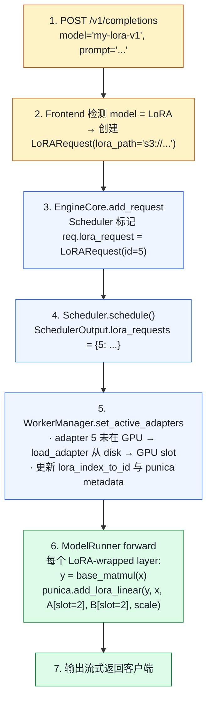

# 04. LoRA Serving：一个 base model 服务多个微调版本

> **谁该读这一篇？** 做多租户微调服务、希望同一 GPU 同时跑几十个 adapter 的应用工程师；想理解 Punica batched kernel 的引擎贡献者。
>
> **前置阅读：** [`04-model-runner.md`](../03-code-walkthrough/04-model-runner.md)、[`02-smart-routing-and-load-balancing.md`](../08-production-deployment/02-smart-routing-and-load-balancing.md)（LoRA-aware routing）
>
> **耗时：** 约 25 分钟
>
> **学完能：**
> 1. 解释 Punica 思想如何让多 LoRA batching 仍然高效
> 2. 描述 LoRAModelManager 注册 / 激活 / LRU swap 的关键状态
> 3. 在白板上画出 LoRA-wrapped Linear 的 forward
> 4. 选择 `max_loras` 与了解 LoRA 与量化、投机解码、prefix caching 的关系

同一台 H100 上同时跑 base model + 50 个 LoRA 适配器，每个用户用自己的版本。这就是 vLLM 的 multi-LoRA serving，靠 **LoRAModelManager + Punica batched kernel** 撑起。目录：`vllm/lora/`（最大、最复杂的子系统之一）。

---

## 1. LoRA 基础（30 秒回顾）

LoRA = Low-Rank Adaptation。微调时不动 base weight $W \in \mathbb{R}^{d \times d}$，而是新增两个小矩阵 $B \in \mathbb{R}^{d \times r}$、$A \in \mathbb{R}^{r \times d}$，$r \ll d$（常 8–64）：

$$\Delta W = B A, \quad W_{\text{eff}} = W + \frac{\alpha}{r} \, B A$$

$$\text{output} = x \, W_{\text{eff}} = x W + \frac{\alpha}{r} \, x B A$$

只需要存 $B, A$（几十 MB / adapter，远小于 base 模型几十 GB）。
推理时把 $\Delta$ 加上去就成另一个"模型"。

---

## 2. vLLM LoRA 目录结构

```
vllm/lora/
├── model_manager.py        ← LoRAModelManager (1057 行) — 主入口
├── worker_manager.py       ← Worker 侧的代理
├── lora_model.py           ← 解析单个 adapter 文件
├── lora_weights.py         ← Adapter 权重容器
├── peft_helper.py          ← PEFT 格式适配
├── request.py              ← LoRARequest dataclass
├── resolver.py             ← 解析 lora_path → 本地 / HuggingFace / S3
├── layers/                 ← 每种 Linear 的 LoRA 包装层
│   ├── base.py
│   ├── base_linear.py
│   ├── column_parallel_linear.py
│   ├── row_parallel_linear.py
│   ├── replicated_linear.py
│   ├── vocal_parallel_embedding.py
│   ├── fused_moe.py        ← MoE 的 LoRA（DeepSeek 等）
│   └── logits_processor.py
├── punica_wrapper/         ← 批量 LoRA matmul kernel 入口
│   ├── punica_base.py      ← 抽象接口
│   ├── punica_gpu.py       ← GPU 实现（CUDA 内核）
│   └── punica_cpu.py / punica_tpu.py / ...
└── ops/                    ← Triton 实现的 punica kernel
```

---

## 3. 难点：多 LoRA batching

朴素做法：每个请求带不同 LoRA → batch 内不能合并 matmul，因为每行用不同 `delta_W`。这会让 batching 失效。

**Punica 思想**（论文 Punica: Multi-Tenant LoRA Serving, Chen et al.）：

- batch 还是合并跑 `x · W`
- 然后 batched 算 `delta_y = x · B · A`：每行用各自的 `B_i, A_i`，但 kernel 内部按 `lora_id` 索引
- 输出 `y = x·W + delta_y`

这样 base matmul 一次大 GEMM，LoRA 增量是个**分段 GEMM**（per-token 用各自小矩阵），仍能并行。

---

## 4. LoRAModelManager：核心数据结构

`vllm/lora/model_manager.py:64`，关键属性：

```python
class LoRAModelManager:
    def __init__(self, model, max_num_seqs, max_num_batched_tokens,
                 vocab_size, lora_config, device, punica_wrapper):
        self.lora_index_to_id: list[int | None]            # GPU "slot" → adapter id
        self.lora_slots: int                                # 最大同时活跃 adapter 数（默认 = max_loras）
        self._registered_adapters: dict[int, LoRAModel]    # adapter_id → 权重
        self._active_adapters: dict[int, None]             # 当前在 slot 里的
        self.punica_wrapper: PunicaWrapperBase             # GPU/CPU/TPU 一份
```

注意 **lora_slots ≠ adapter 数**：可以注册 100 个 adapter，但同时只有 N 个在 GPU slot 里（按 LRU 换入换出）。

### 4.1 activate_adapter（line 266）

```python
def activate_adapter(self, lora_id, ...):
    if lora_id in self._active_adapters:
        return False  # 已激活

    # 找空 slot，没空就 evict LRU
    index = self._next_free_slot()
    if index is None:
        index = self._evict_lru_slot()

    # 把 adapter 权重 copy 到 GPU slot
    lora_model = self._registered_adapters[lora_id]
    for module_name, lora_module in self.modules.items():
        lora_module.set_adapter(index, lora_model.get_lora(module_name))

    self.lora_index_to_id[index] = lora_id
    self._active_adapters[lora_id] = None
```

### 4.2 _set_adapter_mapping（line 325）

每步告诉 punica wrapper："本步 batch 内每个 token 属于哪个 adapter slot"：

```python
def _set_adapter_mapping(self, mapping: LoRAMapping):
    # mapping.index_mapping: [num_tokens] —— 每 token 用第几个 slot
    # mapping.prompt_mapping: prompt 段的 slot
    self.punica_wrapper.update_metadata(mapping, self.lora_index_to_id, ...)
```

ModelRunner 在每步 forward 前调这个。

---

## 5. LRUCacheLoRAModelManager：自动换入换出

`model_manager.py:946`：

```python
class LRUCacheLoRAModelManager(LoRAModelManager):
    """所有 adapter 都在 CPU 内存常驻；GPU 只放最近用过的 N 个。"""

    def activate_adapter(self, lora_id):
        # 命中：lookup + 标记 recent
        # 未命中：evict 最旧 → load 新 adapter 到 GPU
```

这是生产推荐路径——支持 100s 的 adapter 同时"挂在系统里"，按需 swap。

---

## 6. PunicaWrapper：批量 LoRA matmul

`vllm/lora/punica_wrapper/punica_base.py:124` 抽象：

```python
class PunicaWrapperBase:
    def add_lora_linear(self, y, x, lora_a_stacked, lora_b_stacked, scale, ...):
        """y += scale * x @ A @ B，按 token 的 lora_id 路由"""

    def add_shrink(self, y, x, lora_a_stacked, scale):
        """中间步：y = scale * x @ A，输出 [N, r] (r=rank)"""

    def add_expand(self, y, x, lora_b_stacked, ...):
        """中间步：y += x @ B"""

    def add_lora_logits(self, y, x, lora_a_stacked, lora_b_stacked, scale):
        """LM head 的 LoRA（vocab parallel）"""
```

GPU 实现 `punica_gpu.py` 内部调 Triton kernel：

- `bgmv_shrink`：batched grouped matmul vec（shrink 段）
- `bgmv_expand`：批量 expand
- 已融合到一个 kernel 减少 launch 数

CUDA 层面（`vllm/lora/ops/`）支持多 rank 混合 batch（一个 batch 里 adapter 各 rank 不同也能跑）。

---

## 7. LoRA 包装层：每种 Linear 一个版本

`vllm/lora/layers/` 里每种 Linear 都有 LoRA 版本：

```
Linear (vllm/model_executor/layers/linear.py)
   │
   ├── ColumnParallelLinear  ← LoRA: column_parallel_linear.py
   ├── RowParallelLinear     ← LoRA: row_parallel_linear.py
   ├── ReplicatedLinear      ← LoRA: replicated_linear.py
   └── MergedColumnParallelLinear (QKV pack 合并)
        └── LoRA 要分别处理 QKV 各自的 adapter
```

`LoRAModelManager._create_lora_modules`（line 356）扫描模型，找到所有 `BaseLayerWithLoRA` 接口的层，包装成 LoRA 版本。

包装层 forward 大致：

```python
class ColumnParallelLinearWithLoRA(...):
    def forward(self, x):
        y = self.base_layer(x)                          # 大 matmul
        self.punica_wrapper.add_lora_linear(
            y, x, self.lora_a_stacked, self.lora_b_stacked,
            self.scaling,
        )                                              # LoRA 增量
        return y
```

base matmul 没变，多了个 LoRA 增量 op。

---

## 8. WorkerManager：和 Worker 的接口

`vllm/lora/worker_manager.py` 是 EngineCore → Worker 的 RPC 接口：

```python
class LRUCacheWorkerLoRAManager:
    def add_adapter(self, lora_request) -> bool: ...
    def remove_adapter(self, lora_id): ...
    def pin_adapter(self, lora_id): ...    # 防止 LRU 驱逐
    def list_adapters(self) -> set[int]: ...
    def set_active_adapters(self, requests, mapping): ...
```

每步 Scheduler 把"本步要服务的 adapter id 列表"传过来，WorkerManager 确保它们都活跃。

---

## 9. 一次请求的 LoRA 路径



---

## 10. 与 Smart Router 的协同

参见 `08-production-deployment/02-smart-routing-and-load-balancing.md` 第 6 节。

**LoRA-aware routing 策略**：

- Router 维护"每 Pod 当前激活哪些 adapter"的视图
- 路由请求时优先选**该 adapter 已激活**的 Pod
- 否则触发 swap，cost 100ms~1s

实现：

- vLLM Pod 通过 `/metrics` 或 admin API 暴露 `lora:active_adapters`
- llm-d / AIBrix EPP 把这作为路由打分的一个维度

---

## 11. 工程要点

### 11.1 max_loras 怎么选
GPU slot 数 = `max_loras`（启动参数）。每 slot 占 `rank × 2 × hidden × num_layers` 显存。Llama-70B rank=16 ≈ 200MB / slot。slot 数太大 → 显存压力；太小 → swap 频繁。生产常用 8-32。

### 11.2 加载延迟
首次激活一个新 adapter：从 disk/S3 拷 → GPU 显存。几百 MB 在 PCIe 上 1-2 秒。建议：

- 热门 adapter 启动时**预加载**
- LRU 别太激进（cache miss 痛）

### 11.3 同 batch 跨 adapter 是真正并发吗
是的。Punica 的设计就是：一个 batch 内的 token 各自标 `lora_id`，kernel 内并行。所以**1 个 base + 多个 LoRA** 与 **base only** 的吞吐几乎一样（仅多个小 GEMM）。

### 11.4 LoRA + 量化
两者正交。base 可以 INT4 / FP8，LoRA 通常保 FP16/BF16（adapter 小，量化收益不大且影响精度）。

### 11.5 LoRA + 投机解码
draft 模型有无 LoRA？通常 draft 是独立小模型，不用 LoRA。target 用 LoRA 没问题。要保证 RejectionSampler 用 target 的（含 LoRA）输出做验证。

---

## 12. 面试常见追问

**Q: vLLM 怎么做到一个 batch 跨多个 LoRA 仍能高吞吐？**
A: Punica kernel：base matmul 还是一次大 GEMM，LoRA 增量按 token 的 `lora_id` 路由到对应 `B_i, A_i`。每 batch 内部分段并行执行 LoRA 部分，是个 batched grouped GEMM。

**Q: max_loras 设小了会怎样？**
A: 当不同 adapter 请求并发数超 max_loras，就触发 LRU swap。swap 期间 stall，TTFT 上涨。监控 `lora_load_time` 指标。

**Q: 怎么动态加 / 卸 adapter？**
A: vLLM 暴露 admin API `/v1/load_lora_adapter` / `/unload`。LoRARequest 也可以在请求里现传 `lora_path`，自动加载。

**Q: 多 LoRA 与 K8s 自动扩缩怎么协同？**
A: 单个 Pod 服务多 LoRA → 减少 Pod 副本，提高 GPU 利用率。但 Smart Router 必须感知"哪 Pod 有哪些 adapter"，否则 swap 抖动。

**Q: LoRA 的 prefix caching 怎么工作？**
A: block_hash 的 extra_keys 含 LoRA adapter id。同一段 prompt 用不同 LoRA 是**不同 cache entry**（KV 内容确实不同，必须分开）。

---

## 小结

- Punica 让 base matmul 仍然一次大 GEMM，LoRA 增量按 token `lora_id` 路由到 per-slot `A/B` 小矩阵，实现真正的跨 adapter batching。
- LoRAModelManager 把 adapter 分成"已注册"（CPU 常驻）和"激活 slot"（GPU），LRU 自动换入换出。
- 每种 Linear 都有 LoRA wrapper 版本（column/row parallel、replicated、fused MoE、logits），都接到 PunicaWrapper。
- `max_loras` 决定 GPU slot 数与显存占用，生产常用 8-32；超过即触发 swap 抖动。
- LoRA-aware routing 是生产关键：让请求优先打到已经加载对应 adapter 的 Pod，避免冷加载 100ms-1s 的 stall。

## 自检

1. 一个 batch 内有 3 个不同 LoRA 的请求，PunicaWrapper 的 `index_mapping` 大概长什么样？
2. `max_loras=8` 但有 12 个并发 adapter 请求，会发生什么？要看哪个 metric 才能发现 swap 抖动？
3. 同一 prompt 用 LoRA A 和 LoRA B 命中的是同一段 prefix cache 吗？为什么？
4. LoRA 与投机解码组合时，draft 模型是否应该带同一个 LoRA？为什么？

## 下一步

- 下一节：[`05-embedding-and-pooling.md`](./05-embedding-and-pooling.md)（vLLM 不只是 generative）
- 想看源码：`vllm/lora/`（model_manager、punica_wrapper、layers、ops 全套）
- 想从生产视角理解：[`08-production-deployment/02-smart-routing-and-load-balancing.md`](../08-production-deployment/02-smart-routing-and-load-balancing.md)（LoRA-aware routing）

---

## Sources

- `vllm/lora/model_manager.py:64,266,325,946` (LoRAModelManager / LRUCacheLoRAModelManager)
- `vllm/lora/punica_wrapper/punica_base.py:22,124,168` (interface)
- `vllm/lora/punica_wrapper/punica_gpu.py`
- `vllm/lora/layers/{column_parallel_linear,row_parallel_linear,fused_moe,logits_processor}.py`
- `vllm/lora/worker_manager.py`
- `vllm/lora/request.py`、`peft_helper.py`、`resolver.py`
- `vllm/lora/ops/`（Triton bgmv kernels）

---

## See also

- `08-production-deployment/02-smart-routing-and-load-balancing.md` —— LoRA-aware routing
- `02-core-concepts/04-prefix-caching.md` —— extra_keys 的 LoRA 字段
- `04-optimizations/01-quantization.md` —— LoRA 与量化正交
