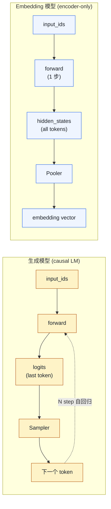
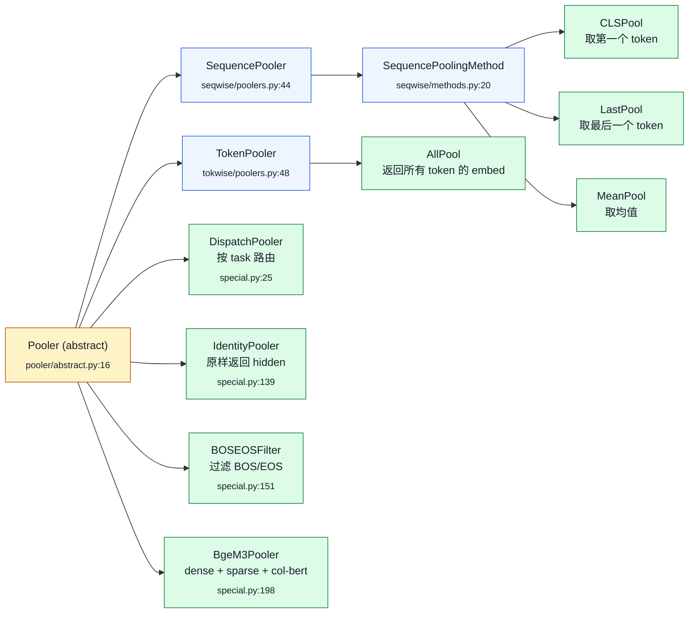
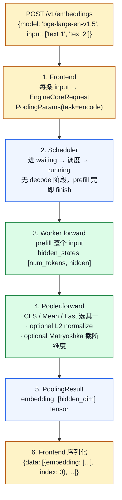

# 05. Embedding / Pooling 模型：vLLM 不只能做生成

> **谁该读这一篇？** 用 vLLM 替代 sentence-transformers 跑 embedding / reranker / 分类的应用开发者；做 RAG 后端的工程师。
>
> **前置阅读：** [`04-model-runner.md`](../03-code-walkthrough/04-model-runner.md)、[`01-sampling-and-logits.md`](./01-sampling-and-logits.md)（了解 sampling 这一支才能理解 pooling 是怎么替换的）
>
> **耗时：** 约 25 分钟
>
> **学完能：**
> 1. 解释 vLLM 跑 embedding 比 sentence-transformers 快的根因（batching / FlashAttn / 量化 / varlen）
> 2. 在 CLS / Mean / Last / All / Dispatch 五类 Pooler 中正确选型
> 3. 描述 BGE-M3 一次 forward 输出 dense+sparse+colbert 三种表示的实现
> 4. 区分 bi-encoder（embedding）与 cross-encoder（reranker）的部署方式

BGE、E5、Jina、bge-reranker、Qwen3-Embedding 这些模型在 vLLM 里能跑，且性能比 sentence-transformers 高几倍。原因：复用 vLLM 引擎（continuous batching + paged 注意 + 量化），只把 sampling 换成 pooling。涉及代码：`vllm/model_executor/layers/pooler/`、`vllm/v1/pool/`。

---

## 1. Embedding 与生成模型的差异



vLLM 的处理：

- engine / scheduler / KV manager / attention backend 全部复用
- 不走 sampling 路径，改走 pooling 路径
- 每个请求只算一次 prefill（无 decode），latency 主要看 prefill

---

## 2. Pooler 类层级

`vllm/model_executor/layers/pooler/`：



PoolerActivation（`activations.py:73`）后处理：

- `PoolerIdentity`：原样输出
- `PoolerNormalize`：L2 normalize（对 dot product / cosine 相似度必须做）
- `PoolerClassify` / `PoolerMultiLabelClassify`：分类头

---

## 3. 三种 pooling 方法该选哪个

| Pooling | 含义                    | 典型模型                |
| ------- | --------------------- | ------------------- |
| CLS     | 取 `[CLS]` token 的 hidden | BERT-style 分类、BGE-base |
| Mean    | 所有 token hidden 均值      | sentence-BERT、E5        |
| Last    | 最后一个 token              | 解码器风格 embedding（Llama-based） |

不同模型预训练时 pooling 是固定的，**用错就废**（输出向量没用）。vLLM 通过 `--task embed` 自动选，或 `pooling_type` 显式设。

---

## 4. PoolingParams：API 入口

`vllm/pooling_params.py`：

```python
@dataclass
class PoolingParams:
    additional_data: dict | None
    truncate_prompt_tokens: int | None
    output_kind: PoolingOutputKind
    # 部分模型支持 task 切换
    task: PoolingTask  # encode / classify / score / score_pairs / rerank
    softmax: bool | None
    activation: bool | None
    dimensions: int | None  # Matryoshka：截取前 N 维
```

OpenAI API `/v1/embeddings` 请求转成 `PoolingParams`，进 EngineCore。

---

## 5. 引擎层：Pool 替代 Sample

`vllm/v1/pool/` 包含 pool task 的 metadata + 后处理。

EngineCore 检测请求类型（generation vs pooling）：

- generation：走 Sampler
- pooling：走 Pooler

`vllm/v1/worker/gpu_model_runner.py` 的 `_get_sampling_or_pooling`：

```python
def execute_model(self, scheduler_output):
    ...
    hidden_states = self.model(...)

    if scheduler_output.has_pooling_requests:
        pooled = self.model.pooler(hidden_states, pooling_metadata)
        return ModelRunnerOutput(pooled_data=pooled, ...)
    else:
        logits = self.model.compute_logits(hidden_states, ...)
        sampled = self.sampler(logits, sampling_metadata)
        return ModelRunnerOutput(sampled_token_ids=sampled, ...)
```

一个 batch 通常**纯 generation 或纯 pooling**，混合较少（API 也不混合）。

---

## 6. 一次 embedding 请求生命周期



---

## 7. 为什么 vLLM 跑 embedding 比 sentence-transformers 快？

| 维度          | sentence-transformers | vLLM                       |
| ----------- | --------------------- | -------------------------- |
| Batching    | 用户自己组 batch          | continuous batching 自动     |
| Attention   | HF transformers 朴素   | FlashAttention v2/v3       |
| KV / 注意力 layout | 连续 padding         | varlen 不 pad              |
| 量化          | 手动 bitsandbytes      | FP8 / AWQ / GPTQ 一键        |
| 多并发         | 单 batch 等             | iteration-level 动态进出      |
| 多模型支持      | 每模型一个进程              | LoRA / pooling task 同 base 复用 |

实测在中等 batch 下 vLLM 跑 BGE-large 比 HF 实现快 3-5×。

---

## 8. BGE-M3：复合 pooler 范例

BGE-M3 输出 3 种表示：

- Dense（CLS pool + normalize）
- Sparse（每 token 计算稀疏权重）
- ColBERT（per-token embedding for late interaction）

`BgeM3Pooler`（`special.py:198`）继承 Pooler，**一次 forward 输出三种结果**：

```python
class BgeM3Pooler(Pooler):
    def forward(self, hidden_states, pooling_metadata):
        # Dense
        dense = cls_pool(hidden_states) → normalize
        # Sparse
        sparse_weights = softmax(linear(hidden_states))
        # ColBERT-style
        col_embeds = linear_col(hidden_states)
        return {"dense": dense, "sparse": sparse_weights, "colbert": col_embeds}
```

API 通过 `PoolingTask` 控制返回哪个。

---

## 9. Late Interaction（ColBERT）

`vllm/v1/pool/late_interaction.py` 实现 ColBERT 的 token-level 相似度。

给定 query embedding 形状 $[L_q, d]$ 和 doc embedding 形状 $[L_d, d]$（每行是一个 token 的 embedding），score 是 **MaxSim**——每个 query token 找它在 doc 里相似度最大的 token，再求和：

$$\text{score}(q, d) = \sum_{i=1}^{L_q} \max_{j=1, \ldots, L_d} \, q_i \cdot d_j$$

这是 reranker 模型（rerank-large、bge-reranker）的核心。vLLM 把 token-level pooling（`TokenPooler`，返回 all token embeds）+ 外部 score 算法分开。

---

## 10. 与 paged attention 的关系

Embedding 模型大多是 **encoder-only**（BERT 风格）：

- 无 causal mask
- 一次 forward 完成
- KV 用一次就丢

vLLM 的 attention backend 支持 `attn_type = "ENCODER_ONLY"`：

- 不写 KV cache
- 双向 attention（非 causal）
- 可以走 FlashAttention 的 bidirectional 模式

KV 不分块也不复用——单次 prefill 跑完即丢。PagedAttention 的 ref_cnt 此时其实没意义。

---

## 11. 工程要点

### 11.1 batch 设计
embedding 请求通常**短而多**（每条几十到几百 token）。max_num_batched_tokens 可以开大（16k+），充分发挥 prefill compute-bound 算力。

### 11.2 多 task 共存
DispatchPooler 让一个模型同时支持 encode / classify / score：

```python
class DispatchPooler(Pooler):
    def __init__(self, task_to_pooler: dict[PoolingTask, Pooler]):
        ...
    def forward(self, hidden, metadata):
        task = metadata.pooling_params.task
        return self.task_to_pooler[task](hidden, metadata)
```

### 11.3 Matryoshka 维度截取
`PoolingParams.dimensions = 256` → 取前 256 维。模型训练时已经把"最重要信号"放在前面（Matryoshka loss），用户根据延迟需求自选。

### 11.4 Rerank 部署
Reranker（cross-encoder）跟 embedding（bi-encoder）不一样：

- bi-encoder：分别 encode query / doc → 算相似度
- cross-encoder：拼接 `[CLS] query [SEP] doc` 一次 forward → 输出 score

vLLM 通过 `score` task + Classify head 做 reranker。

---

## 12. 面试常见追问

**Q: 为什么 BGE 在 vLLM 上比 sentence-transformers 快？**
A: ①continuous batching 跨请求合并 prefill；②FlashAttention 比朴素 attention 快几倍；③varlen 不 pad；④量化（FP8/INT8）开箱即用。

**Q: embedding 模型用得到 PagedAttention 吗？**
A: 用得到机制（注意力 kernel 一样），但前缀复用没意义（每个请求独立 encode 一次后扔）。Paged 主要价值是支持 varlen + 显存复用，对 embedding 还是有的。

**Q: BGE-M3 三个输出怎么在 vLLM 里实现？**
A: 用 BgeM3Pooler 一次 forward 同时产出 dense / sparse / colbert，PoolingParams.task 控制哪个返回给客户端。

**Q: Reranker 跟 embedding 怎么不同？**
A: Embedding 是 bi-encoder（独立 encode）；reranker 是 cross-encoder（拼接后一次 forward）。前者用 SequencePooler + classify activation 跑 (query, doc) 对，返回 0-1 score。

**Q: Embedding 服务的容量怎么估？**
A: 主要看 prefill TFLOPs。短文本（128 token）+ BGE-large（~300M 参数）单 H100 能跑 500-1000 req/s。max_num_batched_tokens 开到 32k 充分利用。

---

## 小结

- vLLM 把 sampling 换成 pooling 即可服务 embedding/分类/score 模型，复用 continuous batching + FlashAttn + 量化收益。
- Pooler 体系分 Sequence / Token / Dispatch / Identity / 复合（BgeM3）几类，预训练时定型，用错即废。
- PoolingParams 通过 `task`、`activation`、`dimensions`（Matryoshka）控制输出形态。
- BGE-M3 等复合模型靠定制 Pooler 一次 forward 输出 dense / sparse / colbert 三种表示。
- Encoder-only 模型走 `attn_type=ENCODER_ONLY`，KV 不写也不复用，注意力是双向的。

## 自检

1. 你拿到一个声称兼容 BERT 的 embedding 模型，怎么判断该用 CLS、Mean 还是 Last pool？
2. PoolingParams.dimensions=256 在 BGE-large 上意味着什么？为什么这能直接做？
3. 一个 RAG pipeline 想同时支持"找 top-k 向量"和"对 top-k rerank"，最少用几个 vLLM 实例？为什么？
4. 同一台 H100 上跑 BGE-large 与 Llama-70B，scheduler 会让它们共 batch 吗？为什么？

## 下一步

- 横向延展：[`02-system-design.md`](../06-interview/02-system-design.md)（用 embedding+生成模型一起设计 RAG）
- 想看源码：`vllm/model_executor/layers/pooler/`、`vllm/v1/pool/`、`vllm/pooling_params.py`、`vllm/model_executor/models/bert.py`
- 想从生产视角理解：[`08-production-deployment/04-autoscaling-and-capacity.md`](../08-production-deployment/04-autoscaling-and-capacity.md)（embedding 服务的容量规划与 GPU 选型）

---

## Sources

- `vllm/model_executor/layers/pooler/abstract.py:16`（Pooler）
- `vllm/model_executor/layers/pooler/seqwise/methods.py:36,50,60`（CLS/Last/Mean）
- `vllm/model_executor/layers/pooler/tokwise/methods.py`
- `vllm/model_executor/layers/pooler/activations.py:73,102,112`
- `vllm/model_executor/layers/pooler/special.py:25,198`（Dispatch / BgeM3）
- `vllm/v1/pool/late_interaction.py`、`metadata.py`
- `vllm/pooling_params.py`
- `vllm/model_executor/models/bert.py`、`bge_m3.py`、`jina_embeddings_v3.py`

---

## See also

- `04-optimizations/01-quantization.md` —— embedding 模型怎么量化
- `03-code-walkthrough/04-model-runner.md` —— pooling vs sampling 分支
- `06-interview/02-system-design.md` —— RAG 服务设计
