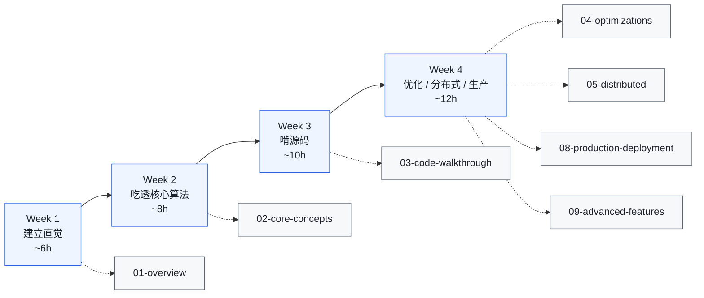

# vLLM 学习手册

[](https://github.com/jwzheng96/vllm-learning-book/actions/workflows/pages.yml)
[](https://jwzheng96.github.io/vllm-learning-book/)
[-1a4d80)](https://github.com/vllm-project/vllm/tree/27b85d2084c48f9b12f8cfd6638a56fe9b257635)

> 一份面向大模型推理岗的工程笔记。
> **46 章 · 14K+ 行**，从 PagedAttention 论文到 K8s 生产部署，覆盖整条链路。
> 每章都对照 vLLM 源码（`file_path:line_number`），可以"读笔记 ↔ 跳源码"无缝切换。
>
> 📖 在线阅读：**[jwzheng96.github.io/vllm-learning-book](https://jwzheng96.github.io/vllm-learning-book/)**

---

## 这份手册解决什么问题

如果你正在做下面这些事，这是为你写的：

- **求职准备**：刷面试题前想真把 vLLM 啃一遍，不再背"PagedAttention 解决了什么"。
- **业务接入**：要上线 LLM 推理服务，要选 v0/v1、调度策略、量化方案、部署架构。
- **性能优化**：TTFT/TPOT 不达标，需要从架构层定位到内核层逐级排查。
- **底层贡献**：想给 vLLM 提 PR，先得知道 scheduler / kv manager / attention backend 怎么咬合。

它**不**适合：完全没接触过 LLM 推理 → 先看 [`01-overview/00-prerequisites.md`](01-overview/00-prerequisites.md) 把前置概念铺平；纯 prompt engineer 不碰服务侧 → 这本太工程。

---

## 怎么用这份资料

**两种打开方式：**

| 方式 | 入口 | 适合 |
| --- | --- | --- |
| **Markdown 直接读** | 本 README.md → 按章节文件名跳转 | IDE 内阅读、对照源码、想在 GitHub 上读 |
| **HTML 在线版** | `python3 build_html.py` 后开 `vllm-learning-html/index.html` | 想要侧栏 + 全文搜索 + Mermaid 渲染 + 暗色主题 + 阅读时间提示 |

所有跨章链接、内嵌 Mermaid、代码块都在两种模式下都能用。HTML 版额外有 lunr.js 全文搜索和阅读时间估算。

**每章统一的结构：**

> **谁该读这一篇？** ...
> **前置阅读：** ...
> **耗时：** N 分钟
> **学完能：** ...

正文（含 mermaid / 表格 / 代码引用）

```
## 小结
## 自检（3-5 题，自答）
## 下一步（跳转推荐）
```

按这个节奏走，刷完整本约 25-35 小时（不含动手实验）。

---

## 学习路径



按章节顺序读最系统。时间紧时用"最短路径"：

| 投入时间 | 推荐路径 |
| --- | --- |
| 零基础 | 先读 [`01-overview/00-prerequisites.md`](01-overview/00-prerequisites.md)（前置概念）再走任何一条路径 |
| 1 天（~5h） | [`01-what-is-vllm`](01-overview/01-what-is-vllm.md) → [`02-architecture`](01-overview/02-architecture.md) → [`01-paged-attention`](02-core-concepts/01-paged-attention.md) → [`06-interview/01-common-questions`](06-interview/01-common-questions.md) |
| 1 周（~15h） | 精读 `01-overview/` + `02-core-concepts/`，跑通 `vllm` repo 的 `examples/offline_inference/basic.py` |
| 3-4 周（~35h） | 顺序读 01 → 09，每章配合源码对照（每章都标 `file_path:line_number`） |
| 面试速成（~8h） | [`01-what-is-vllm`](01-overview/01-what-is-vllm.md) → [`02-core-concepts/`](02-core-concepts/) 全部 → [`06-interview/`](06-interview/) 两篇 |
| 生产部署速成（~10h） | [`01-overview/02-architecture`](01-overview/02-architecture.md) → [`08-production-deployment/`](08-production-deployment/) 全部 |

---

## 章节索引（带钩子）

每章后面一句话告诉你为什么要读。

### 1. 总览 · `01-overview/` — 6 章

- [`00-prerequisites.md`](01-overview/00-prerequisites.md) — 🆕 token / KV cache / TTFT·TPOT / TP·PP·DP 一次铺平，零基础起点。
- [`01-what-is-vllm.md`](01-overview/01-what-is-vllm.md) — vLLM 是什么，为什么快，靠哪三大武器。
- [`02-architecture.md`](01-overview/02-architecture.md) — 三层进程、四个核心数据结构、一步推理的完整数据流。
- [`03-v0-vs-v1.md`](01-overview/03-v0-vs-v1.md) — V1 重构改了什么，为什么改。
- [`04-project-structure.md`](01-overview/04-project-structure.md) — 1700+ 文件按模块分类导航（这章很长，按需查阅）。
- [`05-process-and-ipc-internals.md`](01-overview/05-process-and-ipc-internals.md) — fork vs spawn / ZMQ ROUTER-DEALER / 共享内存 MessageQueue 零拷贝。

### 2. 核心概念 · `02-core-concepts/` — 5 章

- [`01-paged-attention.md`](02-core-concepts/01-paged-attention.md) — 用 OS 虚拟内存类比讲 paged KV cache + block table。
- [`02-continuous-batching.md`](02-core-concepts/02-continuous-batching.md) — 为什么 vLLM 不用 static batching，迭代级调度的两个前提。
- [`03-kv-cache-management.md`](02-core-concepts/03-kv-cache-management.md) — Block Pool / 引用计数 / preempt vs swap 策略。
- [`04-prefix-caching.md`](02-core-concepts/04-prefix-caching.md) — Merkle 链式 hash + extra_keys，多卡 / LoRA / 多模态怎么算。
- [`05-chunked-prefill.md`](02-core-concepts/05-chunked-prefill.md) — 长 prompt 怎么切才不卡 decode，`max-num-batched-tokens` 怎么调。

### 3. 源码走读 · `03-code-walkthrough/` — 8 章

- [`01-entry-points.md`](03-code-walkthrough/01-entry-points.md) — `LLM` / `AsyncLLM` / `EngineCore` 的调用链。
- [`02-scheduler.md`](03-code-walkthrough/02-scheduler.md) — `Scheduler.schedule()` 2300+ 行完整走读，token budget + preemption。
- [`02b-scheduling-policies.md`](03-code-walkthrough/02b-scheduling-policies.md) — FCFS vs PRIORITY、优先级反演、抢占代价量化。
- [`03-kv-cache-manager.md`](03-code-walkthrough/03-kv-cache-manager.md) — `allocate` / `free` / `hash` 的代码级细节。
- [`04-model-runner.md`](03-code-walkthrough/04-model-runner.md) — `execute_model`：输入拼装 / forward / sampler。
- [`05-attention-backends.md`](03-code-walkthrough/05-attention-backends.md) — FlashAttn / FlashInfer / Triton / MLA 怎么选。
- [`06-cuda-kernels.md`](03-code-walkthrough/06-cuda-kernels.md) — PagedAttention v1/v2、RoPE、RMSNorm CUDA 实现。
- [`07-model-architectures.md`](03-code-walkthrough/07-model-architectures.md) — MLA / Mamba / MoE / GQA 在源码层的差异。

### 4. 优化 · `04-optimizations/` — 4 章

- [`01-quantization.md`](04-optimizations/01-quantization.md) — FP8 / INT4 / AWQ / GPTQ / Marlin 的选型矩阵。
- [`02-speculative-decoding.md`](04-optimizations/02-speculative-decoding.md) — n-gram / EAGLE / Medusa / MTP 的取舍。
- [`03-cudagraph-and-compile.md`](04-optimizations/03-cudagraph-and-compile.md) — CUDA Graph + torch.compile 何时开 / 何时关 / 失败降级路径。
- [`04-compilation-internals.md`](04-optimizations/04-compilation-internals.md) — CompilerManager / VllmBackend / 自定义 pass 深度。

### 5. 分布式 · `05-distributed/` — 4 章

- [`01-tp-pp-ep.md`](05-distributed/01-tp-pp-ep.md) — TP 切法 / PP 流水气泡 / EP expert 负载均衡。
- [`02-disaggregated.md`](05-distributed/02-disaggregated.md) — Prefill/Decode 分离的数据流 + NIXL RDMA + 决策表。
- [`03-expert-parallel-deep-dive.md`](05-distributed/03-expert-parallel-deep-dive.md) — MoE AllToAll 6 个后端、EPLB、宽 EP 部署模式。
- [`04-context-parallel.md`](05-distributed/04-context-parallel.md) — PCP / DCP 双维度长上下文切分；MLA 模型 `a2a` backend 省 NCCL。

### 6. 面试 · `06-interview/` — 2 章

- [`01-common-questions.md`](06-interview/01-common-questions.md) — 30 道高频题 + 答题要点。
- [`02-system-design.md`](06-interview/02-system-design.md) — "设计一个推理服务"4 道题完整解题。

### 7. 实操 · `07-hands-on/` — 4 章

- [`01-setup.md`](07-hands-on/01-setup.md) — uv 环境 / 预编译 vs 源码 / GPU 检查。
- [`02-trace-a-request.md`](07-hands-on/02-trace-a-request.md) — debugger 跟一个请求从 HTTP 到 token。
- [`03-mini-experiments.md`](07-hands-on/03-mini-experiments.md) — 5 个动手实验（block_size / prefix hit / batching / 量化等）。
- [`04-profiling-and-debugging.md`](07-hands-on/04-profiling-and-debugging.md) — torch.profiler / NVTX / py-spy / 显存泄漏。

### 8. 生产部署 · `08-production-deployment/` — 9 章

- [`01-deployment-architectures.md`](08-production-deployment/01-deployment-architectures.md) — vLLM Production Stack / llm-d / AIBrix 三套参考栈对比。
- [`02-smart-routing-and-load-balancing.md`](08-production-deployment/02-smart-routing-and-load-balancing.md) — prefix-cache aware / session sticky / 负载打分。
- [`03-gateway-and-service-mesh.md`](08-production-deployment/03-gateway-and-service-mesh.md) — Istio + Gateway API Inference Extension + ExtProc。
- [`04-autoscaling-and-capacity.md`](08-production-deployment/04-autoscaling-and-capacity.md) — KEDA / 容量公式 / 冷启动 / 优雅 drain。
- [`05-slo-and-observability.md`](08-production-deployment/05-slo-and-observability.md) — TTFT/TPOT/p99 SLO + Prometheus + OTel。
- [`06-reliability-and-failure-modes.md`](08-production-deployment/06-reliability-and-failure-modes.md) — 8 个失效模式与防护。
- [`07-incident-playbook.md`](08-production-deployment/07-incident-playbook.md) — 8 个真实故障 runbook。
- [`08-monitoring-cookbook.md`](08-production-deployment/08-monitoring-cookbook.md) — 可直接抄走的 PromQL / 告警规则 YAML / Grafana dashboard 骨架。
- [`09-vllm-doctor-skill.md`](08-production-deployment/09-vllm-doctor-skill.md) — 把 06-07-08 章人工流程编成 agent 自动跑：7 阶段工作流 + 决策树 + 三级整改 + 离线 dry-run。

### 9. 应用特性 · `09-advanced-features/` — 5 章

- [`01-sampling-and-logits.md`](09-advanced-features/01-sampling-and-logits.md) — top-k/p / temperature / DRY / logprobs / penalties。
- [`02-structured-output.md`](09-advanced-features/02-structured-output.md) — xgrammar / llguidance / outlines 后端对比 + JSON schema。
- [`03-multimodal.md`](09-advanced-features/03-multimodal.md) — 图像/视频/音频编码器、encoder cache、Qwen2-VL。
- [`04-lora-serving.md`](09-advanced-features/04-lora-serving.md) — LoRAModelManager / Punica / 多 LoRA batching。
- [`05-embedding-and-pooling.md`](09-advanced-features/05-embedding-and-pooling.md) — BGE / E5 / BGE-M3 / 复用 vLLM 引擎做 embedding。

---

## vLLM 仓库地标速查

| 想知道什么 | 去哪里看 |
| --- | --- |
| 用户怎么调用 vLLM | `vllm/entrypoints/llm.py`、`vllm/entrypoints/openai/api_server.py` |
| 引擎主循环 | `vllm/v1/engine/core.py`、`vllm/v1/engine/llm_engine.py` |
| 调度器（决定本步跑哪些请求） | `vllm/v1/core/sched/scheduler.py`（2300+ 行，全核心） |
| KV cache 块管理 | `vllm/v1/core/kv_cache_manager.py`、`block_pool.py` |
| Prefix caching hash | `vllm/v1/core/kv_cache_utils.py:541` (`hash_block_tokens`) |
| Model runner（前向） | `vllm/v1/worker/gpu_model_runner.py` |
| Attention 后端选择 | `vllm/v1/attention/backends/`（FlashAttn / FlashInfer / Triton / MLA） |
| PagedAttention CUDA | `csrc/attention/` |
| 模型实现 | `vllm/model_executor/models/`（llama.py、qwen.py … 共 292 个） |
| 张量并行 / 集合通信 | `vllm/distributed/parallel_state.py` |
| 量化 | `vllm/model_executor/layers/quantization/` |
| 投机解码 | `vllm/v1/spec_decode/` |
| 采样 | `vllm/v1/sample/`、`csrc/sampler.cu` |
| KV transfer（disaggregated）| `vllm/distributed/kv_transfer/`、`vllm/v1/kv_offload/` |

完整地图见 [`01-overview/04-project-structure.md`](01-overview/04-project-structure.md)。

---

## 学习方法（5 条铁律）

1. **概念落到代码。** 不看博客的二手解读，源码才是唯一真相。
2. **先看数据契约，再看内部。** 读 Scheduler 之前先看 `SchedulerOutput` 的字段；读 KV manager 之前先看 `KVCacheBlocks` 的形状。
3. **打 print 比读注释快。** 用 `LLM("facebook/opt-125m").generate(...)` 给 Scheduler、KVCacheManager 各加一句 print，跑一次就懂。
4. **三张图刻进脑子。** 请求生命周期、KV 物理↔逻辑映射、Scheduler 一步内的决策流。每张都自己画一遍。
5. **永远做对比。** 讲 vLLM 的优势，必须能讲清"HF Transformers 是怎么做的、为什么慢"。

---

## 面试自检清单

读完整套笔记后，下面每个问题应该能在 1-2 分钟内讲清，并指出对应源码位置：

- 为什么 PagedAttention 能把吞吐提升 24×？瓶颈在哪？
- vLLM 的 KV block 默认 16 token 是怎么选的？太大太小各有什么问题？
- Continuous batching 和 static batching 的本质区别？为什么 GPU 利用率提升？
- Prefix caching 的 hash 怎么算？怎么避免冲突？多模态怎么处理？
- Chunked prefill 解决了什么？为什么 V1 默认开启？
- Tensor parallel 在 MLP 用 column → row 的原因？AllReduce 落在哪？
- Speculative decoding 的接受率怎么算？拒绝采样的数学推导写一遍。
- FP8 / INT8 / INT4 各自的精度损失主要发生在哪？
- V0 → V1 重构的三个最大改变是什么？为什么这么改？
- KV 不够时怎么处理？V1 默认 recompute 还是 swap，为什么？

每题都有专门展开，见 [`06-interview/`](06-interview/)。

---

## 必读资料

按阅读顺序：

1. **PagedAttention 论文** — Kwon et al., *Efficient Memory Management for LLM Serving with PagedAttention*, SOSP 2023。先读这篇，再读代码。
2. **Continuous Batching 博客** — Anyscale, *How Continuous Batching Enables 23× Throughput*。
3. **vLLM 官方文档** — https://docs.vllm.ai/ ，重点看 design / kernel 章节。
4. **FlashAttention v1/v2/v3** — 理解 SRAM tiling 的关键。
5. **Speculative Decoding 论文** — Leviathan et al., 2023, *Fast Inference from Transformers via Speculative Decoding*。
6. **EAGLE / MTP** — 当下最强的投机方案系列。

---

## 构建与部署

把这份手册转成 HTML 网站、PDF、EPUB，或者部署到 GitHub Pages，看 [`DEPLOY.md`](DEPLOY.md)。一键命令（脚本会自动用项目相对路径，不再依赖固定位置）：

```bash
python3 build_html.py      # → ../vllm-learning-html/  (含搜索 + 暗黑切换 + Mermaid + 阅读时间)
python3 build_pdf_epub.py  # → ../vllm-learning-html/vllm-learning.pdf + .epub
./deploy_gh_pages.sh <repo-url>
```

如果你想把材料放别处，设环境变量 `VLLM_LEARNING_SRC` / `VLLM_LEARNING_DST` 即可。

---

## 自动排障 Skill：`vllm-doctor`

仓库内置了一个 Claude Code skill `vllm-doctor`，把第 06-07-08 章里散落的 incident playbook 编成 agent 可以自动跑的 7 阶段流程：环境探测 → 拉 Golden 3 指标 → 决策树路由 → 深度诊断 → 分级整改（L1/L2 自动跑，L3 弹确认）→ 恢复验证 → 输出报告。

**安装到本地 Claude Code**：

```bash
cp -r .claude/skills/vllm-doctor ~/.claude/skills/
```

**触发**：在 Claude Code 里输入 `/vllm-doctor`（前置必须 export `VLLM_NAMESPACE` / `PROM_URL` / `KUBECONFIG`）。

**不连集群也想验证逻辑**：

```bash
export VLLM_DOCTOR_FIXTURE=/path/to/golden3.json   # 跳过 Prometheus，直接喂 mock 数据
```

覆盖的 8 类事故：KV 抢占级联、NCCL hang、GPU OOM、客户端重试雪崩、prefix cache 命中率塌方、冷启动、输出质量异常、LoRA 适配器抖动。完整说明见 [`.claude/skills/vllm-doctor/SKILL.md`](.claude/skills/vllm-doctor/SKILL.md)。

---

## 贡献与扩展

发现 `file_path:line_number` 失效了？vLLM 主分支变化快，欢迎 PR 修正。

想新加一章？沿用每章统一的"章首导读 + 正文 + 小结/自检/下一步"模板（任意章可作范例）。

---

**开始读 [`01-overview/01-what-is-vllm.md`](01-overview/01-what-is-vllm.md)。** 或者从 [`00-prerequisites.md`](01-overview/00-prerequisites.md) 铺前置。
